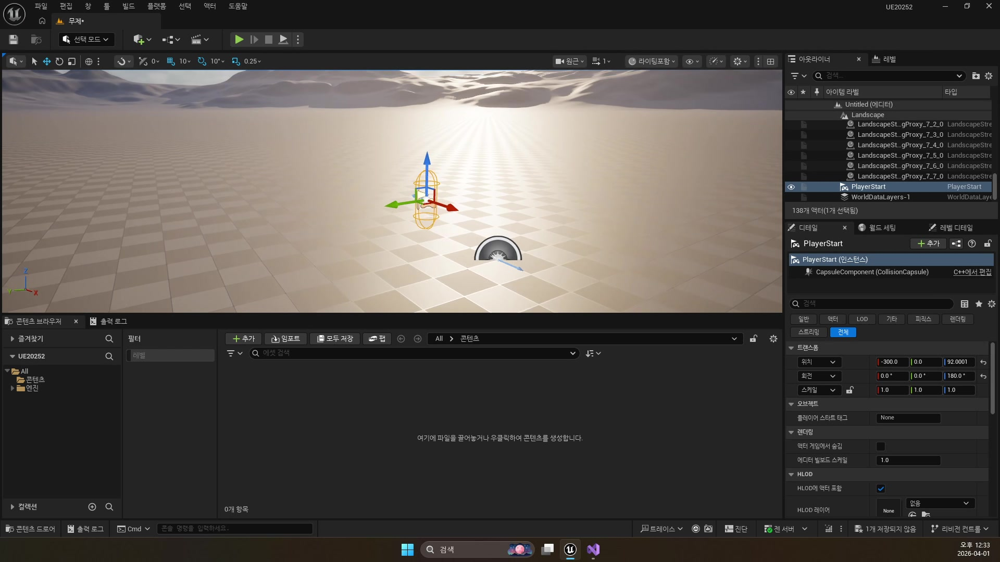
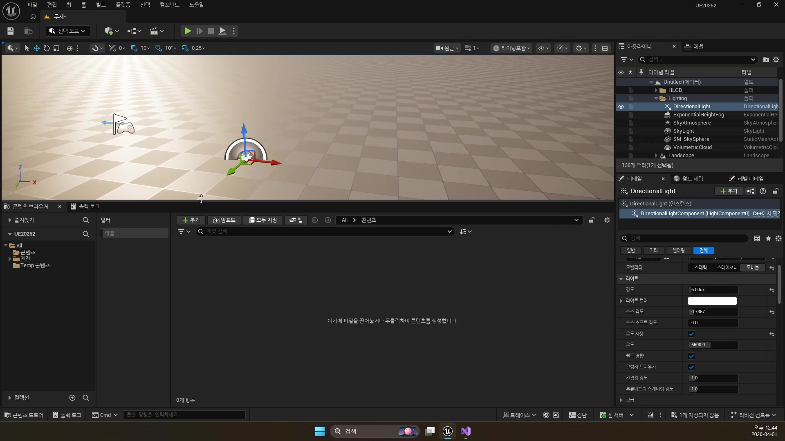
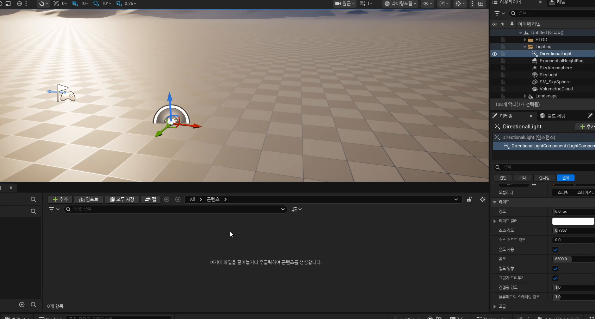

# 초급 2편. 언리얼 에디터 기본 패널 읽기

[이전: 초급 1편](../01_beginner_project_creation/) | [허브](../) | [다음: 초급 3편](../03_beginner_class_structure_and_blueprint_classes/)

## 이 편의 목표

이 편에서는 강의 화면에 계속 등장하는 `Viewport`, `Outliner`, `Details`, `Content Browser`, `Play`를 단순 UI 이름이 아니라 월드 편집 도구로 읽는 감각을 정리한다.
핵심은 언리얼 에디터가 하나의 창이 아니라 역할이 나뉜 작업 패널들의 조합이라는 점이다.

## 봐야 할 자료

- `D:\UE_Academy_Stduy_compressed\260401_2_언리얼 에디터.mp4`

## 전체 흐름 한 줄

`Viewport에서 월드를 본다 -> Outliner에서 액터를 찾는다 -> Details에서 속성을 바꾼다 -> Content Browser에서 에셋을 관리한다 -> Play로 즉시 검증한다`

## `Viewport`는 미리보기 창이 아니라 월드 편집 공간이다

강의에서 가장 먼저 익혀야 하는 패널은 `Viewport`다.
언리얼은 월드를 코드로만 조작하는 엔진이 아니라, 월드 자체를 에디터에서 직접 선택하고 이동하고 회전시키는 엔진이기 때문이다.

여기서 가장 먼저 몸에 익히면 좋은 단축키는 아래 세 가지다.

- `W`
  이동
- `E`
  회전
- `R`
  스케일

이 세 기즈모 조작은 뒤의 레벨 배치, 스폰 포인트 수정, 트리거 볼륨 작업까지 계속 반복된다.

## 정밀 배치에서는 Snap, `End`, `Alt + Drag`가 큰 차이를 만든다

강의 중반은 단순 기즈모 소개를 넘어 실제 레벨 작업에서 자주 쓰는 편의 기능까지 설명한다.

- 그리드/회전 스냅
- `End`
  바닥에 붙이기
- `Alt + Drag`
  복제하면서 이동
- `Ctrl + Z`
  실행 취소

이 기능들은 입문 단계에서는 사소해 보여도, 액터 수가 늘어날수록 작업 속도를 크게 좌우한다.

## `Outliner`와 `Details`는 항상 짝으로 읽는 편이 좋다

`Outliner`는 현재 월드에 배치된 액터 목록이고, `Details`는 지금 선택한 액터 하나의 속성 창이다.
이 둘을 구분하면 화면이 갑자기 훨씬 읽히기 쉬워진다.

- 액터를 찾는다
  `Outliner`
- 액터의 위치, 회전, 컴포넌트 속성을 바꾼다
  `Details`

강의에서 `Directional Light`를 선택해 디테일을 보여 주는 장면도 결국 이 기본 흐름을 설명하는 예시다.

## `Content Browser`는 에셋과 월드 편집을 이어 주는 창이다

입문 강의에서는 `Viewport`, `Outliner`, `Details`가 더 눈에 띄지만, 실제 작업에서는 `Content Browser`도 같은 수준으로 중요하다.
월드 배치와 에셋 관리를 분리해서 읽기 시작하는 순간, 언리얼 화면이 훨씬 덜 복잡해진다.

`Content Browser`는 다음 역할을 맡는다.

- 블루프린트 클래스 찾기
- 메시, 머티리얼, 애니메이션 자산 관리
- 새 자산 생성
- 월드에 배치할 대상 탐색

즉 강의에서 “무언가를 만들었다”는 말은 대개 `Content Browser`에 새 자산이 생겼다는 뜻과 함께 읽어야 한다.

## `Play` 버튼은 확인 단계가 아니라 짧은 디버깅 루프의 입구다

언리얼 작업은 “오랫동안 만든 뒤 마지막에 한 번 실행”하는 방식보다, 짧게 수정하고 바로 실행해 확인하는 루프에 가깝다.

- 액터를 배치한다
- 속성을 수정한다
- `Play`로 바로 확인한다
- 결과가 이상하면 다시 돌아와 고친다

이 감각은 뒤의 플레이어, 충돌, 발사체, AI 강의에서도 그대로 이어진다.

## 이 편의 핵심 정리

1. `Viewport`는 단순 미리보기 창이 아니라 월드 편집 공간이다.
2. `Outliner`는 액터 목록, `Details`는 선택한 액터의 속성 창이다.
3. `Content Browser`는 에셋 관리와 월드 편집을 이어 준다.
4. `Play`는 시연 버튼이 아니라 빠른 검증과 디버깅 루프의 입구다.

## 다음 편

[초급 3편. 클래스 구조와 블루프린트 클래스](../03_beginner_class_structure_and_blueprint_classes/)

