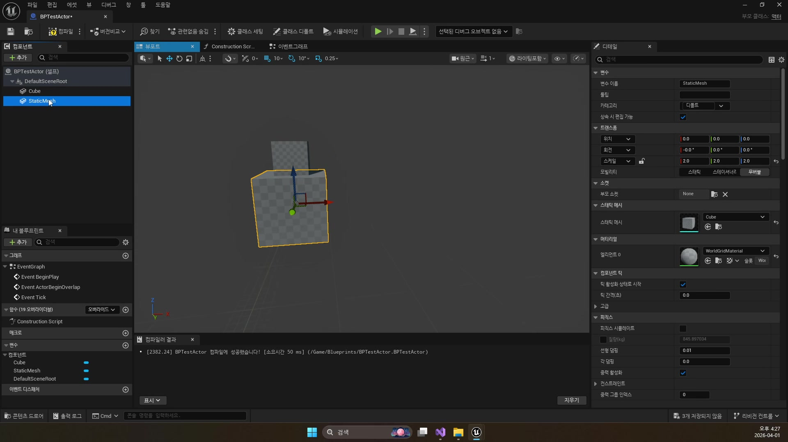
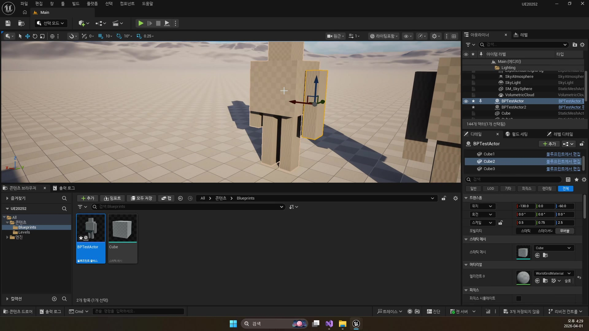

# 초급 3편. 클래스 구조와 블루프린트 클래스

[이전: 초급 2편](../02_beginner_unreal_editor_basics/) | [허브](../) | [다음: 초급 4편](../04_beginner_blueprint_programming_basics/)

## 이 편의 목표

이 편에서는 `UObject`, `Actor`, `Component`, `Pawn`, `Character`, `GameMode`, `PlayerController`, `Blueprint Class`를 역할 중심으로 다시 정리한다.
핵심은 언리얼 객체 구조와 블루프린트가 분리된 개념이 아니라, 같은 시스템을 다른 각도에서 보는 방식이라는 점이다.

## 봐야 할 자료

- `D:\UE_Academy_Stduy_compressed\260401_3_언리얼 클래스 구조와 블루프린트 클래스.mp4`
- `D:\UnrealProjects\UE_Academy_Stduy\Source\UE20252\Player\PlayerCharacter.h`
- `D:\UnrealProjects\UE_Academy_Stduy\Source\UE20252\Monster\MonsterBase.h`

## 전체 흐름 한 줄

`UObject -> Actor / Component -> Pawn / Character -> GameMode / PlayerController -> Blueprint Class`

## 언리얼 객체는 결국 `UObject`에서 시작한다

강의가 `UObject`부터 설명하는 이유는 단순 상속도 암기를 시키려는 것이 아니다.
언리얼에서 우리가 다루는 클래스와 에셋, 블루프린트 대부분이 결국 엔진이 관리하는 객체라는 감각을 먼저 심어 두기 위해서다.

즉 `UObject`는 “꼭대기 클래스 이름”보다, 언리얼 객체 생태계의 기반으로 이해하는 편이 맞다.

## `Actor`와 `Component`는 역할이 다르다

이 편에서 가장 중요한 구분은 이것이다.

- `Actor`
  월드에 배치되는 단위
- `Component`
  액터에 붙어 기능을 제공하는 단위
- `SceneComponent`
  위치와 회전을 가져 계층 구조를 만들 수 있는 컴포넌트

이 구분을 이해하면, “보이는 것”과 “기능을 제공하는 것”이 항상 같은 클래스가 아니라는 점이 또렷해진다.

## `Pawn`과 `Character`는 조종 가능성과 기본 부품에서 갈라진다

강의가 `Actor -> Pawn -> Character` 축을 따로 설명하는 이유도 여기 있다.
`Pawn`은 컨트롤러가 빙의해 조종할 수 있는 대상이고, `Character`는 그중에서도 인간형 이동과 캡슐, 메시, 이동 기능이 이미 붙은 더 무거운 베이스다.


현재 프로젝트 `UE20252`에서도 이 구조는 그대로 보인다.

```cpp
class UE20252_API APlayerCharacter : public ACharacter,
    public IGenericTeamAgentInterface

class UE20252_API AMonsterBase : public APawn,
    public IGenericTeamAgentInterface,
    public IMonsterState
```

플레이어는 `Character`, 몬스터는 `Pawn`을 쓰는 지금 프로젝트 구조가 바로 이 강의 설명의 실전판이다.

## `GameMode`와 `PlayerController`는 규칙과 조종을 나눈다

입문자는 종종 플레이어 클래스 하나가 모든 걸 담당한다고 생각하기 쉽다.
하지만 언리얼은 조종 대상과 조종 주체, 그리고 월드 기본 규칙을 분리한다.

- `GameMode`
  이 월드의 기본 규칙
- `PlayerController`
  입력과 빙의를 맡는 조종 주체
- `Pawn / Character`
  실제로 조종당하는 몸체

그래서 뒤의 프로젝트 소스에서 `DefaultPawnClass`, `PlayerControllerClass`가 따로 보이는 것이다.

## 블루프린트 클래스는 클래스 구조 위에서 동작하는 시각적 편집기다

블루프린트는 코드 대신 쓰는 장난감이 아니라, 언리얼 클래스 시스템 위에 올라가는 시각적 편집 레이어다.

- 컴포넌트 트리를 시각적으로 조립할 수 있고
- 변수 기본값을 디테일 패널에서 조정할 수 있고
- 이벤트 그래프에서 로직을 노드로 연결할 수 있다



즉 블루프린트 클래스는 여전히 “클래스”다.
표현 방식만 그래프와 패널 중심일 뿐이다.

## 블루프린트 액터를 월드에 배치하는 순간, 클래스와 월드 개념이 연결된다

강의 후반에 만든 블루프린트 액터를 레벨에 직접 배치하는 장면이 중요한 이유도 여기에 있다.

- 클래스는 블루프린트 편집기에서 정의된다
- 인스턴스는 월드에 배치된다
- 배치된 액터는 `Outliner`와 `Details`에서 관리된다



즉 에디터에서 보던 패널 구조와 클래스 구조는 따로 노는 것이 아니라, 한 시스템의 서로 다른 면이다.

## 현재 프로젝트와 함께 읽으면 더 잘 보이는 예시

첫날 테스트 자산 기준으로는 `BPTestPlayer`, `BPTestActor`, `BPTestMove`, `BPMainGameMode`가 이 개념을 가장 단순하게 보여 준다.
현재 프로젝트 기준으로는 `APlayerCharacter`, `AMonsterBase`, `ADefaultGameMode`, `AMainPlayerController`, `AShinbi`가 같은 개념을 C++와 실전 자산 쪽으로 확장한 형태다.

즉 `260401`은 뒤 날짜와 분리된 입문 이론이 아니라, 이후 모든 강의의 클래스 해설을 미리 읽는 첫 장이라고 보면 된다.

## 이 편의 핵심 정리

1. 언리얼 객체는 `UObject` 기반 위에 올라간다.
2. `Actor`는 월드 단위, `Component`는 기능 단위다.
3. `Pawn`은 조종 가능한 대상, `Character`는 인간형 이동용 기본 부품이 붙은 `Pawn`이다.
4. `GameMode`는 월드 규칙, `PlayerController`는 조종 주체다.
5. 블루프린트 클래스는 언리얼 클래스 시스템의 시각적 편집 레이어다.

## 다음 편

[초급 4편. 블루프린트 기초 프로그래밍](../04_beginner_blueprint_programming_basics/)

