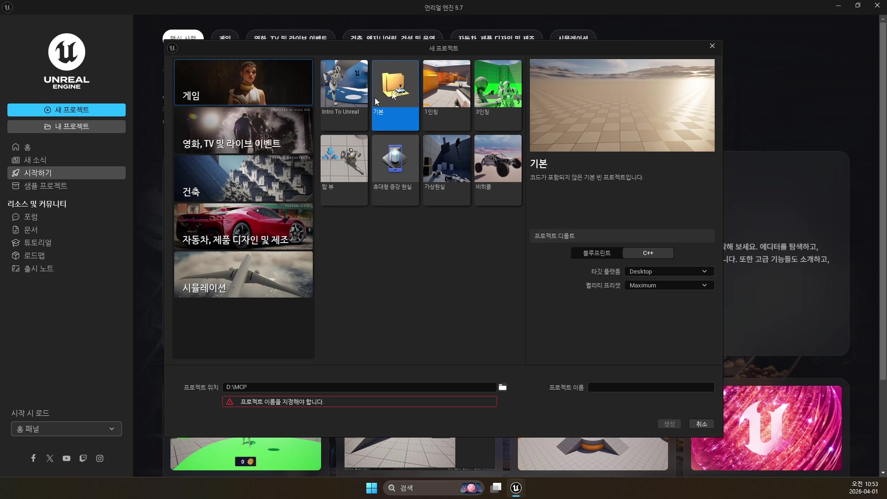
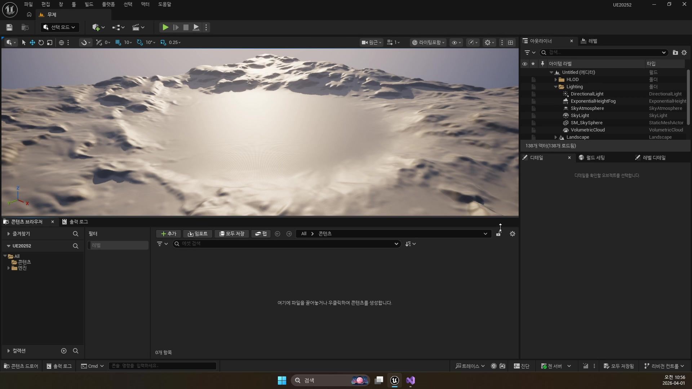
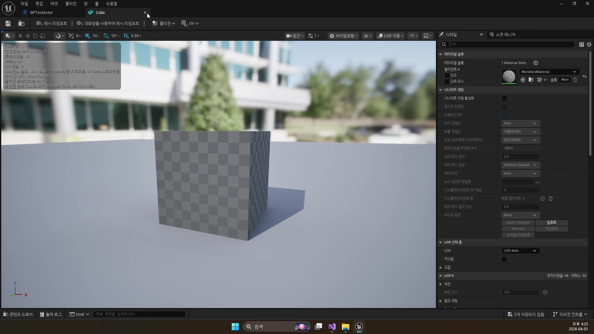
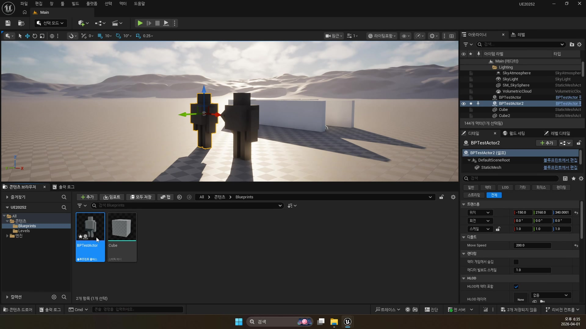
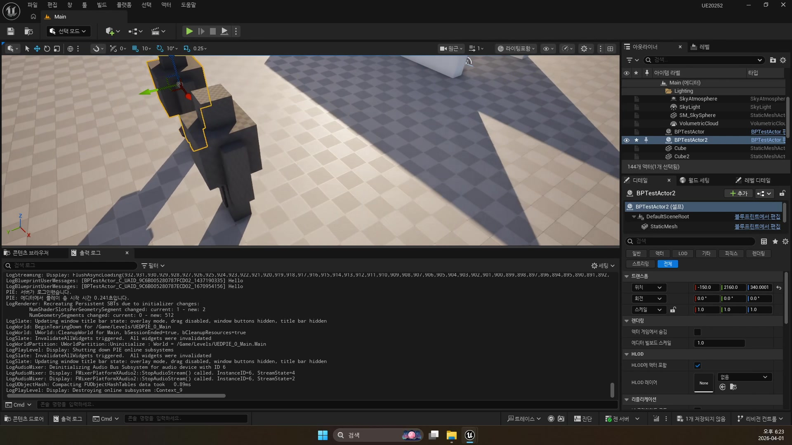

# 260401 언리얼 프로젝트를 처음 만들고 에디터 화면, 클래스 구조, 블루프린트 기초를 익히는 입문

## 문서 개요

이 문서는 `260401_1_언리얼 프로젝트 생성`, `260401_2_언리얼 에디터`, `260401_3_언리얼 클래스 구조와 블루프린트 클래스`, `260401_4_블루프린트 기초 프로그래밍`을 하나의 연속된 교재로 다시 정리한 것이다.
이번 날짜의 핵심은 기능 구현보다 먼저, 언리얼 엔진이 어떤 단위로 프로젝트를 만들고, 에디터에서 그것을 어떻게 다루며, 클래스와 블루프린트가 어떤 관계를 가지는지 이해하는 데 있다.
그리고 이번 정리본에서는 여기에 더해, 현재 프로젝트 `D:\UnrealProjects\UE_Academy_Stduy\Source\UE20252` 안의 실제 C++ 코드를 함께 읽으면서 첫날 개념이 실전 소스에서 어떤 모습으로 나타나는지도 자세히 연결한다.

강의 흐름을 한 줄로 요약하면 다음과 같다.

`프로젝트 생성 규칙 -> 에디터 패널 읽기 -> UObject / Actor / Pawn / Character 구조 -> 블루프린트 기초 로직 -> 실제 C++ 코드로 다시 읽기`

즉 `260401`은 뒤의 플레이어, 발사체, 충돌, AI 강의보다 먼저 읽혀야 하는 가장 바닥의 문법 정리다.
이 날짜를 건너뛰면 블루프린트 노드만 따라칠 수는 있어도, 왜 어떤 기능은 `Actor`에 들어가고 어떤 기능은 `Component`에 들어가며, 왜 플레이어는 `Character`를 쓰고 어떤 적은 `Pawn`을 쓰는지 구조적으로 이해하기 어렵다.

이 교재는 다음 자료를 함께 대조해 작성했다.

- `D:\UE_Academy_Stduy_compressed`의 원본 영상과 자막
- 원본 MP4에서 다시 추출한 대표 장면 캡처
- `D:\UnrealProjects\UE_Academy_Stduy\Source\UE20252`의 실제 C++ 소스
- `D:\UnrealProjects\UE_Academy_Stduy\Saved\AcademyUtility`에 덤프한 `BPTestActor`, `BPTestMove`, `BPTestPlayer`, `BPMainGameMode`, `PlayerCharacter`, `MonsterBase`, `Shinbi` 자료
- Epic Developer Community의 언리얼 공식 문서

## 학습 목표

- 새 언리얼 프로젝트를 만들 때 템플릿, `Blueprint / C++`, 경로, 이름 설정이 왜 중요한지 설명할 수 있다.
- `Viewport`, `Outliner`, `Details`, `Content Browser`, `Play` 버튼이 에디터에서 각각 어떤 역할을 하는지 말할 수 있다.
- `UObject`, `Actor`, `ActorComponent`, `SceneComponent`, `Pawn`, `Character`, `GameMode`, `PlayerController`의 관계를 큰 틀에서 정리할 수 있다.
- 블루프린트 클래스가 “코드를 안 쓰는 대체재”가 아니라 언리얼의 클래스 시스템 위에서 동작하는 시각적 스크립팅이라는 점을 설명할 수 있다.
- `BeginPlay`, `Tick`, 실행 핀, 데이터 핀, 변수, `Delta Seconds`, `AddActorWorldOffset`가 블루프린트 기초 프로그래밍에서 어떤 의미를 가지는지 이해할 수 있다.
- 언리얼 공식 문서의 `Create your First Project`, `Unreal Editor Interface`, `Introduction to Blueprints`, `Reflection System`, `Actors Reference`, `Gameplay Framework`가 왜 이 첫날 내용과 바로 이어지는지 설명할 수 있다.
- `APlayerCharacter`, `AMonsterBase`, `ADefaultGameMode`, `AMainPlayerController`, `AShinbi` 코드를 보고 첫날 개념이 실제 C++에서 어떻게 보이는지 읽을 수 있다.

## 강의 흐름 요약

1. 프로젝트 브라우저에서 템플릿을 살펴보고, `Blueprint`와 `C++` 프로젝트의 차이, 경로와 이름 규칙을 익힌다.
2. 에디터의 기본 패널과 조작 단축키를 익혀, 월드에 액터를 배치하고 수정하는 방법을 이해한다.
3. `UObject`에서 시작해 `Actor`, `Component`, `Pawn`, `Character`, `GameMode`, `PlayerController`로 이어지는 언리얼 클래스 구조를 정리한다.
4. 마지막으로 블루프린트에서 `Tick`과 변수, 이동 노드, `Delta Seconds`를 이용해 가장 기초적인 게임 로직 작성 방식을 배운다.
5. 언리얼 공식 문서를 통해 위 개념들이 엔진 표준 용어로 어떻게 정리되는지 확인한다.
6. 현재 프로젝트의 실제 C++ 코드를 읽으며, 위 개념들이 `UE20252` 소스 안에서 어떤 형태로 구현되어 있는지 확인한다.

---

## 제1장. 언리얼 프로젝트 생성: 시작점의 선택이 왜 중요한가

### 1.1 첫 강의의 핵심은 “프로젝트를 여는 법”이 아니라 “프로젝트를 잘 시작하는 법”이다

강의는 언리얼을 처음 켠 뒤 프로젝트 브라우저를 보는 데서 시작한다.
겉으로 보면 단순한 입문 화면 설명 같지만, 실제로는 이후 수업 전체의 작업 습관을 정하는 시간에 가깝다.
어떤 템플릿을 고를지, `Blueprint`로 시작할지 `C++`로 시작할지, 프로젝트를 어느 폴더에 둘지 같은 선택이 모두 이후 빌드와 협업, 소스 관리에 직접 영향을 주기 때문이다.

자막에서도 이 부분을 가볍게 넘기지 않는다.
템플릿은 단순 예제가 아니라 “기본 구조를 가진 출발점”이고, 프로젝트 경로와 이름은 나중에 파일 시스템과 툴체인 문제를 줄이기 위한 규칙이라는 점을 분명히 짚는다.



### 1.2 템플릿은 학습용 발판이지 최종 구조가 아니다

강의에서는 여러 템플릿을 한 번씩 열어 보라고 권한다.
이 말은 매우 중요하다.
언리얼 템플릿은 “바로 쓸 정답 프로젝트”라기보다, 각 장르에서 기본적으로 어떤 액터와 입력, 카메라, 맵 구성이 들어가는지 보여 주는 학습 샘플에 가깝기 때문이다.

예를 들어:

- `Blank`: 거의 비어 있는 시작점
- `First Person`: 1인칭 카메라와 기본 조작
- `Third Person`: 3인칭 캐릭터와 추적 카메라
- 기타 템플릿: 특정 장르나 제작 목적에 맞춘 기본 구조

즉 템플릿을 고르는 일은 “내가 어떤 게임을 만들 것인가”를 미리 규정하는 것이 아니라, “어떤 기본 구성을 참고하면서 출발할 것인가”를 정하는 일이라고 보는 편이 정확하다.

### 1.3 Blueprint와 C++는 양자택일이 아니라 함께 쓰는 두 층이다

프로젝트 브라우저 오른쪽에는 `Blueprint`와 `C++`를 고르는 옵션이 있다.
강의가 이 부분을 길게 설명하는 이유는, 초보자가 둘을 서로 배타적인 선택지로 오해하기 쉽기 때문이다.

자막의 설명을 정리하면 다음과 같다.

- `Blueprint`: 언리얼이 제공하는 비주얼 스크립팅
- `C++`: 성능과 구조 제어가 더 강한 코드 기반 구현
- 실제 프로젝트: 둘을 섞어서 사용 가능

즉 `Blueprint` 프로젝트로 만들었다고 해서 C++를 못 쓰는 것도 아니고, `C++` 프로젝트로 만들었다고 해서 블루프린트를 못 쓰는 것도 아니다.
이번 강의 묶음이 결국 둘을 모두 다루는 이유도 여기에 있다.

현재 `UE20252` 소스를 봐도 이 구조는 그대로 유지된다.
예를 들어 `ADefaultGameMode`는 C++ 클래스지만, 이 클래스가 월드에 붙는 흐름과 블루프린트 자산 활용은 함께 굴러간다.

```cpp
// 이 맵에서 기본으로 줄 플레이어 Pawn
DefaultPawnClass = AShinbi::StaticClass();
// 그 플레이어를 조종할 컨트롤러
PlayerControllerClass = AMainPlayerController::StaticClass();
```

반대로 첫날 실습용 블루프린트 축에서는 `BPMainGameMode`가 같은 역할을 더 단순한 형태로 보여 준다.
여기서는 기본 폰이 `BPTestPlayer`, 컨트롤러가 기본 `PlayerController`로 잡혀 있다.
즉 `Blueprint`와 `C++`는 표현 방식이 다를 뿐, 월드 규칙을 정하고 기본 플레이어를 연결하는 책임 자체는 동일하다.

즉 언리얼에서 `C++와 블루프린트`는 경쟁 관계가 아니라 역할 분담 관계다.

### 1.4 경로와 이름 규칙은 사소한 팁이 아니라 실무 안전장치다

이 강의에서 가장 실전적인 조언 중 하나는 프로젝트 경로와 이름에 관한 것이다.
자막에서는 한글 경로를 피하고, 바탕화면 같은 애매한 위치를 사용하지 말라고 강하게 말한다.
이 조언은 단순 취향 문제가 아니다.

프로젝트 경로가 길거나, 공백과 비ASCII 문자가 섞이거나, 사용자별 임시 위치에 놓이면 다음과 같은 문제가 생길 수 있다.

- Visual Studio 및 빌드 툴 경로 인식 문제
- 플러그인과 외부 라이브러리 경로 문제
- 협업 시 동일한 폴더 규칙 유지 어려움
- 백업과 버전 관리 혼선

즉 프로젝트 시작 단계에서의 폴더 규칙은 나중에 소스가 커질수록 더 큰 차이를 만든다.

### 1.5 언리얼 프로젝트 생성은 엔진 프로젝트와 IDE 프로젝트를 동시에 만든다

강의 후반에서는 프로젝트를 생성하면 비주얼 스튜디오 솔루션도 같이 준비된다는 점을 짚는다.
이 포인트는 입문자에게 특히 중요하다.
언리얼 프로젝트는 단순한 “에셋 폴더”가 아니라, 에디터와 C++ 빌드 시스템이 함께 묶인 작업 단위이기 때문이다.

즉 `.uproject` 파일만 있는 것이 아니라, 필요에 따라 솔루션과 빌드 파일, 소스 디렉터리 구조가 함께 엮인다.
그래서 첫날부터 경로와 이름을 바르게 잡아야, 뒤에서 C++ 클래스를 추가할 때도 문제가 줄어든다.



### 1.6 장 정리

제1장의 결론은 언리얼 프로젝트를 만드는 일은 단순 클릭 절차가 아니라, 이후 개발 환경의 뼈대를 정하는 일이라는 점이다.
템플릿, `Blueprint / C++`, 경로, 이름은 모두 나중의 입력 시스템, 클래스 추가, 협업 구조와 이어진다.

---

## 제2장. 언리얼 에디터: 월드와 액터를 읽는 기본 인터페이스

### 2.1 에디터를 읽을 수 있어야 강의 화면을 이해할 수 있다

두 번째 강의는 특정 기능 구현보다, 언리얼 에디터에서 무엇이 어디에 보이는지 읽는 법을 설명한다.
이 파트가 중요한 이유는 이후 모든 강의가 에디터 화면 위에서 진행되기 때문이다.
즉 `Viewport`, `Outliner`, `Details`, `Content Browser`를 구분하지 못하면, 같은 장면을 보고도 무엇을 수정하는지 따라가기 어려워진다.

강의 흐름을 다시 정리하면 다음과 같다.

- `Viewport`: 월드 공간에서 액터를 보고 배치하는 곳
- `Outliner`: 월드에 배치된 액터 목록
- `Details`: 선택한 액터의 세부 속성 편집
- `Content Browser`: 에셋과 클래스 자산 관리
- `Play`: 현재 맵을 즉시 실행해 확인

즉 에디터는 단일 창이 아니라, 서로 다른 역할을 맡은 작업 패널들의 조합이다.

### 2.2 Viewport는 단순 미리보기 창이 아니라 월드 편집 공간이다

자막에서 가장 먼저 소개되는 것은 `Viewport`다.
여기서 액터를 직접 선택하고 이동, 회전, 크기 조절을 하며, 카메라도 자유롭게 움직일 수 있다.
언리얼은 “월드를 코드로만 조작하는 엔진”이 아니라, 월드 자체를 에디터 안에서 직접 편집하는 도구이기 때문에 이 감각이 매우 중요하다.

또한 강의는 `W`, `E`, `R` 단축키를 반복해서 강조한다.

- `W`: 이동
- `E`: 회전
- `R`: 스케일

이 세 단축키는 이후 레벨 배치, 스폰 포인트 수정, 트리거 볼륨 조정까지 계속 쓰이므로, 초반에 몸에 익혀 두는 편이 좋다.


### 2.3 정밀 배치에서는 Snap과 End, Alt Drag가 큰 차이를 만든다

강의 중반은 단순 기즈모 조작을 넘어, 실제 레벨 작업에서 자주 쓰는 편의 기능을 설명한다.
대표적으로 다음 기능들이 나온다.

- 그리드 스냅 간격 조절
- 회전 스냅 간격 조절
- `End`: 바닥에 붙이기
- `Alt + Drag`: 복제하며 이동
- `Ctrl + Z`: 실행 취소

이 기능들은 입문 강의에서는 사소해 보일 수 있지만, 나중에 액터를 많이 배치할수록 작업 속도를 크게 좌우한다.
특히 `End`로 바닥에 붙이는 기능과 `Alt Drag` 복제는 맵 작업에서 반복적으로 등장한다.

### 2.4 Outliner는 월드의 계층 목록, Details는 선택한 대상의 속성 창이다

자막은 `Outliner`와 `Details`의 역할 차이를 분명하게 설명한다.
`Outliner`는 현재 월드에 배치된 모든 액터를 목록과 계층으로 보여 주는 창이고, `Details`는 지금 선택한 액터 하나의 속성을 편집하는 창이다.

이 둘을 구분하면 많은 일이 명확해진다.

- 어떤 액터를 찾고 싶다: `Outliner`
- 그 액터의 위치, 회전, 컴포넌트 속성을 수정하고 싶다: `Details`

강의는 `Directional Light`를 선택해 `Details`를 보여 주는데, 이 장면은 단순 예제가 아니다.
언리얼에서 대부분의 수정은 결국 “월드에서 선택 -> 디테일 패널에서 속성 변경” 흐름으로 이뤄진다는 점을 보여 주는 대표 예시다.


### 2.5 액터와 Scene Component는 에디터에서 계층적으로 보인다

두 번째 강의 후반은 곧바로 클래스 구조 설명으로 이어질 준비를 한다.
자막에서도 `Scene Component`는 계층 구조를 만들 수 있고, 루트 컴포넌트의 트랜스폼이 월드 기준이 된다고 설명한다.
이 내용은 사실상 세 번째 강의의 예고편이다.

즉 에디터에서 보이는 액터와 컴포넌트 구조는 단순 UI가 아니라, 실제 클래스 구조의 시각화다.
나중에 블루프린트 편집기에서 `DefaultSceneRoot`, `StaticMesh`, `Camera`, `SpringArm` 같은 트리를 보게 되는 것도 같은 원리다.

### 2.6 Play 버튼은 “지금까지 만든 것”을 가장 빠르게 검증하는 입구다

`Play` 버튼 소개도 중요하다.
언리얼은 에디터 상태와 실행 상태를 빠르게 오갈 수 있어서, 배치와 속성 수정 직후 즉시 플레이해 확인할 수 있다.
이 루프는 뒤의 모든 강의에서 계속 반복된다.

- 액터를 배치한다.
- 속성을 수정한다.
- `Play`로 즉시 확인한다.
- 결과가 이상하면 다시 돌아와 수정한다.

즉 언리얼 작업은 “오랫동안 만들고 마지막에 한 번 실행”하는 방식보다, 짧은 수정-실행-검증 루프를 계속 돌리는 방식에 가깝다.

### 2.7 장 정리

제2장의 결론은 에디터 각 패널이 단순 창 모음이 아니라, 월드 편집과 디버깅의 기본 인터페이스라는 점이다.
`Viewport`, `Outliner`, `Details`, `Content Browser`, `Play`를 읽을 수 있어야 이후 모든 실습 화면을 빠르게 따라갈 수 있다.

---

## 제3장. 언리얼 클래스 구조와 블루프린트 클래스: 무엇이 월드에 배치되고 무엇이 기능만 제공하는가

### 3.1 언리얼 오브젝트는 결국 UObject에서 시작한다

세 번째 강의는 언리얼 클래스 구조를 설명한다.
자막의 핵심은 명확하다.
언리얼에서 우리가 다루는 대부분의 객체는 `UObject` 계열이며, 여기서 다시 액터 계열과 컴포넌트 계열이 갈라진다.

이 설명이 중요한 이유는, 초보자가 블루프린트나 에셋을 각각 별개 개념처럼 받아들이기 쉽기 때문이다.
하지만 언리얼 내부에서는 이들도 대부분 “엔진이 관리하는 객체”이며, 그 위에 에디터 노출, 리플렉션, 가비지 컬렉션이 올라가 있다.

즉 `UObject`는 단순 상속 트리 꼭대기가 아니라, 언리얼 객체 생태계의 공통 기반이다.

### 3.2 Actor와 Component는 역할이 다르다

강의는 가장 중요한 구분으로 `Actor`와 `ActorComponent`를 든다.
자막을 정리하면 다음과 같다.

- `Actor`: 월드에 배치되는 대상
- `Component`: 액터에 붙어 기능을 제공하는 대상
- `SceneComponent`: 트랜스폼을 가져 계층 구조를 만들 수 있는 컴포넌트

이 구분은 이후 거의 모든 시스템에서 반복된다.

- 큐브는 액터다.
- 큐브가 보이는 이유는 내부에 메쉬 컴포넌트를 가지기 때문이다.
- 카메라는 독립 월드 대상이라기보다 보통 액터에 붙는 컴포넌트다.
- 이동 기능은 종종 `Movement Component` 형태로 제공된다.

즉 “화면에 보이는 것”이 모두 액터인 것도 아니고, “기능이 있는 것”이 모두 액터인 것도 아니다.
액터는 월드의 단위이고, 컴포넌트는 그 내부 기능 단위다.

이번 프로젝트의 테스트 블루프린트 덤프도 이 차이를 선명하게 보여 준다.
`BPTestActor`는 `Actor` 기반 블루프린트로, `DefaultSceneRoot` 아래 여러 `StaticMeshComponent`를 두고 `Tick -> AddActorWorldOffset`으로 직접 이동을 만든다.
반면 `BPTestMove`는 `ActorComponent` 기반 블루프린트로, `UpdateComponent`라는 `SceneComponent` 참조와 `Velocity` 변수를 받아 `Tick -> AddWorldOffset`을 수행한다.
즉 같은 “계속 움직이기” 로직이라도 액터 자체에 넣을 수도 있고, 다른 액터에 꽂아 재사용하는 컴포넌트로 분리할 수도 있다는 뜻이다.

### 3.3 Pawn과 Character는 조종 가능성에 따라 갈라진다

강의는 `Actor -> Pawn -> Character` 축도 차례대로 설명한다.
여기서 핵심은 `Pawn`은 컨트롤러가 빙의하여 조종할 수 있는 대상이고, `Character`는 그중에서도 인간형 이동과 캡슐, 메시, 이동 관련 기능이 기본 세팅된 더 무거운 클래스라는 점이다.

현재 `UE20252` 소스를 보면 이 차이가 아주 선명하다.
플레이어는 `ACharacter`를 상속받는다.

```cpp
// 플레이어는 Character를 베이스로 하고 팀 인터페이스도 함께 구현한다.
class UE20252_API APlayerCharacter : public ACharacter,
    public IGenericTeamAgentInterface
```

반면 몬스터 베이스는 `APawn`을 상속받는다.

```cpp
// 몬스터는 Pawn을 베이스로 하고, 팀 인터페이스와 상태 인터페이스를 함께 가진다.
class UE20252_API AMonsterBase : public APawn,
    public IGenericTeamAgentInterface,
    public IMonsterState
```

즉 강의에서 설명한 “플레이어는 보통 Character, 상황에 따라 Pawn도 쓸 수 있다”는 철학이 실제 프로젝트에도 그대로 반영되어 있다.
플레이어는 캡슐, 메시, 점프, 입력 구조가 자연스러운 `Character`를 쓰고, 몬스터는 필요 기능을 직접 붙이는 `Pawn` 구조로 확장하고 있다.

첫날 테스트 자산인 `BPTestPlayer`를 보면 이 설명이 더 직관적으로 보인다.
이 블루프린트는 부모가 `Character`이고, 상속된 `CapsuleComponent`, `CharacterMovement`, `Mesh`를 이미 가지고 있으며, 여기에 `SpringArm`과 `Camera`를 추가해 바로 3인칭 플레이어 형태를 만들고 있다.
즉 `Character`가 “무겁다”는 말은 불필요하다는 뜻이 아니라, 대신 처음부터 많은 이동용 기본 부품을 함께 들고 들어온다는 뜻에 가깝다.

### 3.4 Character는 편리하지만 무겁기 때문에 항상 정답은 아니다

자막에서도 `Character`는 유용한 기능이 많지만 그만큼 무겁다고 설명한다.
이 말은 입문 단계에서 매우 중요하다.
처음에는 `Character`가 만능처럼 보이지만, 실제로는 기본 기능이 많이 딸려 있어 설계가 그 구조에 끌려갈 수 있다.

즉 강의가 `Character`를 쓰지 말자는 뜻은 아니다.
오히려 수업에서는 플레이어를 `Character`로 가는 것이 자연스럽다고 말한다.
다만 “왜 그걸 고르는지”를 알고 써야 한다는 점을 강조한다.

이 관점은 뒤의 몬스터 설계에서도 이어진다.

- 플레이어: `Character`
- 몬스터: `Pawn + 필요한 컴포넌트 직접 구성`

이 차이를 이해하면 이후 AI와 플레이어 설계가 훨씬 또렷해진다.

### 3.5 GameMode와 PlayerController는 월드 규칙과 조종 주체를 나눈다

강의 후반은 `GameMode`, `PlayerController`를 소개한다.
이 부분도 매우 중요하다.
입문자는 종종 “플레이어 클래스 하나가 다 하는 것”으로 생각하지만, 언리얼은 조종 주체와 조종 대상, 그리고 월드 규칙을 분리하는 구조를 가진다.

현재 프로젝트의 `ADefaultGameMode`는 그 예를 잘 보여 준다.

```cpp
// 기본 플레이어는 Shinbi
DefaultPawnClass = AShinbi::StaticClass();
// 기본 컨트롤러는 MainPlayerController
PlayerControllerClass = AMainPlayerController::StaticClass();
```

하지만 첫날 실습 축에서는 더 단순한 대응 예시도 함께 볼 수 있다.
`BPMainGameMode` 덤프에서는 기본 폰이 `BPTestPlayer`, 기본 컨트롤러가 엔진 기본 `PlayerController`로 잡혀 있다.
즉 첫날 문법 설명에서는 `BPMainGameMode -> BPTestPlayer` 조합으로 책임 분리를 먼저 이해하고, 이후 실제 프로젝트 확장판으로 `ADefaultGameMode -> AShinbi + AMainPlayerController` 구조를 보면 흐름이 더 자연스럽다.

즉 `GameMode`는 이 월드에서 기본 플레이어가 누구인지, 기본 컨트롤러가 무엇인지를 정하는 규칙 계층이다.
그리고 실제 조작 신호를 전달하는 주체는 `PlayerController`다.
강의에서 “플레이어는 폰에 빙의한다”는 설명이 반복되는 이유도 바로 이 분리 구조 때문이다.

### 3.6 블루프린트 클래스는 클래스 구조 위에서 동작하는 시각적 편집기다

강의는 `Blueprint Class`를 실제로 하나 만들어 보면서, 컴포넌트 탭과 이벤트 그래프를 보여 준다.
이 장면이 중요한 이유는 블루프린트를 “코드가 아닌 무언가”로 따로 분리해 이해하는 오해를 바로잡기 때문이다.

블루프린트 클래스는 여전히 클래스다.
다만:

- 컴포넌트 트리를 시각적으로 조립할 수 있고
- 이벤트 그래프에서 로직을 노드로 연결할 수 있으며
- 디테일 패널을 통해 기본값과 노출 속성을 조정할 수 있다

즉 블루프린트는 언리얼 클래스 시스템의 시각적 편집 레이어라고 보는 편이 정확하다.




### 3.7 블루프린트 액터를 월드에 배치하는 순간, 클래스와 월드 개념이 연결된다

강의는 마지막에 만든 블루프린트 액터를 실제 레벨에 배치한다.
이 장면이 상징하는 바가 크다.
지금까지 설명한 `Actor`, `Component`, `Blueprint Class`, `Viewport`, `Outliner`, `Details`가 모두 하나로 연결되기 때문이다.

- 클래스는 블루프린트 편집기에서 정의된다.
- 인스턴스는 월드에 배치된다.
- 배치된 액터는 `Outliner`와 `Details`에서 다뤄진다.

즉 언리얼의 클래스 구조를 이해한다는 것은 단순 상속도를 외우는 일이 아니라, “에디터에서 보던 화면들이 실제로 어떤 객체 구조를 반영하는가”를 읽는 일이다.


### 3.8 장 정리

제3장의 결론은 언리얼을 이해하는 가장 좋은 방법은 `Actor / Component`, `Pawn / Character`, `GameMode / Controller`, `Blueprint Class`를 역할 중심으로 읽는 것이다.
이 구조를 이해하면 이후 강의에서 어떤 기능이 왜 그 클래스에 들어가는지 훨씬 자연스럽게 보인다.

---

## 제4장. 블루프린트 기초 프로그래밍: Tick, 변수, Delta Seconds를 어떻게 생각할 것인가

### 4.1 블루프린트는 “쉬운 장난감”이 아니라 노드형 프로그래밍이다

네 번째 강의는 블루프린트로 실제 로직을 짜는 법을 보여 준다.
자막에서 가장 강조되는 말은 “C++로 짜던 것과 다를 게 없다. 다만 노드로 짜는 것뿐”이라는 점이다.
이 문장은 이번 장의 핵심을 거의 다 말해 준다.

블루프린트는 문법 기호 대신 노드와 핀을 사용하지만, 결국 하는 일은 같다.

- 순서를 제어한다
- 값을 읽고 계산한다
- 조건과 반복을 만든다
- 월드 상태를 바꾼다

즉 블루프린트는 비개발자용 장난감이 아니라, 언리얼이 제공하는 또 다른 프로그래밍 인터페이스다.

### 4.2 BeginPlay와 Tick은 실행 시점의 차이를 이해해야 한다

강의는 가장 먼저 `Tick`을 보여 준다.
`Tick`은 매 프레임 호출되므로, 여기에 연결한 로직은 지속적으로 반복된다.
반면 `BeginPlay`는 게임 시작 시점에 한 번 들어오는 이벤트다.

이 차이는 아주 중요하다.

- 초기화, 한 번만 필요한 작업: `BeginPlay`
- 지속 갱신, 프레임 기반 처리: `Tick`

현재 C++ 프로젝트에도 같은 구조가 보인다.

```cpp
// Tick을 매 프레임 받겠다는 선언
PrimaryActorTick.bCanEverTick = true;

// 시작 시 한 번 호출되는 생명주기 함수
virtual void BeginPlay() override;
// 매 프레임 호출되는 함수
virtual void Tick(float DeltaTime) override;
```

덤프 자료를 같이 보면 블루프린트 쪽도 같은 생명주기를 반복하고 있다는 점이 더 잘 보인다.
`BPTestActor`, `BPTestMove`, `BPTestPlayer`, `BPMainGameMode` 모두 `BeginPlay`와 `Tick` 이벤트를 갖고 있고, C++ 쪽의 `APlayerCharacter`, `AMonsterBase`, `AShinbi`도 같은 이름의 함수를 오버라이드한다.
즉 언리얼에서 실행 시점을 읽는 기본 문법은 블루프린트와 C++ 사이에서 거의 그대로 대응된다고 봐도 된다.

즉 블루프린트와 C++는 도구가 다를 뿐, 이벤트 생명주기 자체는 동일하다.

### 4.3 실행 핀과 데이터 핀을 구분하면 노드가 읽히기 시작한다

자막에서는 흰색 삼각형 핀과 색깔이 있는 데이터 핀의 차이도 설명한다.
이 구분은 초반에 익히지 않으면 그래프가 매우 복잡하게 느껴진다.

- 실행 핀: 어떤 순서로 노드가 실행될지 결정
- 데이터 핀: 노드 사이에 값이 오갈 통로

즉 블루프린트를 읽을 때는 먼저 실행 선을 따라가고, 그다음 값이 어디서 들어와 어디로 가는지 보면 된다.
이 원리를 알면 노드 수가 많아 보여도 훨씬 덜 두렵다.

### 4.4 AddActorWorldOffset과 Delta Seconds는 “프레임 수”가 아니라 “시간” 기준 이동을 만들기 위한 조합이다

강의의 첫 실습은 액터를 계속 이동시키는 가장 단순한 예다.
여기서 핵심은 `AddActorWorldOffset` 같은 이동 노드 자체보다, 여기에 `Delta Seconds`를 곱해 프레임레이트에 상관없는 초당 이동량을 만드는 사고방식이다.

자막에서도 이 점을 분명히 설명한다.
그냥 매 프레임 100씩 더하면 PC 성능에 따라 이동 속도가 달라질 수 있으므로, `Delta Seconds`를 곱해 “초당 얼마나 움직일지”로 맞춰야 한다는 것이다.



이 사고는 뒤의 모든 실시간 게임플레이 로직으로 이어진다.
움직임, 회전, 타이머, 보간 모두 결국 시간 축을 기준으로 생각해야 하기 때문이다.

실제 테스트 덤프에서는 이 구조가 아주 노골적으로 보인다.
`BPTestActor`는 `Tick`의 `Delta Seconds`에 `MoveSpeed`를 곱한 뒤 `Make Vector`를 거쳐 `AddActorWorldOffset`에 넣고, 이어서 회전에도 다시 `Delta Seconds`를 사용한다.
`BPTestMove`는 같은 아이디어를 컴포넌트 버전으로 옮겨, `Delta Seconds * Velocity` 결과를 `UpdateComponent`의 `AddWorldOffset`에 전달한다.
즉 첫날 실습의 진짜 핵심은 특정 노드 이름 암기가 아니라, “속도 x 시간 = 이번 프레임 이동량”이라는 사고를 몸에 익히는 데 있다.

### 4.5 변수는 상수를 치우고 조절 가능한 설계를 만드는 첫 단계다

강의 중반은 하드코딩된 숫자를 변수로 바꾸는 흐름을 보여 준다.
예를 들어 이동 속도 `100`을 그대로 두지 않고 `Speed` 같은 변수로 꺼내는 식이다.
이 변화는 단순히 보기 좋게 만드는 수준이 아니다.

변수로 바꾸면:

- 값의 의미에 이름을 붙일 수 있고
- 여러 인스턴스가 서로 다른 값을 가질 수 있으며
- 디테일 패널에서 바로 조정할 수 있고
- 스폰 시점 노출, 읽기 전용, 카테고리 정리 같은 메타 설정이 가능해진다

즉 변수는 블루프린트가 “한 번 만든 데모”에서 “재사용 가능한 클래스”로 바뀌는 첫 단계다.

이 점도 `BPTestActor`의 `MoveSpeed`, `BPTestMove`의 `Velocity`, `BPTestPlayer`의 `HP` 같은 테스트 자산 변수를 보면 감각이 더 빨리 온다.
숫자를 노드에 직접 박아 넣는 대신 이름 붙은 변수로 빼 두면, 같은 그래프도 무엇을 조절하는지 읽기 쉬워지고 인스턴스별 실험도 쉬워진다.

### 4.6 인스턴스 편집 가능 변수는 에디터와 로직을 연결하는 다리다

자막 후반은 변수를 `Instance Editable`처럼 노출시키는 의미도 설명한다.
이것은 매우 언리얼다운 개념이다.
즉 같은 블루프린트 클래스를 여러 개 배치해도, 각 인스턴스가 서로 다른 속도와 설정을 가질 수 있게 만드는 구조다.

이 설계 감각은 이후 거의 모든 강의에서 다시 등장한다.

- 몬스터 스폰 시간
- 순찰 지점 배열
- 발사체 속도
- 애님 몽타주 구간

이런 값들을 코드에 박아 두지 않고 에디터에서 조정 가능하게 두면, 실험과 반복 속도가 훨씬 빨라진다.

### 4.7 블루프린트 플레이 실험은 “보여 주기”가 아니라 디버깅의 시작이다

강의 중간에 `Play` 상태에서 결과를 확인하는 장면도 나온다.
이 역시 단순 시연이 아니다.
언리얼 작업은 “만들고 끝”이 아니라, 배치와 속성, 그래프를 조금씩 바꿔 가며 즉시 플레이해 보는 짧은 디버깅 루프로 돌아간다.



즉 블루프린트 기초 프로그래밍은 노드 암기보다,

- 생각한 흐름을 빠르게 만든다
- 바로 플레이해서 확인한다
- 값과 구조를 조정한다

이 반복을 익히는 쪽이 훨씬 중요하다.

### 4.8 장 정리

제4장의 결론은 블루프린트가 “코드 없이 대충 만드는 도구”가 아니라, 이벤트 생명주기와 데이터 흐름, 시간 기반 업데이트, 변수 설계를 갖춘 정식 프로그래밍 환경이라는 점이다.
이 감각이 잡혀야 이후 플레이어, 발사체, 충돌, 애니메이션 블루프린트도 무리 없이 이어진다.

---

## 제5장. 언리얼 공식 문서로 다시 읽는 첫날 개념

### 5.1 왜 첫날부터 공식 문서를 같이 보는가

첫날 강의는 프로젝트 생성, 에디터 화면, 클래스 구조, 블루프린트 기초처럼 “엔진 전체에서 계속 반복되는 기초 용어”를 다룬다.
이런 개념은 강의 설명만으로 감을 잡는 것도 중요하지만, 언리얼 공식 문서가 같은 개념을 어떤 표준 용어와 문장으로 정리하는지도 같이 보면 이후 자습 속도가 훨씬 빨라진다.

이번 보강은 특히 아래 공식 문서를 기준점으로 삼는다.

- [Create your First Project in Unreal Engine](https://dev.epicgames.com/documentation/en-us/unreal-engine/create-your-first-project-in-unreal-engine)
- [Unreal Engine for New Users](https://dev.epicgames.com/documentation/en-us/unreal-engine/unreal-engine-for-new-users)
- [Unreal Editor Interface](https://dev.epicgames.com/documentation/en-us/unreal-engine/unreal-editor-interface)
- [Introduction to Blueprints](https://dev.epicgames.com/documentation/en-us/unreal-engine/introduction-to-blueprints?application_version=5.7)
- [Reflection System in Unreal Engine](https://dev.epicgames.com/documentation/en-us/unreal-engine/reflection-system-in-unreal-engine)
- [Unreal Engine Actors Reference](https://dev.epicgames.com/documentation/en-us/unreal-engine/unreal-engine-actors-reference)
- [Gameplay Framework in Unreal Engine](https://dev.epicgames.com/documentation/en-us/unreal-engine/gameplay-framework-in-unreal-engine)
- [Setting Up a Character in Unreal Engine](https://dev.epicgames.com/documentation/en-us/unreal-engine/setting-up-a-character-in-unreal-engine)
- [Setting Up a Game Mode in Unreal Engine](https://dev.epicgames.com/documentation/en-us/unreal-engine/setting-up-a-game-mode-in-unreal-engine)

즉 이 장의 목적은 강의 내용을 새로 바꾸는 것이 아니라, “첫날에 배운 내용이 공식 문서에서는 어떤 이름으로 정리돼 있는가”를 연결해 주는 데 있다.

### 5.2 프로젝트 시작과 학습 순서: 공식 문서도 `프로젝트 생성 -> 에디터 인터페이스 -> 뷰포트 조작` 순서를 먼저 잡는다

`Unreal Engine for New Users` 문서는 입문자에게 가장 먼저

- 엔진 설치
- 첫 프로젝트 생성
- 에디터 인터페이스 학습
- 뷰포트 조작 학습

순서로 읽으라고 안내한다.
즉 공식 문서도 첫날 강의와 마찬가지로 “뭔가를 빨리 만들기”보다 “프로젝트를 만들고, 에디터를 읽고, 월드를 움직이는 기본 인터페이스를 익히는 것”을 먼저 둔다.

이 점은 지금 교재 1장, 2장과 정확히 맞물린다.
강의에서 템플릿과 프로젝트 브라우저, 경로와 이름 규칙을 먼저 설명하는 흐름은 강사 개인 스타일이 아니라, 공식 문서의 입문 경로와도 잘 맞는 출발선이다.

특히 공식 문서의 `Create your First Project in Unreal Engine` 경로는 템플릿을 “완성된 정답”보다 “학습용 출발점”으로 받아들이게 만든다는 점에서 현재 교재의 설명과 결이 같다.

### 5.3 에디터 인터페이스: 공식 문서도 `Viewport / Outliner / Details / Content Browser`를 핵심 작업 패널로 본다

에디터 UI 쪽은 공식 문서와 강의가 거의 같은 말을 한다.
공식 문서와 Epic의 Unity 전환 가이드는 다음 대응을 아주 명확하게 잡아 준다.

- `Viewport`: 월드를 보여 주는 편집 공간
- `Outliner`: 월드 안의 오브젝트 목록
- `Details`: 선택한 오브젝트의 수정 가능한 속성
- `Content Browser`: 프로젝트 에셋을 탐색하고 관리하는 곳
- `Play-In-Editor` 컨트롤: 에디터 안에서 즉시 실행하고 확인하는 루프

이 정리는 지금 교재 2장의 설명과 거의 1:1로 연결된다.
즉 `Viewport`, `Outliner`, `Details`, `Content Browser`, `Play`를 먼저 읽을 수 있어야 이후 강의 화면을 따라갈 수 있다는 설명은, 공식 문서 기준으로도 매우 정석적인 입문 순서다.

또한 공식 문서가 `Content Browser`와 `Content Drawer`를 함께 설명하는 흐름은, 지금 강의에서 말하는 “에셋을 월드 편집과 분리해서 관리하는 감각”을 더 분명하게 보충해 준다.

### 5.4 `UObject`와 리플렉션 시스템: 공식 문서는 첫 문장에서부터 `UObject`를 언리얼 객체의 기반으로 둔다

강의 3장에서 `UObject`가 가장 바닥의 공통 기반이라고 설명한 부분도 공식 문서와 정확히 맞아떨어진다.
`Reflection System in Unreal Engine` 문서는 아주 직접적으로 다음 내용을 짚는다.

- 언리얼 객체의 기본 클래스는 `UObject`다.
- `UCLASS`, `UFUNCTION`, `UPROPERTY` 매크로는 엔진과 에디터가 클래스를 인식하게 만든다.
- 이 리플렉션 시스템 덕분에 클래스, 함수, 변수는 에디터 노출, 블루프린트 사용, 가비지 컬렉션 같은 엔진 기능과 연결된다.

즉 강의에서 배우는 `UObject -> Actor -> Component` 설명은 단순 상속도 암기가 아니라, “왜 언리얼 클래스가 에디터에 보이고 블루프린트와 연결되는가”를 이해하기 위한 준비 단계다.

현재 교재에서 `Blueprint와 C++가 함께 쓴다`고 설명한 부분도 사실 이 리플렉션 시스템이 있기에 가능한 구조다.
공식 문서를 같이 보면, 첫날 개념이 단순 입문용 비유가 아니라 언리얼의 실제 언어 구조라는 점이 더 분명해진다.

### 5.5 `Actor`, `Pawn`, `Character`, `PlayerController`, `GameMode`: 공식 문서는 이들을 게임플레이 프레임워크의 핵심 클래스로 묶는다

`Unreal Engine Actors Reference`, `Gameplay Framework`, `Setting Up a Character`, `Setting Up a Game Mode` 문서를 같이 보면,
첫날 강의에서 배운 클래스들이 서로 따로 노는 개념이 아니라 게임플레이 프레임워크의 핵심 뼈대라는 점이 잘 드러난다.

공식 문서 기준 핵심 요약은 다음과 같다.

- `Actor`: 레벨에 배치할 수 있는 월드 단위
- `Pawn`: 플레이어나 AI 엔티티의 물리적 표현
- `Character`: 걷기, 달리기, 점프 같은 인간형 이동에 맞춰진 `Pawn`
- `PlayerController`: 플레이어 입력을 받아 `Pawn`을 조종하는 주체
- `GameMode`: 어떤 Pawn과 PlayerController를 기본으로 쓸지 같은 게임 규칙을 정하는 클래스

특히 `Actors Reference`는 “레벨에 배치할 수 있는 것은 Actor”라는 감각을, `Pawn`은 “플레이어나 AI의 물리적 표현”이라는 감각을, `Character`는 “수직형 인간 캐릭터용 Pawn”이라는 감각을 정리해 준다.
그리고 `Setting Up a Character`, `Setting Up a Game Mode` 문서는 `GameMode`가 기본 `Pawn(Character)` 클래스와 `PlayerController` 클래스를 지정한다는 점을 실습 수준으로 보여 준다.

즉 지금 교재에서

- 플레이어는 보통 `Character`
- 몬스터는 상황에 따라 `Pawn`
- 조종은 `PlayerController`
- 월드 기본 규칙은 `GameMode`

라고 설명한 구조는, 현재 프로젝트 사정에만 맞춘 설명이 아니라 공식 문서 기준으로도 매우 정석적인 해석이다.

### 5.6 블루프린트 기초: 공식 문서도 `Blueprint Class`, `Construction Script`, `Event Graph`, 변수 노출을 입문 핵심으로 둔다

`Introduction to Blueprints` 문서는 첫날 4장과 아주 잘 맞는다.
이 문서가 강조하는 핵심도 다음과 같다.

- 블루프린트는 노드 기반 인터페이스로 기능을 만드는 시스템이다.
- 가장 흔한 형태는 `Blueprint Class`다.
- 블루프린트 클래스는 컴포넌트, 변수, 비주얼 스크립팅으로 오브젝트의 성질과 행동을 정의하는 “레시피”에 가깝다.
- `Construction Script`는 스폰될 때나 에디터에서 속성/트랜스폼이 바뀔 때 실행된다.
- `Event Graph`는 게임 중 이벤트에 반응하는 로직을 담는다.
- 실행 핀과 데이터 핀이 모두 중요하다.
- 변수는 값을 저장하고, 공개 변수는 레벨 인스턴스마다 수정할 수 있다.

이걸 현재 교재 문장으로 옮기면 거의 그대로다.

- 블루프린트는 “코드를 안 쓰는 대체재”가 아니라 정식 스크립팅 계층이다.
- `BeginPlay`, `Tick`, 이벤트 노드는 C++ 이벤트 함수와 대응한다.
- 실행 핀과 데이터 핀을 구분해야 그래프를 읽을 수 있다.
- 변수와 인스턴스 편집 가능 설정은 블루프린트를 재사용 가능한 클래스로 바꾼다.

즉 공식 문서 기준으로도 첫날 블루프린트 수업의 핵심은 “노드 몇 개 외우기”가 아니라,
`Blueprint Class`를 클래스처럼 보고, `Construction Script`와 `Event Graph`를 실행 시점 관점에서 구분하고, 변수 노출을 통해 재사용성과 조정 가능성을 얻는 데 있다.

### 5.7 공식 문서 기준으로 260401을 다시 훑는 추천 순서

첫날 내용을 공식 문서와 함께 다시 훑고 싶다면, 순서를 아래처럼 잡는 것이 가장 자연스럽다.

1. [Unreal Engine for New Users](https://dev.epicgames.com/documentation/en-us/unreal-engine/unreal-engine-for-new-users)
2. [Create your First Project in Unreal Engine](https://dev.epicgames.com/documentation/en-us/unreal-engine/create-your-first-project-in-unreal-engine)
3. [Unreal Editor Interface](https://dev.epicgames.com/documentation/en-us/unreal-engine/unreal-editor-interface)
4. [Introduction to Blueprints](https://dev.epicgames.com/documentation/en-us/unreal-engine/introduction-to-blueprints?application_version=5.7)
5. [Reflection System in Unreal Engine](https://dev.epicgames.com/documentation/en-us/unreal-engine/reflection-system-in-unreal-engine)
6. [Unreal Engine Actors Reference](https://dev.epicgames.com/documentation/en-us/unreal-engine/unreal-engine-actors-reference)
7. [Gameplay Framework in Unreal Engine](https://dev.epicgames.com/documentation/en-us/unreal-engine/gameplay-framework-in-unreal-engine)
8. [Setting Up a Character in Unreal Engine](https://dev.epicgames.com/documentation/en-us/unreal-engine/setting-up-a-character-in-unreal-engine)
9. [Setting Up a Game Mode in Unreal Engine](https://dev.epicgames.com/documentation/en-us/unreal-engine/setting-up-a-game-mode-in-unreal-engine)

이 순서대로 읽으면 프로젝트 시작, 에디터 읽기, 블루프린트 기초, 객체 시스템, 게임플레이 프레임워크가 하나의 선으로 이어진다.
즉 `260401`은 지금 교재 하나로도 입문이 가능하지만, 공식 문서를 병행하면 이후 날짜에서 나오는 용어들을 훨씬 덜 막히고 찾아갈 수 있다.

### 5.8 장 정리

제5장의 결론은 첫날 강의가 로컬 수업용 설명에만 머무는 것이 아니라, 언리얼 공식 문서가 정리한 표준 개념들과도 아주 잘 맞물린다는 점이다.

- 프로젝트 생성과 입문 경로: `Unreal Engine for New Users`, `Create your First Project`
- 에디터 패널 읽기: `Unreal Editor Interface`
- `UObject`와 매크로 기반 객체 시스템: `Reflection System`
- `Actor / Pawn / Character / PlayerController / GameMode`: `Actors Reference`, `Gameplay Framework`
- 블루프린트 클래스, 이벤트 그래프, 변수 노출: `Introduction to Blueprints`

즉 `260401`은 “수업용 문법”이 아니라, 공식 문서 기준으로도 그대로 통하는 언리얼 입문 골격이다.

---

## 제6장. 현재 프로젝트 C++ 코드로 다시 읽는 첫날 개념

### 6.1 왜 첫날부터 실제 C++ 코드를 같이 보는가

첫날 강의는 원래 블루프린트와 에디터 중심으로 진행되지만, 실제 프로젝트는 결국 C++ 클래스와 블루프린트 자산이 함께 굴러간다.
그래서 지금부터 소스를 같이 읽어 두면, 뒤 날짜에서 갑자기 `PlayerCharacter.cpp`, `MonsterBase.cpp` 같은 파일이 등장해도 훨씬 덜 낯설다.

아래 코드들은 `D:\UnrealProjects\UE_Academy_Stduy\Source\UE20252`의 실제 소스에서 핵심 부분만 추려 온 뒤, 초보자도 읽을 수 있게 설명용 주석을 더한 축약판이다.
즉 “지금 프로젝트가 실제로 이런 구조로 되어 있다”는 기준점으로 보면 된다.

### 6.2 `APlayerCharacter`: Character가 왜 기본 부품이 많은 클래스인지 C++로 보면 더 잘 보인다

먼저 플레이어 공통 베이스인 `APlayerCharacter`의 헤더를 보면, 이미 `ACharacter`를 상속하고 있다는 점이 가장 먼저 눈에 들어온다.

```cpp
UCLASS()
class UE20252_API APlayerCharacter : public ACharacter,
    public IGenericTeamAgentInterface
{
    GENERATED_BODY()

protected:
    // 카메라를 캐릭터 뒤에 띄워 주는 팔 역할
    UPROPERTY(VisibleAnywhere, BlueprintReadOnly, meta=(AllowPrivateAccess = "true"))
    TObjectPtr<USpringArmComponent> mSpringArm;

    // 실제 화면을 보는 카메라
    UPROPERTY(VisibleAnywhere, BlueprintReadOnly, meta = (AllowPrivateAccess = "true"))
    TObjectPtr<UCameraComponent> mCamera;

    // 나중에 애니메이션 재생을 제어할 때 잡아 둘 애님 인스턴스
    TObjectPtr<class UPlayerAnimInstance> mAnimInst;
};
```

이 짧은 선언만 봐도 중요한 사실이 두 개 보인다.

- 플레이어는 `Character` 기반이라서, 언리얼이 이미 `Capsule`, `Mesh`, `CharacterMovement` 같은 기본 부품을 갖고 시작한다.
- 여기에 현재 프로젝트는 `SpringArm`, `Camera`만 추가해 3인칭 플레이어 구조를 만든다.

즉 `Character`는 “캡슐, 메시, 이동 부품을 이미 갖고 들어오는 인간형 캐릭터용 베이스”라고 이해하면 된다.

실제 생성자는 그 구조를 더 분명하게 보여 준다.

```cpp
APlayerCharacter::APlayerCharacter()
{
    PrimaryActorTick.bCanEverTick = true;

    // 새 컴포넌트를 만든다. 생성자에서는 CreateDefaultSubobject를 사용한다.
    mSpringArm = CreateDefaultSubobject<USpringArmComponent>(TEXT("Arm"));

    // SpringArm을 캐릭터 메시 밑에 붙인다.
    // 즉 "플레이어 몸"을 기준으로 카메라 팔이 같이 움직이게 된다.
    mSpringArm->SetupAttachment(GetMesh());

    // 카메라와 캐릭터 사이 거리
    mSpringArm->TargetArmLength = 200.f;

    // 카메라 팔의 시작 위치와 회전
    mSpringArm->SetRelativeLocation(FVector(0.0, 0.0, 150.0));
    mSpringArm->SetRelativeRotation(FRotator(-10.0, 90.0, 0.0));

    // 실제 카메라를 만들고 SpringArm 끝에 붙인다.
    mCamera = CreateDefaultSubobject<UCameraComponent>(TEXT("Camera"));
    mCamera->SetupAttachment(mSpringArm);

    // 컨트롤러의 Yaw 회전을 캐릭터가 따라가게 한다.
    bUseControllerRotationYaw = true;

    // 점프 높이 설정
    GetCharacterMovement()->JumpZVelocity = 700.f;

    // 플레이어 몸통 충돌 프로파일 지정
    GetCapsuleComponent()->SetCollisionProfileName(TEXT("Player"));

    // 메시 자체는 충돌에서 제외
    GetMesh()->SetCollisionEnabled(ECollisionEnabled::NoCollision);

    SetGenericTeamId(FGenericTeamId(TeamPlayer));
}
```

이 코드를 초보자 관점으로 번역하면 다음과 같다.

- `ACharacter`는 이미 기본 몸체를 가지고 있다.
- 우리는 그 위에 `카메라 팔`과 `카메라`를 얹는다.
- 점프 높이, 충돌 프로파일, 팀 ID 같은 기본 성격도 생성자에서 정한다.

즉 블루프린트에서 보던 `Capsule + Mesh + SpringArm + Camera` 조합이 사실은 C++ 생성자에서 이렇게 조립되고 있다는 뜻이다.

### 6.3 `AMonsterBase`: Pawn은 필요한 부품을 더 직접 조립하는 쪽이다

이번에는 몬스터 베이스를 보자.
플레이어와 달리 몬스터는 `Character`가 아니라 `Pawn`을 상속한다.

```cpp
UCLASS()
class UE20252_API AMonsterBase : public APawn,
    public IGenericTeamAgentInterface,
    public IMonsterState
{
    GENERATED_BODY()

protected:
    // 몬스터의 실제 몸통 충돌
    UPROPERTY(VisibleAnywhere, BlueprintReadOnly, meta = (AllowPrivateAccess = "true"))
    TObjectPtr<UCapsuleComponent> mBody;

    // 몬스터 외형 메시
    UPROPERTY(VisibleAnywhere, BlueprintReadOnly, meta = (AllowPrivateAccess = "true"))
    TObjectPtr<USkeletalMeshComponent> mMesh;

    // 이동 기능을 담당하는 컴포넌트
    UPROPERTY(VisibleAnywhere, BlueprintReadOnly, meta = (AllowPrivateAccess = "true"))
    TObjectPtr<UFloatingPawnMovement> mMovement;
};
```

`APawn`은 `ACharacter`처럼 많은 기능을 기본으로 다 주지 않는다.
그래서 몬스터는 “필요한 컴포넌트를 내가 직접 붙여서 만든다”는 느낌이 더 강하다.

생성자도 이 점을 그대로 보여 준다.

```cpp
AMonsterBase::AMonsterBase()
{
    PrimaryActorTick.bCanEverTick = true;

    // 몬스터의 기준 몸통 캡슐
    mBody = CreateDefaultSubobject<UCapsuleComponent>(TEXT("Body"));

    // 외형 메시
    mMesh = CreateDefaultSubobject<USkeletalMeshComponent>(TEXT("Mesh"));

    // 몸통 캡슐을 루트로 잡는다.
    SetRootComponent(mBody);

    // 메시를 몸통에 붙인다.
    mMesh->SetupAttachment(mBody);

    // 캡슐이 내비게이션 생성에 영향을 주지 않게 한다.
    mBody->SetCanEverAffectNavigation(false);

    // 메시는 충돌 제외, 실제 충돌은 Body가 맡는다.
    mMesh->SetCollisionEnabled(ECollisionEnabled::NoCollision);
    mBody->SetCollisionProfileName(TEXT("Monster"));

    // Pawn용 이동 컴포넌트를 직접 만든다.
    mMovement = CreateDefaultSubobject<UFloatingPawnMovement>(TEXT("Movement"));
    mMovement->SetUpdatedComponent(mBody);

    // 이 Pawn을 어떤 AIController가 조종할지 지정한다.
    AIControllerClass = AMonsterController::StaticClass();
    AutoPossessAI = EAutoPossessAI::PlacedInWorldOrSpawned;

    SetGenericTeamId(FGenericTeamId(TeamMonster));
    bUseControllerRotationYaw = true;
}
```

이 코드를 보면 강의에서 왜 `Character`와 `Pawn`을 구분해서 설명했는지 바로 이해된다.

- 플레이어 쪽 `Character`: 기본 이동 뼈대가 이미 준비되어 있다.
- 몬스터 쪽 `Pawn`: 몸체, 메시, 이동 방식, AI 컨트롤러 연결까지 더 직접 조립한다.

즉 `Pawn`은 더 가볍고 자유로운 대신, 필요한 부품을 더 많이 직접 준비해야 한다.

### 6.4 `ADefaultGameMode`와 `AMainPlayerController`: 월드 규칙과 조종 주체를 실제 코드로 읽기

강의에서 설명한 `GameMode`와 `PlayerController`의 분리도 현재 프로젝트 C++에서 아주 선명하게 드러난다.
우선 `GameMode`는 이 맵의 기본 플레이어와 기본 컨트롤러가 누구인지 정한다.

```cpp
ADefaultGameMode::ADefaultGameMode()
{
    PrimaryActorTick.bCanEverTick = true;

    // 이 맵에 들어오면 기본으로 어떤 Pawn을 줄지 정한다.
    DefaultPawnClass = AShinbi::StaticClass();

    // 그 Pawn을 누가 조종할지도 함께 정한다.
    PlayerControllerClass = AMainPlayerController::StaticClass();
}
```

이 코드는 “플레이어를 만들었다”보다 더 정확히는 “이 월드의 기본 규칙을 정했다”에 가깝다.
즉 `GameMode`는 조종 대상과 조종 주체를 연결하는 월드 규칙 계층이다.

컨트롤러 쪽을 보면 역할이 더 분명해진다.

```cpp
AMainPlayerController::AMainPlayerController()
{
    PrimaryActorTick.bCanEverTick = true;

    // 마우스 커서를 화면에 보이게 한다.
    bShowMouseCursor = true;
}

void AMainPlayerController::BeginPlay()
{
    Super::BeginPlay();

    // 게임 입력도 받고, UI 입력도 같이 받을 수 있는 모드
    FInputModeGameAndUI InputMode;
    SetInputMode(InputMode);
}

void AMainPlayerController::Tick(float DeltaTime)
{
    Super::Tick(DeltaTime);

    FHitResult Hit;

    // 마우스 커서 아래가 월드의 어디인지 피킹한다.
    bool Pick = GetHitResultUnderCursor(
        ECollisionChannel::ECC_GameTraceChannel5,
        true,
        Hit
    );
}
```

초보자용으로 풀면 이렇다.

- `Pawn`은 월드 안에 존재하는 몸체다.
- `PlayerController`는 입력, 마우스, 빙의 같은 “조종”을 맡는다.
- `GameMode`는 둘을 기본 규칙으로 이어 준다.

즉 “누가 조종당하는가”와 “누가 조종하는가”를 분리하는 것이 언리얼 구조의 핵심이다.

### 6.5 `AShinbi`: 공통 PlayerCharacter가 실제 플레이어 캐릭터로 구체화되는 예

`APlayerCharacter`가 공통 베이스라면, `AShinbi`는 그 베이스에 실제 외형과 애니메이션 자산을 꽂아 넣은 구체 캐릭터다.

```cpp
AShinbi::AShinbi()
{
    PrimaryActorTick.bCanEverTick = true;

    // 실제 플레이어 모델 에셋을 로드한다.
    static ConstructorHelpers::FObjectFinder<USkeletalMesh> MeshAsset(
        TEXT("/Script/Engine.SkeletalMesh'/Game/ParagonShinbi/Characters/Heroes/Shinbi/Skins/Tier_1/Shinbi_Dynasty/Meshes/ShinbiDynasty.ShinbiDynasty'")
    );

    if (MeshAsset.Succeeded())
        GetMesh()->SetSkeletalMeshAsset(MeshAsset.Object);

    // 캡슐 크기와 메시 위치를 외형에 맞게 조정한다.
    GetCapsuleComponent()->SetCapsuleHalfHeight(95.f);
    GetCapsuleComponent()->SetCapsuleRadius(28.f);
    GetMesh()->SetRelativeLocation(FVector(0.0, 0.0, -95.0));
    GetMesh()->SetRelativeRotation(FRotator(0.0, -90.0, 0.0));

    // 이 캐릭터가 사용할 애니메이션 블루프린트 클래스를 연결한다.
    static ConstructorHelpers::FClassFinder<UAnimInstance> AnimClass(
        TEXT("/Script/Engine.AnimBlueprint'/Game/Player/Shinbi/ABPShinbiTemplate.ABPShinbiTemplate_C'")
    );

    if (AnimClass.Succeeded())
        GetMesh()->SetAnimInstanceClass(AnimClass.Class);
}
```

이 코드는 첫날 개념을 아주 잘 보여 준다.

- `APlayerCharacter`: 플레이어 공통 구조
- `AShinbi`: 그 구조에 “신비”라는 실제 외형과 애님 자산을 꽂은 버전

즉 상속은 “기능을 복붙”하는 게 아니라, 공통 틀 위에 캐릭터별 차이를 올리는 방식이라고 이해하면 된다.

### 6.6 `BeginPlay`, `Tick`, 입력 함수는 블루프린트 이벤트와 거의 같은 이름으로 C++에도 존재한다

첫날 블루프린트에서 `BeginPlay`, `Tick`을 배웠다면, C++에서도 거의 같은 구조를 바로 찾을 수 있다.
`APlayerCharacter`는 그 대응 관계를 보여 주는 좋은 예다.

```cpp
void APlayerCharacter::BeginPlay()
{
    Super::BeginPlay();

    // 메시에서 애님 인스턴스를 얻어 둔다.
    mAnimInst = Cast<UPlayerAnimInstance>(GetMesh()->GetAnimInstance());

    // 현재 플레이어를 조종 중인 컨트롤러를 얻는다.
    TObjectPtr<APlayerController> PlayerController = GetController<APlayerController>();

    if (IsValid(PlayerController))
    {
        // Enhanced Input 서브시스템을 얻는다.
        TObjectPtr<UEnhancedInputLocalPlayerSubsystem> Subsystem =
            ULocalPlayer::GetSubsystem<UEnhancedInputLocalPlayerSubsystem>(
                PlayerController->GetLocalPlayer()
            );

        // 기본 입력 데이터 자산에서 매핑 컨텍스트를 꺼내 등록한다.
        const UDefaultInputData* InputData = GetDefault<UDefaultInputData>();
        Subsystem->AddMappingContext(InputData->mContext, 0);
    }
}

void APlayerCharacter::Tick(float DeltaTime)
{
    Super::Tick(DeltaTime);
}
```

이 코드는 블루프린트에서 봤던 설명을 그대로 다시 확인시켜 준다.

- `BeginPlay`: 시작할 때 한 번 하는 초기화
- `Tick`: 매 프레임 반복 처리

즉 블루프린트와 C++는 생명주기 이름부터 거의 1대1로 대응된다.

입력 바인딩도 마찬가지다.

```cpp
void APlayerCharacter::SetupPlayerInputComponent(UInputComponent* PlayerInputComponent)
{
    Super::SetupPlayerInputComponent(PlayerInputComponent);

    TObjectPtr<UEnhancedInputComponent> Input =
        Cast<UEnhancedInputComponent>(PlayerInputComponent);

    if (IsValid(Input))
    {
        const UDefaultInputData* InputData = GetDefault<UDefaultInputData>();

        // "Move" 액션이 들어오면 MoveKey 함수를 호출
        Input->BindAction(InputData->FindAction(TEXT("Move")),
            ETriggerEvent::Triggered, this, &APlayerCharacter::MoveKey);

        // "Rotation" 액션이 들어오면 RotationKey 함수 호출
        Input->BindAction(InputData->FindAction(TEXT("Rotation")),
            ETriggerEvent::Triggered, this, &APlayerCharacter::RotationKey);
    }
}
```

이 부분은 본격적으로는 `260406`에서 자세히 다루지만, 첫날 기준으로도 이미 중요한 의미가 있다.
블루프린트의 이벤트 노드가 “실행 시점에 맞춰 함수를 호출한다”면, C++에서는 그 연결을 `BindAction` 같은 코드로 직접 써 준다는 점이다.

실제 이동 함수도 읽어 보자.

```cpp
void APlayerCharacter::MoveKey(const FInputActionValue& Value)
{
    FVector Axis = Value.Get<FVector>();

    // 앞뒤 이동
    AddMovementInput(GetActorForwardVector(), Axis.X);

    // 좌우 값은 현재 프로젝트에서 몸 회전에 사용
    AddControllerYawInput(Axis.Y);
}
```

초보자 입장에서 이 함수는 이렇게 읽으면 된다.

- 입력 값이 들어온다.
- 그 값을 꺼낸다.
- 앞뒤 이동이나 회전에 전달한다.

즉 블루프린트 노드로 하던 일과 본질은 같고, 표현만 C++ 문장으로 바뀐 것이다.

### 6.7 장 정리

제6장의 결론은 첫날 배운 개념이 결코 “블루프린트 전용 설명”이 아니라는 점이다.
현재 프로젝트의 C++ 소스를 보면 같은 구조가 더 선명하게 드러난다.

- `APlayerCharacter`: `Character`가 왜 편한지 보여 준다.
- `AMonsterBase`: `Pawn`이 왜 더 직접 조립형인지 보여 준다.
- `ADefaultGameMode`: 월드 기본 규칙을 정한다.
- `AMainPlayerController`: 조종과 입력의 주체를 맡는다.
- `AShinbi`: 공통 플레이어 베이스를 실제 캐릭터로 구체화한다.

즉 첫날 개념을 C++로 다시 읽을 수 있어야, 이후 날짜에서 나오는 소스 파일들도 덜 추상적으로 느껴진다.

---

## 전체 정리

`260401`은 구현 결과보다 사고방식을 세우는 날이다.
첫 번째 강의에서 프로젝트의 출발 규칙을 정하고, 두 번째 강의에서 에디터 인터페이스를 읽고, 세 번째 강의에서 언리얼 클래스 구조를 이해하고, 네 번째 강의에서 블루프린트 로직의 가장 작은 문법을 익힌다.
그리고 이번 정리본에서는 다섯 번째 장에서 공식 문서 기준 용어를 다시 정리하고, 여섯 번째 장에서 그 개념들이 현재 `UE20252` C++ 코드에서 실제로 어떻게 생겼는지까지 연결해 본다.

이 날짜를 제대로 이해하면 이후 강의들이 훨씬 수월해진다.

- `260402`: 플레이어 블루프린트와 발사체 생성이 왜 `Actor + Component + Input` 조합으로 읽히는지 이해된다.
- `260406`: `APlayerCharacter`, `GameMode`, `InputData`가 어떤 책임 분리 위에 놓이는지 읽힌다.
- `260414` 이후 몬스터 파트: 왜 어떤 몬스터는 `Character` 대신 `Pawn` 기반으로 가는지 이해된다.

즉 `260401`의 진짜 성과는 “엔진을 켰다”가 아니라, “언리얼이 월드와 클래스를 어떤 방식으로 조직하는지 읽는 눈을 갖게 된다”는 데 있다.

## 복습 체크리스트

- 언리얼 프로젝트를 만들 때 템플릿과 `Blueprint / C++` 선택이 무엇을 의미하는지 설명할 수 있는가?
- 프로젝트 경로와 이름에 왜 규칙이 필요한지 말할 수 있는가?
- `Viewport`, `Outliner`, `Details`, `Content Browser`, `Play`의 역할을 구분할 수 있는가?
- `Actor`와 `Component`의 차이를 한 문장으로 설명할 수 있는가?
- `Pawn`과 `Character`의 차이를 실제 프로젝트 예시와 함께 말할 수 있는가?
- `GameMode`와 `PlayerController`가 왜 따로 존재하는지 설명할 수 있는가?
- `BeginPlay`, `Tick`, 실행 핀, 데이터 핀, 변수, `Delta Seconds`의 의미를 이해했는가?
- 첫날 개념을 공식 문서에서는 어떤 페이지들로 다시 찾아가면 되는지 설명할 수 있는가?
- `APlayerCharacter`, `AMonsterBase`, `ADefaultGameMode`, `AMainPlayerController` 코드를 보고 첫날 개념을 실제 구현과 연결할 수 있는가?

## 세미나 질문

1. 수업 초반부터 `Blueprint`와 `C++`를 대립 개념이 아니라 함께 쓰는 층으로 설명한 이유는 무엇일까?
2. 플레이어는 `Character`, 몬스터는 `Pawn` 기반으로 가는 현재 `UE20252` 구조는 어떤 장단점을 가질까?
3. `GameMode`, `PlayerController`, `Pawn`을 분리하는 구조는 “플레이어 하나가 다 한다”는 방식보다 어떤 장점을 줄까?
4. 블루프린트에서 상수를 변수로 바꾸고 인스턴스 편집 가능하게 여는 설계는 왜 실습과 반복 속도를 크게 높여 줄까?
5. 공식 문서 기준 용어와 현재 강의 용어를 매칭해 읽는 습관은 이후 자습 속도에 어떤 차이를 만들까?

## 권장 과제

1. `Viewport`, `Outliner`, `Details`, `Content Browser` 네 패널이 실제 작업 흐름에서 어떤 순서로 자주 연결되는지 스스로 서술해 본다.
2. `APlayerCharacter`와 `AMonsterBase`의 상속 차이를 보고, 왜 강의에서 `Pawn / Character`를 길게 설명했는지 5문장 안으로 정리해 본다.
3. 블루프린트로 이동 실험을 한다고 가정하고, `Tick + Delta Seconds + Speed 변수` 조합이 왜 필요한지 직접 설명문을 써 본다.
4. `ADefaultGameMode`, `AMainPlayerController`, `APlayerCharacter`를 보고 “월드 규칙, 조종 주체, 조종 대상”이 각각 무엇인지 표로 정리해 본다.
5. 공식 문서 링크 3개 이상을 골라, `프로젝트 생성`, `에디터 인터페이스`, `블루프린트`, `UObject`, `게임플레이 프레임워크` 중 어떤 주제를 다시 확인할 때 가장 도움이 되는지 짧게 비교해 본다.
