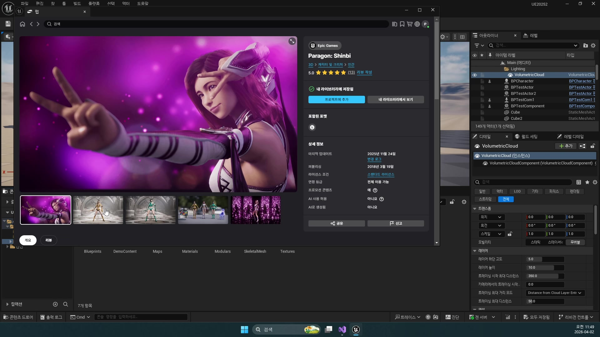
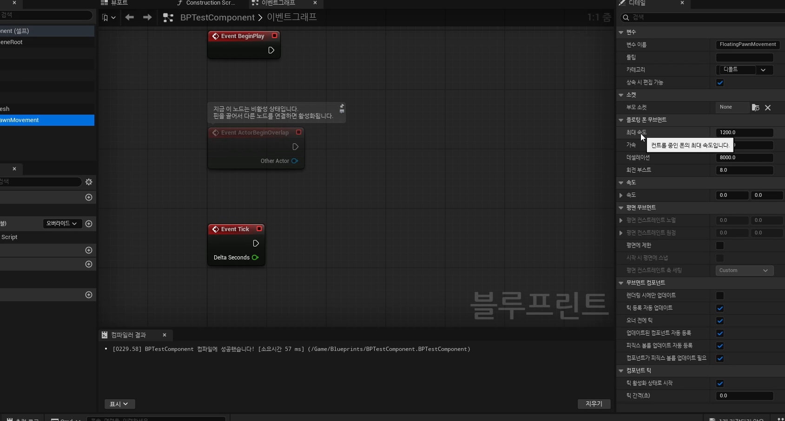
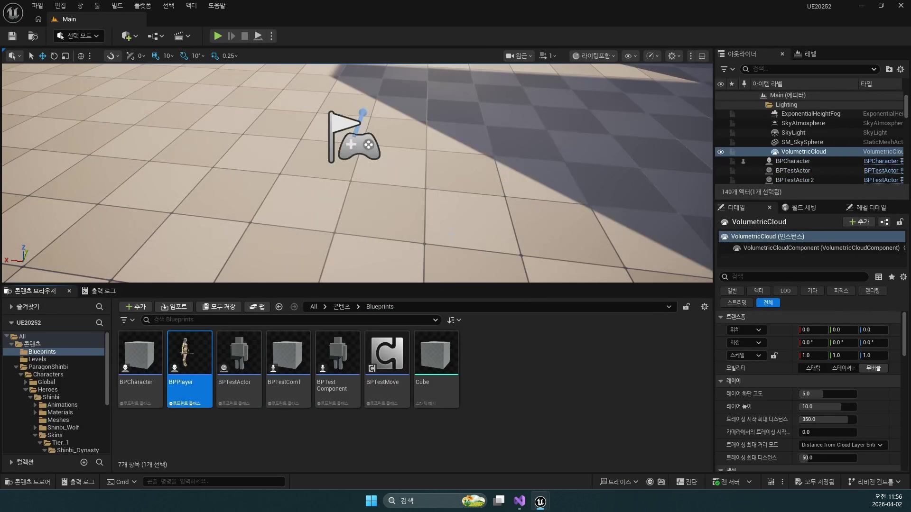

# 초급 1편. 이동 컴포넌트와 메시 기초

[허브](../) | [다음: 초급 2편](../02_beginner_bpplayer_and_shoulder_camera/)

## 이 편의 목표

이 편에서는 플레이어 제작의 가장 앞단에서 `Static Mesh`, `Skeletal Mesh`, `Movement Component`를 어떻게 구분해서 봐야 하는지 정리한다.
핵심은 "보이는 자산"과 "움직이는 액터 구조"를 한꺼번에 이해하는 것이다.

## 봐야 할 자료

- `D:\UE_Academy_Stduy_compressed\260402_1_이동 컴포넌트.mp4`
- `D:\UnrealProjects\UE_Academy_Stduy\Source\UE20252\Monster\MonsterBase.cpp`

## 전체 흐름 한 줄

`에셋 확인 -> Static Mesh / Skeletal Mesh 구분 -> Movement Component 비교 -> 테스트 씬에서 플레이어 구조 감각 잡기`

## 플레이어 제작은 메시를 고르는 일로 시작하지만, 핵심은 행동 가능한 구조를 세우는 일이다

강의 초반은 `Fab`, `Paragon`, 마네킹처럼 캐릭터 에셋을 훑는 데서 시작한다.
하지만 이번 파트의 목적은 예쁜 캐릭터를 가져오는 데 있지 않다.
중요한 것은 언리얼에서 플레이어가 보이고 움직이려면 `메시`, `이동 규칙`, `충돌`, `카메라`가 함께 있어야 한다는 감각을 잡는 것이다.



## `Static Mesh`와 `Skeletal Mesh` 차이는 곧 행동 가능성의 차이다

초반에 가장 먼저 정리해야 하는 개념은 메시 종류다.

- `Static Mesh`
  벽, 상자, 투사체 외형처럼 뼈가 필요 없는 물체
- `Skeletal Mesh`
  플레이어나 몬스터처럼 뼈 구조와 애니메이션이 필요한 캐릭터

플레이어를 만들겠다면 처음부터 `Skeletal Mesh`를 골라야 한다.
그래야 뒤에서 `Anim Blueprint`, 몽타주, 공격 애니메이션으로 자연스럽게 이어질 수 있다.
반대로 총알이나 단순 오브젝트는 `Static Mesh` 중심으로 가는 편이 자연스럽다.

## Movement Component는 "어떤 방식으로 움직일지"를 미리 정리한 도구다

강의는 이어서 언리얼이 자주 쓰는 이동 규칙을 컴포넌트로 제공한다는 점을 보여 준다.
여기서 구분한 감각은 이후 발사체, 몬스터, 플레이어 전체에 다시 등장한다.

- `Floating Pawn Movement`
  입력 기반 이동에 적합한 단순 Pawn 이동
- `Projectile Movement`
  직진형 또는 발사체다운 움직임에 적합한 이동
- `Rotating Movement`
  지속 회전하는 오브젝트에 적합한 이동
- `InterpTo Movement`
  지점 사이를 보간 이동할 때 유용한 이동

즉 언리얼에서 이동은 매 프레임 위치를 직접 계산하는 일만 의미하지 않는다.
액터 역할에 맞는 이동 컴포넌트를 고르는 것이 더 앞선 설계다.



## 테스트 씬은 "움직이는 액터"를 눈으로 확인하는 실험실이다

강의 초반부가 테스트 맵과 기본 플레이어 구조를 자주 비추는 이유도 여기에 있다.
메시를 놓는 것과 플레이어처럼 움직이는 액터를 만드는 것은 완전히 다른 문제이기 때문이다.
이 날짜는 아직 완성형 전투 캐릭터를 만드는 날이 아니고, "움직이는 객체"에 대한 감각을 잡는 날에 가깝다.



## 현재 프로젝트도 같은 발상 위에 서 있다

지금 `UE20252` 소스에서도 같은 철학이 그대로 보인다.
예를 들어 몬스터 베이스는 이동을 직접 계산하지 않고 `UFloatingPawnMovement`에 맡긴다.

```cpp
mMovement = CreateDefaultSubobject<UFloatingPawnMovement>(TEXT("Movement"));
mMovement->SetUpdatedComponent(mBody);
```

이 코드는 나중 날짜의 몬스터 AI에서 다시 보게 되지만, 개념 자체는 이미 `260402`에서 시작한다.
액터 역할을 정하고, 그 역할에 맞는 이동 컴포넌트를 붙여서 동작 성격을 정하는 방식이다.

## 이 편의 핵심 정리

1. 플레이어 제작은 모델 배치보다 먼저 `메시 + 이동 규칙 + 충돌 + 카메라` 구조를 이해하는 일이다.
2. `Static Mesh`와 `Skeletal Mesh` 차이는 단순 자산 분류가 아니라, 이후 행동 가능성 차이와 연결된다.
3. `Movement Component`는 액터를 어떤 성격으로 움직일지 정하는 핵심 설계 요소다.
4. 이 감각은 뒤의 몬스터, 발사체, 스킬 액터 구조로 그대로 이어진다.

## 다음 편

[초급 2편. BPPlayer와 숄더뷰 카메라](../02_beginner_bpplayer_and_shoulder_camera/)
