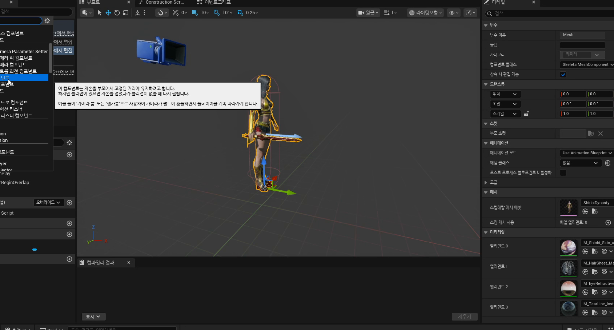
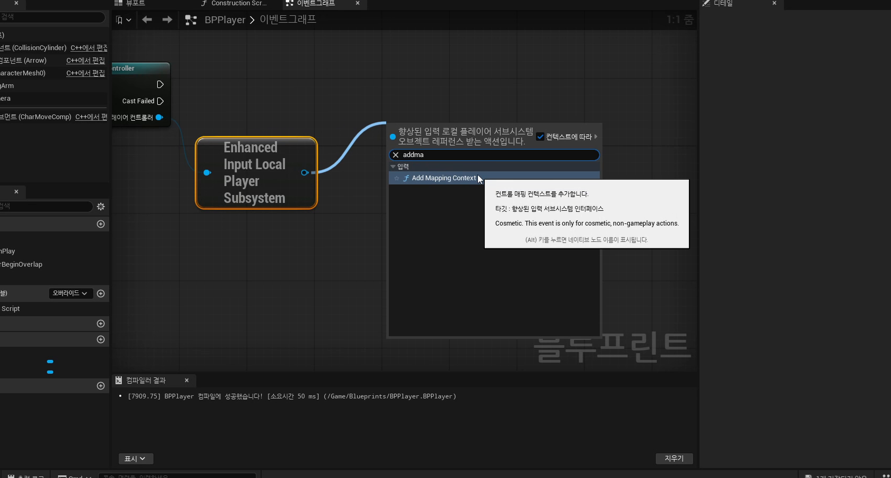

# 초급 2편. BPPlayer와 숄더뷰 카메라

[이전: 초급 1편](../01_beginner_movement_components_and_meshes/) | [허브](../) | [다음: 초급 3편](../03_beginner_attack_bullet_and_spawn_actor/)

## 이 편의 목표

이 편에서는 `BPPlayer`에 `Spring Arm`, `Camera`, `Enhanced Input`를 붙여 "조작 가능한 플레이어"를 만드는 과정을 정리한다.
핵심은 메시를 띄우는 것이 아니라, 시점과 입력 구조를 함께 세우는 것이다.

## 봐야 할 자료

- `D:\UE_Academy_Stduy_compressed\260402_2_플레이어 제작.mp4`
- `D:\UnrealProjects\UE_Academy_Stduy\Source\UE20252\Player\PlayerCharacter.cpp`
- `D:\UnrealProjects\UE_Academy_Stduy\Source\UE20252\Input\InputData.cpp`

## 전체 흐름 한 줄

`BPPlayer 생성 -> Spring Arm + Camera 배치 -> Mapping Context 등록 -> IA_Move / IA_Rotation 연결 -> 현재 프로젝트 C++ 구조와 대응`

## `BPPlayer`의 진짜 목표는 "캐릭터가 아니라 조작감"이다

두 번째 강의는 겉으로 보면 `BPPlayer`를 만드는 시간이다.
하지만 실제 핵심은 액션 게임처럼 느껴지는 시점과 조작 구조를 세팅하는 데 있다.
같은 캐릭터 메시라도 카메라 거리와 각도, 입력 연결 방식에 따라 조작감이 완전히 달라지기 때문이다.


## `Spring Arm + Camera` 조합이 숄더뷰의 기본 패턴이다

언리얼에서 3인칭 시점을 만들 때 가장 정석적인 방법은 `Spring Arm`을 먼저 두고, 그 자식으로 `Camera`를 붙이는 방식이다.
이 구조를 쓰면 카메라 거리, 회전, 충돌 보정을 한 곳에서 관리하기 쉬워진다.

강의에서 자주 만지는 포인트도 이 세 가지다.

- `Target Arm Length`
- 카메라 시작 위치와 회전
- 숄더뷰 느낌을 주는 오프셋



현재 프로젝트의 `APlayerCharacter` 생성자도 이 패턴을 그대로 따른다.

```cpp
mSpringArm = CreateDefaultSubobject<USpringArmComponent>(TEXT("Arm"));
mSpringArm->SetupAttachment(GetMesh());
mSpringArm->TargetArmLength = 200.f;
mSpringArm->SetRelativeLocation(FVector(0.0, 0.0, 150.0));
mSpringArm->SetRelativeRotation(FRotator(-10.0, 90.0, 0.0));

mCamera = CreateDefaultSubobject<UCameraComponent>(TEXT("Camera"));
mCamera->SetupAttachment(mSpringArm);
```

즉 블루프린트 실습은 임시 요령이 아니라, 나중에 C++로 굳는 플레이어 기본 패턴이다.

## `Enhanced Input`은 입력을 키가 아니라 액션 자산으로 정리하게 만든다

이번 날짜의 또 다른 핵심은 `Enhanced Input`이다.
초보자 입장에서는 복잡해 보일 수 있지만, 실제 핵심은 단순하다.
키를 곧바로 로직에 붙이지 않고 먼저 `IA_Move`, `IA_Rotation`, `IA_Attack` 같은 `Input Action` 자산을 만들고, 이를 `Mapping Context`에 넣는 것이다.

이 방식의 장점은 분명하다.

- 입력 의미를 자산 이름으로 관리할 수 있다.
- 키 변경과 게임 로직을 분리할 수 있다.
- 블루프린트와 C++가 같은 입력 자산을 공용 인터페이스처럼 사용할 수 있다.


## `BeginPlay`에서 `Add Mapping Context`를 등록하는 감각이 중요하다

강의 중반의 중요한 장면은 `BeginPlay`에서 로컬 플레이어 서브시스템을 얻고, 여기에 `Add Mapping Context`를 호출하는 부분이다.
이 단계가 있어야 지금 만든 `IA_Move`, `IA_Rotation`, `IA_Attack`가 실제 플레이 중에 살아난다.



현재 C++에서도 이 구조가 거의 그대로 이어진다.

```cpp
TObjectPtr<UEnhancedInputLocalPlayerSubsystem> Subsystem =
    ULocalPlayer::GetSubsystem<UEnhancedInputLocalPlayerSubsystem>(
        PlayerController->GetLocalPlayer());

const UDefaultInputData* InputData = GetDefault<UDefaultInputData>();
Subsystem->AddMappingContext(InputData->mContext, 0);
```

즉 `BeginPlay`에서 입력 세트를 등록하고, 이후 `SetupPlayerInputComponent`에서 액션별 함수를 바인딩하는 흐름이 `260402`의 핵심 루프다.

## `IA_Move`와 `IA_Rotation`은 이동과 시점을 분리해 준다

강의에서는 이동 입력만 먼저 눈에 들어오기 쉽지만, 실제로는 `IA_Move`와 `IA_Rotation`이 한 쌍이다.
플레이어는 앞으로 가기만 하는 것이 아니라, 동시에 시점을 바꾸고 그 시점 기준으로 공격까지 이어져야 하기 때문이다.

현재 C++ 구조도 이 분리를 유지한다.

```cpp
Input->BindAction(InputData->FindAction(TEXT("Move")),
    ETriggerEvent::Triggered, this, &APlayerCharacter::MoveKey);

Input->BindAction(InputData->FindAction(TEXT("Rotation")),
    ETriggerEvent::Triggered, this, &APlayerCharacter::RotationKey);
```

`MoveKey()`는 전진 입력과 yaw 쪽 감각을, `RotationKey()`는 `SpringArm` 회전과 시선 값을 맡는다.
즉 프로토타입 블루프린트는 훗날 C++ 플레이어 구조를 이해하기 위한 선행 실습이라고 보는 편이 맞다.


## `BPPlayer`는 버려지는 실습이 아니라 C++ 플레이어로 가는 중간 단계다

지금 저장소를 기준으로 보면, `BPPlayer`는 최종 완성품이라기보다 컴포넌트 배치와 입력 구조를 가장 빨리 실험하는 중간 단계다.
이후 `260406`에서 내용이 `APlayerCharacter`와 `UDefaultInputData` 쪽으로 옮겨 가지만, 시점과 입력을 나누는 감각 자체는 `260402`에서 이미 다 심어 둔 것이다.

## 이 편의 핵심 정리

1. `BPPlayer` 제작의 핵심은 메시보다 시점과 입력 구조를 잡는 데 있다.
2. `Spring Arm + Camera`는 숄더뷰/3인칭 카메라의 가장 기본적인 패턴이다.
3. `Enhanced Input`은 입력을 액션 자산과 매핑 컨텍스트로 정리하게 만든다.
4. `BeginPlay -> Add Mapping Context -> BindAction` 흐름이 이후 C++ 플레이어 구현으로 그대로 이어진다.

## 다음 편

[초급 3편. 공격 입력과 총알 스폰](../03_beginner_attack_bullet_and_spawn_actor/)
