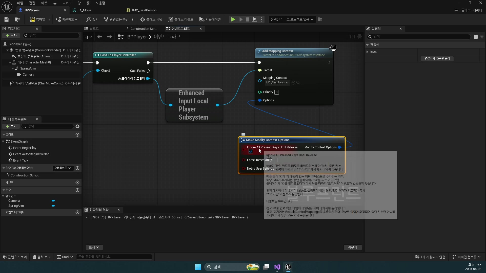
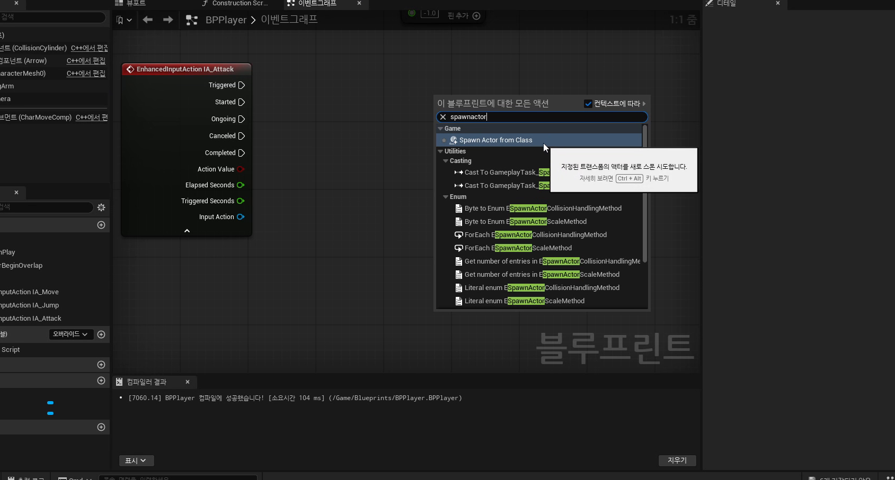

# 부록 1. 공식 문서로 다시 읽는 플레이어와 스폰

[이전: 초급 3편](../03_beginner_attack_bullet_and_spawn_actor/) | [허브](../) | [다음: 부록 2](../05_appendix_current_project_cpp_reference/)

## 이 부록의 목표

이 부록에서는 `260402`에서 손으로 만든 내용을 언리얼 공식 문서 기준 용어로 다시 정리한다.
핵심은 이번 날짜가 단순 블루프린트 실습이 아니라 `Character`, `Camera`, `Input`, `Actor Spawn`이라는 엔진 핵심 문법을 처음 조립하는 날이라는 점을 확인하는 것이다.

## 함께 보면 좋은 공식 문서

1. [Unreal Engine Actors Reference](https://dev.epicgames.com/documentation/en-us/unreal-engine/unreal-engine-actors-reference)
2. [Setting Up a Character in Unreal Engine](https://dev.epicgames.com/documentation/en-us/unreal-engine/setting-up-a-character-in-unreal-engine)
3. [Using Spring Arm Components in Unreal Engine](https://dev.epicgames.com/documentation/en-us/unreal-engine/using-spring-arm-components-in-unreal-engine)
4. [Quick Start Guide to Player Input in Unreal Engine C++](https://dev.epicgames.com/documentation/en-us/unreal-engine/quick-start-guide-to-player-input-in-unreal-engine-cpp?application_version=5.6)
5. [Enhanced Input in Unreal Engine](https://dev.epicgames.com/documentation/en-us/unreal-engine/enhanced-input-in-unreal-engine)
6. [Spawning Actors in Unreal Engine](https://dev.epicgames.com/documentation/en-us/unreal-engine/spawning-actors-in-unreal-engine)
7. [Unreal Engine Actor Lifecycle](https://dev.epicgames.com/documentation/unreal-engine/unreal-engine-actor-lifecycle)

## 플레이어 메시와 `Character` 구조는 공식 문서도 분리해서 설명한다

강의 1편에서 `Static Mesh`와 `Skeletal Mesh`를 나눠 본 흐름은 공식 문서의 `Actors Reference`, `Setting Up a Character`와 그대로 이어진다.
공식 문서 기준으로도 플레이어나 NPC는 애니메이션 가능한 메시와 캐릭터 이동 구조를 함께 갖춘 `Character` 쪽으로 설명된다.
반대로 총알이나 단순 소품은 `Static Mesh Actor` 쪽으로 읽는 편이 자연스럽다.

즉 이번 날짜에서 메시 종류를 먼저 구분한 것은 교재 취향이 아니라 엔진 표준 분류와도 맞닿아 있다.

## `Spring Arm + Camera`는 공식 문서가 권장하는 3인칭 카메라 패턴이다

`Using Spring Arm Components` 문서도 3인칭 시점에서 `Spring Arm`을 먼저 두고 그 자식으로 `Camera`를 붙이는 패턴을 설명한다.
이번 날짜에서 숄더뷰를 만들 때 손으로 조절한 거리, 회전, 오프셋은 결국 이 표준 패턴을 직접 체험한 셈이다.

## 입력은 `Action/Axis` 감각에서 `Enhanced Input` 자산 구조로 발전한다

공식 문서의 입력 설명은 크게 두 층으로 읽으면 쉽다.

- 기존 개념
  `Action`과 `Axis`로 입력 의미를 나눈다
- 최신 구조
  `Input Action`과 `Input Mapping Context` 자산으로 이를 관리한다

즉 `IA_Move`, `IA_Rotation`, `IA_Attack`는 새 시스템이 갑자기 생긴 것이 아니라,
예전 입력 의미 분리를 더 관리하기 좋은 자산 구조로 정리한 결과다.

## `Spawn Actor`는 "새 액터 하나를 월드에 태어나게 한다"는 뜻이다

`Spawning Actors`와 `Actor Lifecycle` 문서를 함께 보면, 총알을 쏜다는 것은 결국 새 액터를 만들고 수명주기를 시작하게 하는 일이라는 점이 더 선명해진다.
이번 날짜의 `BPBullet`은 단순 예제가 아니라, 훗날 충돌, 데미지, 파티클, 파괴로 자라나는 전투 액터의 씨앗이다.

## 공식 문서 기준으로 260402를 다시 읽는 추천 순서

1. `Actors Reference`, `Setting Up a Character`로 플레이어 구조를 다시 본다.
2. `Using Spring Arm Components`로 카메라 패턴을 다시 본다.
3. `Quick Start Guide to Player Input`, `Enhanced Input`으로 입력 구조를 다시 본다.
4. `Spawning Actors`, `Actor Lifecycle`로 발사체 스폰과 수명주기를 다시 본다.

이 순서대로 읽으면 `메시 -> 카메라 -> 입력 -> 액터 생성`이 한 줄로 이어진다.

## 이 부록의 핵심 정리

1. `260402`는 블루프린트 조작 실습이면서 동시에 언리얼 핵심 표준 문법을 손으로 처음 조립하는 날이다.
2. `Character`, `Spring Arm`, `Enhanced Input`, `Spawn Actor`는 모두 공식 문서와 직접 대응되는 개념이다.
3. 공식 문서를 함께 읽으면 뒤의 전투, 충돌, 스폰 파트를 훨씬 쉽게 찾아갈 수 있다.
