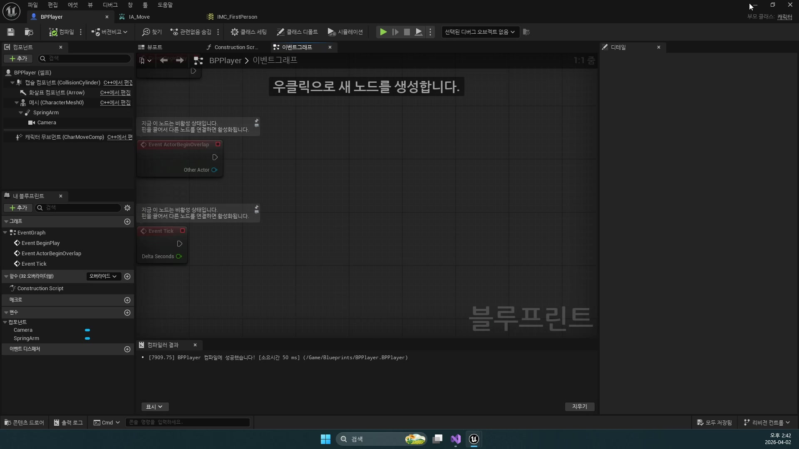
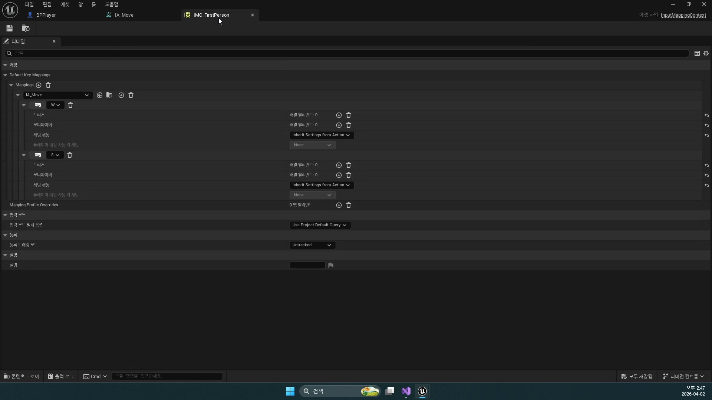
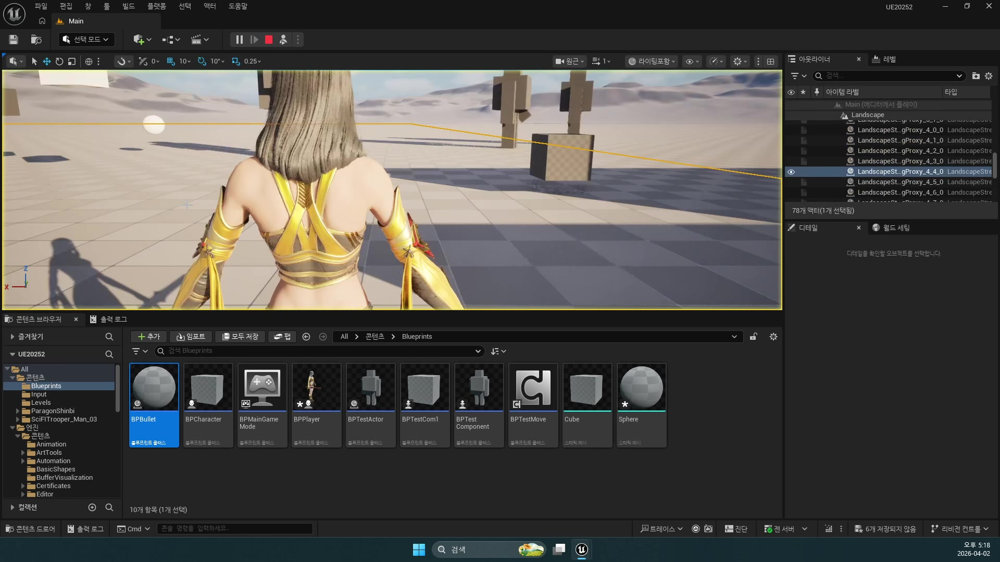
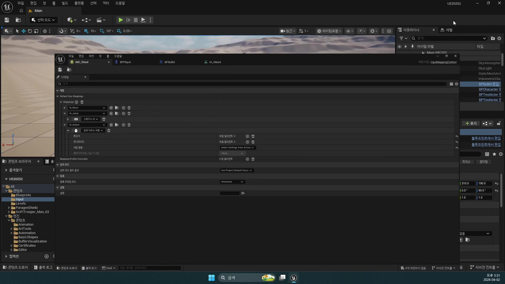
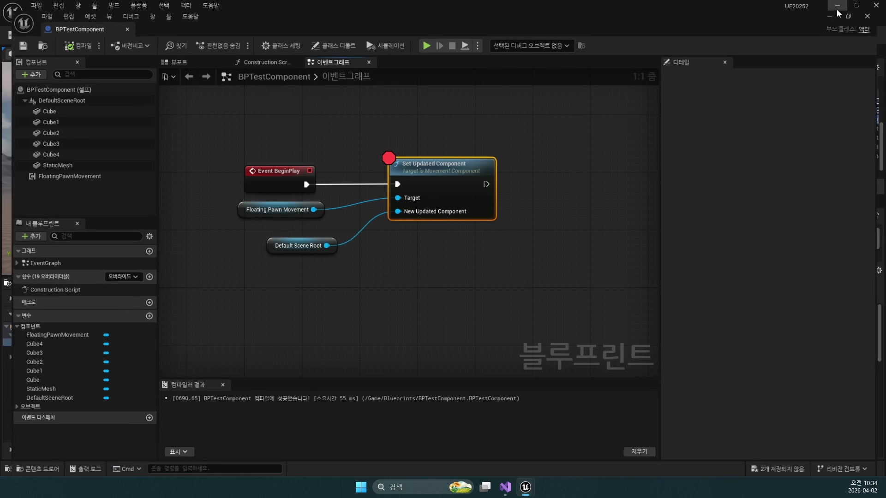
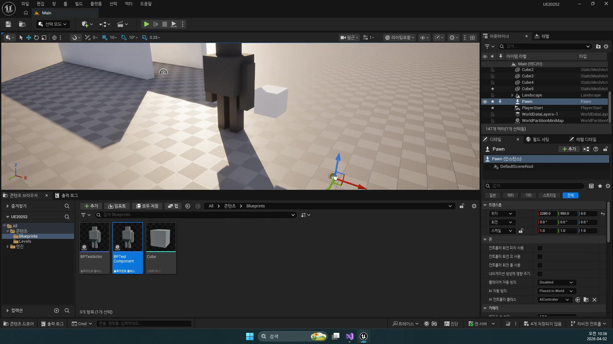
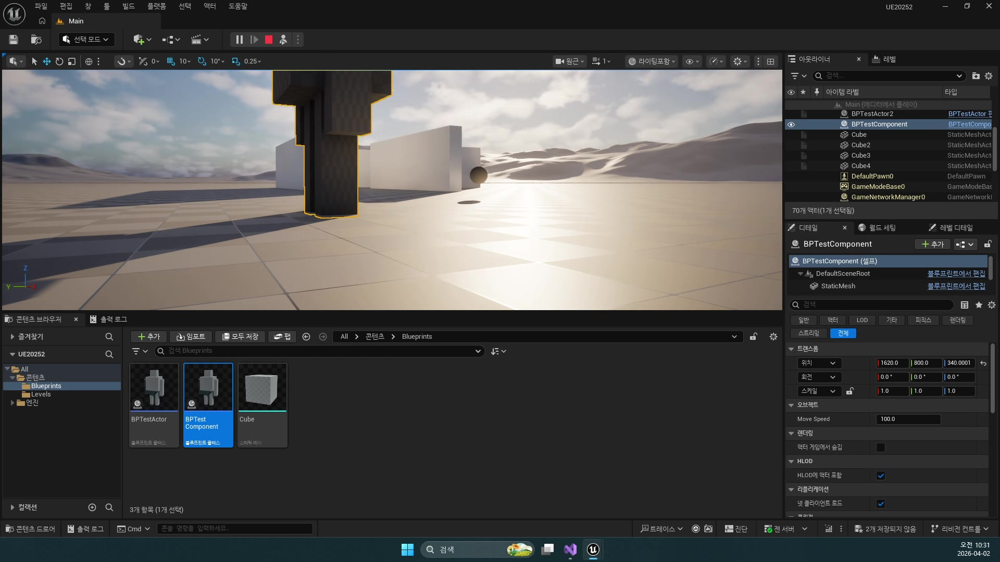

# 260402 플레이어를 움직이고 카메라를 붙이고 공격 입력으로 총알을 생성하는 블루프린트 기초

## 문서 개요

이 문서는 `260402_1_이동 컴포넌트`, `260402_2_플레이어 제작`, `260402_3_액터 스폰과 회전`, `260402_3_액터 스폰과 회전_2`를 하나의 연속된 교재로 다시 정리한 것이다.
이번 날짜의 핵심은 언리얼의 기본 컴포넌트를 손에 익히고, 블루프린트 플레이어를 직접 만들고, 마지막으로 입력을 받아 발사체를 스폰하는 가장 기초적인 액션 게임 루프를 완성하는 데 있다.
그리고 이번 정리본에서는 여기에 더해, 현재 프로젝트 `D:\UnrealProjects\UE_Academy_Stduy\Source\UE20252` 안의 실제 C++ 코드를 함께 읽으면서 `Spring Arm`, `Camera`, `Enhanced Input`, 발사체 스폰 개념이 소스에서 어떤 모습으로 이어지는지도 자세히 연결한다.

강의 흐름을 한 줄로 요약하면 다음과 같다.

`Movement Component 이해 -> BPPlayer와 숄더뷰 카메라 제작 -> IA_Attack / BPBullet / Spawn Actor -> 실제 C++ 코드로 다시 읽기`

즉 `260402`는 이후의 전투, 충돌, 애니메이션, AI 강의보다 훨씬 앞단에 있는 “조작 가능한 캐릭터와 간단한 액터 생성”의 출발점이다.
아직 화려한 전투 시스템은 없지만, 이 날짜에서 배우는 컴포넌트 감각이 있어야 뒤에서 나오는 충돌 판정, 투사체, 스킬, 몬스터 스폰 구조도 자연스럽게 읽힌다.

이 교재는 다음 자료를 함께 대조해 작성했다.

- `D:\UE_Academy_Stduy_compressed`의 원본 영상과 자막
- 원본 MP4에서 다시 추출한 대표 장면 캡처
- `D:\UnrealProjects\UE_Academy_Stduy\Source\UE20252`의 실제 C++ 소스
- `D:\UnrealProjects\UE_Academy_Stduy\Saved\AcademyUtility`에 덤프한 `BPPlayer`, `BPBullet`, `IMC_Default`, `IA_Move`, `IA_Rotation`, `IA_Attack`, `PlayerCharacter`, `InputData`, `WraithBullet` 자료
- Epic Developer Community의 언리얼 공식 문서

## 학습 목표

- `Static Mesh`와 `Skeletal Mesh`의 차이를 실제 플레이어 제작 관점에서 설명할 수 있다.
- `Floating Pawn Movement`, `Projectile Movement`, `Rotating Movement`, `InterpTo Movement`의 쓰임을 구분할 수 있다.
- `Spring Arm`과 `Camera`를 이용해 숄더뷰 플레이어 시점을 만드는 이유를 설명할 수 있다.
- `Enhanced Input`의 `Mapping Context`와 `IA_Move`, `IA_Rotation`, `IA_Attack`가 블루프린트 조작 루프에서 어떤 역할을 하는지 말할 수 있다.
- 메시를 직접 쏘는 대신 별도 액터인 `BPBullet`을 만들어 `Spawn Actor`와 `Projectile Movement`로 발사하는 구조를 정리할 수 있다.
- `Location`, `Rotation`, `Forward Vector`를 조합해 발사체 생성 방향을 제어하는 기본 원리를 설명할 수 있다.
- `Using Spring Arm Components`, `Enhanced Input in Unreal Engine`, `Player Input and Pawns`, `Spawning Actors in Unreal Engine`, `Actor Lifecycle` 공식 문서가 왜 `260402`와 직접 연결되는지 설명할 수 있다.
- `APlayerCharacter`, `UDefaultInputData`, `ATestBullet`, `AProjectileBase`, `AWraithBullet` 코드를 보고 `260402` 개념이 실제 C++에서 어떻게 보이는지 읽을 수 있다.

## 강의 흐름 요약

1. 에셋을 가져오고, `Skeletal Mesh`와 여러 `Movement Component`를 비교하면서 “움직이는 액터”를 만드는 언리얼 기본 문법을 익힌다.
2. `BPPlayer`를 만들고 `Spring Arm`과 `Camera`를 붙여 액션 게임용 숄더뷰 시점을 만든다.
3. `IMC_Shoot` 또는 `IMC_Default`, `IA_Move`, `IA_Rotation`, `IA_Attack`를 연결해 입력 자산과 블루프린트 이벤트 그래프를 묶는다.
4. 총알은 메시 컴포넌트를 직접 날리는 대신 별도 액터 `BPBullet`로 만들고, 여기에 `Projectile Movement`를 붙여 발사체처럼 움직이게 한다.
5. 마지막으로 `Spawn Actor from Class`와 `Transform` 계산을 이용해, 플레이어가 보는 방향 앞쪽으로 발사체를 생성한다.
6. 언리얼 공식 문서를 통해 `Spring Arm`, 입력, `Spawn Actor`, 액터 수명주기 개념이 엔진 표준 용어로 어떻게 정리되는지 확인한다.
7. 현재 프로젝트의 C++ 코드를 읽으며, 위 구조가 `PlayerCharacter`, `InputData`, `TestBullet`, `ProjectileBase`, `WraithBullet` 안에서 어떻게 구현되는지 확인한다.

---

## 제1장. 이동 컴포넌트와 메시의 기초: 움직일 수 있는 액터를 어떻게 이해할 것인가

### 1.1 플레이어 제작은 메시 선택에서 시작하지만 핵심은 구조 이해다

첫 강의는 에셋을 받는 이야기로 시작한다.
자막에서도 `Fab`, `Paragon`, 마네킹 같은 키워드가 먼저 나오는데, 이 파트의 목적은 “예쁜 캐릭터를 구하는 법”보다 “언리얼에서 캐릭터를 어떤 자산 조합으로 다루는가”를 익히는 데 있다.

언리얼에서 플레이어가 화면에 보이려면 단순히 모델 파일 하나가 있는 것으로 끝나지 않는다.
캐릭터 메시, 스켈레톤, 애니메이션, 움직임을 담당하는 컴포넌트, 그리고 그것을 담는 액터 구조가 함께 있어야 한다.
즉 이번 날짜는 아트 자산을 가져오는 시간이 아니라, “보이는 오브젝트”를 “움직이는 게임 액터”로 바꾸는 첫 수업에 가깝다.


### 1.2 Static Mesh와 Skeletal Mesh의 차이는 곧 행동 가능성의 차이다

강의 초반에서 가장 중요하게 짚는 개념은 `Static Mesh`와 `Skeletal Mesh`의 차이다.
`Static Mesh`는 형태만 가진 오브젝트이고, `Skeletal Mesh`는 뼈 구조를 가지므로 애니메이션을 재생할 수 있다.
이 차이를 단순 정의로 외우는 것보다, 플레이어 제작 관점에서 읽는 편이 훨씬 좋다.

- `Static Mesh`: 벽, 상자, 총알, 단순 소품처럼 뼈대가 필요 없는 물체
- `Skeletal Mesh`: 플레이어, 몬스터, 인간형 NPC처럼 자세와 동작 변화가 중요한 캐릭터

즉 플레이어를 만들겠다면 처음부터 `Skeletal Mesh`를 골라야 한다.
나중에 `Anim Blueprint`, `Montage`, `Aim Offset`으로 넘어갈 수 있는 전제가 바로 이 선택이기 때문이다.

### 1.3 Movement Component는 “이 액터를 어떤 방식으로 움직일 것인가”를 미리 정리한 도구다

강의는 이어서 언리얼이 기본 제공하는 이동 컴포넌트를 비교한다.
이 부분이 중요한 이유는, 이후 강의에서 등장하는 발사체와 몬스터, 플레이어가 모두 각자 다른 이동 컴포넌트 철학 위에서 움직이기 때문이다.

자막에 나오는 대표 예시는 다음과 같다.

- `Floating Pawn Movement`
- `Projectile Movement`
- `Rotating Movement`
- `InterpTo Movement`

이 네 가지를 초보자 관점에서 다시 정리하면 아래와 같다.

- `Floating Pawn Movement`: 방향 입력을 받아 부드럽게 이동하는 단순 Pawn용 이동
- `Projectile Movement`: 속도와 방향에 따라 발사체처럼 움직이는 이동
- `Rotating Movement`: 계속 회전하는 오브젝트에 적합한 이동
- `InterpTo Movement`: 지정 지점 사이를 보간하며 움직이는 이동

즉 이동은 직접 위치를 매 프레임 계산해서 넣는 것만이 답이 아니다.
언리얼은 “자주 쓰는 이동 규칙”을 컴포넌트로 미리 제공하므로, 제작자는 거기에 액터의 역할을 맞춰 주면 된다.

### 1.4 현재 C++ 프로젝트도 같은 발상 위에 서 있다

강의는 블루프린트 단계에서 진행되지만, 현재 `UE20252` 소스를 보면 같은 개념이 그대로 이어져 있음을 알 수 있다.
몬스터 베이스 클래스는 이동을 직접 짜지 않고 `UFloatingPawnMovement`를 사용한다.

```cpp
// Pawn이 직접 움직일 수 있게 이동 컴포넌트를 만든다.
mMovement = CreateDefaultSubobject<UFloatingPawnMovement>(TEXT("Movement"));
// 어떤 충돌체를 실제로 움직일지 지정한다.
mMovement->SetUpdatedComponent(mBody);
```

이 코드는 나중 날짜의 몬스터 AI 강의에 나오지만, 개념 자체는 이미 `260402`에서 설명한 이동 컴포넌트 철학과 같다.
즉 컴포넌트는 “나중에 붙이는 편의 기능”이 아니라, 액터의 움직임 성격을 정하는 핵심 설계 요소다.

실제 덤프된 `BPBullet`도 같은 철학을 보여 준다.
이 블루프린트는 `Actor`를 부모로 두고, 컴포넌트는 `StaticMesh`와 `ProjectileMovement` 중심으로 구성되어 있다.
즉 강의에서 말하는 “총알은 별도 액터로 만들고, 움직임은 전용 이동 컴포넌트에 맡긴다”는 원칙이 현재 프로젝트 자산에도 그대로 남아 있다.

### 1.5 카메라와 스프링암도 결국 플레이어용 컴포넌트 조합이다

첫 강의 후반부는 카메라와 `Spring Arm`을 미리 보여 준다.
이 역시 중요한 이유가 있다.
플레이어를 조작한다는 것은 단지 메시를 움직이는 것이 아니라, “어떤 시점에서 그 움직임을 보게 할 것인가”를 함께 정하는 일이기 때문이다.

`Spring Arm`은 부모와 자식 카메라 사이의 거리를 자연스럽게 유지하게 해 주는 컴포넌트다.
따라서 카메라를 캐릭터에 바로 박아 두는 것보다, 액션 게임 시점을 만들 때 훨씬 편하다.
이 날짜의 두 번째 강의가 곧바로 숄더뷰 플레이어 제작으로 이어지는 이유도 이 전제가 이미 깔려 있기 때문이다.


### 1.6 장 정리

제1장의 핵심은 액터를 움직이게 만들 때 메시, 이동 컴포넌트, 카메라 컴포넌트를 각각 따로 보지 말고 하나의 구조로 이해해야 한다는 점이다.
`260402`는 플레이어를 완성하는 날이라기보다, 언리얼에서 움직이는 오브젝트를 조립하는 기본 문법을 익히는 날이다.

---

## 제2장. BPPlayer와 숄더뷰 카메라: 조작 가능한 플레이어를 어떻게 세울 것인가

### 2.1 두 번째 강의의 진짜 목표는 “시점이 있는 조작감”이다

두 번째 강의는 `BPPlayer`를 만드는 이야기지만, 실제 핵심은 “액션 게임처럼 느껴지는 시점”을 세팅하는 데 있다.
자막에서도 정통 3인칭 템플릿보다 약간 옆에서 보는 숄더뷰 느낌을 만들겠다는 설명이 반복된다.

이 차이는 매우 실전적이다.
단순히 캐릭터 뒤에 카메라를 두는 것과, 약간 위에서 어깨 너머로 보는 카메라를 만드는 것은 조작감과 공격 연출의 인상이 크게 다르다.
즉 이 날짜는 이동 입력보다 먼저 “플레이어가 세계를 바라보는 방식”을 만드는 강의라고 볼 수 있다.

### 2.2 Spring Arm을 먼저 넣고 Camera를 자식으로 붙이는 구조가 정석이다

강의는 `Spring Arm`을 먼저 추가하고, 그 아래에 `Camera`를 붙이는 순서로 진행된다.
이 순서가 중요한 이유는 카메라 거리와 각도, 충돌 보정을 모두 `Spring Arm`이 맡기 때문이다.

강의에서 강조하는 조정 포인트는 대체로 다음과 같다.

- `Target Arm Length`: 캐릭터와 카메라 거리
- `Relative Rotation`: 약간 내려다보는 각도
- 카메라 오프셋: 완전 정중앙이 아닌 숄더뷰 느낌

현재 프로젝트의 `APlayerCharacter` 생성자를 보면, 블루프린트에서 손으로 맞추던 값이 훗날 C++ 코드로 그대로 옮겨졌음을 알 수 있다.

```cpp
// 카메라 팔 역할의 SpringArm
mSpringArm = CreateDefaultSubobject<USpringArmComponent>(TEXT("Arm"));
mSpringArm->SetupAttachment(GetMesh());
// 캐릭터와 카메라 사이 거리
mSpringArm->TargetArmLength = 200.f;
// 카메라 시작 위치
mSpringArm->SetRelativeLocation(FVector(0.0, 0.0, 150.0));
// 카메라 시작 회전
mSpringArm->SetRelativeRotation(FRotator(-10.0, 90.0, 0.0));

// 실제 화면을 보여 주는 카메라
mCamera = CreateDefaultSubobject<UCameraComponent>(TEXT("Camera"));
mCamera->SetupAttachment(mSpringArm);
```

즉 `260402`에서 배우는 숄더뷰는 일회성 블루프린트 트릭이 아니다.
뒤의 `260406` C++ 전환 파트에서도 그대로 살아남는 플레이어 시점의 기본 설계다.

덤프 기준으로 봐도 `BPPlayer`는 부모가 `Character`이고, 상속된 `CapsuleComponent`, `CharacterMovement`, `Mesh` 위에 `SpringArm`과 `Camera`를 추가한 구조다.
즉 숄더뷰 카메라는 “카메라 하나를 붙였다”가 아니라, `Character` 기본 부품 위에 시점용 컴포넌트를 얹는 정석 패턴이라고 볼 수 있다.



### 2.3 Enhanced Input은 입력을 “키 하나”가 아니라 “액션 자산”으로 다루게 만든다

강의 중반부는 `Enhanced Input` 설정으로 넘어간다.
초보자 입장에서는 이 부분이 복잡해 보일 수 있지만, 핵심은 단순하다.
입력을 곧바로 키보드 버튼과 연결하지 않고, 먼저 `IA_Move`, `IA_Rotation`, `IA_Attack` 같은 `Input Action` 자산을 만들고 이를 `Mapping Context`에 넣는 것이다.

이 방식의 장점은 크다.

- 입력 의미를 자산 이름으로 관리할 수 있다.
- 키 변경과 로직 변경을 분리할 수 있다.
- 나중에 C++에서 같은 액션 이름을 읽어 바인딩하기 쉬워진다.

즉 `Enhanced Input`은 “입력 이벤트를 더 복잡하게 만드는 시스템”이 아니라, 입력을 장기적으로 관리하기 좋게 만드는 체계다.

다만 현재 저장소를 덤프로 확인해 보면, 블루프린트 프로토타입과 후속 C++ 정리본 사이에는 이름 차이가 조금 있다.
`BPPlayer` 그래프는 `BeginPlay`에서 `IMC_Shoot`를 직접 등록하고, 그 안에서 `IA_Move`, `IA_Rotation`, `IA_Attack`를 사용한다.
반면 현재 C++ 구조의 `UDefaultInputData`는 `IMC_Default`를 로딩하고, 여기에 `IA_Move`, `IA_Rotation`, `IA_Jump`, `IA_Attack`, `IA_Skill1`를 묶는다.
즉 매핑 컨텍스트의 자산 이름과 포함 범위는 발전 과정에서 달라졌지만, “입력을 액션 자산과 매핑 컨텍스트로 관리한다”는 핵심 발상은 그대로 유지된다.


### 2.4 IA_Move와 IA_Rotation은 이동과 시선 제어를 나누는 기본 쌍이다

자막 후반에서는 `IA_Move`를 실제 키에 연결하고 이벤트 그래프에서 받는 흐름을 보여 준다.
하지만 현재 덤프 기준으로 보면, 여기서 중요한 것은 이동만 따로 떼어 보는 것이 아니라 `IA_Move`와 `IA_Rotation`이 한 쌍으로 작동한다는 점이다.
플레이어는 걷고, 동시에 시선을 돌리고, 그 방향을 기준으로 공격까지 연결해야 하기 때문이다.

현재 C++ 구조에서도 그 흔적이 명확하다.
`UDefaultInputData`는 `IA_Move`를 로딩해 `"Move"`라는 키로 보관하고, `APlayerCharacter`는 그 액션을 찾아 `MoveKey()`에 바인딩한다.

```cpp
// IA_Move 자산을 경로로 찾아 로드한다.
static ConstructorHelpers::FObjectFinder<UInputAction> MoveAction(
    TEXT("/Script/EnhancedInput.InputAction'/Game/Input/IA_Move.IA_Move'"));

// 성공하면 "Move" 이름으로 저장한다.
if (MoveAction.Succeeded())
    mActions.Add(TEXT("Move"), MoveAction.Object);
```

그리고 실제 바인딩은 이렇게 이뤄진다.

```cpp
// Move 액션이 들어오면 MoveKey를 호출한다.
Input->BindAction(InputData->FindAction(TEXT("Move")), ETriggerEvent::Triggered,
    this, &APlayerCharacter::MoveKey);
```

같은 방식으로 `IA_Rotation`도 별도 액션으로 바인딩된다.

```cpp
// Rotation 액션이 들어오면 RotationKey를 호출한다.
Input->BindAction(InputData->FindAction(TEXT("Rotation")), ETriggerEvent::Triggered,
    this, &APlayerCharacter::RotationKey);
```

`IMC_Default` 덤프를 보면 이 분리가 더 분명하다.

- `W`, `S`, `A`, `D`는 `IA_Move`
- `MouseX`, `MouseY`는 `IA_Rotation`
- `LeftMouseButton`은 `IA_Attack`

즉 블루프린트 시절에 만든 입력 액션들은 나중에 사라지는 임시 자산이 아니라, C++ 플레이어 시스템으로 이어지는 공용 입력 인터페이스가 된다.



### 2.5 Move 입력은 “전진”과 “회전”을 어떻게 나눌 것인가의 문제로 이어진다

현재 `BPPlayer` 덤프를 보면, 프로토타입 블루프린트는 생각보다 정석적인 2D 이동 구조를 갖고 있다.
`IA_Move`의 `Vector2D` 입력을 `Break Vector2D`로 나눈 뒤, `GetActorForwardVector * X`와 `GetActorRightVector * Y`를 더하고 `Normalize`해서 `AddMovementInput`에 넣는다.
즉 블루프린트 단계의 플레이어는 “전후좌우 방향 벡터를 합쳐 이동하는 구조”에 가깝다.

회전은 별도 `IA_Rotation` 액션으로 분리되어 있고, 이 입력은 `AddControllerYawInput`으로 연결된다.
즉 최소한의 액션 게임 플레이어라도 “이동 벡터”와 “시선/회전 입력”을 분리해서 생각하는 편이 훨씬 읽기 쉽다.

현재 `APlayerCharacter` C++는 이 프로토타입을 바탕으로 한 차례 더 실험된 형태다.
`MoveKey()`는 현재 바라보는 방향 전진과 yaw 입력을 일부 함께 처리하고, `RotationKey()`는 `SpringArm` 회전과 애님 인스턴스의 시선 값 갱신을 담당한다.
흥미로운 점은 `MoveKey()` 안에 예전 프로토타입 방식인 `Forward * X + Right * Y` 코드가 주석으로 남아 있다는 점이다.
즉 저장소의 현재 코드는 `260402` 실습이 굳어진 최종 답이라기보다, 숄더뷰 액션 조작을 여러 방식으로 다듬어 가는 과정으로 읽는 편이 더 정확하다.

### 2.6 BPPlayer는 나중에 PlayerCharacter로 옮겨 가는 중간 단계다

두 번째 강의를 복습할 때 중요한 태도는, `BPPlayer`를 완성품으로 보지 않는 것이다.
이 블루프린트는 플레이어 구조를 빠르게 실험하는 매우 좋은 중간 단계다.
컴포넌트 배치, 카메라 거리, 입력 자산 연결을 먼저 손으로 체득한 다음, 뒤의 `260406`에서 그 내용을 `APlayerCharacter`와 `UDefaultInputData`로 옮기고 조작 구조를 다시 다듬는 흐름이 훨씬 자연스럽다.

즉 `BPPlayer`는 버려지는 프로토타입이 아니라, C++ 구조를 이해하기 위한 선행 실습이다.

### 2.7 장 정리

제2장의 결론은 플레이어 제작에서 메시보다 중요한 것이 시점과 입력 구조라는 점이다.
`Spring Arm + Camera`는 숄더뷰를 만들고, `Enhanced Input`은 조작을 액션 자산으로 정리한다.
이 둘이 합쳐져야 비로소 “조작 가능한 플레이어”가 만들어진다.

---

## 제3장. IA_Attack, BPBullet, Spawn Actor: 메시가 아니라 액터를 발사한다는 뜻

### 3.1 공격 입력은 곧바로 총알이 아니라 액터 생성 문제로 이어진다

세 번째 강의는 `IA_Attack`를 추가하는 데서 시작한다.
겉으로 보면 단순히 마우스 왼쪽 버튼을 연결하는 작업처럼 보이지만, 실질적으로는 “플레이어 입력을 받아 새로운 액터를 월드에 만드는 방법”을 배우는 장이다.

즉 여기서의 공격은 데미지 시스템보다 먼저, 스폰 시스템의 입문이다.
플레이어가 무언가를 발사한다는 말은 결국 특정 위치와 방향을 가진 액터를 생성한다는 뜻이기 때문이다.



### 3.2 메시를 직접 쏘지 않고 BPBullet 액터를 만드는 이유

자막에서 아주 중요하게 짚는 문장이 있다.
“메시는 액터가 아닙니다.”
이 말은 초보자가 자주 헷갈리는 지점을 정확히 찌른다.

정리하면 다음과 같다.

- `Static Mesh`는 액터 안에 들어가는 컴포넌트 자원이다.
- 월드에 독립적으로 존재하고 움직이고 수명을 가지려면 `Actor`가 필요하다.
- 따라서 총알처럼 날아가는 물체는 메시 하나가 아니라, 메시를 품은 `BPBullet` 액터로 만들어야 한다.

이 사고방식은 이후 모든 시스템으로 확장된다.
폭발, 이펙트, 몬스터 스폰, 파괴 오브젝트도 결국 “보이는 자산”과 “월드 액터”를 구분해서 다뤄야 하기 때문이다.

### 3.3 Projectile Movement를 붙이면 발사체다운 움직임을 가장 빨리 만들 수 있다

강의는 `BPBullet`에 `Projectile Movement`를 붙여 가장 빠르게 발사체를 완성한다.
직접 Tick에서 위치를 갱신하지 않고, 언리얼이 제공하는 발사체 전용 이동 규칙을 그대로 활용하는 방식이다.

현재 덤프된 `BPBullet`도 이 원리를 잘 보여 준다.
부모는 `Actor`이고, 컴포넌트는 `StaticMesh`와 `ProjectileMovement`로 단순하게 구성되어 있다.
다만 지금 저장소의 `BPBullet`은 이미 한 단계 더 발전해 있어서, `OnProjectileStop` 이벤트에서 `ApplyDamage`를 호출하고 마지막에 `DestroyActor`까지 수행한다.
즉 교재의 원래 맥락은 “날아가는 총알 만들기”지만, 현재 프로젝트 자산은 그 위에 최소한의 히트 처리까지 얹힌 상태라고 보는 편이 맞다.

그보다 더 얇은 C++ 예제는 `ATestBullet`이다.

```cpp
// 보이는 총알 메시
mMesh = CreateDefaultSubobject<UStaticMeshComponent>(TEXT("Mesh"));
SetRootComponent(mMesh);

// 총알 이동을 맡는 ProjectileMovement
mMovement = CreateDefaultSubobject<UProjectileMovementComponent>(TEXT("Movement"));
mMovement->SetUpdatedComponent(mMesh);
// 곡사 대신 직진형 총알
mMovement->ProjectileGravityScale = 0.f;
mMovement->InitialSpeed = 1000.f;
```

이 코드는 강의에서 블루프린트로 붙이던 `Projectile Movement`의 가장 얇은 C++ 대응 예시다.
중력 비율을 `0`으로 두면 직선 발사체에 가깝고, 초기 속도를 올리면 더 빠르게 날아간다.
즉 `260402`의 총알은 단순한 장난감 오브젝트가 아니라, 뒤의 `260403`, `260409` 전투 시스템으로 이어질 투사체의 원형이다.



### 3.4 Spawn Actor from Class는 “무엇을, 어디에, 어느 방향으로”의 문제다

강의 후반 핵심은 `Spawn Actor from Class` 노드다.
이 노드는 세 질문에 답해야 제대로 쓸 수 있다.

- 무엇을 생성할 것인가
- 어디에 생성할 것인가
- 어느 방향으로 생성할 것인가

여기서 가장 헷갈리는 부분이 `Transform`이다.
자막에서도 `Transform = Location + Rotation + Scale`이라고 설명한 뒤, 위치와 회전을 분리해서 생각하는 편이 더 낫다고 정리한다.

이 조언은 아주 실용적이다.
처음부터 한 번에 복잡한 `Transform`을 만들기보다,

- 발사 위치는 플레이어 앞쪽으로 얼마나 띄울지
- 발사 회전은 플레이어가 현재 어느 방향을 보는지

이 두 가지를 따로 계산한 뒤 합치는 편이 훨씬 읽기 쉽기 때문이다.



### 3.5 현재 PlayerCharacter 소스에는 초기 발사 실험 흔적이 그대로 남아 있다

흥미로운 점은, 지금 프로젝트의 `APlayerCharacter::AttackKey()` 안에 이 강의의 실습 흔적이 주석으로 남아 있다는 것이다.
현재 함수 본체는 `InputAttack()`만 호출하지만, 바로 아래 주석이 `260402`식 발사체 스폰 프로토타입을 거의 그대로 보존하고 있다.

```cpp
// 플레이어 앞쪽 약간 떨어진 위치를 스폰 지점으로 잡는다.
FVector SpawnLoc = GetActorLocation() + GetActorForwardVector() * 150.f;

// 겹침이 있어도 일단 스폰되게 설정한다.
FActorSpawnParameters param;
param.SpawnCollisionHandlingOverride =
    ESpawnActorCollisionHandlingMethod::AlwaysSpawn;

// 실제 테스트 총알 액터를 생성한다.
TObjectPtr<ATestBullet> Bullet =
    GetWorld()->SpawnActor<ATestBullet>(SpawnLoc, GetActorRotation(), param);

// 총알은 5초 뒤 자동 제거된다.
Bullet->SetLifeSpan(5.f);
```

이 코드는 강의가 전달하려는 핵심을 아주 잘 요약한다.

- `GetActorLocation()`: 현재 플레이어 위치
- `GetActorForwardVector() * 150.f`: 플레이어 앞쪽 오프셋
- `GetActorRotation()`: 플레이어가 보는 방향
- `SpawnActor`: 발사체 생성

즉 공격 입력은 결국 “현재 액터의 위치와 방향을 읽어 다른 액터를 앞쪽에 생성하는 것”으로 환원된다.
이 원리를 이해하면 나중에 총알뿐 아니라 마법 투사체, 설치형 오브젝트, 몬스터 스폰도 비슷한 사고로 읽을 수 있다.

### 3.6 Forward Vector와 Arrow Component는 방향 감각을 시각화하는 도구다

강의가 마지막에 회전과 방향을 길게 설명하는 이유도 여기에 있다.
발사체가 엉뚱한 방향으로 생성되는 문제는 대개 “액터의 앞 방향을 정확히 이해하지 못해서” 발생한다.
그래서 언리얼에서는 `Arrow Component`나 `Forward Vector` 개념을 자주 함께 본다.

나중 날짜의 몬스터 클래스도 에디터 전용 `ArrowComponent`를 두고 있다.

```cpp
// 에디터에서 앞 방향을 확인하기 위한 화살표 컴포넌트
mArrowComponent = CreateEditorOnlyDefaultSubobject<UArrowComponent>(TEXT("Arrow"));
mArrowComponent->SetupAttachment(mBody);
```

이는 결국 방향을 눈으로 확인하기 위한 장치다.
즉 `260402`에서 배우는 회전 계산은 단지 총알 발사를 위한 테크닉이 아니라, 월드에 놓인 액터가 “어디를 앞이라고 생각하는지” 이해하는 기초다.



### 3.7 BPBullet은 이후 ProjectileBase와 WraithBullet로 확장되는 출발점이다

현재 소스의 `AProjectileBase`를 보면 `Projectile Movement`에 `OnProjectileStop` 이벤트를 연결해 두고 있다.

```cpp
// 충돌을 맡는 박스
mBody = CreateDefaultSubobject<UBoxComponent>(TEXT("Body"));
// 발사체 이동 컴포넌트
mMovement = CreateDefaultSubobject<UProjectileMovementComponent>(TEXT("Movement"));

SetRootComponent(mBody);
mMovement->SetUpdatedComponent(mBody);
// 발사체가 멈췄을 때 후처리 함수를 부른다.
mMovement->OnProjectileStop.AddDynamic(this, &AProjectileBase::ProjectileStop);
```

이 구조는 `260402`의 연장선에서 보면 아주 자연스럽다.
이번 날짜가 “발사체를 스폰해서 날리는 법”을 배웠다면, 다음 날짜들은 여기에 충돌, 파티클, 사운드, 데미지를 덧붙이는 식으로 발전하기 때문이다.

실제 현재 프로젝트의 `AWraithBullet`는 그 확장 결과를 잘 보여 준다.
`AProjectileBase`를 상속받아 파티클, 히트 사운드, 데칼, 충돌 프로파일을 붙이고, `BulletHit()`에서 연출까지 처리한다.
즉 `260402`의 총알은 이후 전투 파이프라인의 씨앗이고, `BPBullet -> AProjectileBase -> AWraithBullet`로 이어지는 구조가 그 성장 경로라고 볼 수 있다.



### 3.8 장 정리

제3장의 결론은 분명하다.
플레이어가 무언가를 쏜다는 것은 메시를 직접 움직이는 일이 아니라, 별도 액터를 생성하고 그 액터에 발사체용 이동 규칙을 붙이는 일이다.
`IA_Attack`, `BPBullet`, `Projectile Movement`, `Spawn Actor`, `Forward Vector`를 함께 이해해야 이 흐름이 온전히 잡힌다.

---

## 제4장. 언리얼 공식 문서로 다시 읽는 260402 핵심 구조

### 4.1 왜 260402부터 공식 문서를 같이 보는가

`260402`는 플레이어를 움직이고 카메라를 붙이고 발사체를 스폰하는 날이라서, 언뜻 보면 전부 블루프린트 실습처럼 느껴질 수 있다.
하지만 현재 날짜의 핵심 용어들은 거의 다 언리얼 공식 문서에서 바로 다시 만날 수 있는 표준 개념이다.

이번 보강에서는 특히 아래 공식 문서를 기준점으로 삼는다.

- [Unreal Engine Actors Reference](https://dev.epicgames.com/documentation/en-us/unreal-engine/unreal-engine-actors-reference)
- [Setting Up a Character in Unreal Engine](https://dev.epicgames.com/documentation/en-us/unreal-engine/setting-up-a-character-in-unreal-engine)
- [Using Spring Arm Components in Unreal Engine](https://dev.epicgames.com/documentation/en-us/unreal-engine/using-spring-arm-components-in-unreal-engine)
- [Enhanced Input in Unreal Engine](https://dev.epicgames.com/documentation/en-us/unreal-engine/enhanced-input-in-unreal-engine)
- [Quick Start Guide to Player Input in Unreal Engine C++](https://dev.epicgames.com/documentation/en-us/unreal-engine/quick-start-guide-to-player-input-in-unreal-engine-cpp?application_version=5.6)
- [Spawning Actors in Unreal Engine](https://dev.epicgames.com/documentation/en-us/unreal-engine/spawning-actors-in-unreal-engine)
- [Unreal Engine Actor Lifecycle](https://dev.epicgames.com/documentation/unreal-engine/unreal-engine-actor-lifecycle)

즉 이 장의 목적은 강의 내용을 뒤집는 것이 아니라, `260402`에서 배운 내용이 언리얼 표준 문서에서는 어떤 용어와 흐름으로 정리되는지 연결해 주는 데 있다.

### 4.2 `Static Mesh`, `Skeletal Mesh`, `Character`: 공식 문서도 플레이어는 "움직이는 캐릭터용 액터"로 분리해서 설명한다

강의 1장에서 `Static Mesh`와 `Skeletal Mesh`를 나눠 설명한 부분은 공식 문서의 `Actors Reference`, `Setting Up a Character`와 잘 맞물린다.
공식 문서 기준으로도

- `Static Mesh Actor`는 레벨과 소품처럼 형태가 중요한 오브젝트
- `Skeletal Mesh Actor`는 플레이어나 NPC처럼 애니메이션 가능한 오브젝트
- `Character`는 캡슐 충돌과 캐릭터 이동이 이미 준비된 인간형 `Pawn`

으로 정리된다.

즉 `260402`에서 플레이어를 만들 때 `Skeletal Mesh`를 골라야 하는 이유는 단순히 “애니메이션이 있으니까” 정도가 아니라,
이후 `Character` 기반 이동, 애님 블루프린트, 전투 애니메이션까지 이어질 수 있는 엔진 표준 경로에 올라타기 위해서라고 볼 수 있다.

반대로 총알이나 단순 환경 오브젝트에 `Static Mesh`를 쓰는 것도 공식 문서 기준으로 매우 자연스럽다.
즉 플레이어용 메시와 발사체용 메시를 다르게 다루는 현재 강의 흐름은, 임시 실습 규칙이 아니라 엔진이 권장하는 액터 구분과도 일치한다.

### 4.3 `Spring Arm + Camera`: 공식 문서도 3인칭 시점에서는 스프링암을 권장한다

강의 2장에서 `Spring Arm` 아래에 `Camera`를 붙여 숄더뷰를 만드는 흐름은, 공식 문서의 `Using Spring Arm Components in Unreal Engine`와 거의 같은 철학이다.
이 문서는 `Spring Arm`을 카메라가 월드 지형이나 다른 오브젝트에 막혔을 때 자동으로 카메라 위치를 조절해 주는 컴포넌트로 설명한다.
즉 3인칭 시점에서는 카메라를 캐릭터에 직접 박아 두기보다, `Spring Arm`을 중간에 두는 편이 훨씬 자연스럽다는 뜻이다.

공식 문서가 강조하는 핵심도 현재 강의와 같다.

- `Spring Arm`을 먼저 추가한다.
- 그 자식으로 `Camera`를 붙인다.
- `TargetArmLength`, 회전, 오프셋을 조절해 원하는 시점을 만든다.

즉 `BPPlayer`에 `Spring Arm + Camera`를 올리는 실습은 단순한 교재 취향이 아니라,
언리얼이 3인칭 카메라를 다룰 때 가장 기본적인 패턴에 해당한다.
현재 프로젝트의 `APlayerCharacter` 생성자도 이 패턴을 그대로 따르고 있으므로, 강의와 공식 문서, 실제 코드가 한 줄로 이어진다고 보면 된다.

### 4.4 입력: 공식 문서는 `Action/Axis` 사고를 먼저 가르치고, 최신 프로젝트는 `Enhanced Input`으로 이를 자산화한다

입력 쪽은 두 단계로 보면 가장 이해가 쉽다.
공식 문서의 `Player Input and Pawns`와 `Quick Start Guide to Player Input in Unreal Engine C++`는 먼저 입력을

- `Action` 계열 입력
- `Axis` 계열 입력

으로 나눠 설명한다.
문서 표현을 빌리면, `Action`은 점프나 발사처럼 “예/아니오” 성격이 강한 입력이고, `Axis`는 이동이나 카메라 회전처럼 연속적으로 값이 변하는 입력이다.

그리고 최신 언리얼 프로젝트에서는 여기에 `Enhanced Input`이 올라간다.
`Enhanced Input in Unreal Engine` 문서는 입력을 하드웨어 키에 바로 묶기보다,

- `Input Action`
- `Input Mapping Context`

자산 단위로 관리하는 방식을 설명한다.

즉 현재 `260402`의 `IA_Move`, `IA_Rotation`, `IA_Attack`, `IMC_Shoot/IMC_Default` 구조는 예전 입력 문법을 버린 것이 아니라,
공식 문서가 설명하는 입력 의미 분리(`Action/Axis`)를 자산 중심 구조로 한 단계 더 정리한 결과라고 보면 된다.

그래서 이 날짜에서 중요한 것은 “키보드 W가 Move다”가 아니라,
`Move`, `Rotation`, `Attack` 같은 의미 단위를 먼저 만들고, 실제 키 매핑은 그 뒤에 얹는 사고방식이다.

### 4.5 `Spawn Actor`: 공식 문서도 "새 Actor 인스턴스를 만드는 일"로 설명하고, 수명주기까지 함께 본다

강의 3장의 `Spawn Actor from Class`는 공식 문서 `Spawning Actors in Unreal Engine`, `Actor Lifecycle`와 그대로 이어진다.
공식 문서 기준 핵심은 간단하다.

- `UWorld::SpawnActor()`는 지정한 `Actor` 클래스의 새 인스턴스를 만든다.
- 스폰된 액터는 생성 후 초기화, construction, component 초기화, `BeginPlay` 같은 수명주기를 거친다.

이걸 `260402` 맥락으로 옮기면 훨씬 선명해진다.
총알을 쏜다는 것은 “메시를 앞으로 밀기”가 아니라,

1. `BPBullet` 또는 총알 클래스라는 새 액터를 만든다.
2. 위치와 회전을 정한다.
3. 그 액터가 자기 컴포넌트와 이동 규칙을 가지고 `BeginPlay` 이후 살아 움직이게 둔다.

즉 `Spawn Actor`는 단순 노드 사용법이 아니라, “월드 안에 새 액터 하나를 정식으로 태어나게 하는 것”이라는 감각으로 읽어야 한다.
이 감각이 잡혀야 뒤에서 나오는 몬스터 스폰, 아이템 박스 스폰, 스킬 액터 스폰도 같은 원리로 읽힌다.

### 4.6 발사체와 수명주기: `Projectile Movement`와 액터 생성은 나중에 충돌/이펙트/파괴까지 자라날 씨앗이다

`260402`에서는 아직 총알을 단순히 앞으로 날리는 수준이지만, 공식 문서의 `Actor Lifecycle`을 같이 보면 왜 이 단계가 중요한지 더 잘 보인다.
스폰된 액터는 살아 있는 동안

- 이동한다
- 충돌할 수 있다
- 이벤트를 발생시킨다
- 파괴되거나 수명이 끝나면 제거된다

는 전형적인 수명주기를 가진다.

즉 `BPBullet`에 `Projectile Movement`를 붙이고 `Spawn Actor`로 생성하는 구조는 단순 입문 예제가 아니라,
나중에 충돌, 데미지, 파티클, 사운드, `Destroy()`, `LifeSpan` 같은 전투 파이프라인 전체로 자라나는 가장 작은 씨앗이다.
현재 프로젝트의 `ATestBullet`, `AProjectileBase`, `AWraithBullet`가 실제로 이 경로를 따라 성장한 상태라는 점도 공식 문서 관점과 잘 맞는다.

### 4.7 공식 문서 기준으로 260402를 다시 훑는 추천 순서

`260402`를 공식 문서와 함께 다시 복습하고 싶다면, 아래 순서가 가장 자연스럽다.

1. [Unreal Engine Actors Reference](https://dev.epicgames.com/documentation/en-us/unreal-engine/unreal-engine-actors-reference)
2. [Setting Up a Character in Unreal Engine](https://dev.epicgames.com/documentation/en-us/unreal-engine/setting-up-a-character-in-unreal-engine)
3. [Using Spring Arm Components in Unreal Engine](https://dev.epicgames.com/documentation/en-us/unreal-engine/using-spring-arm-components-in-unreal-engine)
4. [Quick Start Guide to Player Input in Unreal Engine C++](https://dev.epicgames.com/documentation/en-us/unreal-engine/quick-start-guide-to-player-input-in-unreal-engine-cpp?application_version=5.6)
5. [Enhanced Input in Unreal Engine](https://dev.epicgames.com/documentation/en-us/unreal-engine/enhanced-input-in-unreal-engine)
6. [Spawning Actors in Unreal Engine](https://dev.epicgames.com/documentation/en-us/unreal-engine/spawning-actors-in-unreal-engine)
7. [Unreal Engine Actor Lifecycle](https://dev.epicgames.com/documentation/unreal-engine/unreal-engine-actor-lifecycle)

이 순서대로 읽으면 `메시와 캐릭터 -> 시점 -> 입력 -> 액터 생성 -> 액터 수명주기`가 하나의 줄로 이어진다.
즉 `260402`는 교재만 봐도 이해할 수 있지만, 공식 문서를 병행하면 이후 전투/충돌/스폰 파트로 넘어갈 때 용어를 훨씬 쉽게 찾아갈 수 있다.

### 4.8 장 정리

제4장의 결론은 `260402`가 블루프린트 실습 중심 날짜처럼 보여도, 사실 언리얼 공식 문서가 정리한 핵심 표준 개념들과 거의 그대로 맞물린다는 점이다.

- 플레이어 메시와 캐릭터 구조: `Actors Reference`, `Setting Up a Character`
- 3인칭 카메라 패턴: `Using Spring Arm Components`
- 입력 의미 분리와 자산화: `Player Input and Pawns`, `Quick Start Guide to Player Input`, `Enhanced Input`
- 발사체 스폰과 액터 수명주기: `Spawning Actors`, `Actor Lifecycle`

즉 `260402`는 “캐릭터를 움직이고 총알을 만드는 날”이면서 동시에,
공식 문서 기준으로는 `Character`, `Camera`, `Input`, `Actor Spawn`이라는 엔진 핵심 문법을 손으로 처음 조립하는 날이라고 볼 수 있다.

---

## 제5장. 현재 프로젝트 C++ 코드로 다시 읽는 260402 핵심 구조

### 5.1 왜 260402부터 C++ 코드를 같이 보는가

`260402`는 원래 블루프린트 실습 비중이 높은 날이지만, 지금 프로젝트는 그 실습 결과가 이미 C++ 구조로 많이 옮겨져 있다.
그래서 이 시점부터 실제 소스를 같이 보면 “블루프린트에서 손으로 하던 일”이 나중에 어떤 코드로 굳는지 훨씬 빨리 감이 잡힌다.

아래 코드는 `D:\UnrealProjects\UE_Academy_Stduy\Source\UE20252`의 실제 구현에서 핵심 부분만 추려 온 뒤, 초보자도 읽을 수 있게 설명용 주석을 보강한 축약판이다.
즉 이 장은 새 기능을 배우는 장이라기보다, 이미 배운 `Spring Arm`, `Camera`, 입력 자산, 발사체 스폰 개념을 실제 소스에서 다시 확인하는 장이라고 보면 된다.

### 5.2 `APlayerCharacter` 생성자: 숄더뷰 카메라와 기본 점프 세팅이 실제로는 이렇게 조립된다

블루프린트에서 `BPPlayer`에 `Spring Arm`과 `Camera`를 붙였던 구조는, 현재 C++에서는 `APlayerCharacter` 생성자에서 그대로 만들어진다.

```cpp
APlayerCharacter::APlayerCharacter()
{
    PrimaryActorTick.bCanEverTick = true;

    // 카메라를 캐릭터 뒤에 띄워 줄 팔 역할의 컴포넌트
    mSpringArm = CreateDefaultSubobject<USpringArmComponent>(TEXT("Arm"));

    // 이 SpringArm은 플레이어 메시를 기준으로 같이 움직인다
    mSpringArm->SetupAttachment(GetMesh());

    // 카메라 거리
    mSpringArm->TargetArmLength = 200.f;

    // 카메라 시작 위치와 회전
    mSpringArm->SetRelativeLocation(FVector(0.0, 0.0, 150.0));
    mSpringArm->SetRelativeRotation(FRotator(-10.0, 90.0, 0.0));

    // 실제 화면을 보는 카메라
    mCamera = CreateDefaultSubobject<UCameraComponent>(TEXT("Camera"));
    mCamera->SetupAttachment(mSpringArm);

    // 컨트롤러가 돌면 플레이어도 같이 yaw를 따라간다
    bUseControllerRotationYaw = true;

    // 점프 높이
    GetCharacterMovement()->JumpZVelocity = 700.f;

    // 메시 자체는 충돌을 끄고, 실제 몸통 충돌은 캡슐이 맡는다
    GetMesh()->SetCollisionEnabled(ECollisionEnabled::NoCollision);
    GetCapsuleComponent()->SetCollisionProfileName(TEXT("Player"));
}
```

이 코드는 `260402`의 핵심 개념을 한 번에 보여 준다.

- `Character` 기본 부품 위에 `SpringArm`과 `Camera`를 올린다.
- 카메라 거리와 각도는 생성자에서 미리 정해 둔다.
- 점프나 충돌처럼 플레이어의 기본 성격도 여기서 잡는다.

즉 블루프린트에서 하던 “컴포넌트 추가 + 디테일 패널 값 조절”이, C++에서는 이렇게 생성자 코드로 굳어진다.

### 5.3 `UDefaultInputData`: Enhanced Input 자산을 코드가 직접 로드하는 방식

블루프린트 단계에서는 `IA_Move`, `IA_Rotation`, `IA_Attack`를 자산으로 만들고 `Mapping Context`에 넣는 감각을 익혔다.
현재 C++ 프로젝트는 이 입력 자산 묶음을 `UDefaultInputData`라는 객체로 정리한다.

```cpp
UDefaultInputData::UDefaultInputData()
{
    // 기본 입력 세트(IMC_Default)를 먼저 찾는다.
    static ConstructorHelpers::FObjectFinder<UInputMappingContext> InputContext(
        TEXT("/Script/EnhancedInput.InputMappingContext'/Game/Input/IMC_Default.IMC_Default'")
    );

    if (InputContext.Succeeded())
        mContext = InputContext.Object;

    // Move 액션 등록
    static ConstructorHelpers::FObjectFinder<UInputAction> MoveAction(
        TEXT("/Script/EnhancedInput.InputAction'/Game/Input/IA_Move.IA_Move'")
    );
    if (MoveAction.Succeeded())
        mActions.Add(TEXT("Move"), MoveAction.Object);

    // Rotation 액션 등록
    static ConstructorHelpers::FObjectFinder<UInputAction> RotationAction(
        TEXT("/Script/EnhancedInput.InputAction'/Game/Input/IA_Rotation.IA_Rotation'")
    );
    if (RotationAction.Succeeded())
        mActions.Add(TEXT("Rotation"), RotationAction.Object);

    // Attack 액션 등록
    static ConstructorHelpers::FObjectFinder<UInputAction> AttackAction(
        TEXT("/Script/EnhancedInput.InputAction'/Game/Input/IA_Attack.IA_Attack'")
    );
    if (AttackAction.Succeeded())
        mActions.Add(TEXT("Attack"), AttackAction.Object);
}
```

초보자용으로 풀면 이렇다.

- `IMC_Default`라는 입력 세트를 로드한다.
- 그 안에서 `Move`, `Rotation`, `Attack` 같은 액션을 이름표와 함께 보관한다.
- 나중에 플레이어 클래스는 `"Move"`, `"Attack"` 같은 이름으로 이 액션을 다시 찾아 쓴다.

즉 `Enhanced Input`을 쓴다는 말은 단지 키 입력을 받는 것이 아니라, “입력 자산 묶음”을 코드나 블루프린트에서 공통으로 참조할 수 있게 만든다는 뜻이다.

### 5.4 `BeginPlay`와 `SetupPlayerInputComponent`: 입력 세트를 등록하고 실제 함수에 묶는 단계

입력 자산을 준비해 뒀다면, 플레이어는 게임 시작 때 그 매핑 컨텍스트를 등록하고 실제 함수에 액션을 묶어야 한다.
`APlayerCharacter`는 그 흐름을 `BeginPlay()`와 `SetupPlayerInputComponent()`로 나눠 처리한다.

```cpp
void APlayerCharacter::BeginPlay()
{
    Super::BeginPlay();

    mAnimInst = Cast<UPlayerAnimInstance>(GetMesh()->GetAnimInstance());

    TObjectPtr<APlayerController> PlayerController = GetController<APlayerController>();

    if (IsValid(PlayerController))
    {
        TObjectPtr<UEnhancedInputLocalPlayerSubsystem> Subsystem =
            ULocalPlayer::GetSubsystem<UEnhancedInputLocalPlayerSubsystem>(
                PlayerController->GetLocalPlayer()
            );

        const UDefaultInputData* InputData = GetDefault<UDefaultInputData>();

        // "이 플레이어는 IMC_Default 입력 세트를 사용한다"라고 등록
        Subsystem->AddMappingContext(InputData->mContext, 0);
    }
}
```

그리고 실제 키 입력과 함수 연결은 이렇게 이뤄진다.

```cpp
void APlayerCharacter::SetupPlayerInputComponent(UInputComponent* PlayerInputComponent)
{
    Super::SetupPlayerInputComponent(PlayerInputComponent);

    // 액션 바인딩을 위해 EnhancedInputComponent로 캐스팅
    TObjectPtr<UEnhancedInputComponent> Input =
        Cast<UEnhancedInputComponent>(PlayerInputComponent);

    if (IsValid(Input))
    {
        // 입력 데이터 자산에서 액션을 이름으로 꺼내 쓴다.
        const UDefaultInputData* InputData = GetDefault<UDefaultInputData>();

        // 이동 입력
        Input->BindAction(InputData->FindAction(TEXT("Move")),
            ETriggerEvent::Triggered, this, &APlayerCharacter::MoveKey);

        // 회전 입력
        Input->BindAction(InputData->FindAction(TEXT("Rotation")),
            ETriggerEvent::Triggered, this, &APlayerCharacter::RotationKey);

        // 공격 입력
        Input->BindAction(InputData->FindAction(TEXT("Attack")),
            ETriggerEvent::Started, this, &APlayerCharacter::AttackKey);
    }
}
```

이 두 함수를 한 줄로 요약하면 이렇다.

- `BeginPlay`: 어떤 입력 세트를 쓸지 등록
- `SetupPlayerInputComponent`: 그 입력이 들어왔을 때 무슨 함수를 부를지 연결

즉 블루프린트에서 `IA_Move` 이벤트 노드를 끌어다 쓰던 감각이, C++에서는 `BindAction`으로 대응된다고 보면 된다.

### 5.5 `MoveKey`와 `RotationKey`: 이동과 시점을 분리해서 읽는 법

현재 `APlayerCharacter`에서 이동과 회전 함수는 다음처럼 구현되어 있다.

```cpp
void APlayerCharacter::MoveKey(const FInputActionValue& Value)
{
    FVector Axis = Value.Get<FVector>();

    // 앞뒤 입력은 현재 바라보는 방향 기준 이동
    AddMovementInput(GetActorForwardVector(), Axis.X);

    // 좌우 입력은 현재 구현에선 몸 회전으로 사용
    AddControllerYawInput(Axis.Y);
}

void APlayerCharacter::RotationKey(const FInputActionValue& Value)
{
    FVector Axis = Value.Get<FVector>();

    // 마우스 입력으로 SpringArm 회전
    mSpringArm->AddRelativeRotation(FRotator(Axis.Y, Axis.X, 0.0));

    // 애니메이션 쪽 시선 값도 같이 갱신
    mAnimInst->AddViewPitch(Axis.Y);
    mAnimInst->AddViewYaw(Axis.X);
}
```

이 코드를 읽을 때 중요한 포인트는 “현재 구현이 260402 프로토타입을 그대로 복사한 최종 정답은 아니다”는 점이다.
실제로 `MoveKey()` 아래에는 예전 프로토타입 방식이 주석으로 남아 있다.

```cpp
/*FVector Forward = GetActorForwardVector();
FVector Right = GetActorRightVector();

FVector Dir = Forward * Axis.X + Right * Axis.Y;
Dir.Normalize();

AddMovementInput(Dir);*/
```

즉 현재 저장소는 두 가지 생각을 모두 보여 준다.

- 블루프린트 프로토타입: `Forward * X + Right * Y` 방식의 정석적인 2D 이동
- 현재 C++ 실험형: 전진 입력과 몸 회전을 더 강하게 분리한 숄더뷰 조작감

이 차이를 이해하면, `260402`를 “고정된 정답”보다 “조작감을 실험하는 출발점”으로 읽기 쉬워진다.

### 5.6 `AttackKey`와 `ATestBullet`: 공격 입력이 발사체 생성으로 이어지는 가장 얇은 C++ 예시

`260402`의 핵심 중 하나는 공격 입력이 결국 `Spawn Actor` 문제라는 점이다.
현재 `APlayerCharacter::AttackKey()`는 본체에서 `InputAttack()`만 호출하지만, 바로 아래에 첫 프로토타입 발사체 코드가 주석으로 남아 있다.

```cpp
void APlayerCharacter::AttackKey(const FInputActionValue& Value)
{
    InputAttack();

    // FVector SpawnLoc = GetActorLocation() + GetActorForwardVector() * 150.f;
    //
    // FActorSpawnParameters param;
    // param.SpawnCollisionHandlingOverride =
    //     ESpawnActorCollisionHandlingMethod::AlwaysSpawn;
    //
    // TObjectPtr<ATestBullet> Bullet =
    //     GetWorld()->SpawnActor<ATestBullet>(SpawnLoc, GetActorRotation(), param);
    //
    // Bullet->SetLifeSpan(5.f);
    // Bullet->Tags.Add(TEXT("PlayerBullet"));
}
```

이 짧은 예시는 `260402`가 전달하려는 거의 모든 것을 담고 있다.

- `GetActorLocation()`: 지금 플레이어가 있는 위치
- `GetActorForwardVector() * 150.f`: 플레이어 앞쪽 오프셋
- `GetActorRotation()`: 지금 플레이어가 보는 방향
- `SpawnActor`: 별도 액터 생성
- `SetLifeSpan`: 발사체 수명 지정

즉 공격 입력은 “총을 쏜다”가 아니라, “플레이어 앞쪽 위치와 방향을 이용해 다른 액터를 생성한다”로 이해하는 편이 더 정확하다.

실제로 그 프로토타입 총알 클래스는 `ATestBullet`에 아주 얇게 구현되어 있다.

```cpp
ATestBullet::ATestBullet()
{
    PrimaryActorTick.bCanEverTick = true;

    mMesh = CreateDefaultSubobject<UStaticMeshComponent>(TEXT("Mesh"));
    SetRootComponent(mMesh);

    mMovement = CreateDefaultSubobject<UProjectileMovementComponent>(TEXT("Movement"));
    mMovement->SetUpdatedComponent(mMesh);

    // 직선에 가까운 발사체로 만들기 위해 중력 제거
    mMovement->ProjectileGravityScale = 0.f;

    // 초당 초기 속도
    mMovement->InitialSpeed = 1000.f;
}
```

이 코드는 블루프린트 `BPBullet + ProjectileMovement` 조합을 C++로 가장 얇게 옮긴 예시라고 보면 된다.

### 5.7 `AProjectileBase`와 `AWraithBullet`: 260402 발사체가 나중에 어디까지 자라나는가

현재 저장소는 `260402`의 씨앗이 후속 날짜에서 어떻게 확장됐는지도 잘 보여 준다.
우선 공통 발사체 베이스는 `AProjectileBase`다.

```cpp
AProjectileBase::AProjectileBase()
{
    PrimaryActorTick.bCanEverTick = true;

    mBody = CreateDefaultSubobject<UBoxComponent>(TEXT("Body"));
    mMovement = CreateDefaultSubobject<UProjectileMovementComponent>(TEXT("Movement"));

    SetRootComponent(mBody);
    mMovement->SetUpdatedComponent(mBody);

    // 발사체가 멈추면 후처리 함수 호출
    mMovement->OnProjectileStop.AddDynamic(this, &AProjectileBase::ProjectileStop);
}
```

즉 프로토타입 총알이 “메시 + ProjectileMovement”였다면, 이후엔 “공통 충돌체 + ProjectileMovement + 멈춤 이벤트”라는 더 확장 가능한 구조로 바뀐다.

그리고 `AWraithBullet`는 그 위에 이펙트와 충돌 반응을 얹는다.

```cpp
AWraithBullet::AWraithBullet()
{
    // 보이는 파티클은 몸통 충돌체에 붙인다.
    mParticle = CreateDefaultSubobject<UParticleSystemComponent>(TEXT("Particle"));
    mParticle->SetupAttachment(mBody);

    // 플레이어 공격용 충돌 규칙과 히트 이벤트 연결
    mBody->SetCollisionProfileName(TEXT("PlayerAttack"));
    mBody->OnComponentHit.AddDynamic(this, &AWraithBullet::BulletHit);

    // 직진형 발사체 속성
    mMovement->ProjectileGravityScale = 0.f;
    mMovement->InitialSpeed = 1000.f;
}
```

충돌 시에는 파티클, 사운드, 데칼까지 재생한다.

```cpp
void AWraithBullet::BulletHit(UPrimitiveComponent* HitComponent, AActor* OtherActor,
    UPrimitiveComponent* OtherComp, FVector NormalImpulse, const FHitResult& Hit)
{
    // 한 번 맞은 탄환은 곧바로 제거해 중복 충돌을 막는다.
    Destroy();

    // 충돌 지점에 파티클을 뿌려 "여기서 맞았다"를 시각적으로 보여 준다.
    if (IsValid(mHitParticle))
        UGameplayStatics::SpawnEmitterAtLocation(GetWorld(), mHitParticle, Hit.ImpactPoint);

    // 같은 위치에 타격 사운드를 재생해 피드백을 완성한다.
    if (IsValid(mHitSound))
        UGameplayStatics::SpawnSoundAtLocation(GetWorld(), mHitSound, Hit.ImpactPoint);
}
```

즉 `260402`의 발사체는 여기서 끝나는 게 아니라 이런 성장 경로를 가진다.

- `BPBullet`: 블루프린트 프로토타입
- `ATestBullet`: 가장 얇은 C++ 총알
- `AProjectileBase`: 공통 발사체 베이스
- `AWraithBullet`: 히트 연출까지 붙은 실전형 발사체

이 흐름을 이해하면 `260402`가 왜 이후 전투 파트의 바닥 문법인지 더 또렷하게 보인다.

### 5.8 `AShinbi`: 현재 공격 입력이 왜 더 이상 단순 총알만 쏘지 않는가

한 가지 주의할 점도 있다.
현재 실제 플레이어 클래스인 `AShinbi`는 `InputAttack()`를 오버라이드해서, 단순 총알 스폰 대신 공격 애니메이션 재생이나 스킬 액터 생성을 수행한다.

```cpp
void AShinbi::InputAttack()
{
    if (IsValid(mMagicCircleActor))
    {
        // 마법진이 남아 있으면 이번 입력은 스킬 사용으로 해석한다.
        mAnimInst->PlaySkill1();
        mAnimInst->ClearSkill1();

        // 스킬 액터를 마법진 위쪽에서 생성해 낙하 연출처럼 보이게 만든다.
        FVector Loc = mMagicCircleActor->GetActorLocation() + FVector(0.0, 0.0, 1000.0);

        // 겹침이 있어도 최대한 생성이 되도록 스폰 정책을 설정한다.
        FActorSpawnParameters param;
        param.SpawnCollisionHandlingOverride =
            ESpawnActorCollisionHandlingMethod::AdjustIfPossibleButAlwaysSpawn;

        // 실제 스킬 효과는 별도 GeometryActor가 맡는다.
        TObjectPtr<AGeometryActor> SkillActor =
            GetWorld()->SpawnActor<AGeometryActor>(Loc, FRotator::ZeroRotator, param);

        // 사용이 끝난 마법진은 제거한다.
        mMagicCircleActor->Destroy();
    }
    else
    {
        // 마법진이 없으면 일반 공격 몽타주만 재생한다.
        mAnimInst->PlayAttack();
    }
}
```

이 코드는 `260402`의 핵심을 부정하는 게 아니라, 오히려 발전된 결과를 보여 준다.
즉 공격 입력은 여전히 “무언가를 월드에 생성하거나 재생하는 것”과 연결되지만, 지금은 그 대상이 단순 총알뿐 아니라 스킬 액터나 애니메이션까지 넓어진 상태다.

즉 `260402`는 단순 총알 강의가 아니라, “입력 -> 액터 생성 또는 공격 처리”라는 더 큰 구조의 첫 입문이라고 이해하는 편이 맞다.

### 5.9 장 정리

제5장의 결론은 `260402`에서 배운 블루프린트 실습이 현재 프로젝트 C++ 구조 속에도 거의 그대로 살아 있다는 점이다.

- `APlayerCharacter` 생성자: `SpringArm + Camera` 숄더뷰 세팅
- `UDefaultInputData`: `IA_Move`, `IA_Rotation`, `IA_Attack` 자산 관리
- `SetupPlayerInputComponent`: 입력 액션과 실제 함수 연결
- `AttackKey` 주석 코드: 발사체 생성의 원형
- `ATestBullet`, `AProjectileBase`, `AWraithBullet`: 총알이 실전 투사체로 확장되는 과정

즉 `260402`는 블루프린트 입문 장이면서 동시에, 이후 플레이어 C++ 구조와 전투 파이프라인으로 자라나는 가장 작은 씨앗이다.

---

## 전체 정리

`260402`는 초반 강의답게 내용이 단순해 보이지만, 실제로는 언리얼 게임플레이 제작의 기초 문법이 거의 다 들어 있다.
첫 번째 장에서 메시와 이동 컴포넌트라는 기본 재료를 익히고, 두 번째 장에서 시점과 입력을 갖춘 `BPPlayer`를 만들고, 세 번째 장에서 액터 생성과 방향 계산을 이용해 발사체까지 연결한다.
그리고 이번 정리본에서는 네 번째 장에서 공식 문서 기준 개념을 다시 정리하고, 다섯 번째 장에서 그 구조가 현재 `UE20252` C++ 코드에서 `PlayerCharacter`, `InputData`, `TestBullet`, `ProjectileBase`로 어떻게 굳어졌는지도 함께 읽는다.

이 날짜를 이해하면 뒤의 강의들이 왜 자연스럽게 이어지는지도 보인다.

- `260403`: 발사체가 충돌했을 때 무엇이 일어나는지를 배운다.
- `260406`: 블루프린트 플레이어 구조를 `APlayerCharacter`와 `UDefaultInputData`로 코드화한다.
- `260409`: 단순 발사체에 파티클, 사운드, 데미지, 충돌 프로파일을 붙여 전투 파이프라인으로 확장한다.

즉 `260402`의 진짜 성과는 “캐릭터가 움직인다”가 아니라, “조작, 시점, 발사체 생성이라는 액션 게임의 가장 작은 고리를 직접 조립할 수 있게 된다”는 데 있다.

## 복습 체크리스트

- `Static Mesh`와 `Skeletal Mesh`의 차이를 플레이어 제작 관점에서 설명할 수 있는가?
- `Floating Pawn Movement`와 `Projectile Movement`가 각각 어떤 액터에 적합한지 구분할 수 있는가?
- `Spring Arm + Camera` 조합이 왜 숄더뷰 플레이어에 유리한지 설명할 수 있는가?
- `IA_Move`, `IA_Rotation`, `IA_Attack`, `Mapping Context`의 관계를 말할 수 있는가?
- 메시가 아닌 `BPBullet` 액터를 만들어야 하는 이유를 설명할 수 있는가?
- `GetActorLocation() + GetActorForwardVector() * 거리`가 어떤 의미인지 이해했는가?
- `Transform`을 위치와 회전으로 나눠 생각하는 이유를 설명할 수 있는가?
- `Using Spring Arm Components`, `Enhanced Input`, `Spawning Actors`, `Actor Lifecycle` 공식 문서가 각각 `260402`의 어느 부분을 보강하는지 설명할 수 있는가?
- `APlayerCharacter`, `UDefaultInputData`, `ATestBullet`, `AProjectileBase` 코드를 보고 블루프린트 실습을 실제 C++ 구조와 연결할 수 있는가?

## 세미나 질문

1. `BPPlayer` 단계에서 먼저 카메라와 입력을 실험해 본 뒤 `APlayerCharacter`로 옮기는 방식은 어떤 학습 장점을 주는가?
2. 총알을 메시 컴포넌트가 아니라 별도 액터로 분리하는 선택은 이후 충돌과 수명, 이펙트 처리에 어떤 이점을 주는가?
3. 프로토타입의 `IA_Move + IA_Rotation` 분리 구조와, 후속 C++에서 조작감을 다시 다듬는 구조는 각각 어떤 장단점을 가질까?
4. `ATestBullet -> AProjectileBase -> AWraithBullet`처럼 공통 베이스를 만든 뒤 확장하는 방식은 왜 나중에 유리할까?
5. `Player Input and Pawns` 같은 기본 입력 문서와 `Enhanced Input` 문서를 함께 읽는 것이 왜 현재 프로젝트 구조를 이해하는 데 더 도움이 될까?

## 권장 과제

1. `BPBullet` 대신 다른 메시를 가진 발사체를 하나 더 만든다고 가정하고, 무엇을 새 액터로 분리해야 하는지 적어 본다.
2. `IA_Attack`에 오른쪽 마우스를 추가 매핑한다고 가정하고, 입력 자산과 이벤트 그래프에서 바뀌는 지점을 정리해 본다.
3. 현재 `APlayerCharacter::AttackKey()`의 주석 코드를 기준으로, 발사 위치를 더 위쪽이나 더 오른쪽 어깨 쪽으로 옮기려면 어떤 값들을 조정해야 하는지 스스로 설명해 본다.
4. `UDefaultInputData`, `APlayerCharacter`, `ATestBullet` 세 파일을 보고, “입력 자산 로드 -> 함수 바인딩 -> 발사체 생성” 흐름을 화살표로 직접 정리해 본다.
5. 공식 문서 링크 3개 이상을 골라, `카메라`, `입력`, `발사체 생성`, `액터 수명주기` 중 어떤 주제를 다시 확인할 때 가장 도움이 되는지 짧게 비교해 본다.
