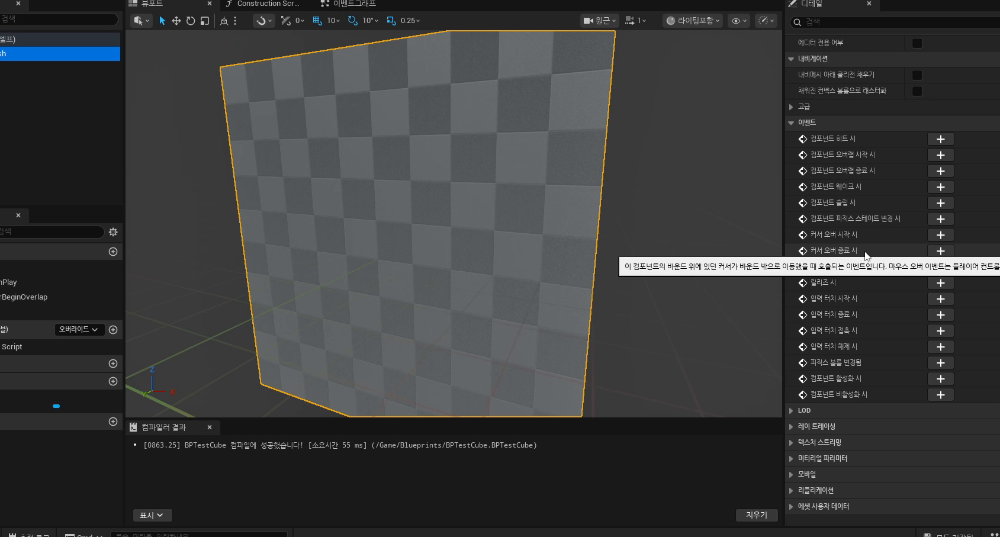

# 초급 1편. 충돌 시스템과 Projectile Stop

[허브](../) | [다음: 중급 1편](../02_intermediate_monster_timer_and_actor_tags/)

## 이 편의 목표

이 편에서는 `Block`, `Overlap`, `Ignore`, `Projectile Stop`, `Hit`, `Hit Result`를 한 줄로 정리한다.
핵심은 충돌을 단순 물리 반응이 아니라 게임 규칙의 시작점으로 읽는 것이다.

## 봐야 할 자료

- `D:\UE_Academy_Stduy_compressed\260403_1_기본 충돌 시스템.mp4`
- `D:\UnrealProjects\UE_Academy_Stduy\Source\UE20252\Etc\ProjectileBase.cpp`
- `D:\UnrealProjects\UE_Academy_Stduy\Source\UE20252\Player\WraithBullet.cpp`
- `D:\UnrealProjects\UE_Academy_Stduy\Source\UE20252\Etc\GeometryActor.cpp`

## 전체 흐름 한 줄

`충돌 응답 규칙 -> ProjectileMovement와 Projectile Stop -> Destroy로 기본 검증 -> Hit Result 활용 -> 일반 Hit/Overlap 이벤트로 확장`

## 충돌은 물리 현상보다 먼저 "반응 규칙표"다

첫 강의의 진짜 핵심은 총알이 맞고 사라지는 연출보다, 언리얼 충돌이 어떤 규칙으로 반응하는지 구분하는 데 있다.

- `Block`
  서로 막히는 충돌
- `Overlap`
  통과는 하지만 이벤트는 받는 충돌
- `Ignore`
  아예 무시하는 충돌

즉 충돌은 "부딪혔다"보다 먼저 "무엇과 어떤 방식으로 반응할 것인가"를 설계하는 일이다.


## `ProjectileMovement`는 충돌 입문용으로 가장 읽기 쉽다

투사체는 이동 방향이 단순하고, 충돌 후 멈추는 시점이 명확해서 충돌 시스템 입문 예제로 아주 좋다.
현재 프로젝트의 가장 얇은 대응 코드는 `AProjectileBase`다.

```cpp
mBody = CreateDefaultSubobject<UBoxComponent>(TEXT("Body"));
mMovement = CreateDefaultSubobject<UProjectileMovementComponent>(TEXT("Movement"));

SetRootComponent(mBody);
mMovement->SetUpdatedComponent(mBody);
mMovement->OnProjectileStop.AddDynamic(this, &AProjectileBase::ProjectileStop);
```

블루프린트의 `On Projectile Stop` 노드가 C++에서는 `AddDynamic` 바인딩으로 옮겨온다고 보면 된다.


## 충돌 후 `Destroy`는 가장 좋은 첫 검증이다

강의가 초반에 충돌 후 곧바로 `Destroy Actor`를 붙이는 이유는 실용적이다.

- 충돌 이벤트가 들어오는지 빠르게 확인할 수 있다.
- 충돌 프로필이 맞는지 즉시 검증할 수 있다.
- 이펙트, 데칼, 데미지는 그 위에 천천히 얹으면 된다.

현재 `AWraithBullet`는 그 "다음 단계"를 보여 준다.
충돌체에 `OnComponentHit`를 연결하고, 히트 시 탄환을 제거한 뒤 파티클과 사운드, 데칼까지 재생한다.

## `Hit Result`는 충돌의 증거 자료다

충돌 이벤트는 단순히 맞았다는 사실만 알려 주지 않는다.
어디에 맞았는지, 표면이 어느 방향이었는지, 어떤 대상이었는지까지 함께 준다.

```cpp
UGameplayStatics::SpawnDecalAtLocation(
    GetWorld(), mHitDecal,
    FVector(20.0, 20.0, 10.0),
    Hit.ImpactPoint,
    (-Hit.ImpactNormal).Rotation(),
    5.f
);
```

즉 `Hit Result`는 이후 데칼, 피격 이펙트, 파괴 위치 계산의 출발점이다.

## `Hit`, `Begin Overlap`, `End Overlap`은 서로 다른 입구다

강의 후반에 일반 컴포넌트 이벤트로 시야를 넓히는 이유도 중요하다.
투사체 전용 `Projectile Stop`만 있는 것이 아니라, 일반 컴포넌트 이벤트 쪽에는 `Hit`, `Begin Overlap`, `End Overlap`이 따로 있다.



현재 저장소도 이 차이를 그대로 보여 준다.

- `AProjectileBase`
  `Projectile Stop`
- `AWraithBullet`
  `OnComponentHit`
- `AItemBox`
  `OnComponentBeginOverlap`

즉 충돌 이벤트는 하나만 외우는 것이 아니라, 액터 성격에 맞는 입구를 고르는 감각이 중요하다.

## 일반 오브젝트 충돌도 같은 원리를 쓴다

`AGeometryActor`는 같은 원리가 파괴 오브젝트로 확장되는 예시다.

```cpp
mGeometry->OnComponentHit.AddDynamic(this, &AGeometryActor::GeometryHit);
mGeometry->ApplyExternalStrain(ItemIndex, Hit.ImpactPoint, 50.f, 1, 1.f, 1500000.f);
```

즉 `260403`에서 배우는 충돌 철학은 뒤의 파괴 오브젝트, 스킬 충돌, 히트 연출까지 그대로 이어진다.


## 이 편의 핵심 정리

1. 충돌은 물리보다 먼저 규칙표다.
2. `ProjectileMovement + Projectile Stop`은 충돌 입문용으로 가장 읽기 쉽다.
3. `Destroy`는 이벤트 검증을 위한 가장 기본적인 후속 처리다.
4. `Hit Result`는 충돌 이후 연출과 후속 계산의 출발점이다.
5. `Projectile Stop`, `Hit`, `Overlap`은 액터 성격에 따라 고르는 서로 다른 이벤트 입구다.

## 다음 편

[중급 1편. 몬스터 타이머와 액터 태그](../02_intermediate_monster_timer_and_actor_tags/)
