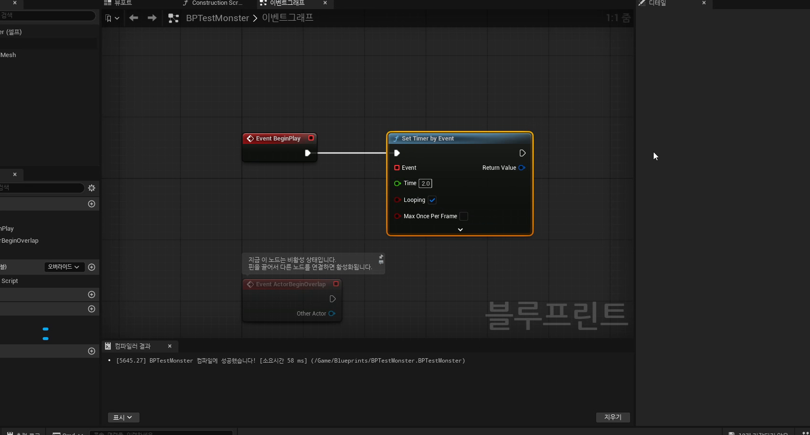
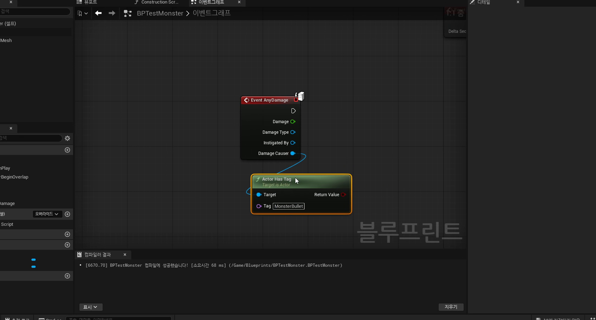

# 중급 1편. 몬스터 타이머와 액터 태그

[이전: 초급 1편](../01_beginner_collision_projectile_hit_overlap/) | [허브](../) | [다음: 중급 2편](../03_intermediate_trigger_box_and_level_blueprint_traps/)

## 이 편의 목표

이 편에서는 `Set Timer by Event`, `Fire`, `PlayerBullet`, `MonsterBullet`, `Actor Has Tag`, `AnyDamage` 흐름을 정리한다.
핵심은 충돌만으로 판정이 끝나는 것이 아니라, 시간과 소속 식별이 붙어야 실제 게임 규칙이 완성된다는 점이다.

## 봐야 할 자료

- `D:\UE_Academy_Stduy_compressed\260403_2_기본 몬스터 제작 및 액터 태그.mp4`
- `D:\UnrealProjects\UE_Academy_Stduy\Source\UE20252\Monster\MonsterBase.cpp`
- `D:\UnrealProjects\UE_Academy_Stduy\Source\UE20252\Monster\MonsterSpawnPoint.h`

## 전체 흐름 한 줄

`Set Timer by Event -> Fire 반복 호출 -> Spawn Actor -> 태그 부착 -> Actor Has Tag / AnyDamage로 분기`

## `Set Timer by Event`는 반복 행동의 리듬 장치다

강의의 중심은 몬스터가 일정 시간마다 행동하게 만드는 데 있다.
여기서 `Set Timer by Event`는 총알 전용 노드가 아니라, 시간을 기준으로 행동을 반복 호출하는 가장 간단한 리듬 장치다.


실제 실습에서는 `BeginPlay`에서 타이머를 걸고, `Looping`을 켠 뒤 `Fire` 커스텀 이벤트를 반복 실행한다.



즉 역할 분리는 이렇게 읽으면 된다.

- 타이머
  언제 실행할지 결정
- `Fire`
  실제로 무엇을 할지 결정

## `Fire`는 총알이 아니라 "행동 단위"다

`Fire`라는 이름 때문에 무기 기능처럼 보일 수 있지만, 실제로는 주기적으로 다시 호출될 수 있는 행동 단위라고 보는 편이 정확하다.
그래서 이 구조는 나중에 총알 대신 스킬, 함정 발동, 반복 오브젝트 생성으로도 곧바로 확장된다.

강의의 흐름도 결국 다음 순서다.

1. 타이머가 돈다.
2. `Fire`가 호출된다.
3. 위치와 방향을 계산한다.
4. `Spawn Actor`로 탄환을 만든다.
5. 그 인스턴스에 소속 정보를 붙인다.

## 태그는 가장 가벼운 소속 식별자다

같은 `BPBullet`을 플레이어와 몬스터가 같이 쓸 수 있다면, 그 탄환이 누구 소속인지 구분할 방법이 필요하다.
강의는 이 문제를 가장 단순한 방식으로 해결한다.

- 플레이어가 쏜 탄환
  `PlayerBullet`
- 몬스터가 쏜 탄환
  `MonsterBullet`


즉 태그는 오브젝트의 이름표다.
가볍고 빠르게 소속을 붙일 수 있어서 입문 단계에서 매우 유용하다.

## `Actor Has Tag`는 충돌 이후 식별 분기의 핵심이다

충돌 이벤트는 "뭔가 맞았다"만 알려 준다.
그다음 실제 판정은 태그를 읽고 나서 결정된다.



즉 역할을 나누면 이렇다.

- 충돌
  이벤트 시작점
- 태그
  소속 식별
- 데미지 로직
  실제 체력 변화 여부 결정

## 태그와 `AnyDamage`가 합쳐져야 판정 규칙이 닫힌다

강의 후반의 진짜 핵심은 `AnyDamage`와 태그 필터를 같이 쓰는 부분이다.
예를 들어 몬스터는 `DamageCauser`가 `MonsterBullet` 태그를 가졌는지 먼저 검사하고, 자기 진영 탄환이면 무시하고 아니면 HP를 깎는 식이다.


즉 `260403`은 단순히 태그 노드를 배우는 날이 아니라, "누가 누구를 때릴 수 있는가"라는 규칙을 처음으로 분기하는 날이다.

## 현재 프로젝트는 태그에서 더 정교한 규칙으로 발전했다

지금 C++ 프로젝트에서는 태그만으로 모든 판정을 처리하지는 않는다.
충돌 프로파일, 팀 ID, `TakeDamage()` 같은 더 정교한 구조가 함께 붙어 있다.

```cpp
GetCapsuleComponent()->SetCollisionProfileName(TEXT("Player"));
SetGenericTeamId(FGenericTeamId(TeamPlayer));

mBody->SetCollisionProfileName(TEXT("Monster"));
SetGenericTeamId(FGenericTeamId(TeamMonster));
```

그리고 실제 체력 변화는 `AMonsterBase::TakeDamage()`에서 처리한다.

즉 흐름은 이렇게 성장한다.

- 입문 실습
  태그로 소속 구분
- 현재 프로젝트
  충돌 프로파일 + 팀 ID + `TakeDamage()`로 더 정교하게 구분

## 이 편의 핵심 정리

1. `Set Timer by Event`는 반복 행동을 만드는 가장 쉬운 리듬 장치다.
2. 타이머와 `Fire`를 분리하면 시간 제어와 행동 로직을 따로 관리할 수 있다.
3. 태그는 오브젝트 소속을 구분하는 가장 가벼운 식별자다.
4. 충돌만으로 판정은 끝나지 않고, 태그와 데미지 로직이 붙어야 실제 규칙이 완성된다.
5. 현재 프로젝트는 이 구조를 충돌 프로파일, 팀 ID, `TakeDamage()`로 더 정교하게 확장한 상태다.

## 다음 편

[중급 2편. Trigger Box와 Level Blueprint 함정](../03_intermediate_trigger_box_and_level_blueprint_traps/)
