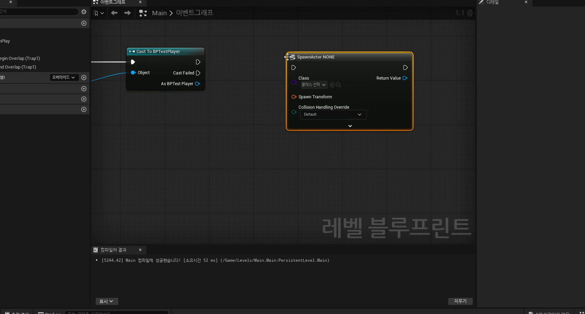

# 중급 2편. Trigger Box와 Level Blueprint 함정

[이전: 중급 1편](../02_intermediate_monster_timer_and_actor_tags/) | [허브](../) | [다음: 부록 1](../04_appendix_official_docs_reference/)

## 이 편의 목표

이 편에서는 `Trigger Box`, `Begin Overlap`, `End Overlap`, `Level Blueprint`, 함정 큐브 스폰 흐름을 정리한다.
핵심은 트리거를 보이지 않는 충돌체가 아니라 맵 이벤트의 시작점으로 이해하는 것이다.

## 봐야 할 자료

- `D:\UE_Academy_Stduy_compressed\260403_3_트리거 박스를 이용한 함정 제작.mp4`
- `D:\UnrealProjects\UE_Academy_Stduy\Source\UE20252\Etc\ItemBox.cpp`

## 전체 흐름 한 줄

`Trigger Box 배치 -> Begin/End Overlap 이벤트 생성 -> Level Blueprint에서 다른 액터 동작 호출 -> 함정 큐브 스폰`

## 트리거는 전투 규칙을 맵 기믹으로 확장하는 장치다

세 번째 강의는 지금까지 만든 충돌과 판정 규칙을 맵 연출로 확장하는 단계다.
함정, 문, 스폰 장치, 컷신 시작점은 결국 "특정 영역에 누가 들어왔는가"라는 질문으로 환원된다.


## `Trigger Box`는 대부분 `Overlap`으로 쓴다

트리거는 플레이어를 막는 벽이 아니라, 통과는 허용하면서 이벤트만 받는 영역에 가깝다.
그래서 보통 `Block`보다 `Overlap`으로 다루는 편이 자연스럽다.


이 구분이 중요한 이유는 분명하다.

- `Block`
  트리거 자체가 길을 막을 수 있다
- `Overlap`
  플레이어는 자연스럽게 지나가고, 시스템은 진입/이탈을 감지할 수 있다

## `Level Blueprint`는 월드에 이미 있는 액터를 가장 빨리 엮을 수 있다

입문 단계에서 `Level Blueprint`를 쓰는 이유는 단순하다.
트리거 박스와 함정 오브젝트가 이미 월드에 배치되어 있으니, 둘을 빠르게 연결해서 원리를 확인하기 좋기 때문이다.


즉 이번 파트는 재사용 가능한 시스템 설계보다 먼저, "월드 액터 사이 이벤트를 연결하면 맵 기믹이 된다"는 감각을 심는 데 목적이 있다.

## `Begin Overlap`과 `End Overlap`은 진입/이탈의 쌍이다

트리거는 한 번 눌리면 끝나는 버튼이 아니다.
누군가 들어왔는지, 아직 머물러 있는지, 나갔는지를 모두 다룰 수 있다.

- `Begin Overlap`
  영역에 진입했을 때
- `End Overlap`
  영역에서 이탈했을 때


즉 트리거는 단순 이벤트가 아니라 상태 전환의 시작점이 될 수도 있다.

## 함정의 본질은 "오버랩을 다른 액터 동작으로 번역하는 것"이다

트리거 박스는 스스로 함정을 만들지 않는다.
플레이어가 지나갔다는 사실을 알려 줄 뿐이다.
실제 함정은 그 이벤트를 다른 액터의 동작으로 번역할 때 완성된다.



이 구조를 추상화하면 다음과 같다.

1. 보이지 않는 영역을 둔다.
2. 플레이어가 그 영역과 겹친다.
3. `Begin Overlap`이 발생한다.
4. 다른 액터를 스폰하거나 물리를 켜거나 상태를 바꾼다.


## 현재 프로젝트는 이 책임을 액터 내부 이벤트로 옮겨 갔다

지금 소스에는 `Level Blueprint` 예제가 그대로 남아 있지 않다.
대신 비슷한 오버랩 구조가 액터 내부로 캡슐화되어 있다.

```cpp
mBody->OnComponentBeginOverlap.AddDynamic(this, &AItemBox::ItemOverlap);

void AItemBox::ItemOverlap(UPrimitiveComponent* OverlappedComponent, AActor* OtherActor,
    UPrimitiveComponent* OtherComp, int32 OtherBodyIndex, bool bFromSweep,
    const FHitResult& SweepResult)
{
    Destroy();
}
```

즉 성장 흐름은 이렇게 읽으면 된다.

- 입문 단계
  `Level Blueprint`에서 빠르게 연결
- 확장 단계
  액터 내부 이벤트로 책임 이동

## 이 편의 핵심 정리

1. 트리거는 보이지 않는 충돌체가 아니라 맵 이벤트의 시작점이다.
2. `Trigger Box`는 보통 `Block`보다 `Overlap`으로 쓰는 편이 자연스럽다.
3. `Begin Overlap`과 `End Overlap`을 같이 써야 진입/이탈 상태를 다룰 수 있다.
4. 함정의 본질은 오버랩 이벤트를 다른 액터 동작으로 번역하는 데 있다.
5. 현재 프로젝트는 이 구조를 `Level Blueprint`보다 액터 내부 이벤트로 정리하는 방향으로 발전했다.

## 다음 편

[부록 1. 공식 문서로 다시 읽는 충돌과 트리거](../04_appendix_official_docs_reference/)
