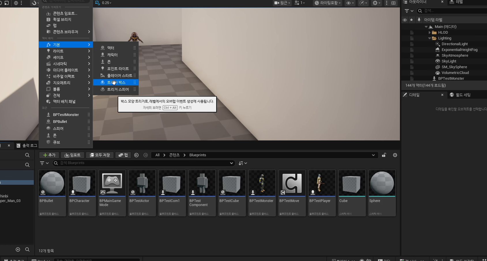

# 부록 1. 공식 문서로 다시 읽는 충돌과 트리거

[이전: 중급 2편](../03_intermediate_trigger_box_and_level_blueprint_traps/) | [허브](../) | [다음: 부록 2](../05_appendix_current_project_cpp_reference/)

## 이 부록의 목표

이 부록에서는 `260403`에서 배운 충돌, 태그, 타이머, 트리거를 언리얼 공식 문서의 표준 용어와 연결한다.
즉 강의 내용을 뒤집는 편이 아니라, 자습할 때 어떤 문서를 어떤 순서로 보면 좋은지 길을 잡아 주는 편이다.

## 먼저 보면 좋은 공식 문서

- [Collision in Unreal Engine - Overview](https://dev.epicgames.com/documentation/en-us/unreal-engine/collision-in-unreal-engine---overview)
- [Using Gameplay Tags in Unreal Engine](https://dev.epicgames.com/documentation/en-us/unreal-engine/using-gameplay-tags-in-unreal-engine)
- [Quick Start Guide to Variables, Timers, and Events in Unreal Engine C++](https://dev.epicgames.com/documentation/en-us/unreal-engine/quick-start-guide-to-variables-timers-and-events-in-unreal-engine-cpp?application_version=5.6)
- [Trigger Volume Actors in Unreal Engine](https://dev.epicgames.com/documentation/en-us/unreal-engine/trigger-volume-actors-in-unreal-engine?application_version=5.6)
- [Unreal Engine Actors Reference](https://dev.epicgames.com/documentation/en-us/unreal-engine/unreal-engine-actors-reference)

## 충돌 문서는 `Block / Overlap / Ignore`를 반응 규칙으로 정리한다

강의 1편에서 가장 먼저 배운 충돌 구분은 공식 문서의 `Collision Overview`와 정확히 이어진다.
문서도 먼저 어떤 대상과 막힐지, 겹칠지, 무시할지를 규칙표처럼 정리한 뒤 각 이벤트 진입점을 이해하도록 설명한다.

즉 `Projectile Stop`, `Hit`, `Overlap`을 외우는 것보다 먼저 충돌 응답 규칙을 읽는 편이 맞다.

## 태그 문서는 강의의 `PlayerBullet / MonsterBullet` 예제를 더 큰 분류 체계로 확장한다

강의에서는 `Actor Tag`를 가장 가벼운 이름표로 다룬다.
공식 문서의 `Gameplay Tags`는 이 생각을 더 확장해, 상태와 소속과 분기 규칙을 계층적으로 표현하는 체계로 보여 준다.

즉 `260403`은 태그의 최종형을 배우는 날이 아니라, "식별 규칙을 오브젝트에 붙인다"는 사고를 처음 익히는 날이라고 보면 된다.

## 타이머 문서는 `Set Timer by Event`를 일반 문법으로 다시 보여 준다

강의 2편의 `Set Timer by Event`는 총알 발사용 노드처럼 보이지만, 공식 문서에서는 더 일반적인 시간 제어 도구로 정리된다.
핵심은 한 번만 실행할지, 반복 실행할지를 정하고, 실제 행동 함수와 분리해서 예약 실행한다는 점이다.

## 트리거 문서는 `Trigger Box + Level Blueprint`를 맵 규칙 설계로 묶어 준다

`Trigger Volume Actors` 문서는 트리거를 전투 전용 기능이 아니라, 문 열기, 함정 시작, 컷신 재생, 오브젝트 스폰 같은 모든 맵 이벤트의 시작점으로 설명한다.
그래서 강의에서 `Trigger Box`를 `Overlap` 기반으로 다루는 것이 아주 정석적이다.

## 추천 읽기 순서

1. `Collision Overview`로 충돌 응답 규칙을 먼저 본다.
2. `Trigger Volume Actors`, `Actors Reference`로 맵 이벤트 구조를 본다.
3. `Variables, Timers, and Events`로 시간 제어를 본다.
4. `Using Gameplay Tags`로 식별 규칙이 어떻게 확장되는지 본다.

## 이 부록의 핵심 정리

1. `260403`의 블루프린트 예제는 공식 문서 기준으로도 아주 정석적인 엔진 기초다.
2. 충돌, 태그, 타이머, 트리거는 서로 다른 주제가 아니라 하나의 게임 규칙 체인으로 이어진다.
3. 공식 문서를 같이 읽으면 뒤의 데미지, AI, 스킬 판정 파트를 훨씬 쉽게 찾아갈 수 있다.

## 다음 편

[부록 2. 현재 프로젝트 C++로 다시 읽는 판정 구조](../05_appendix_current_project_cpp_reference/)
