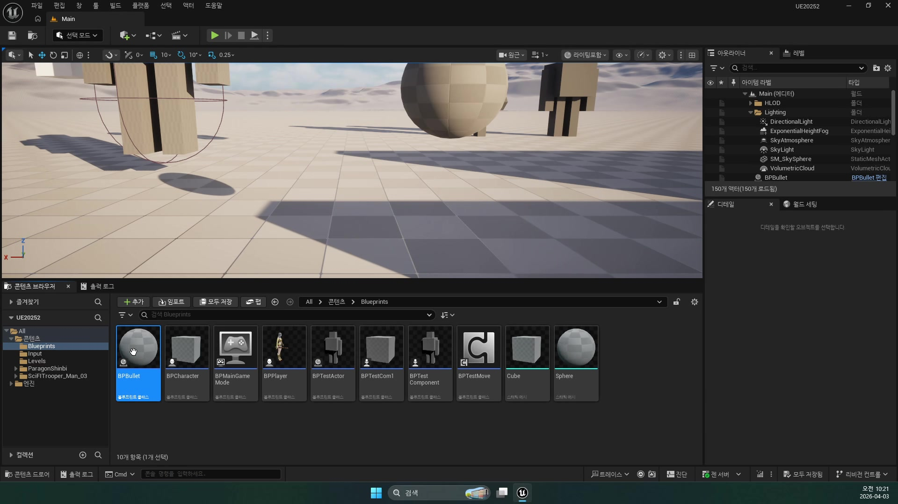
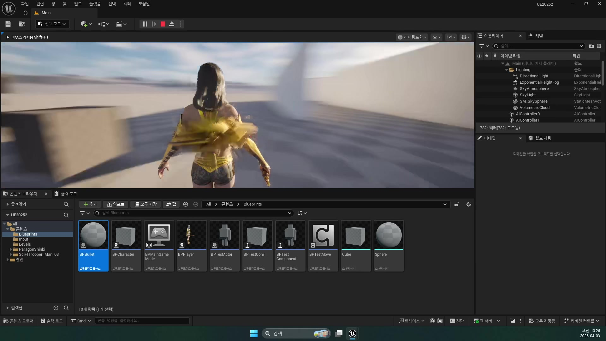
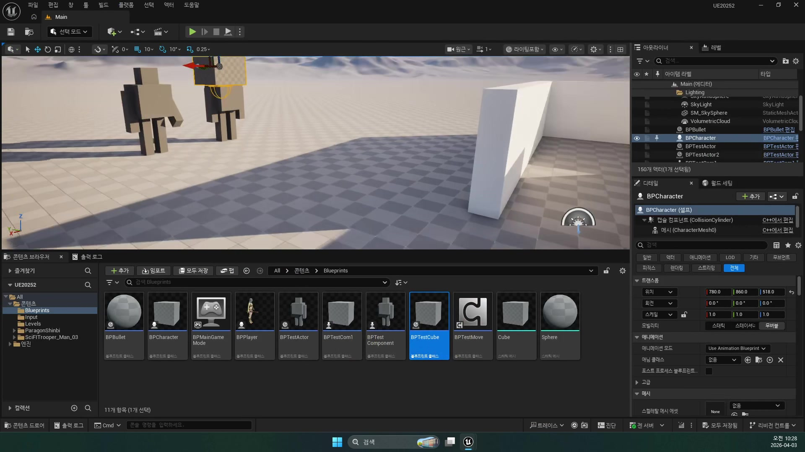
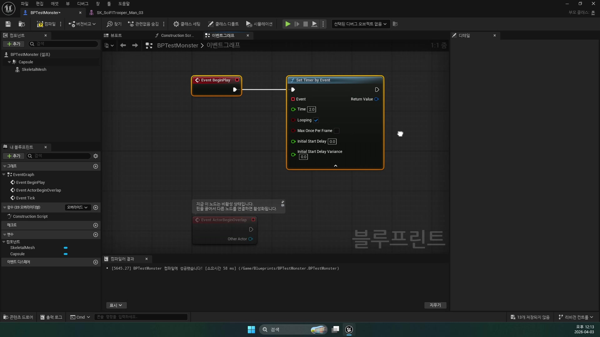
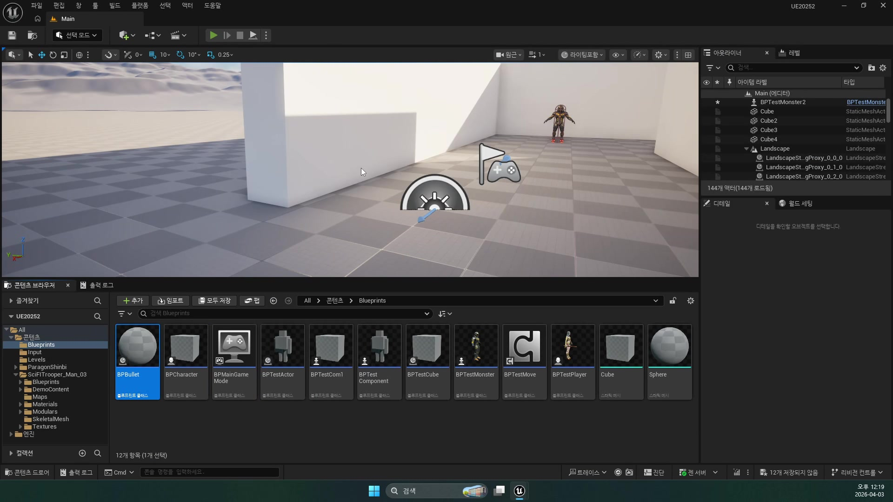
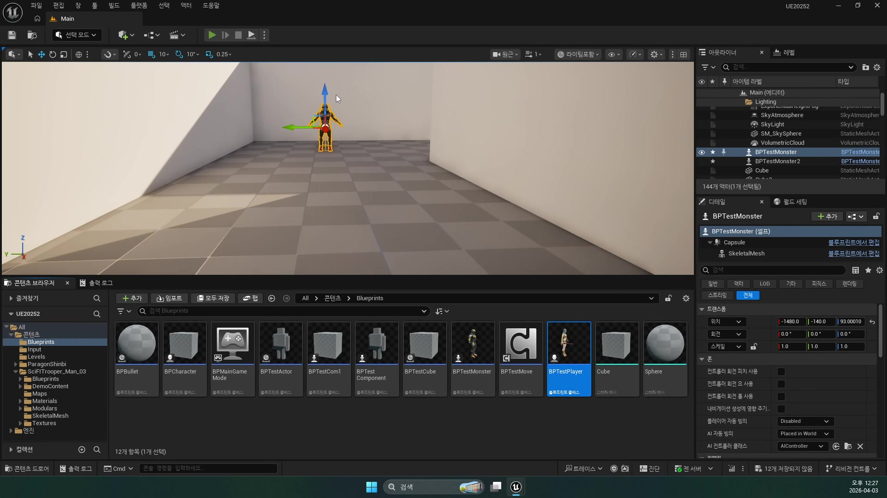
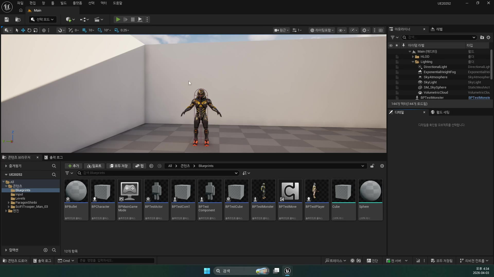
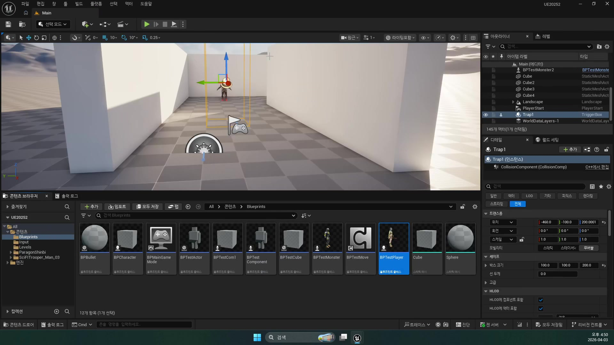
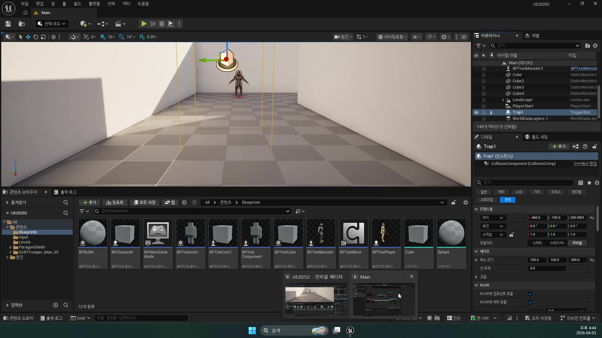
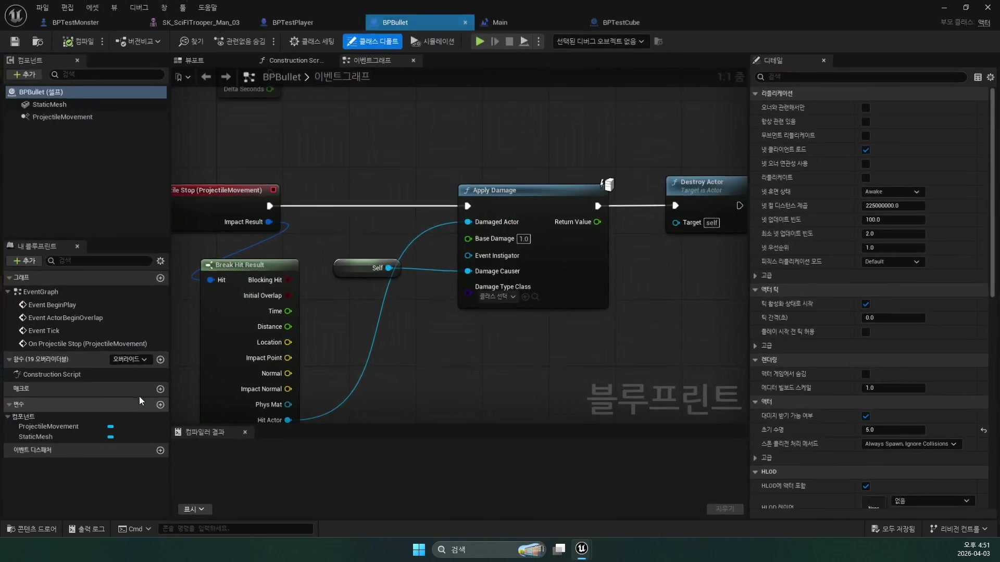

# 260403 충돌, 태그, 트리거 기반 기믹 입문

## 문서 개요

이 문서는 `260403_1`부터 `260403_3`까지의 강의를 하나의 연속된 교재로 다시 정리한 것이다.
이번 날짜의 핵심은 플레이어와 발사체를 "보이게 만드는 단계"에서 한 걸음 더 나아가, 누가 누구와 부딪히는지, 그 충돌을 어떻게 판정할지, 그리고 그 위에 맵 기믹을 어떻게 올릴지를 배우는 데 있다.

강의 흐름을 한 줄로 요약하면 다음과 같다.

`기본 충돌 이벤트 -> 몬스터 발사 타이머와 태그 구분 -> Trigger Box 기반 함정`

즉 `260403`은 전투 연출 자체보다 "판정 규칙"과 "이벤트 시작점"을 배우는 날이다.
뒤에서 나오는 데미지, AI, 스킬, 애니메이션도 결국은 어떤 대상이 어떤 조건에서 이벤트를 받느냐 위에서 움직이기 때문에, 이 날짜는 프로젝트 전체의 룰 설계 입문에 가깝다.

이 교재는 아래 세 자료를 함께 대조해 작성했다.

- `D:\UE_Academy_Stduy_compressed`의 원본 영상 및 자막
- 원본 영상에서 다시 추출한 대표 장면 캡처
- `D:\UnrealProjects\UE_Academy_Stduy\Source\UE20252`의 실제 C++ 소스

## 학습 목표

- `Block`, `Overlap`, `Ignore`의 차이를 실제 게임 판정 관점에서 설명할 수 있다.
- `Projectile Stop`, `Hit`, `Overlap`, `Hit Result`가 언제 쓰이는지 구분할 수 있다.
- 액터 태그가 충돌 이후의 식별 규칙으로 왜 유용한지 설명할 수 있다.
- `Set Timer by Event`로 반복 발사나 주기 이벤트를 만드는 원리를 말할 수 있다.
- `Trigger Box`, `Begin Overlap`, `End Overlap`, `Level Blueprint`를 이용해 맵 기믹을 만드는 흐름을 정리할 수 있다.

## 강의 흐름 요약

1. 발사체와 일반 컴포넌트 충돌을 예제로 삼아, `Block / Overlap / Ignore`와 `Projectile Stop` 이벤트의 의미를 익힌다.
2. 몬스터는 `Set Timer by Event`로 주기적으로 발사하고, 생성된 탄환에는 `PlayerBullet`, `MonsterBullet` 태그를 붙여 소속을 구분한다.
3. 마지막으로 `Trigger Box`와 `Level Blueprint`의 `Begin/End Overlap`을 이용해 보이지 않는 함정 영역을 만들고, 위에서 떨어지는 큐브 같은 맵 기믹을 연결한다.

---

## 제1장. 기본 충돌 시스템: Projectile Stop, Hit, Overlap을 어떻게 읽을 것인가

### 1.1 충돌은 단순 물리 반응이 아니라 게임 규칙이다

첫 강의는 총알이 부딪히고 사라지는 단순한 예제로 시작하지만, 실제로는 언리얼 충돌 시스템의 핵심 규칙을 설명하는 시간이다.
자막에서 가장 먼저 강조하는 말도 "충돌 쪽은 로직이 더 중요하다"는 점이다.

언리얼의 기본 충돌 개념은 세 가지로 정리된다.

- `Block`: 서로 막히는 충돌
- `Overlap`: 통과는 되지만 이벤트는 받는 충돌
- `Ignore`: 아예 무시하는 충돌

이 세 가지를 이해하면, 같은 탄환이라도 벽에는 막히고, 트리거와는 겹치고, 자기 자신은 무시하게 만드는 식의 설계를 읽을 수 있다.
즉 충돌은 단순한 "물리"가 아니라, 어떤 오브젝트가 어떤 오브젝트에 반응할지 정하는 규칙표다.



### 1.2 ProjectileMovement는 투사체 충돌의 가장 쉬운 입문 루트다

강의는 발사체부터 충돌을 설명한다.
그 이유는 발사체는 이동 규칙이 단순하고, 충돌했을 때 멈추거나 사라지는 시점이 분명해서 이벤트 흐름을 이해하기 좋기 때문이다.

현재 프로젝트의 가장 얇은 C++ 예시는 `AProjectileBase`다.

```cpp
mBody = CreateDefaultSubobject<UBoxComponent>(TEXT("Body"));
mMovement = CreateDefaultSubobject<UProjectileMovementComponent>(TEXT("Movement"));

SetRootComponent(mBody);
mMovement->SetUpdatedComponent(mBody);

mMovement->OnProjectileStop.AddDynamic(this, &AProjectileBase::ProjectileStop);
```

이 구조는 `260403_1` 강의가 설명한 원리와 거의 정확히 맞아떨어진다.
자막에서도 `ProjectileMovement`에는 이미 충돌 관련 기능이 있고, 충돌 후 멈추는 시점에 `Projectile Stop` 이벤트를 받을 수 있다고 설명한다.

즉 이 강의의 핵심은 "투사체는 굳이 복잡한 물리 계산을 직접 짜지 않아도, 엔진이 준비한 이동 컴포넌트와 이벤트를 잘 조합하면 기본 판정이 만들어진다"는 점이다.



### 1.3 충돌 후 Destroy는 가장 기본적인 발사체 처리다

강의 중반부는 매우 실용적이다.
충돌했을 때 무슨 거창한 반응을 만들기보다, 일단 충돌 사실을 잡고 `Destroy Actor`를 호출해 사라지게 만드는 가장 기본 루프부터 익힌다.

이 선택이 좋은 이유는 명확하다.

- 충돌 이벤트가 실제로 들어오는지 바로 검증할 수 있다.
- 충돌체 설정이 맞는지 빠르게 확인할 수 있다.
- 이후 이펙트, 데미지, 데칼, 사운드는 그 위에 얹으면 된다.

현재 소스의 `AWraithBullet`는 그 "다음 단계"까지 보여 주는 좋은 예다.

```cpp
mBody->SetCollisionProfileName(TEXT("PlayerAttack"));
mBody->OnComponentHit.AddDynamic(this, &AWraithBullet::BulletHit);

void AWraithBullet::BulletHit(UPrimitiveComponent* HitComponent, AActor* OtherActor,
    UPrimitiveComponent* OtherComp, FVector NormalImpulse, const FHitResult& Hit)
{
    Destroy();
    UGameplayStatics::SpawnEmitterAtLocation(GetWorld(), mHitParticle, Hit.ImpactPoint);
    UGameplayStatics::SpawnSoundAtLocation(GetWorld(), mHitSound, Hit.ImpactPoint);
}
```

즉 `260403`에서는 "맞으면 지운다" 수준으로 시작하지만, 프로젝트가 진행되면 그 자리에 파티클, 사운드, 데칼이 붙으면서 완성형 탄환이 된다.

### 1.4 Hit Result는 충돌이 일어난 위치와 상대를 읽는 창구다

자막에서는 `Break Hit Result`도 짚어 준다.
이 말은 곧, 충돌 이벤트는 단순히 "맞았다"만 알려 주는 것이 아니라, 어디를 맞았는지, 어떤 법선 방향으로 부딪혔는지, 누구와 충돌했는지 같은 정보 묶음을 전달한다는 뜻이다.

`AWraithBullet::BulletHit()`도 실제로는 그 정보를 사용해 `Hit.ImpactPoint`, `Hit.ImpactNormal`을 읽고 있다.

```cpp
UGameplayStatics::SpawnDecalAtLocation(
    GetWorld(), mHitDecal,
    FVector(20.0, 20.0, 10.0),
    Hit.ImpactPoint,
    (-Hit.ImpactNormal).Rotation(), 5.f);
```

즉 `Hit Result`는 충돌의 "증거 자료"다.
처음에는 파괴만 해도 충분하지만, 나중에는 이 자료를 바탕으로 데칼을 붙이고, 피격 방향을 계산하고, 파편 연출까지 만들 수 있다.

### 1.5 일반 컴포넌트 Hit로도 같은 원리가 확장된다

강의 후반은 "이제 같은 원리를 일반 Static Mesh 컴포넌트 충돌 쪽으로도 확장해 보겠다"고 말한다.
이 포인트가 중요하다.
투사체는 입문용이고, 실제 프로젝트에서는 월드 오브젝트나 파괴 기믹도 결국 같은 `Hit` 이벤트 개념 위에서 동작하기 때문이다.

현재 프로젝트에서는 `AGeometryActor`가 그 확장 예시 역할을 한다.

```cpp
mGeometry->OnComponentHit.AddDynamic(this, &AGeometryActor::GeometryHit);

void AGeometryActor::GeometryHit(UPrimitiveComponent* HitComponent, AActor* OtherActor,
    UPrimitiveComponent* OtherComp, FVector NormalImpulse, const FHitResult& Hit)
{
    mGeometry->ApplyExternalStrain(ItemIndex, Hit.ImpactPoint, 50.f, 1, 1.f, 1500000.f);
}
```

여기서도 흐름은 같다.

- 충돌을 받는다.
- `Hit Result`를 읽는다.
- 충돌 위치를 기반으로 후속 로직을 실행한다.

즉 `260403`이 가르치는 충돌 철학은 뒤 날짜의 파괴 오브젝트, 스킬 이펙트, 데미지 시스템까지 그대로 이어진다.



### 1.6 장 정리

제1장의 핵심은 충돌을 "물리 현상"이 아니라 "게임 규칙의 시작점"으로 보는 것이다.
`ProjectileMovement`, `Projectile Stop`, `Hit`, `Hit Result`, `Destroy` 조합만 익혀도 아주 많은 기본 게임플레이를 만들 수 있다.

---

## 제2장. 기본 몬스터 제작과 액터 태그: 발사 주기와 소속 구분을 어떻게 붙일 것인가

### 2.1 Set Timer by Event는 반복 행동의 가장 간단한 리듬 장치다

두 번째 강의는 앞부분 녹화가 조금 비어 있지만, 핵심은 명확하다.
몬스터가 일정 시간마다 발사하도록 `Set Timer by Event`를 붙이는 흐름을 다룬다.

자막에서는 다음 점을 순서대로 설명한다.

- `Set Timer by Event`를 쓰면 특정 주기로 이벤트를 반복 실행할 수 있다.
- `Loop`를 켜면 계속 반복되고, 끄면 한 번만 실행된다.
- `Timer Handle`을 받아 두면 나중에 정지나 초기화가 가능하다.

즉 타이머는 "시간 간격으로 행동을 호출하는 리듬 장치"다.
AI가 본격적으로 들어가기 전 단계에서, 몬스터가 정해진 템포로 불을 뿜거나 탄환을 쏘거나 함정을 작동시키는 데 매우 유용하다.



### 2.2 Fire 이벤트는 나중에 무기가 아니라 행동 단위로 확장된다

강의에서는 `Fire` 같은 커스텀 이벤트를 하나 만들고, 타이머가 돌 때마다 그것이 호출되게 만든다.
이 구조가 좋은 이유는 발사 주기와 실제 발사 로직이 분리되기 때문이다.

- 타이머는 "언제"를 결정한다.
- `Fire` 이벤트는 "무엇을" 할지 결정한다.

이 구분은 나중에 총알 대신 스킬, 범위기, 함정 발동 같은 다른 행동으로도 바로 확장된다.
즉 `260403_2`는 단순한 블루프린트 노드 사용법보다 "행동을 시간과 분리해 설계하는 법"을 먼저 알려 주는 셈이다.

### 2.3 태그는 액터의 가장 가벼운 식별자다

강의의 중심은 곧 태그 설명으로 옮겨간다.
언리얼의 모든 액터는 태그를 가질 수 있고, 컴포넌트에도 태그를 붙일 수 있으며, 이것은 쉽게 말해 "이름표" 역할을 한다는 것이다.

이 설명이 중요한 이유는 몬스터와 플레이어가 같은 탄환 블루프린트를 공유할 수도 있기 때문이다.
겉모습은 같은 총알이어도, 누가 쐈는지를 구분해야 자기 총알엔 맞지 않고 상대 총알에만 반응하도록 만들 수 있다.

자막에서도 이 점을 아주 직설적으로 말한다.

- 플레이어가 쏜 총알은 `PlayerBullet`
- 몬스터가 쏜 총알은 `MonsterBullet`

즉 태그는 오브젝트의 소속을 구분하는 가장 싸고 빠른 식별자다.



### 2.4 Spawn Actor 다음에 태그를 붙이는 이유

강의는 `Spawn Actor`의 반환값으로 생성된 액터 레퍼런스를 받은 뒤, 거기에 태그를 넣는 흐름을 보여 준다.
중요한 점은 "총알 블루프린트 자체"에 태그를 박아 두는 것이 아니라, 생성된 인스턴스에 상황별 태그를 붙인다는 데 있다.

이렇게 해야 같은 블루프린트라도 상황에 따라 다른 소속으로 사용할 수 있다.
예를 들어 플레이어가 발사하면 `PlayerBullet`, 몬스터가 발사하면 `MonsterBullet`을 붙이는 식이다.

현재 C++ 소스에도 그 흔적이 남아 있다.
`APlayerCharacter::AttackKey()`의 초기 프로토타입에는 이런 주석이 있다.

```cpp
TObjectPtr<ATestBullet> Bullet =
    GetWorld()->SpawnActor<ATestBullet>(SpawnLoc, GetActorRotation(), param);

Bullet->SetLifeSpan(5.f);
Bullet->Tags.Add(TEXT("PlayerBullet"));
```

즉 지금은 주석 처리되어 있지만, `260403` 강의에서 실습한 태그 기반 식별 구조가 이후 C++ 전환 과정에서도 그대로 옮겨졌음을 알 수 있다.

### 2.5 태그와 Damage 시스템을 함께 써야 판정 규칙이 완성된다

자막 후반부는 이번 파일의 핵심을 정확히 정리한다.
충돌은 일단 받고, 그다음 로직에서 태그를 보고 체력을 깎을지 말지를 결정하는 구조가 중요하다는 것이다.

즉 충돌과 식별은 역할이 다르다.

- 충돌: "무언가 부딪혔다"는 사실을 알려 준다.
- 태그: "그 부딪힌 것이 누구 소속인가"를 알려 준다.
- 데미지 로직: 그 결과 실제로 체력을 깎을지 결정한다.

현재 프로젝트에서는 이 흐름이 태그에서 팀 ID와 데미지 함수 쪽으로 조금 더 발전해 있다.
`APlayerCharacter`와 `AMonsterBase`는 각각 팀 ID를 가지고, `TakeDamage()`를 통해 실제 피격 반응을 처리한다.

```cpp
GetCapsuleComponent()->SetCollisionProfileName(TEXT("Player"));
SetGenericTeamId(FGenericTeamId(TeamPlayer));

mBody->SetCollisionProfileName(TEXT("Monster"));
SetGenericTeamId(FGenericTeamId(TeamMonster));
```

그리고 몬스터 쪽은 실제로 `TakeDamage()`에서 체력을 깎고 죽음 처리까지 한다.

```cpp
float Dmg = Super::TakeDamage(DamageAmount, DamageEvent, EventInstigator, DamageCauser);
Dmg -= mDefense;
mHP -= Dmg;
```

즉 `260403`은 태그와 `Any Damage`를 결합해 "누가 누구를 때릴 수 있는가"를 배우는 날이고, 이후 프로젝트는 그 규칙을 충돌 프로필, 팀 ID, `TakeDamage()`로 더 정교하게 끌고 간다.



### 2.6 장 정리

제2장의 결론은 간단하다.
타이머는 행동의 주기를 만들고, 태그는 오브젝트의 소속을 구분하며, 데미지 로직은 그 식별 결과를 실제 체력 변화로 바꾼다.
이 세 가지가 붙으면 비로소 "누가 누구를 맞히는가"가 정리된다.

---

## 제3장. Trigger Box와 Level Blueprint: 보이지 않는 함정 영역을 만드는 법

### 3.1 전투 규칙 위에 맵 기믹을 올리는 단계

세 번째 강의는 지금까지 만든 플레이어, 몬스터, 총알, 충돌 같은 기본 구조를 바탕으로, 이제 그 위에 맵 기믹을 얹어보는 단계라고 설명한다.
즉 트리거 함정은 완전히 새로운 주제가 아니라, 앞선 충돌 규칙의 응용편이다.

예시도 아주 교재적이다.

- 특정 위치에 들어가면 위에서 돌이 떨어진다.
- 문이 열린다.
- 플레이어를 밀어낸다.

이 모든 것은 결국 "보이지 않는 특정 영역에 누가 들어왔는가"라는 질문으로 환원된다.
그래서 트리거는 게임 안에서 이벤트의 시작점, 말 그대로 방아쇠 역할을 한다.



### 3.2 Trigger Box는 대부분 Overlap으로 쓴다

강의는 `Trigger Box`를 꼭 알아두라고 강조한다.
그 이유는 트리거는 일반적으로 플레이어를 막는 물체가 아니라, 통과는 허용하되 이벤트만 발생시키는 영역이기 때문이다.

자막에서도 분명히 구분한다.

- `Hit`: 막히는 충돌
- `Overlap`: 서로 겹칠 수 있는 충돌
- 트리거는 대부분 `Overlap`으로 사용

이 구분은 중요하다.
트리거가 `Block`으로 동작하면 플레이어는 들어가지 못하고, 이벤트 지점 자체에 도달하기 어렵다.
반대로 `Overlap`이면 플레이어는 자연스럽게 지나가고, 시스템은 그 진입과 이탈을 감지할 수 있다.

### 3.3 Level Blueprint는 레벨 전체를 제어하는 가장 빠른 실습 장소다

강의가 트리거 박스와 함께 `Level Blueprint`를 같이 다루는 것도 의미가 있다.
`Level Blueprint`는 현재 레벨 전체를 제어하는 블루프린트라고 볼 수 있고, 월드에 이미 배치된 액터를 기준으로 바로 이벤트를 연결하기 좋다.

입문 단계에서는 이것이 매우 편하다.

- 함정 오브젝트는 이미 레벨에 있다.
- 트리거 박스도 이미 배치돼 있다.
- 둘을 바로 연결해 실험하기 좋다.

즉 `260403_3`은 시스템을 재사용 가능한 클래스로 정리하는 날이라기보다, "월드에 있는 액터들을 이벤트로 엮어 기믹을 만들 수 있다"는 감각을 익히는 날이다.



### 3.4 Begin Overlap과 End Overlap은 진입과 이탈의 쌍이다

강의는 `Trigger Box`를 선택한 뒤 `Level Blueprint`에서 `Begin Overlap`과 `End Overlap` 이벤트를 추가하는 흐름을 보여 준다.
이 둘을 같이 보는 것이 중요하다.

- `Begin Overlap`: 누군가 영역에 들어옴
- `End Overlap`: 누군가 영역에서 나감

즉 트리거는 단순한 "한 번 눌리면 끝" 장치가 아니라, 현재 영역 안에 있는 상태를 다룰 수도 있는 시스템이다.
문을 여는 장치라면 진입에만 반응할 수 있고, 함정 반복 발동이라면 진입/이탈을 둘 다 써서 상태를 바꿀 수도 있다.



### 3.5 함정의 본질은 "오버랩을 다른 액터 동작으로 번역하는 것"이다

트리거 자체는 아무 일도 하지 않는다.
플레이어가 지나간 사실을 알려 줄 뿐이다.
실제 함정은 그 이벤트를 다른 액터의 동작으로 번역할 때 생긴다.

강의 예시에서는 위에서 큐브나 돌이 떨어지게 만드는 식으로 연결한다.
즉 구조를 추상화하면 다음과 같다.

1. 보이지 않는 영역을 둔다.
2. 플레이어가 그 영역과 겹친다.
3. `Begin Overlap` 이벤트가 발생한다.
4. 다른 액터의 물리/위치/상태를 바꿔 함정이 작동한다.

이 구조를 이해하면 문, 함정, 스폰, 연출 시작점까지 거의 같은 방식으로 응용할 수 있다.



### 3.6 이후 프로젝트는 Level Blueprint 실습을 액터 캡슐화로 옮겨 간다

현재 소스 트리를 보면 `260403` 강의처럼 `Level Blueprint`에 직접 묶여 있는 코드는 남아 있지 않다.
대신 비슷한 이벤트 구조가 C++ 액터 안으로 캡슐화되어 있다.

대표적으로 `AGeometryActor`는 월드에 배치된 오브젝트가 `OnComponentHit`를 받아 자기 내부에서 파괴 반응을 처리한다.
즉 초반의 레벨 블루프린트 실습은 나중에 "이벤트를 받는 액터가 자기 책임 안에서 처리하는 구조"로 발전한 것이다.

이 변화는 중요한 성장 포인트다.

- 입문 단계: 레벨에서 빠르게 연결하며 원리를 익힌다.
- 확장 단계: 액터나 컴포넌트 내부로 책임을 옮겨 재사용 가능하게 만든다.

따라서 `260403_3`의 함정 강의는 단순한 블루프린트 실습이 아니라, 훗날 오브젝트 지향적으로 정리될 이벤트 시스템의 씨앗이라고 볼 수 있다.

### 3.7 장 정리

제3장의 핵심은 트리거를 "보이지 않는 충돌체"가 아니라 "이벤트 시작점"으로 이해하는 것이다.
`Trigger Box`, `Begin/End Overlap`, `Level Blueprint`만 알아도 전투 외의 맵 연출을 빠르게 만들 수 있다.

---

## 전체 정리

`260403`은 전투 시스템을 화려하게 만드는 날이 아니다.
오히려 그보다 더 앞단에서, 이벤트가 언제 시작되고, 누구에게 적용되며, 어떤 규칙으로 반응할지를 세우는 날이다.

세 파트는 각각 다른 주제처럼 보이지만 실제로는 한 줄기로 이어진다.

- 충돌은 이벤트를 발생시킨다.
- 태그는 그 이벤트의 대상 소속을 식별한다.
- 트리거는 충돌 기반 이벤트를 맵 기믹으로 확장한다.

이 날짜를 이해하고 나면, 이후의 데미지 시스템, AI 판정, 스킬 충돌, 함정, 맵 연출이 왜 모두 비슷한 사고방식으로 설계되는지도 보이기 시작한다.

## 복습 체크리스트

- `Block`, `Overlap`, `Ignore`의 차이를 예시와 함께 설명할 수 있는가?
- `Projectile Stop`과 일반 `Hit` 이벤트를 구분할 수 있는가?
- `Hit Result`에서 어떤 정보를 꺼내 쓸 수 있는지 알고 있는가?
- `Set Timer by Event`와 `Fire` 이벤트의 역할을 분리해서 설명할 수 있는가?
- `PlayerBullet`, `MonsterBullet` 같은 태그가 왜 필요한지 설명할 수 있는가?
- `Begin Overlap`과 `End Overlap`이 각각 어떤 상황에서 쓰이는지 알고 있는가?
- `Trigger Box`를 `Block`보다 `Overlap`으로 쓰는 이유를 말할 수 있는가?

## 세미나 질문

1. 충돌 자체와 데미지 판정을 분리해서 생각해야 하는 이유는 무엇인가?
2. 태그 기반 식별 방식은 빠르고 간단하지만, 프로젝트가 커질수록 어떤 한계가 생길 수 있을까?
3. `Level Blueprint` 실습이 교육용으로는 좋은데, 실제 프로젝트에서는 액터 내부 로직으로 이동하는 이유는 무엇일까?

## 권장 과제

1. 발사체가 벽에 맞으면 즉시 사라지는 구조를 기준으로, 여기에 히트 이펙트 하나를 추가하려면 어떤 정보가 더 필요한지 적어 본다.
2. `PlayerBullet`, `MonsterBullet` 태그 외에 `Trap`, `BossSkill`, `NeutralObject` 같은 태그가 생긴다고 가정하고, 어떤 규칙 충돌이 발생할 수 있는지 정리해 본다.
3. `Trigger Box` 하나를 이용해 "플레이어가 들어오면 돌이 떨어지고, 나가면 다시 원위치로 복구되는 장치"를 어떻게 구성할지 `Begin Overlap`과 `End Overlap` 기준으로 설계해 본다.
