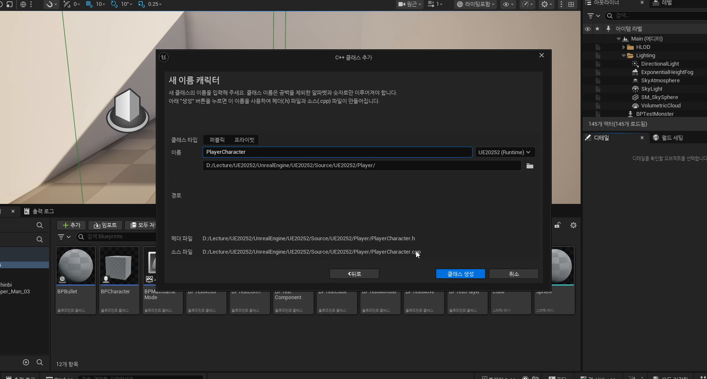
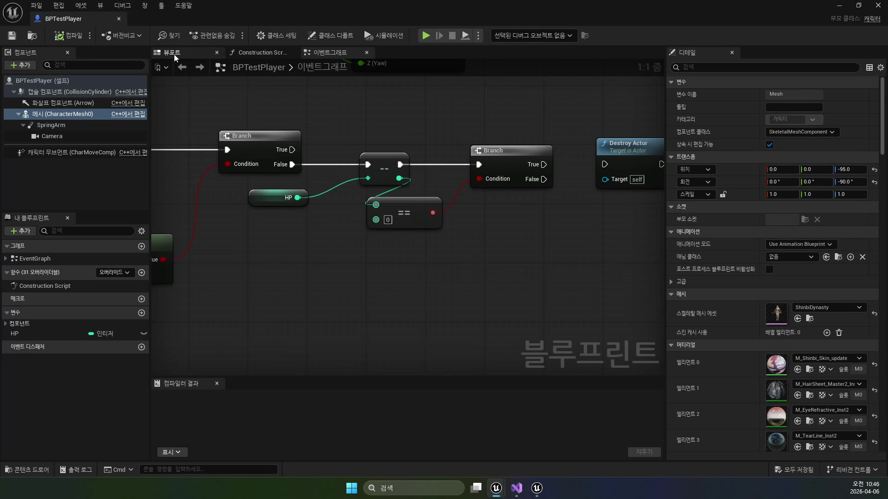
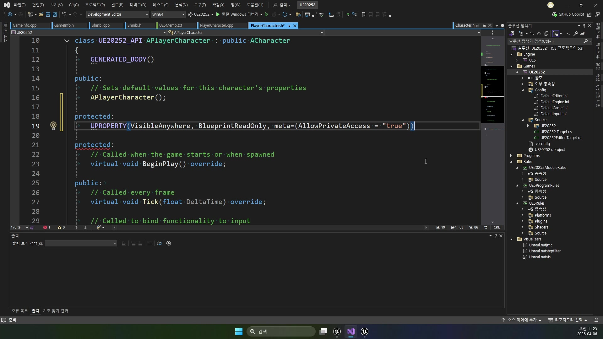

# 초급 1편. PlayerCharacter와 Shinbi 클래스 계층

[허브](../) | [다음: 중급 1편](../02_intermediate_defaultgamemode_and_inputdata/)

## 이 편의 목표

이 편에서는 `APlayerCharacter`와 `AShinbi`를 어떻게 나눠야 하는지, 그리고 왜 블루프린트 플레이어를 바로 개별 영웅 클래스 하나로 옮기지 않는지를 정리한다.
핵심은 공통부와 개별부를 분리하는 것이다.

## 봐야 할 자료

- `D:\UE_Academy_Stduy_compressed\260406_1_플레이어 C++ 클래스 생성.mp4`
- `D:\UnrealProjects\UE_Academy_Stduy\Source\UE20252\Player\PlayerCharacter.h`
- `D:\UnrealProjects\UE_Academy_Stduy\Source\UE20252\Player\PlayerCharacter.cpp`
- `D:\UnrealProjects\UE_Academy_Stduy\Source\UE20252\Player\Shinbi.cpp`
- `D:\UnrealProjects\UE_Academy_Stduy\Source\UE20252\Player\Wraith.cpp`

## 전체 흐름 한 줄

`새 C++ 클래스 생성 -> APlayerCharacter 베이스 확립 -> SpringArm/Camera 공통부 이동 -> Shinbi/Wraith 파생 클래스 분리`

## 언리얼 클래스는 엔진이 관리하는 객체다

강의 초반은 단순히 C++ 파일을 만드는 절차보다 먼저, 왜 플레이어가 언리얼 객체 계열이어야 하는지 설명하는 데 시간을 쓴다.
플레이어는 월드에 배치되고, 에디터와 상호작용하고, 블루프린트와 연결돼야 하므로 일반 C++ 유틸리티 객체와는 다른 문맥에 있다.

그래서 이번 날짜의 출발점은 "코드로 다시 만들기"가 아니라, "엔진이 관리하는 플레이어 클래스로 옮기기"에 가깝다.



## `APlayerCharacter`는 공통 플레이어 기능을 모으는 베이스다

실제 공통 베이스는 `APlayerCharacter`다.
이 클래스는 카메라, 입력 바인딩, 점프, 공격 진입점처럼 캐릭터가 달라도 거의 유지되는 기능을 모아 둔다.

생성자만 봐도 성격이 분명하다.

```cpp
mSpringArm = CreateDefaultSubobject<USpringArmComponent>(TEXT("Arm"));
mSpringArm->SetupAttachment(GetMesh());
mSpringArm->TargetArmLength = 200.f;
mSpringArm->SetRelativeLocation(FVector(0.0, 0.0, 150.0));
mSpringArm->SetRelativeRotation(FRotator(-10.0, 90.0, 0.0));

mCamera = CreateDefaultSubobject<UCameraComponent>(TEXT("Camera"));
mCamera->SetupAttachment(mSpringArm);

bUseControllerRotationYaw = true;
GetCharacterMovement()->JumpZVelocity = 700.f;
GetCapsuleComponent()->SetCollisionProfileName(TEXT("Player"));
```

즉 블루프린트에서 `SpringArm`, `Camera`, 점프 값, 회전 옵션을 손으로 맞추던 일을 공통 C++ 코드로 끌어온 것이다.



## `BPPlayer`에서 하던 실험이 `APlayerCharacter`로 승격된다

이 전환은 완전히 새 구조를 발명하는 것이 아니다.
이전 블루프린트 프로토타입 `BPPlayer`가 이미 `Character + SpringArm + Camera + 입력` 구조를 실험해 두었고, `260406`은 그 감각을 재사용 가능한 베이스 클래스로 굳히는 단계에 가깝다.

즉 `APlayerCharacter`는 "블루프린트를 버리는 클래스"가 아니라, 블루프린트에서 검증한 구조를 공통 코드로 승격시키는 클래스라고 읽는 편이 맞다.

## 파생 클래스는 외형과 개별 전투 동작을 맡는다

공통 입력과 카메라가 `APlayerCharacter`에 있다면, 실제 영웅별 차이는 파생 클래스가 맡아야 한다.
현재 소스에서 `AShinbi`와 `AWraith`가 바로 그 역할이다.

```cpp
static ConstructorHelpers::FObjectFinder<USkeletalMesh> MeshAsset(
    TEXT("/Script/Engine.SkeletalMesh'/Game/ParagonShinbi/.../ShinbiDynasty.ShinbiDynasty'"));

if (MeshAsset.Succeeded())
    GetMesh()->SetSkeletalMeshAsset(MeshAsset.Object);

GetCapsuleComponent()->SetCapsuleHalfHeight(95.f);
GetCapsuleComponent()->SetCapsuleRadius(28.f);
GetMesh()->SetRelativeLocation(FVector(0.0, 0.0, -95.0));
GetMesh()->SetRelativeRotation(FRotator(0.0, -90.0, 0.0));
```

즉 파생 클래스는 메시와 캡슐 보정, 애니메이션 블루프린트, 개별 공격 구현처럼 "영웅별로 달라지는 부분"을 채운다.



## 공통부와 개별부가 분리돼야 이후 확장이 쉬워진다

이 구조가 중요한 이유는 뒤 날짜에서 바로 드러난다.

- `APlayerCharacter`
  공통 카메라, 입력, 팀 정보, 기본 훅
- `AShinbi`
  신비 메시, 애님 클래스, 신비 공격 구현
- `AWraith`
  레이스 메시, 애님 클래스, 레이스 총알 발사 구현

즉 입력 골조는 재사용하고, 전투 방식과 외형만 갈아끼우는 구조가 만들어진다.
이 감각이 있어야 뒤의 애니메이션, 콤보, 스킬 강의도 자연스럽게 읽힌다.

## 이 편의 핵심 정리

1. 플레이어를 C++로 옮길 때는 개별 영웅보다 공통 베이스를 먼저 세우는 편이 낫다.
2. `APlayerCharacter`는 카메라, 입력, 점프, 공격 진입점 같은 공통부를 모으는 클래스다.
3. `AShinbi`, `AWraith` 같은 파생 클래스는 외형과 애니메이션, 개별 공격 구현을 맡는다.
4. 이 구조는 블루프린트 실험을 버리는 것이 아니라, 검증된 구조를 재사용 가능한 코드로 승격시키는 과정이다.

## 다음 편

[중급 1편. DefaultGameMode와 InputData](../02_intermediate_defaultgamemode_and_inputdata/)
