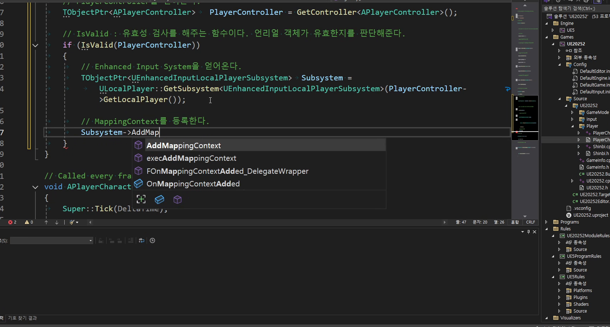
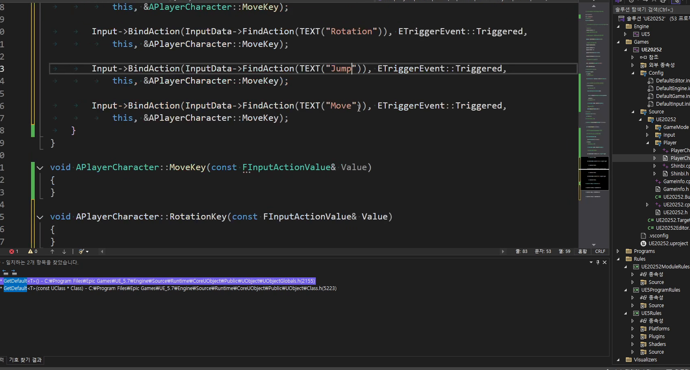

# 중급 1편. DefaultGameMode와 InputData

[이전: 초급 1편](../01_beginner_playercharacter_and_shinbi_cpp_hierarchy/) | [허브](../) | [다음: 중급 2편](../03_intermediate_rotation_jump_attack_loop/)

## 이 편의 목표

이 편에서는 `ADefaultGameMode`, `AMainPlayerController`, `UDefaultInputData`, `BeginPlay`, `SetupPlayerInputComponent`를 묶어서, 플레이어 진입점과 입력 자산 파이프라인을 정리한다.
핵심은 플레이어가 월드에 들어오는 길과, 들어온 뒤 조작되는 길을 분리해서 이해하는 것이다.

## 봐야 할 자료

- `D:\UE_Academy_Stduy_compressed\260406_2_입력 시스템 C++ 변환.mp4`
- `D:\UnrealProjects\UE_Academy_Stduy\Source\UE20252\GameMode\DefaultGameMode.cpp`
- `D:\UnrealProjects\UE_Academy_Stduy\Source\UE20252\Player\MainPlayerController.cpp`
- `D:\UnrealProjects\UE_Academy_Stduy\Source\UE20252\Input\InputData.h`
- `D:\UnrealProjects\UE_Academy_Stduy\Source\UE20252\Input\InputData.cpp`
- `D:\UnrealProjects\UE_Academy_Stduy\Source\UE20252\Player\PlayerCharacter.cpp`

## 전체 흐름 한 줄

`DefaultPawnClass / PlayerControllerClass 지정 -> InputData에 자산 모으기 -> BeginPlay에서 MappingContext 등록 -> SetupPlayerInputComponent에서 BindAction`

## `GameMode`는 실제 플레이어 진입점을 정한다

강의 2장의 핵심은 "지금 이 게임이 어떤 플레이어와 어떤 컨트롤러를 기본으로 쓸 것인가"를 코드에서 고정하는 데 있다.

강의의 원형은 `AShinbi + AMainPlayerController` 조합을 `ADefaultGameMode`에 붙이는 흐름이다.
다만 현재 branch는 여기서 한 단계 더 발전해서 GAS 플레이어를 기본 폰으로 사용한다.

```cpp
//DefaultPawnClass = AShinbi::StaticClass();
//DefaultPawnClass = AWraith::StaticClass();
DefaultPawnClass = AShinbiGAS::StaticClass();

PlayerStateClass = AMainPlayerState::StaticClass();
PlayerControllerClass = AMainPlayerController::StaticClass();
```

즉 강의의 구조는 여전히 유효하고, 현재 branch에서는 같은 자리에 `AShinbiGAS`가 올라간 상태라고 보면 된다.


## `MainPlayerController`는 조종 주체의 책임을 따로 가진다

플레이어 본체와 컨트롤러를 나누는 이유는 단순 possession 때문만이 아니다.
커서, 입력 모드, 마우스 피킹처럼 "조종 주체"의 책임을 플레이어 몸체 밖으로 빼기 위함이다.

현재 `AMainPlayerController`는 이 역할을 실제로 수행한다.

```cpp
bShowMouseCursor = true;

FInputModeGameAndUI InputMode;
SetInputMode(InputMode);

GetHitResultUnderCursor(ECollisionChannel::ECC_GameTraceChannel5, true, Hit);
```

즉 `PlayerControllerClass`를 따로 두는 순간부터, 이후 클릭 기반 상호작용과 마우스 타게팅도 자연스럽게 분리할 수 있게 된다.

## `UDefaultInputData`는 입력 자산 창고다

이 날짜의 가장 중요한 설계 포인트는 입력 에셋 경로를 플레이어 클래스 안에 흩뿌리지 않고 `UDefaultInputData`에 모은다는 점이다.

```cpp
TObjectPtr<UInputMappingContext> mContext;
TMap<FString, TObjectPtr<UInputAction>> mActions;

TObjectPtr<UInputAction> FindAction(const FString& Name) const;
```

즉 플레이어 쪽은 `"Move"`, `"Rotation"`, `"Jump"`, `"Attack"` 같은 이름으로 액션을 요청하고, 실제 자산 경로는 `InputData`가 관리한다.


현재 `UDefaultInputData` 생성자는 `IMC_Default`, `IA_Move`, `IA_Rotation`, `IA_Jump`, `IA_Attack`, `IA_Skill1`를 한 번에 로드한다.
즉 이 클래스는 실제로 "입력 자산 창고"라는 설명 그대로 동작한다.

## `BeginPlay`는 MappingContext 등록 단계다

Enhanced Input 파이프라인은 먼저 컨텍스트를 등록해야 시작된다.
`APlayerCharacter::BeginPlay()`는 로컬 플레이어 서브시스템을 얻고, 여기에 `mContext`를 등록한다.

```cpp
TObjectPtr<UEnhancedInputLocalPlayerSubsystem> Subsystem =
    ULocalPlayer::GetSubsystem<UEnhancedInputLocalPlayerSubsystem>(
        PlayerController->GetLocalPlayer());

const UDefaultInputData* InputData = GetDefault<UDefaultInputData>();
Subsystem->AddMappingContext(InputData->mContext, 0);
```




여기서 중요한 키워드는 `CDO`다.
`GetDefault<UDefaultInputData>()`로 기본 객체를 꺼내 쓰면, 플레이어 클래스는 각 자산의 경로를 직접 몰라도 된다.

## `SetupPlayerInputComponent`는 액션과 함수를 연결한다

컨텍스트 등록 다음 단계는 액션 바인딩이다.
현재 `APlayerCharacter`는 `FindAction()`으로 액션을 찾아 각 함수에 바인딩한다.

```cpp
Input->BindAction(InputData->FindAction(TEXT("Move")), ETriggerEvent::Triggered,
    this, &APlayerCharacter::MoveKey);

Input->BindAction(InputData->FindAction(TEXT("Rotation")), ETriggerEvent::Triggered,
    this, &APlayerCharacter::RotationKey);

Input->BindAction(InputData->FindAction(TEXT("Jump")), ETriggerEvent::Started,
    this, &APlayerCharacter::JumpKey);

Input->BindAction(InputData->FindAction(TEXT("Attack")), ETriggerEvent::Started,
    this, &APlayerCharacter::AttackKey);
```




즉 역할을 나누면 이렇다.

- `GameMode`
  누가 기본 플레이어인가를 정함
- `PlayerController`
  조종 문맥과 커서를 다룸
- `InputData`
  입력 자산을 모아 둠
- `BeginPlay`
  컨텍스트 등록
- `SetupPlayerInputComponent`
  실제 함수 바인딩

## 이 편의 핵심 정리

1. `GameMode`는 플레이어 진입점을 정하고, `PlayerController`는 조종 주체의 책임을 가진다.
2. 현재 branch의 기본 폰은 `AShinbiGAS`지만, 강의가 만든 진입점 구조 자체는 그대로 유지된다.
3. `UDefaultInputData`는 입력 자산을 한곳에 모아 두는 창고 역할을 한다.
4. `BeginPlay`는 컨텍스트 등록, `SetupPlayerInputComponent`는 액션 바인딩으로 역할이 나뉜다.
5. 이 분리가 있어야 이후 캐릭터 수가 늘어나도 입력 파이프라인을 안정적으로 유지할 수 있다.

## 다음 편

[중급 2편. Rotation, Jump, Attack 기본 루프](../03_intermediate_rotation_jump_attack_loop/)
