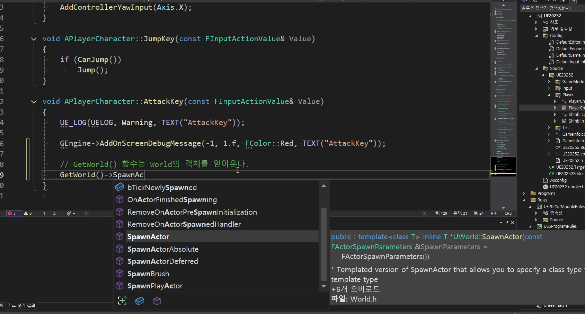

# 중급 2편. Rotation, Jump, Attack 기본 루프

[이전: 중급 1편](../02_intermediate_defaultgamemode_and_inputdata/) | [허브](../) | [다음: 부록 1](../04_appendix_official_docs_reference/)

## 이 편의 목표

이 편에서는 `bUseControllerRotationYaw`, `RotationKey`, `JumpKey`, `AttackKey`를 묶어서, 애니메이션 직전의 기본 조작 루프를 정리한다.
핵심은 전투를 완성하는 것이 아니라, 이후 애니메이션과 스킬이 올라갈 입력 골조를 만드는 것이다.

## 봐야 할 자료

- `D:\UE_Academy_Stduy_compressed\260406_3_플레이어 회전 점프 공격.mp4`
- `D:\UnrealProjects\UE_Academy_Stduy\Source\UE20252\Player\PlayerCharacter.cpp`
- `D:\UnrealProjects\UE_Academy_Stduy\Source\UE20252\Test\TestBullet.cpp`
- `D:\UnrealProjects\UE_Academy_Stduy\Source\UE20252\Player\Shinbi.cpp`
- `D:\UnrealProjects\UE_Academy_Stduy\Source\UE20252\Player\Wraith.cpp`

## 전체 흐름 한 줄

`Use Controller Rotation Yaw -> RotationKey로 시점/애님 값 준비 -> JumpKey 상태 검사 -> AttackKey 프로토타입 -> 파생 클래스 훅으로 확장`

## `bUseControllerRotationYaw`는 블루프린트 체크박스를 코드로 옮긴 사례다

강의는 회전부터 시작한다.
블루프린트 디테일 패널에서 체크하던 `Use Controller Rotation Yaw` 옵션이 사실은 클래스의 `bool` 멤버라는 점을 보여 주는 장면이다.

```cpp
bUseControllerRotationYaw = true;
```

즉 `260406`의 회전 파트는 단순히 캐릭터를 돌리는 방법보다, 블루프린트 옵션이 어떻게 코드 멤버로 이어지는지를 익히는 훈련이기도 하다.


## `RotationKey`는 몸 회전보다 조금 더 앞선 준비를 한다

현재 `RotationKey()`는 단순 Yaw 처리만 하지 않는다.
스프링암 회전을 바꾸고, 애니메이션 인스턴스에 시선 값도 넘긴다.

```cpp
void APlayerCharacter::RotationKey(const FInputActionValue& Value)
{
    FVector Axis = Value.Get<FVector>();

    mSpringArm->AddRelativeRotation(FRotator(Axis.Y, Axis.X, 0.0));

    mAnimInst->AddViewPitch(Axis.Y);
    mAnimInst->AddViewYaw(Axis.X);
}
```

즉 이 함수는 `260407`의 `Aim Offset`과 애니메이션 변수 업데이트를 미리 준비하는 연결 지점에 가깝다.


## `JumpKey`는 짧지만 상태 검사가 핵심이다

점프 구현은 코드 길이가 짧지만 의도는 분명하다.
점프 입력이 들어왔다고 해서 언제나 바로 점프하면 안 되고, 현재 상태에서 점프 가능한지를 먼저 검사해야 한다.

```cpp
void APlayerCharacter::JumpKey(const FInputActionValue& Value)
{
    if (CanJump())
        Jump();
}
```

즉 `JumpKey`는 "점프 추가"보다 "안전한 입력 진입 조건"을 만드는 데 더 가깝다.
그리고 생성자에서 잡아 둔 `JumpZVelocity = 700.f`가 기본 점프 감각을 정한다.


## `AttackKey`는 프로토타입에서 가상 함수 훅으로 발전했다

강의 당시의 공격 파트는 로그 출력과 테스트 발사체 스폰을 통해 입력이 제대로 들어오는지 검증하는 데 초점을 둔다.

```cpp
FVector SpawnLoc = GetActorLocation() + GetActorForwardVector() * 150.f;

FActorSpawnParameters Param;
Param.SpawnCollisionHandlingOverride =
    ESpawnActorCollisionHandlingMethod::AlwaysSpawn;

TObjectPtr<ATestBullet> Bullet =
    GetWorld()->SpawnActor<ATestBullet>(SpawnLoc, GetActorRotation(), Param);
```




다만 현재 `APlayerCharacter::AttackKey()`는 한 단계 더 추상화되어 있다.

```cpp
void APlayerCharacter::AttackKey(const FInputActionValue& Value)
{
    InputAttack();
}
```

즉 베이스 클래스는 입력의 진입점만 제공하고, 실제 공격 내용은 파생 클래스가 채우는 구조로 발전한 것이다.

## 파생 클래스는 공격 내용을 각자 다르게 채운다

이 차이는 현재 `AShinbi`와 `AWraith`를 비교해 보면 더 잘 보인다.

- `AShinbi::InputAttack()`
  마법진 유무에 따라 일반 공격 또는 스킬 연출 분기
- `AWraith::InputAttack()`
  기본 공격 애니메이션 재생
- `AWraith::NormalAttack()`
  머즐 소켓에서 `AWraithBullet` 스폰

즉 `260406`의 공격 파트는 전투 완성이 아니라, 이후 각 캐릭터가 자기 방식으로 확장할 수 있는 훅을 마련하는 날이라고 보는 편이 정확하다.

## 이 편의 핵심 정리

1. `bUseControllerRotationYaw`는 블루프린트 옵션이 코드 멤버로 이어지는 대표 사례다.
2. `RotationKey()`는 몸 회전뿐 아니라 다음 애니메이션 파트가 사용할 시선 값까지 준비한다.
3. `JumpKey()`는 짧지만 상태 검사가 핵심이다.
4. `AttackKey()`는 테스트 발사체 프로토타입에서 가상 함수 기반 훅 구조로 발전했다.
5. 그래서 `260406`의 마지막 파트는 전투 완성보다, 이후 시스템이 올라갈 입력 골조를 만드는 데 의미가 있다.

## 다음 편

[부록 1. 공식 문서로 다시 읽는 플레이어 구조](../04_appendix_official_docs_reference/)
