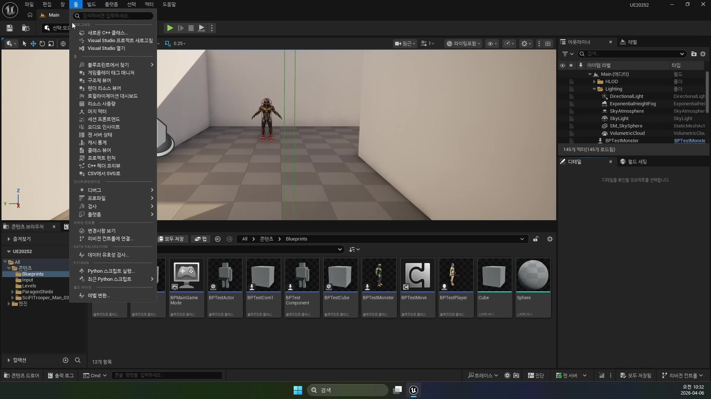
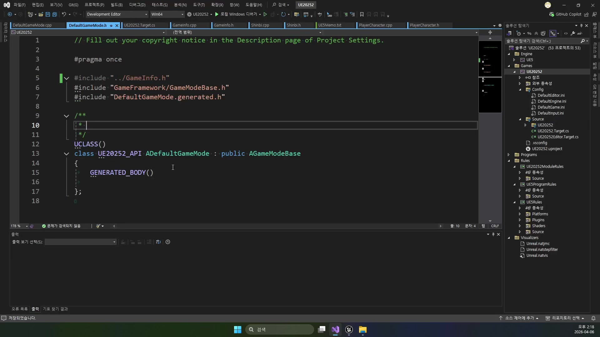
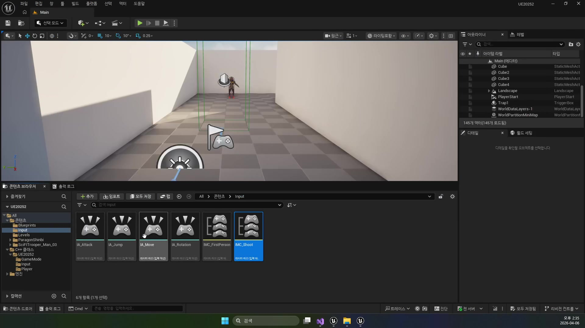
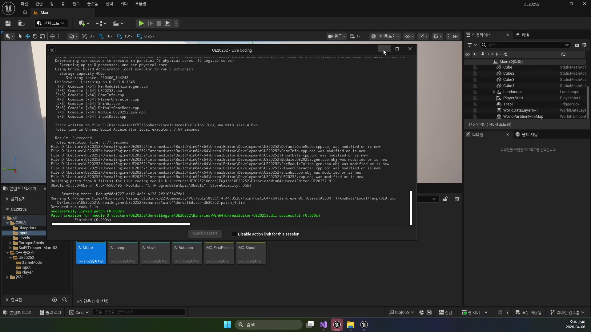
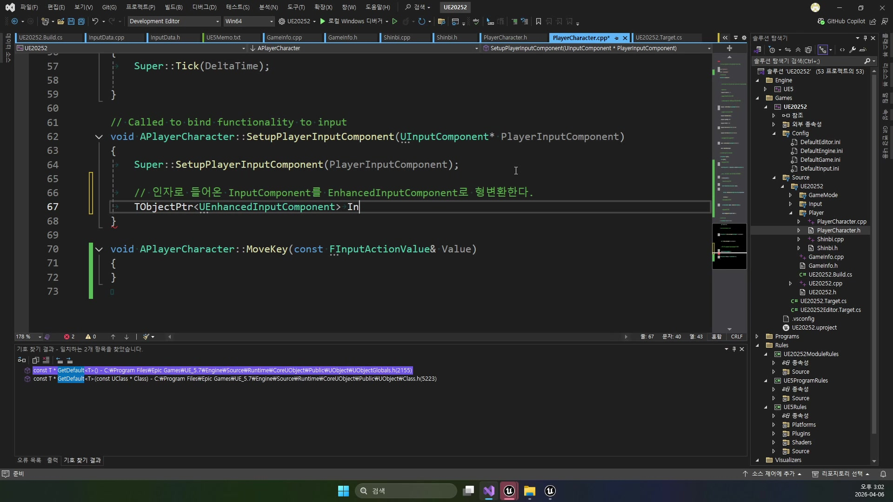
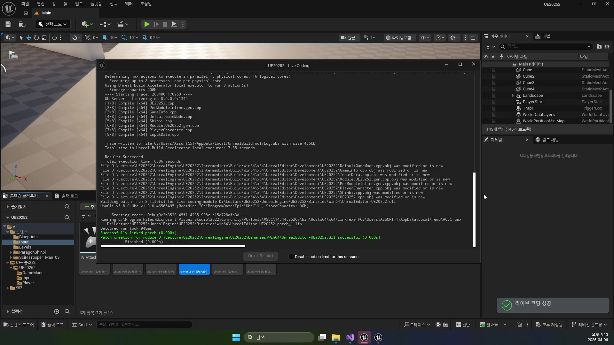
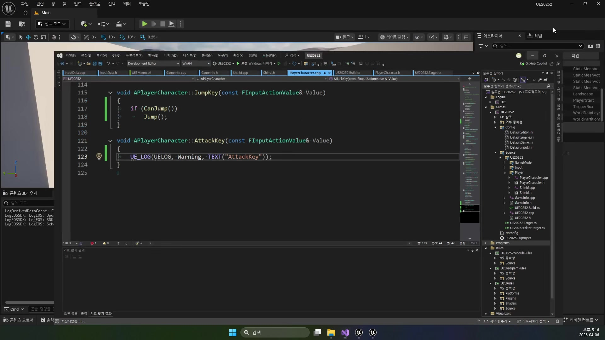
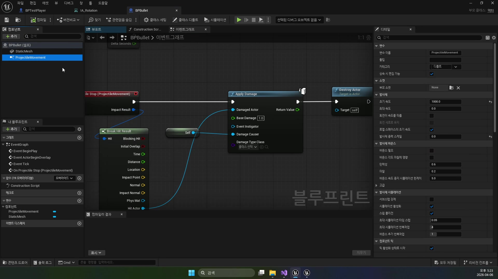
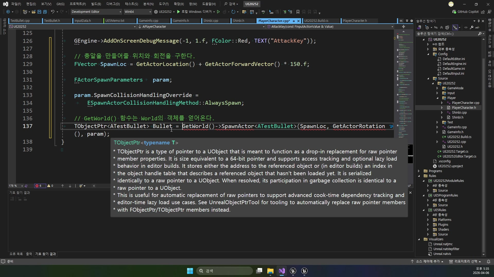

# 260406 플레이어 C++ 전환과 입력 시스템 기초

## 문서 개요

이 문서는 `260406_1`부터 `260406_3`까지의 강의를 하나의 연속된 교재로 다시 정리한 것이다.
이번 날짜의 핵심은 블루프린트로만 다루던 플레이어를 C++의 기본 클래스와 파생 클래스 구조로 옮기고, 입력 시스템과 조작 루프까지 코드 쪽으로 끌어오는 데 있다.

강의 흐름을 한 줄로 요약하면 다음과 같다.

`PlayerCharacter 기반 클래스 생성 -> Shinbi 파생 캐릭터 연결 -> InputData 자산화 -> Rotation / Jump / Attack 입력 구현`

즉 `260406`은 이후 애니메이션, 콤보, 몬스터 AI 강의보다 먼저 읽혀야 하는 플레이어 구조의 출발점이다.
이 날짜에서 플레이어 클래스의 틀과 입력 파이프라인이 잡히기 때문에, 뒤의 `260407` 애니메이션 파트는 이 구조 위에서 자연스럽게 이어진다.

이 교재는 아래 세 자료를 함께 대조해 작성했다.

- `D:\UE_Academy_Stduy_compressed`의 원본 영상과 자막
- 원본 영상에서 다시 추출한 대표 장면 캡처
- `D:\UnrealProjects\UE_Academy_Stduy\Source\UE20252`의 실제 C++ 소스

## 학습 목표

- 언리얼 클래스와 일반 C++ 클래스의 차이를 설명할 수 있다.
- `APlayerCharacter`를 공통 플레이어 베이스로 두고 `AShinbi` 같은 파생 클래스로 외형과 개별 동작을 붙이는 이유를 말할 수 있다.
- `UDefaultInputData`가 `InputMappingContext`와 `InputAction`을 어디에 모으고, 왜 `CDO`를 통해 꺼내 쓰는지 설명할 수 있다.
- `BeginPlay()`와 `SetupPlayerInputComponent()`가 Enhanced Input 파이프라인에서 각각 어떤 역할을 맡는지 구분할 수 있다.
- `RotationKey`, `JumpKey`, `AttackKey`가 이후 애니메이션/전투 시스템으로 넘어가기 전에 어떤 기본 동작을 완성하는지 설명할 수 있다.

## 강의 흐름 요약

1. 에디터에서 새 C++ 클래스를 만들고, 블루프린트 플레이어를 대체할 `APlayerCharacter`를 세운다.
2. 공통 기능은 `APlayerCharacter`에 두고, 외형과 개별 동작은 `AShinbi`, `AWraith` 같은 파생 클래스에 분리한다.
3. `ADefaultGameMode`에서 `DefaultPawnClass`와 `PlayerControllerClass`를 지정해 실제 플레이어 진입점을 C++ 클래스로 바꾼다.
4. 입력 에셋은 `UDefaultInputData`에 모으고, `BeginPlay()`에서 `MappingContext`를 등록한 뒤 `SetupPlayerInputComponent()`에서 액션을 바인딩한다.
5. 마지막으로 `Rotation`, `Jump`, `Attack` 입력을 C++ 함수에 연결해 다음 애니메이션 파트가 기대하는 기본 조작 루프를 완성한다.

---

## 제1장. PlayerCharacter와 Shinbi: 블루프린트 플레이어를 C++ 계층으로 바꾸기

### 1.1 언리얼 클래스는 엔진이 관리하는 객체다

첫 강의는 단순히 "클래스 하나 만들기"로 시작하지 않는다.
왜 플레이어를 일반 C++ 클래스가 아니라 언리얼 클래스 계열로 만들어야 하는지부터 짚고 들어간다.
자막에서도 `UObject`를 상속하는 언리얼 클래스는 리플렉션과 가비지 컬렉션의 대상이 되고, 일반 C++ 클래스는 그런 엔진 관리 대상이 아니라는 점을 분명히 설명한다.

이 구분은 생각보다 중요하다.
플레이어 캐릭터는 월드에 배치되고, 에디터 디테일 패널에 노출되고, 블루프린트와도 상호작용해야 한다.
따라서 단순한 유틸리티 객체가 아니라 언리얼 엔진의 객체 생태계 안에 있어야 한다.

강의가 `Character` 기반 클래스를 고른 이유도 여기에 있다.
`Character`는 이미 캡슐, 메시, 이동 컴포넌트 같은 플레이어에 필요한 기본 구조를 갖추고 있으므로, 수업의 초점을 "플레이어 구성"에 둘 수 있다.



### 1.2 APlayerCharacter는 공통 플레이어 기능을 모으는 베이스 클래스다

실제 프로젝트의 공통 베이스는 `APlayerCharacter`다.
이 클래스는 시점 구성, 입력 바인딩, 점프, 공격 진입점처럼 캐릭터가 달라도 거의 유지되는 기능을 한곳에 모아 둔다.
즉 강의의 의도는 "Shinbi를 바로 코드로 만들기"보다, 나중에 다른 영웅이 늘어나도 재사용할 수 있는 플레이어 틀을 만드는 데 있다.

생성자만 봐도 그 성격이 드러난다.

```cpp
mSpringArm = CreateDefaultSubobject<USpringArmComponent>(TEXT("Arm"));
mSpringArm->SetupAttachment(GetMesh());
mSpringArm->TargetArmLength = 200.f;
mSpringArm->SetRelativeLocation(FVector(0.0, 0.0, 150.0));
mSpringArm->SetRelativeRotation(FRotator(-10.0, 90.0, 0.0));

mCamera = CreateDefaultSubobject<UCameraComponent>(TEXT("Camera"));
mCamera->SetupAttachment(mSpringArm);

bUseControllerRotationYaw = true;
GetCharacterMovement()->JumpZVelocity = 700.f;
GetCapsuleComponent()->SetCollisionProfileName(TEXT("Player"));
```

여기서 중요한 점은 두 가지다.

- 블루프린트에서 보던 시점 세팅과 체크박스 설정이 결국 C++ 생성자 코드로 옮겨졌다는 점
- 이 설정이 특정 영웅의 외형과는 무관한 "플레이어 공통부"라는 점


### 1.3 공통부와 개별부를 나누면 파생 클래스가 쉬워진다

강의는 여기서 한 번 더 구조를 분리한다.
공통 기능은 `APlayerCharacter`에 두되, 실제 플레이 가능한 영웅은 `AShinbi`, `AWraith` 같은 파생 클래스로 만든다.
이렇게 하면 입력과 카메라, 점프, 공격 인터페이스는 재사용하고, 캐릭터별 메시나 애니메이션 클래스, 스킬 동작만 따로 바꿀 수 있다.

`AShinbi` 생성자는 정확히 그 역할만 맡고 있다.

```cpp
static ConstructorHelpers::FObjectFinder<USkeletalMesh> MeshAsset(
    TEXT("/Script/Engine.SkeletalMesh'/Game/ParagonShinbi/Characters/Heroes/Shinbi/Skins/Tier_1/Shinbi_Dynasty/Meshes/ShinbiDynasty.ShinbiDynasty'"));

if (MeshAsset.Succeeded())
    GetMesh()->SetSkeletalMeshAsset(MeshAsset.Object);

GetCapsuleComponent()->SetCapsuleHalfHeight(95.f);
GetCapsuleComponent()->SetCapsuleRadius(28.f);
GetMesh()->SetRelativeLocation(FVector(0.0, 0.0, -95.0));
GetMesh()->SetRelativeRotation(FRotator(0.0, -90.0, 0.0));
```

즉 `APlayerCharacter`가 "움직이고 입력받는 몸체"라면, `AShinbi`는 그 몸체에 실제 외형과 영웅별 세부 동작을 입히는 단계라고 볼 수 있다.

### 1.4 ConstructorHelpers는 생성자 단계에서 에셋을 묶어 오는 도구다

자막에서 반복해서 강조되는 키워드가 `ConstructorHelpers`다.
이 계열은 이름 그대로 "생성자에서" 에셋을 찾아 붙일 때 사용하는 도구다.
강의가 이 개념을 길게 설명하는 이유는, 플레이어의 외형 지정이 단순 값 대입이 아니라 "에셋 경로를 코드로 고정해 로딩하는 일"이기 때문이다.

이 관점은 이후 `InputData`로 넘어갈 때도 그대로 유지된다.
즉 `ConstructorHelpers`는 메시를 붙일 때만 쓰는 요령이 아니라, 프로젝트 안의 자산을 C++ 클래스 생성자에서 안정적으로 엮는 기본 패턴이다.


### 1.5 장 정리

제1장의 결론은 분명하다.
플레이어는 처음부터 개별 영웅 클래스 하나로 시작하기보다, `APlayerCharacter` 같은 공통 베이스와 `AShinbi` 같은 파생 클래스로 나누는 편이 훨씬 낫다.
이 구조가 있어야 이후 입력, 애니메이션, 공격, 스킬이 공통부와 개별부로 자연스럽게 분리된다.

---

## 제2장. DefaultGameMode와 InputData: 플레이어와 입력 자산의 진입점을 C++로 고정하기

### 2.1 GameMode가 실제 플레이어 클래스를 결정한다

두 번째 강의는 단순한 입력 바인딩보다 먼저, "지금 게임이 어떤 플레이어를 스폰하느냐"를 코드 쪽으로 옮긴다.
블루프린트 디폴트 클래스에 맡기던 부분을 `ADefaultGameMode` 생성자에서 명시적으로 고정하는 것이다.

실제 소스는 아주 짧지만 의미가 크다.

```cpp
DefaultPawnClass = AShinbi::StaticClass();
//DefaultPawnClass = AWraith::StaticClass();

PlayerControllerClass = AMainPlayerController::StaticClass();
```

이 코드는 강의가 지향하는 구조를 잘 보여 준다.

- 플레이어 본체는 `AShinbi`
- 입력과 마우스 커서, 피킹은 `AMainPlayerController`
- 이 둘의 조합을 월드 진입점에서 확정하는 위치는 `GameMode`

즉 `DefaultPawnClass`는 단순 옵션이 아니라, "이 프로젝트에서 지금 누가 기본 플레이어인가"를 선언하는 자리다.



### 2.2 C++ 클래스 삭제 절차를 따로 설명하는 이유

강의 초반이 클래스 삭제 절차로 시작하는 것도 인상적이다.
언리얼 C++ 클래스는 콘텐츠 브라우저에서 지운다고 끝나는 것이 아니라, 에디터 종료, 소스 파일 삭제, 프로젝트 파일 재생성, 재컴파일 순서를 거쳐야 완전히 정리된다.

이 파트는 자칫 사소해 보이지만, 실제 작업에서는 매우 중요하다.
언리얼 C++는 에디터와 빌드 시스템, 생성된 프로젝트 파일이 연결돼 있기 때문에 "파일만 지우면 끝"이라는 일반 스크립트 감각이 통하지 않는다.
강의가 이 절차를 먼저 짚는 이유는, 입력 시스템처럼 클래스를 계속 추가하고 수정하는 날일수록 정리 절차를 알아야 시행착오가 줄기 때문이다.

### 2.3 UDefaultInputData는 입력 자산의 창고다

이 날짜의 핵심 설계 포인트는 입력을 캐릭터 클래스 안에 흩뿌리지 않고 `UDefaultInputData`에 모은다는 점이다.
자막에서도 "이동과 점프 같은 입력은 캐릭터가 달라도 거의 공통"이라고 말하는데, 실제 소스 구조도 정확히 그 철학을 따른다.

헤더를 보면 이 클래스는 `InputMappingContext` 하나와, 이름으로 찾을 수 있는 `InputAction` 맵을 가진다.

```cpp
UCLASS()
class UE20252_API UInputData : public UObject
{
    GENERATED_BODY()

public:
    TObjectPtr<UInputMappingContext> mContext;

protected:
    TMap<FString, TObjectPtr<UInputAction>> mActions;

public:
    TObjectPtr<UInputAction> FindAction(const FString& Name) const;
};
```

구조가 단순한 대신 효과는 크다.
플레이어 클래스는 에셋 경로를 일일이 알 필요 없이 `"Move"`, `"Rotation"`, `"Jump"` 같은 이름으로 액션을 요청하면 된다.
즉 입력 에셋 관리와 실제 입력 처리 로직이 분리된다.

### 2.4 ConstructorHelpers는 입력 자산에도 같은 방식으로 적용된다

`UDefaultInputData` 생성자는 이 강의의 의도를 가장 잘 보여 주는 코드다.
메시를 붙일 때와 마찬가지로, 입력 자산도 생성자에서 전부 불러와 맵에 저장해 둔다.

```cpp
static ConstructorHelpers::FObjectFinder<UInputMappingContext> InputContext(
    TEXT("/Script/EnhancedInput.InputMappingContext'/Game/Input/IMC_Default.IMC_Default'"));
if (InputContext.Succeeded())
    mContext = InputContext.Object;

static ConstructorHelpers::FObjectFinder<UInputAction> MoveAction(
    TEXT("/Script/EnhancedInput.InputAction'/Game/Input/IA_Move.IA_Move'"));
if (MoveAction.Succeeded())
    mActions.Add(TEXT("Move"), MoveAction.Object);

static ConstructorHelpers::FObjectFinder<UInputAction> RotationAction(
    TEXT("/Script/EnhancedInput.InputAction'/Game/Input/IA_Rotation.IA_Rotation'"));
if (RotationAction.Succeeded())
    mActions.Add(TEXT("Rotation"), RotationAction.Object);
```

현재 프로젝트 기준으로는 `Move`, `Rotation`, `Jump`, `Attack`, `Skill1`까지 등록돼 있다.
즉 이 날짜는 기본 이동만 옮긴 것이 아니라, 이후 전투 입력까지 염두에 둔 입력 자산 테이블을 미리 만들어 둔 셈이다.



### 2.5 BeginPlay는 MappingContext 등록, SetupPlayerInputComponent는 함수 연결이다

Enhanced Input 파이프라인은 보통 두 단계로 나뉜다.
`BeginPlay()`에서 컨텍스트를 서브시스템에 등록하고, `SetupPlayerInputComponent()`에서 액션을 실제 함수와 연결한다.
`APlayerCharacter`는 이 구조를 아주 정석적으로 구현한다.

먼저 `BeginPlay()`는 로컬 플레이어 서브시스템에 `mContext`를 등록한다.

```cpp
TObjectPtr<UEnhancedInputLocalPlayerSubsystem> Subsystem =
    ULocalPlayer::GetSubsystem<UEnhancedInputLocalPlayerSubsystem>(PlayerController->GetLocalPlayer());

const UDefaultInputData* InputData = GetDefault<UDefaultInputData>();
Subsystem->AddMappingContext(InputData->mContext, 0);
```

여기서 중요한 포인트는 `GetDefault<UDefaultInputData>()`다.
자막에도 나오듯, 이 클래스는 `CDO`를 통해 기본 객체가 이미 준비되어 있으므로, 플레이어는 거기서 입력 자산을 읽어 오면 된다.



### 2.6 액션 바인딩은 이제 이름 기반 조회로 단순해진다

`SetupPlayerInputComponent()` 쪽에서는 `FindAction()`으로 액션을 찾아 각 함수에 바인딩한다.

```cpp
Input->BindAction(InputData->FindAction(TEXT("Move")), ETriggerEvent::Triggered,
    this, &APlayerCharacter::MoveKey);

Input->BindAction(InputData->FindAction(TEXT("Rotation")), ETriggerEvent::Triggered,
    this, &APlayerCharacter::RotationKey);

Input->BindAction(InputData->FindAction(TEXT("Jump")), ETriggerEvent::Started,
    this, &APlayerCharacter::JumpKey);

Input->BindAction(InputData->FindAction(TEXT("Attack")), ETriggerEvent::Started,
    this, &APlayerCharacter::AttackKey);
```

이 구조의 장점은 분명하다.

- 입력 에셋 경로는 `InputData`가 관리한다.
- 플레이어는 어떤 액션이 어떤 함수로 이어지는지만 선언한다.
- 나중에 캐릭터별 스킬 입력이 늘어나도 공통 구조를 쉽게 유지할 수 있다.

즉 `260406`의 입력 시스템 강의는 단순한 C++ 문법 설명이 아니라, 입력 자산과 플레이어 클래스를 느슨하게 연결하는 설계 훈련이라고 볼 수 있다.



### 2.7 장 정리

제2장의 핵심은 "입력도 자산이고, 자산은 클래스에서 한 번 정리해 쓰는 편이 낫다"는 점이다.
`ADefaultGameMode`가 플레이어 진입점을 정하고, `UDefaultInputData`가 입력 자산의 창고가 되며, `BeginPlay()`와 `SetupPlayerInputComponent()`가 등록과 바인딩을 나눠 맡는다.

---

## 제3장. Rotation, Jump, Attack: 애니메이션 직전의 기본 조작 루프 완성

### 3.1 260406은 애니메이션 직전의 마지막 조작 강의다

세 번째 강의 자막은 이 날짜의 위치를 아주 명확하게 말해 준다.
이제 막 달리기, 점프, 공격 같은 기본 플레이어 동작이 갖춰져야 다음 시간의 애니메이션 블루프린트와 노티파이 시스템이 자연스럽게 연결될 수 있다는 것이다.

즉 `260406`의 마지막 파트는 전투 시스템 완성 강의가 아니라, 애니메이션 강의가 요구하는 최소한의 조작 루프를 미리 만드는 단계다.

### 3.2 bUseControllerRotationYaw는 블루프린트 체크박스를 코드로 옮긴 사례다

강의는 회전부터 시작한다.
블루프린트에서 보던 `Use Controller Rotation Yaw` 옵션이 사실은 클래스의 `bool` 멤버라는 점을 설명하고, 이를 코드에서 직접 켜 준다.

```cpp
bUseControllerRotationYaw = true;
```

이 한 줄이 상징하는 것은 꽤 크다.
블루프린트 디테일 패널에서 켜고 끄던 수많은 옵션이 결국 C++ 멤버 변수의 노출 결과라는 사실을 몸으로 익히게 해 주기 때문이다.
즉 강의는 회전 구현을 통해 "블루프린트 UI를 코드 관점으로 다시 읽는 법"을 같이 가르친다.



### 3.3 RotationKey는 몸통 회전과 시선 보정을 동시에 준비한다

현재 소스 기준으로 `RotationKey()`는 단순 회전보다 조금 더 앞서 있다.
스프링암 회전을 바꾸는 동시에 `UPlayerAnimInstance`에 시선 보정값을 넘겨, 다음 날짜의 애니메이션 파트가 바로 이어질 수 있게 만든다.

```cpp
void APlayerCharacter::RotationKey(const FInputActionValue& Value)
{
    FVector Axis = Value.Get<FVector>();

    mSpringArm->AddRelativeRotation(FRotator(Axis.Y, Axis.X, 0.0));

    mAnimInst->AddViewPitch(Axis.Y);
    mAnimInst->AddViewYaw(Axis.X);
}
```

강의 당시에는 회전 입력 자체를 코드로 옮기는 데 초점이 있었지만, 현재 프로젝트를 보면 이 함수가 이미 애니메이션 변수 공급 지점까지 확장되어 있다.
즉 이 날짜는 회전 구현의 종착점이 아니라, `260407`의 `Aim Offset`으로 넘어가기 위한 연결 지점이라고 볼 수 있다.



### 3.4 JumpKey는 새 기능 추가보다 안전한 진입 조건을 만드는 데 가깝다

점프 구현은 코드 길이만 보면 가장 짧다.
하지만 강의가 강조하는 것은 "점프를 한다"보다 "가능할 때만 점프를 한다"는 조건이다.

```cpp
void APlayerCharacter::JumpKey(const FInputActionValue& Value)
{
    if (CanJump())
        Jump();
}
```

여기서 `CanJump()`를 먼저 확인하는 이유는 간단하다.
점프는 입력 이벤트가 곧바로 물리 동작으로 이어지는 기능이므로, 상태 검사를 생략하면 중복 입력이나 공중 상태 처리에서 바로 문제가 생긴다.
그리고 생성자에서 지정한 `JumpZVelocity = 700.f`는 이 기본 점프 감각을 정하는 상수 역할을 맡는다.



### 3.5 AttackKey는 처음에는 로그와 테스트 발사체, 현재는 가상 훅으로 이어진다

공격 파트는 영상과 현재 소스를 같이 보면 흐름이 더 잘 보인다.
강의 자막은 "간단한 테스트 발사체"까지 구현한다고 설명하고, 실제 캡처에서도 `GetWorld()->SpawnActor<ATestBullet>()`를 이용한 프로토타입이 등장한다.

```cpp
FVector SpawnLoc = GetActorLocation() + GetActorForwardVector() * 150.f;

FActorSpawnParameters param;
param.SpawnCollisionHandlingOverride =
    ESpawnActorCollisionHandlingMethod::AlwaysSpawn;

TObjectPtr<ATestBullet> Bullet =
    GetWorld()->SpawnActor<ATestBullet>(SpawnLoc, GetActorRotation(), param);
```

다만 현재 프로젝트의 `APlayerCharacter::AttackKey()`는 조금 더 추상화된 구조로 정리되어 있다.

```cpp
void APlayerCharacter::AttackKey(const FInputActionValue& Value)
{
    InputAttack();
}
```

즉 강의 단계에서는 로그 출력과 테스트 발사체로 공격 입력을 검증하고, 프로젝트가 진행되면서 그 자리가 `InputAttack()`이라는 가상 함수 훅으로 치환된 것이다.
이 덕분에 `AShinbi`는 일반 공격과 스킬 발동을 자기 방식으로 재정의할 수 있다.



이 변화는 설계적으로도 의미가 있다.

- 베이스 클래스는 입력의 "진입점"만 가진다.
- 실제 공격 내용은 파생 클래스가 구현한다.
- 프로토타입은 빠르게 검증하되, 최종 구조는 가상 함수 기반으로 정리한다.

### 3.6 이 날짜의 끝은 전투 완성이 아니라 확장 가능한 입력 구조다

그래서 `260406`의 마지막 장을 읽을 때 중요한 것은 "공격이 얼마나 화려한가"가 아니다.
오히려 더 중요한 것은, 회전·점프·공격 입력이 모두 C++ 함수에 연결되었고, 이후 애니메이션/콤보/스킬 구현이 들어올 자리가 마련되었다는 점이다.

실제 뒤 날짜들을 보면 이 판단이 맞았음을 알 수 있다.

- `260407`: 회전 입력이 `ViewPitch`, `ViewYaw`를 통해 애니메이션으로 이어진다.
- `260408`: 공격 입력이 몽타주, 슬롯, 콤보로 발전한다.
- `260409`: 공격 입력이 충돌, 파티클, 사운드, 투사체로 확장된다.

즉 `260406`은 플레이어 전투를 끝내는 날이 아니라, 그 모든 확장을 받아낼 입력 골조를 완성하는 날이다.

### 3.7 장 정리

제3장의 결론은 다음과 같다.
회전은 블루프린트 옵션을 코드로 옮기는 연습이고, 점프는 상태 검사를 포함한 안전한 기본 동작이며, 공격은 임시 프로토타입에서 가상 함수 기반 구조로 발전하는 출발점이다.

---

## 전체 정리

`260406`은 플레이어 시스템에서 가장 중요한 전환점 중 하나다.
이전까지 블루프린트에 기대고 있던 플레이어를 C++ 공통 베이스로 옮기고, 입력 자산을 별도 객체로 정리하고, 회전·점프·공격의 기본 조작까지 코드로 연결한다.

이 날짜를 이해하면 뒤 강의들이 왜 자연스럽게 이어지는지도 보인다.

- 애니메이션은 `APlayerCharacter`가 준비한 회전/점프 정보를 받는다.
- 전투는 `AttackKey -> InputAttack()` 구조 위에서 확장된다.
- 캐릭터 증식은 `APlayerCharacter` 공통부와 `AShinbi` 파생부 분리 덕분에 쉬워진다.

즉 `260406`의 진짜 성과는 "플레이어가 움직인다"가 아니라, "플레이어 시스템을 키울 수 있는 코드 구조가 생겼다"는 데 있다.

## 복습 체크리스트

- `Character` 기반 클래스를 쓰는 이유를 설명할 수 있는가?
- `APlayerCharacter`와 `AShinbi`의 책임 분리를 말할 수 있는가?
- `DefaultPawnClass`와 `PlayerControllerClass`가 실제로 무엇을 결정하는지 이해했는가?
- `UDefaultInputData`가 왜 입력 자산의 창고 역할을 하는지 설명할 수 있는가?
- `BeginPlay()`와 `SetupPlayerInputComponent()`의 차이를 구분할 수 있는가?
- `RotationKey`, `JumpKey`, `AttackKey`가 이후 애니메이션/전투 확장과 어떻게 이어지는지 설명할 수 있는가?

## 세미나 질문

1. 입력 자산을 `PlayerCharacter` 내부에서 직접 로딩하지 않고 `UDefaultInputData`로 분리한 선택은 어떤 유지보수 이점을 주는가?
2. 테스트 발사체 같은 임시 프로토타입을 빠르게 만드는 방식과, 최종 구조를 가상 함수 기반으로 정리하는 방식은 어떻게 공존할 수 있는가?
3. `APlayerCharacter`에 너무 많은 기능을 몰아넣지 않으려면, 이후 날짜에서 어떤 기준으로 공통부와 개별부를 계속 분리해야 할까?

## 권장 과제

1. `AWraith`를 기본 플레이어로 바꾸는 상황을 가정하고, `ADefaultGameMode`와 파생 클래스가 어떤 식으로 바뀌어야 하는지 스스로 정리해 본다.
2. `UDefaultInputData`에 `Dash` 같은 새 액션을 추가한다고 가정하고, 등록 위치와 바인딩 위치를 각각 적어 본다.
3. `AttackKey()`가 지금은 `InputAttack()`만 호출하도록 남아 있는 이유를, 상속 구조와 확장성 관점에서 5문장 안으로 설명해 본다.
