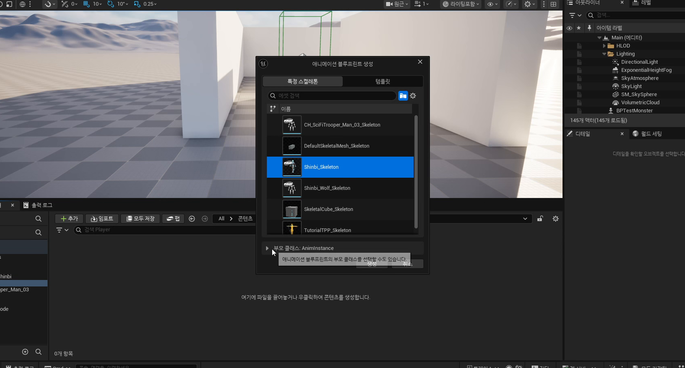

# 초급 1편. Animation Blueprint와 AnimInstance

[허브](../) | [다음: 중급 1편](../02_intermediate_aim_offset_and_view_variables/)

## 이 편의 목표

이 편에서는 `AnimBlueprint`, `UPlayerAnimInstance`, `UPlayerTemplateAnimInstance`가 어떻게 역할을 나누는지 정리한다.
핵심은 애니메이션도 게임플레이처럼 중간 레이어를 두는 편이 훨씬 유지보수에 유리하다는 점이다.

## 봐야 할 자료

- `D:\UE_Academy_Stduy_compressed\260407_1_애니메이션 블루프린트.mp4`
- `D:\UnrealProjects\UE_Academy_Stduy\Source\UE20252\Player\PlayerAnimInstance.h`
- `D:\UnrealProjects\UE_Academy_Stduy\Source\UE20252\Player\PlayerAnimInstance.cpp`
- `D:\UnrealProjects\UE_Academy_Stduy\Source\UE20252\Player\PlayerTemplateAnimInstance.h`
- `D:\UnrealProjects\UE_Academy_Stduy\Source\UE20252\Player\PlayerTemplateAnimInstance.cpp`

## 전체 흐름 한 줄

`AnimBlueprint 생성 -> 부모 AnimInstance 지정 -> 공용 변수 레이어 만들기 -> 캐릭터가 AnimInstanceClass를 연결`

## 애니메이션도 C++와 블루프린트를 함께 쓰는 편이 낫다

강의의 출발점은 아주 중요하다.
애니메이션은 단순히 모션 파일을 재생하는 일이 아니라, 어떤 상태에서 어떤 상태로 넘어갈지와 그 전환을 무엇으로 제어할지를 설계하는 일에 가깝다.
그래서 언리얼은 순수 C++만으로 밀어붙이기보다, C++ 중간 레이어와 애님 블루프린트를 함께 쓰는 구조를 자연스럽게 유도한다.

## AnimBlueprint도 결국 `AnimInstance`를 상속한다

가장 먼저 잡아야 할 개념은 애님 블루프린트도 결국 `AnimInstance` 계열 객체라는 점이다.
즉 우리도 캐릭터 클래스 때와 똑같이 중간 C++ 클래스를 하나 두고, 그 위를 블루프린트가 상속하게 만들 수 있다.



현재 프로젝트는 이 구조를 실제로 쓴다.

- `UPlayerAnimInstance`
  가장 공통적인 플레이어 애님 변수와 몽타주 기반
- `UPlayerTemplateAnimInstance`
  공용 로코모션 틀과 자산 맵
- `ABPPlayerTemplate`
  재사용 가능한 애님 그래프
- `ABPShinbiTemplate`, `ABPWraithTemplate`
  캐릭터별 자산 차이만 얹는 최종 블루프린트

즉 `260407`은 애님 블루프린트를 처음부터 캐릭터별로 따로 짜는 날이 아니라, 공용 계층을 세우는 날이라고 보는 편이 맞다.


## `UPlayerAnimInstance`는 애님 그래프가 읽을 공용 변수를 준비한다

`UPlayerAnimInstance` 헤더를 보면 이 클래스의 역할이 매우 선명하다.

```cpp
float mMoveSpeed;
float mViewPitch;
float mViewYaw;
bool mIsInAir;
bool mAccelerating;
float mYawDelta;

TObjectPtr<UAnimMontage> mAttackMontage;
TArray<FName> mAttackSection;
```

즉 이 클래스는 애니메이션을 직접 "그리는" 객체라기보다, 애님 그래프가 읽을 수 있는 형태로 상태를 정리하는 저장소에 가깝다.
공용 변수와 전투 몽타주 기반이 한 클래스 안에 함께 있는 것도 중요한데, 덕분에 `260408`, `260409`로 넘어갈 때 구조를 다시 뒤엎지 않아도 된다.

## 캐릭터는 결국 자기 AnimInstanceClass를 실제로 연결해야 한다

애님 블루프린트를 만들어도 캐릭터 메시가 그 클래스를 쓰지 않으면 아무 일도 일어나지 않는다.
현재 `Shinbi.cpp`와 `Wraith.cpp`는 생성자에서 애님 블루프린트 클래스를 찾아 메시 컴포넌트에 연결한다.

```cpp
static ConstructorHelpers::FClassFinder<UAnimInstance> AnimClass(
    TEXT("/Script/Engine.AnimBlueprint'/Game/Player/Shinbi/ABPShinbiTemplate.ABPShinbiTemplate_C'"));

if (AnimClass.Succeeded())
    GetMesh()->SetAnimInstanceClass(AnimClass.Class);
```


즉 흐름은 이렇게 닫힌다.

1. 캐릭터는 입력과 이동을 처리한다.
2. `UPlayerAnimInstance`는 그 결과를 애님 변수로 정리한다.
3. 애님 블루프린트는 그 값을 받아 상태 전환과 포즈 출력을 담당한다.

## 이 편의 핵심 정리

1. 애니메이션도 게임플레이처럼 C++ 중간 레이어와 블루프린트를 함께 쓰는 편이 낫다.
2. `AnimBlueprint`는 결국 `AnimInstance`를 상속하는 객체다.
3. `UPlayerAnimInstance`는 공용 상태 변수와 몽타주 기반을 제공한다.
4. `UPlayerTemplateAnimInstance`와 `ABPPlayerTemplate`는 공용 그래프 재사용을 위한 중간 템플릿 계층이다.
5. 캐릭터는 마지막에 `SetAnimInstanceClass()`로 실제 애님 블루프린트를 메시와 연결해야 한다.

## 다음 편

[중급 1편. Aim Offset과 시선 변수](../02_intermediate_aim_offset_and_view_variables/)
