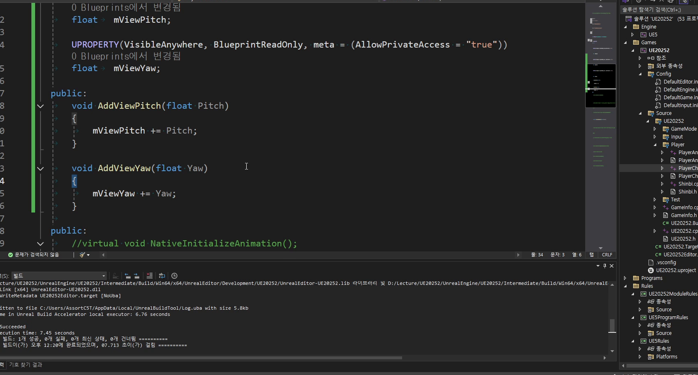

# 중급 1편. Aim Offset과 시선 변수

[이전: 초급 1편](../01_beginner_animation_blueprint_and_animinstance/) | [허브](../) | [다음: 중급 2편](../03_intermediate_groundlocomotion_blendspace_and_yawdelta/)

## 이 편의 목표

이 편에서는 `Aim Offset`, `mViewPitch`, `mViewYaw`, `RotationKey()` 연결을 정리한다.
핵심은 카메라 회전값을 그대로 몸에 복사하는 것이 아니라, 시선 보정용 축 값으로 번역해 자연스럽게 섞는 것이다.

## 봐야 할 자료

- `D:\UE_Academy_Stduy_compressed\260407_2_에임오프셋.mp4`
- `D:\UnrealProjects\UE_Academy_Stduy\Source\UE20252\Player\PlayerCharacter.cpp`
- `D:\UnrealProjects\UE_Academy_Stduy\Source\UE20252\Player\PlayerAnimInstance.h`

## 전체 흐름 한 줄

`Aim Offset 자산 생성 -> Pitch/Yaw 축 세팅 -> RotationKey에서 시선 값 전달 -> AnimBlueprint에서 적용`

## 시선 처리는 카메라 회전값을 그대로 복사하는 문제가 아니다

`Aim Offset`의 핵심은 "회전값을 그대로 뼈에 넣는다"가 아니다.
현재 바라보는 방향을 `Pitch`, `Yaw` 같은 축 값으로 읽고, 여러 포즈 샘플 사이를 자연스럽게 보간하는 데 있다.

즉 시선 처리는 입력과 카메라와 애니메이션이 만나는 지점이지만, 직접 제어보다 "축 기반 보정"에 더 가깝다.

## `RotationKey()`가 카메라 회전과 시선 변수 갱신을 함께 처리한다

현재 프로젝트에서 회전 입력은 `PlayerCharacter::RotationKey()`가 받는다.
이 함수는 스프링암을 돌려 실제 카메라 시점을 바꾸는 동시에, 같은 값을 애님 인스턴스에도 넘긴다.

```cpp
void APlayerCharacter::RotationKey(const FInputActionValue& Value)
{
    FVector Axis = Value.Get<FVector>();

    mSpringArm->AddRelativeRotation(FRotator(Axis.Y, Axis.X, 0.0));

    mAnimInst->AddViewPitch(Axis.Y);
    mAnimInst->AddViewYaw(Axis.X);
}
```

즉 입력 하나에서 소비처가 두 갈래로 갈라진다.

- `mSpringArm`
  실제 플레이 화면 시점 변경
- `mViewPitch`, `mViewYaw`
  애님 쪽 시선 보정 입력



## `Aim Offset` 자산은 축 기반 포즈 보간기다

`Aim Offset` 자산은 여러 시선 포즈를 준비한 뒤, 현재 축 값에 맞춰 중간 포즈를 보간한다.
현재 자산도 이 설명과 잘 맞는다.
예를 들어 `AO_Shinbi_Idle`은 `Yaw [-179, 179]`, `Pitch [-75, 75]` 범위 안에 포즈 샘플이 배치되어 있다.


즉 `Aim Offset`은 막연한 기능이 아니라, 축 값과 샘플 포즈가 명확히 정의된 보간 자산이다.

## 그래프에서는 시선 보정이 필요할 때만 `Aim Offset`을 끼워 넣는다

애님 그래프는 `Aim Offset`을 항상 쓰는 게 아니다.
보통 Idle이나 특정 로코모션 구간처럼 상체 시선 보정이 필요할 때 끼워 넣고, 다른 이동 레이어와 자연스럽게 섞는다.


현재 템플릿 구조에서도 이 흐름은 유지된다.
`ABPPlayerTemplate`는 `mBlendSpaceMap`에서 `"Aim"` 키로 블렌드 자산을 찾고, 축 입력으로 `mViewYaw`, `mViewPitch`를 받는다.
즉 시선 보정은 캐릭터별 그래프마다 새로 짜는 기능이 아니라, 공용 템플릿 위에서 자산만 바꿔 끼우는 구조다.

## 이 편의 핵심 정리

1. `Aim Offset`은 카메라 회전을 그대로 복사하는 기능이 아니라, 시선 보정용 축 자산이다.
2. `RotationKey()`는 카메라 회전과 애님 시선 값 갱신을 동시에 처리한다.
3. `mViewPitch`, `mViewYaw`는 애님 블루프린트가 시선 방향을 읽는 공용 변수다.
4. 현재 프로젝트도 `Aim` 자산을 공용 템플릿 그래프 안에서 재사용하는 구조를 유지한다.

## 다음 편

[중급 2편. GroundLocomotion과 Blend Space](../03_intermediate_groundlocomotion_blendspace_and_yawdelta/)
