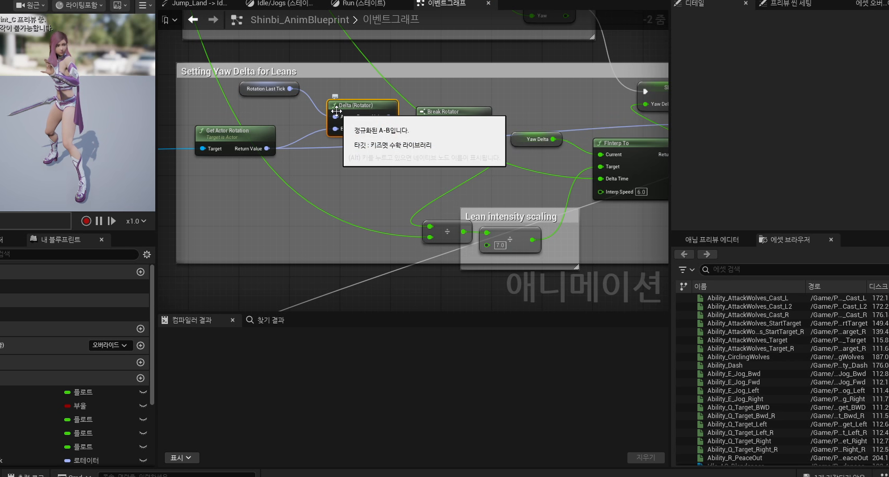

# 중급 2편. GroundLocomotion과 Blend Space

[이전: 중급 1편](../02_intermediate_aim_offset_and_view_variables/) | [허브](../) | [다음: 중급 3편](../04_intermediate_jump_state_machine_and_cached_pose/)

## 이 편의 목표

이 편에서는 `GroundLocomotion`, `Blend Space`, `mMoveSpeed`, `mAccelerating`, `mYawDelta`를 정리한다.
핵심은 로코모션이 단순히 속도 하나로 움직이는 구조가 아니라, 속도와 가속도와 회전량을 서로 다른 질문에 나눠 쓰는 구조라는 점이다.

## 봐야 할 자료

- `D:\UE_Academy_Stduy_compressed\260407_3_블렌드 스페이스와 회전이동.mp4`
- `D:\UnrealProjects\UE_Academy_Stduy\Source\UE20252\Player\PlayerAnimInstance.cpp`

## 전체 흐름 한 줄

`GroundLoco 상태 분해 -> MoveSpeed / Accelerating 사용 -> YawDelta 계산 -> Blend Space로 이동 보간`

## `GroundLocomotion`은 Idle 하나로 끝나지 않는다

실제 게임 캐릭터는 멈춤과 달리기만 반복하지 않는다.
출발, 지속 이동, 멈춤, 방향 전환이 각각 다르게 느껴져야 몸이 덜 기계적으로 보인다.

그래서 강의는 최소한 아래 구조를 권장한다.

- `Idle`
- `JogStart`
- `Run`
- `JogStop`


현재 템플릿 그래프도 이 구성을 거의 그대로 유지한다.
즉 강의는 입문 예시를 넘어, 실제 프로젝트에서도 재사용되는 공용 로코모션 틀을 설명한 셈이다.

## 속도만으로는 로코모션이 충분히 자연스러워지지 않는다

애니메이션 변수는 각기 다른 질문에 답한다.

- `mMoveSpeed`
  지금 얼마나 빠른가
- `mAccelerating`
  지금 입력이 살아 있어서 가속 중인가
- `mYawDelta`
  몸을 얼마나 급하게 꺾고 있는가


즉 로코모션은 속도 하나만으로 풀리는 문제가 아니다.
출발과 정지, 방향 전환, 몸 기울기 보정은 서로 다른 종류의 정보를 요구한다.

## `mYawDelta`는 방향 전환 감각을 만든다

특히 `mYawDelta`는 중요하다.
속도만 보면 달리는지 멈췄는지는 알 수 있지만, 몸을 갑자기 왼쪽으로 틀고 있는지 부드럽게 회전 중인지는 알기 어렵다.

현재 `UPlayerAnimInstance::NativeUpdateAnimation()`은 이전 프레임 회전과 현재 회전의 차이를 구해 `mYawDelta`를 계산한다.

```cpp
FRotator CurrentRot = PlayerChar->GetActorRotation();
FRotator DeltaRot = UKismetMathLibrary::NormalizedDeltaRotator(CurrentRot, mPrevRotator);

float DeltaYaw = DeltaRot.Yaw / DeltaSeconds / 7.f;
mYawDelta = FMath::FInterpTo(mYawDelta, DeltaYaw, DeltaSeconds, 6.f);

mPrevRotator = CurrentRot;
```



즉 `mYawDelta`는 방향 전환과 몸 기울기 같은 미세한 반응을 더 자연스럽게 만드는 핵심 값이다.

## `Blend Space`는 이동 자산을 축 기반으로 보간한다

강의는 시작 모션과 이동 모션을 `Blend Space`로 정리한다.
현재 프로젝트의 실제 자산은 한 단계 더 구체적이다.
`Run` 상태는 `mBlendSpaceMap`에서 `"Run"` 키로 자산을 찾고, 러닝 중 몸 기울기와 지형 대응을 보정하는 축 자산을 사용한다.


즉 `Blend Space`는 단순히 "앞/뒤/좌/우를 섞는 도구"라기보다, 이동 중 포즈 변화를 축 값에 맞춰 자연스럽게 보간하는 도구라고 보는 편이 더 정확하다.

## 이 편의 핵심 정리

1. `GroundLocomotion`은 `Idle`, `JogStart`, `Run`, `JogStop`처럼 상태를 분해할수록 자연스러워진다.
2. `mMoveSpeed`, `mAccelerating`, `mYawDelta`는 서로 다른 질문에 답하는 변수다.
3. `mYawDelta`는 방향 전환과 몸 기울기 감각을 만드는 데 특히 중요하다.
4. `Blend Space`는 축 값을 기반으로 이동 포즈를 부드럽게 보간하는 자산이다.

## 다음 편

[중급 3편. Jump 상태 머신과 캐시 포즈](../04_intermediate_jump_state_machine_and_cached_pose/)
