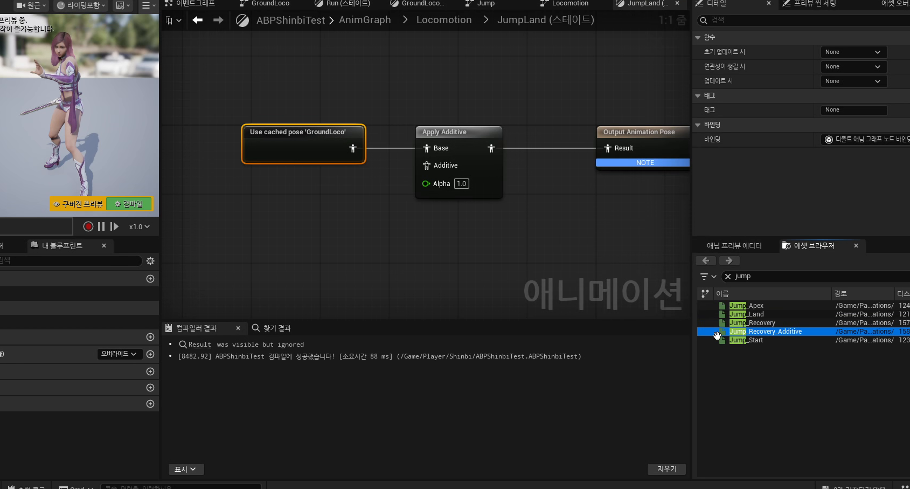

# 중급 3편. Jump 상태 머신과 캐시 포즈

[이전: 중급 2편](../03_intermediate_groundlocomotion_blendspace_and_yawdelta/) | [허브](../) | [다음: 부록 1](../05_appendix_official_docs_reference/)

## 이 편의 목표

이 편에서는 `JumpStart`, `JumpApex`, `JumpLand`, `Save Cached Pose`, `Apply Additive`를 묶어서 점프 로코모션을 정리한다.
핵심은 점프를 물리 기능이 아니라, 지상 로코모션과 분리된 애니메이션 흐름으로 읽는 것이다.

## 봐야 할 자료

- `D:\UE_Academy_Stduy_compressed\260407_4_플레이어 점프.mp4`
- `D:\UnrealProjects\UE_Academy_Stduy\Source\UE20252\Player\PlayerAnimInstance.cpp`
- `D:\UnrealProjects\UE_Academy_Stduy\Source\UE20252\Player\PlayerTemplateAnimInstance.h`

## 전체 흐름 한 줄

`GroundLoco 캐시 포즈 저장 -> Jump 상태 머신 분리 -> IsInAir로 전환 -> JumpLand에서 Apply Additive로 착지 복귀`

## 점프는 새 물리 기능보다 애니메이션 흐름 문제에 가깝다

강의 시점에서 물리적으로 튀어 오르는 기능 자체는 이미 `JumpKey()`와 캐릭터 무브먼트가 처리하고 있다.
지금 부족한 것은 "뜰 때, 공중에 있을 때, 착지할 때"를 각각 다른 애니메이션 흐름으로 연결하는 일이다.

즉 이 파트는 새 점프 기능 추가보다, 이미 있는 점프를 더 자연스럽게 보이게 만드는 구조를 세우는 날에 가깝다.

## 점프는 별도 상태 머신으로 분리하는 편이 깔끔하다

강의는 상위 로코모션 구조 안에 `Jump` 상태를 따로 두고, 그 안에 다시 작은 상태 머신을 둔다.

- `JumpStart`
- `JumpApex`
- `JumpLand`

이렇게 나누면 이륙, 공중 유지, 착지를 각각 다르게 다룰 수 있어서, 한 개의 긴 모션보다 훨씬 자연스럽다.

## `GroundLoco` 캐시 포즈는 지상 포즈를 재활용하게 만든다

점프 파트에서 중요한 도구가 `Save Cached Pose`다.
지상 로코모션 결과를 한 번 저장해 두고, 나중에 다른 상태에서 다시 꺼내 쓸 수 있게 만든다.

이 구조가 좋은 이유는 점프와 착지처럼 "지상 포즈 위에 무언가를 덧입히는" 상황에서 아주 유용하기 때문이다.
현재 템플릿 그래프도 `GroundLoco`, `Locomotion`, `FullBody` 같은 캐시 포즈를 실제로 사용한다.

## 공중 상태 전환은 결국 `mIsInAir`가 닫는다

`UPlayerAnimInstance::NativeUpdateAnimation()`는 `Movement->IsFalling()`을 읽어 `mIsInAir`를 갱신한다.
애님 그래프는 그 값을 보고 지상 상태와 점프 상태를 분리한다.

즉 흐름은 이렇게 이어진다.

1. 캐릭터 무브먼트가 물리 상태를 계산한다.
2. `UPlayerAnimInstance`가 그 결과를 `mIsInAir`로 번역한다.
3. 상태 머신은 그 값을 보고 점프 쪽으로 전환한다.

## 착지는 Additive로 보정하는 편이 더 자연스럽다

강의의 좋은 포인트는 착지를 별도 풀바디 모션 하나로만 처리하지 않는다는 점이다.
`JumpLand`는 `GroundLoco` 캐시 포즈를 베이스로 두고, `Jump_Recovery_Additive`를 덧입혀 착지 충격만 보정한다.

이 방식의 장점은 분명하다.

- 지상 로코모션으로 복귀가 부드럽다.
- 착지 반응만 별도로 강조할 수 있다.
- 나중에 강도와 보간값을 조절하기 쉽다.

## 실제 검증은 플레이 테스트에서 끝난다

점프 구조는 코드나 그래프가 맞다고 끝나지 않는다.
공중 전환 시점이 어색하지 않은지, 착지 타이밍이 급하지 않은지, 복귀가 자연스러운지는 결국 화면에서 봐야 한다.

즉 점프 로코모션은 상태 설계와 실제 플레이 테스트가 함께 가야 완성된다.

## 이 편의 핵심 정리

1. 점프는 물리 기능보다 애니메이션 상태 흐름 문제에 더 가깝다.
2. `JumpStart`, `JumpApex`, `JumpLand`로 나누면 공중 흐름이 훨씬 자연스러워진다.
3. `Save Cached Pose`는 지상 로코모션을 재활용할 수 있게 만든다.
4. `Apply Additive`는 착지를 부드럽게 보정하는 데 특히 유용하다.

## 다음 편

[부록 1. 공식 문서로 다시 읽는 애님 구조](../05_appendix_official_docs_reference/)
