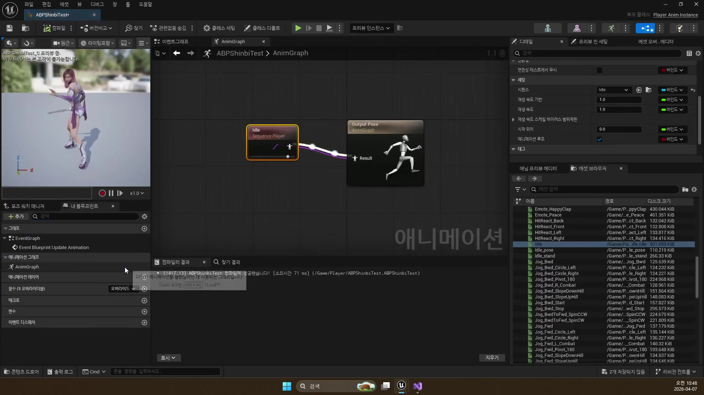
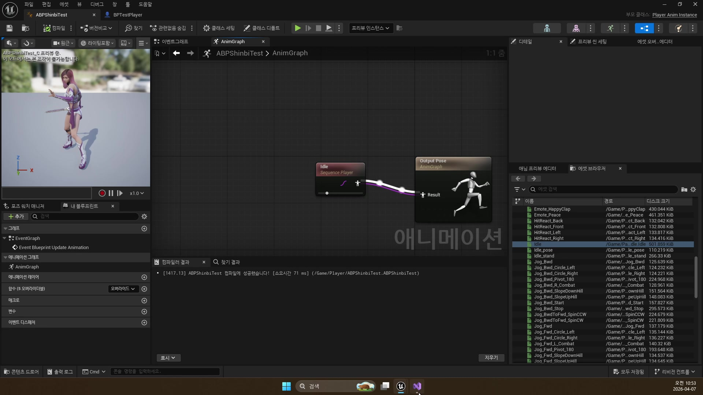
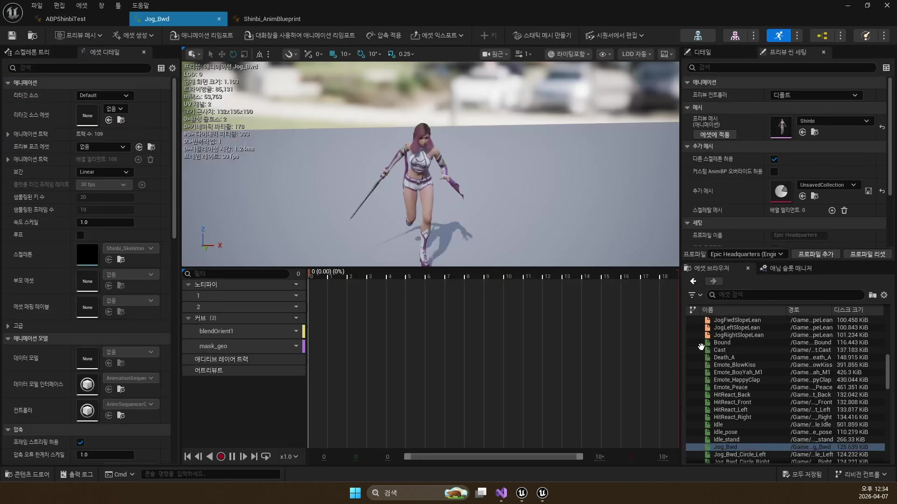
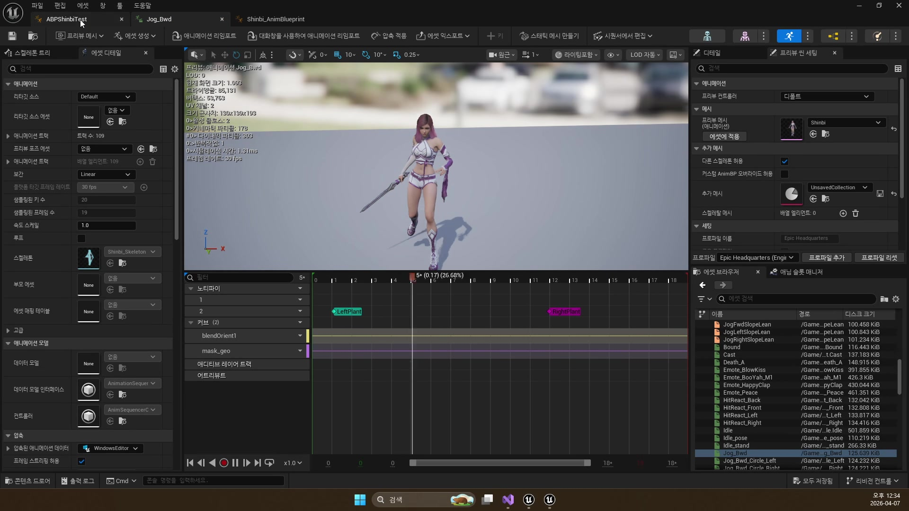
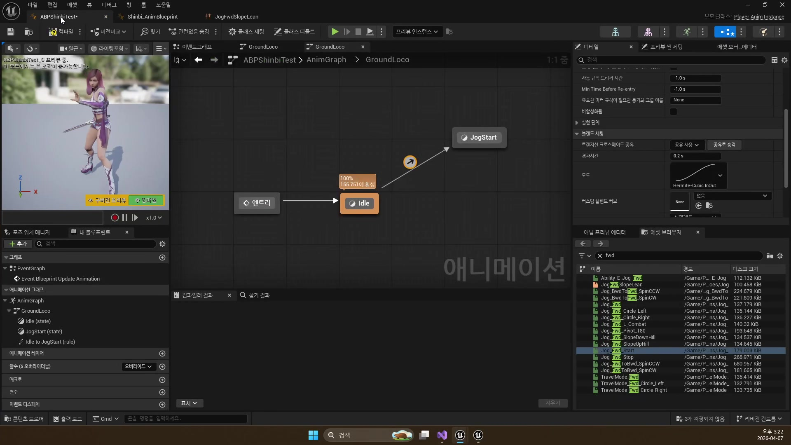
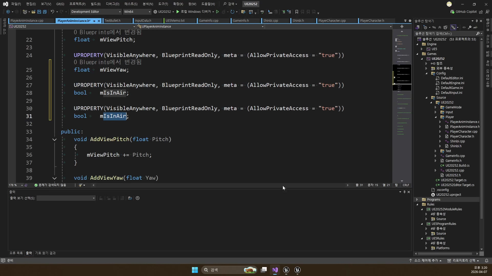
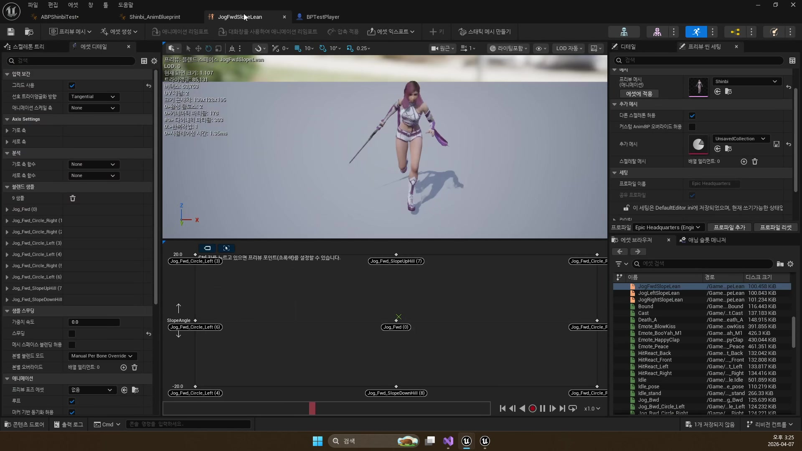
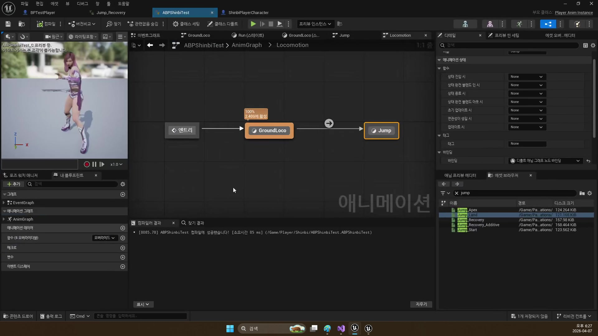
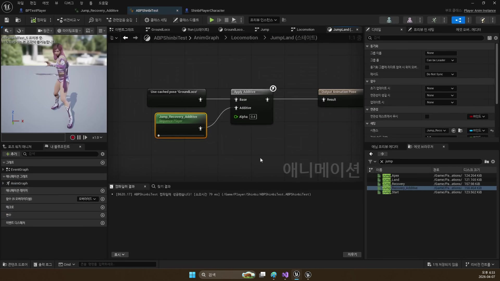
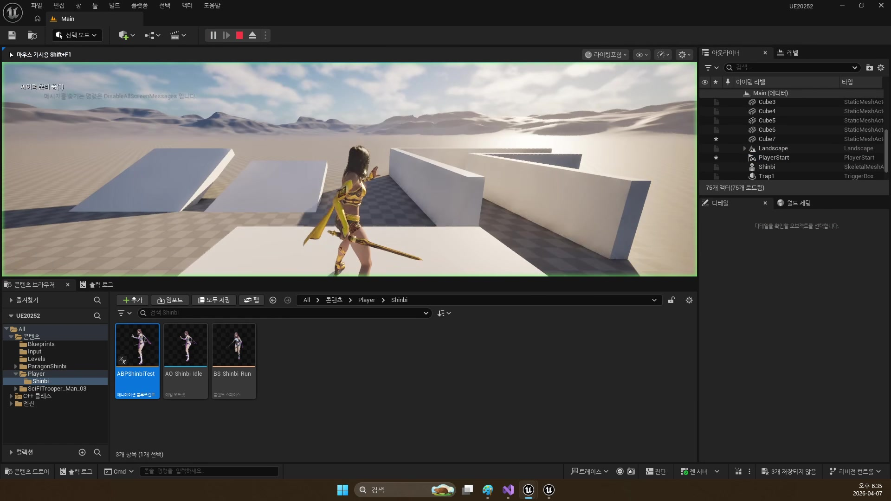

# 260407 이동 속도와 시선 값을 애니메이션으로 연결해 자연스러운 플레이어 움직임을 만드는 기초

## 문서 개요

이 문서는 `260407_1`부터 `260407_4`까지의 강의를 하나의 연속된 교재로 다시 정리한 것이다.
이번 날짜의 핵심은 플레이어 C++ 구조 위에 "움직이는 몸"을 처음 올리는 데 있다.

강의 흐름을 한 줄로 요약하면 다음과 같다.

`AnimInstance 중간 레이어 -> Aim Offset -> GroundLocomotion / Blend Space -> Jump 상태 머신`

즉 `260407`은 플레이어 전투보다 앞단에 있는 기본 애니메이션 교안이다.
앞에서 만든 입력과 캐릭터 이동을 애님 블루프린트와 연결하고, 시선 보정과 방향 전환, 점프까지 포함한 기초 로코모션을 세운다.

이 교재는 아래 네 자료를 함께 대조해 작성했다.

- `D:\UE_Academy_Stduy_compressed`의 원본 영상과 자막
- 원본 영상에서 다시 추출한 대표 장면 캡처
- `D:\UnrealProjects\UE_Academy_Stduy\Source\UE20252`의 실제 C++ 소스
- `D:\UnrealProjects\UE_Academy_Stduy\Saved\AcademyUtility`의 소스/애님 블루프린트 덤프
- Epic Developer Community의 언리얼 공식 문서

## 학습 목표

- `UPlayerAnimInstance`와 `UPlayerTemplateAnimInstance`가 각각 어떤 공통 책임을 맡는지 설명할 수 있다.
- `MoveSpeed`, `ViewPitch`, `ViewYaw`, `mIsInAir`, `mAccelerating`, `mYawDelta`가 애님 그래프에서 어떤 의미를 갖는지 말할 수 있다.
- `Aim Offset`, `Blend Space`, `GroundLocomotion` 상태 머신이 각각 무엇을 담당하는지 구분할 수 있다.
- `Save Cached Pose`, `mAnimMap / mBlendSpaceMap`, `JumpStart / JumpApex / JumpLand`, `Apply Additive`가 템플릿 로코모션을 어떻게 구성하는지 설명할 수 있다.
- `Animation Blueprint`, `Animation Variables`, `Blend Space`, `Aim Offset`, `State Machine` 공식 문서가 왜 `260407`과 직접 연결되는지 설명할 수 있다.
- `APlayerCharacter::RotationKey()`, `UPlayerAnimInstance::NativeUpdateAnimation()`, `UPlayerTemplateAnimInstance::AnimNotify_SkillCasting()`가 게임플레이 코드와 애님 그래프를 어떻게 연결하는지 설명할 수 있다.

## 강의 흐름 요약

1. 플레이어용 C++ `AnimInstance`를 만들고 애님 블루프린트가 그 클래스를 상속받게 한다.
2. 카메라 회전값을 `ViewPitch`, `ViewYaw`로 넘겨 `Aim Offset`에 연결한다.
3. `GroundLocomotion` 안에 `Idle`, `JogStart`, `Run`, `JogStop` 구조를 만들고, 방향과 회전을 더 자연스럽게 섞는다.
4. 점프는 별도 상태 머신으로 분리하고, 착지는 `GroundLoco` 캐시 포즈와 애디티브 모션으로 보정한다.
5. 언리얼 공식 문서를 통해 애님 변수, `Aim Offset`, `Blend Space`, 상태 머신이 엔진 표준 용어로 어떻게 정리되는지 확인한다.
6. 현재 프로젝트 C++ 코드를 읽으며, 위 구조가 `PlayerAnimInstance`, `PlayerTemplateAnimInstance`, `PlayerCharacter` 안에서 어떻게 계산되고 전달되는지 확인한다.

---

## 제1장. Animation Blueprint와 AnimInstance: 플레이어와 애님 그래프를 연결하는 중간 레이어

### 1.1 왜 애니메이션도 C++와 블루프린트를 함께 써야 하는가

첫 강의는 아주 중요한 관점 전환에서 시작한다.
애니메이션은 단순히 모션 파일을 재생하는 문제가 아니라, 어떤 상태에서 어떤 상태로 넘어갈지와 그 전환을 무엇으로 제어할지가 핵심이다.
그래서 언리얼은 애니메이션을 순수 C++만으로 밀어붙이기보다, 애님 블루프린트와 C++를 함께 쓰는 구조를 권장한다.

자막에서도 반복해서 강조하듯, 플레이어 애니메이션이 잘 잡히면 이후 몬스터 애니메이션은 이 구조를 단순화해 적용하는 수준으로 내려온다.
즉 `260407`은 단순한 플레이어 강의가 아니라, 프로젝트 전체 애님 구조의 출발점이다.

### 1.2 AnimBlueprint는 결국 AnimInstance를 상속한다

강의의 첫 번째 핵심은 `AnimBlueprint`도 결국 `AnimInstance`를 상속하는 객체라는 점이다.
이 말은 곧, 우리도 캐릭터 클래스 때와 똑같이 중간 C++ 클래스를 하나 두고 그 위를 블루프린트가 상속하게 만들 수 있다는 뜻이다.

실제 프로젝트의 중간 레이어는 `UPlayerAnimInstance`다.
이 클래스가 플레이어 쪽에서 계산한 값을 모으고, 애님 블루프린트는 그 값을 시각적인 상태 머신과 블렌딩에 사용한다.
다만 현재 프로젝트는 여기서 한 단계 더 일반화되어 있다.
덤프 기준 실제 계층은 `UPlayerAnimInstance -> UPlayerTemplateAnimInstance -> ABPPlayerTemplate -> ABPShinbiTemplate / ABPWraithTemplate` 순서다.
즉 `UPlayerAnimInstance`가 가장 공통적인 플레이어 애님 변수와 몽타주 제어를 맡고, `UPlayerTemplateAnimInstance`와 `ABPPlayerTemplate`가 재사용 가능한 로코모션 틀을 만든 뒤, 캐릭터별 애님 블루프린트가 마지막 자산 차이만 얹는 구조다.



### 1.3 UPlayerAnimInstance는 애님 그래프가 읽을 변수를 준비한다

`UPlayerAnimInstance`에는 로코모션과 시선 처리, 점프 상태에 필요한 핵심 값들이 들어 있다.

```cpp
// 현재 이동 속도. Blend Space에서 가장 자주 참조한다.
UPROPERTY(VisibleAnywhere, BlueprintReadOnly)
float mMoveSpeed;

// 카메라가 위아래로 얼마나 들렸는지
UPROPERTY(VisibleAnywhere, BlueprintReadOnly)
float mViewPitch;

// 카메라가 좌우로 얼마나 돌았는지
UPROPERTY(VisibleAnywhere, BlueprintReadOnly)
float mViewYaw;

// 공중 상태인지
UPROPERTY(VisibleAnywhere, BlueprintReadOnly)
bool mIsInAir;

// 지금 가속 중인지
UPROPERTY(VisibleAnywhere, BlueprintReadOnly)
bool mAccelerating;

// 몸이 얼마나 빠르게 꺾이고 있는지
UPROPERTY(VisibleAnywhere, BlueprintReadOnly)
float mYawDelta;
```

이 구조가 중요한 이유는 애님 블루프린트가 직접 게임플레이 객체를 이리저리 뒤지지 않아도 되게 만들기 때문이다.
애님 그래프는 필요한 정보를 이미 정리된 변수 형태로 받아 쓰고, 게임플레이 쪽은 그 값이 어떤 의미인지 C++에서 관리한다.
현재 `NativeUpdateAnimation()`도 정확히 이 철학대로 동작한다.
`Velocity.Length()`로 `mMoveSpeed`를, `IsFalling()`으로 `mIsInAir`를, `GetCurrentAcceleration().Length()`로 `mAccelerating`를 계산하고, 이전 프레임 회전과의 차이로 `mYawDelta`를 만든다.
즉 애님 변수는 블루프린트 안에서 임시로 꾸며낸 값이 아니라, 캐릭터 무브먼트가 이미 계산한 상태를 애님 전용 언어로 다시 정리한 결과다.

### 1.4 캐릭터는 실제로 어떤 애님 블루프린트를 쓰는가

애님 블루프린트가 만들어졌다면, 마지막으로 캐릭터 메시가 그 클래스를 실제로 사용하게 해야 한다.
`Shinbi.cpp`와 `Wraith.cpp`는 둘 다 생성자에서 애님 블루프린트 클래스를 찾아 메시 컴포넌트에 연결한다.

```cpp
// Shinbi 전용 애님 블루프린트 클래스를 에셋 경로로 찾는다.
static ConstructorHelpers::FClassFinder<UAnimInstance> AnimClass(
    TEXT("/Script/Engine.AnimBlueprint'/Game/Player/Shinbi/ABPShinbiTemplate.ABPShinbiTemplate_C'"));

// 로드에 성공하면 이 캐릭터의 AnimInstance 클래스로 지정한다.
if (AnimClass.Succeeded())
    GetMesh()->SetAnimInstanceClass(AnimClass.Class);
```



그리고 `PlayerCharacter::BeginPlay()`에서는 `GetMesh()->GetAnimInstance()`를 `UPlayerAnimInstance`로 캐스팅해 `mAnimInst`에 보관한다.
이 덕분에 게임플레이 쪽은 `RotationKey()`에서 `AddViewPitch()`, `AddViewYaw()`를 직접 밀어 넣고, 공격 쪽은 `PlayAttack()` 같은 애님 함수도 안전하게 호출할 수 있다.

현재 덤프를 보면 `ABPShinbiTemplate`와 `ABPWraithTemplate`는 둘 다 부모가 `ABPPlayerTemplate`이고, 세 개의 상태 머신 `Locomotion / Jump / GroundLoco`를 그대로 공유한다.
즉 캐릭터별 애님 블루프린트의 역할은 그래프를 처음부터 다시 짜는 것보다, 공통 템플릿 위에 캐릭터별 자산과 몽타주를 연결하는 쪽에 가깝다.

이제 흐름은 분명해진다.

- 캐릭터는 입력과 이동을 처리한다.
- `UPlayerAnimInstance`는 그 결과를 애님용 변수로 변환한다.
- 애님 블루프린트는 그 값을 받아 상태 전환과 포즈 출력을 담당한다.

### 1.5 장 정리

제1장의 결론은, 애니메이션도 게임플레이와 마찬가지로 "중간 레이어"가 있어야 유지보수가 쉽다는 점이다.
`UPlayerAnimInstance`는 플레이어와 애님 그래프를 이어 주는 해석 계층이다.

---

## 제2장. Aim Offset과 GroundLocomotion: 시선과 방향을 반영하는 기본 로코모션

### 2.1 시선 처리는 카메라 회전값을 그대로 몸에 옮기는 문제가 아니다

두 번째 강의부터는 애니메이션이 실제 플레이 감각을 어떻게 바꾸는지 본격적으로 드러난다.
Idle 상태에서 카메라가 보는 방향대로 상체와 시선을 자연스럽게 움직이게 만드는 도구가 `Aim Offset`이다.

자막에서도 나오듯, 핵심은 "카메라가 보는 방향을 그대로 복사"하는 것이 아니라, 축 값을 포즈 자산에 넣어 자연스럽게 보간하는 데 있다.
그래서 `Aim Offset`은 회전값 그 자체보다, 회전값을 읽을 수 있는 애님 변수 체계를 먼저 요구한다.

### 2.2 PlayerCharacter는 회전 입력을 AnimInstance에 넘긴다

실제 프로젝트에서 회전 입력은 `PlayerCharacter::RotationKey()`에서 처리된다.
이 함수는 스프링암 회전을 바꾸는 동시에, `mAnimInst->AddViewPitch()`, `AddViewYaw()`를 호출해 애님 쪽 시선 보정값도 갱신한다.

```cpp
void APlayerCharacter::RotationKey(const FInputActionValue& Value)
{
    // Enhanced Input에서 넘어온 2축 회전값을 읽는다.
    FVector Axis = Value.Get<FVector>();

    // SpringArm을 돌려 카메라 시점을 바꾼다.
    mSpringArm->AddRelativeRotation(FRotator(Axis.Y, Axis.X, 0.0));

    // 같은 값을 애님 인스턴스에도 넘겨 Aim Offset 계산에 쓰게 한다.
    mAnimInst->AddViewPitch(Axis.Y);
    mAnimInst->AddViewYaw(Axis.X);
}
```

즉 카메라 회전과 애님 시선 처리는 같은 입력에서 출발하지만, 엔진 안에서는 서로 다른 계층에서 소비된다.
현재 애님 블루프린트 덤프도 이 연결을 직접 보여 준다.
`ABPPlayerTemplate`의 `Aim Offset` 노드는 `mBlendSpaceMap`에서 `"Aim"` 키로 에셋을 꺼내고, 입력 축으로는 `mViewYaw`, `mViewPitch`를 그대로 받는다.
즉 `260406`에서 만든 회전 입력 코드가 `260407`에 와서 실제 `Aim Offset` 축 값으로 이어지는 구조가 문서 설명 그대로 현재 프로젝트 안에 남아 있다.

### 2.3 Aim Offset 자산은 축 기반 포즈 보간기다

`Aim Offset` 자산은 여러 시선 포즈를 준비해 두고, 현재 `Pitch`, `Yaw` 축 값에 맞춰 중간 포즈를 보간한다.
이 구조는 이후 이동용 `Blend Space`와도 닮아 있다.
둘 다 축 값을 기반으로 포즈를 섞는다는 점에서는 같고, 차이는 `Aim Offset`이 시선 보정용이라는 데 있다.



애님 그래프 쪽에서는 이렇게 만든 자산을 조건에 따라 끼워 넣는다.
Idle 상태에서 시선을 보정할 때만 적용하고, 필요하면 다른 로코모션과 섞을 수 있게 분리해 둔다.



실제 자산도 꽤 선명하다.
`AO_Shinbi_Idle`와 `AO_Wraith_Idle` 덤프를 보면 둘 다 `Yaw [-179, 179]`, `Pitch [-75, 75]` 축 위에 15개 샘플 포즈가 배치되어 있다.
즉 `Aim Offset`은 막연한 "시선 보정 기능"이 아니라, 현재 프로젝트 안에서도 축 값과 포즈 샘플이 명확히 정의된 보간 자산이다.

### 2.4 GroundLocomotion은 Idle 하나로 끝나지 않는다

세 번째 강의는 Idle/이동 단순 전환에서 한 단계 더 나아간다.
실제 게임에서 캐릭터는 단순히 "멈춤"과 "달리기"만 가지지 않는다.
출발, 지속 이동, 멈춤, 방향 전환이 모두 따로 느껴져야 자연스럽다.

그래서 강의는 `GroundLocomotion` 상태 머신 안에 최소한 다음 구조를 제안한다.

- `Idle`
- `JogStart`
- `Run`
- `JogStop`



이 구조 덕분에 출발 모션과 멈춤 모션이 루프 이동과 분리되고, 결과적으로 캐릭터 움직임이 훨씬 덜 기계적으로 보인다.
현재 `ABPPlayerTemplate` 덤프도 이 상태 구성을 그대로 보여 준다.
`GroundLoco` 상태 머신은 실제로 `Idle`, `JogStart`, `Run`, `JogStop` 네 상태를 가지고 있고, 전환 조건은 `mMoveSpeed`, `mAccelerating` 같은 공용 변수에 직접 매달려 있다.

### 2.5 속도만으로는 부족하고, 회전량도 필요하다

강의 후반은 로코모션을 더 자연스럽게 만들기 위해 `DeltaYaw`를 도입한다.
단순히 `MoveSpeed`만 보면 지금 달리고 있는지는 알 수 있지만, 얼마나 빠르게 몸을 틀고 있는지는 알 수 없다.
그래서 `UPlayerAnimInstance::NativeUpdateAnimation()`은 이전 프레임 회전과 현재 회전의 차이를 구해 `mYawDelta`를 계산한다.

```cpp
// 이전 프레임과 현재 프레임의 몸 회전 차이를 구한다.
FRotator CurrentRot = PlayerChar->GetActorRotation();
FRotator DeltaRot = UKismetMathLibrary::NormalizedDeltaRotator(CurrentRot, mPrevRotator);
// 초당 회전량처럼 보이게 DeltaSeconds로 나눠 준다.
float DeltaYaw = DeltaRot.Yaw / DeltaSeconds / 7.f;
// 갑자기 튀지 않도록 보간해서 부드러운 기울기 값으로 만든다.
mYawDelta = FMath::FInterpTo(mYawDelta, DeltaYaw, DeltaSeconds, 6.f);
// 다음 프레임 계산을 위해 현재 회전을 저장한다.
mPrevRotator = CurrentRot;
```



이 값이 중요한 이유는 방향 전환이나 몸 기울기 보정 같은 미세한 반응이 "속도"보다 "회전 변화량"에 더 가깝기 때문이다.
현재 그래프 기준으로 보면 변수 역할도 조금 더 구체적이다.
`mMoveSpeed`는 `Idle -> Run` 진입과 `JogStop -> Idle` 복귀 같은 속도 기준 전환에 쓰이고, `mAccelerating`는 `Idle -> JogStart`, `Run -> JogStop`처럼 "입력이 살아 있느냐"를 판단하는 전환에 쓰이며, `mYawDelta`는 러닝 블렌드 스페이스의 회전 보정 입력으로 연결된다.
즉 로코모션이 자연스러워지는 이유는 속도 하나를 정교하게 쓰는 데 있지 않고, 속도·가속도·회전량을 서로 다른 질문에 나눠 쓰는 데 있다.

### 2.6 시작 모션과 방향별 로코모션은 Blend Space가 맡는다

강의는 방향별 시작 모션과 이동 모션을 `Blend Space`로 정리한다.
다만 현재 프로젝트의 실제 러닝 자산은 조금 더 구체적으로 정리되어 있다.
`ABPPlayerTemplate`의 `Run` 상태는 `mBlendSpaceMap`에서 `"Run"` 키로 블렌드 스페이스를 찾아 쓰고, `BS_Shinbi_Run`과 `BS_Wraith_Run`의 축은 `Direction`이 아니라 `Lean`과 `Slope`다.
즉 현재 자산은 "앞/뒤/좌/우 시작 모션"을 한 장에 전부 넣는 타입이라기보다, 달리는 동안 몸이 얼마나 기울고 지형이 얼마나 오르내리는지를 보정하는 쪽에 가깝다.



예를 들어 `BS_Shinbi_Run` 덤프를 보면 `Lean [-90, 90]`, `Slope [-30, 30]` 축 위에 `Jog_Fwd`, `Jog_Fwd_Circle_Left/Right`, `Jog_Fwd_SlopeUpHill/DownHill` 샘플이 배치되어 있다.
즉 `Aim Offset`이 시선 보정용 축 자산이라면, 현재 `Blend Space`는 이동 방향 자체보다 달리는 자세의 기울기와 지형 대응을 보정하는 축 자산이라고 보는 편이 더 정확하다.

### 2.7 장 정리

제2장은 플레이어가 "움직이기 시작하는 몸"을 만든다.
카메라 시선은 `Aim Offset`, 이동과 방향 전환은 `GroundLocomotion + Blend Space + DeltaYaw`가 맡는다.

---

## 제3장. Jump 로코모션: 캐시 포즈와 점프 상태 머신으로 공중 흐름 만들기

### 3.1 점프는 물리 기능이 아니라 애니메이션 흐름 문제다

네 번째 강의의 출발점은 명확하다.
스페이스를 누르면 실제로 튀어 오르는 물리 이동은 이미 만들어져 있다.
지금 부족한 것은 공중으로 뜰 때, 공중에 있을 때, 착지할 때를 각각 다른 애니메이션 흐름으로 표현하는 일이다.

그래서 이 강의는 "새 점프 기능 추가"가 아니라, 이미 있는 점프 기능에 애니메이션 상태를 연결하는 작업에 가깝다.

### 3.2 Save Cached Pose는 GroundLoco를 재활용 가능하게 만든다

점프 파트에서 먼저 만드는 구조는 `GroundLoco` 캐시 포즈다.
애니메이션 그래프에서 지상 로코모션 결과를 한 번 저장해 두고, 나중에 다른 상태에서 다시 꺼내 쓸 수 있게 만든다.

자막에서도 강조하듯, 이 구조는 점프나 착지처럼 "지상 포즈 위에 무언가를 덧입히는" 경우에 특히 유용하다.
현재 템플릿 그래프는 이 아이디어를 더 넓게 쓰고 있다.
덤프를 보면 `GroundLoco`, `Locomotion`, `FullBody` 세 캐시 포즈가 있고, `TemplateFullBody` 슬롯과 `LayeredBoneBlend`, `BlendListByBool`까지 이미 걸려 있다.
즉 `260407` 시점의 로코모션 그래프가 이후 `260408`의 몽타주/슬롯 구조와 완전히 분리된 것이 아니라, 같은 캐시 포즈 체계 위에서 자연스럽게 확장되도록 미리 짜여 있다고 볼 수 있다.

### 3.3 점프는 별도 상태 머신으로 분리해야 한다

강의는 `GroundLoco`만 있던 상위 구조에 별도 `Jump` 상태를 추가한다.
그리고 그 안에 또 작은 상태 머신을 둬서 `JumpStart`, `JumpApex`, `JumpLand`를 분리한다.



이렇게 나누는 이유는 점프를 하나의 긴 모션으로 취급하면 현실적인 공중 흐름을 표현하기 어렵기 때문이다.

- `JumpStart`: 이륙
- `JumpApex`: 공중 유지
- `JumpLand`: 착지 충격

결국 점프도 로코모션과 마찬가지로 상태 분해가 핵심이다.
현재 템플릿 블루프린트는 여기서 한 걸음 더 나아가, 각 상태에 필요한 시퀀스를 하드코딩하지 않고 `mAnimMap`에서 `"JumpStart"`, `"JumpApex"`, `"Land"` 키로 찾아 쓴다.
즉 점프 상태 머신의 구조는 모두가 공유하고, 어떤 시퀀스를 재생할지만 캐릭터별 자산 맵이 바꾸는 방식이다.

### 3.4 공중 상태 판정은 결국 mIsInAir로 이어진다

`UPlayerAnimInstance::NativeUpdateAnimation()`는 `Movement->IsFalling()`을 읽어 `mIsInAir`를 갱신한다.
애님 그래프는 이 값을 이용해 지상 상태와 점프 상태를 분리한다.

즉 플레이어 캐릭터 쪽 캐릭터 무브먼트가 물리 상태를 계산하고, 애님 인스턴스가 이를 애님 변수로 바꾸고, 상태 머신은 그 값을 보고 전환을 결정하는 구조가 완성된다.

### 3.5 착지는 Additive로 보정하는 것이 더 자연스럽다

강의 후반의 좋은 포인트는 착지를 별도 풀바디 모션으로만 처리하지 않는다는 점이다.
`JumpLand` 안에서 `GroundLoco` 캐시 포즈를 베이스로 쓰고, `Jump_Recovery_Additive`를 `Apply Additive`로 얹어 착지 충격만 보정한다.



이 방식의 장점은 분명하다.

- 지상 로코모션과의 연결이 자연스럽다.
- 착지 반응만 강조할 수 있다.
- 나중에 강도나 보간 값을 조절하기 쉽다.

즉 착지는 단순히 "점프 끝"이 아니라, 지상 로코모션으로 복귀하는 과도기 상태로 다루는 편이 훨씬 좋다.
덤프 기준 현재 `JumpLand` 그래프도 실제로 `GroundLoco` 캐시 포즈를 `Base`로 쓰고, `mAnimMap`의 `"JumpRecovery"` 자산을 `Additive`로 연결한다.
즉 문서에서 설명하는 착지 애디티브 구조는 개념 설명에 그치지 않고, 현재 프로젝트의 템플릿 애님 그래프에 그대로 구현되어 있다.

### 3.6 실제 테스트는 상태 연결이 제대로 붙었는지를 확인하는 단계다

강의 마지막은 결국 플레이 테스트다.
공중 판정이 잘 들어가는지, 착지 타이밍이 어색하지 않은지, 상태 전환이 너무 급하지 않은지를 반복 확인한다.



이 지점이 중요한 이유는 애니메이션 구조가 "코드가 맞다"로 끝나지 않기 때문이다.
전환 시간, 애디티브 강도, 복귀 타이밍은 결국 화면에서 읽어야 한다.

### 3.7 장 정리

제3장은 플레이어를 진짜 입체적인 이동 객체로 만든다.
점프는 단순한 한 동작이 아니라, 지상 로코모션과 분리된 별도 상태 머신이며, 착지는 캐시 포즈와 애디티브를 이용해 부드럽게 복귀시켜야 한다.

---

## 제4장. 언리얼 공식 문서로 다시 읽는 260407 핵심 구조

### 4.1 왜 260407부터 공식 문서를 같이 보는가

`260407`은 처음으로 "캐릭터가 자연스럽게 움직이는 것처럼 보이게 만드는 구조"를 다룬다.
이 구간부터는 블루프린트 노드 이름만 따라가는 것보다, 공식 문서가 쓰는 `Animation Blueprint`, `Anim Graph`, `Event Graph`, `Blend Space`, `Aim Offset`, `State Machine` 같은 표준 용어를 같이 보는 편이 훨씬 이해가 빠르다.

이번 보강에서는 특히 아래 공식 문서를 기준점으로 삼는다.

- [Animation Blueprint Editor in Unreal Engine](https://dev.epicgames.com/documentation/en-us/unreal-engine/animation-blueprint-editor-in-unreal-engine?application_version=5.6)
- [How to Get Animation Variables in Animation Blueprints in Unreal Engine](https://dev.epicgames.com/documentation/en-us/unreal-engine/how-to-get-animation-variables-in-animation-blueprints-in-unreal-engine?application_version=5.6)
- [Blend Spaces in Animation Blueprints in Unreal Engine](https://dev.epicgames.com/documentation/en-us/unreal-engine/blend-spaces-in-animation-blueprints-in-unreal-engine?application_version=5.6)
- [Locomotion Based Blending in Unreal Engine](https://dev.epicgames.com/documentation/en-us/unreal-engine/locomotion-based-blending-in-unreal-engine)
- [Creating an Aim Offset in Unreal Engine](https://dev.epicgames.com/documentation/en-us/unreal-engine/creating-an-aim-offset-in-unreal-engine)
- [Adding Character Animation in Unreal Engine](https://dev.epicgames.com/documentation/en-us/unreal-engine/adding-character-animation-in-unreal-engine)

즉 이 장의 목적은 강의 내용을 다른 방식으로 다시 설명하는 것이 아니라, `260407`에서 만든 로코모션 구조가 언리얼 표준 애니메이션 문서에서는 어떤 자산과 그래프 개념으로 정리되는지 연결하는 데 있다.

### 4.2 공식 문서의 `Animation Blueprint`와 `Animation Variables` 설명은 강의의 `AnimInstance 중간 레이어`를 더 선명하게 만든다

강의 1장은 `UPlayerAnimInstance`가 플레이어 쪽 값을 애니메이션이 읽을 수 있는 형태로 정리한다는 점을 강조한다.
공식 문서의 `Animation Blueprint Editor`와 `How to Get Animation Variables`도 같은 흐름을 보여 준다.

즉 애님 블루프린트는 단순 재생기가 아니라 아래 두 층으로 나뉜다.

- `Event Graph`: 속도, 공중 여부, 회전량 같은 상태값 계산
- `Anim Graph`: 그 상태값을 이용해 최종 포즈 생성

이 관점으로 보면 강의의 `MoveSpeed`, `ViewPitch`, `ViewYaw`, `mIsInAir`, `mYawDelta`, `mAccelerating`는 단순 변수 목록이 아니라, `Event Graph`가 `Anim Graph`에 넘기는 공식적인 입력값 집합으로 이해할 수 있다.

### 4.3 `Aim Offset`, `Blend Space`, `State Machine` 공식 문서는 강의의 로코모션 자산 역할 분담을 정확히 갈라 준다

입문자가 가장 많이 헷갈리는 부분은 `Aim Offset`, `Blend Space`, `State Machine`이 전부 "애니메이션을 섞는 것처럼" 보여서 역할이 겹쳐 보인다는 점이다.
공식 문서는 이 셋을 꽤 분명하게 갈라 준다.

- `Aim Offset`: 시선 또는 조준 방향처럼 회전 기반 포즈 보정
- `Blend Space`: 속도, 방향 같은 축 값을 기반으로 여러 이동 애니메이션 보간
- `State Machine`: `Idle -> Run -> JumpStart -> JumpLoop -> JumpLand`처럼 상태 전환 구조 관리

즉 `260407`의 강의 흐름도 사실 엔진 표준 구조와 거의 같다.
`Aim Offset`이 시선을 맡고, `GroundLocomotion` 안의 `Blend Space`가 이동 보간을 맡고, `Jump` 상태 머신이 공중 흐름을 맡는 식으로 역할을 나눠 놓았기 때문이다.

### 4.4 260407 공식 문서 추천 읽기 순서

이번 날짜는 아래 순서로 공식 문서를 읽으면 가장 자연스럽다.

1. [Animation Blueprint Editor in Unreal Engine](https://dev.epicgames.com/documentation/en-us/unreal-engine/animation-blueprint-editor-in-unreal-engine?application_version=5.6)
2. [How to Get Animation Variables in Animation Blueprints in Unreal Engine](https://dev.epicgames.com/documentation/en-us/unreal-engine/how-to-get-animation-variables-in-animation-blueprints-in-unreal-engine?application_version=5.6)
3. [Blend Spaces in Animation Blueprints in Unreal Engine](https://dev.epicgames.com/documentation/en-us/unreal-engine/blend-spaces-in-animation-blueprints-in-unreal-engine?application_version=5.6)
4. [Locomotion Based Blending in Unreal Engine](https://dev.epicgames.com/documentation/en-us/unreal-engine/locomotion-based-blending-in-unreal-engine)
5. [Creating an Aim Offset in Unreal Engine](https://dev.epicgames.com/documentation/en-us/unreal-engine/creating-an-aim-offset-in-unreal-engine)
6. [Adding Character Animation in Unreal Engine](https://dev.epicgames.com/documentation/en-us/unreal-engine/adding-character-animation-in-unreal-engine)

이 순서가 좋은 이유는 먼저 애님 블루프린트가 어떤 에디터와 그래프 구조를 가지는지 잡고, 그 다음 변수 계산, 축 기반 보간, 상태 머신 순으로 내려가 읽을 수 있기 때문이다.

### 4.5 장 정리

공식 문서 기준으로 다시 보면 `260407`은 아래 다섯 가지를 배우는 날이다.

1. 애니메이션은 `Event Graph`와 `Anim Graph`가 함께 만든다.
2. 애님 변수는 캐릭터 상태를 애니메이션 언어로 번역한 값이다.
3. `Aim Offset`, `Blend Space`, `State Machine`은 서로 다른 문제를 해결하는 자산이다.
4. 점프와 착지는 별도 상태 흐름으로 다루는 편이 로코모션 구조를 깔끔하게 유지한다.
5. 그래서 `260407`은 예쁜 움직임을 만드는 날이면서 동시에, 이후 공격 몽타주와 전투 애니메이션이 올라갈 애님 파이프라인을 세우는 날이다.

---

## 제5장. 현재 프로젝트 C++ 코드로 다시 읽는 260407 핵심 구조

### 5.1 왜 260407부터는 애님 블루프린트만 보면 반쪽 이해가 되는가

`260407`은 처음 보면 애님 블루프린트 그래프를 만드는 날처럼 보인다.
하지만 실제 프로젝트를 읽어 보면, 그래프만 봐서는 절반만 이해한 셈이다.
이유는 아주 단순하다.
애님 블루프린트가 쓰는 핵심 값 `mMoveSpeed`, `mViewPitch`, `mViewYaw`, `mIsInAir`, `mAccelerating`, `mYawDelta`는 그래프 안에서 저절로 생기지 않고, 전부 C++ 쪽에서 계산되어 넘어오기 때문이다.

아래 코드는 `D:\UnrealProjects\UE_Academy_Stduy\Source\UE20252`의 실제 구현에서 핵심 부분만 추려 온 뒤, 초보자도 읽을 수 있게 설명용 주석을 붙인 축약판이다.
즉 이 장은 "새 이론 추가"라기보다, 앞 장에서 배운 `Aim Offset`, `GroundLocomotion`, `Jump` 상태 머신이 실제 코드와 어떻게 이어지는지 다시 읽는 장이라고 보면 된다.

### 5.2 `UPlayerAnimInstance`: 애님 그래프가 읽을 공용 변수 저장소

먼저 헤더를 보면 `UPlayerAnimInstance`가 왜 중요한지 바로 드러난다.
이 클래스는 애니메이션을 "재생"만 하는 객체가 아니라, 애님 블루프린트가 읽을 공용 상태를 쌓아 두는 중간 저장소다.

```cpp
UCLASS()
class UE20252_API UPlayerAnimInstance : public UAnimInstance
{
    GENERATED_BODY()

protected:
    // 현재 이동 속도. Idle/Run 전환의 가장 기본 재료
    UPROPERTY(VisibleAnywhere, BlueprintReadOnly)
    float mMoveSpeed;

    // 카메라를 얼마나 위아래로 움직였는가
    UPROPERTY(VisibleAnywhere, BlueprintReadOnly)
    float mViewPitch;

    // 카메라를 얼마나 좌우로 움직였는가
    UPROPERTY(VisibleAnywhere, BlueprintReadOnly)
    float mViewYaw;

    // 캐릭터가 공중에 떠 있는지
    UPROPERTY(VisibleAnywhere, BlueprintReadOnly)
    bool mIsInAir;

    // 지금 이동 입력 때문에 실제 가속이 들어가고 있는지
    UPROPERTY(VisibleAnywhere, BlueprintReadOnly)
    bool mAccelerating;

    // 몸이 얼마나 빠르게 회전하고 있는지
    UPROPERTY(VisibleAnywhere, BlueprintReadOnly)
    float mYawDelta;

    // 이전 프레임 회전을 저장해 두었다가 이번 프레임과 비교할 때 쓴다
    FRotator mPrevRotator = FRotator::ZeroRotator;

    // 260408에서 본격적으로 쓰일 공격 몽타주
    UPROPERTY(EditAnywhere, BlueprintReadOnly)
    TObjectPtr<UAnimMontage> mAttackMontage;

    UPROPERTY(EditAnywhere, BlueprintReadOnly)
    TArray<FName> mAttackSection;
};
```

이 선언부에서 읽어야 할 핵심은 세 가지다.

- 애님 그래프는 플레이어를 직접 뒤지는 대신, 이미 정리된 변수만 읽는다.
- 로코모션용 값과 전투용 값이 한 클래스 안에 함께 모여 있어 이후 `260408`, `260409`로 자연스럽게 이어진다.
- 즉 `UPlayerAnimInstance`는 "애님 그래프의 두뇌"라기보다, 게임플레이 상태를 애님 언어로 번역해 주는 통역기다.

### 5.3 `NativeUpdateAnimation()`: 속도, 공중 여부, 가속, 회전량을 매 프레임 계산한다

실제 계산은 `UPlayerAnimInstance::NativeUpdateAnimation()` 안에서 이뤄진다.
이 함수는 매 프레임 호출되며, 애님 그래프가 필요로 하는 값을 갱신한다.

```cpp
void UPlayerAnimInstance::NativeUpdateAnimation(float DeltaSeconds)
{
    Super::NativeUpdateAnimation(DeltaSeconds);

    TObjectPtr<APlayerCharacter> PlayerChar =
        Cast<APlayerCharacter>(TryGetPawnOwner());

    if (IsValid(PlayerChar))
    {
        // CharacterMovement는 이동 물리 상태를 이미 계산해 둔 컴포넌트다
        UCharacterMovementComponent* Movement =
            PlayerChar->GetCharacterMovement();

        // 현재 실제 속도 크기
        mMoveSpeed = Movement->Velocity.Length();

        // 지금 공중 상태인지
        mIsInAir = Movement->IsFalling();

        // 입력이 살아 있어서 가속이 걸리고 있는지
        float Acceleration = Movement->GetCurrentAcceleration().Length();
        mAccelerating = Acceleration > 0.f;

        // 이전 프레임과 현재 프레임의 몸 회전 차이를 구한다
        FRotator CurrentRot = PlayerChar->GetActorRotation();
        FRotator DeltaRot =
            UKismetMathLibrary::NormalizedDeltaRotator(CurrentRot, mPrevRotator);

        // 초당 회전량 비슷한 값으로 바꾼 뒤 부드럽게 보간한다
        float DeltaYaw = DeltaRot.Yaw / DeltaSeconds / 7.f;
        mYawDelta = FMath::FInterpTo(mYawDelta, DeltaYaw, DeltaSeconds, 6.f);

        // 다음 프레임 비교를 위해 현재 회전을 저장한다
        mPrevRotator = CurrentRot;
    }
}
```

초보자용으로 아주 직설적으로 풀면 이렇게 읽으면 된다.

- `mMoveSpeed`: "지금 얼마나 빠르게 움직이는가"
- `mIsInAir`: "지금 땅에 붙어 있는가, 공중에 떠 있는가"
- `mAccelerating`: "지금 입력 때문에 몸이 가속 중인가"
- `mYawDelta`: "몸을 얼마나 급하게 틀고 있는가"

여기서 특히 중요한 것은 `mYawDelta`다.
속도만 보면 "달린다/안 달린다"는 알 수 있지만, 몸을 왼쪽으로 급히 꺾는지 오른쪽으로 완만하게 도는지는 알기 어렵다.
그래서 현재 프로젝트는 `이전 프레임 회전`과 `현재 프레임 회전`의 차이를 따로 계산해, 러닝 보정과 방향 전환 느낌을 더 자연스럽게 만든다.

즉 `260407`의 로코모션은 단순 속도 기반 구조가 아니라, 속도와 회전량을 분리해서 읽는 구조다.

### 5.4 `RotationKey()`: 카메라 회전 입력이 시선 애니메이션 값으로도 들어간다

앞 장에서 `Aim Offset`은 `mViewPitch`, `mViewYaw`를 입력으로 쓴다고 설명했다.
그렇다면 이 값은 어디서 오는가.
정답은 `APlayerCharacter::RotationKey()`다.

```cpp
void APlayerCharacter::RotationKey(const FInputActionValue& Value)
{
    FVector Axis = Value.Get<FVector>();

    // 실제 카메라 팔을 회전시켜 플레이어 시점을 바꾼다
    mSpringArm->AddRelativeRotation(FRotator(Axis.Y, Axis.X, 0.0));

    // 같은 입력값을 애님 인스턴스에도 넘겨 시선 보정 변수로 쌓는다
    mAnimInst->AddViewPitch(Axis.Y);
    mAnimInst->AddViewYaw(Axis.X);
}
```

이 코드는 `260407` 전체를 한 번에 이해하게 해 주는 아주 좋은 예시다.

- 입력은 `IA_Rotation`에서 들어온다.
- 카메라 팔 `mSpringArm`은 실제 플레이 화면 시점을 바꾼다.
- 같은 축 값이 `mAnimInst`에도 전달된다.
- 애님 블루프린트는 그 값을 받아 `Aim Offset`의 `Pitch`, `Yaw` 축에 꽂는다.

즉 "마우스를 움직이면 카메라가 돈다"와 "캐릭터 상체와 시선이 그 방향을 따라간다"는 전혀 다른 현상 같아 보여도, 실제로는 같은 입력에서 갈라져 나온 두 소비처다.

### 5.5 `UPlayerTemplateAnimInstance`: 공용 그래프 틀은 유지하고, 자산만 갈아 끼우는 레이어

`UPlayerAnimInstance` 위에 한 단계 더 있는 클래스가 `UPlayerTemplateAnimInstance`다.
이 클래스는 로직을 크게 새로 만들기보다, 공용 애님 틀에서 캐릭터별 자산을 갈아 끼우는 역할에 가깝다.

```cpp
UCLASS()
class UE20252_API UPlayerTemplateAnimInstance : public UPlayerAnimInstance
{
    GENERATED_BODY()

protected:
    // JumpStart, JumpApex, Land 같은 시퀀스를 이름으로 꺼내 쓴다
    UPROPERTY(EditAnywhere, BlueprintReadOnly)
    TMap<FString, TObjectPtr<UAnimSequence>> mAnimMap;

    // Aim Offset, Run Blend Space 같은 축 자산을 이름으로 관리한다
    UPROPERTY(EditAnywhere, BlueprintReadOnly)
    TMap<FString, TObjectPtr<UBlendSpace>> mBlendSpaceMap;

public:
    UFUNCTION()
    void AnimNotify_SkillCasting();
};
```

이 구조를 초보자용으로 번역하면 이렇다.

- `mAnimMap`: "점프 시작, 공중 유지, 착지" 같은 시퀀스를 이름표로 보관하는 사전
- `mBlendSpaceMap`: "`Aim`, `Run` 같은 축 자산을 이름표로 보관하는 사전"

그래서 `ABPPlayerTemplate`는 "점프에는 `JumpStart` 키를 쓰고, 시선 보정에는 `Aim` 키를 쓴다"는 공통 규칙만 유지하면 된다.
실제 캐릭터가 `Shinbi`이든 `Wraith`이든, 그 키에 어떤 자산이 들어 있는지만 바꾸면 같은 그래프 구조를 재사용할 수 있다.

즉 `260407`의 템플릿 구조는 "그래프를 캐릭터마다 다시 그리지 않기 위한 장치"다.

### 5.6 `AnimNotify_SkillCasting()`: 애니메이션 재생이 다시 게임플레이 코드로 돌아오는 지점

애님 변수는 C++에서 블루프린트로 흘러가지만, 흐름은 거기서 끝나지 않는다.
현재 프로젝트에서는 애니메이션이 다시 게임플레이 함수를 호출하는 지점도 이미 준비되어 있다.
그 예가 `UPlayerTemplateAnimInstance::AnimNotify_SkillCasting()`다.

```cpp
void UPlayerTemplateAnimInstance::AnimNotify_SkillCasting()
{
    TObjectPtr<APlayerCharacter> PlayerChar =
        Cast<APlayerCharacter>(TryGetPawnOwner());

    if (IsValid(PlayerChar))
    {
        // 현재 캐릭터에게 "이 타이밍에 스킬 캐스팅 로직을 실행하라"고 알린다
        PlayerChar->Skill1Casting();
    }

    // 다음 섹션으로 넘어갈 준비
    mSkill1Index = (mSkill1Index + 1) % mSkill1Section.Num();
}
```

이 함수는 `260408` 쪽 색깔이 조금 더 강하지만, `260407`을 이해할 때도 의미가 크다.
왜냐하면 `AnimInstance`가 단순히 값만 저장하는 객체가 아니라, 나중에는 `노티파이 -> C++ 함수 호출 -> 실제 게임플레이 실행`의 다리 역할까지 맡게 된다는 사실을 보여 주기 때문이다.

즉 이번 날짜의 애님 중간 레이어는 로코모션 전용 클래스가 아니라, 이후 공격과 스킬 연출까지 품을 공용 창구다.

### 5.7 `PlayAttack()`과 `MontageEndOverride()`: 로코모션 위에 전투가 올라갈 준비도 이미 되어 있다

현재 `UPlayerAnimInstance`에는 로코모션 변수만 있는 것이 아니다.
공격 몽타주와 콤보 상태를 다루는 함수도 이미 들어 있다.

```cpp
void UPlayerAnimInstance::PlayAttack()
{
    // 공격 몽타주 자산이 없으면 아무 것도 할 수 없다.
    if (!IsValid(mAttackMontage))
        return;

    if (mAttackEnable)
    {
        // 첫 입력이라면 1타 섹션부터 재생한다.
        if (!Montage_IsPlaying(mAttackMontage))
        {
            mAttackEnable = false;
            Montage_SetPosition(mAttackMontage, 0.f);
            Montage_Play(mAttackMontage, 1.f);
            Montage_JumpToSection(mAttackSection[0], mAttackMontage);
        }
    }
    else if (mComboEnable)
    {
        // 콤보 입력 창이 열려 있으면 다음 섹션으로 넘긴다.
        mAttackIndex = (mAttackIndex + 1) % mAttackSection.Num();
        Montage_Play(mAttackMontage, 1.f);
        Montage_JumpToSection(mAttackSection[mAttackIndex], mAttackMontage);
        mComboEnable = false;
    }
}
```

그리고 몽타주가 끝났을 때는 `MontageEndOverride()`가 상태를 다시 정리한다.

```cpp
void UPlayerAnimInstance::MontageEndOverride(UAnimMontage* Montage, bool bInterrupted)
{
    // 평타 몽타주가 정상 종료됐을 때만 상태를 초기화한다.
    if (Montage == mAttackMontage && !bInterrupted)
    {
        mAttackEnable = true;
        mComboEnable = false;
        mAttackIndex = 0;
    }
}
```

이걸 지금 장에서 굳이 짚는 이유는 분명하다.
`260407`에서 만든 `PlayerAnimInstance`가 로코모션만 처리하는 일회성 클래스가 아니라, 이후 `260408`의 `AnimMontage`, `Slot`, `Notify`, `Combo Section`이 그대로 얹힐 베이스 클래스라는 점을 보여 주기 때문이다.

즉 이번 장은 "걷기/뛰기/점프를 위한 애님 구조"를 배우는 날이면서 동시에 "전투 애니메이션이 나중에 어디 올라갈지"를 미리 준비하는 날이기도 하다.

### 5.8 `Shinbi`와 `Wraith`: 같은 공통 구조 위에 다른 애님 템플릿을 연결한다

캐릭터별 클래스까지 보면 템플릿 구조의 장점이 더 선명해진다.
`Shinbi`와 `Wraith`는 둘 다 `APlayerCharacter`를 상속받지만, 생성자에서 자기 애님 블루프린트만 다르게 연결한다.

```cpp
AShinbi::AShinbi()
{
    // Shinbi는 Shinbi용 템플릿 애님 블루프린트를 연결한다.
    static ConstructorHelpers::FClassFinder<UAnimInstance> AnimClass(
        TEXT("/Script/Engine.AnimBlueprint'/Game/Player/Shinbi/ABPShinbiTemplate.ABPShinbiTemplate_C'"));

    if (AnimClass.Succeeded())
        GetMesh()->SetAnimInstanceClass(AnimClass.Class);
}

AWraith::AWraith()
{
    // Wraith는 Wraith용 템플릿 애님 블루프린트를 연결한다.
    static ConstructorHelpers::FClassFinder<UAnimInstance> AnimClass(
        TEXT("/Script/Engine.AnimBlueprint'/Game/Player/Wraith/ABPWraithTemplate.ABPWraithTemplate_C'"));

    if (AnimClass.Succeeded())
        GetMesh()->SetAnimInstanceClass(AnimClass.Class);
}
```

여기서 중요한 것은 두 클래스가 로코모션 로직을 새로 짜지 않는다는 점이다.

- 공통 입력 처리와 애님 인스턴스 참조는 `APlayerCharacter`가 갖고 있다.
- 공통 변수 계산은 `UPlayerAnimInstance`가 맡는다.
- 공통 그래프 틀은 `ABPPlayerTemplate`가 갖고 있다.
- `Shinbi`, `Wraith`는 자기 메시와 자기 애님 템플릿만 갈아 끼운다.

즉 "캐릭터가 달라지면 애니메이션 구조도 처음부터 다시 짜야 한다"가 아니라, "공통 구조는 유지하고 자산만 바꾼다"가 현재 프로젝트의 실제 설계다.

### 5.9 장 정리

제4장을 C++ 기준으로 다시 묶으면 이렇게 된다.

1. `RotationKey()`가 카메라 회전 입력을 `mViewPitch`, `mViewYaw`로도 전달한다.
2. `NativeUpdateAnimation()`이 속도, 공중 여부, 가속, 회전량을 계산해 애님 변수로 정리한다.
3. `UPlayerTemplateAnimInstance`와 `mAnimMap / mBlendSpaceMap`이 공통 그래프와 자산 교체를 분리한다.
4. `Shinbi`, `Wraith`는 같은 틀 위에 자기 애님 블루프린트만 갈아 끼운다.
5. 그래서 `260407`은 단순 로코모션 강의가 아니라, 이후 몽타주/노티파이/전투 애니메이션까지 이어질 공용 애님 파이프라인을 세우는 날이다.

---

## 전체 정리

`260407`을 층으로 다시 정리하면 다음과 같다.

1. `UPlayerAnimInstance`가 공통 애님 변수와 몽타주 기반을 만들고, `UPlayerTemplateAnimInstance`와 `ABPPlayerTemplate`가 재사용 가능한 로코모션 틀을 만든다.
2. `MoveSpeed`, `ViewPitch`, `ViewYaw`, `mYawDelta`, `mIsInAir`, `mAccelerating`가 애님 상태를 설명하는 공용 변수 역할을 한다.
3. `Aim Offset`이 시선 보정을, `GroundLocomotion`과 `Blend Space`가 이동 보정과 전환을 맡는다.
4. `Jump` 상태 머신과 `GroundLoco` 캐시 포즈, `mAnimMap`, `Apply Additive`가 공중 흐름과 착지 복귀를 완성한다.
5. 언리얼 공식 문서 기준으로는 이 흐름이 `Animation Blueprint + Animation Variables + Blend Space + State Machine` 조합으로 정리되고, 실제 C++에서는 `RotationKey()`와 `NativeUpdateAnimation()`이 그 입력값을 밀어 넣고 템플릿 애님 인스턴스가 캐릭터별 자산 교체와 노티파이 연결까지 맡는다.

즉 이번 날짜는 `260408`의 몽타주/노티파이 강의와 `260409`의 전투 파이프라인 강의가 올라갈 바닥을 만드는 날이다.

## 복습 체크리스트

- 애님 블루프린트가 왜 `AnimInstance` 기반 중간 C++ 클래스를 필요로 하는지 설명할 수 있는가
- `RotationKey()`에서 카메라 회전과 `AddViewPitch`, `AddViewYaw`가 함께 갱신되는 이유를 말할 수 있는가
- `Aim Offset`과 `Blend Space`가 둘 다 축 기반 자산이지만 용도가 다르다는 점을 설명할 수 있는가
- `GroundLocomotion`을 `Idle`, `JogStart`, `Run`, `JogStop`으로 나누는 이유를 설명할 수 있는가
- `mYawDelta`가 단순 이동 속도와 별개로 필요한 이유를 말할 수 있는가
- `JumpStart`, `JumpApex`, `JumpLand`, `GroundLoco` 캐시 포즈, `Apply Additive`가 점프 흐름에서 각각 무엇을 맡는지 설명할 수 있는가
- `Animation Blueprint`, `Animation Variables`, `Blend Space`, `Aim Offset`, `State Machine` 문서가 어느 파트를 보강하는지 연결할 수 있는가
- `UPlayerTemplateAnimInstance`의 `mAnimMap`, `mBlendSpaceMap`이 왜 "공용 그래프 재사용"에 유리한지 설명할 수 있는가
- `AnimNotify_SkillCasting()`처럼 애니메이션이 다시 게임플레이 함수를 호출하는 흐름을 설명할 수 있는가

## 세미나 질문

1. 애니메이션을 전부 블루프린트로만 짜지 않고 `UPlayerAnimInstance` 같은 C++ 중간 레이어를 두는 장점은 무엇일까
2. 시선 보정을 `Aim Offset`으로 처리하지 않고 단순 상체 회전만 적용하면 어떤 한계가 생길까
3. 방향 전환과 몸의 기울기를 표현할 때 왜 `MoveSpeed`보다 `DeltaYaw` 같은 회전 변화량이 더 유용할까
4. 착지를 완전한 독립 풀바디 모션으로 처리하는 방식과, 캐시 포즈 + 애디티브로 처리하는 방식은 어떤 차이를 만들까
5. 공식 문서의 `Blend Space`, `Aim Offset`, `State Machine` 분류를 먼저 알고 강의를 읽으면 무엇이 더 덜 헷갈릴까

## 권장 과제

1. `GroundLocomotion` 안에 `JogStart`뿐 아니라 방향별 시작 모션을 더 넣고 전환 체감을 비교해 본다.
2. `mYawDelta` 보간 속도를 조절해 회전 반응이 얼마나 민감하게 보이는지 기록한다.
3. `JumpLand`의 애디티브 강도를 바꿔 착지 충격이 어느 수준에서 가장 자연스러운지 확인한다.
4. 공식 문서의 `Animation Variables`, `Blend Space`, `Aim Offset`, `State Machine`를 읽고, 강의에서 어떤 자산이 어느 역할을 맡는지 표로 다시 정리해 본다.
5. `PlayerAnimInstance.cpp`를 직접 열어 `mMoveSpeed`, `mIsInAir`, `mAccelerating`, `mYawDelta`가 각각 어느 상태 전환에 쓰이는지 표로 정리해 본다.
