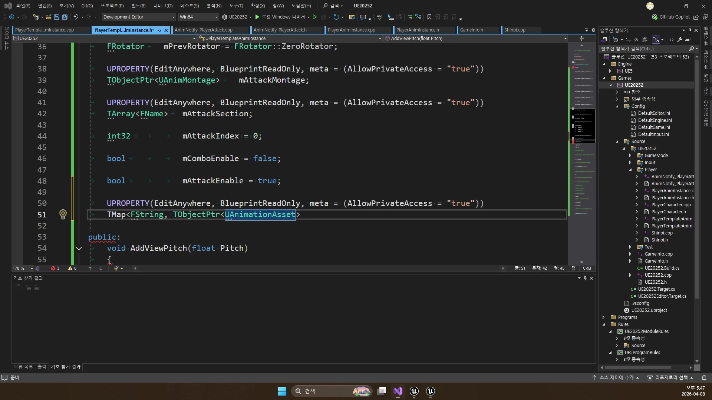
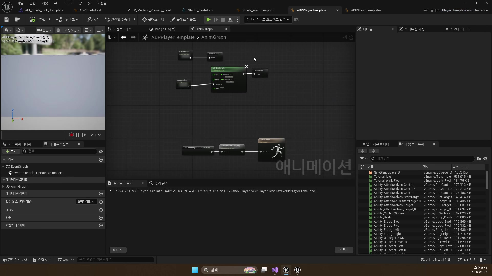
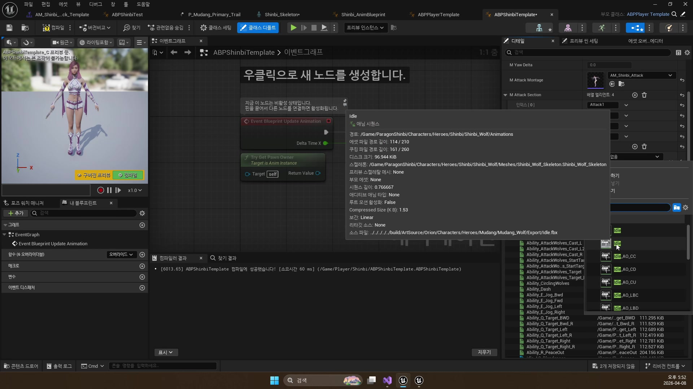
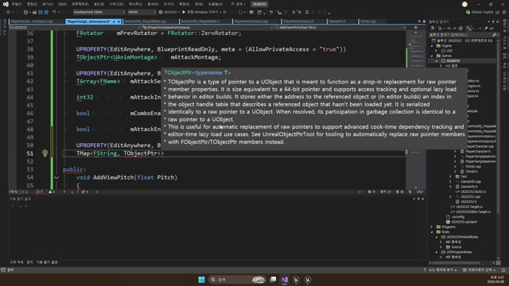
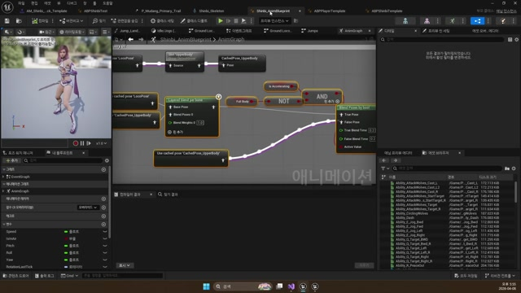

# 260408 03 콤보 섹션과 애니메이션 템플릿

[이전: 02 노티파이](../02_intermediate_animation_notifies_and_custom_notify/) | [260408 허브](../) | [다음: 04 공식 문서](../04_appendix_official_docs_reference/)

## 문서 개요

이 편은 `260408`의 핵심 결론이다.
공격 몽타주와 노티파이만으로는 "한 번 치는 공격"까지는 만들 수 있지만, 여러 캐릭터가 공유하는 콤보 시스템과 템플릿 구조까지는 아직 아니다.

여기서는 `mAttackEnable`, `mComboEnable`, `mAttackIndex`, `mAttackSection`이 어떻게 콤보 상태를 만들고, `UPlayerTemplateAnimInstance`와 `ABPPlayerTemplate`이 어떻게 그 구조를 공용화하는지 본다.

## 1. 콤보는 버튼 연타가 아니라 열린 입력 창구의 연장이다

`ComboStart`와 `ComboEnd` 사이의 짧은 시간만 다음 입력을 받아 주는 구조가 `260408` 콤보 시스템의 핵심이다.
즉 콤보는 "빠르게 여러 번 누르기"가 아니라, "애니메이션이 허락한 구간 안에서 다음 타를 연장하기"에 가깝다.

## 2. 콤보 상태를 만드는 네 값

- `mAttackEnable`: 첫 타를 시작할 수 있는가
- `mComboEnable`: 지금 다음 입력을 받아 줄 수 있는가
- `mAttackIndex`: 현재 몇 번째 섹션까지 진행됐는가
- `mAttackSection`: `Attack1`, `Attack2` 같은 섹션 이름 배열



이 네 값이 합쳐지면 공격 버튼 하나로도 `시작`, `연장`, `무시` 세 가지 분기가 가능해진다.

## 3. `PlayAttack()`의 분기 구조를 다시 읽기

첫 타는 `mAttackEnable`이 열려 있을 때 시작되고, 다음 타는 `mComboEnable`이 열린 순간에만 이어진다.
강의 후반 코드 화면도 이 분기를 꽤 선명하게 보여 준다.


이 구조 덕분에 콤보 수는 코드에 박히지 않는다.
몇 단까지 이어질지는 `mAttackSection.Num()`과 몽타주 섹션 데이터가 결정한다.

## 4. 템플릿은 공용 규칙과 개별 자산을 분리한다

`UPlayerTemplateAnimInstance`는 `UPlayerAnimInstance`를 상속하면서, 캐릭터별 시퀀스와 블렌드 스페이스를 `TMap`으로 보관한다.

```cpp
UPROPERTY(EditAnywhere, BlueprintReadOnly)
TMap<FString, TObjectPtr<UAnimSequence>> mAnimMap;

UPROPERTY(EditAnywhere, BlueprintReadOnly)
TMap<FString, TObjectPtr<UBlendSpace>> mBlendSpaceMap;
```





즉 공용 그래프, 공용 슬롯, 공용 노티파이 규칙은 부모 템플릿에 두고, 실제로 재생할 자산만 캐릭터별로 바꿔 꽂는 구조가 된다.

## 5. 강의 화면으로 보면 더 잘 보이는 지점

후반부 강의 화면에는 템플릿 필드와 전이 규칙이 어떻게 배치되는지가 비교적 잘 잡혀 있다.
그래프를 공통 부모에 고정해 두면 캐릭터가 늘어나도 전투 구조를 처음부터 다시 짤 필요가 줄어든다.





## 6. 260409로 이어지는 발판

이 날짜는 전투 결과보다 전투 구조를 만드는 날이다.
다음 날짜 `260409`에서 붙는 실제 공격 판정, `TakeDamage`, 투사체, 파티클, 사운드는 전부 이 구조 위에 올라간다.

즉 `260408`의 템플릿 파트는 "공격 애니메이션 재사용"이 아니라, `캐릭터가 늘어나도 같은 전투 규약을 유지하는 기반`을 만든다고 보는 편이 정확하다.

## 정리

이 편의 핵심은 `콤보 규칙을 데이터화하고, 그 규칙을 템플릿으로 공용화한다`는 점이다.
이제 공격 애니메이션은 개별 캐릭터의 임시 구현이 아니라, 프로젝트 전체가 공유하는 전투 규약으로 바뀐다.

[이전: 02 노티파이](../02_intermediate_animation_notifies_and_custom_notify/) | [260408 허브](../) | [다음: 04 공식 문서](../04_appendix_official_docs_reference/)
