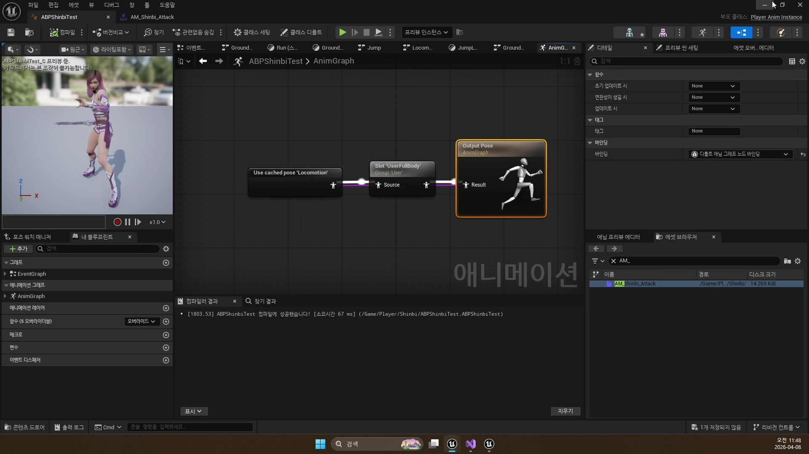
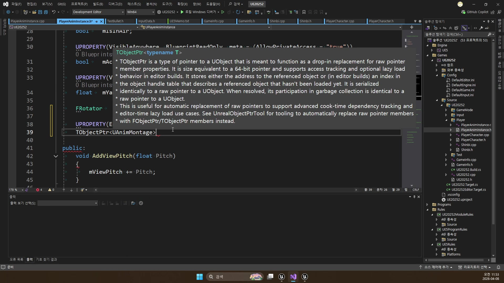
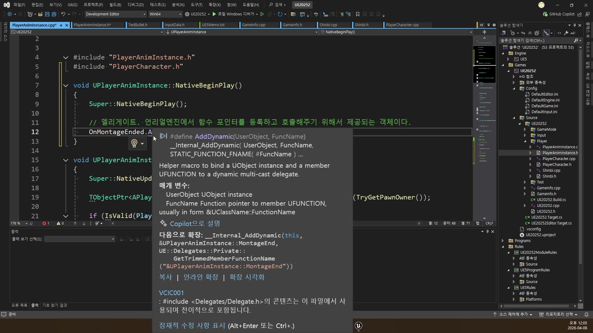
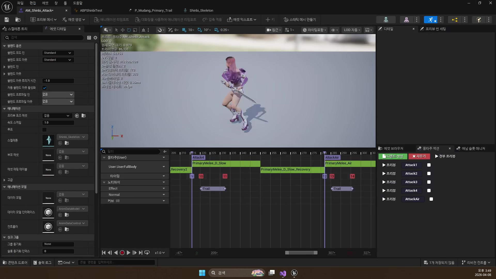
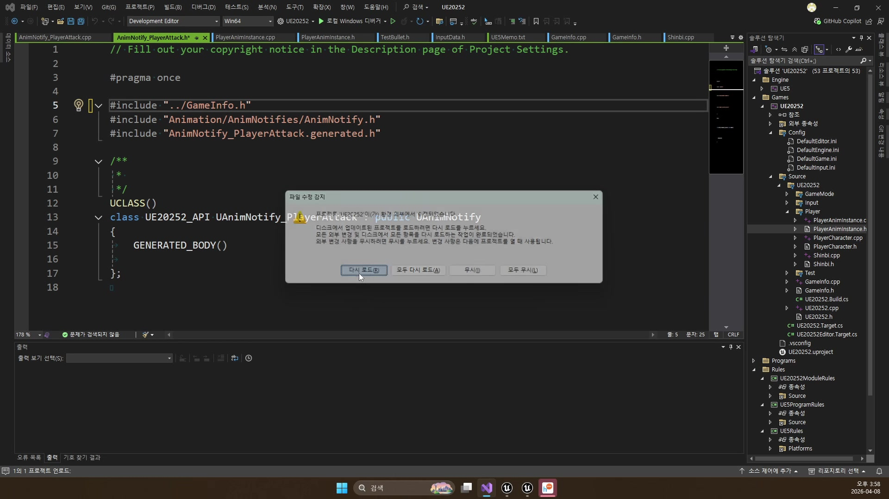
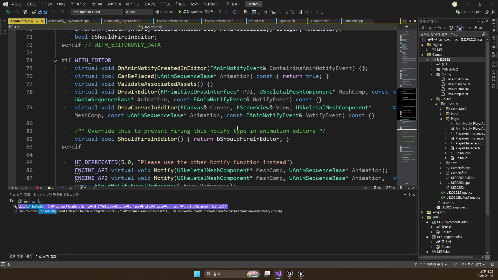

# 260408 공격 몽타주, 슬롯, 노티파이, 콤보 섹션으로 전투 애니메이션을 조립하는 구조

## 문서 개요

이 문서는 `260408_1`부터 `260408_3`까지의 강의를 하나의 연속된 교재로 다시 정리한 것이다.
이번 날짜의 핵심은 플레이어 공격을 "애니메이션 하나 재생" 수준이 아니라, 로코모션과 공존하는 전투 구조로 끌어올리는 데 있다.

강의 흐름을 한 줄로 요약하면 다음과 같다.

`AnimMontage / Slot -> Notify -> Combo Section -> Animation Template`

즉 `260408`은 나중에 나올 데미지, 이펙트, 투사체보다 한 단계 앞에 있는 교안이다.
공격 애니메이션을 어떤 재생 경로로 넣을지, 입력 허용 타이밍을 어떻게 제어할지, 캐릭터가 늘어나도 같은 구조를 어떻게 재사용할지를 먼저 정리한다.

이 교재는 아래 네 자료를 함께 대조해 작성했다.

- `D:\UE_Academy_Stduy_compressed`의 원본 영상과 자막
- 원본 영상에서 다시 추출한 대표 장면 캡처
- `D:\UnrealProjects\UE_Academy_Stduy\Source\UE20252`의 실제 C++ 소스
- `D:\UnrealProjects\UE_Academy_Stduy\Saved\AcademyUtility`의 소스/애님 덤프
- Epic Developer Community의 언리얼 공식 문서

## 학습 목표

- `AnimMontage`와 `Slot`이 왜 로코모션 위에 공격을 얹는 데 필요한지 설명할 수 있다.
- 일반 `Notify`, `Notify State`, `UAnimNotify` 기반 커스텀 노티파이의 차이를 구분할 수 있다.
- `mAttackEnable`, `mComboEnable`, `mAttackIndex`, `mAttackSection`이 데이터 기반 콤보와 어떻게 연결되는지 말할 수 있다.
- `PlayerTemplateAnimInstance`, `TemplateFullBody` 슬롯, `TMap` 기반 에셋 매핑이 왜 템플릿 구조에 필요한지 설명할 수 있다.
- `Animation Montage`, `Animation Notifies`, `Using Layered Animations`, `Animation Blueprint Linking` 공식 문서가 왜 `260408`과 직접 연결되는지 설명할 수 있다.
- `AttackKey() -> InputAttack() -> PlayAttack() -> AnimNotify_PlayerAttack -> NormalAttack()` 흐름과 스킬 캐스팅 준비의 `PlaySkill1() -> AnimNotify_SkillCasting()` 흐름을 실제 C++ 기준으로 설명할 수 있다.

## 강의 흐름 요약

1. 공격은 로코모션 그래프를 깨지 않도록 `AnimMontage`와 `Slot`으로 분리해 넣는다.
2. 특정 프레임에 일어날 일은 노티파이로 지정하고, 입력 창구도 노티파이로 연다.
3. 몽타주 섹션과 콤보 플래그를 이용해 캐릭터별 섹션 체인을 데이터로 제어한다.
4. 마지막으로 공용 템플릿 애님 구조를 만들어 캐릭터별 차이는 에셋 매핑으로만 남긴다.
5. 언리얼 공식 문서를 통해 `Montage`, `Slot`, `Notify`, 레이어드 블렌딩, 애님 템플릿 분리가 엔진 표준 용어로 어떻게 설명되는지 확인한다.
6. 현재 프로젝트 C++ 코드를 읽으며, 위 구조가 `PlayerAnimInstance`, `PlayerTemplateAnimInstance`, `AnimNotify_PlayerAttack`, `Shinbi`, `Wraith` 안에서 어떻게 이어지는지 확인한다.

## 2026-04-23 덤프 반영 메모

이번 덤프는 `260408`의 핵심이 “개념적인 몽타주 설명”이 아니라, 캐릭터별 다른 공격을 공용 슬롯 규칙 아래 묶어 둔 실제 데이터 설계라는 점을 잘 보여 준다.

- `AM_Shinbi_Attack_Template_AssetDump.txt`
  `Attack1`, `Attack2`, `Attack3`, `Attack4`, `AttackAir` 다섯 섹션이 있고 모두 `TemplateFullBody` 슬롯으로 들어간다.
- `AM_Wraith_Attack_Template_AssetDump.txt`
  `Attack1` 한 섹션만 가진다. 즉 같은 템플릿 구조라도 캐릭터별 콤보 깊이는 자산 데이터에서 갈라진다.
- `AM_Shinbi_Skill1_Template_AssetDump.txt`
  `Casting -> Loop -> Impact` 세 섹션이 실제로 잡혀 있다. 문서에서 설명한 “캐스팅 유지 후 확정 발사” 구조가 몽타주 데이터로 확인된다.
- `ABPPlayerTemplate_NodeDump.txt`
  위 몽타주들은 전부 `TemplateFullBody` 슬롯을 타고 들어온다. 그래서 템플릿 구조의 진짜 핵심은 캐릭터별 자산 차이보다 공통 슬롯 규약을 먼저 세운 데 있다.

---

## 제1장. AnimMontage와 Slot: 로코모션 위에 공격을 얹는 법

### 1.1 왜 공격 애니메이션을 그래프 한가운데에 꽂으면 안 되는가

첫 강의의 출발점은 매우 현실적이다.
가만히 서서 공격만 하는 캐릭터라면 시퀀스 하나를 재생해도 되지만, 실제 플레이어는 이동, 점프, 시선 회전과 공격이 동시에 얽힌다.
그래서 공격 애니메이션을 로코모션 그래프 한가운데에 직접 섞어 넣기 시작하면 구조가 금방 무거워진다.

자막에서도 반복해서 나오듯, 이번 날짜의 핵심은 공격을 별도 계층으로 다루는 것이다.
평소에는 기존 로코모션 결과를 그대로 쓰고, 공격이 필요할 때만 다른 재생 경로로 얹는 식이어야 이동 중 공격도 자연스럽게 처리할 수 있다.

### 1.2 몽타주와 슬롯은 "별도 재생 경로"를 만든다

언리얼이 이 문제를 풀기 위해 제공하는 도구가 `AnimMontage`와 `Slot`이다.
몽타주는 시간축을 가진 전투용 애니메이션 자산이고, 슬롯은 그 몽타주가 애님 그래프 안으로 들어오는 통로다.

즉 평소에는 상태 머신과 로코모션이 결과를 내보내고, 공격할 때만 슬롯 노드가 몽타주 결과를 우선시한다.
이 구조 덕분에 점프, 시선 처리, 이동 속도 계산은 살리면서 공격 상체 애니메이션만 겹쳐 얹을 수 있다.
현재 `ABPPlayerTemplate` 덤프를 보면 이 설명이 꽤 구체적으로 구현돼 있다.
`Locomotion` 캐시 포즈가 먼저 저장되고, 그 결과가 `Slot "TemplateFullBody"`로 들어간 뒤 다시 `FullBody` 캐시 포즈로 저장된다.
그 다음 `LayeredBoneBlend`와 `BlendListByBool`이 로코모션 포즈와 몽타주 포즈를 섞는다.
즉 슬롯은 막연한 개념이 아니라, 현재 프로젝트 기준으로도 `TemplateFullBody`라는 공통 통로로 이미 고정되어 있다.



### 1.3 PlayerAnimInstance는 공격 몽타주와 섹션 정보를 들고 있다

실제 프로젝트에서 이 구조의 중심은 `UPlayerAnimInstance`다.
여기에는 공격 몽타주와 공격 섹션 배열, 그리고 콤보 상태를 관리할 값들이 모여 있다.

```cpp
// 실제 평타 몽타주 자산
UPROPERTY(EditAnywhere, BlueprintReadOnly)
TObjectPtr<UAnimMontage> mAttackMontage;

// Attack1, Attack2 같은 섹션 이름 목록
UPROPERTY(EditAnywhere, BlueprintReadOnly)
TArray<FName> mAttackSection;

// 지금 몇 번째 콤보 타를 보고 있는지
int32 mAttackIndex = 0;
// 다음 타 입력을 받아도 되는지
bool mComboEnable = false;
// 첫 공격 시작이 가능한지
bool mAttackEnable = true;
```

이 필드들이 중요한 이유는 몽타주 재생을 단순 재생/정지 문제가 아니라 "어느 섹션을 언제 열 것인가"라는 전투 흐름으로 바꿔 주기 때문이다.
실제 현재 `UPlayerAnimInstance`는 공격뿐 아니라 `mSkill1Montage`, `mSkill1Section`, `mSkill1Index`도 함께 가지고 있다.
즉 이번 날짜의 구조는 기본 공격 콤보만을 위한 임시 장치가 아니라, 이후 스킬 몽타주까지 같은 틀 안에 넣기 위한 공통 애님 전투 레이어라고 볼 수 있다.



### 1.4 PlayAttack은 첫 타와 연속 입력을 다른 규칙으로 처리한다

`PlayAttack()`은 이 강의의 중심 함수다.
공격이 시작되지 않은 상태라면 첫 섹션을 재생하고, 이미 공격 중이라면 현재 입력이 콤보로 인정되는지를 보고 다음 섹션으로 점프시킨다.

```cpp
if (mAttackEnable)
{
    // 첫 입력이면 공격 시작 권한을 잠그고 1타 섹션부터 재생한다.
    if (!Montage_IsPlaying(mAttackMontage))
    {
        mAttackEnable = false;
        Montage_SetPosition(mAttackMontage, 0.f);
        Montage_Play(mAttackMontage, 1.f);
        Montage_JumpToSection(mAttackSection[0], mAttackMontage);
    }
}
else if (mComboEnable)
{
    // 노티파이가 다음 입력을 허용한 상태라면 다음 섹션으로 넘어간다.
    mAttackIndex = (mAttackIndex + 1) % mAttackSection.Num();
    Montage_Play(mAttackMontage, 1.f);
    Montage_JumpToSection(mAttackSection[mAttackIndex], mAttackMontage);
    mComboEnable = false;
}
```

이 코드가 보여 주는 핵심은 버튼 하나가 상황에 따라 두 역할을 한다는 점이다.

- 공격이 시작되지 않았을 때는 "첫 타 시작"
- 콤보 입력 창이 열려 있을 때는 "다음 섹션으로 연장"

즉 공격 입력은 단순 트리거가 아니라, 현재 몽타주 상태를 읽고 분기하는 상태 기반 입력이 된다.
여기서 중요한 점은 콤보 길이가 코드에 박혀 있지 않다는 것이다.
현재 구현은 `mAttackSection.Num()`을 기준으로 다음 섹션을 고르므로, 몇 단까지 이어질지는 몽타주 데이터가 결정한다.
실제로 `AM_Shinbi_Attack_Template` 덤프에는 `Attack1`, `Attack2`, `Attack3`, `Attack4`, `AttackAir` 다섯 섹션이 있고, `AM_Wraith_Attack_Template`는 `Attack1`만 가진다.
즉 강의의 핵심은 "3단 콤보 구현"이라기보다, 섹션 배열과 몽타주 데이터로 캐릭터별 연속 공격 수를 바꿀 수 있는 구조를 만드는 데 있다.

### 1.5 OnMontageEnded는 공격 상태를 정리하는 종료선이다

몽타주 구조를 썼다면 시작만큼 종료도 중요하다.
`UPlayerAnimInstance::NativeBeginPlay()`는 `OnMontageEnded` 델리게이트를 등록하고, 종료 시점에는 다시 기본 상태로 되돌린다.

```cpp
void UPlayerAnimInstance::NativeBeginPlay()
{
    Super::NativeBeginPlay();
    // 몽타주가 끝났을 때 정리 함수를 받도록 델리게이트를 연결한다.
    OnMontageEnded.AddDynamic(this, &UPlayerAnimInstance::MontageEnd);
}
```

그리고 `MontageEndOverride()`에서는 공격이 끝났을 때 플래그와 인덱스를 초기화한다.
이 정리 단계가 있어야 다음 공격이 다시 첫 타부터 정상적으로 시작된다.
현재 코드 기준으로는 스킬 몽타주 종료도 같은 훅에서 정리된다.
즉 `OnMontageEnded`는 단순 콤보 종료 처리 함수가 아니라, 몽타주 기반 전투 상태 전체를 기본값으로 되돌리는 공통 종료선에 가깝다.



### 1.6 장 정리

제1장의 결론은 분명하다.
공격 애니메이션을 잘 넣으려면 기존 로코모션 구조를 버리는 대신, 그 위에 얹히는 별도 경로를 만들어야 한다.
`AnimMontage`, `Slot`, 섹션, 종료 콜백이 바로 그 구조를 만든다.

---

## 제2장. 노티파이 종류: 특정 프레임에 무슨 일이 일어나야 하는가

### 2.1 노티파이는 애니메이션 안의 "시간표"다

두 번째 강의는 특정 프레임에 어떤 기능을 실행할지 정리한다.
콤보 입력 허용, 공격 판정 시작, 이펙트 재생, 사운드 재생은 모두 정확한 타이밍이 중요하다.
이 타이밍을 애니메이션 안에 심는 도구가 `Notify`다.

자막에서도 설명하듯, Notify는 "애니메이션이 재생되는 중 내가 지정한 시점에 어떤 일을 한 번 실행하게 해 주는 시스템"이다.
즉 전투 로직을 단순히 입력 시점에 몰아 넣지 않고, 실제 타격 프레임에 맞게 시간축에 배치할 수 있게 해 준다.

### 2.2 일반 Notify와 Notify State는 역할이 다르다

강의는 노티파이를 크게 두 갈래로 나눈다.

- 일반 `Notify`: 특정 프레임에서 한 번 실행
- `Notify State`: 시작과 끝이 있는 구간형 이벤트

사운드나 콤보 시작 신호처럼 한 번 찍고 끝나는 것은 일반 Notify가 잘 맞는다.
반대로 무기 트레일처럼 일정 구간 동안 유지되는 판정이나 이펙트는 Notify State가 더 자연스럽다.
다만 현재 저장소에서 직접 확인되는 패턴은 일반 Notify와 커스텀 `UAnimNotify` 쪽에 더 가깝다.
즉 강의는 `Notify State`까지 개념을 넓혀 설명하지만, 지금 프로젝트의 실제 증거는 `ComboStart`, `ComboEnd`, `AnimNotify_SkillCasting`, `AnimNotify_PlayerAttack`처럼 "한 번 실행되는 시점 이벤트"에 집중되어 있다.



### 2.3 함수형 노티파이는 이름 규칙으로 연결된다

이번 프로젝트에서 자주 쓰는 방식은 일반 Notify 이름을 함수와 연결하는 방법이다.
예를 들어 애님 에디터에 `ComboStart`, `ComboEnd`를 배치하면, `UPlayerAnimInstance` 쪽에서는 `AnimNotify_ComboStart()`, `AnimNotify_ComboEnd()`를 구현해 바로 받을 수 있다.

```cpp
UFUNCTION()
void AnimNotify_ComboStart();

UFUNCTION()
void AnimNotify_ComboEnd();

void UPlayerAnimInstance::AnimNotify_ComboStart()
{
    // 이 프레임부터는 다음 콤보 입력을 받아 준다.
    mComboEnable = true;
}

void UPlayerAnimInstance::AnimNotify_ComboEnd()
{
    // 이 프레임이 지나면 더는 다음 입력을 받지 않는다.
    mComboEnable = false;
}
```

이 방식이 좋은 이유는 매우 단순하다.
콤보 입력 창구를 코드에서 하드코딩된 시간 값으로 관리하는 대신, 애니메이터가 몽타주 타임라인에서 직접 열고 닫을 수 있기 때문이다.
현재 프로젝트는 이 패턴을 기본 공격에만 쓰지 않는다.
`UPlayerTemplateAnimInstance`에는 `AnimNotify_SkillCasting()`도 구현되어 있고, 이 함수는 `TryGetPawnOwner()`로 플레이어를 얻어 `PlayerChar->Skill1Casting()`을 호출한 뒤 `mSkill1Index`를 다음 섹션으로 넘긴다.
즉 노티파이는 단순 콤보 창구용 신호가 아니라, 스킬의 캐스팅 시점과 섹션 진행까지 묶어 주는 시간 제어 장치다.

### 2.4 커스텀 UAnimNotify 클래스는 기능성 노티파이를 만든다

강의 후반은 `UAnimNotify`를 상속받는 커스텀 클래스 쪽으로 넘어간다.
이 방식은 단순 이름 신호보다 더 기능적인 노티파이가 필요할 때 쓰인다.

`AnimNotify_PlayerAttack`는 그 대표 예시다.
클래스 자체가 하나의 공격 판정 트리거가 되고, `Notify()` 안에서 플레이어의 `NormalAttack()`을 호출한다.

```cpp
void UAnimNotify_PlayerAttack::Notify(USkeletalMeshComponent* MeshComp,
    UAnimSequenceBase* Animation, const FAnimNotifyEventReference& EventReference)
{
    Super::Notify(MeshComp, Animation, EventReference);

    // 이 애니메이션을 재생 중인 주인이 현재 플레이어 캐릭터인지 확인한다.
    TObjectPtr<APlayerCharacter> PlayerChar = MeshComp->GetOwner<APlayerCharacter>();

    if (IsValid(PlayerChar))
    {
        // 정확히 이 프레임에만 실제 공격 판정 함수를 호출한다.
        PlayerChar->NormalAttack();
    }
}
```





이 구조 덕분에 "공격 판정"이라는 기능 자체를 노티파이 자산처럼 타임라인에 배치할 수 있다.
즉 애님과 게임플레이 코드가 느슨하게 연결되면서도, 시점은 매우 정확하게 맞춰진다.
또 한 가지 좋은 점은 이 노티파이가 베이스 클래스 `NormalAttack()`만 호출한다는 것이다.
그래서 실제 내용은 캐릭터마다 달라질 수 있다.
현재 코드 기준으로 `AShinbi::NormalAttack()`은 근접 캡슐 스윕 판정이고, `AWraith::NormalAttack()`은 `Muzzle_01` 소켓 위치에서 `AWraithBullet`을 스폰한다.
즉 하나의 커스텀 노티파이 클래스가 공통 타격 시점은 유지하되, 실제 전투 내용은 파생 캐릭터 쪽으로 자연스럽게 분기시킨다.

### 2.5 장 정리

제2장은 공격 시스템의 시간 제어를 담당한다.
노티파이가 없으면 콤보 입력 창구도, 판정 시작도, 이펙트 타이밍도 애매해진다.
일반 Notify, Notify State, 커스텀 `UAnimNotify`는 각각 다른 종류의 시간을 다루는 도구다.

---

## 제3장. 콤보 공격과 애니메이션 템플릿: 구조를 재사용 가능한 형태로 만들기

### 3.1 콤보는 버튼 연타가 아니라 "열린 창구 안의 연장 입력"이다

세 번째 강의는 앞에서 만든 노티파이 타이밍을 실제 콤보 로직과 연결한다.
중요한 점은 콤보를 단순 연타로 보지 않는다는 것이다.
언제 누르든 다음 타로 넘어가는 구조가 아니라, `ComboStart`와 `ComboEnd` 사이의 짧은 창구에서만 다음 입력을 인정한다.

그래서 `mComboEnable`이 필요하다.
이 값은 노티파이가 열어 준 짧은 시간 동안만 `true`가 되고, 그때 들어온 입력만 다음 섹션으로 넘어갈 자격을 얻는다.
현재 코드 관점에서 보면, 이 창구 방식은 "몇 단 콤보냐"보다 더 근본적인 규칙이다.
섹션 수가 늘어나거나 줄어들어도, 입력을 언제 허용할지 결정하는 기준은 여전히 노티파이로 열린 짧은 창구다.

### 3.2 mAttackEnable, mComboEnable, mAttackIndex가 콤보 상태를 만든다

실제 소스에서 콤보 구조의 핵심 상태는 세 가지다.

- `mAttackEnable`: 공격 시작 가능 여부
- `mComboEnable`: 다음 입력을 받을 수 있는지
- `mAttackIndex`: 현재 몇 번째 섹션까지 왔는지


이 세 값 덕분에 공격 버튼은 다음처럼 동작한다.

1. 아무 공격도 안 하는 중이면 첫 섹션 시작
2. 공격 중이지만 입력 창구가 닫혀 있으면 무시
3. 공격 중이고 `mComboEnable`이 켜져 있으면 다음 섹션으로 연장

즉 콤보는 복잡한 AI가 아니라, 상태 플래그와 섹션 이동만으로도 꽤 정교하게 구성할 수 있다.
현재 `AM_Shinbi_Attack_Template`처럼 섹션이 여러 개인 몽타주는 연속 공격으로 이어지고, `AM_Wraith_Attack_Template`처럼 섹션이 하나뿐인 경우는 사실상 단발 공격 구조가 된다.
즉 같은 `PlayAttack()` 로직을 써도 캐릭터별 공격 스타일 차이는 몽타주 데이터 쪽에서 흡수된다.

### 3.3 템플릿은 공용 구조와 개별 자산을 분리한다

후반부는 `260409`로 이어지는 매우 중요한 발판이다.
강의는 여기서 애님 구조를 템플릿으로 뽑아내기 시작한다.
공용 플레이어 구조는 부모 템플릿에 두고, 캐릭터별 차이는 그 위에 얹는 방식이다.

`UPlayerTemplateAnimInstance`는 `UPlayerAnimInstance`를 상속하면서, 각 캐릭터가 사용할 시퀀스나 블렌드 스페이스를 `TMap`으로 보관한다.

```cpp
UCLASS()
class UE20252_API UPlayerTemplateAnimInstance : public UPlayerAnimInstance
{
    GENERATED_BODY()

protected:
    // Idle, JumpStart 같은 단일 시퀀스 자산 모음
    UPROPERTY(EditAnywhere, BlueprintReadOnly)
    TMap<FString, TObjectPtr<UAnimSequence>> mAnimMap;

    // Run, Aim 같은 블렌드 자산 모음
    UPROPERTY(EditAnywhere, BlueprintReadOnly)
    TMap<FString, TObjectPtr<UBlendSpace>> mBlendSpaceMap;
};
```

즉 공용 그래프와 전투 로직은 유지하고, 실제로 재생할 자산만 캐릭터별로 바꿔 꽂는 구조가 된다.
다만 현재 템플릿 구조는 단순히 `TMap`만 추가한 수준보다 조금 더 크다.
`ABPPlayerTemplate` 자체가 `UPlayerTemplateAnimInstance`를 부모로 삼고 있고, 공통 그래프 안에 `TemplateFullBody` 슬롯과 `Locomotion / FullBody` 캐시 포즈 체인을 이미 포함한다.
즉 템플릿은 "자산 이름 사전"이면서 동시에, 모든 캐릭터가 공유하는 공격 삽입 지점을 제공하는 부모 그래프이기도 하다.

몽타주 자산도 이 공용 슬롯 규칙에 맞춰 정리되어 있다.
예를 들어 원본 `AM_Shinbi_Attack` 덤프의 슬롯 이름은 `UserFullBody`지만, 템플릿용 `AM_Shinbi_Attack_Template`와 `AM_Shinbi_Skill1_Template`, `AM_Wraith_Attack_Template`는 모두 `TemplateFullBody` 슬롯을 사용한다.
즉 템플릿화는 C++ 클래스만의 문제가 아니라, 몽타주 슬롯 이름까지 공통 규약으로 맞추는 작업이다.

또 `UPlayerTemplateAnimInstance`는 `AnimNotify_SkillCasting()`과 `MontageEndOverride()`를 통해 스킬 섹션 진행까지 공통 계층에서 받는다.
실제로 `AM_Shinbi_Skill1_Template`는 `Casting -> Loop -> Impact` 세 섹션을 갖고 있고, 이 흐름은 `mSkill1Section`과 `mSkill1Index`로 제어된다.
즉 템플릿 구조는 기본 공격 재사용만이 아니라, 캐릭터별 스킬 몽타주까지 같은 틀 안에 수용하기 위한 준비 단계라고 볼 수 있다.


### 3.4 템플릿은 260409의 실제 공격/이펙트 확장을 준비한다

이번 날짜 교재가 중요한 이유는 여기서 끝나지 않기 때문이다.
`260409`에서는 이 기반 위에 실제 공격 판정, `TakeDamage`, 파티클, 사운드, 원거리 투사체까지 붙는다.

즉 `260408`은 다음을 준비한 날이다.

- 공격을 별도 재생 경로로 다루는 몽타주 구조
- 노티파이로 열고 닫는 입력 창구
- 콤보를 제어하는 섹션과 플래그
- 캐릭터가 늘어나도 유지 가능한 템플릿 구조


### 3.5 장 정리

제3장은 공격 애님 구조를 일회성 구현이 아니라 재사용 가능한 시스템으로 바꾼다.
콤보는 노티파이와 섹션으로 제어하고, 공용 그래프는 템플릿으로 고정해 캐릭터별 차이는 자산 매핑으로 처리한다.

---

## 제4장. 언리얼 공식 문서로 다시 읽는 260408 핵심 구조

### 4.1 왜 260408부터 공식 문서를 같이 보는가

`260408`은 공격 애니메이션을 단순 재생이 아니라 구조로 다루는 날이다.
입문자 입장에서는 `AnimMontage`, `Slot`, `Notify`, `Combo Section`이 전부 개별 기능처럼 보이지만, 공식 문서에서는 이들이 "애니메이션 시간축을 게임플레이 로직과 연결하는 도구"로 정리된다.

이번 보강에서는 특히 아래 공식 문서를 기준점으로 삼는다.

- [Animation Montage in Unreal Engine](https://dev.epicgames.com/documentation/en-us/unreal-engine/animation-montage-in-unreal-engine?application_version=5.6)
- [Animation Notifies in Unreal Engine](https://dev.epicgames.com/documentation/en-us/unreal-engine/animation-notifies-in-unreal-engine?application_version=5.6)
- [Using Layered Animations in Unreal Engine](https://dev.epicgames.com/documentation/en-us/unreal-engine/using-layered-animations-in-unreal-engine)
- [Animation Blueprint Linking in Unreal Engine](https://dev.epicgames.com/documentation/en-us/unreal-engine/animation-blueprint-linking-in-unreal-engine?application_version=5.6)
- [Transition Rules in Unreal Engine](https://dev.epicgames.com/documentation/en-us/unreal-engine/transition-rules-in-unreal-engine?application_version=5.6)

즉 이 장의 목적은 강의 내용을 다른 방식으로 반복하는 것이 아니라, `260408`에서 만든 전투 애니메이션 구조가 언리얼 표준 문서에서는 어떤 자산과 그래프 문법으로 묶이는지 보여 주는 데 있다.

### 4.2 공식 문서의 `Animation Montage`와 `Using Layered Animations`는 왜 공격이 로코모션과 분리돼야 하는지 다시 확인시켜 준다

강의 1장의 핵심은 공격 애니메이션을 로코모션 그래프 한가운데 직접 꽂지 않는다는 점이다.
공식 문서의 `Animation Montage`와 `Using Layered Animations`도 정확히 같은 문제를 다룬다.

즉 언리얼 표준 해법은 아래와 같다.

- 이동과 점프 같은 기본 포즈는 상태 머신과 로코모션이 만든다.
- 공격 같은 일시적 행동은 `Montage`로 재생한다.
- 그 몽타주가 그래프 안으로 들어오는 통로는 `Slot`이 맡는다.
- 필요하면 `Layered Blend`나 상체 슬롯 규약으로 이동과 공격을 공존시킨다.

이 관점으로 보면 강의의 `TemplateFullBody` 슬롯도 임의 규칙이 아니라, 공식 문서가 설명하는 "몽타주 전용 통로"를 프로젝트 공용 규약으로 고정한 사례라고 이해할 수 있다.

### 4.3 공식 문서의 `Animation Notifies`는 강의의 `ComboStart / ComboEnd / PlayerAttack`을 "시간표" 개념으로 정리해 준다

강의 2장은 노티파이를 애니메이션 안의 시간표처럼 설명한다.
공식 문서의 `Animation Notifies`도 정확히 같은 관점이다.

즉 노티파이는 "공격이 있다"는 상태를 표현하는 것이 아니라, 정확히 어느 프레임에 어떤 일이 일어나야 하는지를 애니메이션 자산 안에 심는 장치다.

그래서 이번 날짜의 주요 노티파이도 역할이 갈린다.

- `ComboStart`: 다음 입력을 받을 수 있는 창구 열기
- `ComboEnd`: 입력 창구 닫기
- `AnimNotify_PlayerAttack`: 실제 타격 함수 호출
- `AnimNotify_SkillCasting`: 스킬 발동 시점 통보

이 구조 덕분에 입력 시점과 실제 타격 시점을 분리할 수 있고, 캐릭터별 애니메이션 길이가 달라도 프레임 정확도를 유지할 수 있다.

### 4.4 `Animation Blueprint Linking` 문서는 강의의 `Animation Template` 구조가 왜 필요한지 설명해 준다

강의 3장의 후반부는 공격 구조를 캐릭터 공용 템플릿으로 올리는 파트다.
여기서 `PlayerTemplateAnimInstance`, `ABPPlayerTemplate`, 공통 슬롯 규약, 공용 노티파이 규칙이 등장한다.

공식 문서의 `Animation Blueprint Linking`은 이런 설계를 더 일반적인 방식으로 설명한다.
즉 애님 로직이 커질수록 한 블루프린트에 다 넣기보다, 공용 구조와 개별 자산 차이를 나누는 편이 협업과 유지보수에 유리하다는 것이다.

`260408`의 템플릿 구조도 정확히 같은 방향이다.

- 공통 그래프와 공통 규칙은 템플릿에 둔다.
- 캐릭터별 차이는 에셋 매핑과 파생 블루프린트로 처리한다.

즉 이 날짜는 "공격이 나온다"보다 먼저, 공격 애니메이션 구조가 캐릭터 수가 늘어나도 버티게 만드는 날이라고 볼 수 있다.

### 4.5 260408 공식 문서 추천 읽기 순서

이번 날짜는 아래 순서로 공식 문서를 읽으면 가장 자연스럽다.

1. [Animation Montage in Unreal Engine](https://dev.epicgames.com/documentation/en-us/unreal-engine/animation-montage-in-unreal-engine?application_version=5.6)
2. [Using Layered Animations in Unreal Engine](https://dev.epicgames.com/documentation/en-us/unreal-engine/using-layered-animations-in-unreal-engine)
3. [Animation Notifies in Unreal Engine](https://dev.epicgames.com/documentation/en-us/unreal-engine/animation-notifies-in-unreal-engine?application_version=5.6)
4. [Transition Rules in Unreal Engine](https://dev.epicgames.com/documentation/en-us/unreal-engine/transition-rules-in-unreal-engine?application_version=5.6)
5. [Animation Blueprint Linking in Unreal Engine](https://dev.epicgames.com/documentation/en-us/unreal-engine/animation-blueprint-linking-in-unreal-engine?application_version=5.6)

이 순서가 좋은 이유는 먼저 `공격을 어떻게 재생하는가`를 몽타주 기준으로 잡고, 그 다음 `그 타이밍을 어떻게 통제하는가`를 노티파이와 전이 규칙으로 읽고, 마지막에 `그 구조를 어떻게 템플릿으로 키울 것인가`까지 이어서 볼 수 있기 때문이다.

### 4.6 장 정리

공식 문서 기준으로 다시 보면 `260408`은 아래 다섯 가지를 배우는 날이다.

1. 공격은 상태 머신 안이 아니라 `Montage + Slot`으로 분리하는 편이 안전하다.
2. 노티파이는 애니메이션 안의 시간표다.
3. 콤보는 버튼 연타가 아니라 열린 입력 창구의 연장 규칙이다.
4. 레이어드 블렌딩과 슬롯 규약 덕분에 이동과 공격이 공존할 수 있다.
5. 템플릿 애님 구조는 이 규칙을 캐릭터 공용 자산으로 끌어올린다.

---

## 제5장. 현재 프로젝트 C++ 코드로 다시 읽는 260408 핵심 구조

### 5.1 왜 260408은 "입력 처리"와 "실제 공격 실행"을 분리해서 봐야 하는가

`260408`을 처음 배우는 사람은 보통 이렇게 생각하기 쉽다.
"공격 버튼을 누르면 바로 데미지 함수가 호출되겠지."
하지만 현재 프로젝트 C++는 그렇게 짜여 있지 않다.

실제 구조는 다음처럼 단계가 나뉜다.

1. 입력이 들어온다.
2. 캐릭터는 애님 인스턴스에게 "공격 몽타주를 재생하라"고만 말한다.
3. 애니메이션 타임라인 안의 노티파이가 정확한 프레임에서 다시 C++ 함수를 호출한다.
4. 그때 비로소 실제 공격 판정이나 투사체 생성이 일어난다.

즉 `260408`의 핵심은 "버튼을 누르는 순간 공격이 끝나는 구조"가 아니라, `입력 -> 몽타주 -> 노티파이 -> 실제 공격 함수`로 이어지는 시간 제어 파이프라인을 만드는 데 있다.

아래 코드는 `D:\UnrealProjects\UE_Academy_Stduy\Source\UE20252`의 실제 구현에서 핵심만 추려 온 뒤, 초보자도 읽을 수 있게 설명용 주석을 붙인 축약판이다.

### 5.2 `AttackKey()`와 `InputAttack()`: 입력은 일단 "애니메이션 시작 신호"만 보낸다

공격 입력의 첫 진입점은 `APlayerCharacter::AttackKey()`다.
그런데 이 함수는 직접 데미지를 주지 않는다.
그저 가상 함수 `InputAttack()`을 호출해 캐릭터별 공격 방식으로 넘겨 준다.

```cpp
void APlayerCharacter::AttackKey(const FInputActionValue& Value)
{
    // 공통 베이스는 "공격 입력이 들어왔다"는 사실만 전달한다
    InputAttack();
}

void APlayerCharacter::InputAttack()
{
    // 베이스는 비워 두고, 실제 내용은 파생 클래스가 채운다
}
```

이 설계가 중요한 이유는 캐릭터마다 공격 의미가 다르기 때문이다.
현재 프로젝트만 봐도 `Shinbi`와 `Wraith`는 입력 이후의 행동이 완전히 같지 않다.

```cpp
void AShinbi::InputAttack()
{
    if (IsValid(mMagicCircleActor))
    {
        // 이미 스킬 타겟팅이 깔려 있으면 스킬 몽타주를 재생한다
        mAnimInst->PlaySkill1();
        mAnimInst->ClearSkill1();
        // 이후 스킬 액터 생성까지 이어진다
    }
    else
    {
        // 평소에는 기본 공격 몽타주를 재생한다
        mAnimInst->PlayAttack();
    }
}

void AWraith::InputAttack()
{
    // 레이스는 단순하게 기본 공격 몽타주부터 재생한다
    mAnimInst->PlayAttack();
}
```

초보자용으로 풀면 이렇게 보면 된다.

- `AttackKey()`: "공격 버튼이 눌렸다"
- `InputAttack()`: "이 캐릭터는 그 입력을 어떻게 해석할까"
- `PlayAttack()` / `PlaySkill1()`: "애니메이션 재생을 시작하라"

즉 기본 공격 기준으로는 이 단계에서 아직 맞지도 않았고, 총알도 안 나갔고, 데미지도 안 들어갔다.
단지 전투 애니메이션의 시간축을 열었을 뿐이다.
물론 `Shinbi`처럼 스킬 확정 입력에서 별도 액터 생성이 바로 붙는 예외는 있지만, 구조의 중심은 여전히 "입력 직후 실제 판정"이 아니라 "먼저 몽타주를 열고 그 뒤를 노티파이와 섹션으로 제어한다"에 있다.

### 5.3 `UPlayerAnimInstance`: 몽타주, 섹션, 콤보 상태를 한곳에 모아 둔다

공격 애니메이션 구조의 실제 중심은 `UPlayerAnimInstance`다.
이 클래스는 단순 애님 재생기가 아니라, 전투 몽타주 상태를 들고 있는 컨트롤 타워에 가깝다.

```cpp
UCLASS()
class UE20252_API UPlayerAnimInstance : public UAnimInstance
{
    GENERATED_BODY()

protected:
    // 기본 공격 몽타주
    UPROPERTY(EditAnywhere, BlueprintReadOnly)
    TObjectPtr<UAnimMontage> mAttackMontage;

    // "Attack1", "Attack2" 같은 섹션 이름 배열
    UPROPERTY(EditAnywhere, BlueprintReadOnly)
    TArray<FName> mAttackSection;

    // 지금 몇 번째 공격 섹션까지 왔는가
    int32 mAttackIndex = 0;

    // 다음 입력을 받아 줄 수 있는 짧은 창구가 열렸는가
    bool mComboEnable = false;

    // 첫 타를 시작할 수 있는가
    bool mAttackEnable = true;

    // 스킬 몽타주와 스킬 섹션도 같은 구조로 관리한다
    UPROPERTY(EditAnywhere, BlueprintReadOnly)
    TObjectPtr<UAnimMontage> mSkill1Montage;

    UPROPERTY(EditAnywhere, BlueprintReadOnly)
    TArray<FName> mSkill1Section;

    int32 mSkill1Index = 0;
};
```

이 선언부는 `260408`을 이해할 때 아주 중요하다.
왜냐하면 여기서 이미 "공격은 애니메이션 하나"가 아니라 "몽타주 + 섹션 + 상태 플래그"라는 사실이 드러나기 때문이다.

즉 현재 프로젝트의 공격 구조는 다음 질문에 답할 수 있게 설계돼 있다.

- 지금 공격을 시작해도 되는가
- 지금은 콤보 입력을 받아도 되는가
- 지금 몇 번째 섹션까지 진행됐는가
- 지금 기본 공격 몽타주를 쓰는가, 스킬 몽타주를 쓰는가

### 5.4 `PlayAttack()`: 첫 타 시작과 다음 타 연장을 다른 규칙으로 처리한다

공격 몽타주를 실제로 재생하는 핵심 함수는 `PlayAttack()`이다.
이 함수는 버튼 하나를 받지만, 상황에 따라 두 가지 전혀 다른 일을 한다.

```cpp
void UPlayerAnimInstance::PlayAttack()
{
    if (!IsValid(mAttackMontage))
    {
        UE_LOG(UELOG, Warning, TEXT("Not Valid Attack Montage"));
        return;
    }

    // 아직 공격 중이 아니면 첫 타를 시작한다
    if (mAttackEnable)
    {
        if (!Montage_IsPlaying(mAttackMontage))
        {
            mAttackEnable = false;

            // 몽타주 재생 위치를 처음으로 되돌린다
            Montage_SetPosition(mAttackMontage, 0.f);

            // 몽타주를 재생한다
            Montage_Play(mAttackMontage, 1.f);

            // 첫 섹션으로 점프한다
            Montage_JumpToSection(mAttackSection[0], mAttackMontage);
        }
    }
    // 이미 공격 중인데 콤보 입력 창구가 열려 있으면 다음 타로 연장한다
    else if (mComboEnable)
    {
        mAttackIndex = (mAttackIndex + 1) % mAttackSection.Num();

        Montage_Play(mAttackMontage, 1.f);
        Montage_JumpToSection(mAttackSection[mAttackIndex], mAttackMontage);

        // 다음 입력은 다시 노티파이가 열어 줄 때까지 잠근다
        mComboEnable = false;
    }
}
```

이 코드를 초보자 눈높이로 해석하면 이렇다.

- 첫 입력: "공격 시작"
- 콤보 창구가 열렸을 때의 다음 입력: "다음 섹션으로 이어 붙이기"
- 그 외 타이밍의 입력: 무시

즉 콤보는 버튼을 많이 누른다고 자동으로 이어지는 것이 아니라, 애니메이션이 허락한 짧은 순간에만 다음 섹션으로 넘어간다.
이 점 때문에 `260408`은 입력 강의라기보다 시간 제어 강의에 가깝다.

또 하나 중요한 점은, 콤보 수가 코드에 박혀 있지 않다는 것이다.
`mAttackSection.Num()`을 기준으로 다음 섹션을 찾기 때문에, 몇 단 콤보인지 자체는 몽타주 데이터가 결정한다.

### 5.5 `AnimNotify_ComboStart()`, `AnimNotify_ComboEnd()`, `OnMontageEnded`: 열린 창구를 제어하고 끝나면 정리한다

콤보 구조를 정말 콤보답게 만드는 것은 노티파이다.
현재 프로젝트는 함수형 노티파이 이름 규칙을 그대로 활용한다.

```cpp
void UPlayerAnimInstance::AnimNotify_ComboStart()
{
    // 이 시점부터 다음 입력을 받아 줄 수 있다
    mComboEnable = true;
}

void UPlayerAnimInstance::AnimNotify_ComboEnd()
{
    // 이 시점이 지나면 더 이상 다음 입력을 받지 않는다
    mComboEnable = false;
}
```

이 구조가 중요한 이유는, "콤보 가능한 시간"을 코드 타이머가 아니라 애니메이션 타임라인에 묻어 둘 수 있기 때문이다.
즉 애니메이터가 몽타주에서 `ComboStart`, `ComboEnd` 위치를 옮기면, 전투 체감도 함께 바뀐다.

몽타주가 완전히 끝났을 때는 `OnMontageEnded` 델리게이트가 상태를 다시 정리한다.

```cpp
void UPlayerAnimInstance::NativeBeginPlay()
{
    Super::NativeBeginPlay();

    // 몽타주 종료 이벤트에 콜백을 등록한다
    OnMontageEnded.AddDynamic(this, &UPlayerAnimInstance::MontageEnd);
}

void UPlayerAnimInstance::MontageEndOverride(UAnimMontage* Montage, bool bInterrupted)
{
    if (Montage == mAttackMontage)
    {
        if (!bInterrupted)
        {
            // 다음 공격이 다시 1타부터 시작되도록 초기화
            mAttackEnable = true;
            mComboEnable = false;
            mAttackIndex = 0;
        }
    }
}
```

즉 `ComboStart/End`는 "짧은 창구"를 관리하고, `MontageEndOverride()`는 "전투 상태의 완전한 리셋"을 담당한다.
이 둘이 같이 있어야 다음 공격이 꼬이지 않는다.

### 5.6 `PlaySkill1()`과 `AnimNotify_SkillCasting()`: 스킬도 같은 몽타주 구조 안에서 굴러간다

현재 프로젝트는 기본 공격만 몽타주 구조를 쓰는 것이 아니다.
스킬도 같은 틀 안에 들어 있다.

```cpp
void UPlayerAnimInstance::PlaySkill1()
{
    // 스킬 몽타주의 현재 위치를 처음으로 되돌린다
    Montage_SetPosition(mSkill1Montage, 0.f);

    // 스킬 몽타주 재생
    Montage_Play(mSkill1Montage, 1.f);

    // 현재 인덱스가 가리키는 섹션으로 점프
    Montage_JumpToSection(mSkill1Section[mSkill1Index], mSkill1Montage);
}

void UPlayerAnimInstance::ClearSkill1()
{
    mSkill1Index = 0;
}
```

그리고 `UPlayerTemplateAnimInstance`는 노티파이를 통해 스킬 캐스팅 시점을 다시 게임플레이 코드에 돌려준다.

```cpp
void UPlayerTemplateAnimInstance::AnimNotify_SkillCasting()
{
    TObjectPtr<APlayerCharacter> PlayerChar =
        Cast<APlayerCharacter>(TryGetPawnOwner());

    if (IsValid(PlayerChar))
    {
        // 정확히 이 프레임에 스킬 캐스팅 로직을 실행한다
        PlayerChar->Skill1Casting();
    }

    // 다음 스킬 섹션으로 넘어갈 준비
    mSkill1Index = (mSkill1Index + 1) % mSkill1Section.Num();
}
```

이 흐름은 `260408`에서 정말 중요하다.
왜냐하면 "버튼을 눌렀더니 곧바로 스킬이 터졌다"가 아니라, "스킬 몽타주를 재생해 두고, 노티파이가 찍힌 정확한 프레임에 `Skill1Casting()`을 실행한다"는 구조가 현재 프로젝트의 실제 구현이기 때문이다.

또 `AShinbi::Skill1()`은 스킬 준비 상태에 들어갈 때 `PlaySkill1()`을 호출하고, `AShinbi::InputAttack()`은 이미 마법진이 깔려 있으면 다시 `PlaySkill1()`과 `ClearSkill1()`을 호출해 실제 스킬 단계로 넘어간다.
즉 적어도 스킬의 캐스팅 준비 단계는 기본 공격과 비슷하게 `입력 -> 몽타주 -> 노티파이 -> 실제 로직` 흐름을 공유한다.

### 5.7 `UAnimNotify_PlayerAttack`: 실제 타격은 애니메이션의 정확한 프레임에서 일어난다

이제 `260408`의 가장 중요한 결론 지점이 나온다.
실제 공격은 `InputAttack()`에서 바로 일어나지 않는다.
커스텀 노티파이 `UAnimNotify_PlayerAttack`가 찍힌 프레임에서 일어난다.

```cpp
UCLASS()
class UE20252_API UAnimNotify_PlayerAttack : public UAnimNotify
{
    GENERATED_BODY()

public:
    virtual void Notify(USkeletalMeshComponent* MeshComp,
        UAnimSequenceBase* Animation,
        const FAnimNotifyEventReference& EventReference);
};

void UAnimNotify_PlayerAttack::Notify(USkeletalMeshComponent* MeshComp,
    UAnimSequenceBase* Animation, const FAnimNotifyEventReference& EventReference)
{
    Super::Notify(MeshComp, Animation, EventReference);

    TObjectPtr<APlayerCharacter> PlayerChar =
        MeshComp->GetOwner<APlayerCharacter>();

    if (IsValid(PlayerChar))
    {
        // 이 시점에서야 실제 공격 로직으로 넘어간다
        PlayerChar->NormalAttack();
    }
}
```

이 구조가 좋은 이유는 아주 명확하다.

- 공격 입력 시점과 실제 타격 시점을 분리할 수 있다.
- 애니메이션 프레임에 맞춰 정확한 판정이 가능하다.
- 공통 노티파이는 그대로 두고, 실제 공격 내용은 캐릭터마다 다르게 만들 수 있다.

지금 프로젝트가 바로 그 예다.

```cpp
void AShinbi::NormalAttack()
{
    // 전방 캡슐 스윕으로 근접 타격을 처리한다
}

void AWraith::NormalAttack()
{
    // 총구 소켓에서 투사체를 스폰한다
}
```

즉 `UAnimNotify_PlayerAttack`는 "지금 때려라"라는 공통 타이밍만 제공하고, 무엇으로 때릴지는 각 캐릭터가 정한다.
이것이 `260408`의 템플릿 구조가 좋은 이유다.

### 5.8 `PlayerTemplateAnimInstance`: 공통 그래프와 공통 노티파이 규칙을 묶는 템플릿 레이어

`UPlayerTemplateAnimInstance`는 단순히 맵 두 개를 더 가진 클래스가 아니다.
실제 역할은 더 크다.

```cpp
UCLASS()
class UE20252_API UPlayerTemplateAnimInstance : public UPlayerAnimInstance
{
    GENERATED_BODY()

protected:
    // 공용 단일 애니메이션 자산을 이름표로 관리한다.
    UPROPERTY(EditAnywhere, BlueprintReadOnly)
    TMap<FString, TObjectPtr<UAnimSequence>> mAnimMap;

    // 공용 Blend Space 자산도 따로 보관한다.
    UPROPERTY(EditAnywhere, BlueprintReadOnly)
    TMap<FString, TObjectPtr<UBlendSpace>> mBlendSpaceMap;
};
```

이 레이어가 중요한 이유는 다음과 같다.

- `UPlayerAnimInstance`: 공용 전투 규칙과 상태 플래그
- `UPlayerTemplateAnimInstance`: 공용 자산 매핑 규칙과 스킬 노티파이 처리
- `ABPPlayerTemplate`: 공용 그래프와 공용 `TemplateFullBody` 슬롯
- `ABPShinbiTemplate`, `ABPWraithTemplate`: 캐릭터별 몽타주와 시퀀스 자산

즉 `260408`의 템플릿 구조는 "코드 공용화"만이 아니라, 슬롯 이름, 노티파이 흐름, 섹션 진행 방식까지 전부 공통 규약으로 묶는 작업이다.
그래서 캐릭터가 늘어나도 전투 애니메이션 설계를 처음부터 다시 짤 필요가 줄어든다.

### 5.9 장 정리

제4장을 C++ 기준으로 다시 묶으면 이렇게 된다.

1. `AttackKey()`는 공격 버튼 입력을 받고, 실제 캐릭터별 해석은 `InputAttack()`이 맡는다.
2. `PlayAttack()`과 `PlaySkill1()`은 입력을 곧바로 데미지로 바꾸지 않고, 먼저 몽타주 시간축을 연다.
3. `ComboStart`, `ComboEnd`, `MontageEndOverride()`가 콤보 창구와 종료 정리를 담당한다.
4. `AnimNotify_SkillCasting()`과 `AnimNotify_PlayerAttack`가 정확한 프레임에 다시 게임플레이 코드로 돌아온다.
5. `NormalAttack()`의 실제 내용은 캐릭터마다 다르지만, 그 타이밍을 여는 구조는 공용 템플릿으로 재사용된다.

즉 `260408`은 공격 애니메이션을 "보기 좋게 재생하는 날"이 아니라, `입력과 실제 타격 사이에 애니메이션 시간축을 끼워 넣는 법`을 배우는 날이다.

---

## 전체 정리

`260408`을 층으로 다시 정리하면 다음과 같다.

1. `AnimMontage`와 `Slot`이 공격의 별도 재생 경로를 만든다.
2. `Notify`와 `UAnimNotify`가 전투 타이밍을 애니메이션 안에 심는다.
3. `mAttackEnable`, `mComboEnable`, `mAttackIndex`, `mAttackSection`이 캐릭터별 콤보 규칙을 데이터 기반으로 만든다.
4. `PlayerTemplateAnimInstance`, `ABPPlayerTemplate`, `TemplateFullBody` 슬롯 규약이 이 구조를 캐릭터 공용 템플릿으로 끌어올린다.
5. 언리얼 공식 문서 기준으로는 이 흐름이 `Montage + Slot + Notify + Layered Animation + Animation Blueprint Linking` 조합으로 설명되고, 실제 C++에서는 `AttackKey()`가 몽타주를 열고 `AnimNotify_PlayerAttack`와 `AnimNotify_SkillCasting()`가 정확한 프레임에 다시 `NormalAttack()`, `Skill1Casting()`을 호출한다.

즉 이번 날짜는 전투 "결과"보다 전투 "구조"를 만드는 날이다.
실제 판정과 이펙트는 다음 단계에서 붙지만, 그 모든 것은 여기서 만든 시간 제어와 템플릿 구조 위에 올라간다.

## 복습 체크리스트

- 공격 애니메이션을 로코모션 그래프에 직접 섞지 않고 몽타주/슬롯으로 분리하는 이유를 설명할 수 있는가
- `mAttackMontage`와 `mAttackSection`이 각각 어떤 역할을 하는지 구분할 수 있는가
- `ComboStart`, `ComboEnd` 노티파이가 왜 입력 창구를 열고 닫는 데 적합한지 설명할 수 있는가
- 일반 Notify, Notify State, 커스텀 `UAnimNotify`의 차이를 말할 수 있는가
- `PlayAttack()`이 첫 타 시작과 콤보 연장을 어떻게 다르게 처리하는지 설명할 수 있는가
- 템플릿 구조가 캐릭터별 애님 블루프린트 복제를 어떻게 줄이는지 설명할 수 있는가
- `Animation Montage`, `Animation Notifies`, `Using Layered Animations`, `Animation Blueprint Linking` 중 어떤 문서가 각 파트를 보강하는지 연결할 수 있는가
- `AttackKey() -> InputAttack() -> PlayAttack() -> AnimNotify_PlayerAttack -> NormalAttack()` 호출 흐름을 설명할 수 있는가
- 스킬 캐스팅 준비도 `PlaySkill1() -> AnimNotify_SkillCasting() -> Skill1Casting()` 흐름으로 이어진다는 점을 설명할 수 있는가

## 세미나 질문

1. 공격을 몽타주로 분리하지 않고 상태 머신 내부에서만 처리하면 어떤 유지보수 문제가 생길까
2. 콤보 입력 창구를 코드 타이머가 아니라 노티파이로 여닫는 방식의 장점은 무엇일까
3. `UAnimNotify` 기반 클래스형 노티파이는 어떤 종류의 기능에서 특히 유리할까
4. 공식 문서의 `Montage`, `Notify`, `Layered Animation` 설명을 먼저 읽으면 이번 강의에서 무엇이 더 덜 헷갈릴까
5. 입력 시점에 바로 데미지를 주는 구조와, 노티파이 프레임에서 실제 공격을 실행하는 구조는 플레이 감각에서 어떤 차이를 만들까

## 권장 과제

1. 공격 몽타주에 `Attack4` 섹션을 추가하고, `mAttackSection` 배열만 바꿔서 4단 콤보가 이어지는지 실험한다.
2. `ComboStart`와 `ComboEnd` 위치를 앞뒤로 옮겨 보면서 콤보 체감이 어떻게 바뀌는지 기록한다.
3. `AnimNotify_PlayerAttack`와 비슷한 방식으로 `AnimNotify_PlayFootstep` 같은 커스텀 노티파이를 설계해 본다.
4. 공식 문서의 `Animation Montage`, `Animation Notifies`, `Animation Blueprint Linking`를 읽고, 강의 구조와 어떤 용어가 대응되는지 표로 정리해 본다.
5. `PlayerCharacter.cpp`, `PlayerAnimInstance.cpp`, `AnimNotify_PlayerAttack.cpp`를 열어 공격 입력이 실제 판정으로 이어지는 호출 순서를 직접 화살표 다이어그램으로 정리해 본다.
