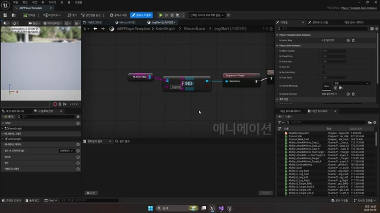

# 260409 01 애니메이션 템플릿과 PlayerAnimInstance

[260409 허브](../) | [다음: 02 충돌 채널과 Sweep](../02_intermediate_collision_channels_profiles_and_sweep/)

## 문서 개요

전투 결과를 붙이기 전에 먼저 필요한 것은 공용 애니메이션 구조다.
`260409`의 첫 강의는 캐릭터별 애님 그래프를 복제하는 대신, `PlayerAnimInstance`와 `PlayerTemplateAnimInstance`로 공용 전투 입력과 공용 애님 상태를 정리하는 데 집중한다.

## 1. 왜 템플릿이 필요한가

`Shinbi`와 `Wraith`는 외형과 공격 방식은 다르지만, 이동, 점프, 공격 몽타주, 스킬 호출 같은 큰 흐름은 거의 같다.
그래서 이 날짜는 "캐릭터마다 그래프를 새로 짠다"보다 `공용 그래프와 공용 상태 계산을 먼저 만든다`는 쪽으로 방향을 잡는다.

즉 재사용의 대상은 애님 자산 전체가 아니라 `애님 그래프의 규칙과 뼈대`다.

## 2. `UPlayerAnimInstance`는 공용 상태를 모은다

현재 프로젝트에서 `UPlayerAnimInstance`는 이동 속도, 공중 여부, 가속 여부, `YawDelta`, 공격 몽타주, 콤보 상태를 들고 있다.
이 값들이 공용으로 정리돼 있어야 캐릭터가 달라져도 같은 로코모션과 같은 공격 규칙을 유지할 수 있다.

```cpp
UPROPERTY(VisibleAnywhere, BlueprintReadOnly)
float mMoveSpeed;

UPROPERTY(VisibleAnywhere, BlueprintReadOnly)
bool mIsInAir;

UPROPERTY(EditAnywhere, BlueprintReadOnly)
TObjectPtr<UAnimMontage> mAttackMontage;

UPROPERTY(EditAnywhere, BlueprintReadOnly)
TArray<FName> mAttackSection;
```

## 3. `UPlayerTemplateAnimInstance`는 공용 구조와 개별 자산을 분리한다

템플릿 인스턴스는 공용 그래프 위에 `TMap` 형태의 자산 사전을 얹는다.
그래서 부모 그래프는 그대로 유지한 채, 캐릭터별 차이는 시퀀스와 블렌드 스페이스 매핑으로만 남길 수 있다.

```cpp
UPROPERTY(EditAnywhere, BlueprintReadOnly)
TMap<FString, TObjectPtr<UAnimSequence>> mAnimMap;

UPROPERTY(EditAnywhere, BlueprintReadOnly)
TMap<FString, TObjectPtr<UBlendSpace>> mBlendSpaceMap;
```





## 4. 공격 타이밍은 애님이, 실제 로직은 코드가 맡는다

이 구조가 중요한 이유는, 템플릿이 단순 이동 그래프만 공용화하는 게 아니기 때문이다.
`UPlayerAnimInstance`는 몽타주와 콤보 상태를 관리하고, `UAnimNotify_PlayerAttack`는 실제 공격 함수를 정확한 타격 프레임에 다시 호출한다.

즉 `260409`부터는 `애님 그래프 -> 노티파이 -> 실제 판정` 흐름이 전투 파이프라인의 진짜 출발점이 된다.

## 5. 현재 branch 추적 메모

강의 당시 설명은 `APlayerCharacter` 기준으로 읽히지만, 지금 branch의 `UPlayerAnimInstance::NativeUpdateAnimation()`, `UPlayerTemplateAnimInstance::AnimNotify_SkillCasting()`, `UAnimNotify_PlayerAttack::Notify()`는 모두 `APlayerCharacterGAS` 계열을 기준으로 캐스팅한다.
반면 `AShinbi`, `AWraith` 같은 legacy 예제도 여전히 남아 있어서, 이 날짜 문서는 `구조는 유지되고 소유자 계층만 GAS 라인으로 이동 중`인 상태로 읽는 편이 정확하다.

## 정리

이 편의 핵심은 `전투 애니메이션의 공용 뼈대를 먼저 만든다`는 점이다.
다음 편부터 붙는 충돌 판정, 데미지, 피드백은 모두 이 공용 시간축 위에서 돌아간다.

[260409 허브](../) | [다음: 02 충돌 채널과 Sweep](../02_intermediate_collision_channels_profiles_and_sweep/)
