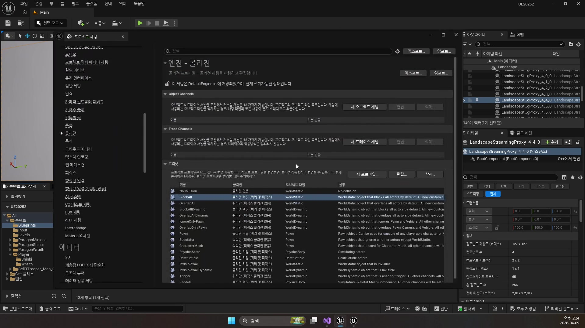
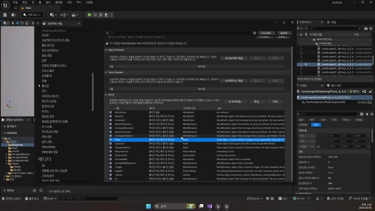
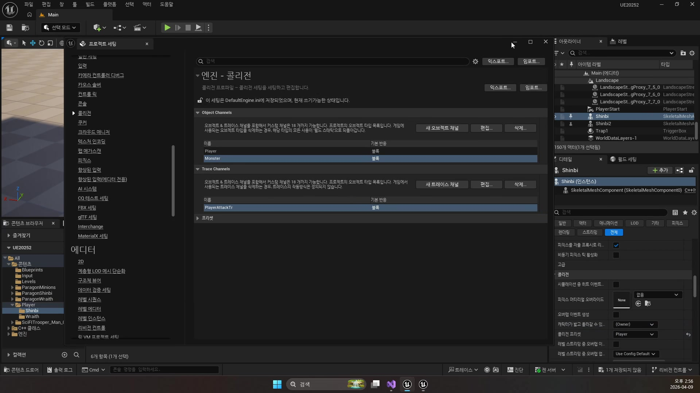
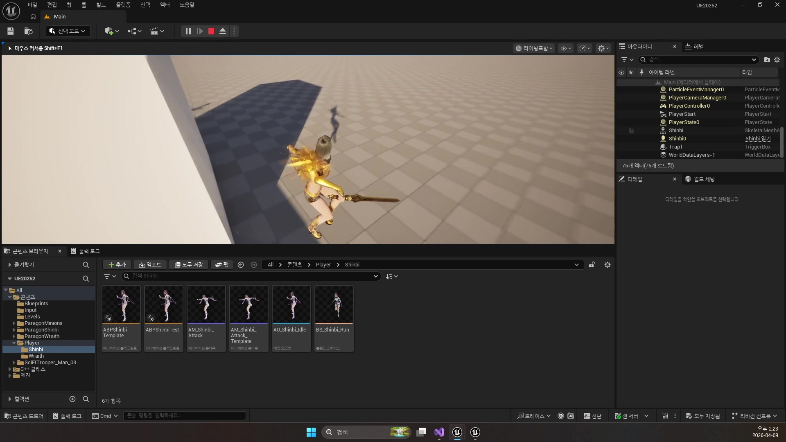
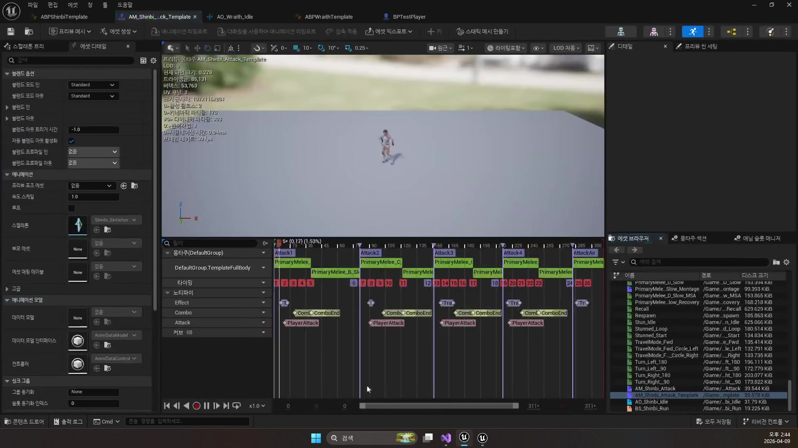
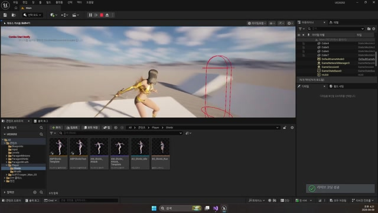

# 260409 02 충돌 채널, 프로파일, Sweep 판정

[이전: 01 애니메이션 템플릿](../01_intermediate_animation_template_and_player_animinstance/) | [260409 허브](../) | [다음: 03 데미지와 투사체](../03_intermediate_damage_effects_and_projectiles/)

## 문서 개요

`260409`의 두 번째 축은 충돌 시스템이다.
이번 날짜는 충돌을 액터 하나하나의 옵션이 아니라 `프로젝트 전체의 판정 규칙`으로 끌어올린다.

## 1. 충돌은 프로젝트 규칙이다

언리얼의 충돌은 충돌체 하나 붙이는 기능이 아니라, `채널`, `프로파일`, `응답`, `트레이스`를 프로젝트 단위로 설계하는 체계다.
그래서 강의도 개별 액터 설정 전에 `Project Settings -> Engine -> Collision`부터 다시 잡는다.





## 2. 오브젝트 채널과 트레이스 채널을 분리해서 본다

- `오브젝트 채널`: 이 충돌체가 무엇인가
- `트레이스 채널`: 지금 어떤 기준으로 검사하는가

이 둘을 섞어 생각하면 "누가 누구를 막고, 누가 누구를 맞추는가"가 금방 흐려진다.
그래서 이번 날짜는 `Player`, `Monster`, `PlayerAttack` 같은 충돌 성격과, 실제 판정을 날릴 때 쓰는 `GameTraceChannel`을 따로 설계한다.

## 3. 프로파일은 액터 설정을 줄여 주는 규칙 묶음이다

프로파일을 먼저 만들어 두면 매 액터마다 응답 테이블을 손으로 맞추지 않아도 된다.
현재 코드도 이 규칙을 그대로 따른다.

```cpp
GetCapsuleComponent()->SetCollisionProfileName(TEXT("Player"));
mBody->SetCollisionProfileName(TEXT("Monster"));
mBody->SetCollisionProfileName(TEXT("PlayerAttack"));
```

즉 플레이어 본체, 몬스터 본체, 플레이어 탄환은 시작부터 서로 다른 충돌 성격을 부여받는다.



## 4. 근접 공격은 상시 충돌체보다 Sweep 쿼리가 더 잘 맞는다

현재 `Shinbi`의 근접 공격은 몸에 큰 충돌체를 계속 켜 두는 방식이 아니라, 공격 프레임에만 캡슐 Sweep을 날리는 방식이다.

```cpp
bool Collision = GetWorld()->SweepMultiByChannel(
    HitArray,
    StartLoc,
    EndLoc,
    CapsuleRot,
    ECollisionChannel::ECC_GameTraceChannel3,
    FCollisionShape::MakeCapsule(35.f, 100.f),
    param);
```

이 방식의 장점은 분명하다.

- 공격 프레임에만 판정을 계산한다.
- 캡슐, 구체 같은 원하는 모양을 고를 수 있다.
- 트레이스 채널로 맞아야 할 대상만 골라낼 수 있다.







## 5. 노티파이와 판정 타이밍을 맞춰야 체감이 자연스럽다

입력 시점에 바로 Sweep을 날리면 애니메이션과 판정이 어긋난다.
반대로 노티파이가 찍힌 프레임에 Sweep을 실행하면 `칼날이 닿는 순간`과 `판정이 발생하는 순간`이 자연스럽게 겹친다.

즉 충돌 강의는 단순히 `채널 만들기`가 아니라, `애니메이션 시간축과 판정 규칙을 연결하는 법`까지 함께 배우는 파트다.

## 정리

이 편의 핵심은 `충돌을 프로젝트 규칙으로 설계하고, 실제 공격 프레임에는 쿼리 기반 판정을 사용한다`는 점이다.
다음 편에서는 이 판정 결과가 `TakeDamage`, 파티클, 사운드, 투사체와 어떻게 연결되는지 본다.

[이전: 01 애니메이션 템플릿](../01_intermediate_animation_template_and_player_animinstance/) | [260409 허브](../) | [다음: 03 데미지와 투사체](../03_intermediate_damage_effects_and_projectiles/)
