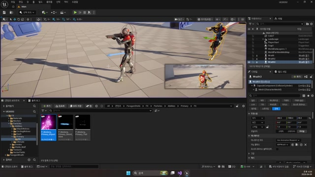

# 260409 03 데미지, 이펙트, 사운드, 투사체

[이전: 02 충돌과 Sweep](../02_intermediate_collision_channels_profiles_and_sweep/) | [260409 허브](../) | [다음: 04 공식 문서](../04_appendix_official_docs_reference/)

## 문서 개요

이 편은 `260409`의 핵심 결론이다.
공격 판정이 끝났다면, 이제 맞은 액터에게 피해를 주고, 그 사실을 파티클과 사운드, 데칼, 투사체로 감각적으로 완성해야 한다.

## 1. 데미지는 언리얼의 공통 루트 `TakeDamage()`로 받는다

이번 날짜는 자체 데미지 시스템을 새로 만들기보다, 언리얼 액터 계층이 이미 제공하는 `TakeDamage()` 루트를 따라간다.
공격하는 쪽은 `TakeDamage()`를 호출하고, 실제 피해 해석은 맞은 쪽 클래스가 담당한다.


## 2. `AShinbi::NormalAttack()`은 근접 전투 파이프라인의 표본이다

`Shinbi`의 `NormalAttack()`에는 이번 날짜의 핵심이 거의 전부 들어 있다.

1. 캡슐 Sweep으로 맞은 대상을 모은다.
2. 각 대상에게 `TakeDamage()`를 호출한다.
3. 충돌 지점에 사운드를 재생한다.
4. 같은 지점에 히트 파티클을 재생한다.

```cpp
for (auto Hit : HitArray)
{
    float Attack = GetPlayerState<AMainPlayerState>()->GetAttack();

    FDamageEvent DmgEvent;
    Hit.GetActor()->TakeDamage(Attack, DmgEvent, GetController(), this);

    UGameplayStatics::SpawnSoundAtLocation(GetWorld(), Sound, Hit.ImpactPoint);
    UGameplayStatics::SpawnEmitterAtLocation(GetWorld(), Particle, Hit.ImpactPoint);
}
```


즉 근접 전투는 단순히 HP를 깎는 일이 아니라, `판정 + 피해 + 피드백`이 한 덩어리로 묶인 구조다.

## 3. 몬스터 쪽 `TakeDamage()`가 실제 전투 결과를 완성한다

맞은 쪽에서는 `AMonsterBase::TakeDamage()`가 방어력을 빼고, HP를 줄이고, 죽음 애님과 AI 중지까지 연결한다.
그래서 플레이어 공격 쪽에서 볼 때 `TakeDamage()` 호출은 끝이 아니라, 상대 액터 내부의 후속 로직을 여는 입구에 가깝다.

즉 `260409`는 나중의 `260420` 사망 처리와도 자연스럽게 이어지는 날이다.

## 4. `Wraith`는 원거리 판정을 투사체에 위임한다

`AWraith::NormalAttack()`은 직접 Sweep을 하지 않고 `AWraithBullet`을 스폰한다.
즉 원거리 전투는 `공격 프레임에 바로 피해를 준다`가 아니라 `탄환 액터를 생성하고 판정을 위임한다`는 방향으로 읽으면 된다.

```cpp
TObjectPtr<AWraithBullet> Bullet = GetWorld()->SpawnActor<AWraithBullet>(
    MuzzleLoc, GetActorRotation(), param);

Bullet->SetAttack(GetPlayerState<AMainPlayerState>()->GetAttack());
Bullet->SetOwnerController(GetController());
```


## 5. 현재 `AWraithBullet`은 이미 데미지와 피드백을 같이 처리한다

현재 branch 기준으로 `AWraithBullet::BulletHit()`은 히트 시 아래 순서를 직접 수행한다.

1. 자신을 제거한다.
2. `OtherActor->TakeDamage(...)`를 호출한다.
3. 히트 파티클을 재생한다.
4. 히트 사운드를 재생한다.
5. 히트 데칼을 남긴다.

```cpp
Destroy();

FDamageEvent DmgEvent;
OtherActor->TakeDamage(mAttack, DmgEvent, mOwnerController, this);

UGameplayStatics::SpawnEmitterAtLocation(GetWorld(), mHitParticle, Hit.ImpactPoint);
UGameplayStatics::SpawnSoundAtLocation(GetWorld(), mHitSound, Hit.ImpactPoint);
UGameplayStatics::SpawnDecalAtLocation(
    GetWorld(), mHitDecal, FVector(20.0, 20.0, 10.0),
    Hit.ImpactPoint, (-Hit.ImpactNormal).Rotation(), 5.f);
```

즉 예전 초안처럼 "원거리 탄환은 아직 시각 효과만 있다"고 보기엔 현재 구현이 더 진행돼 있다.
지금은 탄환 하나가 데미지와 피드백을 함께 마무리하는 구조에 가깝다.




## 6. `ProjectileBase`는 공통 틀이고, 구체 로직은 파생 탄환이 채운다

`AProjectileBase`는 `UBoxComponent`, `UProjectileMovementComponent`, `OnProjectileStop` 등록까지를 공통으로 제공한다.
하지만 `ProjectileStop()`은 비어 있으므로, 실제 히트 결과는 `AWraithBullet` 같은 파생 클래스가 채운다.

즉 현재 구조는 `움직이는 탄환 틀`과 `탄환별 피드백/데미지 로직`을 분리하는 방향이라고 볼 수 있다.

## 정리

이 편의 핵심은 `공격 판정이 끝난 뒤, 실제 전투 결과를 감각적으로 완성하는 법`이다.
근접은 Sweep 결과에 `TakeDamage`와 히트 피드백을 묶고, 원거리는 투사체 액터가 그 역할을 대신 맡는다.

[이전: 02 충돌과 Sweep](../02_intermediate_collision_channels_profiles_and_sweep/) | [260409 허브](../) | [다음: 04 공식 문서](../04_appendix_official_docs_reference/)
