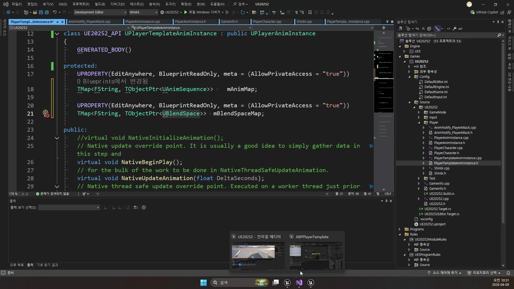
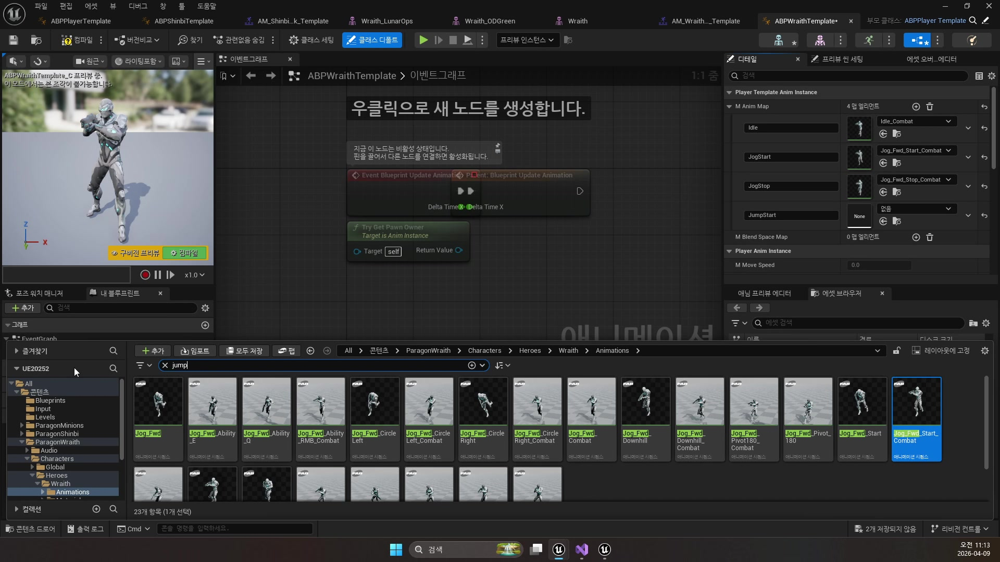
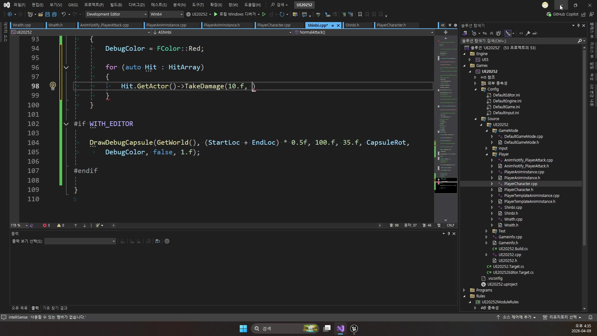
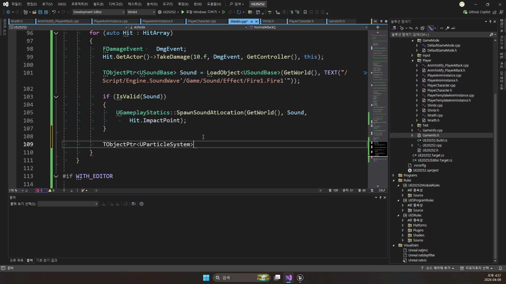
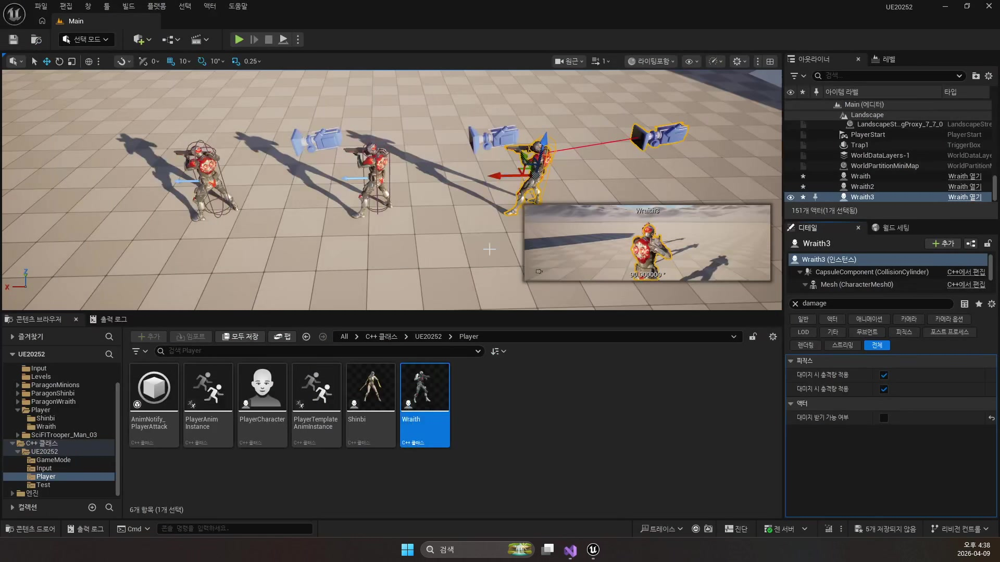
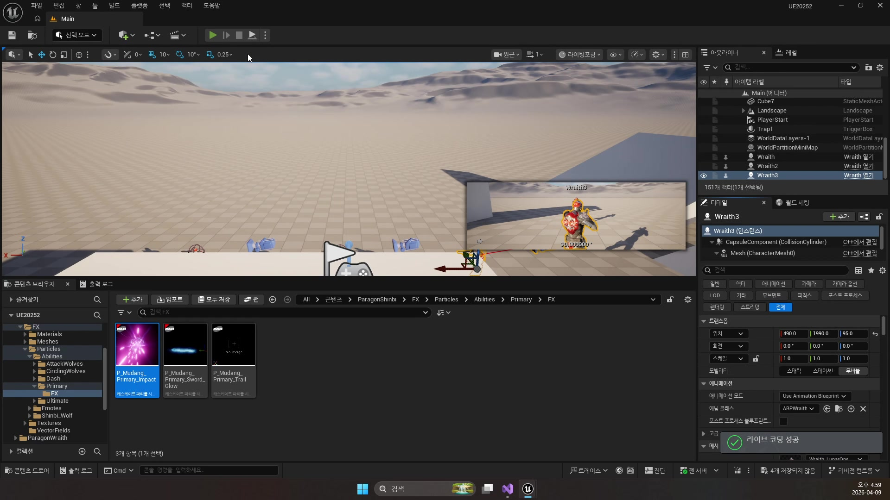

# 260409 공격 판정, 데미지, 이펙트, 사운드, 투사체를 묶어 플레이어 전투를 완성하는 기초

## 문서 개요

이 문서는 `260409_1`부터 `260409_3`까지의 강의를 하나의 연속된 교재로 다시 정리한 것이다.
이번 날짜의 핵심은 "플레이어가 공격한다"는 문장을 실제 언리얼 시스템으로 풀어내는 데 있다.

강의 흐름을 한 줄로 요약하면 다음과 같다.

`공용 애님 템플릿 -> 충돌 채널 / 프로파일 -> Sweep / TakeDamage -> 파티클 / 사운드 / 탄환`

즉 애니메이션, 충돌, 데미지, 이펙트가 별개의 기능으로 흩어져 있는 것이 아니라, 하나의 전투 파이프라인으로 연결된다는 점을 보여 주는 날이다.
애님 템플릿이 입력과 몽타주 재생을 정리하고, 충돌 시스템이 판정 규칙을 제공하며, 데미지 함수와 이펙트 시스템이 맞았을 때의 결과를 완성한다.

이 교재는 아래 네 자료를 함께 대조해 작성했다.

- `D:\UE_Academy_Stduy_compressed`의 원본 영상과 자막
- 원본 영상에서 다시 추출한 대표 장면 캡처
- `D:\UnrealProjects\UE_Academy_Stduy\Source\UE20252`의 실제 C++ 소스
- `D:\UnrealProjects\UE_Academy_Stduy\Saved\AcademyUtility`의 블루프린트 / 애셋 / 소스 덤프

## 학습 목표

- `UPlayerTemplateAnimInstance`가 왜 공용 베이스로 필요한지 설명할 수 있다.
- 충돌 `채널`, `프로파일`, `응답`, `Sweep`의 차이를 구분할 수 있다.
- `AnimNotify -> NormalAttack -> SweepMultiByChannel -> TakeDamage` 흐름을 말할 수 있다.
- `SpawnSoundAtLocation`, `SpawnEmitterAtLocation`, `SpawnDecalAtLocation`, `OnComponentHit`, `OnProjectileStop`가 각각 어느 층에서 쓰이는지 설명할 수 있다.
- `UAnimNotify_PlayerAttack`, `AShinbi::NormalAttack()`, `AMonsterBase::TakeDamage()`, `AWraithBullet::BulletHit()`가 현재 프로젝트 전투 파이프라인에서 각각 무엇을 맡는지 설명할 수 있다.

## 강의 흐름 요약

1. 플레이어 공용 애님 로직을 템플릿 인스턴스로 올리고, 캐릭터별 차이는 에셋 매핑으로 남긴다.
2. 프로젝트 전체 충돌 규칙을 `Project Settings -> Collision` 기준으로 다시 설계한다.
3. 공격 노티파이에서 실제 판정 함수를 호출하고, 데미지 시스템과 연결한다.
4. 마지막으로 사운드, 파티클, 데칼, 투사체를 붙여 타격 피드백을 완성한다.

---

## 제1장. 애니메이션 템플릿: 공용 플레이어 전투 입력 만들기

### 1.1 왜 캐릭터별 애님 그래프를 그대로 두면 안 되는가

첫 강의의 핵심은 "플레이어 캐릭터가 여러 명이어도 전투 구조는 비슷하다"는 판단이다.
Shinbi와 Wraith는 외형과 스킬은 다르지만, 이동, 점프, 공격, 스킬 같은 기본 루프는 거의 같다.
그래서 강의는 캐릭터마다 애님 로직을 복제하지 않고, 공용 템플릿을 먼저 만든다.

자막에서도 반복해서 강조하는 지점이 바로 이것이다.
템플릿은 모든 애셋을 공용으로 만들겠다는 뜻이 아니라, 그래프 구조와 상태 계산 로직을 공유하겠다는 뜻이다.
즉 재사용의 대상은 "애님 그래프의 뼈대"다.

### 1.2 PlayerAnimInstance가 공통 상태를 모으는 방식

실제 프로젝트에서 공용 애님 상태 계산은 `UPlayerAnimInstance`에 들어 있다.
이 클래스는 플레이어의 이동 속도, 공중 여부, 가속 여부, 회전 변화량을 매 프레임 계산해 애님 블루프린트가 읽을 수 있게 만든다.

```cpp
TObjectPtr<APlayerCharacter> PlayerChar = Cast<APlayerCharacter>(TryGetPawnOwner());

if (IsValid(PlayerChar))
{
    UCharacterMovementComponent* Movement = PlayerChar->GetCharacterMovement();

    mMoveSpeed = Movement->Velocity.Length();
    mIsInAir = Movement->IsFalling();
    mAccelerating = Movement->GetCurrentAcceleration().Length() > 0.f;

    FRotator CurrentRot = PlayerChar->GetActorRotation();
    FRotator DeltaRot = UKismetMathLibrary::NormalizedDeltaRotator(CurrentRot, mPrevRotator);
    float DeltaYaw = DeltaRot.Yaw / DeltaSeconds / 7.f;
    mYawDelta = FMath::FInterpTo(mYawDelta, DeltaYaw, DeltaSeconds, 6.f);
    mPrevRotator = CurrentRot;
}
```

이 코드는 단순한 상태 수집처럼 보이지만, 사실상 "애님 그래프가 물어볼 공용 인터페이스"를 만드는 단계다.
이 값들이 공통으로 정리돼 있어야 캐릭터마다 그래프를 다시 짜지 않고도 같은 Locomotion 구조를 유지할 수 있다.



### 1.3 PlayerTemplateAnimInstance는 공용 구조와 개별 에셋을 분리한다

`UPlayerTemplateAnimInstance`는 `UPlayerAnimInstance`를 상속하면서, 캐릭터별 에셋 차이를 `TMap`으로 분리한다.

```cpp
UCLASS()
class UE20252_API UPlayerTemplateAnimInstance : public UPlayerAnimInstance
{
    GENERATED_BODY()

protected:
    UPROPERTY(EditAnywhere, BlueprintReadOnly)
    TMap<FString, TObjectPtr<UAnimSequence>> mAnimMap;

    UPROPERTY(EditAnywhere, BlueprintReadOnly)
    TMap<FString, TObjectPtr<UBlendSpace>> mBlendSpaceMap;
};
```

이 설계가 좋은 이유는 템플릿이 요구하는 이름만 맞으면, Shinbi든 Wraith든 다른 애님 자산을 꽂아 넣을 수 있기 때문이다.
즉 구조는 공용, 재생 대상은 개별 에셋이라는 분리가 성립한다.

현재 덤프 기준으로도 이 구조는 분명하다.
`ABPPlayerTemplate`는 `TemplateFullBody` 슬롯을 공용 전투 진입점으로 들고 있고, `ABPShinbiTemplate`, `ABPWraithTemplate`는 그 위에 각자 다른 몽타주와 애님 자산을 매핑한다.
즉 `260409`의 전투 파이프라인은 캐릭터별 블루프린트가 따로 노는 구조가 아니라, 이미 템플릿 블루프린트 위에서 공용화된 상태라고 볼 수 있다.



### 1.4 몽타주와 노티파이는 "공격 시점"을 코드에 넘겨 준다

이 강의에서 중요한 점은 애님 템플릿이 단순히 이동 그래프만 재사용하는 것이 아니라, 전투 입력도 코드와 정확히 연결한다는 데 있다.
`UPlayerAnimInstance`는 몽타주 재생, 콤보 섹션 이동, 종료 시점 정리를 맡고, 노티파이는 실제 판정 호출 타이밍을 만든다.

```cpp
void UAnimNotify_PlayerAttack::Notify(USkeletalMeshComponent* MeshComp,
    UAnimSequenceBase* Animation, const FAnimNotifyEventReference& EventReference)
{
    Super::Notify(MeshComp, Animation, EventReference);

    TObjectPtr<APlayerCharacter> PlayerChar = MeshComp->GetOwner<APlayerCharacter>();

    if (IsValid(PlayerChar))
    {
        PlayerChar->NormalAttack();
    }
}
```

이제 공격 버튼을 눌렀을 때의 의미는 단순히 몽타주를 재생하는 것에서 끝나지 않는다.
애님 안의 정확한 타격 프레임에서 `NormalAttack()`이 호출되고, 그 다음 장에서 다룰 충돌 판정과 데미지 처리가 연결된다.

### 1.5 장 정리

제1장의 결론은 분명하다.
전투 애니메이션을 잘 정리하려면 캐릭터별 블루프린트를 복제하는 대신, 공용 상태 계산과 공용 몽타주 흐름을 먼저 추상화해야 한다.
`260409`의 전반부는 그 바닥을 `PlayerAnimInstance`와 `PlayerTemplateAnimInstance`로 깔고 있다.

---

## 제2장. 충돌 시스템: 판정을 프로젝트 규칙으로 끌어올리기

### 2.1 충돌은 액터별 설정이 아니라 프로젝트 규칙이다

두 번째 강의는 언리얼 충돌 시스템을 처음부터 다시 정리한다.
자막에서도 계속 나오듯, 언리얼 충돌은 단순히 충돌체 하나 붙여 두는 수준이 아니라 `채널`, `프로파일`, `응답`을 프로젝트 단위로 설계하는 체계다.

그래서 강의는 개별 액터보다 먼저 `Project Settings -> Engine -> Collision`으로 들어간다.
여기서 오브젝트 채널, 트레이스 채널, 기본 프리셋과 커스텀 프로파일을 함께 설계해야 이후 코드가 단순해진다.


### 2.2 오브젝트 채널과 트레이스 채널의 차이

강의가 특히 강조하는 부분은 오브젝트 채널과 트레이스 채널을 섞어 생각하지 말라는 점이다.

- `오브젝트 채널`: 이 충돌체가 무엇인가
- `트레이스 채널`: 내가 지금 어떤 기준으로 검사하는가

예를 들어 플레이어 몸체, 몬스터 몸체, 공격 판정은 오브젝트 성격이 다르고, 카메라 가림 체크나 공격 Sweep은 또 다른 질의다.
이 둘을 분리해 생각해야 "누구를 막고, 누구를 무시하고, 누구를 맞출 것인가"를 설계할 수 있다.

### 2.3 프로파일은 액터 설정을 줄여 주는 규칙 묶음이다

자막 후반부에는 커스텀 채널과 함께 프로파일을 같이 설계해야 한다는 설명이 나온다.
이 말은 중요하다.
채널만 만들고 액터마다 응답을 개별로 손대면 결국 프로젝트가 금방 지저분해진다.

그래서 `Player`, `Monster`, `PlayerAttack` 같은 프로파일을 준비해 두면, 캐릭터 쪽 코드는 훨씬 읽기 쉬워진다.
실제 소스에서도 이 이름들이 그대로 등장한다.

```cpp
GetCapsuleComponent()->SetCollisionProfileName(TEXT("Player"));
...
mBody->SetCollisionProfileName(TEXT("PlayerAttack"));
```

여기에 현재 프로젝트는 몬스터 본체에 `Monster` 프로파일을 쓰고, 근접 공격 판정은 별도 충돌체를 계속 켜 두는 대신 `ECC_GameTraceChannel3`으로 직접 Sweep 쿼리를 날린다.
즉 프로파일은 "무엇인가"를 정리하고, 트레이스 채널은 "무엇을 검사할 것인가"를 분리하는 방식이 실제 코드에도 그대로 남아 있다.


### 2.4 공격 판정은 상시 충돌체보다 쿼리 기반 Sweep이 더 낫다

강의의 실전 포인트는 여기서 나온다.
항상 큰 충돌체를 몸에 붙여 두는 방식보다, 실제 공격 순간에만 `Overlap`이나 `Sweep` 계열 쿼리를 호출하는 편이 훨씬 제어하기 쉽다.
이번 프로젝트는 특히 `Shinbi`의 `캡슐 Sweep`을 근접 판정의 기준 예제로 삼고 있다.

```cpp
bool Collision = GetWorld()->SweepMultiByChannel(
    HitArray,
    StartLoc,
    EndLoc,
    CapsuleRot,
    ECollisionChannel::ECC_GameTraceChannel3,
    FCollisionShape::MakeCapsule(35.f, 100.f),
    param);
```

이 설계의 장점은 명확하다.

- 공격 프레임에만 판정을 계산한다.
- 캡슐이나 구체 같은 원하는 도형을 쓸 수 있다.
- 커스텀 트레이스 채널을 이용해 맞춰야 할 대상만 골라낼 수 있다.

반대로 원거리 공격은 같은 방식으로 항상 `Sweep`을 직접 호출하지 않는다.
현재 `Wraith`는 `NormalAttack()`에서 `AWraithBullet`을 스폰하고, 실제 충돌 결과는 탄환의 `OnComponentHit` 경로에서 처리한다.
즉 `260409`는 "근접은 쿼리 기반, 원거리는 투사체 기반"이라는 두 판정 방식을 나란히 배우는 날로 읽는 편이 더 정확하다.


### 2.5 애님 타임라인과 판정 시점을 맞추는 이유

충돌 강의 중간에는 애님 시퀀스나 타임라인에서 공격 타격 지점을 맞추는 장면도 나온다.
이 장면은 제1장과 제2장을 잇는 핵심 연결점이다.

버튼 입력 시점에 바로 Sweep을 날리면 애니메이션과 체감 타격이 어긋난다.
반대로 노티파이를 써서 "칼날이 실제로 닿는 프레임"에 쿼리를 실행하면 판정과 연출이 자연스럽게 맞아떨어진다.


### 2.6 장 정리

제2장의 결론은, 충돌은 전투 기능의 하위 디테일이 아니라 전투 시스템의 규칙 언어라는 점이다.
채널과 프로파일을 설계하고, 노티파이 시점에 맞춰 Sweep을 호출해야 전투 판정이 안정적으로 작동한다.

---

## 제3장. 데미지, 파티클, 사운드, 투사체: 맞았다는 결과를 완성하기

### 3.1 언리얼은 이미 데미지 뼈대를 제공한다

세 번째 강의의 출발점은 `ApplyDamage`와 `TakeDamage`다.
직접 데미지 시스템을 처음부터 짜는 대신, 언리얼이 제공하는 액터 계층의 데미지 뼈대를 활용하는 흐름으로 들어간다.

현재 프로젝트 기준으로 보면 이 구조는 두 층으로 나뉜다.
`APlayerCharacter::TakeDamage()`는 우선 디버그 메시지 출력 중심의 기본 뼈대를 보여 주고, 실제로 전투 결과를 크게 반영하는 쪽은 `AMonsterBase::TakeDamage()`다.
Shinbi의 근접 공격은 Sweep으로 맞은 액터에게 `TakeDamage`를 직접 호출하고, 몬스터 쪽은 그 값을 받아 방어력을 뺀 뒤 HP를 감소시키고 죽음 상태까지 넘긴다.

```cpp
float APlayerCharacter::TakeDamage(float DamageAmount,
    const FDamageEvent& DamageEvent, AController* EventInstigator,
    AActor* DamageCauser)
{
    float Dmg = Super::TakeDamage(DamageAmount, DamageEvent, EventInstigator, DamageCauser);

    GEngine->AddOnScreenDebugMessage(-1, 10.f, FColor::Red,
        FString::Printf(TEXT("Dmg : %.5f"), Dmg));

    return Dmg;
}
```

이 코드를 보면 이번 강의의 방향이 잘 드러난다.
데미지는 "누가 언제 맞았는가"라는 게임 로직이고, 출력 메시지는 현재 파이프라인이 정상 동작하는지 확인하는 첫 번째 디버깅 수단이다.
그리고 현재 저장소에서는 이 흐름이 이미 `MonsterBase::TakeDamage()`까지 이어져 있어, 단순 출력에서 끝나지 않고 `방어력 보정 -> HP 감소 -> Death 애님 전환 -> AI 중지`로 확장돼 있다.



### 3.2 Shinbi 근접 공격은 Sweep 결과에 이펙트를 덧붙인다

Shinbi의 `NormalAttack()`은 이번 날짜 강의 전체를 가장 잘 보여 주는 예제다.
이 함수 안에는 전투 파이프라인의 핵심 요소가 모두 들어 있다.

1. 캡슐 Sweep으로 히트 후보를 찾는다.
2. 맞은 액터에 `TakeDamage`를 호출한다.
3. 충돌 지점에 사운드를 재생한다.
4. 같은 지점에 파티클을 재생한다.

```cpp
for (auto Hit : HitArray)
{
    FDamageEvent DmgEvent;
    Hit.GetActor()->TakeDamage(200.f, DmgEvent, GetController(), this);

    TObjectPtr<USoundBase> Sound = LoadObject<USoundBase>(
        GetWorld(), TEXT("/Script/Engine.SoundWave'/Game/Sound/Effect/Fire1.Fire1'"));

    if (IsValid(Sound))
    {
        UGameplayStatics::SpawnSoundAtLocation(GetWorld(), Sound, Hit.ImpactPoint);
    }

    TObjectPtr<UParticleSystem> Particle = LoadObject<UParticleSystem>(
        GetWorld(), TEXT("/Script/Engine.ParticleSystem'/Game/ParagonShinbi/FX/Particles/Abilities/Primary/FX/P_Mudang_Primary_Impact.P_Mudang_Primary_Impact'"));

    if (IsValid(Particle))
    {
        UGameplayStatics::SpawnEmitterAtLocation(GetWorld(), Particle, Hit.ImpactPoint);
    }
}
```



현재 코드 기준으로 이 함수는 `데미지 200`, `캡슐 길이`, `캡슐 반지름`, `사운드`, `히트 파티클`이 모두 함수 안에 직접 적혀 있는 형태다.
즉 아직 데이터 테이블 기반으로 완전히 일반화된 구조는 아니지만, 학습용으로는 "공격 타이밍에 판정과 피드백을 어떻게 묶는가"를 가장 선명하게 보여 준다.

이 함수가 좋은 이유는, 공격 로직이 단순히 HP를 깎는 것으로 끝나지 않고 "맞았다는 감각"까지 한곳에서 완성되기 때문이다.

### 3.3 Wraith는 근접 판정 대신 투사체 기반 공격으로 확장한다

강의 후반은 같은 전투 파이프라인을 원거리 캐릭터로 확장하는 방식으로 읽을 수 있다.
Wraith는 직접 Sweep을 하지 않고, 총알 액터를 발사한다.

```cpp
void AWraith::NormalAttack()
{
    FVector MuzzleLoc = GetMesh()->GetSocketLocation(TEXT("Muzzle_01"));

    FActorSpawnParameters param;
    param.SpawnCollisionHandlingOverride = ESpawnActorCollisionHandlingMethod::AlwaysSpawn;

    GetWorld()->SpawnActor<AWraithBullet>(MuzzleLoc, GetActorRotation(), param);
}
```

즉 "공격 즉시 판정"을 하던 근접형 구조가 "공격 시 탄환을 만들어 판정을 위임"하는 원거리 구조로 바뀐다.
다만 현재 저장소 기준으로는 여기서 한 가지를 분리해서 봐야 한다.
`AWraith::NormalAttack()`은 탄환 생성까지는 완성되어 있지만, `AWraithBullet` 자체는 아직 `ApplyDamage`나 `TakeDamage` 호출을 직접 수행하지 않고 히트 이펙트 중심으로 구성돼 있다.

이 점에서 지금 C++ 구현은 "원거리 전투 파이프라인의 시각적 절반"에 더 가깝다.
반대로 초반 블루프린트 프로토타입인 `BPBullet` 덤프를 보면 `OnProjectileStop -> Break Hit Result -> ApplyDamage -> Destroy Actor` 흐름이 분명하게 존재한다.
즉 교재 입장에서는 "투사체도 데미지 파이프라인으로 연결된다"는 원리를 설명하되, 현재 C++ 저장소는 그중 시각 효과 쪽이 먼저 완성된 상태라고 적어 두는 편이 정확하다.



### 3.4 ProjectileBase와 WraithBullet이 런타임 효과를 마무리한다

원거리 파트에서 기반 클래스 역할을 하는 것은 `AProjectileBase`다.
이 클래스는 `UBoxComponent`와 `UProjectileMovementComponent`를 기본으로 제공하고, 이동을 충돌체에 연결해 탄환처럼 동작하게 만든다.
다만 현재 구현에서 `AProjectileBase::ProjectileStop()`은 비어 있으므로, 공통 베이스는 아직 "움직이는 탄환 틀"에 가깝다.

그 위에서 `AWraithBullet`은 실제 시각 효과를 채운다.

- 비행 중 파티클 컴포넌트 `P_Wraith_Sniper_Projectile`
- 충돌 시 히트 파티클 `P_Wraith_Primary_HitCharacter`
- 충돌 시 사운드 `Fire1`
- 충돌 시 혈흔 데칼 `MI_sgeoahup`
- `PlayerAttack` 충돌 프로파일
- 중력 제거와 초기 속도 설정

```cpp
if (IsValid(mHitParticle))
{
    UGameplayStatics::SpawnEmitterAtLocation(GetWorld(), mHitParticle, Hit.ImpactPoint);
}

if (IsValid(mHitSound))
{
    UGameplayStatics::SpawnSoundAtLocation(GetWorld(), mHitSound, Hit.ImpactPoint);
}

if (IsValid(mHitDecal))
{
    UGameplayStatics::SpawnDecalAtLocation(
        GetWorld(), mHitDecal, FVector(20.0, 20.0, 10.0),
        Hit.ImpactPoint, (-Hit.ImpactNormal).Rotation(), 5.f);
}
```



여기서 흥미로운 점은 초기 블루프린트 `BPBullet`이 `ProjectileMovement.OnProjectileStop`을 이용해 `ApplyDamage`까지 처리한 반면, 현재 C++ `AWraithBullet`은 `mBody->OnComponentHit`를 이용해 이펙트와 데칼을 마무리한다는 점이다.
즉 프로젝트는 "블루프린트에서 전체 파이프라인을 한 번 경험한 뒤, C++에서는 공통 탄환 구조와 시각 효과를 먼저 분리하는 방향"으로 발전한 셈이다.

이번 장에서 중요한 점은 이펙트가 "나중에 붙이는 장식"이 아니라는 것이다.
전투 체감은 대부분 히트 확인, 소리, 잔상, 데칼 같은 결과 표현에서 완성된다.
그래서 강의 제목이 `파티클과 사운드`지만, 실제로는 전투 파이프라인의 마지막 단계를 배우는 시간에 가깝다.

### 3.5 장 정리

제3장은 전투 결과를 플레이어가 인지할 수 있는 형태로 완성하는 단계다.
데미지는 시스템적 결과이고, 사운드와 파티클은 감각적 결과이며, 투사체와 데칼은 전투 표현을 공간 안에 남기는 수단이다.

---

## 제4장. 현재 프로젝트 C++ 코드로 다시 읽는 260409 핵심 구조

### 4.1 왜 260409은 "공격 기능 모음"이 아니라 하나의 파이프라인으로 읽어야 하는가

`260409`는 초보자 눈에는 기능이 여러 개 섞여 있는 날처럼 보이기 쉽다.
애니메이션도 나오고, 충돌도 나오고, 데미지도 나오고, 파티클과 사운드도 나온다.
하지만 현재 프로젝트 C++를 기준으로 보면 이 날짜의 핵심은 분명하다.

하나의 공격은 대략 다음 순서로 흘러간다.

1. 애님 노티파이가 정확한 타격 프레임에서 공격 함수를 호출한다.
2. 캐릭터별 `NormalAttack()`이 실제 판정을 수행한다.
3. 맞은 액터는 `TakeDamage()`로 결과를 받는다.
4. 그 순간 사운드, 파티클, 데칼, 탄환 같은 시각/청각 피드백이 붙는다.

즉 `260409`는 "기능 네 개를 배운다"가 아니라, `타격 시점 -> 판정 -> 피해 -> 피드백`이 어떻게 한 줄로 이어지는지 배우는 날이다.

아래 코드는 `D:\UnrealProjects\UE_Academy_Stduy\Source\UE20252`의 실제 구현에서 핵심만 추려 온 뒤, 초보자도 읽을 수 있게 설명용 주석을 붙인 축약판이다.

### 4.2 `UAnimNotify_PlayerAttack`: 애니메이션이 실제 공격 함수를 여는 첫 관문

현재 프로젝트에서 근접과 원거리 공격이 모두 같은 출발점을 갖는 지점이 있다.
바로 `UAnimNotify_PlayerAttack`이다.

```cpp
void UAnimNotify_PlayerAttack::Notify(USkeletalMeshComponent* MeshComp,
    UAnimSequenceBase* Animation, const FAnimNotifyEventReference& EventReference)
{
    Super::Notify(MeshComp, Animation, EventReference);

    // 이 애님을 재생 중인 주인을 플레이어 캐릭터로 얻어온다
    TObjectPtr<APlayerCharacter> PlayerChar =
        MeshComp->GetOwner<APlayerCharacter>();

    if (IsValid(PlayerChar))
    {
        // 정확히 이 프레임에서 실제 공격 함수를 호출한다
        PlayerChar->NormalAttack();
    }
}
```

이 코드는 짧지만 `260409` 전체를 이해하게 해 주는 핵심이다.

- 공격 버튼을 누르는 순간 바로 데미지를 주지 않는다.
- 먼저 몽타주가 재생된다.
- 애니메이션 타임라인에 박아 둔 노티파이가 찍히는 순간 `NormalAttack()`이 호출된다.

즉 전투 시스템의 출발점은 입력이 아니라 "애니메이션 안의 정확한 타격 프레임"이다.
그래서 플레이 감각이 훨씬 자연스러워진다.

또 중요한 점은 `NormalAttack()`이 `APlayerCharacter`의 가상 함수라는 것이다.
즉 타격 시점은 공통이지만, 실제 공격 내용은 캐릭터마다 다르게 구현할 수 있다.

### 4.3 `AShinbi::NormalAttack()`: 근접 전투는 Sweep으로 판정하고 바로 데미지와 피드백을 붙인다

근접 공격 파이프라인을 가장 선명하게 보여 주는 함수는 `AShinbi::NormalAttack()`이다.
이 함수 하나 안에 판정, 데미지, 사운드, 파티클, 디버그 시각화가 다 들어 있다.

```cpp
void AShinbi::NormalAttack()
{
    TArray<FHitResult> HitArray;

    // 캐릭터 앞쪽에 캡슐 Sweep을 날릴 시작/끝 지점
    FVector StartLoc = GetActorLocation() + GetActorForwardVector() * 100.f;
    FVector EndLoc = StartLoc + GetActorForwardVector() * 200.f;

    // 캡슐을 캐릭터 전방 방향에 맞게 회전시킨다
    FQuat CapsuleRot = FQuat::FindBetweenNormals(
        FVector::UpVector, GetActorForwardVector());

    // 자기 자신은 판정에서 제외하기 위한 쿼리 파라미터
    FCollisionQueryParams param(NAME_None, false, this);

    bool Collision = GetWorld()->SweepMultiByChannel(
        HitArray,
        StartLoc,
        EndLoc,
        CapsuleRot,
        ECollisionChannel::ECC_GameTraceChannel3,
        FCollisionShape::MakeCapsule(35.f, 100.f),
        param);

    if (Collision)
    {
        for (auto Hit : HitArray)
        {
            FDamageEvent DmgEvent;

            // 맞은 액터에게 데미지를 전달한다
            Hit.GetActor()->TakeDamage(200.f, DmgEvent, GetController(), this);

            TObjectPtr<USoundBase> Sound = LoadObject<USoundBase>(
                GetWorld(), TEXT("...Fire1.Fire1'"));

            // 맞은 위치에서 타격 사운드를 재생한다
            if (IsValid(Sound))
            {
                UGameplayStatics::SpawnSoundAtLocation(GetWorld(), Sound, Hit.ImpactPoint);
            }

            TObjectPtr<UParticleSystem> Particle = LoadObject<UParticleSystem>(
                GetWorld(), TEXT("...P_Mudang_Primary_Impact'"));

            // 맞은 위치에서 히트 파티클을 재생한다
            if (IsValid(Particle))
            {
                UGameplayStatics::SpawnEmitterAtLocation(GetWorld(), Particle, Hit.ImpactPoint);
            }
        }
    }
}
```

초보자용으로 이 함수를 한 줄씩 번역하면 이렇다.

- `StartLoc`, `EndLoc`: 공격 판정을 검사할 범위
- `MakeCapsule(35.f, 100.f)`: 칼날 대신 "캡슐 모양의 공격 범위"
- `ECC_GameTraceChannel3`: 공격 판정용으로 따로 정해 둔 트레이스 채널
- `TakeDamage(...)`: 맞은 상대에게 피해 결과 전달
- `SpawnSoundAtLocation`, `SpawnEmitterAtLocation`: 맞았다는 감각을 즉시 화면과 소리로 돌려주기

즉 현재 근접 전투의 실제 구조는 `무기를 몸에 항상 붙여 둔다`가 아니라, `필요한 프레임에만 쿼리를 날린다` 쪽이다.
그래서 제어가 쉽고, 공격 타이밍과 정확히 맞추기도 좋다.

### 4.4 `TakeDamage()`: 공격한 쪽이 아니라 맞은 쪽에서 전투 결과가 완성된다

공격하는 쪽이 판정을 끝냈다고 해서 전투가 끝난 것은 아니다.
실제 피해 결과는 맞은 액터가 `TakeDamage()`를 받으면서 완성된다.
현재 프로젝트는 이 구조를 두 층으로 보여 준다.

먼저 `APlayerCharacter::TakeDamage()`는 가장 기본적인 뼈대를 보여 준다.

```cpp
float APlayerCharacter::TakeDamage(float DamageAmount,
    const FDamageEvent& DamageEvent, AController* EventInstigator,
    AActor* DamageCauser)
{
    float Dmg = Super::TakeDamage(DamageAmount, DamageEvent, EventInstigator, DamageCauser);

    // 현재 들어온 데미지를 화면에 출력해 파이프라인을 확인한다
    GEngine->AddOnScreenDebugMessage(-1, 10.f, FColor::Red,
        FString::Printf(TEXT("Dmg : %.5f"), Dmg));

    return Dmg;
}
```

이건 말 그대로 "데미지 흐름이 연결됐는지 확인하는 최소 뼈대"에 가깝다.

반면 실제 몬스터 쪽은 훨씬 더 완성된 형태다.

```cpp
float AMonsterBase::TakeDamage(float DamageAmount, const FDamageEvent& DamageEvent,
    AController* EventInstigator, AActor* DamageCauser)
{
    float Dmg = Super::TakeDamage(DamageAmount, DamageEvent, EventInstigator, DamageCauser);

    // 방어력을 먼저 뺀다
    Dmg -= mDefense;

    if (Dmg < 1.f)
        Dmg = 1.f;

    // HP를 줄인다
    mHP -= Dmg;

    if (mHP <= 0.f)
    {
        mHP = 0.f;

        // 죽음 애님으로 바꾼다
        mAnimInst->SetAnim(EMonsterNormalAnim::Death);

        AMonsterController* MonsterController = GetController<AMonsterController>();

        if (IsValid(MonsterController))
        {
            // AI를 멈춘다
            MonsterController->BrainComponent->StopLogic(TEXT("Death"));
        }

        // 충돌과 이동도 끈다
        mBody->SetCollisionEnabled(ECollisionEnabled::NoCollision);
        mMovement->StopMovementImmediately();
        mMovement->Deactivate();
    }

    return Dmg;
}
```

이 코드를 보면 `260409`가 왜 중요한지 더 분명해진다.
공격자는 `TakeDamage()`를 호출할 뿐이고, 실제 결과 해석은 피해자 쪽 클래스가 한다.

즉 현재 몬스터 파이프라인은 이미 다음 단계까지 이어져 있다.

- 방어력 보정
- HP 감소
- 죽음 상태 전환
- AI 종료
- 충돌 비활성화
- 이동 정지

그래서 `260409`는 단순 타격 판정 강의가 아니라, 나중의 `260420` 사망 처리까지 이어질 전투 결과 뼈대를 만드는 날이기도 하다.

### 4.5 충돌 프로파일과 팀 ID: 누가 누구를 때릴 수 있는지 프로젝트 규칙으로 미리 정해 둔다

현재 프로젝트 C++를 보면 충돌과 팀도 즉흥적으로 처리하지 않는다.
생성자 단계에서 꽤 일찍 규칙을 깔아 둔다.

```cpp
APlayerCharacter::APlayerCharacter()
{
    GetCapsuleComponent()->SetCollisionProfileName(TEXT("Player"));
    SetGenericTeamId(FGenericTeamId(TeamPlayer));
}

AMonsterBase::AMonsterBase()
{
    mBody->SetCollisionProfileName(TEXT("Monster"));
    SetGenericTeamId(FGenericTeamId(TeamMonster));
}

AWraithBullet::AWraithBullet()
{
    mBody->SetCollisionProfileName(TEXT("PlayerAttack"));
}
```

이 구조를 초보자 눈높이로 해석하면 이렇다.

- `Player`: 플레이어 몸체로서의 기본 충돌 성격
- `Monster`: 몬스터 몸체로서의 기본 충돌 성격
- `PlayerAttack`: 플레이어가 만든 공격 오브젝트의 충돌 성격

즉 전투 판정은 `NormalAttack()` 함수 한 곳에서만 정해지지 않는다.
프로젝트 전체가 "이건 플레이어고, 이건 몬스터고, 이건 공격 오브젝트다"라고 먼저 말해 주고 있어야 코드가 단순해진다.

팀 ID도 마찬가지다.
지금 당장은 모든 데미지 필터가 여기에 완전히 붙어 있진 않지만, `GetTeamAttitudeTowards()` 구조가 이미 깔려 있기 때문에 나중에 아군/적군 판정을 더 안전하게 확장할 수 있다.

### 4.6 `AWraith::NormalAttack()`과 `AWraithBullet`: 원거리는 판정을 투사체에 위임한다

근접 공격이 `SweepMultiByChannel()`로 직접 판정을 했다면, 원거리 공격은 흐름이 조금 다르다.
`AWraith::NormalAttack()`은 맞힘을 직접 계산하지 않고, 탄환 액터를 만들어 판정을 위임한다.

```cpp
void AWraith::NormalAttack()
{
    // 총구 소켓 위치를 얻는다
    FVector MuzzleLoc = GetMesh()->GetSocketLocation(TEXT("Muzzle_01"));

    FActorSpawnParameters param;
    param.SpawnCollisionHandlingOverride =
        ESpawnActorCollisionHandlingMethod::AlwaysSpawn;

    // 실제 판정 책임을 탄환 액터에게 넘긴다
    GetWorld()->SpawnActor<AWraithBullet>(MuzzleLoc, GetActorRotation(), param);
}
```

그리고 그 아래 공통 베이스가 `AProjectileBase`다.

```cpp
AProjectileBase::AProjectileBase()
{
    mBody = CreateDefaultSubobject<UBoxComponent>(TEXT("Body"));
    mMovement = CreateDefaultSubobject<UProjectileMovementComponent>(TEXT("Movement"));

    SetRootComponent(mBody);
    mMovement->SetUpdatedComponent(mBody);

    // 탄환이 멈추면 공통 콜백을 받을 수 있게 준비한다
    mMovement->OnProjectileStop.AddDynamic(this, &AProjectileBase::ProjectileStop);
}
```

이 베이스는 아직 "움직이는 탄환 틀"에 가깝다.
왜냐하면 `ProjectileStop()` 본문은 현재 비어 있기 때문이다.
즉 공통 구조는 준비됐지만, 실제 히트 연출은 파생 클래스에서 채우는 쪽이다.

그 대표가 `AWraithBullet`이다.

```cpp
AWraithBullet::AWraithBullet()
{
    mParticle = CreateDefaultSubobject<UParticleSystemComponent>(TEXT("Particle"));
    mParticle->SetupAttachment(mBody);

    // 비행 중 파티클
    mParticle->SetTemplate(ParticleAsset.Object);

    // 플레이어 공격용 충돌 프로파일
    mBody->SetCollisionProfileName(TEXT("PlayerAttack"));

    // 컴포넌트가 실제로 무언가와 부딪히면 BulletHit을 호출한다
    mBody->OnComponentHit.AddDynamic(this, &AWraithBullet::BulletHit);

    mMovement->ProjectileGravityScale = 0.f;
    mMovement->InitialSpeed = 1000.f;
}
```

그리고 충돌이 나면 `BulletHit()`이 시각/청각 피드백을 만든다.

```cpp
void AWraithBullet::BulletHit(UPrimitiveComponent* HitComponent, AActor* OtherActor,
    UPrimitiveComponent* OtherComp, FVector NormalImpulse, const FHitResult& Hit)
{
    Destroy();

    // 히트 파티클
    UGameplayStatics::SpawnEmitterAtLocation(GetWorld(), mHitParticle, Hit.ImpactPoint);

    // 히트 사운드
    UGameplayStatics::SpawnSoundAtLocation(GetWorld(), mHitSound, Hit.ImpactPoint);

    // 혈흔 데칼
    UGameplayStatics::SpawnDecalAtLocation(
        GetWorld(), mHitDecal, FVector(20.0, 20.0, 10.0),
        Hit.ImpactPoint, (-Hit.ImpactNormal).Rotation(), 5.f);
}
```

여기서 꼭 짚어야 할 현재 코드 상태가 있다.
`AWraithBullet`은 지금 `ApplyDamage()`나 `TakeDamage()`를 직접 호출하지 않는다.
즉 현재 C++ 구현은 "원거리 전투의 히트 연출"은 꽤 잘 갖췄지만, "탄환이 맞으면 실제 데미지까지 적용"하는 단계는 아직 블루프린트 프로토타입보다 덜 완성된 상태다.

이 점은 오히려 학습용으로 좋다.
왜냐하면 학생 입장에서 "공통 탄환 틀, 히트 이펙트, 실제 데미지 호출"이 어떻게 분리될 수 있는지를 더 선명하게 볼 수 있기 때문이다.

### 4.7 `260409`의 핵심은 "공격하는 코드"보다 "맞았다는 결과를 어떻게 완성하느냐"에 있다

지금까지 본 코드를 한 줄로 묶으면 이렇게 된다.

- `AnimNotify_PlayerAttack`이 공격 프레임을 연다.
- `Shinbi::NormalAttack()`은 Sweep으로 근접 판정을 한다.
- `MonsterBase::TakeDamage()`는 방어력, HP, 죽음 상태를 처리한다.
- `Wraith::NormalAttack()`은 투사체를 생성한다.
- `WraithBullet::BulletHit()`은 원거리 히트 이펙트를 완성한다.

즉 `260409`는 단순히 "데미지 숫자를 깎는 법"을 배우는 날이 아니다.
실제로는 다음 질문에 답하는 날이다.

- 언제 공격이 맞은 것으로 볼 것인가
- 누가 피해 결과를 처리할 것인가
- 어떤 소리와 어떤 파티클을 어디에 띄울 것인가
- 근접과 원거리를 같은 구조 위에서 어떻게 다르게 구현할 것인가

그래서 이 날짜를 잘 이해하면 이후 몬스터 전투, 사망, 아이템 드롭까지 한 줄로 이어서 읽기가 훨씬 쉬워진다.

### 4.8 장 정리

제4장을 C++ 기준으로 다시 묶으면 이렇게 된다.

1. `UAnimNotify_PlayerAttack`이 애니메이션 타이밍을 실제 공격 함수 호출로 바꾼다.
2. `AShinbi::NormalAttack()`은 근접 공격을 `SweepMultiByChannel -> TakeDamage -> Sound/Particle` 흐름으로 처리한다.
3. `AMonsterBase::TakeDamage()`는 피해를 받아 HP 감소, 죽음 상태, AI 종료까지 이어 준다.
4. `AWraith::NormalAttack()`은 판정을 직접 하지 않고 `AWraithBullet`에 위임한다.
5. `AWraithBullet::BulletHit()`은 파티클, 사운드, 데칼로 원거리 히트 결과를 화면에 남긴다.

즉 `260409`의 실제 C++ 핵심은 "공격 버튼 처리"가 아니라, `타격 프레임 -> 판정 -> 피해 처리 -> 결과 표현`을 한 파이프라인으로 조립하는 데 있다.

---

## 전체 정리

`260409`를 층으로 다시 정리하면 다음과 같다.

1. `PlayerAnimInstance`와 `PlayerTemplateAnimInstance`가 공용 애님 구조를 만든다.
2. `Collision` 설정과 커스텀 프로파일이 전투 판정 규칙을 만든다.
3. `AnimNotify_PlayerAttack`이 타격 프레임에 실제 판정 함수를 호출한다.
4. `SweepMultiByChannel`과 `TakeDamage`가 근접 전투의 게임 로직 결과를 만든다.
5. `ProjectileBase`, `WraithBullet`, `SpawnSoundAtLocation`, `SpawnEmitterAtLocation`, `SpawnDecalAtLocation`가 원거리 전투의 시각 결과를 만든다.
6. 실제 C++에서는 `Shinbi::NormalAttack()`이 현재 가장 완성된 근접 파이프라인이고, `WraithBullet`은 히트 이펙트 중심의 원거리 파이프라인을 먼저 담당한다.

즉 이번 날짜는 "공격 버튼"이 단순 입력 이벤트가 아니라, 애님과 시스템과 이펙트가 합쳐진 하나의 파이프라인이라는 점을 보여 준다.

## 복습 체크리스트

- 템플릿 애님이 공용 구조만 공유하고 에셋은 개별로 남긴다는 의미를 설명할 수 있는가
- `오브젝트 채널`과 `트레이스 채널`의 차이를 말할 수 있는가
- `Player`와 `PlayerAttack` 같은 프로파일을 왜 미리 정의하는지 설명할 수 있는가
- 공격 노티파이 시점에 Sweep을 호출해야 하는 이유를 설명할 수 있는가
- `TakeDamage`가 디버그용 뼈대와 실제 HP 감소 처리에서 각각 어떻게 쓰이는지 정리할 수 있는가
- 근접 캐릭터와 원거리 캐릭터가 같은 전투 파이프라인 위에서 어떻게 다른 판정 방식을 쓰는지 설명할 수 있는가
- `AnimNotify_PlayerAttack -> Shinbi::NormalAttack() -> MonsterBase::TakeDamage()` 호출 순서를 설명할 수 있는가
- 현재 `WraithBullet`은 히트 이펙트는 처리하지만 직접 데미지 호출은 아직 없다는 점을 설명할 수 있는가

## 세미나 질문

1. 템플릿 애님 구조를 도입했을 때, 공용화의 이점과 캐릭터 개성 손실 위험은 각각 어디서 나타날까
2. 공격 판정을 상시 충돌체가 아니라 Sweep 쿼리로 처리했을 때의 장단점은 무엇일까
3. 데미지 수치만 적용하고 이펙트를 생략하면 전투 체감이 왜 급격히 약해질까
4. 근접형의 직접 Sweep과 원거리형의 투사체 Spawn은 디버깅 관점에서 각각 어떤 차이를 가질까
5. `TakeDamage()`를 공격자 쪽이 아니라 피격자 쪽 클래스가 해석하도록 두는 설계는 왜 확장에 유리할까

## 권장 과제

1. `PlayerAttack` 프로파일 응답을 바꿔 보면서 어떤 대상에게만 맞게 만들 수 있는지 기록한다.
2. `Shinbi::NormalAttack()`의 캡슐 크기와 길이를 조절해 판정 체감이 어떻게 바뀌는지 비교한다.
3. `WraithBullet`에 `ApplyDamage`나 팀 판정 필터를 더해 근접 공격과 동등한 파이프라인으로 확장한다.
4. `PlayerTemplateAnimInstance`에 캐릭터별 커스텀 스킬 섹션 이름을 더 안전하게 매핑하는 구조를 설계해 본다.
5. `AnimNotify_PlayerAttack.cpp`, `Shinbi.cpp`, `MonsterBase.cpp`, `WraithBullet.cpp`를 나란히 열어 근접형과 원거리형 전투 파이프라인 차이를 표로 정리해 본다.
