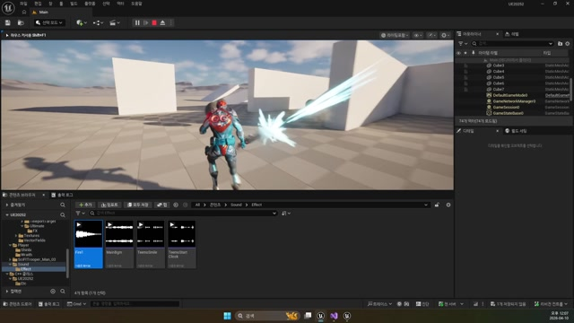

# 260410 01 Wraith 총알과 총구 소켓

[260410 허브](../) | [다음: 02 데칼](../02_intermediate_decal_actor_and_surface_feedback/)

## 문서 개요

이번 날짜의 첫 번째 축은 `Wraith` 총알 공격이다.
핵심은 "총알을 만든다"보다 `총알이 어디서 나가야 자연스러운가`를 정하는 데 있다.

## 1. 총알은 전방 아무 위치보다 총구 소켓이 중요하다

캐릭터 전방 임의 위치에서 투사체를 스폰하면 발사 포즈, 무기 방향, 실제 이펙트가 쉽게 어긋난다.
그래서 `260410`은 먼저 무기 스켈레톤의 `Muzzle_01` 소켓을 기준점으로 잡는다.


## 2. `AWraith::NormalAttack()`은 스폰 책임만 가진다

현재 프로젝트에서 `AWraith::NormalAttack()`은 총알 생성 입구다.
여기서 하는 일은 크게 세 가지다.

1. `GetSocketLocation(TEXT("Muzzle_01"))`으로 발사 위치를 읽는다.
2. `AlwaysSpawn` 규칙으로 총알을 만든다.
3. 총알에 공격력과 소유 컨트롤러를 넘긴다.

```cpp
FVector MuzzleLoc = GetMesh()->GetSocketLocation(TEXT("Muzzle_01"));

TObjectPtr<AWraithBullet> Bullet = GetWorld()->SpawnActor<AWraithBullet>(
    MuzzleLoc, GetActorRotation(), param);

Bullet->SetAttack(GetPlayerState<AMainPlayerState>()->GetAttack());
Bullet->SetOwnerController(GetController());
```


즉 `Wraith`는 "언제 발사할까"를 알고, 총알 클래스는 "그 뒤에 어떻게 움직이고 어떻게 맞을까"를 맡는다.

## 3. `AProjectileBase`는 얇지만 중요한 공통 골격이다

`AProjectileBase`는 `Body + ProjectileMovement + OnProjectileStop` 구조를 제공한다.
이 클래스가 얇다는 건 오히려 장점이다.
공통 틀은 유지하되, 실제 히트 처리와 특수 효과는 파생 클래스가 채울 수 있기 때문이다.

즉 현재 설계는 `움직이는 탄환의 최소 공통 구조`를 먼저 만든 뒤, 구체적인 전투 결과는 `AWraithBullet`로 넘기는 식이다.

## 4. `AWraithBullet`은 이동과 피격 후속 처리를 한곳에 묶는다

`AWraithBullet`은 아래 요소를 함께 갖는다.

- 비행 중 파티클
- `PlayerAttack` 충돌 프로파일
- `OnComponentHit -> BulletHit` 연결
- 히트 파티클, 히트 사운드, 히트 데칼
- 직선 탄도용 `ProjectileGravityScale = 0`

즉 총알은 단순 이동 오브젝트가 아니라, `충돌 + 피해 + 피드백`을 같이 들고 가는 전투 액터다.

## 5. `BulletHit()`는 이번 날짜의 가장 작은 전투 파이프라인이다

충돌 순간 `BulletHit()`은 아래 순서를 수행한다.

1. 총알을 제거한다.
2. 맞은 대상에 `TakeDamage()`를 호출한다.
3. 히트 파티클을 재생한다.
4. 히트 사운드를 재생한다.
5. 충돌 법선을 이용해 데칼을 붙인다.




즉 총알형 공격의 핵심은 `ProjectileMovement` 자체가 아니라, `총구 소켓`, `투사체 공통 골격`, `충돌 지점 후속 처리`가 맞물리는 데 있다.

## 정리

이 편의 핵심은 `Wraith` 총알이 자연스럽게 보이려면 발사 위치와 피격 후속 처리를 같이 설계해야 한다는 점이다.
다음 편에서는 여기서 붙는 표면 흔적을 `Decal` 시스템 관점으로 따로 정리한다.

[260410 허브](../) | [다음: 02 데칼](../02_intermediate_decal_actor_and_surface_feedback/)
