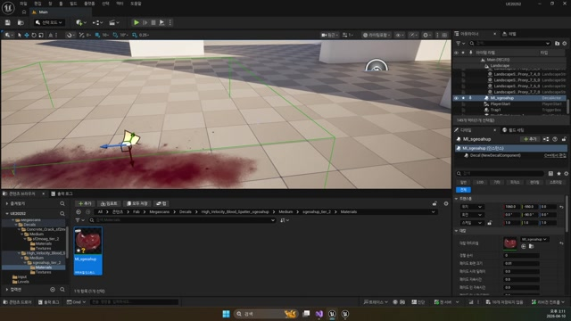

# 260410 02 데칼 액터와 표면 흔적

[이전: 01 Wraith 총알](../01_intermediate_wraith_projectile_and_muzzle_socket/) | [260410 허브](../) | [다음: 03 스킬 캐스팅](../03_intermediate_skill_casting_motion_and_upper_body_blend/)

## 문서 개요

두 번째 강의는 `Decal`이다.
핵심은 파티클과 데칼이 같은 "이펙트"처럼 보여도 실제 목적은 다르다는 점을 구분하는 데 있다.

## 1. 데칼은 표면에 남는 정보를 위한 별도 시스템이다

- 파티클: 공간에서 퍼지고 사라지는 이펙트
- 데칼: 벽, 바닥, 메시 표면에 투영되는 이펙트

총알 자국, 혈흔, 마법진처럼 "표면에 남아야 하는 정보"는 파티클보다 데칼이 훨씬 잘 맞는다.


## 2. 데칼은 투영 상자와 수신 옵션을 같이 봐야 한다

데칼이 보이지 않을 때는 머티리얼 문제만 볼 게 아니라, 아래 세 가지를 같이 봐야 한다.

- 투영 방향
- 투영 박스 크기
- 대상 메시의 `Receives Decals` 옵션


즉 데칼은 단순 평면 이미지가 아니라, `표면에 투영되는 박스형 시스템`으로 보는 편이 정확하다.

## 3. `ADecalBase`는 얇은 래퍼지만 그래서 더 좋다

현재 프로젝트의 `ADecalBase`는 `UDecalComponent`를 루트로 두고, 머티리얼 설정 함수만 노출하는 아주 얇은 액터다.

```cpp
mDecal = CreateDefaultSubobject<UDecalComponent>(TEXT("Decal"));
SetRootComponent(mDecal);
```

```cpp
void ADecalBase::SetDecalMaterial(const FString& MaterialPath)
{
    TObjectPtr<UMaterialInterface> Material =
        LoadObject<UMaterialInterface>(GetWorld(), MaterialPath);

    mDecal->SetDecalMaterial(Material);
}
```

이 구조 덕분에 게임 로직은 더 이상 저수준 `UDecalComponent`를 직접 다루지 않고, `ADecalBase`를 스폰하는 쪽으로 사고를 정리할 수 있다.

## 4. 총알 자국은 위치만이 아니라 법선 방향까지 같이 써야 한다

현재 `AWraithBullet::BulletHit()`의 데칼 코드는 이번 날짜의 핵심을 잘 보여 준다.

```cpp
UGameplayStatics::SpawnDecalAtLocation(
    GetWorld(),
    mHitDecal,
    FVector(20.0, 20.0, 10.0),
    Hit.ImpactPoint,
    (-Hit.ImpactNormal).Rotation(),
    5.f);
```


위치만 맞춘다고 끝이 아니라, `ImpactNormal`을 회전으로 바꿔 표면을 향하게 해야 데칼이 벽이든 바닥이든 자연스럽게 붙는다.



## 5. 데칼은 이후 스킬 범위 표시에도 그대로 이어진다

이번 날짜에서 데칼을 따로 배우는 진짜 이유는 다음 날짜들과의 연결성 때문이다.

- 총알 자국도 데칼
- Shinbi 마법진도 데칼
- 범위 표시와 경고 마커도 데칼

즉 데칼은 장식용 이펙트가 아니라, `전투 표현 + 정보 전달`이 겹치는 계층이라고 보는 편이 맞다.

## 정리

이 편의 핵심은 `표면에 남는 정보는 파티클과 다른 시스템으로 다뤄야 한다`는 점이다.
다음 편에서는 이 표면 정보와 별개로, 캐릭터가 스킬을 준비하는 포즈와 상하체 분리 구조를 본다.

[이전: 01 Wraith 총알](../01_intermediate_wraith_projectile_and_muzzle_socket/) | [260410 허브](../) | [다음: 03 스킬 캐스팅](../03_intermediate_skill_casting_motion_and_upper_body_blend/)
