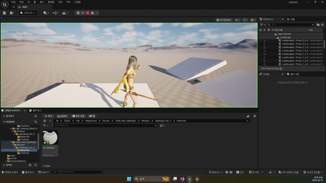

# 260410 03 스킬 캐스팅 모션과 상하체 분리

[이전: 02 데칼](../02_intermediate_decal_actor_and_surface_feedback/) | [260410 허브](../) | [다음: 04 공식 문서](../04_appendix_official_docs_reference/)

## 문서 개요

세 번째 강의는 `Shinbi` 스킬 캐스팅 모션이다.
평타와 달리 스킬은 상하체 분리, 섹션 재생, 노티파이 콜백이 함께 필요해 구조가 한 단계 더 복잡해진다.

## 1. 스킬 모션은 평타보다 복잡한 구조를 가진다

스킬은 보통 아래 요소를 같이 가진다.

- 캐릭터별 고유 포즈
- 상하체 분리 필요
- 캐스팅 구간과 루프 구간 구분
- 특정 프레임에서 게임플레이 로직 호출

그래서 `260410`은 스킬을 "몽타주 하나 더 추가" 정도로 보지 않고, 평타와 다른 별도 구조로 다룬다.

## 2. 상하체 분리의 핵심은 `Layered Blend Per Bone`

이번 강의에서 가장 중요한 애님 그래프 노드는 `Layered Blend Per Bone`이다.
`Spine_01` 같은 상체 시작 본을 기준으로 위쪽만 스킬 모션이 먹게 하고, 하체는 기존 locomotion을 유지하도록 만든다.


이 구조가 있어야 캐릭터가 이동하면서도 상체 캐스팅 포즈를 자연스럽게 유지할 수 있다.

## 3. `PlaySkill1()`은 섹션 기반 스킬 몽타주 진입점이다

현재 `UPlayerAnimInstance::PlaySkill1()`은 스킬 몽타주 재생의 시작점이다.

```cpp
Montage_SetPosition(mSkill1Montage, 0.f);
Montage_Play(mSkill1Montage, 1.f);
Montage_JumpToSection(mSkill1Section[mSkill1Index], mSkill1Montage);
```

즉 스킬은 단순히 `Montage_Play()`만 하는 구조가 아니라, `현재 인덱스가 가리키는 섹션`으로 진입하는 구조다.
이게 있어야 이후 `Casting -> Loop -> Impact` 같은 다단계 스킬 구조로 확장할 수 있다.


## 4. 노티파이와 종료 콜백이 실제 캐스팅 로직과 이어진다

`UPlayerTemplateAnimInstance::AnimNotify_SkillCasting()`은 현재 branch에서 `APlayerCharacterGAS`를 기준으로 `Skill1Casting()`을 호출한다.
또 `MontageEndOverride()`에는 스킬 몽타주 종료 분기와 섹션 정리 의도가 남아 있다.

즉 스킬 애니메이션은 포즈만 재생하는 것이 아니라, 특정 프레임과 종료 시점에 다시 게임플레이 코드로 이어져야 한다.


## 5. 현재 branch에서 가장 설명이 쉬운 기준은 legacy `Shinbi`

현재 저장소에는 `AShinbi`와 `AShinbiGAS`가 함께 있다.

- legacy `AShinbi`
  `Skill1()`에서 `PlaySkill1()`, `Skill1Casting()`에서 `ADecalBase` 기반 마법진 생성, `InputAttack()`에서 `mMagicCircleActor` 분기까지 이어진다.
- `AShinbiGAS`
  `Skill1()`과 `Skill1Casting()`은 유지되지만, `InputAttack()` 쪽 일부 확정 분기는 주석 처리되어 있다.

즉 `260410` 스킬 캐스팅 교안은 현재도 유효하지만, 전체 흐름을 따라가기엔 legacy `AShinbi` 쪽이 더 직관적이다.



## 정리

이 편의 핵심은 `스킬은 평타보다 포즈와 로직의 결합이 더 강하다`는 점이다.
상하체 분리, 섹션 재생, 노티파이 콜백까지 같이 봐야 이후 위치 지정형 스킬과 자연스럽게 이어진다.

[이전: 02 데칼](../02_intermediate_decal_actor_and_surface_feedback/) | [260410 허브](../) | [다음: 04 공식 문서](../04_appendix_official_docs_reference/)
