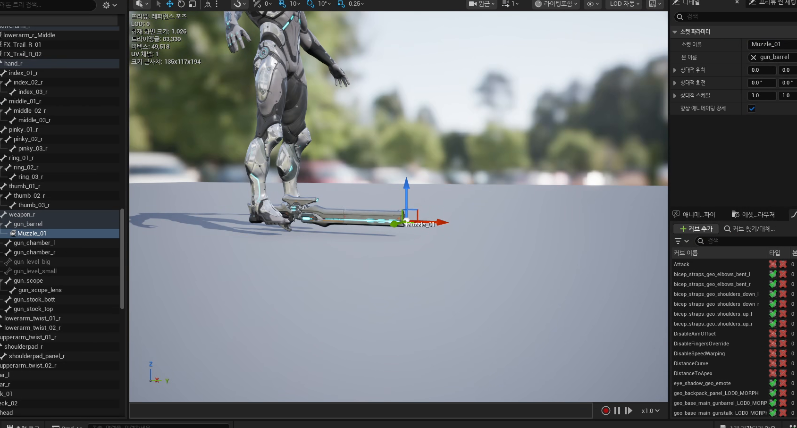
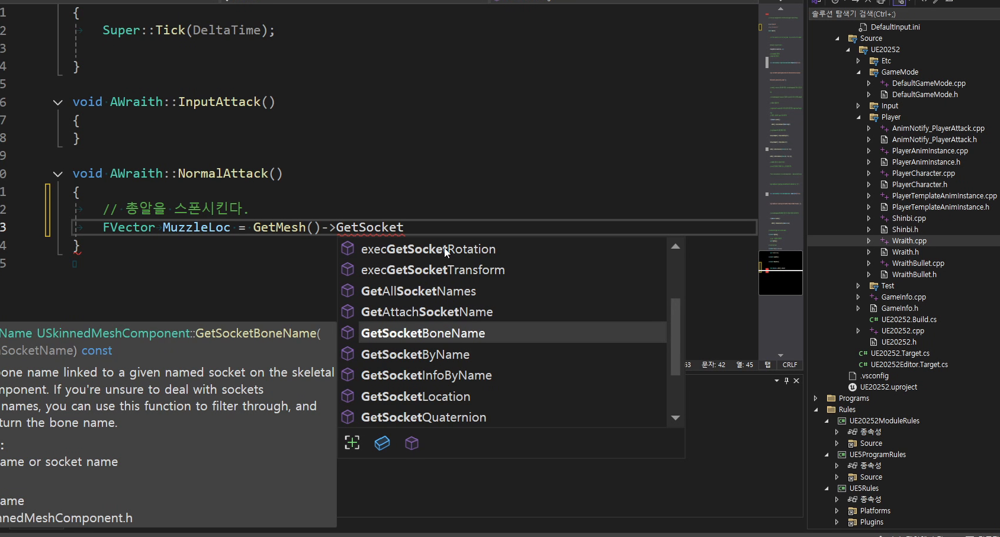
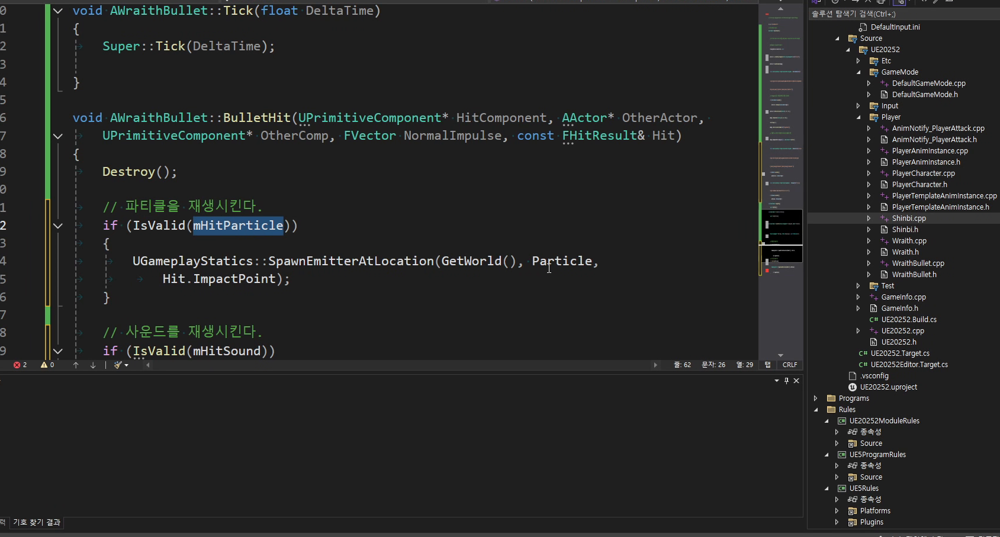
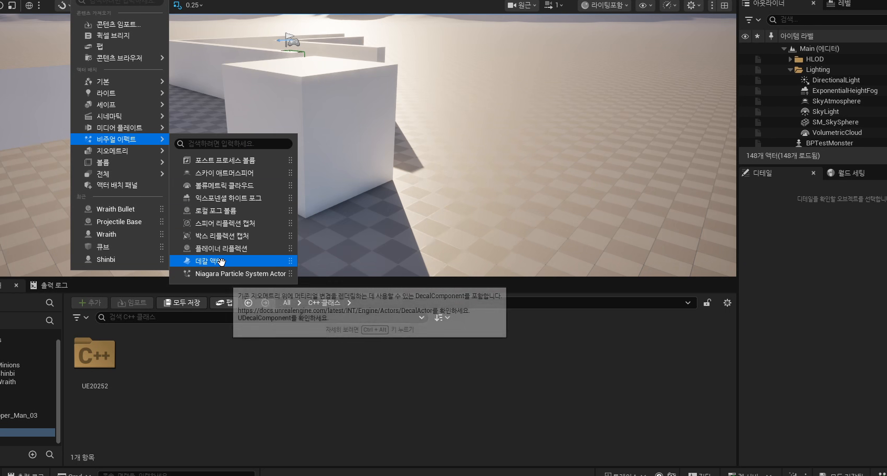
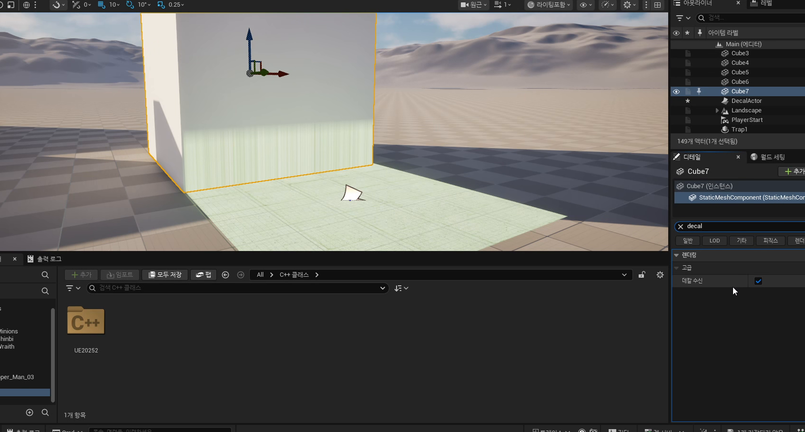
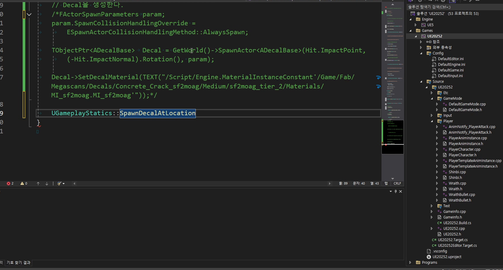
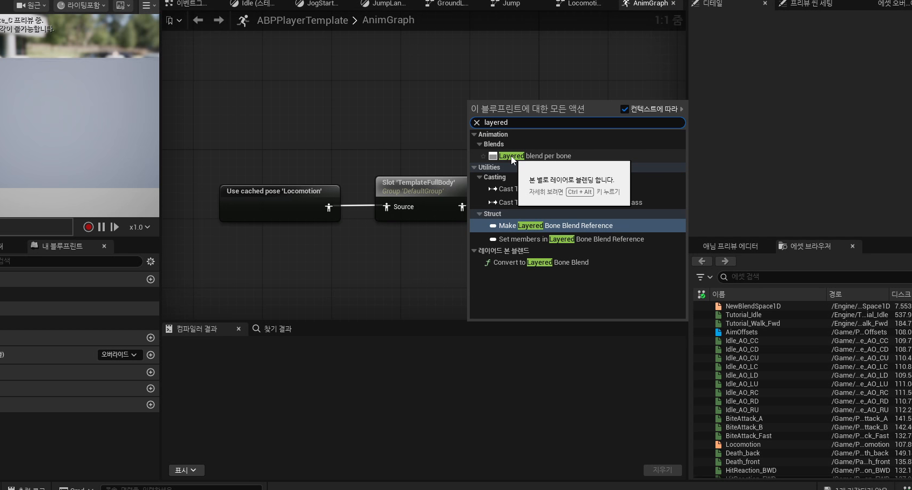
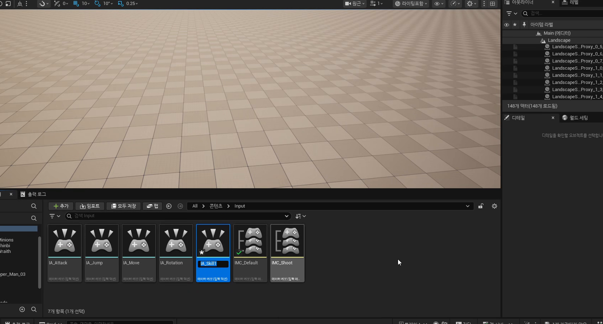
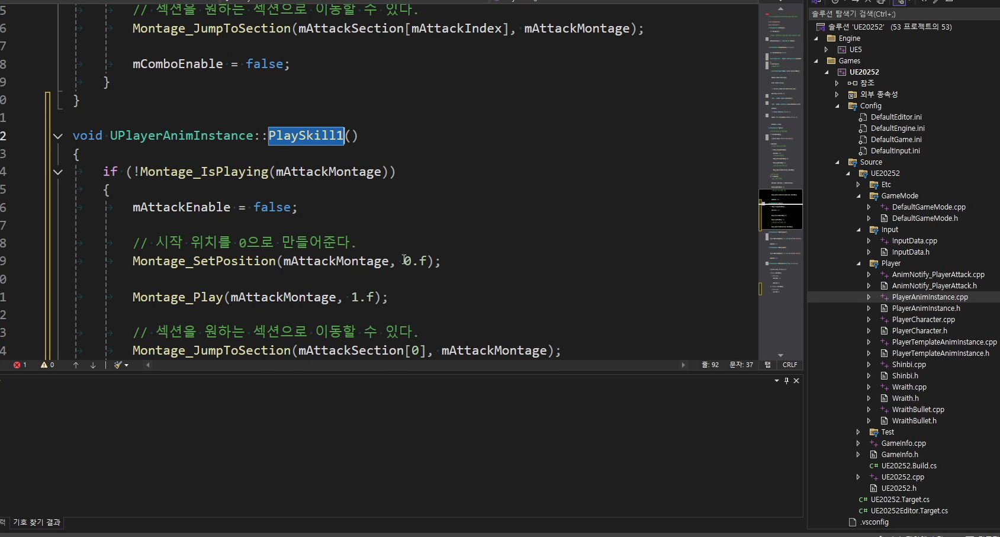
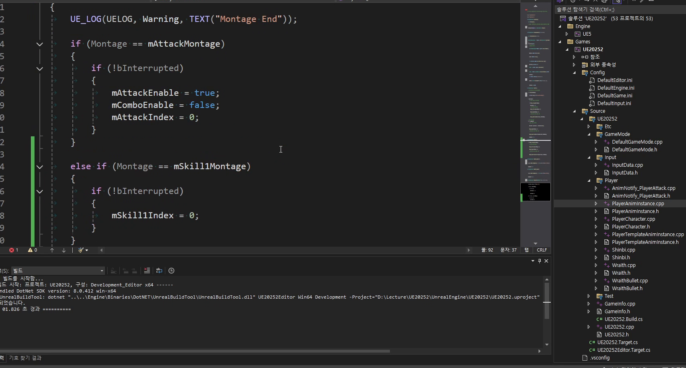

# 260410 Wraith 투사체, 데칼, Shinbi 스킬 캐스팅 모션으로 공격 표현을 확장하는 날

## 문서 개요

이 문서는 `260410_1_플레이어 총알 공격`, `260410_2_데칼`, `260410_3_스킬 캐스팅 모션` 강의를 하나의 연속된 교재로 다시 엮은 것이다.
이번 날짜의 핵심은 공격 시스템을 "데미지를 준다" 수준에서 멈추지 않고, `발사 위치`, `피격 흔적`, `캐스팅 포즈`까지 포함한 표현 파이프라인으로 넓히는 데 있다.

강의 흐름을 한 줄로 요약하면 다음과 같다.

`Attack 입력 -> 몽타주 재생 -> 총구 소켓에서 투사체 생성 -> 충돌 시 파티클/사운드/데칼 -> 스킬 캐스팅 몽타주로 확장`

즉 `260410`은 평타와 스킬의 "표현 계층"을 본격적으로 만들기 시작하는 날이다.
이전 날짜들에서 공격 입력, 애니메이션 몽타주, 기본 타격 구조를 만들었다면, 이번에는 그 공격이 어디서 시작되고 어디에 흔적을 남기며 스킬 준비 동작은 어떤 포즈로 묶일지를 다룬다.

이 교재는 다음 자료를 함께 대조해 작성했다.

- `D:\UE_Academy_Stduy_compressed`의 원본 영상과 자막
- 원본 MP4에서 다시 추출한 대표 장면 캡처
- `D:\UnrealProjects\UE_Academy_Stduy\Source\UE20252`의 실제 C++ 소스
- `D:\UnrealProjects\UE_Academy_Stduy\Saved\AcademyUtility`의 덤프 결과
- Epic Developer Community의 언리얼 공식 문서

## 학습 목표

- `Socket`을 기준으로 투사체를 발사해야 하는 이유를 설명할 수 있다.
- `UProjectileMovementComponent`가 단순 이동 로직보다 왜 투사체 예제에 잘 맞는지 설명할 수 있다.
- `OnComponentHit`, `TakeDamage`, `SpawnEmitterAtLocation`, `SpawnSoundAtLocation`, `SpawnDecalAtLocation`가 하나의 피격 파이프라인으로 어떻게 이어지는지 설명할 수 있다.
- `Decal`이 파티클과 다른 표면형 이펙트라는 점과 `Receives Decals` 옵션의 의미를 설명할 수 있다.
- `Layered Blend Per Bone`, `Branch Filter`, `Spine_01` 기준 상하체 분리가 왜 스킬 캐스팅 모션에 중요한지 설명할 수 있다.
- `Skill1 Montage`, `Section`, `AnimNotify_SkillCasting`, `Skill1Casting()`가 이후 지정형 스킬 구조로 어떻게 이어지는지 설명할 수 있다.
- `AWraith`, `AProjectileBase`, `AWraithBullet`, `ADecalBase`, `UPlayerAnimInstance`, `UPlayerTemplateAnimInstance`가 각각 맡는 책임을 구분할 수 있다.

## 강의 흐름 요약

1. 총알형 공격은 캐릭터 전방 아무 위치에서 스폰하기보다, 실제 총구 소켓 기준으로 생성해야 보이는 연출과 판정이 맞아 떨어진다.
2. 투사체 액터는 `Body` 충돌체와 `ProjectileMovement`를 중심으로 얇게 구성하고, 피격 시점에 데미지와 이펙트를 묶어 처리한다.
3. 데칼은 표면에 투영되는 이펙트로, 총알 자국이나 마법진처럼 "평면에 남는 정보"를 표현할 때 유용하다.
4. 스킬 캐스팅 모션은 일반 평타와 달리 상하체 분리, 섹션 재생, 캐스팅 후속 콜백 같은 구조가 함께 필요하다.
5. 이번 날짜는 이후 `260413`의 마우스 지정형 스킬과 `260422`의 능력 시스템 확장 앞단이 되는 표현 기초를 만든다.

## 2026-04-23 덤프 반영 메모

이번 덤프 기준으로 보면 `260410`은 단순히 “연출을 붙여 본 날”이 아니라, 총알, 데칼, 캐스팅 모션을 서로 다른 시스템으로 분리한 설계 전환점이다.

- `WraithBullet_SourceDump.txt`
  `AWraithBullet`은 비행 중 파티클과 피격 시 파티클, 사운드, 데칼, 공격력, 소유 컨트롤러를 함께 관리한다. 총알형 공격을 캐릭터 본체 밖으로 분리했다는 설명이 훨씬 선명해진다.
- `DecalBase_SourceDump.txt`
  `ADecalBase`는 `UDecalComponent` 하나를 루트로 두고 머티리얼만 갈아 끼우는 얇은 액터다. 그래서 총알 자국과 마법진을 같은 계열 시스템으로 재사용할 수 있다.
- `AM_Shinbi_Skill1_Template_AssetDump.txt`
  스킬 몽타주는 실제로 `Casting -> Loop -> Impact` 세 섹션을 가진다. 즉 캐스팅 모션은 그냥 재생 한 번이 아니라 “준비 상태 유지 후 확정” 구조다.
- `MTShibiMagicCircle_MaterialDump.txt`
  마법진 머티리얼은 `BlendMode = Modulate`, `MaterialDomain = DeferredDecal`이고 `MagicCircle` 텍스처에 강한 Emissive 배수를 곱한다. 이 덤프 덕분에 `260413`의 위치 지정형 스킬 마커가 왜 데칼로 자연스럽게 이어지는지도 설명이 쉬워진다.

---

## 제1장. 플레이어 총알 공격: Wraith의 총알은 왜 총구 소켓에서 나가야 하는가

### 1.1 투사체는 "앞으로 나간다"보다 "어디서 나가느냐"가 더 중요하다

첫 강의는 `Wraith`를 기준으로 플레이어 총알 공격을 만든다.
자막에서도 계속 강조하는 포인트가 하나 있다.
`Projectile Movement Component`를 붙이는 것 자체보다, 그 총알이 어느 위치에서 발사되느냐가 훨씬 더 중요하다는 점이다.

캐릭터 전방 임의 위치에서 총알을 만들면 이런 문제가 생긴다.

- 총구에서 발사되는 것처럼 보이지 않는다.
- 총을 들고 있는 포즈와 발사 위치가 어긋난다.
- 좌우 회전과 무기 방향이 맞아도 시각적으로 엇갈려 보인다.

그래서 이번 강의는 먼저 캐릭터 메시의 무기 스켈레톤에서 `Muzzle_01` 같은 총구 소켓을 잡고, 거기서 실제 투사체를 스폰하는 흐름을 정리한다.

강의 화면에서도 먼저 무기 메시에서 `Muzzle_01` 소켓 위치를 직접 확인한다.
즉 이 날짜의 출발점은 "총알 클래스를 만든다"보다 "총알이 나갈 정확한 기준점을 잡는다"에 더 가깝다.



### 1.2 현재 `AWraith::NormalAttack()`은 총알 스폰 책임만 가진다

현재 프로젝트에서 Wraith의 발사는 `AWraith::NormalAttack()`에 들어 있다.

```cpp
void AWraith::NormalAttack()
{
    // 총알이 실제로 나갈 총구 소켓 위치를 읽는다.
    FVector MuzzleLoc = GetMesh()->GetSocketLocation(TEXT("Muzzle_01"));

    // 스폰 중 겹치더라도 발사를 막지 않게 한다.
    FActorSpawnParameters Param;
    Param.SpawnCollisionHandlingOverride =
        ESpawnActorCollisionHandlingMethod::AlwaysSpawn;

    // 총구 위치에서 Wraith 전용 총알 액터를 만든다.
    TObjectPtr<AWraithBullet> Bullet =
        GetWorld()->SpawnActor<AWraithBullet>(
            MuzzleLoc, GetActorRotation(), Param);

    // 총알이 쓸 공격력과 소유 컨트롤러를 넘긴다.
    Bullet->SetAttack(GetPlayerState<AMainPlayerState>()->GetAttack());
    Bullet->SetOwnerController(GetController());
}
```

이 함수가 좋은 이유는 책임이 짧고 분명하기 때문이다.

- `Wraith`는 "언제 발사할지"를 안다.
- `Socket`은 "어디서 나갈지"를 제공한다.
- `WraithBullet`은 "어떻게 날아가고 맞을지"를 맡는다.

즉 공격 캐릭터가 투사체 내부 구현을 다 알 필요가 없다.
현재 Wraith는 발사 위치와 기본 파라미터만 넘기고, 이후 물리 이동과 충돌은 총알 액터가 책임지는 구조다.

실제 코드 화면도 `GetSocketLocation(TEXT("Muzzle_01"))`가 발사의 시작점이라는 걸 아주 선명하게 보여 준다.
문서에서 강조한 "발사 위치 책임 분리"가 어디서 보이는지 바로 확인할 수 있는 장면이다.



### 1.3 `AProjectileBase`는 투사체 공통 골격을 제공한다

투사체 계층의 바닥은 `AProjectileBase`다.
현재 구현은 매우 얇지만, 바로 그 얇음 때문에 교육용으로 좋다.

```cpp
AProjectileBase::AProjectileBase()
{
    // 예제 단순화를 위해 Tick을 열어 둔다.
    PrimaryActorTick.bCanEverTick = true;

    // 충돌 몸통과 투사체 이동 컴포넌트를 만든다.
    mBody = CreateDefaultSubobject<UBoxComponent>(TEXT("Body"));
    mMovement = CreateDefaultSubobject<UProjectileMovementComponent>(TEXT("Movement"));

    // 충돌체를 루트로 쓰고, Movement가 그 루트를 움직이게 한다.
    SetRootComponent(mBody);
    mMovement->SetUpdatedComponent(mBody);

    // 이동이 멈췄을 때 후속 함수를 받을 수 있게 연결한다.
    mMovement->OnProjectileStop.AddDynamic(this, &AProjectileBase::ProjectileStop);
}
```

이 구조를 초보자 관점에서 읽으면 다음과 같다.

- `mBody`: 실제 충돌과 이동 기준이 되는 루트
- `mMovement`: 속도, 중력, 반사, 정지 같은 투사체 이동 규칙
- `OnProjectileStop`: 이동이 멈췄을 때 후속 로직을 걸 수 있는 접점

즉 `AProjectileBase`는 "총알이라는 액터가 최소한 무엇을 가져야 하는가"를 정리해 둔 공통 기반이다.
이후 총알 종류가 늘어나더라도 `Body + Movement` 구조는 그대로 재사용할 수 있다.

### 1.4 `AWraithBullet`은 이동, 충돌, 피격 이펙트를 한곳에 묶는다

실제 총알다운 성격은 `AWraithBullet`에서 완성된다.

```cpp
AWraithBullet::AWraithBullet()
{
    // 비행 중 보여 줄 파티클을 붙인다.
    mParticle = CreateDefaultSubobject<UParticleSystemComponent>(TEXT("Particle"));
    mParticle->SetupAttachment(mBody);

    // 총알 충돌 크기와 충돌 규칙을 정한다.
    mBody->SetBoxExtent(FVector(43.0, 8.0, 10.0));
    mBody->SetCollisionProfileName(TEXT("PlayerAttack"));
    // 맞는 순간 BulletHit으로 들어가게 한다.
    mBody->OnComponentHit.AddDynamic(this, &AWraithBullet::BulletHit);

    // 중력 없는 직선 탄도와 시작 속도를 세팅한다.
    mMovement->ProjectileGravityScale = 0.f;
    mMovement->InitialSpeed = 1000.f;

    // 너무 오래 남지 않게 자동 삭제 시간을 둔다.
    SetLifeSpan(5.f);
}
```

여기서 중요한 포인트는 세 가지다.

1. `PlayerAttack` 충돌 프로파일을 써서 총알이 맞아야 할 대상과만 상호작용하게 한다.
2. `ProjectileGravityScale = 0`으로 직선 탄도를 만든다.
3. `OnComponentHit`에 `BulletHit()`를 연결해, 충돌 순간 후속 처리의 진입점을 만든다.

즉 총알은 "날아가는 파티클"이 아니라, 충돌/피해/효과를 가진 전투 액터다.

### 1.5 `BulletHit()`는 현재 프로젝트에서 가장 작은 전투 파이프라인이다

`AWraithBullet::BulletHit()`를 보면 이번 강의의 핵심이 아주 압축돼 있다.

```cpp
void AWraithBullet::BulletHit(
    UPrimitiveComponent* HitComponent,
    AActor* OtherActor,
    UPrimitiveComponent* OtherComp,
    FVector NormalImpulse,
    const FHitResult& Hit)
{
    // 맞은 뒤에는 총알 자신을 지운다.
    Destroy();

    // 맞은 액터에게 데미지를 전달한다.
    FDamageEvent DmgEvent;
    OtherActor->TakeDamage(mAttack, DmgEvent, mOwnerController, this);

    // 피격 파티클이 있으면 충돌 지점에 생성한다.
    if (IsValid(mHitParticle))
    {
        UGameplayStatics::SpawnEmitterAtLocation(
            GetWorld(), mHitParticle, Hit.ImpactPoint);
    }

    // 피격 사운드가 있으면 같은 지점에서 재생한다.
    if (IsValid(mHitSound))
    {
        UGameplayStatics::SpawnSoundAtLocation(
            GetWorld(), mHitSound, Hit.ImpactPoint);
    }

    // 데칼이 있으면 표면 방향까지 맞춰서 붙인다.
    if (IsValid(mHitDecal))
    {
        UGameplayStatics::SpawnDecalAtLocation(
            GetWorld(),
            mHitDecal,
            FVector(20.0, 20.0, 10.0),
            Hit.ImpactPoint,
            (-Hit.ImpactNormal).Rotation(),
            5.f);
    }
}
```

이 함수는 다음 순서로 읽으면 된다.

1. 총알 자신은 충돌 즉시 제거한다.
2. 맞은 액터에게 `TakeDamage()`를 호출한다.
3. 충돌 지점에 파티클을 생성한다.
4. 같은 지점에 사운드를 재생한다.
5. 같은 지점의 법선 방향을 이용해 데칼을 붙인다.

강의 후반 코드 화면에서도 `BulletHit()` 안에 `TakeDamage`, `SpawnSoundAtLocation`, `SpawnEmitterAtLocation`이 한 블록에 모여 있다.
즉 피격 후속 처리를 "충돌 지점 중심 파이프라인"으로 묶는다는 설명이 실제 코드와 그대로 겹친다.



즉 `260410`은 단순히 투사체를 만드는 강의가 아니라, "충돌 지점 중심 이펙트"라는 사고방식을 배우는 날이기도 하다.
피격 위치 `Hit.ImpactPoint`와 표면 방향 `Hit.ImpactNormal`을 같이 쓰기 시작하면, 총알 자국, 마법진, 폭발 흔적 같은 표면형 연출이 전부 같은 패턴으로 확장된다.

### 1.6 현재 구조의 장점과 이후 확장 포인트

현재 총알 구조는 학습용으로 아주 좋다.

- 발사 위치는 소켓에서 해결한다.
- 이동은 `ProjectileMovement`가 해결한다.
- 충돌 후속 처리는 `BulletHit()` 한곳에 모인다.

반면 이후 확장 지점도 분명하다.

- 아군/적군 판정을 더 엄밀하게 넣을 수 있다.
- 피격 대상 타입별 다른 이펙트를 줄 수 있다.
- 데칼 수명, 크기, 머티리얼을 표면에 따라 바꿀 수 있다.
- 히트스캔 무기와 투사체 무기를 분리할 수 있다.

즉 이번 날짜는 완성형 총기 시스템이라기보다, "총알 기반 공격을 확장 가능한 구조로 세우는 첫날"에 가깝다.

### 1.7 장 정리

제1장의 결론은 Wraith 총알 공격의 핵심이 "Projectile을 쓴다"에 있지 않다는 점이다.
정확히는 `총구 소켓`, `ProjectileBase`, `BulletHit()`라는 세 지점이 맞물려야 총알이 게임 안에서 자연스럽게 보이고 반응한다.

---

## 제2장. 데칼: 표면에 남는 정보는 왜 파티클이 아니라 데칼로 다뤄야 하는가

### 2.1 데칼은 "표면에 붙는 이펙트"를 위한 별도 시스템이다

두 번째 강의는 데칼이다.
자막에서도 먼저 구분을 잡아 준다.
파티클이나 나이아가라는 공간에서 터지고 흩어지는 효과에 강하지만, 핏자국, 총알 자국, 마법진, 오염 표현처럼 "표면 위에 남는 정보"는 데칼이 훨씬 잘 맞는다.

데칼이 중요한 이유는 표현 목적이 다르기 때문이다.

- 파티클: 공중에 퍼지고 사라지는 공간형 이펙트
- 데칼: 벽, 바닥, 바닥면 위에 투영되는 표면형 이펙트

이번 날짜에서 데칼을 배우는 이유도 명확하다.
바로 앞 강의의 총알 충돌 흔적과, 바로 뒤 강의에서 쓸 스킬 마법진이 모두 데칼 계열 표현이기 때문이다.

실강도 먼저 에디터 메뉴에서 `Decal Actor`를 직접 배치해 보면서,
데칼이 파티클과는 다른 별도 액터 계층이라는 점부터 체감하게 만든다.



### 2.2 데칼 액터는 투영 상자를 가진다

에디터에서 `Decal Actor`를 배치해 보면, 데칼은 단순 스프라이트가 아니라 박스 형태의 투영 영역을 갖고 있다는 점을 알 수 있다.
이 영역 안에 들어온 메시의 표면에만 머티리얼이 붙는다.

그래서 데칼을 다룰 때는 항상 세 가지를 같이 봐야 한다.

- 투영 방향
- 투영 박스 크기
- 대상 메시가 데칼을 받을지 여부

자막에서 `Receives Decals` 옵션을 보여 주는 이유도 여기 있다.
메시 쪽에서 이 옵션을 꺼 두면, 데칼 액터가 그 표면에 아무리 가까이 있어도 결과가 보이지 않는다.

강의 화면에서도 큐브 메시의 `Receives Decals` 옵션을 직접 켜고 끄며,
"데칼이 안 보이는 문제"가 머티리얼보다 메시 설정일 수도 있다는 점을 짚어 준다.



### 2.3 현재 `ADecalBase`는 아주 얇은 래퍼지만 그래서 더 중요하다

프로젝트 안의 `ADecalBase`는 별다른 로직이 많지 않다.

```cpp
ADecalBase::ADecalBase()
{
    // 예제 단순화를 위해 Tick을 열어 둔다.
    PrimaryActorTick.bCanEverTick = true;

    // 실제 데칼 투영을 담당할 컴포넌트를 만들고 루트로 둔다.
    mDecal = CreateDefaultSubobject<UDecalComponent>(TEXT("Decal"));
    SetRootComponent(mDecal);
}

void ADecalBase::SetDecalMaterial(UMaterialInterface* Material)
{
    // 이미 로드된 머티리얼을 바로 데칼에 적용한다.
    mDecal->SetDecalMaterial(Material);
}

void ADecalBase::SetDecalMaterial(const FString& MaterialPath)
{
    // 경로 문자열로 머티리얼을 읽어 와서 데칼에 적용한다.
    TObjectPtr<UMaterialInterface> Material =
        LoadObject<UMaterialInterface>(GetWorld(), MaterialPath);

    mDecal->SetDecalMaterial(Material);
}
```

이 클래스가 좋은 이유는 엔진 기본 `DecalComponent`를 프로젝트 문맥 안에서 다시 감싼다는 점이다.
즉 이후에 데칼 크기, 수명, 회전, 머티리얼 교체 규칙을 더 넣고 싶어질 때, 이미 `ADecalBase`라는 프로젝트 전용 접점이 준비돼 있다.

초보자 관점에서는 이 구조를 이렇게 이해하면 된다.

- 엔진은 `UDecalComponent`를 제공한다.
- 프로젝트는 `ADecalBase`로 이를 액터화한다.
- 게임 로직은 더 이상 저수준 컴포넌트 대신 `ADecalBase`를 스폰해서 쓴다.

### 2.4 총알 자국 데칼은 충돌 법선을 같이 써야 한다

앞 장의 `BulletHit()`에서 데칼 생성 부분은 특히 중요하다.

```cpp
// 충돌 지점에 데칼을 붙인다.
// 크기, 위치, 표면 방향, 수명을 함께 넘겨야 자연스럽게 보인다.
UGameplayStatics::SpawnDecalAtLocation(
    GetWorld(),
    mHitDecal,
    FVector(20.0, 20.0, 10.0),
    Hit.ImpactPoint,
    (-Hit.ImpactNormal).Rotation(),
    5.f);
```

실제 코드 화면도 `SpawnDecalAtLocation()` 한 줄에 위치, 회전, 크기, 수명이 함께 묶여 있다는 점을 그대로 보여 준다.
즉 데칼은 단순 머티리얼 표시가 아니라, 충돌 결과를 표면 좌표계로 변환하는 연출 단계라는 걸 읽게 된다.



여기서 핵심은 위치만이 아니다.
`(-Hit.ImpactNormal).Rotation()`으로 표면 법선 반대 방향을 회전값으로 사용한다.
그래야 벽이든 바닥이든 데칼이 표면을 향해 자연스럽게 붙는다.

즉 데칼은 "충돌 위치에 그림 하나 놓기"가 아니라, `위치 + 방향 + 크기 + 수명`을 함께 다루는 표면 연출이다.

### 2.5 데칼은 이후 스킬 범위 표시에도 그대로 재사용된다

이번 날짜에서 데칼을 따로 떼어 배우는 진짜 이유는 다음 날짜들로 가면 더 분명해진다.
총알 자국도 데칼이고, Shinbi의 마법진도 데칼이다.
즉 데칼은 일회성 시각 효과가 아니라, 플레이어에게 "여기에 뭔가가 발생했다" 또는 "여기가 스킬 범위다"를 전달하는 UI 성격도 가진다.

이 관점이 잡히면 데칼을 더 잘 다룰 수 있다.

- 피격 흔적을 남기는 데칼
- 공격 범위를 미리 보여주는 데칼
- 상호작용 가능 영역을 표시하는 데칼

즉 데칼은 전투 표현과 정보 전달이 겹치는 지점에 있다.

### 2.6 장 정리

제2장의 결론은 데칼이 "예쁜 효과 하나"가 아니라는 점이다.
총알 자국과 마법진처럼 표면에 남는 중요한 게임 정보를 안정적으로 전달하려면, 파티클과 다른 별도 시스템으로 생각해야 한다.

---

## 제3장. 스킬 캐스팅 모션: 평타와 다른 상하체 구조를 어떻게 만들 것인가

### 3.1 스킬 모션은 템플릿만으로 끝나지 않는다

세 번째 강의는 `Shinbi`를 기준으로 스킬 캐스팅 모션을 만든다.
자막에서 아주 중요하게 말하는 부분이 있다.
공격 템플릿 구조를 쓰더라도, 스킬 모션은 캐릭터별 성격 차이 때문에 완전히 템플릿화하기 어렵다는 점이다.

왜냐하면 스킬은 보통 이런 요소를 같이 가지기 때문이다.

- 캐릭터별 고유 포즈
- 상하체 분리 필요
- 캐스팅 구간과 루프 구간 분리
- 캐스팅 종료 후 후속 로직 연결

즉 평타보다 애니메이션 구조가 한 단계 더 복잡하다.

### 3.2 상하체 분리의 핵심은 `Layered Blend Per Bone`이다

강의는 스킬 모션을 만들 때 `Layered Blend Per Bone`을 이용한 상하체 분리를 먼저 잡는다.
그리고 `Spine_01` 같은 상체 루트 본을 기준으로 브랜치 필터를 나누는 사고를 설명한다.

이 구조가 중요한 이유는 캐스팅 모션이 보통 상체 중심 동작이기 때문이다.
이동은 하체가 계속 책임지고, 스킬 표현은 상체가 담당해야 자연스럽다.

즉 상하체를 분리하지 않으면 이런 문제가 생긴다.

- 캐릭터가 스킬 쓸 때 이동 전체가 뻣뻣하게 멈춘다.
- 하체 보행과 상체 캐스팅을 동시에 보여주기 어렵다.
- 몽타주를 붙일 때 다른 이동 상태와 충돌하기 쉽다.

그래서 `Spine_01` 이후 라인만 스킬 모션이 먹게 만들고, 하체는 기존 locomotion을 유지하게 하는 식의 설계가 중요해진다.

강의 초반 애님 그래프 편집 화면도 `Layered Blend Per Bone` 노드를 먼저 추가하는 흐름을 분명하게 보여 준다.
즉 이 날짜의 스킬 모션은 몽타주를 붙이기 전에, 상하체를 어디서 나눌지부터 정하는 구조다.



### 3.3 `PlaySkill1()`은 Skill1 몽타주 섹션 재생 진입점이다

현재 `UPlayerAnimInstance`의 `PlaySkill1()`은 스킬 몽타주 재생 진입점 역할을 한다.

실강에서는 먼저 `Input` 폴더에 `IA_Skill1` 액션을 준비해,
스킬 입력 축을 평타와 분리하는 장면을 보여 준다.



```cpp
void UPlayerAnimInstance::PlaySkill1()
{
    // 몽타주 재생 위치를 처음으로 되돌린다.
    Montage_SetPosition(mSkill1Montage, 0.f);
    // 스킬1 몽타주를 재생한다.
    Montage_Play(mSkill1Montage, 1.f);
    // 현재 인덱스에 맞는 섹션으로 바로 점프한다.
    Montage_JumpToSection(mSkill1Section[mSkill1Index], mSkill1Montage);
}

void UPlayerAnimInstance::ClearSkill1()
{
    // 다음 재생을 위해 섹션 인덱스를 초기값으로 되돌린다.
    mSkill1Index = 0;
}
```

이 구조는 단순하지만 강력하다.

- `mSkill1Montage`: 어떤 스킬 몽타주를 재생할지
- `mSkill1Section[mSkill1Index]`: 그중 어느 구간을 재생할지
- `ClearSkill1()`: 섹션 인덱스를 다시 초기화할지

즉 스킬 모션은 이제 "애니메이션 하나 재생"이 아니라, `몽타주 + 섹션 인덱스` 구조로 들어간다.
이게 바로 이후 `Casting -> Loop -> End` 같은 다단계 스킬 구조로 자연스럽게 확장되는 바닥이다.

코드 화면에서도 `PlaySkill1()` 안에 `Montage_Play()`와 `Montage_JumpToSection()`이 함께 들어 있어,
스킬1이 단순 재생이 아니라 "지정 섹션 진입" 구조라는 점이 바로 보인다.



### 3.4 애니메이션 끝과 후속 로직 사이에 콜백 구조가 필요하다

현재 코드에는 이 흐름을 보여 주는 힌트가 여러 군데 있다.
`MontageEndOverride()` 안에는 캐스팅 뒤 루프 모션으로 전환하려는 주석이 남아 있고, 템플릿 애님 인스턴스에는 `AnimNotify_SkillCasting()`이 별도로 존재한다.

또 몽타주 종료 콜백을 분기 처리하는 코드 화면도 남아 있어서,
평타 몽타주와 스킬 몽타주를 끝난 뒤 서로 다르게 정리하려는 의도가 분명하게 드러난다.



```cpp
void UPlayerTemplateAnimInstance::AnimNotify_SkillCasting()
{
    // 현재 이 애님을 쓰는 플레이어 캐릭터를 찾는다.
    TObjectPtr<APlayerCharacterGAS> PlayerChar =
        Cast<APlayerCharacterGAS>(TryGetPawnOwner());

    if (IsValid(PlayerChar))
    {
        // 캐스팅 노티파이 프레임에서 실제 스킬 준비 로직을 호출한다.
        PlayerChar->Skill1Casting();
    }

    // 다음 섹션으로 넘어가도록 인덱스를 갱신한다.
    mSkill1Index = (mSkill1Index + 1) % mSkill1Section.Num();
}
```

이 구조가 의미하는 바는 분명하다.

- 스킬 애니메이션에는 "보여주는 포즈"만 있는 것이 아니다.
- 특정 프레임에서 게임 로직을 호출해야 한다.
- 그 접점이 `AnimNotify`나 몽타주 종료 콜백이다.

즉 스킬 캐스팅 모션은 애니메이션 파트와 게임플레이 파트가 만나는 인터페이스라고 봐야 한다.
이 관점이 있어야 `260413`에서 마우스 위치에 마법진을 생성하는 구조가 자연스럽게 읽힌다.

### 3.5 `APlayerCharacter`의 빈 가상 함수들은 확장 지점을 미리 비워 둔다

현재 `APlayerCharacter`를 보면 `InputAttack()`, `Skill1()`, `NormalAttack()`, `Skill1Casting()`이 비어 있다.

```cpp
// 부모 클래스는 공통 확장 지점만 비워 둔다.
// 실제 동작은 Wraith, Shinbi 같은 자식 클래스가 오버라이드한다.
void APlayerCharacter::InputAttack() {}
void APlayerCharacter::Skill1() {}
void APlayerCharacter::NormalAttack() {}
void APlayerCharacter::Skill1Casting() {}
```

이 설계는 학습용으로 아주 중요하다.
공통 입력 루틴은 부모에 두고, 실제 공격 방식은 `Wraith`, `Shinbi` 같은 자식 클래스가 오버라이드하게 만들기 때문이다.

즉 현재 구조는 이미 이렇게 읽어야 한다.

- 입력 계층: `AttackKey()`, `Skill1Key()`
- 공통 애님 인스턴스 계층: `PlayAttack()`, `PlaySkill1()`
- 캐릭터별 구현 계층: `Wraith::NormalAttack()`, `Shinbi::Skill1Casting()`

이번 강의에서 스킬 캐스팅 모션을 다루는 이유도 결국 여기에 있다.
캐릭터마다 다른 공격 정체성을 가질 수 있도록, 공통 틀과 개별 구현을 분리하는 것이다.

### 3.6 장 정리

제3장의 결론은 스킬 캐스팅 모션이 단순 애니메이션 추가가 아니라는 점이다.
상하체 분리, 몽타주 섹션, 노티파이/콜백, 캐릭터별 오버라이드 구조까지 함께 있어야, 이후 마우스 지정형 스킬이나 후속 이펙트가 자연스럽게 붙는다.

---

## 제4장. 현재 프로젝트 C++로 다시 읽는 260410 핵심 구조

### 4.1 왜 260410은 단순 연출 보강이 아니라 "공격 표현 파이프라인" 강의인가

현재 프로젝트 소스를 기준으로 다시 읽으면 `260410`의 핵심은 세 갈래가 하나로 묶이는 데 있다.

1. Wraith 평타가 총구 소켓에서 투사체를 발사한다.
2. 그 투사체는 피격 지점에 파티클, 사운드, 데칼을 남긴다.
3. Shinbi 스킬은 캐스팅 모션과 후속 콜백 구조를 준비한다.

즉 `260410`은 `평타 표현`과 `스킬 표현`이 같은 언어로 재정리되기 시작하는 날짜다.

### 4.2 현재 파이프라인은 이렇게 읽는 것이 가장 정확하다

`Attack 입력 -> UPlayerAnimInstance::PlayAttack() -> AWraith::NormalAttack() -> Muzzle_01 기준 AWraithBullet 생성 -> BulletHit() -> Damage + Particle + Sound + Decal`

그리고 스킬 쪽은 다음처럼 이어진다.

`Skill1 입력 -> UPlayerAnimInstance::PlaySkill1() -> Skill1 Montage Section 재생 -> AnimNotify_SkillCasting() 또는 몽타주 종료 지점 -> 캐릭터별 Skill1Casting()`

이 두 흐름은 표면적으로 달라 보여도 공통점이 있다.

- 둘 다 몽타주와 게임 로직이 연결된다.
- 둘 다 특정 위치에 월드 액터나 이펙트를 생성한다.
- 둘 다 이후 날짜 확장의 발판이 된다.

### 4.3 Wraith와 Shinbi가 서로 다른 이유가 곧 설계 포인트다

`Wraith`는 바로 투사체를 쏘는 캐릭터다.
반면 `Shinbi`는 캐스팅 준비 동작을 통해 지정형 스킬로 확장될 여지가 큰 캐릭터다.
강의가 같은 날짜에 이 둘을 나란히 다루는 이유도 여기에 있다.

- Wraith로는 "즉시 발사형 공격"을 설명하기 쉽다.
- Shinbi로는 "캐스팅 후속형 공격"을 설명하기 쉽다.

즉 이번 날짜는 캐릭터 하나의 기능을 파는 날이 아니라, 플레이어 공격 표현의 두 축을 나란히 배우는 날이라고 보는 편이 더 정확하다.

### 4.4 이후 날짜와의 연결

`260410`이 끝나면 다음 흐름이 자연스럽게 열린다.

- `260413`: 마우스 피킹과 마법진 데칼, 스킬 위치 지정
- `260414` 이후: AI와 몬스터 반응
- `260421~260422`: Gameplay Ability System 기반 능력 분리

즉 이번 날짜는 이후 내용을 위한 사전 준비이기도 하다.
표현 계층이 먼저 정리돼야, 나중에 입력 규칙이나 능력 시스템이 붙어도 플레이어가 "무슨 일이 일어나는지"를 볼 수 있기 때문이다.

### 4.5 장 정리

현재 C++ 기준으로 `260410`은 아래 한 문장으로 요약할 수 있다.

`소켓에서 공격을 시작하고, 충돌 지점에 흔적을 남기며, 스킬은 몽타주와 콜백을 통해 후속 액션으로 이어지게 만드는 날`

---

## 전체 정리

`260410`은 공격이 단순히 맞느냐 아니냐를 넘어서, "어디서 시작되고 무엇이 남으며 어떤 자세로 이어지는가"를 정리하는 날이다.
Wraith는 `Muzzle_01` 소켓 기준 투사체 발사를 통해 즉시형 원거리 공격을 보여 주고, `AWraithBullet`은 충돌 지점에 데미지, 파티클, 사운드, 데칼을 한 번에 묶는다.
반대로 Shinbi는 `Layered Blend Per Bone`, `Skill1 Montage`, `AnimNotify_SkillCasting()` 구조를 통해 지정형 스킬과 캐스팅형 전투의 출발점을 만든다.

즉 이 날짜의 진짜 성과는 "총알 하나 만들기"나 "데칼 하나 띄우기"가 아니다.
공격 표현을 `발사 위치`, `피격 흔적`, `캐스팅 포즈`라는 세 층으로 나눠 생각하기 시작했다는 데 있다.

## 복습 체크리스트

- 총알 발사 위치를 캐릭터 전방 임의 위치가 아니라 `Socket` 기준으로 잡아야 하는 이유를 설명할 수 있는가
- `AProjectileBase`가 `Body + ProjectileMovement` 구조를 가지는 이유를 설명할 수 있는가
- `BulletHit()`가 데미지, 파티클, 사운드, 데칼을 어떤 순서로 처리하는지 말할 수 있는가
- 데칼이 파티클과 달리 표면형 이펙트인 이유를 설명할 수 있는가
- `Receives Decals` 옵션을 껐을 때 어떤 변화가 생기는지 설명할 수 있는가
- `Layered Blend Per Bone`에서 `Spine_01` 기준 상하체 분리를 왜 쓰는지 말할 수 있는가
- `Skill1 Montage`와 `Section` 구조가 평타보다 왜 더 필요한지 설명할 수 있는가
- `AnimNotify_SkillCasting()`이 게임플레이 로직과 애니메이션을 어떻게 연결하는지 설명할 수 있는가
- `APlayerCharacter`의 빈 가상 함수들이 왜 중요한 확장 포인트인지 말할 수 있는가

## 세미나 질문

1. 히트스캔 무기와 투사체 무기 중, 이번 날짜 구조는 어느 쪽에 더 잘 맞고 왜 그런가?
2. 총알 자국을 데칼로 남기는 방식과 파티클로만 처리하는 방식은 플레이 감각과 디버깅 관점에서 어떤 차이가 있을까?
3. 스킬 캐스팅 모션을 몽타주 섹션 기반으로 나누는 설계는 이후 어떤 스킬 유형에서 특히 유리할까?
4. `AnimNotify`로 캐스팅 후속 로직을 여는 방식과 몽타주 종료 콜백으로 여는 방식은 어떤 차이를 가질까?
5. 캐릭터별 공격 정체성을 유지하면서도 공통 틀을 재사용하려면, 현재 상속 구조를 어디까지 공통화하고 어디부터 개별화하는 편이 좋을까?

## 권장 과제

1. `AWraithBullet`에 맞은 대상의 팀이나 태그를 검사하는 조건을 추가한다고 가정하고, 어떤 레벨에서 그 규칙을 두는 게 좋을지 설계해 본다.
2. `SpawnDecalAtLocation()`의 크기와 수명을 바꿔 보며, 총알 자국과 발판 표시 같은 서로 다른 용도에 어떤 값이 어울리는지 비교해 본다.
3. `Skill1 Montage`를 `Casting -> Loop -> End` 3섹션으로 나눈다고 가정하고, 각 구간에서 어떤 게임 로직을 호출할지 정리해 본다.
4. `Wraith`, `Shinbi`처럼 즉시 발사형과 캐스팅형 공격을 같은 입력 계층에서 처리할 때, 부모 클래스와 자식 클래스의 책임을 표로 나눠 본다.
5. `ProjectileBase.cpp`, `WraithBullet.cpp`, `DecalBase.cpp`, `PlayerAnimInstance.cpp`, `PlayerTemplateAnimInstance.cpp`를 기준으로 "입력 -> 몽타주 -> 발사/캐스팅 -> 이펙트" 시퀀스 다이어그램을 그려 본다.
