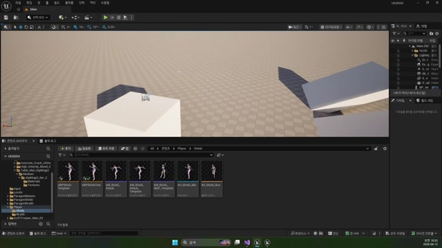

# 260413 01 Mouse Picking과 컨트롤러 세팅

[260413 허브](../) | [다음: 02 스킬 캐스팅](../02_intermediate_skill_casting_marker_and_targeting/)

## 문서 개요

첫 강의의 핵심은 간단하다.
스킬을 월드 특정 위치에 쓰고 싶다면, 먼저 플레이어가 `마우스로 월드 표면을 찍을 수 있어야 한다`.

## 1. Mouse Picking은 게임에서 직접 열어 줘야 한다

에디터에서는 마우스로 오브젝트를 고르는 일이 너무 자연스럽지만, 게임 안에서는 그 흐름을 우리가 직접 준비해야 한다.
그 출발점이 `AMainPlayerController`다.

## 2. 현재 `AMainPlayerController`가 Picking 기반을 준비한다

실제 코드는 아주 짧지만 중요하다.

```cpp
AMainPlayerController::AMainPlayerController()
{
    PrimaryActorTick.bCanEverTick = true;
    bShowMouseCursor = true;
}

void AMainPlayerController::BeginPlay()
{
    Super::BeginPlay();

    FInputModeGameAndUI InputMode;
    SetInputMode(InputMode);
}
```


즉 지정형 스킬을 만들려면 먼저 `커서가 보이는 플레이어`, `게임과 UI 입력을 함께 받는 플레이어` 상태가 되어야 한다.

## 3. `GetHitResultUnderCursor()`가 2D 마우스를 3D 월드 위치로 바꾼다

컨트롤러 `Tick()`은 `GetHitResultUnderCursor()`로 커서 아래 충돌 지점을 읽는다.

```cpp
FHitResult Hit;
bool Pick = GetHitResultUnderCursor(
    ECollisionChannel::ECC_GameTraceChannel5,
    true,
    Hit);
```




이 함수의 핵심은 `화면 좌표`를 직접 쓰는 게 아니라, 그 방향으로 레이를 쏘고 `HitResult`를 얻는 데 있다.
그래서 우리가 진짜로 쓰는 값은 `Hit.ImpactPoint`, `Hit.ImpactNormal`, `Hit.Actor` 같은 월드 충돌 결과다.

## 4. 왜 캐릭터가 아니라 컨트롤러가 Picking을 맡는가

커서, 입력 모드, 화면 좌표 해석은 플레이어 조작 문맥에 더 가깝다.
그래서 컨트롤러가 `월드 위치를 읽는 책임`을 먼저 맡고, 캐릭터는 그 결과를 `어떻게 쓸지`를 결정하는 편이 구조가 깔끔하다.

## 정리

이 편의 핵심은 Mouse Picking이 편의 기능이 아니라, `지정형 스킬`, `클릭 이동`, `월드 선택`처럼 마우스로 월드를 다루는 거의 모든 기능의 바닥이라는 점이다.

[260413 허브](../) | [다음: 02 스킬 캐스팅](../02_intermediate_skill_casting_marker_and_targeting/)
