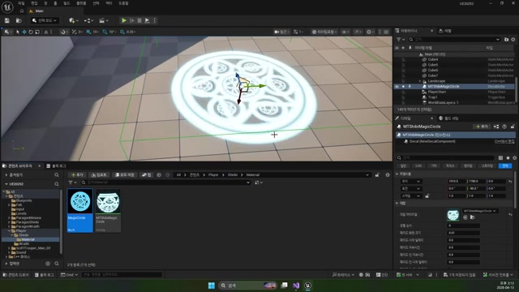

# 260413 02 스킬 캐스팅 마커와 목표 지정

[이전: 01 Mouse Picking](../01_intermediate_mouse_picking_and_controller_setup/) | [260413 허브](../) | [다음: 03 Geometry Collection](../03_intermediate_geometry_collection_editor_workflow/)

## 문서 개요

두 번째 강의는 `Shinbi` 스킬을 `준비 -> 목표 지정 -> 발사` 구조로 바꾸는 파트다.
핵심은 마법진 데칼이 단순한 이펙트가 아니라, 목표 지점 UI이자 상태 플래그라는 점이다.

## 1. `Skill1Casting()`은 마우스 위치에 마법진을 생성한다

현재 `AShinbi::Skill1Casting()`은 마우스 위치를 읽어 `ADecalBase` 마법진을 생성한다.

```cpp
bool Pick = PlayerCtrl->GetHitResultUnderCursor(
    ECollisionChannel::ECC_GameTraceChannel5, true, Hit);

if (Pick)
    DecalLoc = Hit.ImpactPoint;

TObjectPtr<ADecalBase> DecalActor =
    GetWorld()->SpawnActor<ADecalBase>(DecalLoc, FRotator(-90.0, 0.0, 0.0), param);

DecalActor->SetDecalMaterial(TEXT("/Script/Engine.Material'/Game/Player/Shinbi/Material/MTShibiMagicCircle.MTShibiMagicCircle'"));
mMagicCircleActor = DecalActor;
```


이 함수 덕분에 스킬 목표 지점이 플레이어 눈에 바로 보이게 된다.

## 2. `Tick()`이 마법진을 커서 위치로 계속 갱신한다

한 번 찍고 끝나면 지정형 스킬로서 불편하다.
그래서 `AShinbi::Tick()`은 `mMagicCircleActor`가 살아 있는 동안 계속 커서 아래 월드 위치를 읽고, 마법진 위치를 갱신한다.

즉 마법진은 고정 이펙트가 아니라 `현재 타깃 후보`를 보여 주는 인터랙티브 UI에 가깝다.

## 3. `InputAttack()`은 마법진 유무로 평타와 스킬을 분기한다

이번 날짜의 가장 교육적인 부분은 공격 입력이 하나인데도 상태에 따라 행동이 달라진다는 점이다.

```cpp
if (IsValid(mMagicCircleActor))
{
    mAnimInst->PlaySkill1();
    mAnimInst->ClearSkill1();

    FVector Loc = mMagicCircleActor->GetActorLocation() + FVector(0.0, 0.0, 1000.0);
    TObjectPtr<AGeometryActor> SkillActor =
        GetWorld()->SpawnActor<AGeometryActor>(Loc, FRotator::ZeroRotator, Param);

    SkillActor->SetGeometryAsset(TEXT("/Script/GeometryCollectionEngine.GeometryCollection'/Game/Blueprints/GC_SM_PROP_barrel_dungeon_01.GC_SM_PROP_barrel_dungeon_01'"));

    mMagicCircleActor->Destroy();
}
else
{
    mAnimInst->PlayAttack();
}
```

즉 `mMagicCircleActor`는 단순 시각 효과가 아니라, "지금 Shinbi가 스킬 타깃 지정 상태인가"를 나타내는 상태 신호이기도 하다.




## 4. 현재 branch 추적 메모

legacy `AShinbi`는 위 흐름이 꽤 완결돼 있다.
반면 `AShinbiGAS`는 `Skill1()`과 `Skill1Casting()`은 유지되지만, `InputAttack()`의 마법진 확정 분기 일부가 주석 처리된 상태다.

즉 `260413` 교안은 현재도 유효하지만, 지정형 스킬 전체 흐름을 한 번에 보기에는 legacy `AShinbi` 쪽이 더 선명하다.

## 정리

이 편의 핵심은 마법진 데칼이 `목표 지점 미리보기`, `상태 플래그`, `스폰 기준점`을 동시에 맡는다는 점이다.

[이전: 01 Mouse Picking](../01_intermediate_mouse_picking_and_controller_setup/) | [260413 허브](../) | [다음: 03 Geometry Collection](../03_intermediate_geometry_collection_editor_workflow/)
