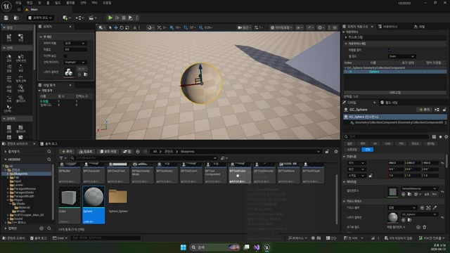
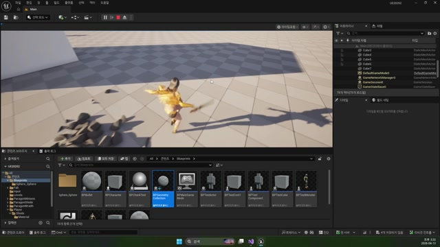

# 260413 03 Geometry Collection 에디터 워크플로

[이전: 02 스킬 캐스팅](../02_intermediate_skill_casting_marker_and_targeting/) | [260413 허브](../) | [다음: 04 GeometryCollection C++](../04_intermediate_geometry_collection_cpp_and_external_strain/)

## 문서 개요

세 번째 강의는 `Geometry Collection`을 에디터 관점에서 이해하는 파트다.
핵심은 부서지는 메시가 단순 스태틱 메시가 아니라, `깨지기 위한 데이터 구조`라는 점을 받아들이는 데 있다.

## 1. Geometry Collection은 파괴용 데이터 구조다

일반 메시를 숨기고 파티클만 뿌리는 것과 달리, Geometry Collection은 `어떤 조각이 어느 수준에서 어떤 힘으로 분리될지`를 데이터로 가진다.
즉 파괴 연출의 바닥은 C++보다 먼저 `에디터 자산 설계`에 있다.

## 2. Fracture 편집은 "어떻게 깨질지"를 미리 설계하는 과정이다

Fracture 모드에서 하는 일은 대략 아래와 같다.

- 기존 메시를 기반으로 Geometry Collection 생성
- 조각 분할 방식 결정
- 내부 단면 머티리얼 설정
- 파괴 레벨과 임계값 조절

즉 Geometry Collection은 런타임 코드보다 먼저 `깨질 자산을 설계하는 과정`이 선행되어야 한다.

## 3. `Damage Threshold`와 `Collision Damage`가 파괴 감각을 결정한다

값이 너무 낮으면 스스로 우수수 깨지고, 너무 높으면 맞아도 거의 반응하지 않는다.
그래서 Geometry Collection은 조각 수만 보는 게 아니라, `언제 깨질 것인가`까지 같이 조절해야 한다.

간단히 보면 이렇게 읽으면 된다.

- `Fracture`: 어떤 모양으로 나눌까
- `Threshold`: 얼마나 강한 힘에 깨질까
- `Collision Damage`: 충돌이 실제 파괴 계산에 들어갈까

## 4. 이번 날짜에서 Geometry Collection이 필요한 이유

`260413`의 위치 기반 스킬은 단순 데미지 판정보다, `월드 특정 위치에 무언가가 떨어지고 실제로 부서지는 연출`을 보여 주려는 목적이 크다.

즉 파이프라인은 이렇게 이어진다.

`Pick 위치 결정 -> 마법진으로 표시 -> 스킬 액터 생성 -> 런타임 파괴`

## 정리

이 편의 핵심은 Geometry Collection이 단순히 "깨지는 메시"가 아니라, `위치 기반 스킬의 결과를 물리 기반 파괴로 바꾸는 데이터 구조`라는 점이다.

[이전: 02 스킬 캐스팅](../02_intermediate_skill_casting_marker_and_targeting/) | [260413 허브](../) | [다음: 04 GeometryCollection C++](../04_intermediate_geometry_collection_cpp_and_external_strain/)
