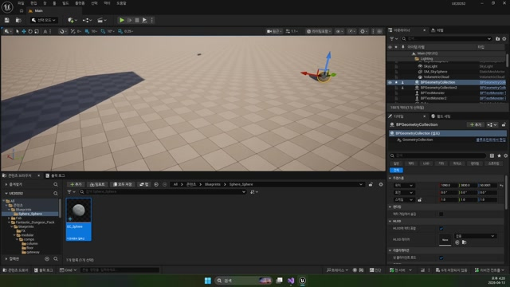

# 260413 04 GeometryCollection C++와 External Strain

[이전: 03 Geometry Collection](../03_intermediate_geometry_collection_editor_workflow/) | [260413 허브](../) | [다음: 05 현재 프로젝트 C++](../05_appendix_current_project_cpp_reference/)

## 문서 개요

네 번째 강의는 Geometry Collection을 C++ 액터와 연결하는 파트다.
모듈 의존성, 자산 로딩, 충돌 이벤트, `ApplyExternalStrain()`이 한 세트로 맞아야 런타임 파괴가 열린다.

## 1. 모듈 의존성부터 맞춰야 한다

현재 `UE20252.Build.cs`에는 아래 모듈이 들어 있다.

- `GeometryCollectionEngine`
- `Chaos`
- `FieldSystemEngine`

그리고 현재 branch 기준으로는 `Niagara`도 함께 포함돼 있다.
즉 파괴 시스템은 헤더 몇 줄보다 `모듈 레벨 의존성`을 먼저 맞춰야 컴파일과 런타임이 안정된다.

## 2. `AGeometryActor`는 파괴 가능한 스킬 결과물을 담는 액터다

구조는 의외로 단순하다.

```cpp
UPROPERTY(VisibleAnywhere, BlueprintReadOnly)
TObjectPtr<UGeometryCollectionComponent> mGeometry;

void SetGeometryAsset(const FString& Path);

UFUNCTION()
void GeometryHit(UPrimitiveComponent* HitComponent, AActor* OtherActor,
    UPrimitiveComponent* OtherComp, FVector NormalImpulse, const FHitResult& Hit);
```

즉 핵심 컴포넌트 하나와, 자산 연결 함수 하나, 충돌 반응 함수 하나만 있으면 기본 예제는 충분히 설명된다.

## 3. `SetRestCollection()`이 실제 파괴 자산을 연결한다

`SetGeometryAsset()`은 문자열 경로로 `UGeometryCollection`을 읽어 와 `SetRestCollection()`에 넘긴다.

```cpp
TObjectPtr<UGeometryCollection> Geometry =
    LoadObject<UGeometryCollection>(nullptr, Path);

mGeometry->SetRestCollection(Geometry);
```


즉 이 액터의 본질은 "깨질 수 있는 컬렉션 자산을 들고 있다"는 데 있다.

## 4. `OnComponentHit`와 `ApplyExternalStrain()`이 실제 파괴를 연다

`BeginPlay()`에서 `OnComponentHit`를 바인딩하고, `GeometryHit()` 안에서 실제 파괴 힘을 넣는다.

```cpp
int32 ItemIndex = 0;

if (Hit.Item != -1)
{
    ItemIndex = Hit.Item;
}

mGeometry->ApplyExternalStrain(
    ItemIndex,
    Hit.ImpactPoint,
    50.f,
    1,
    1.f,
    1500000.f);
```


여기서 핵심은 아래 네 가지다.

1. `Hit.Item`으로 어느 조각이 맞았는지 읽는다.
2. `Hit.ImpactPoint`로 힘을 넣을 위치를 정한다.
3. 반경, 레벨, 전파 비율로 파괴 감각을 조절한다.
4. 힘 크기로 실제 파괴 문턱을 넘긴다.



## 정리

이 편의 핵심은 Geometry Collection C++ 연동이 단순 컴포넌트 추가가 아니라, `의존성 -> 자산 연결 -> 충돌 이벤트 -> strain 적용`까지 한 번에 맞춰야 성립한다는 점이다.

[이전: 03 Geometry Collection](../03_intermediate_geometry_collection_editor_workflow/) | [260413 허브](../) | [다음: 05 현재 프로젝트 C++](../05_appendix_current_project_cpp_reference/)
