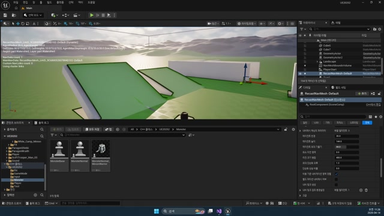

# 260414 02 AIController, AIPerception, NavMesh

[260414 허브](../) | [이전: 01 MonsterBase와 Pawn 구조](../01_intermediate_monsterbase_and_pawn_structure/) | [다음: 03 Behavior Tree, Blackboard, MonsterState, DataTable](../03_intermediate_behaviortree_blackboard_monsterstate_and_datatable/)

## 문서 개요

두 번째 강의는 몬스터가 월드 위를 움직이고, 적을 감지하고, 그 사실을 AI 쪽으로 넘길 수 있게 만드는 단계다.

## 1. `NavMesh`는 AI 이동의 전제 조건이다

비헤이비어 트리나 시야 설정보다 먼저 필요한 것은 `AI가 걸을 수 있는 길`이다.
그래서 강의는 먼저 레벨에 `Nav Mesh Bounds Volume`을 배치한다.




이 초록색 영역은 단순 디버그 색이 아니라, `AI가 현재 이동 가능한 공간`을 뜻한다.
즉 `260414`의 몬스터는 애니메이션보다 먼저 `어디까지 이동 가능한가`부터 확인하는 구조로 출발한다.

## 2. `AMonsterController`가 감각과 판단의 입구가 된다

몬스터 본체가 준비되면, 그 위에 올라가는 AI 두뇌는 `AMonsterController`다.
생성자에서 바로 `Perception`과 `Sight`를 준비한다.

```cpp
mAIPerception = CreateDefaultSubobject<UAIPerceptionComponent>(TEXT("Perception"));
SetPerceptionComponent(*mAIPerception);

mSightConfig = CreateDefaultSubobject<UAISenseConfig_Sight>(TEXT("Sight"));
mSightConfig->SightRadius = 800.f;
mSightConfig->LoseSightRadius = 800.f;
mSightConfig->PeripheralVisionAngleDegrees = 180.f;

mSightConfig->DetectionByAffiliation.bDetectEnemies = true;
mSightConfig->DetectionByAffiliation.bDetectNeutrals = true;
mSightConfig->DetectionByAffiliation.bDetectFriendlies = false;

mAIPerception->ConfigureSense(*mSightConfig);
mAIPerception->SetDominantSense(mSightConfig->GetSenseImplementation());
mAIPerception->OnTargetPerceptionUpdated.AddDynamic(this, &AMonsterController::OnTarget);
```


이 코드에서 읽어야 할 포인트는 아래다.

- `UAIPerceptionComponent`: AI 감각 묶음
- `UAISenseConfig_Sight`: 그중 시야 감각 설정
- `DetectionByAffiliation`: 누구를 적/중립/아군으로 볼지
- `OnTargetPerceptionUpdated`: 감지 결과가 바뀔 때 호출되는 이벤트

즉 `MonsterController`는 단순 이동 명령기가 아니라, `누가 보였는가`를 AI 구조 안으로 번역하는 클래스다.

## 3. `OnTarget()`이 Perception과 Blackboard를 잇는다

감각이 실제 행동 구조로 넘어가는 접점은 `OnTarget()`이다.

```cpp
void AMonsterController::OnTarget(AActor* Actor, FAIStimulus Stimulus)
{
    if (!IsValid(mAITree) || !Blackboard)
        return;

    AMonsterBase* Monster = GetPawn<AMonsterBase>();
    if (!IsValid(Monster))
        return;

    if (Stimulus.WasSuccessfullySensed())
    {
        Blackboard->SetValueAsObject(TEXT("Target"), Actor);
        Monster->DetectTarget(true);
    }
    else
    {
        Blackboard->SetValueAsObject(TEXT("Target"), nullptr);
        Monster->DetectTarget(false);
    }
}
```

이 함수가 중요한 이유는 세 층을 한 번에 묶기 때문이다.

- `Perception`: 누가 보였는가
- `Blackboard`: 그 사실을 AI 기억 공간에 저장한다
- `MonsterBase::DetectTarget()`: 실제 이동 속도와 반응을 바꾼다

즉 `260414`는 감지를 로그로 끝내지 않고, `타깃 감지 -> 블랙보드 갱신 -> 몬스터 상태 변화`까지 이어지는 첫 연결점을 만든다.

## 4. 현재 branch의 `AMonsterGASController`도 거의 같은 모양을 유지한다

지금 저장소의 `AMonsterGASController`를 보면 구조가 놀랄 만큼 비슷하다.
`Perception`, `SightRadius`, `DetectionByAffiliation`, `OnTarget()` 패턴이 거의 그대로 유지된다.

즉 현재 branch에서도 이 날짜의 핵심은 변하지 않는다.
달라진 것은 공격과 수치 처리 계층이지, `감지 -> 타깃 갱신` 구조 자체는 그대로다.

## 정리

두 번째 강의의 본질은 몬스터를 "움직이는 오브젝트"에서 `감지하고 반응하는 AI`로 바꾸는 데 있다.
이후 `Blackboard`, `Behavior Tree`, `AttackTarget` 논리가 전부 이 감지 구조 위에 쌓인다.

[260414 허브](../) | [이전: 01 MonsterBase와 Pawn 구조](../01_intermediate_monsterbase_and_pawn_structure/) | [다음: 03 Behavior Tree, Blackboard, MonsterState, DataTable](../03_intermediate_behaviortree_blackboard_monsterstate_and_datatable/)
