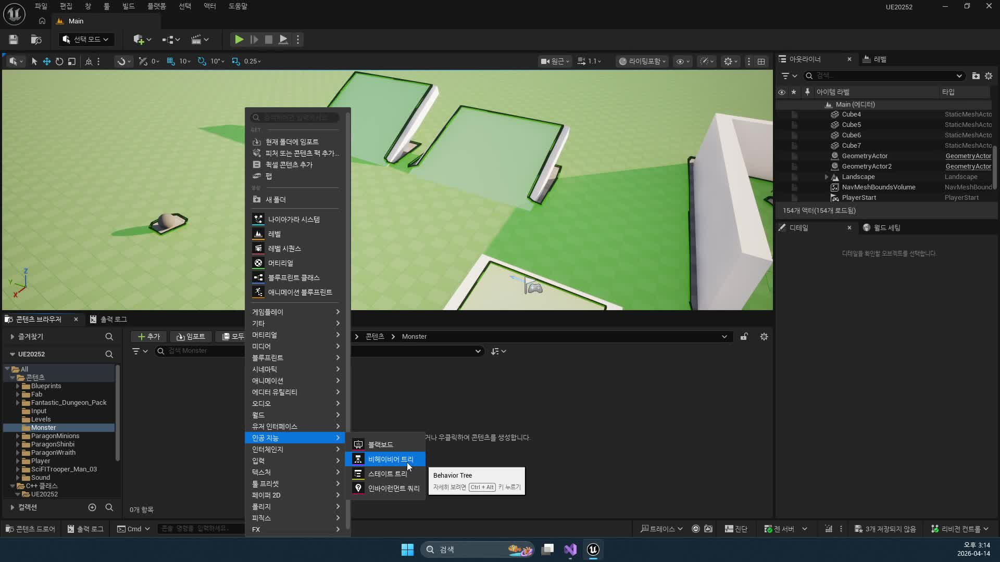
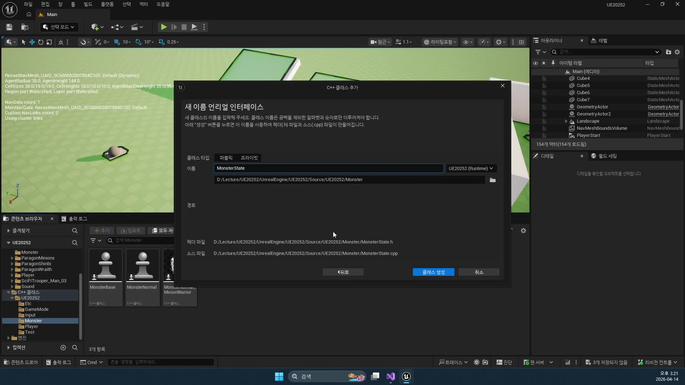

# 260414 03 Behavior Tree, Blackboard, MonsterState, DataTable

[260414 허브](../) | [이전: 02 AIController, AIPerception, NavMesh](../02_intermediate_aicontroller_perception_and_navmesh/) | [다음: 04 AssetManager와 데이터 로딩](../04_intermediate_assetmanager_and_data_loading/)

## 문서 개요

세 번째 강의는 몬스터 AI가 `무엇을 기억하고`, `어떤 기준으로 행동을 고를지`, `그 기준이 되는 능력치를 어디에 둘지`를 정리하는 단계다.

## 1. `Blackboard`는 기억 공간이고 `Behavior Tree`는 실행 구조다

강의에서 중요한 것은 트리 모양 자체보다 `Blackboard`의 역할이다.
블랙보드는 AI가 계속 읽고 쓰는 기억 공간이고, 비헤이비어 트리는 그 기억을 바탕으로 다음 행동을 결정하는 실행 구조다.



현재 프로젝트 기준으로 보면 `BB_Monster_Base`에는 `SelfActor`, `DetectRange`, `Target`, `AttackTarget`, `AttackEnd`, `WaitTime` 같은 핵심 키가 들어 있다.
그리고 `BT_Monster_Normal`은 이 키를 읽어 `전투`와 `비전투` 브랜치를 나눈다.

즉 이 날짜의 핵심은 "BT를 그린다"가 아니라, `BT가 읽을 수 있는 기억 체계`를 만든다는 데 있다.

## 2. `MonsterState`는 몬스터 공통 상태를 한곳으로 묶는다

강의는 몹마다 다른 수치를 클래스마다 흩뿌리지 않고, 공통 상태 계층으로 한 번 묶는다.



이 계층에 모이는 대표 값은 아래다.

- `Attack`
- `Defense`
- `HP`, `HPMax`
- `WalkSpeed`, `RunSpeed`
- `DetectRange`
- `AttackDistance`

이 설계 덕분에 태스크나 AI 쪽 코드는 "지금 어떤 몬스터 클래스인가"를 깊게 알 필요 없이, `공통 상태에서 필요한 수치만 읽는 방식`으로 정리된다.

## 3. 현재 branch에서는 이 공통 상태 레이어가 `AttributeSet`으로 확장됐다

현재 저장소에선 `MonsterState`가 맡던 역할의 상당 부분이 `UBaseAttributeSet`과 `UMonsterAttributeSet`으로 옮겨 갔다.

```cpp
class UE20252_API UMonsterAttributeSet : public UBaseAttributeSet
{
protected:
    FGameplayAttributeData DetectRange;
};
```

즉 예전 강의의 설계 포인트는 사라진 것이 아니다.
단지 `몬스터 객체 안 float 묶음`이던 공통 상태가, 지금은 `ASC가 함께 다루는 AttributeSet`으로 수납 위치를 바꾼 것이다.

## 4. `FMonsterInfo`와 `DT_MonsterInfo`가 클래스 밖에서 몬스터 성격을 결정한다

`FMonsterInfo`는 몬스터 이름, 공격력, 방어력, 체력, 이동 속도, 감지 거리, 공격 거리 같은 값을 한데 묶는 데이터 구조다.
그리고 그 실제 값은 `DT_MonsterInfo`에서 공급된다.


이 구조가 중요한 이유는 분명하다.

- 파생 클래스는 외형과 애님, 데이터 행 이름을 정한다.
- 실제 전투 성격은 데이터 테이블이 정한다.

예를 들어 같은 몬스터 계열이라도 `AttackDistance`나 `DetectRange`만 다르게 주면 전혀 다른 전투 성격을 만들 수 있다.

## 5. Behavior Tree는 결국 데이터가 들어와야 의미를 가진다

비헤이비어 트리와 블랙보드 자산만 만들어 두면 아직은 빈 골격에 가깝다.
실제 의미는 `MonsterState`와 `FMonsterInfo`가 값을 공급할 때 생긴다.

즉 `260414`의 세 번째 강의는 아래 네 층을 한 번에 연결하는 과정이다.

- `Blackboard`: 기억 공간
- `Behavior Tree`: 행동 실행 구조
- `MonsterState` 또는 `AttributeSet`: 런타임 상태 저장소
- `FMonsterInfo`와 `DT_MonsterInfo`: 데이터 원본

## 정리

세 번째 강의의 본질은 몬스터 AI가 읽을 `기억`, `상태`, `데이터 원본`을 분리해 놓는 데 있다.
이 분리가 있어야 다음 날짜의 `PossessedBy()`, `Patrol`, `AttackTarget`, `GAS 능력 적용`까지 자연스럽게 이어진다.

[260414 허브](../) | [이전: 02 AIController, AIPerception, NavMesh](../02_intermediate_aicontroller_perception_and_navmesh/) | [다음: 04 AssetManager와 데이터 로딩](../04_intermediate_assetmanager_and_data_loading/)
