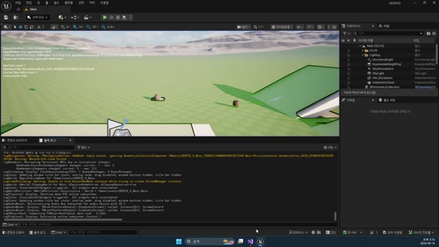

# 260414 04 AssetManager와 데이터 로딩

[260414 허브](../) | [이전: 03 Behavior Tree, Blackboard, MonsterState, DataTable](../03_intermediate_behaviortree_blackboard_monsterstate_and_datatable/) | [다음: 05 공식 문서 부록](../05_appendix_official_docs_reference/)

## 문서 개요

네 번째 강의는 앞에서 만든 몬스터 데이터를 프로젝트 전체에서 안정적으로 공급하는 구조를 만든다.
핵심 키워드는 `PrimaryDataAsset`, `AssetManager`, `GameInstanceSubsystem`이다.

## 1. 왜 `DataTable`만 직접 읽고 끝내지 않는가

강의는 `LoadObject`로 데이터 테이블을 즉시 여는 단순 구조 대신, `PrimaryDataAsset`을 한 번 감싸고 `AssetManager`를 통해 접근하는 길을 선택한다.


이렇게 하면 얻는 장점이 있다.

- 데이터 접근 창구를 한곳으로 모을 수 있다
- 로딩 시점을 제어하기 쉽다
- 프로젝트가 커져도 참조 구조를 관리하기 좋다

즉 `260414`는 단순히 테이블을 쓰는 법이 아니라, `프로젝트 수준의 데이터 공급 구조`를 열어 주는 날짜다.

## 2. `UAssetGameInstanceSubsystem`이 중앙 로딩 창구가 된다

현재 프로젝트에선 `UAssetGameInstanceSubsystem`이 몬스터 데이터 로딩의 중심이다.

```cpp
void UAssetGameInstanceSubsystem::Initialize(FSubsystemCollectionBase& Collection)
{
    Super::Initialize(Collection);
    LoadMonsterData();
}

void UAssetGameInstanceSubsystem::LoadMonsterData()
{
    UAssetManager& AssetMgr = UAssetManager::Get();
    FPrimaryAssetId AssetId(TEXT("MonsterInfoTableAsset"), TEXT("PDA_MonsterInfo"));

    AssetMgr.LoadPrimaryAsset(
        AssetId,
        TArray<FName>{},
        FStreamableDelegate::CreateUObject(
            this, &UAssetGameInstanceSubsystem::MonsterInfoLoadComplete, AssetId));
}
```


이 흐름을 짧게 정리하면 아래와 같다.

1. 게임이 시작되면 서브시스템이 로딩을 건다.
2. `PDA_MonsterInfo`를 `PrimaryAssetId`로 찾는다.
3. 로딩이 끝나면 콜백에서 실제 데이터 테이블을 잡는다.
4. 각 몬스터는 그 테이블에서 자기 `mDataName` 행을 찾아 능력치를 받는다.

## 3. 로딩 완료 시점도 시스템 안에서 처리한다

중요한 점은 "언제 로딩이 끝났는가"도 구조 안에서 관리한다는 것이다.

```cpp
void UAssetGameInstanceSubsystem::MonsterInfoLoadComplete(FPrimaryAssetId LoadId)
{
    TObjectPtr<UObject> LoadObject = UAssetManager::Get().GetPrimaryAssetObject(LoadId);
    TObjectPtr<UMonsterInfoTableAsset> DataAsset = Cast<UMonsterInfoTableAsset>(LoadObject);

    if (!DataAsset)
        return;

    mMonsterInfoTable = DataAsset->mTable.LoadSynchronous();

    if (!mMonsterInfoTable)
        return;

    mMonsterInfoLoadDelegate.Broadcast();
}
```



즉 서브시스템은 단순히 테이블 포인터만 들고 있는 게 아니라, `이제 몬스터들이 데이터를 써도 된다`는 시점을 전체에 알려 주는 역할까지 맡는다.

## 4. `MonsterBase`는 데이터가 아직 없을 수도 있음을 전제로 짜여 있다

`AMonsterBase::BeginPlay()`를 보면 이 날짜의 설계 감각이 잘 드러난다.

```cpp
const FMonsterInfo* Info = AssetSubSystem->FindMonsterInfo(mDataName);

if (!Info)
{
    AssetSubSystem->mMonsterInfoLoadDelegate.AddUObject(
        this, &AMonsterBase::MonsterInfoLoadComplete);
    return;
}

MonsterInfoLoadComplete();
```

즉 코드는 "데이터는 이미 있을 것"이라고 단정하지 않는다.
없으면 기다렸다가 나중에 초기화를 이어 간다.

이 태도 덕분에 `MonsterBase`와 `AssetManager` 사이가 느슨하게 연결되고, 초기화 순서가 조금 복잡해져도 구조가 버틴다.

## 5. 현재 branch에선 이 데이터가 `AttributeSet`으로 들어간다

지금 저장소의 `AMonsterGAS::MonsterInfoLoadComplete()`를 보면 같은 개념이 한 단계 확장돼 있다.
예전엔 `mAttack`, `mHP`, `mDetectRange` 같은 멤버에 직접 복사했다면, 현재는 `UMonsterAttributeSet`으로 값을 밀어 넣는다.

즉 `260414`가 만든 구조는 지금도 그대로 중요하다.
`DataTable -> 중앙 로딩 -> 몬스터 초기화`라는 흐름이 있어야 이후 `GameplayAbility_Attack`, `GameplayEffect_Damage`, `MonsterGAS` 전투 구조도 자연스럽게 올라간다.

## 정리

네 번째 강의의 핵심은 몬스터 데이터를 "읽는 법"이 아니라, `프로젝트 차원에서 공급하는 법`을 배우는 데 있다.
이 구조 덕분에 몬스터는 데이터 테이블 행 이름만 알고 있어도, 필요한 능력치를 안정적으로 받아 갈 수 있다.

[260414 허브](../) | [이전: 03 Behavior Tree, Blackboard, MonsterState, DataTable](../03_intermediate_behaviortree_blackboard_monsterstate_and_datatable/) | [다음: 05 공식 문서 부록](../05_appendix_official_docs_reference/)
