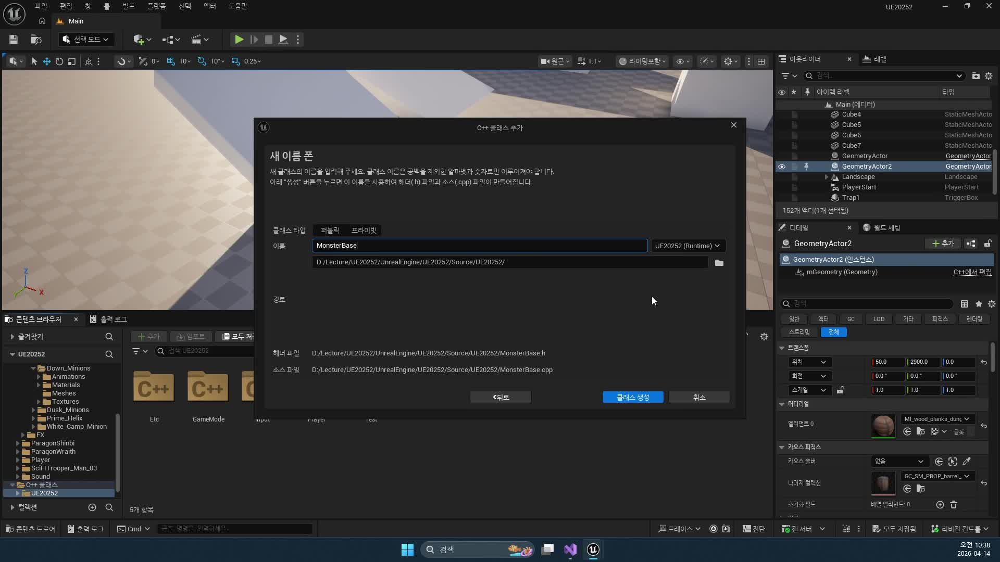
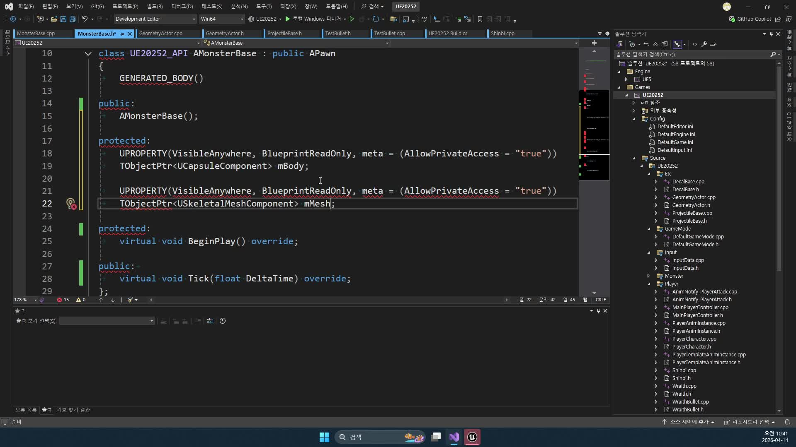
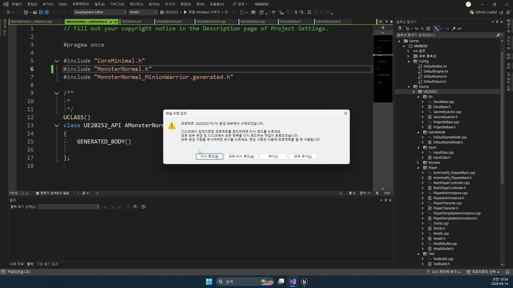
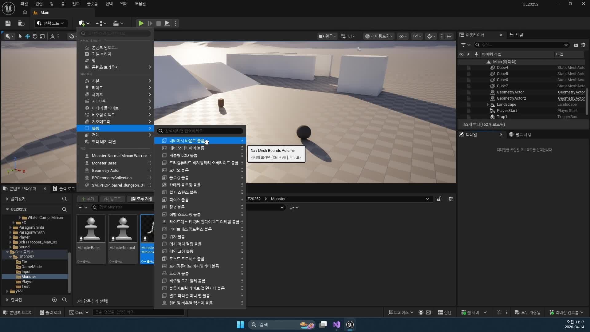
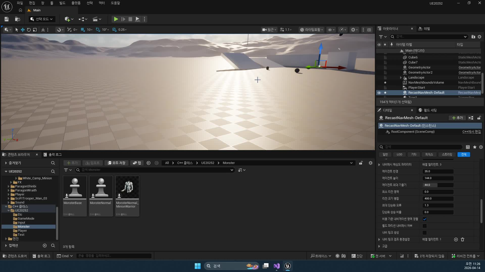
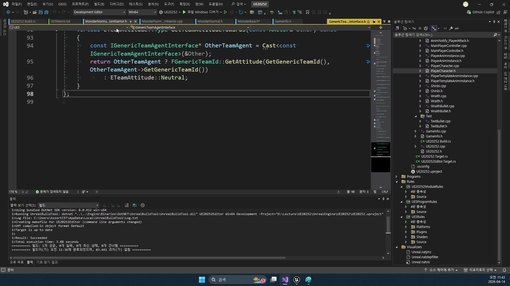
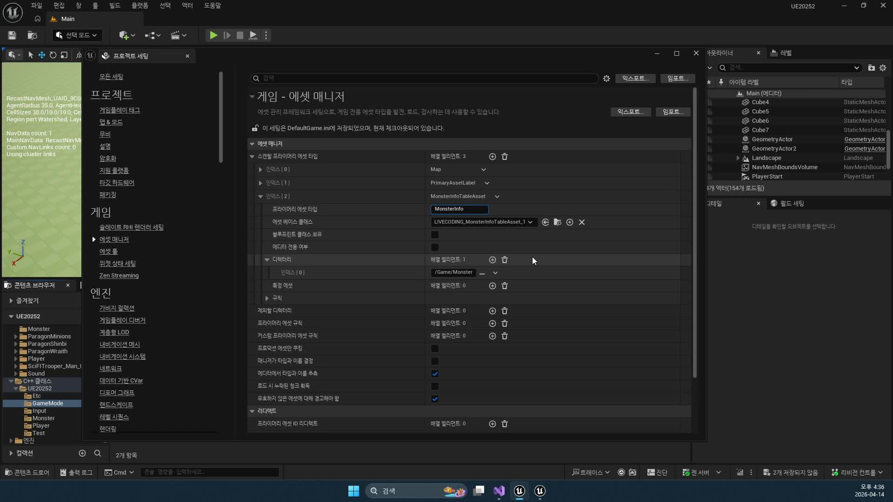
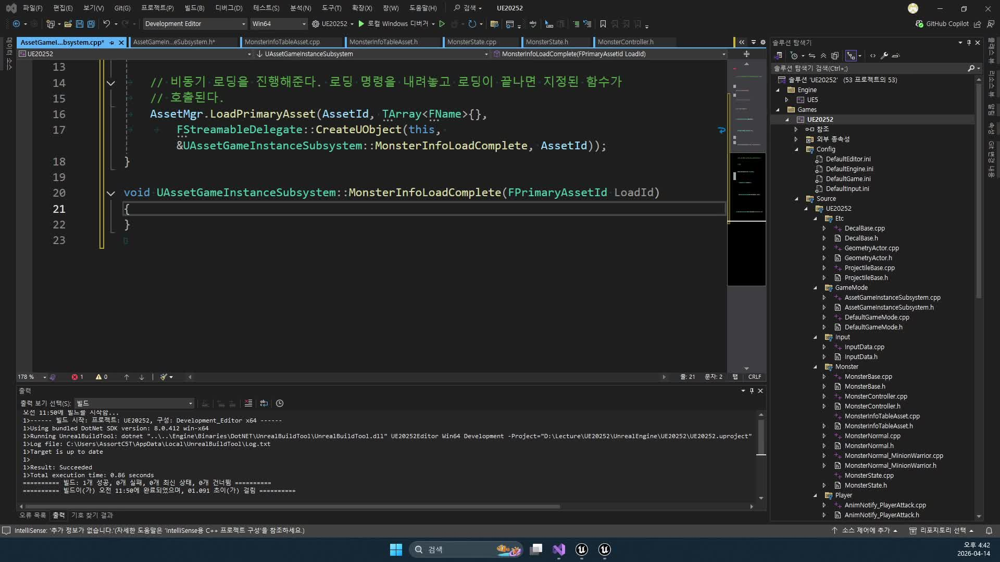

# 260414 몬스터 본체, 감지, 비헤이비어 트리, 블랙보드, 데이터 관리까지 AI 기반을 세우는 날

## 문서 개요

이 문서는 `260414_1`부터 `260414_4`까지의 강의를 하나의 연속된 교재로 다시 엮은 것이다.
이번 날짜의 핵심은 몬스터 AI를 "행동"부터 만들지 않고, 그 행동이 올라갈 바닥 구조를 먼저 세우는 데 있다.

강의 흐름을 한 줄로 요약하면 다음과 같다.

`MonsterBase -> AIController / Perception -> Behavior Tree / Blackboard -> DataTable -> AssetManager`

즉 이 날의 수업은 전투 연출이나 애니메이션보다 앞단에 있는 기반 설계에 집중한다.
몬스터를 어떤 부모 클래스로 만들지, 네비게이션 위를 어떻게 움직이게 할지, 적을 감지하면 어떤 컨트롤러가 블랙보드를 갱신할지, 능력치 데이터는 어디에 두고 어떤 방식으로 읽어 올지를 차례대로 연결한다.

이 교재는 아래 네 자료를 함께 대조해 작성했다.

- `D:\UE_Academy_Stduy_compressed`의 원본 영상 및 자막
- 원본 영상에서 다시 추출한 대표 장면 캡처
- `D:\UnrealProjects\UE_Academy_Stduy\Source\UE20252`의 실제 C++ 소스
- `D:\UnrealProjects\UE_Academy_Stduy\Saved\AcademyUtility`의 블루프린트 / 데이터 / 소스 덤프
- Epic Developer Community의 언리얼 공식 문서

## 학습 목표

- `MonsterBase`를 `Character`가 아니라 `Pawn`으로 시작한 이유를 설명할 수 있다.
- `AIController`, `AIPerception`, `NavMesh`가 각각 어떤 책임을 가지는지 구분할 수 있다.
- `Behavior Tree`, `Blackboard`, `MonsterState`, `FMonsterInfo`, `DT_MonsterInfo`의 역할을 연결해서 말할 수 있다.
- `AssetManager`와 `GameInstanceSubsystem`을 이용해 몬스터 데이터를 비동기로 읽는 흐름을 정리할 수 있다.
- `Behavior Tree`, `Blackboard`, `AI Perception`, `Data Driven Gameplay`, `Asset Management` 공식 문서가 왜 `260414`와 직접 연결되는지 설명할 수 있다.
- `MonsterBase::BeginPlay()`, `MonsterNormal::PossessedBy()`, `MonsterController::OnTarget()`, `AssetGameInstanceSubsystem::MonsterInfoLoadComplete()`가 실제 프로젝트에서 어떻게 이어지는지 설명할 수 있다.

## 강의 흐름 요약

1. 몬스터는 `Pawn`을 기반으로 직접 컴포넌트를 조립하고, AI가 빙의되기 쉬운 구조를 먼저 만든다.
2. 레벨에는 `Nav Mesh Bounds Volume`을 배치하고, `MonsterController`는 시야 감각과 타겟 갱신 로직을 맡는다.
3. 몬스터 능력치와 상태는 `Blackboard`, `MonsterState`, `FMonsterInfo`, `DT_MonsterInfo`를 통해 정리된다.
4. 마지막으로 `PrimaryDataAsset`, `AssetManager`, `AssetGameInstanceSubsystem`을 이용해 데이터 테이블을 중앙에서 로드한다.
5. 언리얼 공식 문서를 통해 `Behavior Tree`, `Blackboard`, `AI Perception`, 데이터 중심 설계, 에셋 로딩 구조가 엔진 표준 용어로 어떻게 정리되는지 확인한다.
6. 현재 프로젝트 C++ 코드를 읽으며, 위 구조가 `MonsterBase`, `MonsterController`, `MonsterNormal`, `AssetGameInstanceSubsystem` 안에서 어떻게 하나의 AI 기반으로 이어지는지 확인한다.

---

## 제1장. MonsterBase: Pawn으로 시작하는 몬스터 본체

### 1.1 왜 Character가 아니라 Pawn인가

첫 강의의 중요한 판단은 몬스터를 `ACharacter`로 시작하지 않는다는 점이다.
`Character`는 이미 이동, 캡슐, 메시, 캐릭터 무브먼트 같은 요소를 풍부하게 제공하지만, 그만큼 기본 전제가 많다.
이번 강의는 몬스터 AI를 학습하는 과정이므로, 어떤 컴포넌트가 왜 필요한지 직접 조립하며 이해하는 편이 더 낫다고 본다.

그래서 `MonsterBase`는 `Pawn`을 상속하고, 필요한 것만 명시적으로 붙인다.
이 선택 덕분에 이후 강의에서 `UCapsuleComponent`, `USkeletalMeshComponent`, `UFloatingPawnMovement`의 역할을 각각 분리해서 볼 수 있다.



### 1.2 Body, Mesh, Movement를 직접 조립하는 구조

실제 소스를 보면 `MonsterBase`는 다음과 같이 몬스터 본체를 구성한다.

- `mBody`: 충돌과 피격 기준이 되는 캡슐
- `mMesh`: 실제 스켈레탈 메시
- `mMovement`: `Pawn`을 이동시키는 최소 이동 컴포넌트

```cpp
// 실제 몸통 충돌을 담당할 캡슐
mBody = CreateDefaultSubobject<UCapsuleComponent>(TEXT("Body"));
SetRootComponent(mBody);

// 보이는 몬스터 외형 메시
mMesh = CreateDefaultSubobject<USkeletalMeshComponent>(TEXT("Mesh"));
mMesh->SetupAttachment(mBody);

// Pawn이 스스로 움직일 수 있게 해 주는 이동 컴포넌트
mMovement = CreateDefaultSubobject<UFloatingPawnMovement>(TEXT("Movement"));
mMovement->SetUpdatedComponent(mBody);
```

강의에서 이 구성이 중요한 이유는 몬스터를 "보이는 모델"이 아니라 "움직이고 감지되는 엔티티"로 다시 이해하게 만들기 때문이다.
`Mesh`만 있으면 장면에는 보이지만, 충돌이 없으면 공격 판정과 탐색 기준이 흔들린다.
반대로 `Body`만 있고 메시가 없으면 디버깅 객체에 가깝다.
이 둘 위에 `Movement`가 올라가야 비로소 AI가 월드 안에서 이동하는 주체가 된다.

현재 코드 기준으로는 여기에 두 가지 설정이 더 중요하다.
`mMesh`는 기본적으로 `NoCollision`이라 피격과 이동 기준이 되지 않고, 실제 물리적 본체는 `mBody` 쪽에 `Monster` 프로파일로 정리된다.
즉 이 구조는 `Character`처럼 메시와 캡슐이 묶여 있다고 가정하지 않고, "몸체는 캡슐, 시각 표현은 메시"를 분리해서 학습하게 만든다.



### 1.3 네비게이션을 오염시키지 않는 기본 설정

강의 중간에 지나가듯 언급되지만 실제로 매우 중요한 설정이 있다.
바로 몬스터의 캡슐이 네비게이션 생성에 영향을 주지 않게 하는 부분이다.

```cpp
// 몸통 캡슐이 내비게이션 계산에 영향을 주지 않게 한다.
mBody->SetCanEverAffectNavigation(false);
// 이 몬스터를 조종할 AIController 클래스
AIControllerClass = AMonsterController::StaticClass();
// 월드에 놓이거나 스폰되면 자동으로 AI가 붙게 한다.
AutoPossessAI = EAutoPossessAI::PlacedInWorldOrSpawned;
// 컨트롤러가 돌면 몬스터 몸도 같이 돌게 한다.
bUseControllerRotationYaw = true;
```

여기에는 네 가지 핵심 판단이 들어 있다.

- 몬스터 자신은 길을 찾는 주체이지, NavMesh를 다시 굽는 장애물로 다루지 않는다.
- 몬스터는 `AMonsterController`가 빙의하는 구조를 기본값으로 가진다.
- 레벨 배치든 런타임 스폰이든 AI가 자동으로 붙도록 한다.
- 회전은 컨트롤러가 잡고, 몬스터 본체는 그 회전을 따른다.

여기에 현재 저장소는 `MonsterBase`와 `MonsterController` 양쪽 모두에 `TeamMonster`를 넣어 팀 판정을 통일한다.
즉 이 장의 기반 설정은 단순히 "움직이는 몬스터"를 만드는 것이 아니라, 이후 Perception과 AI 적대 판정까지 바로 이어질 준비를 마치는 단계다.



이 장면은 나중에 디버깅할 때도 매우 중요하다.
NavMesh가 이상하게 다시 계산되거나, 몬스터가 생성됐는데 움직이지 않거나, 정면 회전이 어색할 때 대부분 이 초기 설정으로 다시 돌아오게 된다.

### 1.4 MonsterBase는 이후 모든 장의 공통 기반이다

이 시점에서는 아직 전투도, 순찰도, 추적도 완성되지 않았다.
하지만 `MonsterBase`가 먼저 단단하게 서 있기 때문에 이후 장에서 올라가는 모든 AI 로직이 안정적으로 붙을 수 있다.

현재 프로젝트에서는 이 기반 클래스가 파생 몬스터에서 실제로 어떻게 완성되는지도 확인할 수 있다.
`MonsterNormal_MinionWarrior`, `MonsterNormal_MinionGunner`는 각자 생성자에서 스켈레탈 메시와 애님 블루프린트를 지정하고, `mDataName`을 `MinionWarrior`, `MinionGunner`로 설정한다.
즉 `MonsterBase`는 공통 뼈대이고, 파생 클래스는 외형과 데이터 행 이름을 꽂아 넣는 구조라고 이해하면 된다.

정리하면 `MonsterBase`는 단순한 부모 클래스가 아니라 다음 요소를 한 번에 묶는 기반 클래스다.

- 월드 안에서 움직이는 폰
- AIController가 빙의되는 대상
- 메시와 충돌을 가진 전투 엔티티
- 이후 데이터 테이블 값을 주입받는 런타임 객체

### 1.5 장 정리

제1장의 결론은 단순하다.
몬스터 AI를 잘 만들려면 행동 트리보다 먼저 몬스터 본체의 책임을 명확하게 만들어야 한다.
이번 강의는 `Pawn` 기반 조립을 통해 그 바닥을 깔고 있다.

---

## 제2장. AIController와 AIPerception: 움직이고 인식하는 기반

### 2.1 NavMesh는 AI 이동을 위한 전제 조건이다

두 번째 강의에서 가장 먼저 확인하는 것은 코드가 아니라 레벨 환경이다.
AI가 이동하려면 엔진은 먼저 "어디를 걸을 수 있는지"를 알아야 하고, 그 정보가 바로 `NavMesh`다.

강의에서는 `Nav Mesh Bounds Volume`을 레벨에 배치하고, `P` 키를 눌러 초록색 영역으로 이동 가능 범위를 시각화한다.
이 과정은 단순한 엔진 기능 소개가 아니라, 이후 `MoveToLocation`, `MoveToActor`가 왜 실패하는지를 추적하는 첫 번째 디버깅 단계다.





NavMesh를 볼 때 같이 점검해야 할 항목은 다음과 같다.

- 몬스터가 실제로 서 있는 바닥이 초록 영역 안에 있는가
- 목표 지점도 네비게이션 영역에 포함되는가
- 동적 생성이 필요한 맵인지, 정적 베이크면 충분한지

강의는 여기서 "코드가 맞아도 길이 없으면 AI는 가지 못한다"는 점을 반복해서 보여 준다.

### 2.2 MonsterController는 몬스터의 감각과 판단 창구다

`MonsterBase`가 몸체라면, `MonsterController`는 판단을 담당하는 두뇌다.
실제 소스에서는 컨트롤러 생성자에서 지각 시스템을 준비한다.

```cpp
// AI의 감각 묶음과 시야 설정 객체를 만든다.
mAIPerception = CreateDefaultSubobject<UAIPerceptionComponent>(TEXT("AIPerception"));
mSightConfig = CreateDefaultSubobject<UAISenseConfig_Sight>(TEXT("Sight"));

// 얼마 거리까지 볼 수 있는지
mSightConfig->SightRadius = 800.f;
mSightConfig->LoseSightRadius = 800.f;
// 시야각
mSightConfig->PeripheralVisionAngleDegrees = 180.f;

// 이 시야 설정을 실제 Perception 컴포넌트에 적용한다.
mAIPerception->ConfigureSense(*mSightConfig);
// 누군가 보이거나 안 보이게 되면 OnTarget으로 알린다.
mAIPerception->OnTargetPerceptionUpdated.AddDynamic(
    this, &AMonsterController::OnTarget);
```

이 구조는 매우 교재적이다.
감각 컴포넌트는 "누가 보였는가"를 알려 주고, 컨트롤러는 그 신호를 현재 몬스터의 행동 상태에 맞게 번역한다.
즉 Perception은 감지기이고, 판단은 여전히 컨트롤러가 맡는다.

현재 구현을 조금 더 정확히 보면, `MonsterController`는 시야 감각만 실제로 구성해 쓰고 있다.
헤더에는 청각, 데미지 감각 관련 include도 있지만, 지금 단계에서 활성화된 것은 `Sight`뿐이다.
또 기본값은 `800 / 800 / 180도`지만, 몬스터 데이터가 로드되면 `SetDetectRange()`를 통해 `SightRadius = DetectRange`, `LoseSightRadius = DetectRange + 200`으로 다시 세팅된다.



### 2.3 OnTarget은 Blackboard와 몬스터 상태를 잇는 연결점이다

강의 후반부에서 중요한 함수는 `OnTarget(AActor*, FAIStimulus)`다.
이 함수는 단순히 적을 찾았다고 로그를 찍는 용도가 아니다.
실제 프로젝트에서는 감지 성공 여부에 따라 블랙보드의 `Target` 값을 갱신하고, 몬스터 본체 쪽에도 `DetectTarget(true/false)`를 전달한다.

이 연결이 중요한 이유는 다음과 같다.

- Perception 이벤트는 감지 사실만 알려 준다.
- 블랙보드는 Behavior Tree가 읽는 기억 공간이다.
- 몬스터 본체는 이동 속도나 전투 상태 전환 같은 실제 반응을 가진다.

따라서 `OnTarget`은 센서, 기억, 행동을 이어 주는 접합부다.
이 함수가 정확히 동작해야 다음 단계인 추적과 공격 태스크가 의미를 가진다.

현재 코드에서 특히 중요한 점은 `OnTarget()`이 `mAITree`와 `Blackboard`가 모두 유효할 때만 동작한다는 사실이다.
즉 감지 이벤트가 와도 Behavior Tree가 아직 실행되지 않았으면 블랙보드 갱신도 일어나지 않는다.
이 때문에 `260414`에서는 Perception만 따로 떼어 보기보다 `빙의 -> Behavior Tree 실행 -> Blackboard 생성 -> 감지 이벤트 처리` 순서를 함께 이해하는 편이 더 정확하다.

### 2.4 AI 디버깅은 "감지 설정"보다 "빙의와 팀 설정"부터 본다

강의를 듣다 보면 시야 거리나 주변 시야각 같은 숫자에 먼저 눈이 가기 쉽다.
하지만 실제로 문제를 추적할 때는 그보다 앞선 조건을 먼저 봐야 한다.

1. `AIControllerClass`가 올바른 컨트롤러를 가리키는가
2. `AutoPossessAI`가 스폰/배치 상황에 맞게 설정되어 있는가
3. `MonsterNormal::PossessedBy()`에서 실제 `BT_Monster_Normal`이 실행되는가
4. 플레이어와 몬스터의 팀 관계가 적대로 맞물리는가
5. NavMesh 위에서 실제로 이동 명령이 가능한가

이 순서가 중요한 이유는, 감지 문제처럼 보이는 현상도 사실은 빙의 실패나 팀 판정 문제인 경우가 많기 때문이다.
강의가 엔진 도구와 C++ 설정을 번갈아 보여 주는 이유도 바로 이 디버깅 관점 때문이다.

### 2.5 장 정리

제2장은 AI가 "생각하기 전에 먼저 보고 움직일 수 있어야 한다"는 사실을 정리한다.
NavMesh는 이동의 바닥을 만들고, `MonsterController`는 감각과 판단의 중심이 되며, `OnTarget`은 그 결과를 블랙보드와 몬스터 상태로 연결한다.

---

## 제3장. Behavior Tree, Blackboard, MonsterState, DataTable

### 3.1 Blackboard는 AI의 기억 공간이다

세 번째 강의에서 비로소 Behavior Tree와 Blackboard가 등장한다.
여기서 중요한 것은 트리의 모양보다 블랙보드의 의미를 먼저 이해하는 것이다.

블랙보드는 AI가 공유해서 읽는 기억 공간이다.
현재 타겟이 누구인지, 순찰 지점이 어디인지, 공격 가능한 거리 안으로 들어왔는지 같은 정보가 여기에 담긴다.
Behavior Tree는 그 기억을 읽고 다음 행동을 결정하는 실행 그래프다.


강의에서 블랙보드 상속까지 언급하는 이유도 같다.
공통 기억 공간을 부모 블랙보드에 두면, 일반 몬스터와 특수 몬스터가 같은 구조 위에서 조금씩 다른 행동만 덧붙일 수 있다.

현재 덤프 기준 `BB_Monster_Base`에는 이미 `SelfActor`, `DetectRange`, `Target`, `AttackTarget`, `AttackEnd`, `WaitTime` 여섯 개의 키가 들어 있다.
그리고 `BB_Monster_Normal`은 여기에 새 키를 더하지 않고 부모 블랙보드를 그대로 상속한다.
즉 이 날짜는 블랙보드 확장의 출발점으로 보는 편이 맞고, 이후 강의가 이 공통 키를 실제 순찰/추적/공격 루프에 연결하는 구조다.

### 3.2 MonsterState는 "몬스터가 알아야 하는 값"을 공통 상태로 묶는다

이번 날짜 강의의 또 다른 핵심은 `MonsterState`다.
다만 현재 코드 기준으로 이것은 순수 가상 함수만 모아 둔 전형적인 인터페이스라기보다, 상태값 저장소와 getter/setter를 함께 가진 믹스인 계층에 가깝다.
몹마다 공격력, 방어력, 체력, 이동 속도, 감지 거리, 공격 거리 같은 값은 다르지만, AI가 필요로 하는 데이터의 종류는 거의 비슷하다.
그래서 강의는 공통 상태 레이어를 둬서 이 값을 한곳으로 모은다.

예를 들어 다음과 같은 항목들이 핵심이다.

- `Attack`
- `Defense`
- `HP`, `HPMax`
- `WalkSpeed`, `RunSpeed`
- `DetectRange`
- `AttackDistance`


이 설계의 장점은 명확하다.
Behavior Tree나 태스크 코드가 "이 몬스터가 어떤 구체 클래스인가"를 과도하게 알 필요가 없어진다.
필요한 전투/이동 값을 공통 상태 계층을 통해 받아 쓰면 되기 때문이다.

### 3.3 FMonsterInfo는 몬스터 데이터를 코드 밖으로 끌어낸다

강의는 상태값을 공통 상태 계층으로만 끝내지 않고, 실제 수치가 모이는 구조체도 같이 설계한다.
`GameInfo.h`에 정의된 `FMonsterInfo`는 몬스터 이름, 레벨, 경험치, 공격력, 방어력, 체력, 속도, 감지 거리, 공격 거리, 골드 같은 값을 한데 묶는다.

이 구조체가 중요한 이유는 능력치를 코드 하드코딩에서 떼어 내기 때문이다.
몬스터 하나를 바꾸기 위해 C++를 다시 수정하는 대신, 데이터 테이블을 통해 값을 관리할 수 있게 된다.

현재 `DT_MonsterInfo` 덤프를 보면 이 구조가 실제로 어떻게 쓰이는지도 확인된다.
행 이름은 `MinionWarrior`, `MinionGunner`이고, 예를 들어 전사는 `AttackDistance = 150`, 총잡이는 `AttackDistance = 400`처럼 같은 시스템 위에서 서로 다른 수치를 가진다.
즉 파생 클래스가 외형을 정하고, 데이터 테이블이 전투 성격을 정하는 역할 분리가 이미 성립해 있다.

이 시점에서 몬스터 시스템의 레이어는 다음처럼 정리된다.

- `MonsterBase`: 런타임 객체
- `MonsterState`: 런타임 상태 저장 계층
- `FMonsterInfo`: 에디터와 데이터 테이블이 공급하는 능력치 묶음

즉 클래스와 데이터가 분리되기 시작한다.

### 3.4 Behavior Tree는 데이터가 있어야 비로소 살아 움직인다

강의에서 BT와 Blackboard를 만드는 장면은 화려해 보이지만, 실제로는 데이터가 들어오지 않으면 비어 있는 그래프에 가깝다.
블랙보드 키가 어떤 의미를 가지는지, 몬스터가 어느 거리에서 추적하고 어느 거리에서 공격하는지는 결국 앞에서 만든 상태 계층과 데이터 구조가 공급한다.

현재 저장소 기준 `BT_Monster_Normal`은 이미 이후 강의 내용이 합쳐져 `Combat / NonCombat` 루트 구조를 갖고 있다.
루트 `Selector` 아래에서 `Target`이 있으면 `MonsterTrace`, `MonsterAttack` 쪽으로 가고, `Target`이 없으면 `MonsterWait`, `Patrol` 쪽으로 간다.
따라서 `260414` 문서는 이 자산을 "완성된 전투 트리"로 보기보다, `BlackboardAsset = BB_Monster_Normal`로 연결된 AI 뼈대 자산이라는 관점에서 읽는 편이 맞다.

그래서 제3장의 핵심은 "Behavior Tree를 만든다"가 아니다.
"Behavior Tree가 읽을 수 있는 기억과 수치를 함께 만든다"가 더 정확한 표현이다.

### 3.5 장 정리

제3장은 몬스터 AI를 규칙 기반으로 조직하는 장이다.
Blackboard는 기억 공간, Behavior Tree는 실행 구조, `MonsterState`는 공통 상태 계층, `FMonsterInfo`는 데이터 원천 역할을 맡는다.
이 네 가지가 합쳐져야 이후 순찰과 전투 태스크가 일관된 기준으로 동작한다.

---

## 제4장. AssetManager와 데이터 로딩 구조

### 4.1 왜 DataTable만 두고 끝내지 않는가

네 번째 강의는 언뜻 보면 자산 로딩 테크닉을 다루는 보너스 파트처럼 보인다.
하지만 실제로는 이전 장에서 만든 데이터 구조를 프로젝트 전체에서 안정적으로 공유하기 위한 마지막 퍼즐이다.

그냥 `LoadObject`로 데이터 테이블을 바로 읽을 수도 있지만, 강의는 더 관리 가능한 구조를 선택한다.
바로 `UPrimaryDataAsset`과 `AssetManager`를 이용하는 방식이다.



`UMonsterInfoTableAsset`은 몬스터 데이터 테이블을 `TSoftObjectPtr<UDataTable>`로 참조한다.
현재 덤프 기준 `PDA_MonsterInfo`는 `PrimaryAssetId = MonsterInfoTableAsset:PDA_MonsterInfo`를 가지고, 내부 `mTable`은 `/Game/Monster/DT_MonsterInfo`를 가리킨다.
이렇게 하면 필요 시점에 로드할 수 있고, 에셋 매니저를 통한 관리도 쉬워진다.

### 4.2 AssetGameInstanceSubsystem은 데이터 접근 창구를 하나로 모은다

실제 소스를 보면 `UAssetGameInstanceSubsystem`이 몬스터 데이터 로딩을 담당한다.
핵심 흐름은 다음과 같다.

1. `Initialize()` 시점에 `LoadMonsterData()`를 자동 호출한다.
2. `FPrimaryAssetId("MonsterInfoTableAsset", "PDA_MonsterInfo")`를 만든다.
3. `UAssetManager::LoadPrimaryAsset`로 비동기 로드를 요청한다.
4. 콜백에서 `UMonsterInfoTableAsset`을 얻는다.
5. 내부의 `TSoftObjectPtr<UDataTable>`를 실제 테이블로 읽는다.
6. 이후 `FindMonsterInfo`로 몬스터 데이터를 조회한다.

```cpp
// AssetManager에서 읽어 올 기본 에셋의 종류와 이름
FPrimaryAssetId Id(TEXT("MonsterInfoTableAsset"), TEXT("PDA_MonsterInfo"));

// 비동기로 로드하고, 끝나면 MonsterInfoLoadComplete를 호출한다.
AssetMgr.LoadPrimaryAsset(
    Id,
    TArray<FName>(),
    FStreamableDelegate::CreateUObject(
        this, &UAssetGameInstanceSubsystem::MonsterInfoLoadComplete, Id));
```



이 구조의 장점은 접근 경로가 하나로 모인다는 점이다.
몬스터 개별 클래스가 제각기 데이터 테이블을 찾으러 다니지 않고, 서브시스템이 중앙 로딩 창구 역할을 맡는다.
또 현재 구현은 로딩이 끝나면 `mMonsterInfoLoadDelegate.Broadcast()`를 호출해서, 아직 데이터를 못 받은 몬스터가 나중에 초기화를 이어 갈 수 있게 만든다.

### 4.3 MonsterBase는 데이터가 아직 없을 수도 있다는 사실을 고려한다

이 장에서 특히 좋은 부분은 "로딩이 이미 끝났을 것"이라고 단정하지 않는 태도다.
`MonsterBase`는 필요한 몬스터 정보를 즉시 찾을 수 있으면 바로 적용하지만, 아직 로딩 중이면 델리게이트에 등록한 뒤 완료 시점에 다시 세팅한다.

이런 구조는 실무에서 매우 중요하다.
프로젝트가 커질수록 초기화 순서는 늘 복잡해지고, 데이터를 무조건 동기적으로 가정하면 로드 타이밍 버그가 쉽게 생긴다.
강의가 서브시스템과 델리게이트를 같이 보여 주는 이유도 여기에 있다.

현재 `MonsterInfoLoadComplete()`를 보면 이 흐름이 더 명확하다.
데이터를 받으면 `mName`, `mLevel`, `mAttack`, `mDefense`, `mHPMax`, `mWalkSpeed`, `mRunSpeed`, `mDetectRange`, `mAttackDistance` 같은 값이 `MonsterState` 계층으로 복사되고, 곧바로 `mMovement->MaxSpeed = mWalkSpeed`, `AI->SetDetectRange(mDetectRange)`가 호출된다.
즉 데이터 로딩은 단순 읽기가 아니라 "몬스터 런타임 상태를 활성화하는 초기화 단계"라고 이해하는 편이 맞다.

### 4.4 프로젝트 설정과 에셋 등록이 끝점이 아니라 시작점이다

`AssetManager` 구조는 코드만 짠다고 끝나지 않는다.
프로젝트 세팅에서 `Primary Asset Types to Scan`에 적절한 타입을 등록하고, 실제 데이터 자산 이름과 타입 문자열이 맞아야 한다.

즉 이 장은 코드 강의이면서도 동시에 프로젝트 운영 강의다.
에셋 이름 하나가 다르면 전체 로딩 흐름이 끊기고, 그 결과 몬스터는 능력치를 받지 못한 채 동작 이상을 보일 수 있다.
특히 현재 코드는 `MonsterInfoTableAsset`와 `PDA_MonsterInfo`라는 문자열을 직접 사용하므로, 타입 등록과 이름 오타는 실제 런타임 실패로 바로 이어진다.

### 4.5 장 정리

제4장의 결론은 분명하다.
AI 시스템은 행동 코드만으로 완성되지 않는다.
그 행동이 읽을 수 있는 데이터를 안정적으로 로드하고 공유하는 구조까지 갖춰져야 비로소 프로젝트 수준의 시스템이 된다.

---

## 제5장. 언리얼 공식 문서로 다시 읽는 260414 핵심 구조

### 5.1 왜 260414부터 공식 문서를 같이 보는가

`260414`는 몬스터 AI를 본격적으로 엔진 구조 위에 올리는 날이다.
이 시점부터는 강의 용어와 언리얼 공식 문서 용어가 거의 1:1로 겹친다.
즉 `Behavior Tree`, `Blackboard`, `AI Perception`, `Asset Manager`, `Primary Data Asset`, `Data Table`을 공식 문서 기준으로 함께 보면, 강의가 프로젝트 고유 문법을 만드는 것이 아니라 엔진 표준 구조를 따라가고 있다는 점이 더 선명해진다.

이번 보강에서는 특히 아래 공식 문서를 기준점으로 삼는다.

- [Behavior Tree in Unreal Engine - User Guide](https://dev.epicgames.com/documentation/en-us/unreal-engine/behavior-tree-in-unreal-engine---user-guide?application_version=5.6)
- [AI Perception in Unreal Engine](https://dev.epicgames.com/documentation/en-us/unreal-engine/ai-perception-in-unreal-engine)
- [Basic Navigation in Unreal Engine](https://dev.epicgames.com/documentation/en-us/unreal-engine/basic-navigation-in-unreal-engine)
- [Data Driven Gameplay Elements in Unreal Engine](https://dev.epicgames.com/documentation/en-us/unreal-engine/data-driven-gameplay-elements-in-unreal-engine)
- [Asset Management in Unreal Engine](https://dev.epicgames.com/documentation/en-us/unreal-engine/asset-management-in-unreal-engine)

즉 이 장의 목적은 `MonsterBase`, `MonsterController`, `DT_MonsterInfo`를 더 복잡하게 설명하는 것이 아니라, 이번 날짜의 설계가 언리얼 공식 AI/데이터 문서에서는 어떤 층으로 나뉘는지 보여 주는 데 있다.

### 5.2 공식 문서의 `Behavior Tree`, `Blackboard`, `AI Perception`는 강의의 몬스터 판단 구조를 정확히 같은 언어로 설명한다

강의 2장과 3장의 핵심은 몬스터가 아래 질문에 답할 수 있게 만드는 것이다.

- 지금 타깃이 있는가
- 있으면 누구인가
- 어떤 행동 브랜치를 타야 하는가

공식 문서의 `Behavior Tree User Guide`와 `AI Perception`도 정확히 같은 분업을 설명한다.

- `AI Perception`: 월드에서 감지 정보를 받아온다
- `Blackboard`: 현재 기억해야 할 키 값을 저장한다
- `Behavior Tree`: 그 기억값을 기준으로 어떤 행동을 실행할지 결정한다

즉 `260414`의 `MonsterController::OnTarget()`와 `BB_Monster_Base`, `BT_Monster_Normal` 구조는 프로젝트 고유한 우회법이 아니라, 언리얼 공식 문서가 제시하는 표준 AI 파이프라인과 같은 방향이다.

### 5.3 공식 문서의 `Data Driven Gameplay`와 `Asset Management`는 왜 `DataTable`만 두고 끝내지 않는지 설명해 준다

강의 3장과 4장은 몬스터 데이터를 코드 밖으로 빼고, 그것을 중앙에서 관리하는 구조를 만든다.
공식 문서의 `Data Driven Gameplay Elements`와 `Asset Management`는 이 선택이 왜 자연스러운지 잘 설명해 준다.

핵심은 아래 두 층을 분리하는 것이다.

- 데이터 원본: `FMonsterInfo`, `DT_MonsterInfo`, `PDA_MonsterInfo`
- 데이터 공급 구조: `AssetManager`, `PrimaryDataAsset`, `GameInstanceSubsystem`

즉 `260414`의 목표는 단순히 `DataTable`을 쓰는 것이 아니라, 몬스터가 자기 수치를 어디서 가져오고 언제 실제 상태값으로 반영할지를 엔진 친화적인 방식으로 정리하는 데 있다.
이 관점으로 보면 `AssetGameInstanceSubsystem`은 편의용 클래스가 아니라, 데이터 공급 창구를 한곳으로 모으는 구조적 선택이다.

### 5.4 260414 공식 문서 추천 읽기 순서

이번 날짜는 아래 순서로 공식 문서를 읽으면 가장 자연스럽다.

1. [Behavior Tree in Unreal Engine - User Guide](https://dev.epicgames.com/documentation/en-us/unreal-engine/behavior-tree-in-unreal-engine---user-guide?application_version=5.6)
2. [AI Perception in Unreal Engine](https://dev.epicgames.com/documentation/en-us/unreal-engine/ai-perception-in-unreal-engine)
3. [Basic Navigation in Unreal Engine](https://dev.epicgames.com/documentation/en-us/unreal-engine/basic-navigation-in-unreal-engine)
4. [Data Driven Gameplay Elements in Unreal Engine](https://dev.epicgames.com/documentation/en-us/unreal-engine/data-driven-gameplay-elements-in-unreal-engine)
5. [Asset Management in Unreal Engine](https://dev.epicgames.com/documentation/en-us/unreal-engine/asset-management-in-unreal-engine)

이 순서가 좋은 이유는 먼저 `감지와 판단` 구조를 AI 문서로 잡고, 그 다음 `데이터를 어디서 읽을 것인가`를 데이터 중심 설계 문서로 내려가 읽을 수 있기 때문이다.

### 5.5 장 정리

공식 문서 기준으로 다시 보면 `260414`는 아래 다섯 가지를 배우는 날이다.

1. 몬스터 AI는 `Perception -> Blackboard -> Behavior Tree` 흐름 위에 선다.
2. `NavMesh`는 행동 이전의 이동 전제다.
3. `MonsterState`와 `FMonsterInfo`는 런타임 상태와 데이터 원본을 나누는 구조다.
4. `DataTable`, `PrimaryDataAsset`, `AssetManager`는 데이터를 확장 가능한 방식으로 공급한다.
5. 그래서 `260414`의 진짜 성과는 몬스터 행동 하나를 만드는 것이 아니라, 이후 순찰과 전투가 올라갈 기반 시스템을 세우는 데 있다.

---

## 제6장. 현재 프로젝트 C++ 코드로 다시 읽는 260414 핵심 구조

### 6.1 왜 260414는 한 클래스만 보면 이해가 끝나지 않는가

`260414`는 다른 날짜보다 특히 "구조 읽기"가 중요한 날이다.
이유는 핵심 로직이 한 클래스에 모여 있지 않기 때문이다.

- `AMonsterBase`: 몬스터 몸체
- `AMonsterController`: 감지와 블랙보드 갱신
- `AMonsterNormal`: 비헤이비어 트리 연결
- `IMonsterState`, `FMonsterInfo`: 상태와 데이터 형식
- `UAssetGameInstanceSubsystem`, `UMonsterInfoTableAsset`: 실제 데이터 로딩

즉 이 날은 행동 하나를 구현하는 강의가 아니라, "몬스터 AI 시스템이 어떤 부품으로 나뉘는가"를 배우는 강의에 가깝다.
그래서 실제 C++도 반드시 여러 클래스를 함께 봐야 한다.

아래 코드는 `D:\UnrealProjects\UE_Academy_Stduy\Source\UE20252`의 실제 구현에서 핵심만 추려 온 뒤, 초보자도 읽을 수 있게 설명용 주석을 붙인 축약판이다.

### 6.2 `AMonsterBase`: Pawn 위에 몸체, 메시, 이동, 팀, 데이터 이름을 얹는다

헤더부터 보면 `AMonsterBase`가 왜 "공통 몬스터 베이스"인지 바로 드러난다.
이 클래스는 단순한 `Pawn`이 아니라, 팀 판정과 상태 저장 계층까지 같이 들고 있다.

```cpp
UCLASS()
class UE20252_API AMonsterBase : public APawn,
    public IGenericTeamAgentInterface,
    public IMonsterState
{
    GENERATED_BODY()

protected:
    // 실제 충돌과 이동 기준이 되는 몸체
    TObjectPtr<UCapsuleComponent> mBody;

    // 시각적으로 보이는 스켈레탈 메시
    TObjectPtr<USkeletalMeshComponent> mMesh;

    // Pawn용 최소 이동 컴포넌트
    TObjectPtr<UFloatingPawnMovement> mMovement;

    // 어떤 데이터 테이블 행을 읽을지 가리키는 이름
    FName mDataName;

    FGenericTeamId mTeamID;
};
```

이 선언부에서 읽어야 할 핵심은 세 가지다.

- `mBody`, `mMesh`, `mMovement`를 직접 조립해 `Character`의 기본 전제를 걷어낸다.
- `IGenericTeamAgentInterface`를 같이 상속해 AI 적대 판정 기반을 만든다.
- `mDataName`을 통해 "이 몬스터가 어떤 수치 행을 읽을지"를 외형 클래스와 연결한다.

즉 `AMonsterBase`는 단순한 부모 클래스가 아니라, `몸체 + 팀 + 데이터 진입점`을 한 번에 잡는 클래스다.

### 6.3 생성자와 `BeginPlay()`: 몸체를 만들고, AI와 데이터 로딩의 기본 전제를 깐다

생성자와 `BeginPlay()`를 같이 보면 `260414`의 설계 의도가 더 잘 보인다.

```cpp
AMonsterBase::AMonsterBase()
{
    mBody = CreateDefaultSubobject<UCapsuleComponent>(TEXT("Body"));
    mMesh = CreateDefaultSubobject<USkeletalMeshComponent>(TEXT("Mesh"));

    SetRootComponent(mBody);
    mMesh->SetupAttachment(mBody);

    // 몬스터 자신이 NavMesh를 다시 굽는 장애물이 되지 않게 한다
    mBody->SetCanEverAffectNavigation(false);

    // 실제 충돌 몸체는 캡슐이고, 메시는 기본적으로 충돌을 끈다
    mMesh->SetCollisionEnabled(ECollisionEnabled::NoCollision);
    mBody->SetCollisionProfileName(TEXT("Monster"));

    mMovement = CreateDefaultSubobject<UFloatingPawnMovement>(TEXT("Movement"));
    mMovement->SetUpdatedComponent(mBody);

    // 이 Pawn은 기본적으로 MonsterController가 빙의한다
    AIControllerClass = AMonsterController::StaticClass();
    AutoPossessAI = EAutoPossessAI::PlacedInWorldOrSpawned;

    SetGenericTeamId(FGenericTeamId(TeamMonster));
    bUseControllerRotationYaw = true;
}

void AMonsterBase::BeginPlay()
{
    Super::BeginPlay();

    mAnimInst = Cast<UMonsterAnimInstance>(mMesh->GetAnimInstance());

    if (mDataName.IsNone())
        return;

    UAssetGameInstanceSubsystem* AssetSubSystem =
        GetGameInstance()->GetSubsystem<UAssetGameInstanceSubsystem>();

    const FMonsterInfo* Info = AssetSubSystem->FindMonsterInfo(mDataName);

    if (!Info)
    {
        // 아직 데이터가 안 왔으면 나중에 다시 초기화할 수 있게 등록한다
        AssetSubSystem->mMonsterInfoLoadDelegate.AddUObject(
            this, &AMonsterBase::MonsterInfoLoadComplete);
        return;
    }

    MonsterInfoLoadComplete();
}
```

초보자용으로 아주 직설적으로 풀면 이렇다.

- 생성자: "몬스터라는 물체를 만든다"
- `AIControllerClass`, `AutoPossessAI`: "이 물체는 AI가 조종한다"
- `mDataName`: "이 몬스터는 어떤 데이터 행을 읽을지 정해 둔다"
- `BeginPlay()`: "게임이 시작되면 실제 수치를 주입받는다"

여기서 특히 좋은 점은, 코드가 "데이터는 이미 로드돼 있을 것"이라고 가정하지 않는다는 것이다.
없으면 기다렸다가 나중에 `MonsterInfoLoadComplete()`를 다시 부른다.
이게 바로 `260414`의 시스템 설계 감각이다.

### 6.4 `IMonsterState`와 `FMonsterInfo`: 런타임 상태와 데이터 원본을 분리한다

현재 프로젝트는 몬스터 수치를 한 군데에 하드코딩하지 않는다.
대신 두 층으로 나눈다.

첫 번째는 `IMonsterState`다.
이건 인터페이스 이름을 달고 있지만, 실제로는 상태값 저장소와 getter/setter를 함께 가진 믹스인 계층에 가깝다.

```cpp
class UE20252_API IMonsterState
{
    GENERATED_BODY()

protected:
    // 몬스터 공통 상태값 저장소
    FString mName;
    int32 mLevel = 0;
    float mAttack = 0.f;
    float mDefense = 0.f;
    float mHP = 0.f;
    float mHPMax = 0.f;
    float mWalkSpeed = 0.f;
    float mRunSpeed = 0.f;
    float mDetectRange = 0.f;
    float mAttackDistance = 0.f;
    int32 mGold = 0;
};
```

두 번째는 `GameInfo.h`의 `FMonsterInfo`다.
이건 데이터 테이블 한 줄의 형식이다.

```cpp
USTRUCT(BlueprintType)
struct FMonsterInfo : public FTableRowBase
{
    GENERATED_BODY()

    // 데이터 테이블 한 줄에 들어갈 실제 컬럼들
    FString MonsterName;
    int32 Level;
    int32 Exp;
    float Attack;
    float Defense;
    float HPMax;
    float MPMax;
    float WalkSpeed;
    float RunSpeed;
    float DetectRange;
    float AttackDistance;
    int32 Gold;
};
```

이 둘의 차이를 초보자용으로 정리하면 이렇다.

- `FMonsterInfo`: 데이터 테이블에 저장된 원본 설계도
- `IMonsterState`: 게임이 실행된 뒤 몬스터 객체 안에 들어간 현재 상태값

즉 `260414`는 "몬스터 수치를 어디에 둘까"라는 질문에 대해, `데이터 원본`과 `런타임 상태`를 분리하는 답을 제시하는 날이다.

### 6.5 `MonsterInfoLoadComplete()`: 데이터가 실제 몬스터로 주입되는 순간

데이터 구조를 만들어 두기만 해서는 아무 일도 일어나지 않는다.
중요한 건 그 값을 실제 몬스터 객체에 복사하는 시점이다.
그 역할이 `AMonsterBase::MonsterInfoLoadComplete()`다.

```cpp
void AMonsterBase::MonsterInfoLoadComplete()
{
    UAssetGameInstanceSubsystem* AssetSubSystem =
        GetGameInstance()->GetSubsystem<UAssetGameInstanceSubsystem>();

    const FMonsterInfo* Info = AssetSubSystem->FindMonsterInfo(mDataName);

    if (!Info)
        return;

    // 데이터 테이블 값을 런타임 상태값으로 복사한다
    mName = Info->MonsterName;
    mLevel = Info->Level;
    mExp = Info->Exp;
    mAttack = Info->Attack;
    mDefense = Info->Defense;
    mHPMax = Info->HPMax;
    mHP = mHPMax;
    mMPMax = Info->MPMax;
    mMP = mMPMax;
    mWalkSpeed = Info->WalkSpeed;
    mRunSpeed = Info->RunSpeed;
    mDetectRange = Info->DetectRange;
    mAttackDistance = Info->AttackDistance;
    mGold = Info->Gold;

    // 데이터가 들어오자마자 이동속도에 반영한다
    mMovement->MaxSpeed = mWalkSpeed;

    // 이미 AI가 빙의된 상태라면 감지 거리도 바로 넘긴다
    TObjectPtr<AMonsterController> AI = GetController<AMonsterController>();
    if (IsValid(AI))
    {
        AI->SetDetectRange(mDetectRange);
    }
}
```

이 함수가 중요한 이유는 분명하다.
`DT_MonsterInfo`가 그냥 표로 존재하는 것이 아니라, 실제로 몬스터의 체력/공격력/이동속도/감지거리로 바뀌는 순간이 바로 여기이기 때문이다.

즉 `260414`의 데이터 로딩은 "읽기"에서 끝나지 않는다.
실제로는 `런타임 객체를 살아 있게 만드는 초기화 단계`다.

### 6.6 `AMonsterController`: 감각 설정, 팀 판정, 블랙보드 갱신을 담당하는 AI 두뇌

`AMonsterBase`가 몸체라면, `AMonsterController`는 감각과 판단의 입구다.
생성자를 보면 이 컨트롤러가 무엇을 준비하는지 바로 보인다.

```cpp
AMonsterController::AMonsterController()
{
    // AI 감각 컴포넌트를 만들고 컨트롤러의 기본 Perception으로 지정한다.
    mAIPerception = CreateDefaultSubobject<UAIPerceptionComponent>(TEXT("Perception"));
    SetPerceptionComponent(*mAIPerception);

    // 그중 시야 감각 설정
    mSightConfig = CreateDefaultSubobject<UAISenseConfig_Sight>(TEXT("Sight"));

    mSightConfig->SightRadius = 800.f;
    mSightConfig->LoseSightRadius = 800.f;
    mSightConfig->PeripheralVisionAngleDegrees = 180.f;

    // 누구를 감지할지 정한다.
    mSightConfig->DetectionByAffiliation.bDetectEnemies = true;
    mSightConfig->DetectionByAffiliation.bDetectNeutrals = true;
    mSightConfig->DetectionByAffiliation.bDetectFriendlies = false;

    // 시야 설정을 적용하고, 이 감각을 대표 감각으로 지정한다.
    mAIPerception->ConfigureSense(*mSightConfig);
    mAIPerception->SetDominantSense(mSightConfig->GetSenseImplementation());

    // 이 컨트롤러 자체도 몬스터 팀으로 설정한다.
    SetGenericTeamId(FGenericTeamId(TeamMonster));

    // 감지 갱신 이벤트 연결
    mAIPerception->OnTargetPerceptionUpdated.AddDynamic(
        this, &AMonsterController::OnTarget);
}
```

이걸 초보자용으로 번역하면 이렇다.

- `Perception`: AI 감각 묶음
- `SightConfig`: 그중 시야 감각 설정
- `DetectionByAffiliation`: 누구를 적으로 볼지
- `OnTargetPerceptionUpdated`: 누군가 보이거나 안 보이게 되면 호출되는 이벤트

즉 이 컨트롤러는 단순 이동 명령기라기보다, "누가 보여서 블랙보드를 바꿔야 하는지"를 판단하는 감각 담당 클래스다.

또 `SetDetectRange()`도 이 구조를 잘 보여 준다.

```cpp
void AMonsterController::SetDetectRange(float Range)
{
    // 데이터 테이블에서 읽은 감지 범위를 실제 시야 설정에 반영한다.
    mSightConfig->SightRadius = Range;
    mSightConfig->LoseSightRadius = Range + 200.f;
    mAIPerception->ConfigureSense(*mSightConfig);
}
```

즉 기본 시야값은 생성자에서 잡아 두고, 실제 몬스터별 시야 반경은 데이터 로딩 후 다시 덮어쓴다.
이게 `260414`의 "기본 틀 + 데이터 주입" 설계다.

### 6.7 `OnTarget()`: Perception 이벤트를 블랙보드와 몬스터 반응으로 번역한다

감각이 실제 AI 행동으로 바뀌는 접점은 `OnTarget()`이다.

```cpp
void AMonsterController::OnTarget(AActor* Actor, FAIStimulus Stimulus)
{
    if (!IsValid(mAITree) || !Blackboard)
        return;

    AMonsterBase* Monster = GetPawn<AMonsterBase>();
    if (!IsValid(Monster))
        return;

    if (Stimulus.WasSuccessfullySensed())
    {
        // 블랙보드의 Target 키를 갱신한다
        Blackboard->SetValueAsObject(TEXT("Target"), Actor);

        // 몬스터 본체 쪽에는 "적을 봤다"는 반응을 전달한다
        Monster->DetectTarget(true);
    }
    else
    {
        Blackboard->SetValueAsObject(TEXT("Target"), nullptr);
        Monster->DetectTarget(false);
    }
}
```

이 함수는 `260414`의 핵심 연결점이다.
왜냐하면 여기서 처음으로 세 층이 만난다.

- Perception: 누가 보였는가
- Blackboard: 그 사실을 AI 기억 공간에 적는다
- MonsterBase: 실제 이동 속도나 상태 반응을 바꾼다

특히 `DetectTarget(true/false)`도 아주 교육적이다.

```cpp
void AMonsterBase::DetectTarget(bool Detect)
{
    // 타겟을 감지했으면 달리고, 아니면 다시 걷는다.
    if (Detect)
        mMovement->MaxSpeed = mRunSpeed;
    else
        mMovement->MaxSpeed = mWalkSpeed;
}
```

즉 감지 이벤트는 단순 로그가 아니라, 실제 런타임 속도 변화까지 바로 연결된다.

### 6.8 `AMonsterNormal::PossessedBy()`: 빙의 순간에 비헤이비어 트리를 실제로 붙인다

비헤이비어 트리는 에셋만 있다고 돌아가지 않는다.
실제로 컨트롤러가 빙의된 뒤 트리를 실행해야 한다.
현재 프로젝트는 그 작업을 `AMonsterNormal::PossessedBy()`에서 한다.

```cpp
void AMonsterNormal::PossessedBy(AController* NewController)
{
    AMonsterController* Ctrl = Cast<AMonsterController>(NewController);

    // 이 몬스터가 사용할 비헤이비어 트리 경로를 넘긴다
    Ctrl->SetAITree(TEXT("/Game/Monster/BT_Monster_Normal.BT_Monster_Normal"));

    Super::PossessedBy(NewController);
}
```

그리고 실제 실행은 컨트롤러 쪽 `SetAITree()`가 맡는다.

```cpp
void AMonsterController::SetAITree(const FString& Path)
{
    FSoftObjectPath SoftPath(Path);
    mAITreeLoader = TSoftObjectPtr<UBehaviorTree>(SoftPath);

    if (!mAITreeLoader.IsNull())
    {
        // 현재 프로젝트는 여기서 동기 로딩을 선택한다
        mAITree = mAITreeLoader.LoadSynchronous();

        if (!IsValid(mAITree))
            return;

        if (!RunBehaviorTree(mAITree))
            return;
    }
}
```

이 흐름을 초보자용으로 정리하면 이렇다.

- `AutoPossessAI`: AI가 몬스터에 붙게 한다
- `PossessedBy()`: "이 몬스터는 어떤 BT를 쓸지"를 넘긴다
- `SetAITree()`: BT 에셋을 로드하고 실제로 실행한다

즉 `260414`에서 Behavior Tree는 에디터 자산이 아니라, 빙의 순간 C++가 실제로 실행시키는 런타임 객체다.

### 6.9 `UAssetGameInstanceSubsystem`과 `UMonsterInfoTableAsset`: 데이터 테이블을 중앙에서 비동기로 공급한다

데이터 공급 구조의 실제 중심은 `UAssetGameInstanceSubsystem`이다.
이 서브시스템은 게임 시작 시점에 몬스터 데이터를 중앙에서 불러온다.

```cpp
void UAssetGameInstanceSubsystem::Initialize(FSubsystemCollectionBase& Collection)
{
    Super::Initialize(Collection);
    LoadMonsterData();
}

void UAssetGameInstanceSubsystem::LoadMonsterData()
{
    UAssetManager& AssetMgr = UAssetManager::Get();

    FPrimaryAssetId AssetId(TEXT("MonsterInfoTableAsset"), TEXT("PDA_MonsterInfo"));

    // 비동기 로딩을 요청하고, 끝나면 콜백을 받는다
    AssetMgr.LoadPrimaryAsset(
        AssetId,
        TArray<FName>{},
        FStreamableDelegate::CreateUObject(
            this, &UAssetGameInstanceSubsystem::MonsterInfoLoadComplete, AssetId));
}
```

그리고 로딩이 끝나면 `PrimaryDataAsset` 안의 데이터 테이블 참조를 실제 테이블로 바꿔 잡는다.

```cpp
void UAssetGameInstanceSubsystem::MonsterInfoLoadComplete(FPrimaryAssetId LoadId)
{
    UAssetManager& AssetMgr = UAssetManager::Get();

    TObjectPtr<UObject> LoadObject = AssetMgr.GetPrimaryAssetObject(LoadId);
    TObjectPtr<UMonsterInfoTableAsset> DataAsset =
        Cast<UMonsterInfoTableAsset>(LoadObject);

    if (!DataAsset)
        return;

    // PrimaryDataAsset이 들고 있던 SoftObjectPtr을 실제 DataTable로 로드한다
    mMonsterInfoTable = DataAsset->mTable.LoadSynchronous();

    if (!mMonsterInfoTable)
        return;

    // 기다리던 몬스터들에게 "이제 데이터 쓸 수 있다"고 알린다
    mMonsterInfoLoadDelegate.Broadcast();
}
```

여기서 `UMonsterInfoTableAsset`도 같이 보면 구조가 더 명확해진다.

```cpp
UCLASS()
class UE20252_API UMonsterInfoTableAsset : public UPrimaryDataAsset
{
    GENERATED_BODY()

public:
    // 실제 데이터 테이블을 가리키는 소프트 포인터
    UPROPERTY(EditAnywhere, BlueprintReadOnly)
    TSoftObjectPtr<UDataTable> mTable;
};
```

즉 현재 프로젝트의 데이터 흐름은 다음과 같다.

1. `PDA_MonsterInfo`가 `DT_MonsterInfo` 경로를 들고 있다.
2. `AssetManager`가 그 `PrimaryDataAsset`을 비동기로 로드한다.
3. 서브시스템이 내부 `mTable`을 실제 `UDataTable`로 바꿔 잡는다.
4. `FindMonsterInfo()`로 행 이름 기반 조회를 제공한다.
5. 각 몬스터는 `mDataName`으로 자기 수치를 받아 간다.

이게 바로 `260414`가 말하는 "프로젝트 수준의 데이터 관리"다.

### 6.10 파생 몬스터 클래스: 공통 몸체는 재사용하고, 외형과 데이터 이름만 바꾼다

마지막으로 파생 클래스까지 보면 이 설계가 왜 좋은지 더 선명해진다.
예를 들어 `AMonsterNormal_MinionWarrior` 생성자는 공통 몸체를 다시 만들지 않는다.
대신 메시, 애님 블루프린트, 데이터 행 이름만 지정한다.

```cpp
AMonsterNormal_MinionWarrior::AMonsterNormal_MinionWarrior()
{
    // 전사형 메시 지정
    mMesh->SetSkeletalMeshAsset(MeshAsset.Object);

    // 외형에 맞는 캡슐 크기 조정
    mBody->SetCapsuleHalfHeight(80.f);
    mBody->SetCapsuleRadius(45.f);

    // 이 몬스터가 쓸 애님 블루프린트 연결
    mMesh->SetAnimInstanceClass(AnimClass.Class);

    // 이 몬스터가 읽을 데이터 행 이름
    mDataName = TEXT("MinionWarrior");
}
```

`AMonsterNormal_MinionGunner`도 구조는 같다.
즉 공통 베이스가 잘 짜여 있으면, 파생 클래스는 "외형과 데이터 이름을 꽂는 얇은 클래스"가 된다.
이게 바로 `260414`의 아키텍처 설계 목표다.

### 6.11 장 정리

제5장을 C++ 기준으로 다시 묶으면 이렇게 된다.

1. `AMonsterBase`가 몬스터 몸체, 팀, 데이터 진입점을 만든다.
2. `BeginPlay()`와 `MonsterInfoLoadComplete()`가 실제 수치를 런타임 상태값으로 주입한다.
3. `AMonsterController`가 시야 감각과 블랙보드 갱신을 맡는다.
4. `AMonsterNormal::PossessedBy()`와 `SetAITree()`가 비헤이비어 트리를 실제로 실행한다.
5. `UAssetGameInstanceSubsystem`과 `UMonsterInfoTableAsset`이 몬스터 데이터 공급을 중앙화한다.

즉 `260414`의 실제 C++ 핵심은 "AI 행동 작성"보다 먼저, `몸체 + 감각 + 기억 + 데이터 공급`을 하나의 시스템으로 엮는 데 있다.

---

## 전체 정리

`260414`는 몬스터 AI의 골격을 세우는 날이다.
이번 날짜에서 만든 것들을 층으로 다시 정리하면 다음과 같다.

1. `MonsterBase`가 몬스터의 물리적 본체를 만든다.
2. `MonsterController`와 `AIPerception`이 감각과 판단의 입구를 만든다.
3. `Behavior Tree`, `Blackboard`, `MonsterState`, `FMonsterInfo`, `DT_MonsterInfo`가 행동 규칙과 데이터 기준을 만든다.
4. `AssetManager`와 `AssetGameInstanceSubsystem`이 그 데이터를 안정적으로 공급한다.
5. 공식 문서 기준으로는 이 흐름이 `Behavior Tree + Blackboard + AI Perception + Data Driven Gameplay + Asset Management` 조합으로 설명되고, 실제 C++에서는 `MonsterNormal::PossessedBy()`가 BT 실행을 연결하고 `MonsterBase::BeginPlay()`와 `MonsterInfoLoadComplete()`가 데이터 주입과 AI 반응값 적용을 마무리한다.

이 다섯 층이 있어야 이후 강의의 순찰, 추적, 공격, 애니메이션 루프가 자연스럽게 올라갈 수 있다.

## 복습 체크리스트

- `MonsterBase`를 `Pawn`으로 시작한 이유를 설명할 수 있는가
- `mBody`, `mMesh`, `mMovement`가 각각 어떤 책임을 가지는지 구분할 수 있는가
- `Nav Mesh Bounds Volume`과 `P` 미리보기의 의미를 설명할 수 있는가
- `OnTarget`이 블랙보드와 몬스터 상태를 어떻게 연결하는지 말할 수 있는가
- `MonsterState`와 `FMonsterInfo`가 각각 런타임 상태와 데이터 원본 중 무엇을 맡는지 설명할 수 있는가
- `PrimaryDataAsset`과 `AssetGameInstanceSubsystem`을 왜 함께 쓰는지 정리할 수 있는가
- `Behavior Tree`, `Blackboard`, `AI Perception`, `Data Driven Gameplay`, `Asset Management` 문서가 어느 파트를 보강하는지 연결할 수 있는가
- `MonsterBase::BeginPlay() -> FindMonsterInfo() -> MonsterInfoLoadComplete()` 흐름을 설명할 수 있는가
- `MonsterNormal::PossessedBy() -> MonsterController::SetAITree() -> RunBehaviorTree()` 흐름을 설명할 수 있는가

## 세미나 질문

1. `Character` 대신 `Pawn`을 고른 선택은 학습용 프로젝트와 실전 프로젝트에서 각각 어떤 장단점을 가질까
2. Perception 문제를 디버깅할 때 왜 시야 반경보다 빙의와 팀 설정을 먼저 확인해야 할까
3. 몬스터 데이터를 코드가 아니라 데이터 테이블과 에셋 매니저로 분리했을 때 유지보수성이 어떻게 달라질까
4. 서브시스템 없이 각 몬스터가 직접 데이터 테이블을 로드하게 하면 어떤 중복과 타이밍 문제가 생길까
5. 공식 문서의 `Behavior Tree / Blackboard / Perception / Asset Management` 구도를 먼저 알고 강의를 읽으면 무엇이 더 덜 헷갈릴까

## 권장 과제

1. `MonsterBase` 파생 클래스를 하나 더 만들고, 다른 `FMonsterInfo` 행을 연결해 속도와 감지 거리 차이를 비교해 본다.
2. `MonsterController`의 시야 설정과 `SetDetectRange()` 결과를 같이 비교해 감지 반응이 어떻게 달라지는지 기록한다.
3. 블랙보드에 `HomeLocation`이나 `PatrolIndex` 같은 키를 더 추가해 이후 순찰 태스크 확장을 준비한다.
4. `AssetGameInstanceSubsystem`에 로드 실패 로그를 보강해 에셋 타입 문자열 오류를 쉽게 찾을 수 있게 만든다.
5. 공식 문서의 `Behavior Tree User Guide`, `AI Perception`, `Data Driven Gameplay`, `Asset Management`를 읽고 강의 구조와 어떤 용어가 대응되는지 표로 정리해 본다.
