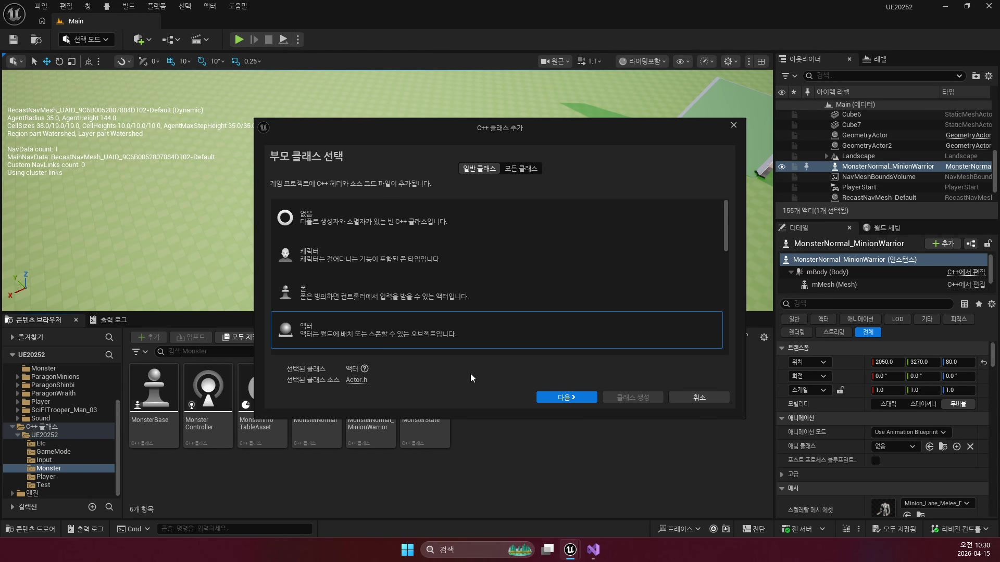
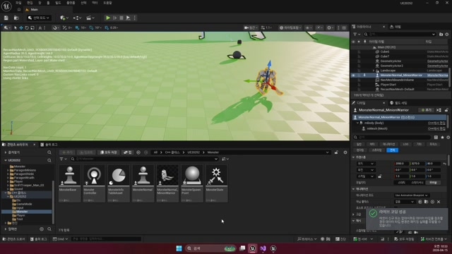
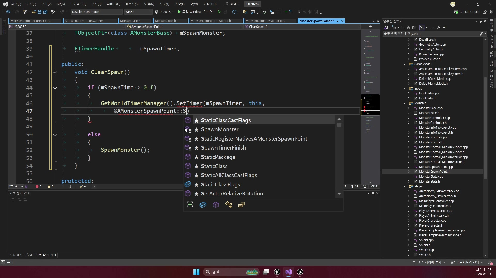

# 260415 01 SpawnPoint와 스폰 문맥

[260415 허브](../) | [다음: 02 Spline, PatrolPoints, Behavior Tree 등록](../02_intermediate_spline_patrolpoints_and_behavior_tree_registration/)

## 문서 개요

첫 강의의 목표는 몬스터를 레벨에 직접 박아 두는 대신, `몬스터가 태어날 필드 문맥`을 별도 액터로 분리하는 데 있다.

## 1. 왜 몬스터를 직접 배치하지 않고 `SpawnPoint`를 두는가

레벨에 몬스터를 바로 놓는 방식은 처음엔 단순하지만, 순찰 경로, 재생성 훅, 생성 클래스 교체 같은 규칙이 붙는 순간 관리가 급격히 복잡해진다.
그래서 강의는 몬스터 본체보다 먼저 `AMonsterSpawnPoint`를 세운다.





즉 `SpawnPoint`는 단순 좌표 마커가 아니라, `어디서 무엇을 어떤 문맥과 함께 태어나게 할 것인가`를 들고 있는 필드용 액터다.

## 2. `Root`, `Arrow`, `PatrolPath`는 에디터용 입력 장치다

SpawnPoint는 논리 클래스이면서 동시에 편집 도구다.

- `Root`: 월드 기준점
- `Arrow`: 방향 시각화
- `PatrolPath`: 사람이 편하게 수정하는 순찰 입력 경로


중요한 점은 `PatrolPath`가 최종 실행 데이터가 아니라는 것이다.
AI가 실제로 읽는 것은 이후 장에서 다룰 `PatrolPoints` 배열이다.

## 3. 스폰 규칙을 변수로 노출해야 필드 설계가 쉬워진다

현재 코드 기준 `AMonsterSpawnPoint`는 생성 대상을 `TSubclassOf<AMonsterGAS>`로 들고 있다.
또 `mSpawnTime`을 통해 재스폰 타이머 훅도 준비해 둔다.




이 구조 덕분에 SpawnPoint는 코드 분기문 없이도 아래를 조절할 수 있다.

- 어떤 몬스터를 생성할지
- 어느 방향으로 태어날지
- 재생성 훅을 쓸지
- 어떤 순찰 입력을 넘길지

즉 강의의 핵심은 "SpawnActor를 쓴다"가 아니라, `스폰 규칙을 데이터처럼 조절할 수 있게 만든다`는 데 있다.

## 4. `SpawnMonster()`는 생성과 동시에 필드 문맥을 몬스터에게 넘긴다

현재 `SpawnMonster()`는 단순 생성 함수가 아니다.
캡슐 높이 보정, 충돌 처리 방식, SpawnPoint 소속, PatrolPoints 주입까지 같이 처리한다.

```cpp
void AMonsterSpawnPoint::SpawnMonster()
{
    if (IsValid(mSpawnClass))
    {
        FVector SpawnLocation = GetActorLocation();
        TObjectPtr<AMonsterGAS> CDO = mSpawnClass->GetDefaultObject<AMonsterGAS>();

        if (IsValid(CDO))
        {
            TObjectPtr<UCapsuleComponent> Capsule = CDO->GetCapsule();
            SpawnLocation.Z += Capsule->GetScaledCapsuleHalfHeight();
        }

        FActorSpawnParameters param;
        param.SpawnCollisionHandlingOverride =
            ESpawnActorCollisionHandlingMethod::AdjustIfPossibleButAlwaysSpawn;

        mSpawnMonster = GetWorld()->SpawnActor<AMonsterGAS>(
            mSpawnClass, SpawnLocation, GetActorRotation(), param);

        mSpawnMonster->SetSpawnPoint(this);
        mSpawnMonster->SetPatrolPoints(mPatrolPoints);
    }
}
```

이 함수에서 꼭 읽어야 할 포인트는 아래다.

- `SpawnActor<AMonsterGAS>`: 현재 branch 기준 실사용 몬스터 본체는 GAS 라인이다.
- `캡슐 높이 보정`: 바닥에 반쯤 박혀 스폰되는 문제를 막는다.
- `SetSpawnPoint(this)`: 몬스터가 자신을 만든 SpawnPoint를 기억하게 한다.
- `SetPatrolPoints(mPatrolPoints)`: 순찰 AI가 바로 쓸 실행 데이터를 같이 넘긴다.

즉 스폰 직후의 몬스터는 그냥 "새 액터"가 아니라, 이미 `필드 문맥을 전달받은 상태`다.

## 정리

첫 강의의 핵심은 전투 로직이 아니라 배치 규칙의 구조화다.
`어떤 몬스터가 싸우는가`보다 먼저 `어떤 문맥을 가진 채 태어나는가`를 설계해야 이후 순찰과 추적이 흔들리지 않는다.

[260415 허브](../) | [다음: 02 Spline, PatrolPoints, Behavior Tree 등록](../02_intermediate_spline_patrolpoints_and_behavior_tree_registration/)
