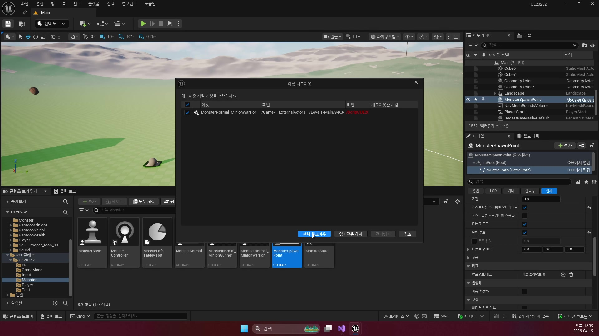
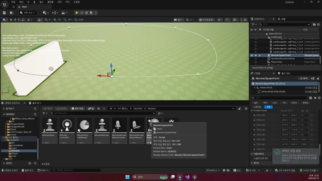

# 260415 02 Spline, PatrolPoints, Behavior Tree 등록

[260415 허브](../) | [이전: 01 SpawnPoint와 스폰 문맥](../01_intermediate_spawnpoint_and_spawn_context/) | [다음: 03 타겟 인식과 Move To](../03_intermediate_target_detection_and_move_to/)

## 문서 개요

두 번째 강의는 SpawnPoint에 붙어 있던 편집용 스플라인을 실제 순찰 데이터로 바꾸고, 스폰된 몬스터를 Behavior Tree가 도는 AI 상태로 올리는 단계다.

## 1. 스플라인은 입력이고 `PatrolPoints`는 실행 데이터다

사람은 곡선과 포인트를 보며 경로를 편집하는 편이 쉽지만, AI는 순서대로 읽을 수 있는 월드 좌표 배열이 더 단순하다.
그래서 강의는 `USplineComponent`를 직접 따라가게 만들지 않고, `TArray<FVector>`로 번역해 쓴다.






이 구분 덕분에 편집 경험과 런타임 단순성을 동시에 챙길 수 있다.

## 2. `OnConstruction()`이 스플라인을 순찰 배열로 바꾼다

현재 프로젝트는 이 번역을 `BeginPlay()`가 아니라 `OnConstruction()`에서 한다.
즉 에디터에서 스플라인을 손보는 순간, 순찰 배열도 즉시 다시 계산된다.

```cpp
void AMonsterSpawnPoint::OnConstruction(const FTransform& Transform)
{
    Super::OnConstruction(Transform);

    mPatrolPoints.Empty();
    int32 Count = mPatrolPath->GetNumberOfSplinePoints();

    for (int32 i = 0; i < Count; ++i)
    {
        FVector Point = mPatrolPath->GetLocationAtSplinePoint(
            i, ESplineCoordinateSpace::World);
        mPatrolPoints.Add(Point);
    }
}
```


즉 `260415`의 스플라인은 AI가 직접 소비하는 경로가 아니라, `편집용 입력을 런타임 데이터로 바꾸는 번역 계층`이다.

## 3. 현재 branch에선 `MonsterGAS`가 순찰과 전투 수치를 함께 들고 있는 허브다

강의 원형에서는 `MonsterBase`가 공통 허브 역할을 맡았지만, 현재 저장소에선 그 책임이 `AMonsterGAS`로 옮겨왔다.
SpawnPoint가 넘긴 `mPatrolPoints`도 여기 보관되고, 이후 추적과 공격에 필요한 `WalkSpeed`, `RunSpeed`, `AttackDistance`, `DetectRange`도 `MonsterAttributeSet`에 함께 저장된다.

즉 `260415`는 순찰만 배우는 날이 아니라, 지금 기준으로 보면 `Patrol과 Trace가 공유할 공통 상태 허브`를 여는 날이다.

## 4. Behavior Tree 등록 시점은 `PossessedBy()`가 가장 자연스럽다

스폰만 됐다고 AI가 바로 사고하는 것은 아니다.
컨트롤러가 실제로 몬스터를 소유한 뒤에야 "이 몬스터가 어떤 BT를 쓸지"를 정할 수 있다.

```cpp
void AMonsterNormalGAS::PossessedBy(AController* NewController)
{
    AMonsterGASController* Ctrl = Cast<AMonsterGASController>(NewController);
    Ctrl->SetAITree(TEXT("/Game/Monster/BT_MonsterGAS_Normal.BT_MonsterGAS_Normal"));

    Super::PossessedBy(NewController);
}
```


현재 branch에서 중요한 차이는 트리 이름이 `BT_Monster_Normal`이 아니라 `BT_MonsterGAS_Normal`이라는 점이다.
즉 강의 구조는 유지되지만, 실제 실사용 트리는 GAS 몬스터 라인에 맞게 바뀌어 있다.

## 5. Patrol 태스크는 Target이 없을 때만 의미가 있다

현재 `UBTTask_PatrolGAS`는 아래 규칙으로 움직인다.

- 블랙보드 `Target`이 있으면 순찰보다 전투 브랜치를 다시 보게 한다
- `GetPatrolEnable()`이 거짓이면 순찰 자체를 하지 않는다
- `MoveToLocation(Monster->GetPatrolPoint())`으로 이동을 건다
- 태스크가 끝날 때 `NextPatrol()`로 다음 점 인덱스를 넘긴다

즉 Patrol은 단순 이동 함수가 아니라, `비전투 상태에서만 의미가 있는 기본 행동 루프`다.

## 정리

두 번째 강의의 핵심은 입력을 행동으로 바꾸는 번역 계층을 세우는 데 있다.
스플라인은 사람이 쓰는 입력 도구이고, `PatrolPoints`는 AI 실행 데이터이며, `PossessedBy()`와 BT 등록은 그 데이터를 실제 행동 루프로 올리는 단계다.

[260415 허브](../) | [이전: 01 SpawnPoint와 스폰 문맥](../01_intermediate_spawnpoint_and_spawn_context/) | [다음: 03 타겟 인식과 Move To](../03_intermediate_target_detection_and_move_to/)
