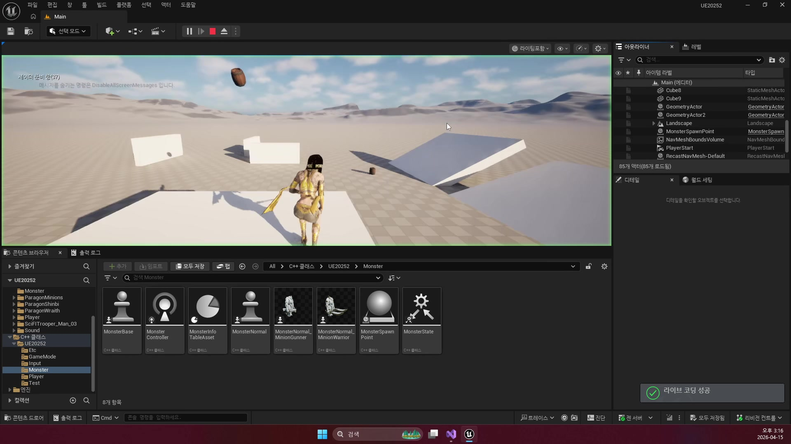
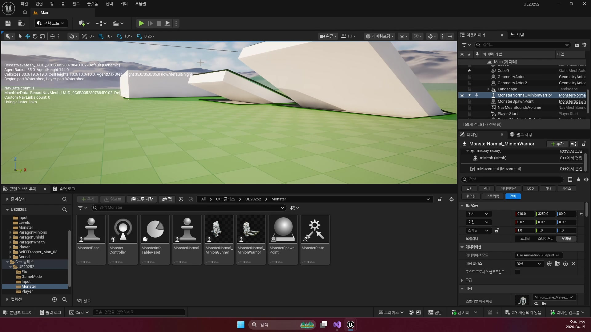
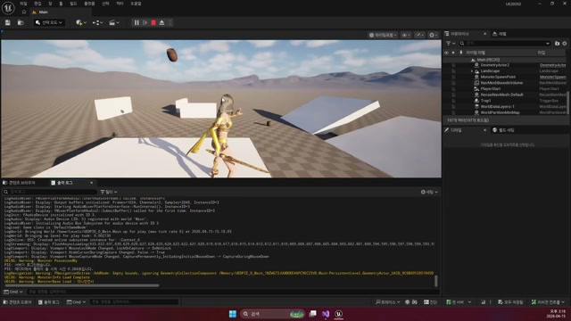

# 260415 03 타겟 인식과 Move To

[260415 허브](../) | [이전: 02 Spline, PatrolPoints, Behavior Tree 등록](../02_intermediate_spline_patrolpoints_and_behavior_tree_registration/) | [다음: 04 공식 문서 부록](../04_appendix_official_docs_reference/)

## 문서 개요

세 번째 강의는 몬스터가 플레이어를 감지하면 `순찰`에서 `추적`으로 문맥을 바꾸는 순간을 다룬다.
핵심은 `OnTarget -> Blackboard.Target -> MoveToActor` 흐름이다.

## 1. 감지 이전에 먼저 확인해야 할 것들

Perception이 안 되는 것처럼 보여도 실제 원인은 더 앞단에 있을 수 있다.
현재 프로젝트 기준으로는 아래 순서로 보는 것이 가장 빠르다.

1. AIController가 실제로 빙의됐는가
2. `PossessedBy()`에서 BT가 실행됐는가
3. Monster와 Player의 Team ID가 적대 관계인가
4. Blackboard가 준비돼 `Target`을 받을 수 있는가
5. Nav Mesh가 충분히 깔렸는가



즉 감지 문제처럼 보여도, 실제론 `빙의`, `팀 설정`, `BT 실행`이 먼저 막혀 있을 수 있다.

## 2. `MonsterGASController`는 생성자에서 감각을 준비한다

Perception은 나중에 옵션처럼 켜는 기능이 아니라, 컨트롤러 생성 시점부터 준비되는 기본 능력이다.

```cpp
mSightConfig = CreateDefaultSubobject<UAISenseConfig_Sight>(TEXT("Sight"));
mSightConfig->SightRadius = 800.f;
mSightConfig->LoseSightRadius = 800.f;
mSightConfig->PeripheralVisionAngleDegrees = 180.f;
mSightConfig->DetectionByAffiliation.bDetectEnemies = true;

mAIPerception->ConfigureSense(*mSightConfig);
mAIPerception->SetDominantSense(mSightConfig->GetSenseImplementation());
SetGenericTeamId(FGenericTeamId(TeamMonster));

mAIPerception->OnTargetPerceptionUpdated.AddDynamic(
    this, &AMonsterGASController::OnTarget);
```


즉 `260415`의 시야 설정은 에디터 수치놀이가 아니라, 코드 레벨 초기화다.

## 3. `OnTarget()`은 감지와 이동 상태를 같이 바꾼다

현재 `OnTarget()`은 단순히 블랙보드 `Target`만 채우고 비우는 함수가 아니다.
`Monster->DetectTarget(true/false)`도 같이 호출해서 걷기와 달리기 속도까지 함께 전환한다.

```cpp
if (Stimulus.WasSuccessfullySensed())
{
    Blackboard->SetValueAsObject(TEXT("Target"), Actor);
    Monster->DetectTarget(true);
}
else
{
    Blackboard->SetValueAsObject(TEXT("Target"), nullptr);
    Monster->DetectTarget(false);
}
```

즉 여기서 동시에 일어나는 일은 두 가지다.

- AI 기억 공간의 `Target` 상태가 바뀐다
- 몬스터의 실제 이동 상태가 `Walk`와 `Run` 사이를 오간다

이 때문에 `OnTarget()`은 감지 이벤트 핸들러이면서 상태 전환 함수다.

## 4. `Move To`는 Blackboard가 채워졌을 때만 의미가 있다

현재 BT 구조를 보면 `Target is Set`일 때 `MonsterTrace -> MonsterAttack` 쪽으로, `Target is Not Set`일 때 `MonsterWait -> MonsterPatrol` 쪽으로 흐른다.


즉 `MoveToActor()`는 단독 기능이 아니라, `Blackboard.Target`이 채워졌을 때만 의미를 가진다.
이 상태 전환이 자연스러워야 Patrol과 Trace가 같은 트리 안에서 함께 산다.

## 5. `BTTask_TraceGAS`는 추적이 끝나는 순간도 같이 판단한다

현재 `UBTTask_TraceGAS`는 단순 추적 시작 함수가 아니다.

- `MoveToActor(Target)`으로 실제 추적을 건다
- 추적 중엔 `Run` 애니메이션으로 바꾼다
- `AttackDistance` 안에 들어오면 Trace 역할이 끝났다고 보고 태스크를 닫는다






여기서 특히 중요한 점은 `Failed`가 꼭 오류를 뜻하지 않는다는 것이다.
현재 BT 구조에선 "추적 역할이 끝났으니 다음 공격 브랜치를 평가하라"는 신호에 더 가깝다.

## 정리

세 번째 강의의 본질은 감지 코드를 하나 넣는 것이 아니라, `감지 -> 기억(Target) 갱신 -> 속도 전환 -> Move To -> 공격 거리 판정`을 하나의 루프로 연결하는 데 있다.

[260415 허브](../) | [이전: 02 Spline, PatrolPoints, Behavior Tree 등록](../02_intermediate_spline_patrolpoints_and_behavior_tree_registration/) | [다음: 04 공식 문서 부록](../04_appendix_official_docs_reference/)
