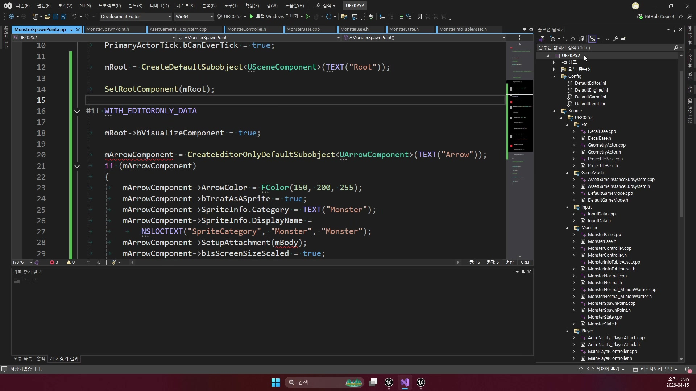
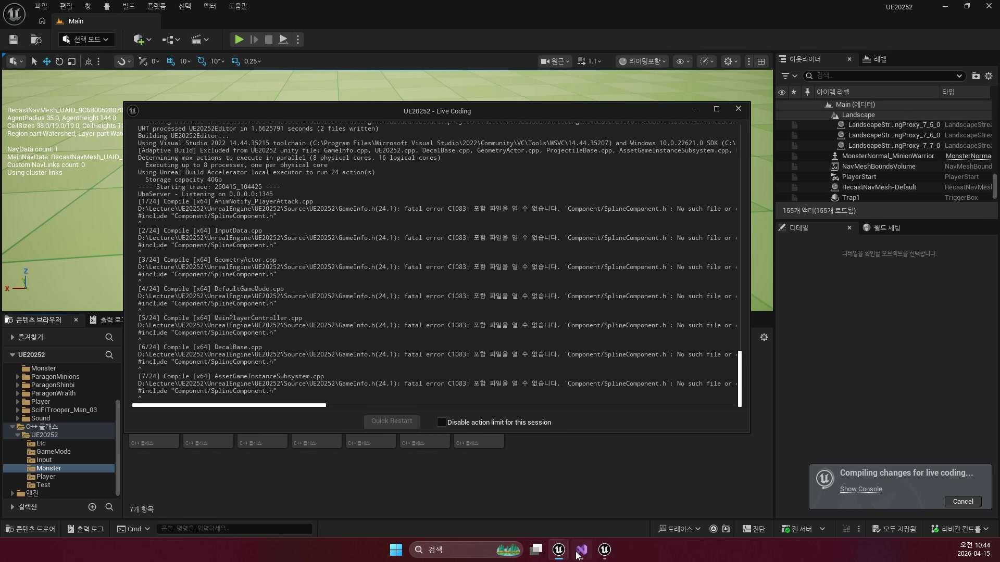
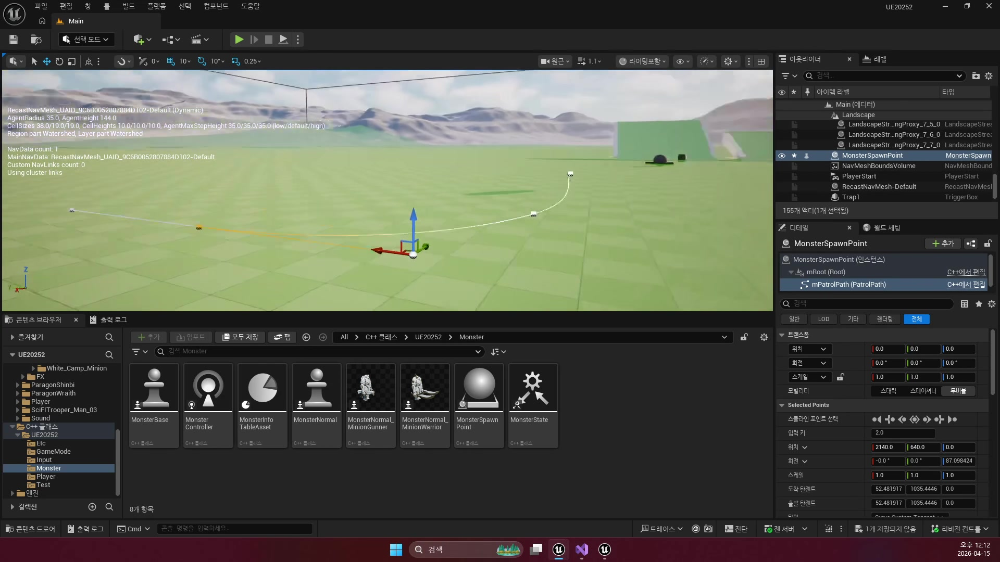
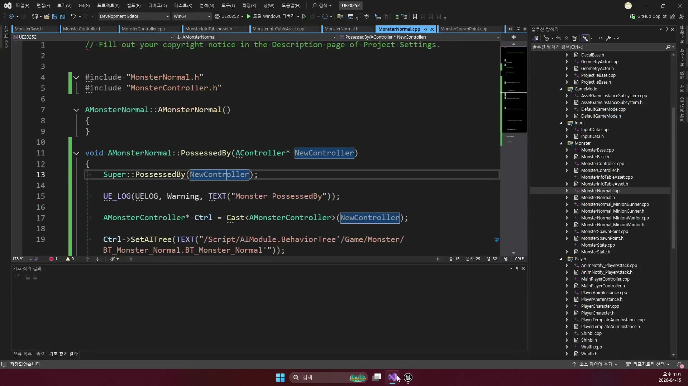
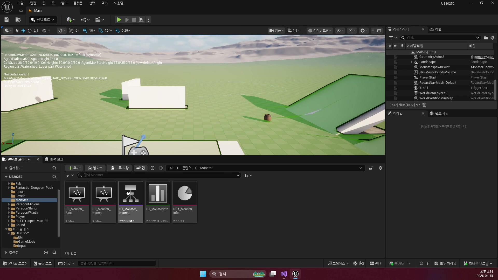
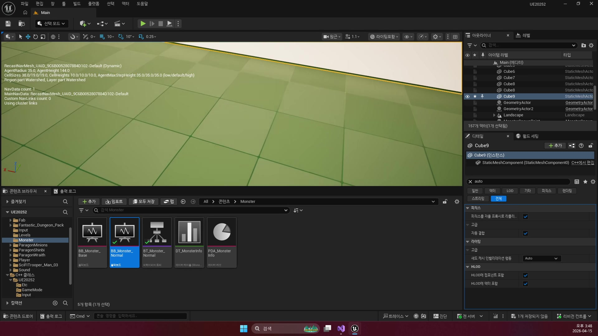

# 260415 몬스터를 스폰하고 순찰시키고 플레이어를 감지하면 추적으로 바꾸는 AI 기초

## 문서 개요

이 문서는 `260415_1`부터 `260415_3`까지의 강의를 하나의 연속된 교재로 다시 정리한 것이다.
핵심 주제는 `SpawnPoint -> PatrolPoints -> MonsterGASController -> Blackboard -> Move To`로 이어지는 기본 몬스터 AI 골격이다.

이번 날짜의 강의는 전투보다 앞단에 있는 준비 과정을 다룬다.
즉 몬스터를 어디에 둘지, 재스폰 훅을 어디에 둘지, 어떻게 순찰 데이터를 넘길지, 적을 보면 어떤 식으로 추적 상태로 바뀌게 할지를 단계적으로 연결한다.
겉으로 보면 개별 기능을 나눠 배우는 것 같지만, 실제로는 하나의 필드형 몬스터 시스템을 밑바닥부터 조립하는 과정에 가깝다.

다만 현재 저장소는 강의 원형의 `MonsterBase / MonsterController / BT_Monster_Normal` 축을 상당 부분 `MonsterGAS / MonsterGASController / BT_MonsterGAS_Normal` 축으로 옮겨 둔 상태다.
그래서 이 문서는 강의 흐름은 유지하되, 코드 설명은 가능한 한 최신 branch 기준으로 다시 맞춰 읽는다.

이 교재는 다음 네 가지 자료를 함께 대조해 작성했다.

- 강의 자막의 설명 순서
- 원본 영상에서 다시 추출한 대표 장면 캡처
- `D:\UnrealProjects\UE_Academy_Stduy\Source\UE20252` 실제 C++ 소스
- `D:\UnrealProjects\UE_Academy_Stduy\Saved\AcademyUtility`의 블루프린트 / BT / BB / 소스 덤프
- Epic Developer Community의 언리얼 공식 문서

## 학습 목표

- `MonsterSpawnPoint`를 왜 별도 액터로 두는지 설명할 수 있다.
- `PatrolPath`와 `PatrolPoints`가 각각 어떤 단계의 데이터인지 구분할 수 있다.
- `PossessedBy`, `OnTarget`, `MoveToLocation`, `MoveToActor`가 어떤 순서로 이어지는지 말할 수 있다.
- Nav Mesh, Team ID, DetectRange, AttackDistance를 포함한 기본 AI 디버깅 순서를 정리할 수 있다.
- `Spawning Actors`, `Behavior Tree`, `AI Perception`, `Basic Navigation` 공식 문서가 왜 `260415`와 직접 연결되는지 설명할 수 있다.
- `MonsterSpawnPoint::SpawnMonster()`, `MonsterGAS::SetPatrolPoints()`, `BTTask_PatrolGAS`, `BTTask_TraceGAS`가 실제 프로젝트에서 어떻게 이어지는지 설명할 수 있다.

## 강의 흐름 요약

1. `SpawnPoint` 액터를 만들어 스폰 클래스, 스폰 타이머 훅, 순찰 경로를 한 곳에 모은다.
2. `USplineComponent`를 런타임용 좌표 배열로 번역해 순찰 데이터로 바꾼다.
3. 몬스터가 `PossessedBy` 시점에 Behavior Tree를 연결하고, 컨트롤러는 시야와 팀 설정을 준비한다.
4. 감지 성공 시 `Blackboard.Target`을 갱신하고, `Move To` 기반 추적이 시작된다.
5. 언리얼 공식 문서를 통해 스폰, 내비게이션, Perception, Behavior Tree가 엔진 표준 용어로 어떻게 정리되는지 확인한다.
6. 현재 프로젝트 C++ 코드를 읽으며, 위 구조가 `MonsterSpawnPoint`, `MonsterGAS`, `MonsterGASController`, `BTTask_PatrolGAS`, `BTTask_TraceGAS` 안에서 어떻게 이어지는지 확인한다.

## 2026-04-24 최신 코드 반영 메모

이번 보강에서는 `MonsterSpawnPoint`, `MonsterGAS`, `MonsterGASController`, `BTTask_*GAS` 실제 소스를 기준으로, 스폰과 순찰이 현재 branch에서 어떤 데이터 변환을 거쳐 전개되는지 본문 앞에 먼저 고정해 둔다.

- `MonsterSpawnPoint_FileDump.txt`를 보면 이 액터는 `USplineComponent`인 `PatrolPath`를 에디터 입력 경로로 들고 있다가, 런타임에는 `GetNumberOfSplinePoints()`와 `GetLocationAtSplinePoint(..., World)`로 월드 좌표를 읽어 `mPatrolPoints` 배열로 옮긴다. 즉 강의에서 말한 "스플라인은 편집용, PatrolPoints는 실행용"이라는 구분이 코드 그대로 확인된다.
- 현재 소스 기준 `SpawnMonster()`는 `SpawnActor<AMonsterGAS>(...)`로 몬스터를 만든 뒤 `SetSpawnPoint(this)`와 `SetPatrolPoints(mPatrolPoints)`를 호출한다. 즉 SpawnPoint는 단순 배치 마커가 아니라 "순찰 데이터를 주입하는 시작점"이라는 성격을 그대로 유지하되, 대상 본체가 이제 `MonsterGAS` 계열로 바뀌었다.
- `MonsterNormalGAS.cpp`를 보면 `PossessedBy()`에서 컨트롤러에 `SetAITree(TEXT("/Game/Monster/BT_MonsterGAS_Normal.BT_MonsterGAS_Normal"))`를 전달한다. 즉 Behavior Tree 연결은 여전히 빙의 시점에 명시적으로 결정되지만, 현재 branch의 실사용 트리는 `BT_MonsterGAS_Normal`이다.
- `MonsterGASController.cpp`와 `BTTask_TraceGAS.cpp`를 같이 보면, 감지 성공/해제 시 블랙보드 `Target`이 갱신되고, 추적 태스크는 `MoveToActor(Target)`와 함께 애니메이션을 `Run`으로 바꾼다. 그리고 타깃과의 거리가 `MonsterAttributeSet::GetAttackDistance()` 이하가 되면 일부러 `Failed`를 반환해 다음 공격 브랜치로 넘긴다. 여기서 `Failed`는 여전히 오류가 아니라 "추적 종료 신호"에 가깝다.
- `BTTask_PatrolGAS.cpp`는 순찰 태스크가 `MoveToLocation(Monster->GetPatrolPoint())`와 `Walk` 전환을 담당하고, 목표점과의 거리가 `5.f` 이하가 되면 끝난 뒤 `OnTaskFinished()`에서 `NextPatrol()`을 호출한다는 사실을 보여 준다. 즉 순찰은 현재 branch에서도 스플라인을 실시간으로 따라가는 것이 아니라, 미리 뽑아 둔 점 배열을 하나씩 소비하는 구조다.

---

## 제1장. SpawnPoint 기초

### 1.1 왜 몬스터를 직접 레벨에 놓지 않는가

첫 강의의 핵심은 몬스터 인스턴스를 레벨에 직접 박아 두는 구조에서 벗어나는 데 있다.
레벨에 바로 배치한 몬스터는 처음에는 간단해 보이지만, 나중에 재생성 훅을 붙이거나 같은 지역에서 다른 종류의 몬스터를 생성하거나 지역마다 순찰 경로를 다르게 주는 규칙이 붙는 순간 관리 비용이 급격히 올라간다.

그래서 강의는 몬스터 본체보다 먼저 `MonsterSpawnPoint`를 세운다.
이 선택의 의미는 단순히 편해진다는 수준이 아니라, 월드에 배치되는 객체의 책임을 다시 나누는 데 있다.
몬스터는 “태어난 뒤 무엇을 하는가”에 집중하고, SpawnPoint는 “언제 어디서 무엇을 태어나게 할 것인가”를 전담한다.

이렇게 분리하면 같은 몬스터 클래스라도 SpawnPoint 설정만 달리해 전혀 다른 필드 운용 패턴을 만들 수 있다.
특정 지역은 빠른 재생성 훅을 준비하고, 다른 지역은 느린 재생성 훅을 준비하는 식의 조정도 액터 설정만으로 설계해 둘 수 있다.

### 1.2 편집 도구로서의 Root, Arrow, PatrolPath

SpawnPoint는 논리 클래스이면서 동시에 에디터용 도구다.
`Root`, `Arrow`, `PatrolPath`를 함께 두는 이유는, 디자이너가 월드에서 즉시 방향과 경로를 확인할 수 있게 만들기 위해서다.

- `Root`: 이 액터의 기준 좌표
- `Arrow`: 스폰 방향과 배치 기준 시각화
- `PatrolPath`: 순찰용 입력 경로

즉, 여기서 `PatrolPath`는 최종 실행 데이터가 아니다.
사람이 편하게 편집하기 위한 입력 장치다.
실제 AI가 읽는 것은 이후 장에서 다루는 `PatrolPoints` 배열이다.



### 1.3 스폰 규칙을 변수로 노출하는 이유

강의는 객체 참조가 아니라 `TSubclassOf<AMonsterGAS>`를 이용해 생성 대상을 고른다.
이 선택은 상당히 중요하다.
Details 패널에서 안전하게 생성 클래스를 고를 수 있고, 하위 몬스터 타입이 늘어나도 SpawnPoint 쪽 인터페이스는 거의 바뀌지 않는다.

또한 `mSpawnTime`은 현재 `ClearSpawn()`과 `SpawnTimerFinish()`를 통해 지연 스폰 정책을 붙일 수 있게 준비돼 있다.
즉 스폰 규칙이 코드 분기문이 아니라 데이터 설정값으로 내려올 수 있는 구조는 이미 있다.
다만 현재 저장소에서는 몬스터 사망 시점에 `ClearSpawn()`이 자동 호출되지는 않으므로, 완전한 재스폰 루프가 끝난 상태라기보다 “재스폰 훅이 준비된 상태”로 읽는 편이 정확하다.



### 1.4 SpawnMonster가 실제로 하는 일

강의만 들으면 SpawnPoint는 “SpawnActor를 부른다” 정도로 보이기 쉽다.
하지만 실제 소스를 보면 `SpawnMonster()`는 그보다 훨씬 많은 문맥을 한 번에 처리한다.

1. 생성할 몬스터 클래스가 유효한지 검사한다.
2. CDO에서 캡슐 높이를 읽어 스폰 위치의 Z를 보정한다.
3. 충돌 처리 방식을 `AdjustIfPossibleButAlwaysSpawn`로 준다.
4. 생성된 몬스터에게 자신의 SpawnPoint와 PatrolPoints를 전달한다.

그리고 현재 코드 기준으로 `BeginPlay()`는 우선 `SpawnMonster()`를 즉시 한 번 호출한다.
즉 필드 초기 몬스터 배치는 이미 동작하고, `mSpawnTime` 타이머는 이후 재생성 구조를 확장하기 위한 별도 갈래라고 보면 된다.

이 구조 덕분에 스폰 직후의 몬스터는 단순히 “생성된 액터”가 아니라, 이미 필드 문맥을 전달받은 상태가 된다.
강의에서 다음 장으로 넘어갈 수 있는 이유도 바로 여기서 Patrol 데이터가 같이 넘어가기 때문이다.

```cpp
void AMonsterSpawnPoint::SpawnMonster()
{
    if (IsValid(mSpawnClass))
    {
        // 스폰 위치는 우선 SpawnPoint 자신의 위치에서 시작한다.
        FVector SpawnLocation = GetActorLocation();
        // 실제 몬스터 기본 객체(CDO)를 읽어 캡슐 높이를 미리 확인한다.
        TObjectPtr<AMonsterGAS> CDO = mSpawnClass->GetDefaultObject<AMonsterGAS>();

        if (IsValid(CDO))
        {
            TObjectPtr<UCapsuleComponent> Capsule = CDO->GetCapsule();
            // 바닥에 박히지 않도록 캡슐 절반 높이만큼 올린다.
            SpawnLocation.Z += Capsule->GetScaledCapsuleHalfHeight();
        }

        FActorSpawnParameters param;
        param.SpawnCollisionHandlingOverride =
            ESpawnActorCollisionHandlingMethod::AdjustIfPossibleButAlwaysSpawn;

        // 실제 몬스터 스폰
        mSpawnMonster = GetWorld()->SpawnActor<AMonsterGAS>(
            mSpawnClass, SpawnLocation, GetActorRotation(), param);

        // 누가 자신을 만들었는지와 순찰 경로를 같이 넘긴다.
        mSpawnMonster->SetSpawnPoint(this);
        mSpawnMonster->SetPatrolPoints(mPatrolPoints);
    }
}
```

이 코드는 강의의 개념을 실무적으로 완성하는 지점이다.
특히 캡슐 높이 보정은 “바닥에 반쯤 박혀 스폰되는 문제”를 막는 현실적인 디테일이고, `SetSpawnPoint`, `SetPatrolPoints` 호출은 이후 AI 시스템 전체를 이어 주는 연결선이다.
현재 branch에서는 이 스폰 대상이 `MonsterBase`가 아니라 `MonsterGAS`로 바뀌었기 때문에, 같은 흐름이 GAS 기반 몬스터에도 그대로 이어진다고 읽는 편이 맞다.

### 1.5 장 정리

제1장의 결론은 명확하다.
몬스터 AI의 첫 단계는 전투 로직이 아니라 배치 규칙의 구조화다.
즉 “어떤 몬스터가 싸우는가”보다 먼저 “어떤 문맥을 가진 채 태어나는가”를 설계해야 이후 순찰과 추적이 매끄럽게 이어진다.

---

## 제2장. SplineComponent와 Behavior Tree 등록

### 2.1 스플라인은 입력이고 순찰점은 실행 데이터다

두 번째 강의는 SpawnPoint에 붙어 있던 `USplineComponent`를 실제 AI가 이해할 수 있는 순찰 좌표로 변환하는 과정에 초점을 둔다.
여기서 핵심은 스플라인 자체를 AI가 쓰지 않는다는 점이다.
스플라인은 편집자 친화적인 입력 장치이고, 실행 시점에는 `TArray<FVector>`가 더 단순하고 직접적이다.

이 구분이 중요한 이유는 다음과 같다.

- 사람은 곡선과 포인트를 보며 경로를 다듬고 싶다.
- AI는 순서대로 읽을 수 있는 월드 좌표 배열만 있으면 된다.
- 입력 형식과 실행 형식을 분리하면 편집 경험과 런타임 단순성을 동시에 챙길 수 있다.



실제 소스는 이 번역 과정을 `OnConstruction()`에서 처리한다.
즉 에디터에서 스플라인 점을 수정할 때마다 순찰용 좌표 배열이 갱신된다.
BeginPlay까지 기다리지 않아도 에디터 단계에서 곧바로 결과를 확인할 수 있다는 뜻이다.

```cpp
void AMonsterSpawnPoint::OnConstruction(const FTransform& Transform)
{
    Super::OnConstruction(Transform);

    // 에디터에서 수정될 때마다 순찰 배열을 다시 만든다.
    mPatrolPoints.Empty();
    int32 Count = mPatrolPath->GetNumberOfSplinePoints();

    for (int32 i = 0; i < Count; ++i)
    {
        // 스플라인 입력점을 월드 좌표 순찰점 배열로 바꾼다.
        FVector Point = mPatrolPath->GetLocationAtSplinePoint(
            i, ESplineCoordinateSpace::World);
        mPatrolPoints.Add(Point);
    }
}
```

강의에서 “OnConstruction이 편하다”고 설명한 이유를 코드로 읽으면 훨씬 선명해진다.
이 함수는 런타임 로직보다 편집 경험을 더 좋게 만들기 위한 선택이다.

### 2.2 현재 branch에서는 MonsterGAS가 순찰과 전투의 공통 허브가 되는 이유

겉보기에는 SpawnPoint 파트와 Patrol 파트가 따로 놀아 보일 수 있다.
하지만 현재 프로젝트를 읽어 보면 두 장을 이어 주는 중심은 `MonsterGAS`다.

원래 강의의 공통 허브 역할은 `MonsterBase`가 맡았지만, 최신 branch에서는 그 책임이 `MonsterGAS` 쪽으로 옮겨왔다.
즉 순찰을 위한 데이터도 여기서 들고 있고, 나중에 추적과 공격에 필요한 값도 `MonsterAttributeSet`과 `ASC`를 통해 함께 주입된다.

```cpp
// 데이터 테이블에서 읽은 값을 AttributeSet에 복사한다.
mAttributeSet->SetWalkSpeed(Info->WalkSpeed);
mAttributeSet->SetRunSpeed(Info->RunSpeed);
mAttributeSet->SetAttackDistance(Info->AttackDistance);
mAttributeSet->SetDetectRange(Info->DetectRange);
mAttributeSet->SetGold(Info->Gold);

// 기본 비전투 속도는 걷기 속도
mMovement->MaxSpeed = mAttributeSet->GetWalkSpeed();

// 감지 범위는 컨트롤러의 시야 설정에도 다시 반영한다.
TObjectPtr<AMonsterGASController> AI = GetController<AMonsterGASController>();
if (IsValid(AI))
{
    AI->SetDetectRange(mAttributeSet->GetDetectRange());
}
```

이 코드에서 중요한 점은 강의에서 개념적으로 설명한 `DetectRange`, `AttackDistance`, 속도 전환 값이 실제로는 `FMonsterInfo` 데이터에서 읽혀 `MonsterAttributeSet`에 들어간다는 사실이다.
즉 Patrol과 Trace가 하드코딩된 튜토리얼 상수가 아니라, 현재 branch에서는 `데이터 테이블 -> AttributeSet -> AI/이동 컴포넌트` 순으로 공급되는 시스템이 된다.

여기에 현재 `MonsterGAS`의 순찰 규칙도 같이 보면 더 선명하다.
`GetPatrolEnable()`은 `mPatrolPoints.Num() > 1`일 때만 참을 반환하고, 기본 `mPatrolIndex`는 `1`에서 시작한다.
즉 순찰점이 하나뿐이면 Patrol 태스크는 아예 돌지 않고, 두 점 이상일 때는 현재 위치를 기준점처럼 두고 다음 점부터 향하는 구조라고 이해하면 된다.

### 2.3 Behavior Tree 등록 시점은 왜 PossessedBy인가

강의는 몬스터가 어떤 Behavior Tree를 쓸지 정하는 시점으로 `PossessedBy`를 강조한다.
이 선택은 엔진 라이프사이클과 정확히 맞물린다.
컨트롤러가 실제로 폰을 소유한 뒤여야 Blackboard와 Behavior Tree를 준비할 수 있기 때문이다.

```cpp
void AMonsterNormalGAS::PossessedBy(AController* NewController)
{
    // 이 몬스터가 사용할 Behavior Tree 경로를 컨트롤러에 넘긴다.
    AMonsterGASController* Ctrl = Cast<AMonsterGASController>(NewController);
    Ctrl->SetAITree(TEXT("/Game/Monster/BT_MonsterGAS_Normal.BT_MonsterGAS_Normal"));

    Super::PossessedBy(NewController);
}
```

이 코드 자체는 짧다.
하지만 짧은 만큼 더 중요하다.
강의의 포인트는 코드를 길게 쓰는 데 있지 않고, “BT를 언제 연결하는가”를 정확히 이해하는 데 있다.

현재 구현을 조금 더 정확히 보면 `SetAITree()`는 soft path를 잡은 뒤 `LoadSynchronous()`로 자산을 즉시 읽고, 성공하면 곧바로 `RunBehaviorTree()`를 호출한다.
즉 `260415`의 BT 연결은 지금도 여전히 “PossessedBy 시점에 몬스터별 AI 트리를 실제 실행 상태로 올린다”는 의미가 더 정확하다.



### 2.4 Patrol Task는 왜 Target이 없을 때만 움직이는가

강의 원형의 `BTTask_Patrol`이 전달하려던 핵심은 순찰을 “기본 상태”로 본다는 데 있다.
현재 branch에서는 이 역할을 `BTTask_PatrolGAS`가 이어받는다.
Target이 생기면 곧바로 순찰 우선순위를 내려놓고 전투 브랜치가 다시 평가되게 만든다.

이 설계는 매우 좋다.
순찰은 아무 일도 일어나지 않을 때의 기본 행동이지, 전투 신호와 경쟁하는 최상위 행동이 아니기 때문이다.

강의에서는 이 부분이 동작 원리 수준에서 설명되지만, 코드를 보면 훨씬 또렷하다.

- Blackboard의 `Target`이 있으면 `ExecuteTask()`는 `Succeeded`를 반환해 상위 Selector가 전투 쪽을 다시 평가하게 만든다.
- `MoveToLocation()`은 Target이 없고 `GetPatrolEnable()`이 참일 때만 의미가 있다.
- 목표점에 도달하거나 이동 상태가 `Idle`이 되면 태스크는 `Failed`로 끝난다.
- `OnTaskFinished()`에서는 이동을 멈추고 `NextPatrol()`을 호출해 다음 웨이포인트로 넘어간다.

결국 Patrol은 “한 번 이동 명령을 던지는 함수”가 아니라, 전투 신호와 도착 판정을 같이 보면서 다음 상태로 넘기는 루프다.
특히 여기서 `Failed`가 꼭 “오류”를 의미하지 않는다는 점이 중요하다.
현재 BT 구조에서는 Patrol이 실패로 끝나야 Selector가 다시 돌아가면서 다음 Wait나 새 Patrol, 혹은 새 감지 상태를 재평가할 수 있다.

### 2.5 장 정리

제2장은 입력을 행동으로 바꾸는 번역 계층을 설명한다.
스플라인은 사람이 편하게 쓰는 입력 도구이고, PatrolPoints는 AI가 읽는 데이터이며, Behavior Tree는 그 데이터를 언제 어떻게 소비할지를 결정하는 실행 구조다.

즉 이 장의 핵심은 기능 추가가 아니라 계층 분리다.

---

## 제3장. 타겟 인식 및 Move To

### 3.1 감지 이전에 먼저 확인해야 할 것들

세 번째 강의에서 사용자는 흔히 Perception 설정부터 만지기 쉽다.
하지만 실제 프로젝트를 기준으로 보면, 감지가 되기 전에 먼저 확인해야 할 것들이 있다.

1. AIController가 제대로 빙의되었는가
2. `AutoPossessAI`가 `PlacedInWorldOrSpawned`로 설정되어 있는가
3. `MonsterNormalGAS::PossessedBy()`에서 `BT_MonsterGAS_Normal`이 실제 실행되는가
4. Monster와 Player의 Team ID가 적대 관계로 맞는가
5. Blackboard가 생성되어 `Target` 값을 받을 수 있는가

즉 감지 문제처럼 보이는 증상도 사실은 빙의 시점이나 팀 설정 문제일 수 있다.
강의 후반이 사실상 디버깅 교안처럼 느껴지는 이유도 여기에 있다.

### 3.2 MonsterGASController는 생성자에서 감각을 준비한다

Perception은 나중에 붙이는 옵션이 아니라, 컨트롤러 생성 시점부터 준비되는 기본 능력이다.
`MonsterGASController`는 생성자 안에서 시야 감각을 만들고, 감지 반경과 감지 대상을 설정하고, 감지 이벤트를 `OnTarget`에 바인딩한다.

```cpp
// 몬스터 시야 감각 설정
mSightConfig = CreateDefaultSubobject<UAISenseConfig_Sight>(TEXT("Sight"));
mSightConfig->SightRadius = 800.f;
mSightConfig->LoseSightRadius = 800.f;
mSightConfig->PeripheralVisionAngleDegrees = 180.f;
mSightConfig->DetectionByAffiliation.bDetectEnemies = true;

// 시야 설정을 실제 감각 컴포넌트에 반영
mAIPerception->ConfigureSense(*mSightConfig);
mAIPerception->SetDominantSense(mSightConfig->GetSenseImplementation());
// AI 팀도 몬스터 팀으로 설정
SetGenericTeamId(FGenericTeamId(TeamMonster));

// 감지 이벤트 연결
mAIPerception->OnTargetPerceptionUpdated.AddDynamic(
    this, &AMonsterGASController::OnTarget);
```

이렇게 보면 강의에서 말하는 “시야 설정”이 에디터 튜닝이 아니라 코드 레벨 초기화라는 점이 분명해진다.

### 3.3 OnTarget은 감지와 이동 상태를 같이 갱신한다

강의의 핵심 함수는 `OnTarget(AActor*, FAIStimulus)`이다.
이 함수는 감지 성공 여부에 따라 단순히 Target만 넣고 빼는 것이 아니라, 몬스터의 이동 상태도 함께 바꾼다.

- 감지 성공: Blackboard `Target` 채움, `DetectTarget(true)` 호출
- 감지 실패: Blackboard `Target` 비움, `DetectTarget(false)` 호출

즉 감지와 속도 전환이 하나의 함수 안에서 묶인다.
이 구조 덕분에 몬스터는 단순히 목표를 “안다”는 상태를 넘어, 시각적으로도 걷기에서 달리기로 즉시 반응하게 된다.

현재 구현에서 한 가지 더 중요한 점은 `OnTarget()`이 `mAITree`와 `Blackboard`가 모두 유효할 때만 동작한다는 것이다.
즉 Perception 이벤트가 먼저 와도 BT 실행과 블랙보드 준비가 끝나지 않았으면 실제 상태 전환은 일어나지 않는다.

### 3.4 Move To는 Blackboard 없이는 의미가 없다

강의는 Blackboard와 Behavior Tree를 따로따로 설명하지만, 실제 런타임에서는 거의 한 몸처럼 움직인다.

1. `SetAITree()`가 트리를 로드하고 실행한다.
2. `OnTarget()`이 Blackboard `Target`을 갱신한다.
3. `BTTask_TraceGAS`가 `Target`을 읽어 `MoveToActor()`를 호출한다.

```cpp
void AMonsterGASController::SetAITree(const FString& Path)
{
    // 문자열 경로를 소프트 오브젝트 경로로 바꾼다.
    FSoftObjectPath SoftPath(Path);
    mAITreeLoader = TSoftObjectPtr<UBehaviorTree>(SoftPath);

    if (!mAITreeLoader.IsNull())
    {
        // 현재 프로젝트는 동기 로딩으로 트리를 바로 가져온다.
        mAITree = mAITreeLoader.LoadSynchronous();
        if (!IsValid(mAITree))
            return;

        // 로드가 끝나면 곧바로 Behavior Tree를 실행한다.
        if (!RunBehaviorTree(mAITree))
            return;
    }
}
```

결국 `Move To`는 단독 기능이 아니라 Blackboard 상태 위에서만 의미를 가진다.
Target이 없다면 Patrol이나 Wait가 의미를 가지고, Target이 생기는 순간 추적 브랜치가 의미를 가진다.

현재 `BT_MonsterGAS_Normal` 덤프를 같이 보면 이 구조가 더 선명하다.
루트 Selector 아래에 `Combat`과 `NonCombat`이 나뉘고, `Target is Set`이면 `MonsterTrace -> MonsterAttack` 쪽으로, `Target is Not Set`이면 `MonsterWait -> MonsterPatrol` 쪽으로 흐른다.
즉 `260415`는 순찰만 따로 배우는 날이 아니라, 이미 “비전투 루프와 전투 진입 루프를 구분하는 BT 골격”을 세우는 날이라고 볼 수 있다.



### 3.5 Move To가 실패할 때 점검할 것

강의 후반부에서 중요한 부분은 “AI가 왜 안 움직이는가”를 하나씩 분해하는 태도다.
실제로는 다음 순서로 보는 것이 가장 효율적이다.

- Controller가 실제로 붙었는가
- Team ID가 적대 판정으로 맞는가
- BT가 실행 중인가
- Blackboard의 `Target`이 채워졌는가
- Nav Mesh Bounds Volume이 충분히 깔렸는가
- 공격 거리와 감지 거리가 너무 촘촘하게 설정되지 않았는가

마지막 항목은 현재 데이터 테이블과도 바로 연결된다.
예를 들어 `DT_MonsterInfo` 기준으로 `MinionWarrior`는 `AttackDistance = 150`, `MinionGunner`는 `AttackDistance = 400`이라, 같은 Trace 태스크를 써도 추적 종료 시점이 서로 다르게 보인다.
즉 “Move To가 왜 여기서 멈추는가”는 코드뿐 아니라 데이터 값도 같이 봐야 한다.



`MoveToActor()` 호출만 보고 끝내면 안 된다.
추적 AI는 감지, 팀 판정, Nav Mesh, Blackboard, 거리 기준이 한꺼번에 맞아야 비로소 작동한다.

### 3.6 장 정리

제3장의 결론은 “감지 코드 하나만 맞춘다고 AI가 완성되지는 않는다”는 데 있다.
추적 AI는 다음 요소가 모두 연결될 때에만 동작한다.

- `TeamPlayer`, `TeamMonster`
- `SightRadius`, 감지 이벤트 바인딩
- `RunBehaviorTree`
- Blackboard `Target`
- `MoveToActor`
- 공격 거리 판정

즉 Move To는 최종 결과일 뿐이고, 그 앞에는 이미 상당히 많은 준비가 쌓여 있다.

---

## 제4장. 언리얼 공식 문서로 다시 읽는 260415 핵심 구조

### 4.1 왜 260415부터 공식 문서를 같이 보는가

`260415`는 몬스터 한 마리를 만드는 날이 아니라, "필드에서 몬스터가 어떻게 태어나고, 어디로 걷고, 무엇을 보면 추적으로 바뀌는가"를 묶는 날이다.
이 흐름은 공식 문서 기준으로도 `Spawn`, `Navigation`, `AI Perception`, `Behavior Tree`라는 네 층으로 나뉜다.

이번 보강에서는 특히 아래 공식 문서를 기준점으로 삼는다.

- [Spawning Actors in Unreal Engine](https://dev.epicgames.com/documentation/en-us/unreal-engine/spawning-actors-in-unreal-engine)
- [Behavior Tree in Unreal Engine - User Guide](https://dev.epicgames.com/documentation/en-us/unreal-engine/behavior-tree-in-unreal-engine---user-guide?application_version=5.6)
- [AI Perception in Unreal Engine](https://dev.epicgames.com/documentation/en-us/unreal-engine/ai-perception-in-unreal-engine)
- [Basic Navigation in Unreal Engine](https://dev.epicgames.com/documentation/en-us/unreal-engine/basic-navigation-in-unreal-engine)
- [Navigation Components in Unreal Engine](https://dev.epicgames.com/documentation/en-us/unreal-engine/navigation-components-in-unreal-engine)

즉 이 장의 목적은 `SpawnPoint`, `PatrolPoints`, `Move To`를 더 복잡하게 설명하는 것이 아니라, 이번 날짜의 흐름이 언리얼 공식 문서 기준으로 어떤 AI/월드 문법에 해당하는지 연결하는 데 있다.

### 4.2 공식 문서의 `Spawn`와 `Navigation`은 강의의 `SpawnPoint -> PatrolPoints -> Move To` 흐름을 더 선명하게 만든다

강의 1장과 2장의 핵심은 몬스터를 월드에 직접 박아 두는 대신, `SpawnPoint`가 문맥을 만들고 몬스터는 그 문맥을 받아 움직이게 만드는 것이다.
공식 문서의 `Spawning Actors`와 `Basic Navigation`도 같은 흐름을 다른 각도에서 설명한다.

- 스폰 문서: 언제 어디서 어떤 액터를 만들지 정한다
- 내비게이션 문서: 만들어진 액터가 월드 안에서 어떻게 목적지까지 갈지 정한다

즉 `260415`의 중요한 점은 스폰과 이동을 한 함수 안에 욱여넣는 것이 아니라, `SpawnPoint`가 입력 문맥을 만들고 AI 태스크가 그 문맥을 실제 이동으로 바꾸도록 나누는 데 있다.

### 4.3 공식 문서의 `Behavior Tree`와 `AI Perception`은 강의의 `OnTarget -> Blackboard.Target -> MoveToActor` 전환을 표준 구조로 묶어 준다

강의 3장은 플레이어를 감지했을 때 순찰에서 추적으로 바뀌는 순간을 다룬다.
공식 문서 기준으로 이 전환은 아래 순서로 읽을 수 있다.

- `AI Perception`: 타깃을 감지한다
- `Blackboard`: 감지한 타깃을 키 값으로 저장한다
- `Behavior Tree`: 그 키 값이 있으면 순찰 대신 추적 브랜치를 탄다

즉 `OnTarget()`이 단순 감지 이벤트가 아니라 상태 전환 함수라는 강의 설명은 공식 문서 기준으로도 아주 자연스럽다.
`260415`의 본질은 "몬스터가 걷는다"가 아니라, `비전투 문맥`과 `전투 진입 문맥`을 같은 AI 트리 안에서 전환하는 데 있다.

### 4.4 260415 공식 문서 추천 읽기 순서

이번 날짜는 아래 순서로 공식 문서를 읽으면 가장 자연스럽다.

1. [Spawning Actors in Unreal Engine](https://dev.epicgames.com/documentation/en-us/unreal-engine/spawning-actors-in-unreal-engine)
2. [Basic Navigation in Unreal Engine](https://dev.epicgames.com/documentation/en-us/unreal-engine/basic-navigation-in-unreal-engine)
3. [Navigation Components in Unreal Engine](https://dev.epicgames.com/documentation/en-us/unreal-engine/navigation-components-in-unreal-engine)
4. [AI Perception in Unreal Engine](https://dev.epicgames.com/documentation/en-us/unreal-engine/ai-perception-in-unreal-engine)
5. [Behavior Tree in Unreal Engine - User Guide](https://dev.epicgames.com/documentation/en-us/unreal-engine/behavior-tree-in-unreal-engine---user-guide?application_version=5.6)

이 순서가 좋은 이유는 먼저 `어디에 태어나고 어디로 갈 수 있는가`를 월드 문맥으로 이해하고, 그 다음 `무엇을 보면 다른 브랜치로 갈아타는가`를 AI 문맥으로 읽을 수 있기 때문이다.

### 4.5 장 정리

공식 문서 기준으로 다시 보면 `260415`는 아래 다섯 가지를 배우는 날이다.

1. `SpawnPoint`는 단순 위치가 아니라 스폰 문맥이다.
2. `PatrolPath`는 편집용 입력이고 `PatrolPoints`는 런타임용 순찰 데이터다.
3. `NavMesh`와 `Move To`는 실제 필드 이동의 전제다.
4. `AI Perception`과 `Behavior Tree`는 감지 후 상태 전환의 표준 구조다.
5. 그래서 `260415`는 몬스터 하나를 만드는 날이 아니라, 필드형 몬스터 시스템을 밑바닥부터 조립하는 날이다.

---

## 제5장. 현재 프로젝트 C++ 코드로 다시 읽는 260415 핵심 구조

### 5.1 왜 260415는 "몬스터 하나"가 아니라 "필드 문맥"을 만드는 강의인가

`260415`를 겉으로만 보면 몬스터를 스폰하고 순찰시키는 강의처럼 보인다.
하지만 현재 프로젝트 C++를 기준으로 읽으면, 이 날짜의 진짜 핵심은 몬스터 한 개의 행동이 아니라 "필드 안에서 태어난 몬스터가 어떤 문맥을 함께 받는가"를 만드는 데 있다.

실제 흐름은 대략 이렇게 이어진다.

1. `MonsterSpawnPoint`가 스폰 클래스, 순찰 경로, 재스폰 훅을 들고 있다.
2. `OnConstruction()`이 스플라인을 `PatrolPoints` 배열로 번역한다.
3. `SpawnMonster()`가 몬스터를 만들고 `SpawnPoint`, `PatrolPoints`를 넘긴다.
4. 몬스터는 `PossessedBy()`에서 Behavior Tree를 연결한다.
5. `Patrol` 태스크와 `Trace` 태스크가 블랙보드 상태에 따라 `MoveToLocation()`, `MoveToActor()`를 나눠 쓴다.

즉 `260415`는 "순찰 기능 구현"이 아니라, 스폰 문맥과 이동 문맥을 AI 시스템에 주입하는 강의라고 보는 편이 더 정확하다.

아래 코드는 `D:\UnrealProjects\UE_Academy_Stduy\Source\UE20252`의 실제 구현에서 핵심만 추려 온 뒤, 초보자도 읽을 수 있게 설명용 주석을 붙인 축약판이다.

### 5.2 `AMonsterSpawnPoint`: 스폰 규칙과 순찰 입력을 한 액터에 묶는다

헤더부터 보면 `AMonsterSpawnPoint`가 왜 중요한지 바로 보인다.
이 클래스는 단순 좌표 마커가 아니라, "무엇을 어떤 경로 문맥과 함께 태어나게 할 것인가"를 들고 있다.

```cpp
UCLASS()
class UE20252_API AMonsterSpawnPoint : public AActor
{
    GENERATED_BODY()

protected:
    // 월드 기준점
    TObjectPtr<USceneComponent> mRoot;

    // 에디터에서 순찰 경로를 그리기 위한 입력용 스플라인
    TObjectPtr<USplineComponent> mPatrolPath;

    // 어떤 몬스터 클래스를 스폰할지
    TSubclassOf<class AMonsterGAS> mSpawnClass;

    // 재생성까지 기다릴 시간
    float mSpawnTime;

    TObjectPtr<class AMonsterGAS> mSpawnMonster;

    // 런타임에서 실제 AI가 읽을 순찰 좌표 배열
    TArray<FVector> mPatrolPoints;
};
```

이 선언부에서 읽어야 할 핵심은 세 가지다.

- `mPatrolPath`는 사람이 편집하기 위한 입력 장치다.
- `mPatrolPoints`는 AI가 실제로 읽는 실행 데이터다.
- `mSpawnTime`과 `ClearSpawn()`는 재스폰 구조를 붙일 수 있게 준비된 훅이다.

즉 SpawnPoint는 "여기서 몬스터 하나 만들어라"가 아니라, `스폰 규칙 + 순찰 입력 + 이후 재생성 준비`를 한데 묶은 필드용 액터다.

### 5.3 `OnConstruction()`: 스플라인을 PatrolPoints 배열로 번역한다

스플라인은 사람이 보기 좋은 형식이고, AI는 단순 좌표 배열이 더 다루기 쉽다.
현재 프로젝트는 그 번역을 `BeginPlay()`가 아니라 `OnConstruction()`에서 한다.

```cpp
void AMonsterSpawnPoint::OnConstruction(const FTransform& Transform)
{
    Super::OnConstruction(Transform);

    // 이전 순찰점 정보를 비운다
    mPatrolPoints.Empty();

    int32 Count = mPatrolPath->GetNumberOfSplinePoints();

    for (int32 i = 0; i < Count; ++i)
    {
        FVector Point = mPatrolPath->GetLocationAtSplinePoint(
            i, ESplineCoordinateSpace::World);

        mPatrolPoints.Add(Point);
    }
}
```

이게 좋은 이유는 단순하다.

- 에디터에서 스플라인 점을 움직이면 바로 결과 배열이 갱신된다.
- 런타임에 굳이 다시 계산하지 않아도 된다.
- 디자이너는 곡선을 편하게 수정하고, AI는 단순한 좌표 배열만 읽으면 된다.

즉 `260415`의 스플라인은 "AI가 직접 쓰는 경로"가 아니라, "편집용 입력을 런타임 데이터로 바꾸는 도구"다.

### 5.4 `SpawnMonster()`: 몬스터를 만들고 SpawnPoint 문맥과 Patrol 문맥을 함께 전달한다

현재 `AMonsterSpawnPoint`의 핵심 함수는 `SpawnMonster()`다.
이 함수는 단순히 `SpawnActor()`만 부르는 것이 아니다.
스폰 위치 보정과 필드 문맥 전달까지 한 번에 처리한다.

```cpp
void AMonsterSpawnPoint::SpawnMonster()
{
    if (IsValid(mSpawnClass))
    {
        FVector SpawnLocation = GetActorLocation();

        // CDO를 읽어 현재 몬스터의 캡슐 높이를 미리 확인한다
        TObjectPtr<AMonsterGAS> CDO =
            mSpawnClass->GetDefaultObject<AMonsterGAS>();

        if (IsValid(CDO))
        {
            TObjectPtr<UCapsuleComponent> Capsule = CDO->GetCapsule();
            SpawnLocation.Z += Capsule->GetScaledCapsuleHalfHeight();
        }

        FActorSpawnParameters param;
        param.SpawnCollisionHandlingOverride =
            ESpawnActorCollisionHandlingMethod::AdjustIfPossibleButAlwaysSpawn;

        mSpawnMonster = GetWorld()->SpawnActor<AMonsterGAS>(
            mSpawnClass, SpawnLocation, GetActorRotation(), param);

        // 스폰된 몬스터에게 "내가 너를 만든 SpawnPoint다"라고 알려 준다
        mSpawnMonster->SetSpawnPoint(this);

        // 순찰 좌표 배열도 같이 넘긴다
        mSpawnMonster->SetPatrolPoints(mPatrolPoints);
    }
}
```

초보자용으로 이 함수를 해석하면 이렇다.

- `CDO`에서 캡슐 높이를 읽는 이유: 몬스터가 바닥에 박히지 않게 하려고
- `SetSpawnPoint(this)`: 나중에 이 몬스터가 어느 스폰 포인트 소속인지 기억시키려고
- `SetPatrolPoints(mPatrolPoints)`: 순찰 AI가 바로 쓸 수 있게 실행 데이터를 넘기려고

즉 스폰 직후 몬스터는 그냥 "새 액터"가 아니라, 이미 순찰 경로와 스폰 문맥을 전달받은 상태다.

또 현재 코드 기준으로 `BeginPlay()`는 게임 시작 시 `SpawnMonster()`를 바로 한 번 호출한다.
반면 `ClearSpawn()`는 검색 기준 아직 다른 클래스에서 호출되지 않는다.
즉 재스폰 타이머 훅은 준비돼 있지만, 자동 재생성 루프가 완전히 연결된 상태는 아니다.

### 5.5 `AMonsterGAS`: 순찰 데이터와 감지/공격 수치를 함께 들고 있는 허브

SpawnPoint가 문맥을 넘겨 줘도, 그 데이터를 실제로 보관할 공통 본체가 필요하다.
현재 branch에서는 그 역할을 `AMonsterGAS`가 맡는다.

```cpp
class UE20252_API AMonsterGAS : public APawn,
    public IGenericTeamAgentInterface,
    public IAbilitySystemInterface
{
    GENERATED_BODY()

protected:
    TObjectPtr<class AMonsterSpawnPoint> mSpawnPoint;
    TArray<FVector> mPatrolPoints;
    int32 mPatrolIndex = 1;
    TObjectPtr<UAbilitySystemComponent> mASC;
    TObjectPtr<class UMonsterAttributeSet> mAttributeSet;

public:
    class UMonsterAttributeSet* GetAttributeSet() const
    {
        return mAttributeSet;
    }

    bool GetPatrolEnable() const
    {
        return mPatrolPoints.Num() > 1;
    }

    FVector GetPatrolPoint() const
    {
        return mPatrolPoints[mPatrolIndex];
    }

    void NextPatrol()
    {
        mPatrolIndex = (mPatrolIndex + 1) % mPatrolPoints.Num();
    }

    void SetSpawnPoint(class AMonsterSpawnPoint* Point)
    {
        mSpawnPoint = Point;
    }

    void SetPatrolPoints(const TArray<FVector>& Points)
    {
        mPatrolPoints = Points;
    }

    void DetectTarget(bool Detect);
};
```

이 코드가 말해 주는 핵심은 분명하다.

- SpawnPoint는 입력 문맥을 만든다.
- `MonsterGAS`는 그 문맥을 실제 런타임 상태로 보관한다.
- Patrol과 Trace 태스크는 이 공통 인터페이스를 읽는다.

특히 `mPatrolIndex = 1`과 `GetPatrolEnable() > 1` 조건이 중요하다.
이 프로젝트의 순찰은 "스폰 위치 자체를 0번 기준점처럼 두고, 실제 이동은 다음 점부터 시작한다"에 가깝다.
또 순찰점이 하나 이하라면 Patrol 태스크는 아예 의미가 없다.

여기에 `MonsterInfoLoadComplete()`가 `WalkSpeed`, `RunSpeed`, `DetectRange`, `AttackDistance`를 `MonsterAttributeSet`에 넣고, `MonsterGASController::SetDetectRange()`까지 다시 호출한다는 점을 같이 보면 더 선명하다.
즉 현재 문맥에서 `MonsterGAS`는 단순 순찰 허브가 아니라, 순찰과 추적을 모두 떠받치는 공통 상태 허브다.

### 5.6 `PossessedBy()`와 `SetAITree()`: 스폰된 몬스터를 실제 AI 상태로 올리는 단계

스폰만 됐다고 AI가 바로 생각하는 것은 아니다.
실제로 컨트롤러가 빙의하고 Behavior Tree를 실행해야 한다.
그 연결점이 `AMonsterNormalGAS::PossessedBy()`다.

```cpp
void AMonsterNormalGAS::PossessedBy(AController* NewController)
{
    AMonsterGASController* Ctrl = Cast<AMonsterGASController>(NewController);

    // 이 몬스터가 사용할 BT를 컨트롤러에 넘긴다
    Ctrl->SetAITree(TEXT("/Game/Monster/BT_MonsterGAS_Normal.BT_MonsterGAS_Normal"));

    Super::PossessedBy(NewController);
}
```

그리고 실제 자산 로드와 실행은 컨트롤러가 맡는다.

```cpp
void AMonsterGASController::SetAITree(const FString& Path)
{
    FSoftObjectPath SoftPath(Path);
    mAITreeLoader = TSoftObjectPtr<UBehaviorTree>(SoftPath);

    if (!mAITreeLoader.IsNull())
    {
        // 현재 프로젝트는 여기서 동기 로딩을 사용한다
        mAITree = mAITreeLoader.LoadSynchronous();

        if (!IsValid(mAITree))
            return;

        if (!RunBehaviorTree(mAITree))
            return;
    }
}
```

초보자용으로 정리하면 흐름은 이렇다.

- `AutoPossessAI`: 컨트롤러가 몬스터에 붙는다
- `PossessedBy()`: "이 몬스터는 어떤 BT를 쓸지"를 정한다
- `SetAITree()`: BT 자산을 실제로 읽어 실행 상태로 만든다

즉 `260415`에서 BT는 에셋을 만들어 두는 데서 끝나지 않고, 스폰 직후의 몬스터를 실제 AI로 활성화하는 단계까지 포함한다.

### 5.7 `OnTarget()`: 감지 이벤트가 Target 값과 이동 속도를 동시에 바꾼다

컨트롤러 쪽에서 감지가 실제 상태 변화로 바뀌는 접점은 `OnTarget()`이다.

```cpp
void AMonsterGASController::OnTarget(AActor* Actor, FAIStimulus Stimulus)
{
    // 트리나 블랙보드 준비가 안 됐으면 감지 결과를 아직 쓰지 않는다.
    if (!IsValid(mAITree) || !Blackboard)
        return;

    AMonsterGAS* Monster = GetPawn<AMonsterGAS>();
    if (!IsValid(Monster))
        return;

    if (Stimulus.WasSuccessfullySensed())
    {
        // 감지 성공 시 블랙보드 타겟을 채우고 달리기 상태로 전환한다.
        Blackboard->SetValueAsObject(TEXT("Target"), Actor);
        Monster->DetectTarget(true);
    }
    else
    {
        // 감지 해제 시 타겟을 비우고 다시 걷기 상태로 돌린다.
        Blackboard->SetValueAsObject(TEXT("Target"), nullptr);
        Monster->DetectTarget(false);
    }
}
```

그리고 `DetectTarget()`은 실제로 몬스터 이동 속도를 전환한다.

```cpp
void AMonsterGAS::DetectTarget(bool Detect)
{
    // 감지 여부에 따라 추적 속도와 순찰 속도를 오간다.
    if (Detect)
        mMovement->MaxSpeed = mAttributeSet->GetRunSpeed();
    else
        mMovement->MaxSpeed = mAttributeSet->GetWalkSpeed();
}
```

즉 `OnTarget()`은 단순 감지 로그 함수가 아니다.
현재 프로젝트에서는 여기서 다음 두 가지가 한 번에 일어난다.

- Blackboard의 `Target` 상태가 바뀐다
- 몬스터의 걷기/달리기 속도가 바뀐다

그래서 `260415`의 추적 AI는 "적을 인식하면 MoveToActor를 부른다"보다 더 넓은 구조다.
실제로는 `감지 -> 기억(Target) 갱신 -> 속도 전환 -> 이후 Trace 태스크 재평가` 순으로 이어진다.

### 5.8 `UBTTask_PatrolGAS`: Target이 없을 때만 `MoveToLocation()`으로 순찰한다

순찰 태스크는 `Target`이 없을 때의 기본 필드 행동을 담당한다.
현재 프로젝트 코드를 보면, 이 태스크는 단순히 이동 명령만 던지는 함수가 아니라 상태 전환용 브리지에 가깝다.

```cpp
EBTNodeResult::Type UBTTask_PatrolGAS::ExecuteTask(
    UBehaviorTreeComponent& OwnerComp, uint8* NodeMemory)
{
    AAIController* AIController = OwnerComp.GetAIOwner();
    UBlackboardComponent* BlackboardComp = OwnerComp.GetBlackboardComponent();

    AActor* Target = Cast<AActor>(BlackboardComp->GetValueAsObject(TEXT("Target")));

    // 이미 타겟이 있으면 순찰보다 전투 브랜치를 우선 평가하게 만든다
    if (Target)
        return EBTNodeResult::Succeeded;

    AMonsterGAS* Monster = AIController->GetPawn<AMonsterGAS>();

    if (!Monster || !Monster->GetPatrolEnable())
        return EBTNodeResult::Failed;

    EPathFollowingRequestResult::Type MoveResult =
        AIController->MoveToLocation(Monster->GetPatrolPoint());

    if (MoveResult == EPathFollowingRequestResult::Failed)
        return EBTNodeResult::Failed;

    Monster->ChangeAnim(EMonsterNormalAnim::Walk);
    return EBTNodeResult::InProgress;
}
```

이 함수에서 중요한 포인트는 `Target`이 있으면 `Succeeded`를 반환한다는 점이다.
초보자 눈에는 "성공"이 왜 전투로 넘어가는 신호인지 헷갈릴 수 있다.
하지만 현재 BT 구조에서는 Patrol이 성공으로 끝나야 상위 Selector가 다시 전투 브랜치를 평가할 수 있다.

그리고 Tick에서는 도착했거나 이동이 멈추면 태스크를 `Failed`로 끝낸다.

```cpp
if (PathStatus == EPathFollowingStatus::Idle)
{
    // 더 이상 이동 중이 아니면 이번 순찰 시도는 끝났다고 본다.
    FinishLatentTask(OwnerComp, EBTNodeResult::Failed);
}

if (Distance <= 5.f)
{
    // 목표 점에 거의 도착했어도 이번 태스크를 닫는다.
    FinishLatentTask(OwnerComp, EBTNodeResult::Failed);
}
```

마지막으로 `OnTaskFinished()`는 꼭 봐야 한다.

```cpp
void UBTTask_PatrolGAS::OnTaskFinished(UBehaviorTreeComponent& OwnerComp,
    uint8* NodeMemory, EBTNodeResult::Type TaskResult)
{
    AAIController* AIController = OwnerComp.GetAIOwner();
    AIController->StopMovement();

    AMonsterGAS* Monster = AIController->GetPawn<AMonsterGAS>();
    if (Monster && Monster->GetPatrolEnable())
    {
        // 다음 웨이포인트 인덱스로 넘긴다
        Monster->NextPatrol();
    }
}
```

즉 Patrol 태스크는 실제로 `순찰 시작 -> 이동 중 -> 도착/중단 -> 다음 점으로 인덱스 이동`까지 하나의 루프를 만든다.

### 5.9 `UBTTask_TraceGAS`: Target이 생기면 `MoveToActor()`로 추적하고, 공격 거리 안에 들어오면 전투 다음 단계로 넘긴다

추적 태스크는 Patrol과 구조는 비슷하지만, 방향은 완전히 반대다.
이번엔 `Target`이 반드시 있어야 의미가 있고, 이동 목표도 좌표가 아니라 액터다.

```cpp
EBTNodeResult::Type UBTTask_TraceGAS::ExecuteTask(
    UBehaviorTreeComponent& OwnerComp, uint8* NodeMemory)
{
    // 추적 태스크가 쓸 AI 컨트롤러와 블랙보드
    AAIController* AIController = OwnerComp.GetAIOwner();
    UBlackboardComponent* BlackboardComp = OwnerComp.GetBlackboardComponent();

    // 블랙보드 Target이 없으면 추적할 대상이 없다.
    AActor* Target = Cast<AActor>(BlackboardComp->GetValueAsObject(TEXT("Target")));
    if (!Target)
        return EBTNodeResult::Failed;

    // 길찾기 시작
    EPathFollowingRequestResult::Type MoveResult =
        AIController->MoveToActor(Target);

    if (MoveResult == EPathFollowingRequestResult::Failed)
        return EBTNodeResult::Failed;

    // 시각 상태도 추적용 Run으로 맞춘다.
    AMonsterGAS* Monster = AIController->GetPawn<AMonsterGAS>();
    Monster->ChangeAnim(EMonsterNormalAnim::Run);

    return EBTNodeResult::InProgress;
}
```

그리고 Tick에서는 두 객체 사이 거리를 계속 재면서, 공격 거리 안에 들어오면 태스크를 끝낸다.

```cpp
float Distance = FVector::Dist(MonsterLocation, TargetLocation);

UMonsterAttributeSet* Attr = Monster->GetAttributeSet();

if (Distance <= Attr->GetAttackDistance())
{
    // 공격 거리 안에 들어오면 Trace 역할은 끝났다고 보고 다음 브랜치로 넘긴다.
    FinishLatentTask(OwnerComp, EBTNodeResult::Failed);
}
```

이 `Failed`도 오류가 아니다.
현재 BT 구조에서는 "추적 임무가 끝났으니 다음 공격 브랜치를 재평가하라"는 신호에 가깝다.

즉 `260415` 기준 Trace 태스크의 의미는 다음과 같다.

- `MoveToActor(Target)`: 플레이어를 실제로 따라간다
- `Run` 애니메이션으로 바꾼다
- `AttackDistance` 안에 들어오면 다음 공격 단계가 평가되게 넘긴다

그래서 `AttackDistance`가 몬스터 데이터에 들어 있다는 점이 중요하다.
같은 Trace 태스크라도 `MinionWarrior`, `MinionGunner`가 서로 다른 거리에서 멈추는 이유가 바로 이 값 때문이다.

### 5.10 장 정리

제5장을 C++ 기준으로 다시 묶으면 이렇게 된다.

1. `MonsterSpawnPoint`가 스폰 클래스와 스플라인 입력을 들고 있다.
2. `OnConstruction()`이 스플라인을 `PatrolPoints` 배열로 번역한다.
3. `SpawnMonster()`가 몬스터를 만들고 `SpawnPoint`, `PatrolPoints`를 넘긴다.
4. `MonsterNormalGAS::PossessedBy()`와 `AMonsterGASController::SetAITree()`가 BT를 실제 실행 상태로 올린다.
5. `OnTarget()`이 `Target`과 이동 속도를 갱신한다.
6. `BTTask_PatrolGAS`와 `BTTask_TraceGAS`가 각각 `MoveToLocation()`, `MoveToActor()`로 비전투/전투 진입 이동을 나눠 처리한다.

즉 `260415`의 실제 C++ 핵심은 "순찰 기능 추가"가 아니라, `스폰 문맥 -> 순찰 데이터 -> BT 실행 -> 감지 -> 이동 전환`을 하나의 필드형 AI 루프로 연결하는 데 있다.

---

## 전체 정리

260415 강의는 필드형 몬스터 AI의 뼈대를 세우는 날짜다.
핵심은 전투를 화려하게 만드는 것이 아니라, 몬스터가 필드에 배치되고, 경로를 받고, AI 트리를 연결하고, 적을 인식하면 추적으로 넘어가는 최소 구조를 끝까지 완성하는 데 있다.
다만 현재 저장소 기준으로는 `mSpawnTime` 재스폰 훅, `Wait/Patrol` 비전투 루프, `Trace/Attack` 전투 진입 루프가 한 프로젝트 안에 이미 함께 존재하므로, 교재를 읽을 때도 “순찰만 있는 초기 상태”보다는 “확장 중인 AI 골격”으로 보는 편이 더 정확하다.

가장 중요한 연결은 아래와 같다.

1. SpawnPoint가 문맥을 준비한다.
2. MonsterGAS가 데이터를 보관한다.
3. MonsterGASController가 감지와 트리를 준비한다.
4. Blackboard가 현재 목표 상태를 저장한다.
5. Patrol과 Trace 태스크가 상태에 따라 이동 행동을 전환한다.
6. 공식 문서 기준으로는 이 흐름이 `Spawn + Navigation + AI Perception + Behavior Tree` 조합으로 설명되고, 실제 C++에서는 `SpawnMonster()`가 SpawnPoint 문맥과 Patrol 문맥을 넘기고 `BTTask_PatrolGAS`와 `BTTask_TraceGAS`가 그 문맥을 실제 이동 명령으로 바꾼다.

이 흐름을 이해하면 이후 `260416`의 Attack 루프도 훨씬 쉽게 읽힌다.

## 복습 체크리스트

- SpawnPoint를 별도 액터로 두는 이유와, 현재 재스폰 훅이 어디까지 준비됐는지 설명할 수 있는가
- `PatrolPath`와 `PatrolPoints`의 차이를 말할 수 있는가
- `PossessedBy`가 BT 연결 시점으로 적절한 이유를 설명할 수 있는가
- `OnTarget`이 단순 감지 함수가 아니라 상태 전환 함수라는 점을 설명할 수 있는가
- Move To가 안 될 때 Nav Mesh, Team ID, BT 실행 여부, Blackboard 상태를 어떤 순서로 볼지 정리했는가
- `Spawning Actors`, `Behavior Tree`, `AI Perception`, `Basic Navigation` 문서가 어느 파트를 보강하는지 연결할 수 있는가
- `SpawnMonster() -> SetPatrolPoints() -> BTTask_PatrolGAS` 흐름을 설명할 수 있는가
- `OnTarget() -> Blackboard.Target -> BTTask_TraceGAS -> MoveToActor()` 흐름을 설명할 수 있는가

## 세미나 질문

1. SpawnPoint의 스플라인 변환을 BeginPlay가 아니라 OnConstruction에서 처리한 선택은 협업 관점에서 어떤 장점이 있는가.
2. `MonsterInfoLoadComplete`가 DetectRange와 AttackDistance를 데이터 테이블에서 읽어 오는 구조는 어떤 확장성을 주는가.
3. Patrol에서 `Succeeded`와 `Failed`를 다르게 쓰는 설계는 Selector 구조를 어떻게 더 읽기 쉽게 만드는가.
4. 공식 문서의 `Spawning Actors / Navigation / AI Perception / Behavior Tree` 구도를 먼저 알고 강의를 읽으면 무엇이 더 덜 헷갈릴까.
5. `ClearSpawn()`처럼 준비만 된 훅을 실제 사망 루프와 연결할 때, SpawnPoint와 MonsterGAS 중 어느 쪽 책임으로 두는 것이 더 자연스러울까.

## 권장 과제

1. SpawnPoint마다 `mSpawnTime` 값을 다르게 주고, 이후 `ClearSpawn()` 연결까지 했을 때 필드 감각이 어떻게 달라지는지 비교한다.
2. `DetectRange`, `AttackDistance`를 서로 다른 몬스터 데이터에 적용해 추적 패턴 차이를 기록한다.
3. 현재 `Wait -> Patrol` 비전투 브랜치가 Selector 안에서 어떻게 읽히는지 정리한다.
4. 공식 문서의 `Spawning Actors`, `Basic Navigation`, `AI Perception`, `Behavior Tree User Guide`를 읽고 강의 구조와 어떤 용어가 대응되는지 표로 정리해 본다.
5. `MonsterSpawnPoint.cpp`, `MonsterGAS.h`, `BTTask_PatrolGAS.cpp`, `BTTask_TraceGAS.cpp`를 나란히 열어 "편집용 스플라인이 런타임 이동으로 바뀌는 경로"를 화살표 다이어그램으로 정리해 본다.
