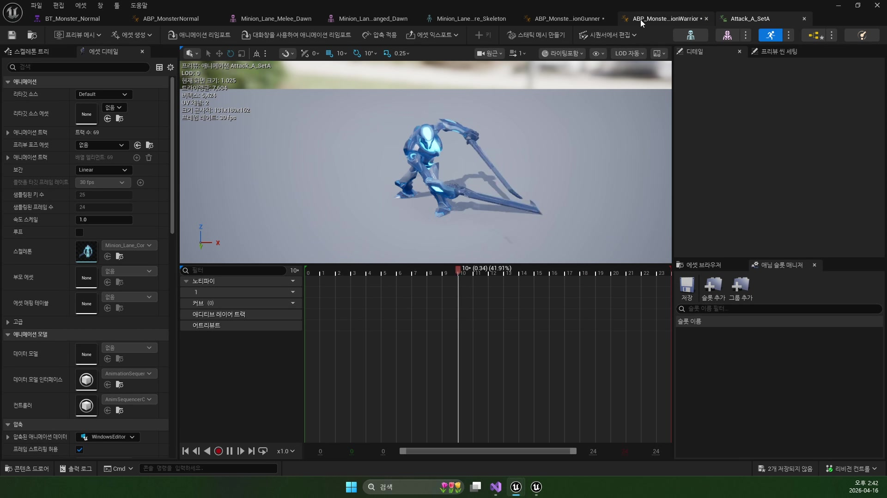
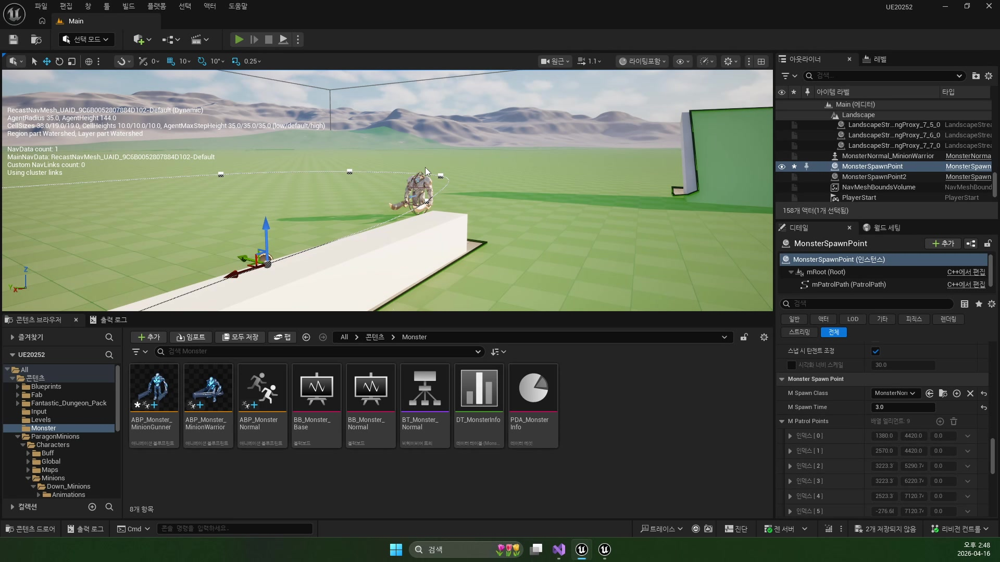
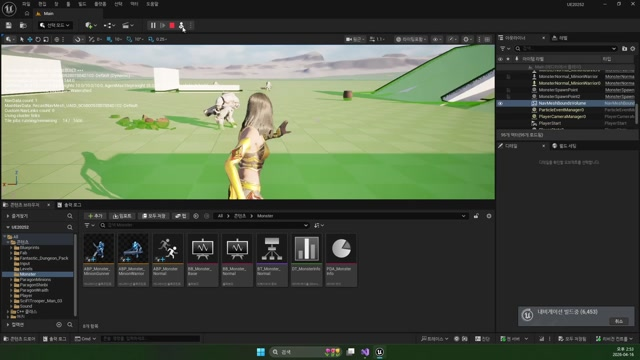

# 260416 01 MonsterAnimInstance와 상태 번역

[260416 허브](../) | [다음: 02 MonsterTrace Task와 전이 규칙](../02_intermediate_monster_trace_task_and_transition_logic/)

## 문서 개요

첫 강의의 핵심은 몬스터 애니메이션을 입력 기반이 아니라 `상태 기반 언어`로 단순화하는 데 있다.

## 1. 몬스터는 입력보다 상태로 읽는 편이 자연스럽다

플레이어는 입력 해석이 많지만, 일반 몬스터는 대체로 `Idle`, `Walk`, `Run`, `Attack`, `Death` 정도의 상태만으로도 충분히 설득력 있는 전이를 만들 수 있다.
그래서 강의는 몬스터를 입력 기반이 아니라 상태 기반으로 정리한다.

즉 Trace 태스크와 Attack 태스크는 "애니메이션을 계산하는 곳"이 아니라, `지금 무슨 상태인가`를 선언하는 곳이 된다.

## 2. `EMonsterNormalAnim`이 C++과 Anim Blueprint의 공용 언어가 된다

핵심 출발점은 공용 enum이다.

```cpp
enum class EMonsterNormalAnim : uint8
{
    Idle,
    Walk,
    Run,
    Attack,
    Death
};
```

이 enum 덕분에 추적 태스크는 `Run`, 공격 태스크는 `Attack`, 사망 처리는 `Death`를 같은 언어로 말할 수 있다.




## 3. `MonsterAnimInstance`는 계산자가 아니라 저장소다

강의의 좋은 점은 애님 인스턴스를 과하게 똑똑하게 만들지 않는다는 데 있다.
핵심 역할은 단순하다.

- 현재 상태를 `mAnimType`에 저장한다
- 노티파이가 오면 몬스터 본체나 블랙보드에 신호를 넘긴다

즉 판단은 AI 태스크가 하고, 애니메이션은 그 판단을 표현하는 쪽에 더 가깝다.

## 4. 종족별 차이는 상태 머신을 새로 짜는 대신 에셋 연결에서 해결한다

현재 덤프 기준으로 `ABP_Monster_MinionWarrior`, `ABP_Monster_MinionGunner`는 둘 다 공용 `ABP_MonsterNormal` 구조를 재사용한다.
즉 종족별 차이는 대부분 애님 자산 연결에서 만들고, 상태 언어 자체는 공통으로 유지한다.





이 설계 덕분에 몬스터 종류가 늘어나도 `Trace`, `Attack`, `Death` 루프는 그대로 두고 자산만 갈아끼우는 방식으로 확장하기 쉽다.

## 정리

첫 강의의 결론은 몬스터 애니메이션을 단순한 상태 소비자로 두는 데 있다.
이 역할 분리가 명확해야 다음 편의 `Trace`와 `Attack` 태스크도 훨씬 읽기 쉬워진다.

[260416 허브](../) | [다음: 02 MonsterTrace Task와 전이 규칙](../02_intermediate_monster_trace_task_and_transition_logic/)
