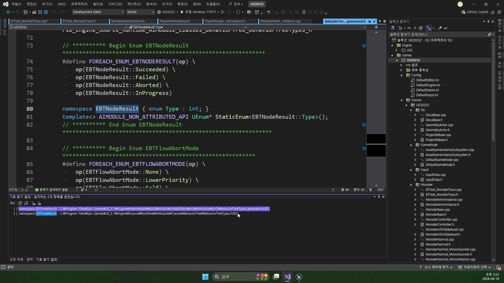
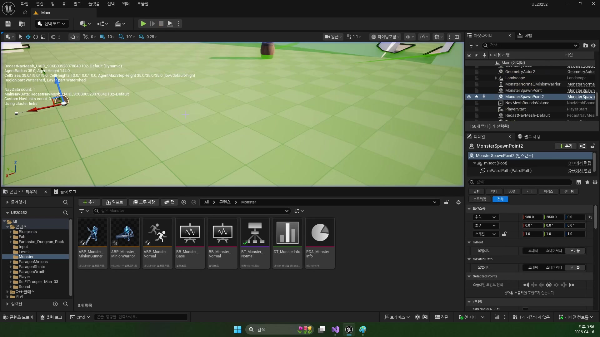

# 260416 02 MonsterTrace Task와 전이 규칙

[260416 허브](../) | [이전: 01 MonsterAnimInstance와 상태 번역](../01_intermediate_monster_animinstance_and_state_translation/) | [다음: 03 MonsterAttack Task와 Notify 루프](../03_intermediate_monster_attack_task_and_notify_loop/)

## 문서 개요

두 번째 강의는 `Trace` 태스크를 단순 추적 기능이 아니라, `공격 단계로 넘어가기 위한 전이 장치`로 읽는 법을 다룬다.

## 1. `Trace` 태스크는 성공보다 전이가 더 중요하다

처음 보면 몬스터가 타깃을 따라가는 동안 `Succeeded`를 돌려줘야 할 것 같지만, 현재 트리 구조에서는 그 반대가 더 자연스럽다.
`Trace`의 역할은 공격 거리까지 데려다주는 것이고, 그 역할이 끝나면 다음 `Attack` 브랜치가 열려야 한다.

즉 이 태스크는 추적 기능이면서 동시에 `상태 전이 규칙`이다.

## 2. `ExecuteTask`, `TickTask`, `OnTaskFinished`를 나눠 읽어야 한다

현재 프로젝트 기준 `Trace` 태스크는 장기 작업이다.

- `ExecuteTask()`: 추적 시작
- `TickTask()`: 거리와 상태 감시
- `OnTaskFinished()`: 종료 후 정리

`MoveToActor()` 한 번 호출하고 끝나는 구조가 아니라, 매 프레임 `타깃 유효성`, `이동 상태`, `공격 거리 진입 여부`를 계속 본다.

## 3. `MoveToActor()`와 `Run` 전환은 같은 사건의 두 표현이다

추적 시작 시점에는 두 가지가 같이 일어난다.

- 길찾기를 시작한다
- 시각 상태를 `Run`으로 바꾼다

즉 길찾기와 애니메이션은 별개 기능이 아니라, `지금부터 쫓아간다`는 같은 사건의 두 표현이다.

## 4. 공격 거리 진입은 왜 `Failed`인가

현재 트리에서 `Distance <= AttackDistance`가 되면 `Trace`는 더 이상 자기 역할을 할 필요가 없다.
그래서 일부러 `Failed`를 반환해 다음 공격 브랜치가 열리게 만든다.

이때의 `Failed`는 오류가 아니라 `전이 신호`에 가깝다.

이 이미지가 중요한 이유는 같은 `Trace` 태스크라도 `AttackDistance` 값에 따라 멈추는 시점이 달라지기 때문이다.
즉 이 날짜의 전투 AI는 코드만이 아니라 데이터 테이블 수치와도 직접 연결된다.

## 5. 현재 branch의 `BTTask_TraceGAS`는 수치 공급원만 다르다

현재 `BTTask_TraceGAS`도 구조는 거의 같다.
차이는 공격 거리 판정을 더 이상 `MonsterState` 멤버가 아니라 `Monster->GetAttributeSet()->GetAttackDistance()`에서 읽는다는 점이다.

즉 `260416`의 전이 규칙은 그대로인데, 현재 branch에선 그 수치를 GAS 계층이 공급하는 셈이다.

## 정리

두 번째 강의의 핵심은 `Trace`를 추적 기능이 아니라 전이 장치로 읽는 데 있다.
이 관점을 가지면 `Failed`는 버그가 아니라, 다음 행동을 의도적으로 여는 문이 된다.

[260416 허브](../) | [이전: 01 MonsterAnimInstance와 상태 번역](../01_intermediate_monster_animinstance_and_state_translation/) | [다음: 03 MonsterAttack Task와 Notify 루프](../03_intermediate_monster_attack_task_and_notify_loop/)
