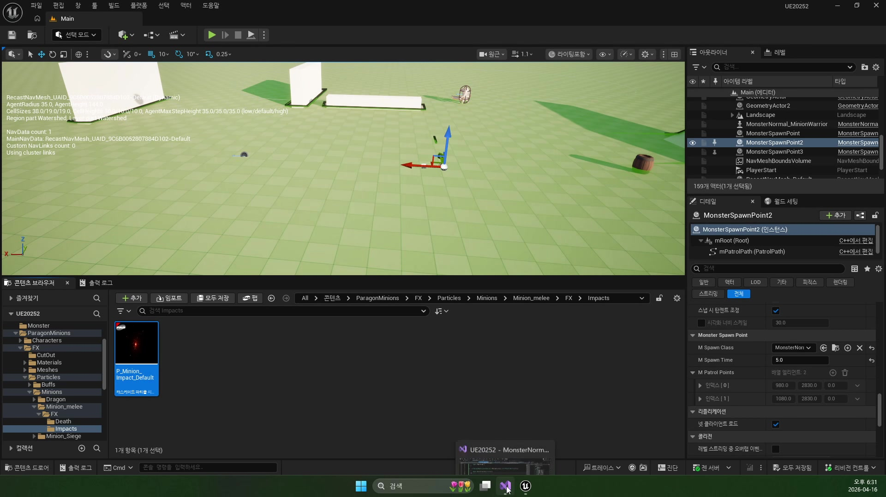
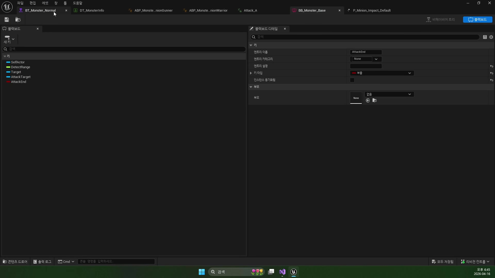
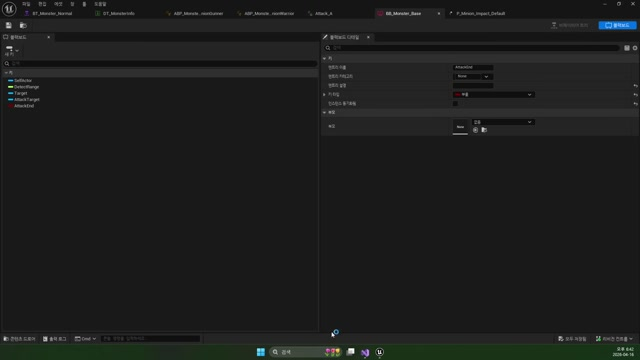
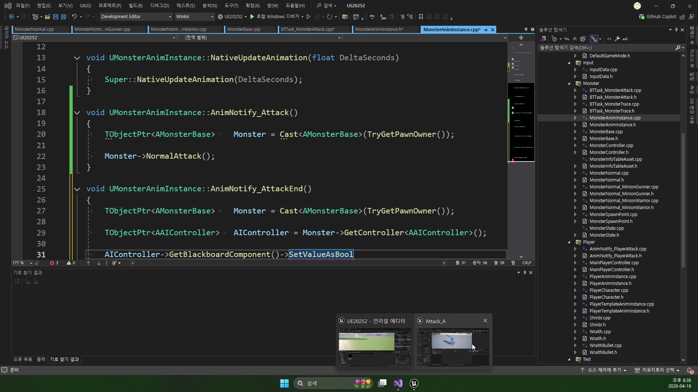

# 260416 03 MonsterAttack Task와 Notify 루프

[260416 허브](../) | [이전: 02 MonsterTrace Task와 전이 규칙](../02_intermediate_monster_trace_task_and_transition_logic/) | [다음: 04 공식 문서 부록](../04_appendix_official_docs_reference/)

## 문서 개요

세 번째 강의는 `공격 태스크 -> AttackTarget / AttackEnd -> AnimNotify -> 실제 데미지`가 어떻게 한 루프로 닫히는지 다룬다.

## 1. Attack 태스크는 데미지 함수가 아니라 공격 문맥 세터다

공격 태스크가 시작될 때 실제로 하는 일은 생각보다 단순하다.

- 애니메이션 상태를 `Attack`으로 바꾼다
- 현재 타깃을 `AttackTarget`에 저장한다
- 이후 종료 신호를 기다리며 태스크를 유지한다

즉 이 태스크의 핵심은 데미지 계산이 아니라 `공격 문맥 세팅`이다.



## 2. 왜 `Target`과 `AttackTarget`을 나누는가

`Target`은 추적과 인식의 기준이고, `AttackTarget`은 실제 타격 대상이다.
둘을 나누면 추적용 목표와 공격 시점의 실제 타격 대상을 더 유연하게 다룰 수 있다.





현재 프로젝트에선 여기에 `AttackEnd`까지 더해져, 공격 종료 시점을 AI 태스크가 안정적으로 읽을 수 있게 만든다.

## 3. `AnimNotify_Attack()`와 `AnimNotify_AttackEnd()`가 타격 시점과 종료 시점을 분리한다

강의의 핵심은 공격 상태가 시작됐다고 즉시 데미지를 주지 않는다는 점이다.
실제 타격은 `AnimNotify_Attack()` 프레임에서만 일어나고, 공격 종료는 `AnimNotify_AttackEnd()`가 따로 알려 준다.

```cpp
void UMonsterGASAnimInstance::AnimNotify_Attack()
{
    Monster->NormalAttack();
}

void UMonsterGASAnimInstance::AnimNotify_AttackEnd()
{
    AIController->GetBlackboardComponent()->SetValueAsBool(TEXT("AttackEnd"), true);
}
```


이 분리 덕분에 타격 타이밍과 상태 전이 타이밍을 따로 다룰 수 있다.

## 4. 공격 종료 후에만 다시 추적 여부를 판단한다

현재 `BTTask_AttackGAS`는 공격 중간에 흔들리지 않는다.
먼저 `AttackEnd`가 켜질 때까지 기다리고, 그 뒤에야 거리 재평가를 한다.

- 공격 거리 밖이면 `Failed`로 끝나 Trace 브랜치를 다시 연다
- 아직 공격 거리 안이면 타깃을 바라보게 회전만 조정한다
- 태스크가 끝나면 `AttackTarget`을 `nullptr`로 정리한다

즉 Attack 태스크는 한 번 치고 끝나는 함수보다, `공격 모션 단위로 재평가하는 작은 상태기계`에 가깝다.

## 5. 현재 branch 비교: 워리어는 GAS 데미지, 거너는 아직 연출 중심이다

legacy 루프에선 `MonsterNormal::NormalAttack()`가 `AttackTarget`을 읽어 직접 `TakeDamage()`를 호출했다.
현재 워리어 쪽은 여기가 GAS로 바뀌었다.

```cpp
EventData.EventTag = FGameplayTag::RequestGameplayTag(TEXT("Ability.Attack"));
UAbilitySystemBlueprintLibrary::SendGameplayEventToActor(this,
    EventData.EventTag, EventData);
```

이 이벤트는 `UGameplayAbility_Attack`로 넘어가 `Attack - Defense`를 계산하고, `UGameplayEffect_Damage`와 `GameplayCue.Battle.Attack`까지 이어진다.



반면 `AMonsterNormalGAS_Gunner::NormalAttack()`는 아직 `Ability.Attack` 이벤트를 보내지 않고 파티클만 뿌린다.
즉 현재 branch에선 워리어가 먼저 GAS 데미지 루프로 넘어갔고, 거너는 아직 연출 중심 상태다.

## 정리

세 번째 강의의 결론은 공격을 `데미지 한 번 주는 기능`으로 보지 않는 데 있다.
공격은 대상 저장, 애니메이션 전환, 노티파이, 종료 신호, 재추적 판정이 묶인 작은 상태기계다.

[260416 허브](../) | [이전: 02 MonsterTrace Task와 전이 규칙](../02_intermediate_monster_trace_task_and_transition_logic/) | [다음: 04 공식 문서 부록](../04_appendix_official_docs_reference/)
