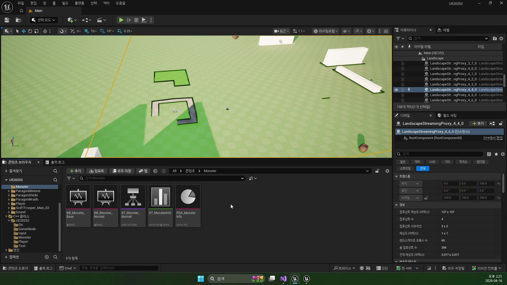
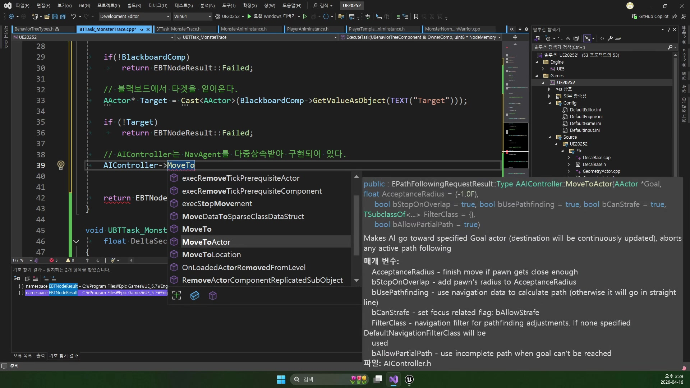
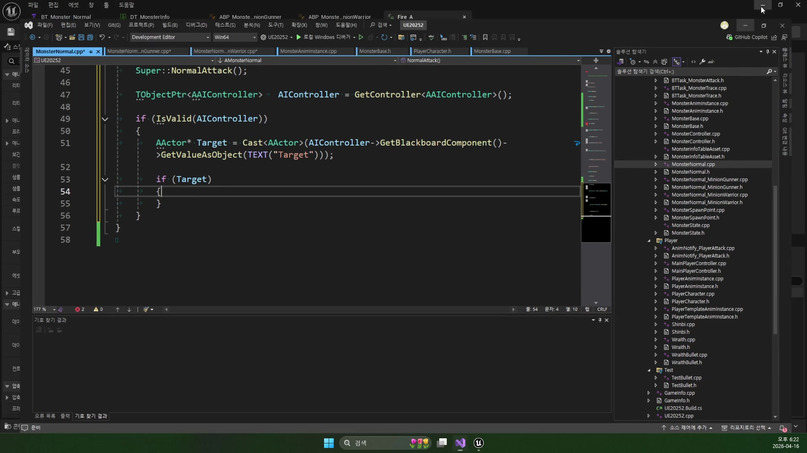

# 260416 추적에서 공격으로 넘어가고 노티파이 시점에 타격하는 몬스터 전투 AI 루프

## 문서 개요

이 문서는 `260416_1_Monster AnimInstance`, `260416_2_Monster Trace Task`, `260416_3_Monster Attack Task`를 하나의 전투 AI 교재로 다시 엮은 것이다.
중심 흐름은 `상태 enum -> Trace 태스크 -> Attack 태스크 -> AnimNotify -> 데미지 처리`다.

전날 강의가 몬스터를 필드에 세우고 추적 가능한 상태까지 만드는 과정이었다면, 이번 강의는 그 위에 전투 루프를 얹는 과정이다.
특히 이번 날짜에서 중요한 점은 공격 자체보다도 “어떤 상태를 언제 전환할 것인가”를 명확하게 구조화한다는 데 있다.

그래서 이 교재는 다음 질문에 답하는 방식으로 읽는 것이 좋다.

- 몬스터는 어떤 언어로 자신의 상태를 애니메이션 쪽에 전달하는가
- Trace 태스크는 왜 성공이 아니라 실패를 이용해 다음 단계로 넘어가는가
- 공격은 왜 곧바로 데미지를 주지 않고 노티파이 시점까지 기다리는가

이 교재는 강의 흐름뿐 아니라 `D:\UnrealProjects\UE_Academy_Stduy\Source\UE20252`와
`D:\UnrealProjects\UE_Academy_Stduy\Saved\AcademyUtility` 덤프를 함께 대조해 현재 구현 기준으로 정리했다.

## 학습 목표

- `EMonsterNormalAnim`과 `MonsterAnimInstance`의 관계를 설명할 수 있다.
- `BTTask_MonsterTrace`의 시작, 갱신, 종료 흐름을 말할 수 있다.
- `AttackTarget`, `AttackEnd`, `AnimNotify`가 각각 무엇을 담당하는지 구분할 수 있다.
- `UMonsterAnimInstance::AnimNotify_Attack()`, `UBTTask_MonsterAttack::TickTask()`, `AMonsterNormal::NormalAttack()`이 하나의 전투 루프로 어떻게 이어지는지 설명할 수 있다.
- 전투 AI를 디버깅할 때 애니메이션, 블랙보드, 태스크 반환값을 어떤 순서로 봐야 하는지 정리할 수 있다.

## 강의 흐름 요약

1. 공용 상태 enum과 AnimInstance를 정의해 몬스터 애니메이션 언어를 만든다.
2. Trace 태스크가 `MoveToActor`와 `Run` 전환을 시작하고, 공격 거리 진입 시 `Failed`로 다음 단계에 넘긴다.
3. Attack 태스크가 `AttackTarget`과 `AttackEnd`를 통해 공격 문맥과 종료 신호를 나눠 관리한다.
4. AnimNotify가 실제 타격 프레임과 공격 종료 시점을 알려 준다.

---

## 제1장. MonsterAnimInstance: 상태를 애니메이션 언어로 번역하기

### 1.1 왜 입력 기반이 아니라 상태 기반인가

일반 몬스터는 플레이어 캐릭터와 요구 사항이 다르다.
플레이어는 이동 입력, 점프 입력, 조준, 속도 변화 등 복잡한 입력 해석이 필요하지만, 일반 몬스터는 대체로 `Idle`, `Walk`, `Run`, `Attack`, `Death` 정도의 상태로도 충분히 설득력 있는 전이를 만들 수 있다.

강의는 이 차이를 정확히 짚는다.
즉 몬스터는 입력을 흉내 내기보다 이미 결정된 상태를 애니메이션 시스템에 전달하는 편이 구조상 더 간단하고 유지보수도 쉽다.

이 관점은 이후 Trace와 Attack 태스크를 읽을 때도 중요하다.
태스크는 “애니메이션을 계산하는 곳”이 아니라, “현재 상태가 무엇인지 선언하는 곳”이 되기 때문이다.

### 1.2 공용 enum이 상태의 기준점이 된다

이번 강의의 가장 중요한 출발점은 `EMonsterNormalAnim`이다.
이 enum은 C++ 로직과 Anim Blueprint가 동시에 읽는 공용 상태 집합이다.

```cpp
UENUM(BlueprintType)
enum class EMonsterNormalAnim : uint8
{
    Idle,
    Walk,
    Run,
    Attack,
    Death
};
```

이 enum이 중요한 이유는 상태 정의가 한 곳에 모인다는 데 있다.
Trace 태스크가 `Run`을 선언하고, Attack 태스크가 `Attack`을 선언하고, 죽음 처리 쪽이 `Death`를 선언하더라도 결국 모두 같은 언어를 쓴다.

즉 전투 AI 전체가 상태 전환이라는 공통 문장으로 묶인다.

현재 덤프 기준 `ABP_MonsterNormal`은 이 enum을 그대로 읽는 `Blend Poses (EMonsterNormalAnim)` 구조를 쓰고 있다.
즉 플레이어 쪽처럼 상태 머신이나 몽타주 중심으로 읽기보다, `Idle / Walk / Run / Attack / Death` 다섯 상태를 enum 한 개로 직접 고르는 구조라고 보는 편이 더 정확하다.

### 1.3 MonsterAnimInstance는 계산자가 아니라 저장소다

강의가 좋은 이유 중 하나는 Anim Blueprint를 과도하게 똑똑하게 만들지 않는다는 점이다.
`MonsterAnimInstance`는 복잡한 계산을 하지 않고, 그저 현재 상태를 들고 있는 슬롯 역할에 집중한다.

```cpp
EMonsterNormalAnim mAnimType;

void SetAnim(EMonsterNormalAnim Anim)
{
    mAnimType = Anim;
}
```

이 구조는 매우 단순하지만, 바로 그 단순함 때문에 강하다.
AI 쪽은 `SetAnim()`만 호출하면 되고, Anim Blueprint는 `mAnimType`만 읽으면 된다.
즉 의사결정과 표현이 서로 얽히지 않는다.

실제 코드 기준으로도 `NativeUpdateAnimation()`은 비어 있고, `MonsterAnimInstance`는 `mAnimType`, `mAnimMap`, `mBlendSpaceMap`, `mMontageMap`, `mHitAlpha`를 들고 있는 저장소에 가깝다.
현재 전투 루프에서 중심이 되는 것은 이 중 `mAnimType`과 `mAnimMap`이다.
덤프를 보면 `ABP_MonsterNormal`은 `Idle`, `Walk`, `Run`, `Attack`, `Death` 키로 시퀀스를 찾아 enum 블렌드에 꽂고, 별도로 `Hit` 시퀀스를 additive로 얹을 준비도 해 둔 상태다.

### 1.4 종족별 차이는 에셋 연결에서만 만든다

전사형 몬스터, 총잡이형 몬스터처럼 외형과 애니메이션은 달라도 공통 구조는 유지할 수 있다.
강의는 생성자 단계에서 서로 다른 Anim Blueprint만 연결하고, 상태 구조 자체는 동일하게 유지하는 방식을 택한다.

이 선택은 두 가지 장점을 준다.

- 행동 로직은 공통화하고 외형 연출만 분리할 수 있다.
- 새로운 몬스터 종족이 추가되어도 태스크 구조를 다시 짜지 않아도 된다.

현재 덤프 기준으로도 `ABP_Monster_MinionWarrior`, `ABP_Monster_MinionGunner`는 둘 다 `ABP_MonsterNormal`의 자식 블루프린트다.
즉 자식 블루프린트가 하는 일은 새 상태 머신을 만드는 것이 아니라, 부모가 정의한 공용 enum 기반 그래프 위에 종족별 애니메이션 자산을 꽂아 넣는 것이다.



### 1.5 장 정리

제1장의 결론은 애니메이션 시스템을 단순한 소비자로 두는 데 있다.
상태를 계산하는 곳은 AI 쪽이고, 애니메이션은 그 상태를 표현한다.
이 역할 분리가 명확해질수록 이후 Trace와 Attack 태스크도 읽기 쉬워진다.

---

## 제2장. MonsterTrace: 실패를 이용해 다음 단계로 넘어가기

### 2.1 Trace 태스크를 읽는 올바른 관점

두 번째 강의의 핵심은 기본 `Move To` 노드를 그대로 쓰지 않고, C++ 태스크를 직접 상속해 추적의 시작과 종료 조건을 설계하는 데 있다.
여기서 가장 중요한 오해는 “추적이 성공하면 성공을 반환해야 한다”는 생각이다.

현재 트리 구조에서는 그 반대가 더 자연스럽다.
Trace 태스크의 목적은 공격 거리 안에 들어왔음을 확인하고, 그 시점에서 다음 Attack 태스크가 열리게 만드는 것이다.
즉 이 노드는 추적의 완성이 아니라 공격 단계로 넘어가기 위한 전이 장치다.

### 2.2 태스크 수명주기를 나눠 읽어야 한다

강의는 `ExecuteTask`, `TickTask`, `OnTaskFinished`를 각각 분리해서 이해하도록 만든다.
이 점이 상당히 중요하다.

- `ExecuteTask`: 추적 시작
- `TickTask`: 거리와 상태 감시
- `OnTaskFinished`: 종료 후 정리

이렇게 나눠 보면 추적은 한 번 호출하고 끝나는 기능이 아니라, 일정 시간 동안 계속 감시해야 하는 장기 작업이라는 점이 드러난다.

```cpp
UBTTask_MonsterTrace::UBTTask_MonsterTrace()
{
    NodeName = TEXT("MonsterTrace");
    bNotifyTick = true;
    bNotifyTaskFinished = true;
}
```

이 초기 설정 자체가 이미 태스크의 성격을 말해 준다.
현재 `MonsterAttack` 태스크도 똑같이 `bNotifyTick = true`, `bNotifyTaskFinished = true`를 켜고 있으므로, 이번 날짜의 전투 루프 전체가 “한 프레임에 끝나는 함수”가 아니라 “틱 기반 장기 태스크”라는 점이 더 분명해진다.

### 2.3 MoveToActor와 Run 전환은 같은 문장이다

Trace 태스크의 시작 시점에는 두 가지가 동시에 일어난다.
목표를 향해 길찾기를 시작하고, 동시에 몬스터의 시각 상태를 `Run`으로 바꾼다.

```cpp
EPathFollowingRequestResult::Type MoveResult = AIController->MoveToActor(Target);
if (MoveResult == EPathFollowingRequestResult::Failed)
    return EBTNodeResult::Failed;

Monster->ChangeAnim(EMonsterNormalAnim::Run);
return EBTNodeResult::InProgress;
```

이 구조 덕분에 추적이 시작되는 순간 플레이어도 몬스터의 의도를 시각적으로 알아차릴 수 있다.
즉 길찾기와 애니메이션은 별개의 기능이 아니라 같은 사건의 두 표현이다.

그리고 `Trace` 태스크는 여기서 끝나지 않는다.
`TickTask()` 안에서는 `Target` 유무, `GetMoveStatus()`, 그리고 캡슐 높이를 보정한 실제 거리까지 계속 감시한다.
즉 `MoveToActor()` 한 번 호출하고 잊어버리는 것이 아니라, 추적 상태가 아직 유효한지 매 프레임 확인하는 구조다.

### 2.4 공격 거리 진입이 왜 실패인가

이번 강의의 가장 중요한 포인트는 여기다.
공격 거리 안에 들어오면 Trace 태스크는 `Succeeded`가 아니라 `Failed`를 반환한다.

처음 보면 이상해 보인다.
하지만 현재 Behavior Tree가 Selector 구조라는 점을 고려하면 오히려 이쪽이 더 자연스럽다.

- Trace가 계속 유효하면 아직 공격 단계가 아니다.
- 공격 거리 안에 들어왔다는 것은 Trace의 역할이 끝났다는 뜻이다.
- 따라서 현재 브랜치를 실패시켜 다음 Attack 태스크가 열리게 한다.

즉 여기서 `Failed`는 오류가 아니라 전이 규칙이다.
이 점을 이해하면 Behavior Tree 반환값을 훨씬 덜 기계적으로 보게 된다.

현재 코드에서는 두 경우 모두 `Failed`가 나올 수 있다.
`MoveStatus`가 `Idle`이 되었을 때와, 거리 계산 결과 `Distance <= Monster->GetAttackDistance()`가 되었을 때다.
반대로 타겟 자체가 사라지거나 AI/Blackboard를 잃은 경우는 `Succeeded`로 정리돼 트리가 비전투 쪽을 다시 평가하게 만든다.



### 2.5 추적 디버깅에서 자주 놓치는 부분

Trace가 제대로 동작하지 않을 때는 단순히 `MoveToActor()`만 보면 부족하다.
다음 항목을 같이 봐야 한다.

- Target이 실제로 Blackboard에 들어왔는가
- `MoveToActor()`가 `Failed`를 즉시 반환하는가
- 추적 도중 공격 거리 판정이 너무 빨리 걸리는가
- `bUseControllerRotationYaw = true`가 회전 반영에 영향을 주고 있는가

강의가 좋은 점은 반환값을 “성공/실패”라는 표면적 의미로만 다루지 않고, 트리 안에서 다음 행동을 여는 규칙으로 설명한다는 데 있다.

### 2.6 장 정리

제2장의 결론은 Trace 태스크를 추적 기능이 아니라 상태 전이 장치로 읽는 데 있다.
이 관점을 가지면 `Failed`는 더 이상 버그가 아니라, 다음 행동을 의도적으로 여는 문이 된다.

---

## 제3장. MonsterAttack: 공격 노티파이와 블랙보드로 루프를 닫기

### 3.1 공격 태스크는 데미지 함수가 아니다

세 번째 강의는 Attack 태스크를 만든다.
여기서 가장 먼저 정리해야 할 오해는 Attack 태스크가 곧바로 데미지를 주는 함수가 아니라는 점이다.

실제로 Attack 태스크의 첫 역할은 공격 문맥을 세팅하는 것이다.

- 애니메이션을 `Attack` 상태로 바꾼다.
- 현재 공격 대상을 `AttackTarget`으로 저장한다.
- 공격 종료 여부는 `AttackEnd`로 따로 관리한다.

즉 공격은 하나의 함수 호출이 아니라, 짧은 상태기계로 읽는 편이 맞다.

```cpp
Monster->ChangeAnim(EMonsterNormalAnim::Attack);
BlackboardComp->SetValueAsObject(TEXT("AttackTarget"), Target);
return EBTNodeResult::InProgress;
```

이 코드의 핵심은 데미지가 아니라 문맥 저장이다.
현재 태스크는 여기서 이동을 멈추지 않고, `AttackTarget`만 별도 슬롯에 잡아 둔 채 노티파이를 기다린다.
즉 Attack 태스크는 “한 번 치고 끝나는 함수”보다 “공격 상태를 유지하는 루프 시작점”에 가깝다.

### 3.2 왜 Target과 AttackTarget을 나누는가

강의에서 아주 좋은 설계 포인트는 `Target`과 `AttackTarget`을 분리하는 부분이다.
처음에는 같은 대상을 가리키는데 왜 굳이 이름을 나누는지 의문이 생길 수 있다.

하지만 역할이 다르다.

- `Target`: 추적과 인식의 기준
- `AttackTarget`: 실제 타격 대상

이렇게 나누면 추적 중의 목표와 공격 시점의 실제 타격 대상을 나중에 더 유연하게 다룰 수 있다.
특히 원거리 공격, 범위 공격, 스킬 캐스팅으로 확장할 때 이 분리가 매우 유리하다.

### 3.3 AnimNotify가 타격 시점과 종료 시점을 나눈다

강의의 실전성이 가장 잘 드러나는 부분은 노티파이 처리다.
공격 상태가 시작됐다고 즉시 데미지를 주는 것이 아니라, 실제 타격 프레임에서만 `AnimNotify_Attack()`이 호출되고, 공격 루프의 종료 지점에서 `AnimNotify_AttackEnd()`가 호출된다.

```cpp
void UMonsterAnimInstance::AnimNotify_Attack()
{
    Monster->NormalAttack();
}

void UMonsterAnimInstance::AnimNotify_AttackEnd()
{
    AIController->GetBlackboardComponent()->SetValueAsBool(TEXT("AttackEnd"), true);
}
```

이 분리 덕분에 다음 두 가지를 동시에 만족할 수 있다.

- 타격은 애니메이션 타이밍에 맞게 일어난다.
- 태스크 종료는 별도 종료 신호를 기준으로 안정적으로 판단할 수 있다.

현재 코드에는 `AnimNotify_Death()`도 같이 들어 있어, 같은 AnimInstance가 전투 루프와 사망 전환까지 함께 담당한다.
즉 이 날의 몬스터 애님 인스턴스는 플레이어처럼 복잡한 계산자가 아니라, `Attack`, `AttackEnd`, `Death` 같은 전투 이벤트 전달 허브라고 이해하면 된다.
또 현재 `ABP_MonsterNormal`은 공격을 몽타주 재생으로 관리하지 않고 `mAnimType == Attack`일 때 `mAnimMap["Attack"]` 시퀀스를 계속 쓰는 구조라서, Attack 태스크가 살아 있는 동안 공격 애니메이션 루프도 같이 유지된다.



### 3.4 공격 종료 후에만 재추적 여부를 판단하는 이유

공격 중간에 거리가 조금 멀어졌다고 곧바로 Trace로 돌아가면 몬스터가 흔들려 보인다.
그래서 Attack 태스크는 공격이 완전히 끝났다는 신호를 받은 뒤에만 거리를 다시 계산하고, 계속 싸울지 다시 쫓을지를 결정한다.

이 판단은 전투 연출 측면에서 매우 중요하다.
모션이 끝나기도 전에 다음 상태로 튀지 않으므로, 공격 루프가 훨씬 안정적으로 보인다.

현재 코드 흐름을 그대로 풀면 다음과 같다.

1. `TickTask()`는 `Blackboard.AttackEnd`가 `true`가 될 때까지 계속 `InProgress` 상태를 유지한다.
2. `AttackEnd`가 켜지면 곧바로 다시 `false`로 내린다.
3. 타겟과 몬스터의 캡슐 높이를 보정한 뒤 거리를 계산한다.
4. 거리가 공격 거리보다 멀면 `Failed`로 끝나 Trace 쪽을 다시 열어 준다.
5. 아직 공격 거리 안이면 타겟을 바라보게 회전만 시키고 태스크는 계속 유지된다.
6. 태스크가 실제로 끝나는 시점에는 `OnTaskFinished()`가 `AttackTarget`을 `nullptr`로 비워 공격 문맥을 정리한다.

즉 Attack 태스크는 “성공하면 끝”이 아니라, AttackEnd 노티파이마다 재평가를 반복하는 전투 루프에 가깝다.
강의는 이 부분을 “종료 후 재추적 여부 판정”으로 설명하지만, 더 넓게 보면 애니메이션 시간과 AI 상태 전이 시간을 일치시키는 작업이라고 볼 수 있다.

### 3.5 실제 데미지는 누가 주는가

Attack 태스크가 문맥을 세팅하고, AnimNotify가 타이밍을 알려준다면, 실제 타격 행위는 몬스터 클래스가 수행한다.
즉 역할은 이렇게 분리된다.

1. 태스크: 공격 상태 시작
2. 노티파이: 실제 타이밍 전달
3. 몬스터 클래스: 데미지 적용

현재 구현을 조금 더 정확히 보면, 기본 데미지는 `AMonsterNormal::NormalAttack()`이 `AttackTarget`을 읽어 `Target->TakeDamage(mAttack, ...)`로 처리한다.
그리고 `AMonsterNormal_MinionWarrior`, `AMonsterNormal_MinionGunner`는 둘 다 `Super::NormalAttack()`을 먼저 호출한 뒤 `P_Minion_Impact_Default` 파티클을 타깃 위치에 뿌린다.

즉 전사형과 총잡이형이 현재 코드에서 완전히 다른 공격 방식을 갖는 것은 아니다.
둘 다 같은 블랙보드/노티파이/데미지 파이프라인을 공유하고, 자식 클래스는 주로 외형과 추가 이펙트를 덧붙인다.
특히 이름과 달리 현재 `MinionGunner`는 아직 투사체를 발사하지 않고, 부모가 준 직접 데미지 위에 이펙트만 얹는 구조다.

이 설계는 유지보수 측면에서도 좋다.
태스크는 AI 흐름만 책임지고, 데미지 규칙은 몬스터 클래스 쪽에서 개별적으로 다룰 수 있기 때문이다.

### 3.6 장 정리

제3장의 결론은 공격 루프를 “데미지 한 번 주는 기능”으로 보지 않는 데 있다.
공격은 대상 저장, 애니메이션 전환, 노티파이, 종료 신호, 회전 보정, 재추적 판정이 묶인 작은 상태기계다.

이 관점을 이해하면 이후 원거리 몬스터나 보스 패턴 확장도 같은 틀 안에서 설계할 수 있다.

---

## 제4장. 현재 프로젝트 C++ 코드로 다시 읽는 260416 핵심 구조

### 4.1 왜 260416은 "공격 기능 추가"보다 "전투 타이밍 연결" 강의인가

`260416`을 겉으로만 보면 몬스터가 공격하도록 만드는 날처럼 보인다.
하지만 현재 프로젝트 C++를 기준으로 읽으면, 이 날짜의 진짜 핵심은 공격 기능 하나를 새로 만드는 것이 아니라,
`AI 태스크`, `애니메이션 노티파이`, `실제 데미지 함수`를 정확한 순서로 이어 붙이는 데 있다.

현재 구현의 큰 흐름은 아래와 같다.

1. `UBTTask_MonsterTrace`가 타겟을 향해 달리게 만든다.
2. 공격 거리 안에 들어오면 `Trace` 태스크가 `Failed`를 반환해 공격 단계로 넘긴다.
3. `UBTTask_MonsterAttack`이 애니메이션 상태를 `Attack`으로 바꾸고 `AttackTarget`을 저장한다.
4. 애니메이션이 재생되다가 타격 프레임에서 `AnimNotify_Attack()`이 호출된다.
5. `AMonsterNormal::NormalAttack()`이 블랙보드의 `AttackTarget`을 읽어 `TakeDamage()`를 호출한다.
6. 공격 끝 프레임에서 `AnimNotify_AttackEnd()`가 `AttackEnd = true`를 올린다.
7. `BTTask_MonsterAttack::TickTask()`가 그 값을 읽고, 계속 공격할지 다시 추적할지 결정한다.

즉 `260416`은 "공격 애니메이션을 틀었다"로 끝나는 강의가 아니다.
`행동 결정`, `타격 타이밍`, `종료 판정`을 서로 다른 계층에서 나눠 가진 뒤, 그것들을 하나의 루프로 맞물리게 만드는 강의다.

아래 코드는 `D:\UnrealProjects\UE_Academy_Stduy\Source\UE20252`의 실제 구현에서 핵심만 추려 온 뒤,
처음 보는 사람도 읽을 수 있게 설명용 주석을 붙인 축약판이다.

### 4.2 `UMonsterAnimInstance`: 몬스터 애니메이션 상태와 노티파이 이벤트를 들고 있는 얇은 다리

플레이어 쪽 애님 인스턴스는 계산량이 꽤 많지만, 현재 몬스터 애님 인스턴스는 의도적으로 단순하다.
핵심 역할은 두 가지다.

- 현재 애니메이션 상태를 `mAnimType`에 저장한다.
- 애니메이션 노티파이 이벤트가 오면 몬스터 본체나 블랙보드에 신호를 전달한다.

```cpp
UCLASS()
class UE20252_API UMonsterAnimInstance : public UAnimInstance
{
    GENERATED_BODY()

protected:
    // 지금 몬스터가 어떤 상태 애니메이션을 써야 하는지 저장한다.
    EMonsterNormalAnim mAnimType;

    // 상태 이름별 시퀀스, 블렌드스페이스, 몽타주를 담아 둔다.
    // 현재 260416 전투 루프에서 핵심은 mAnimType과 mAnimMap이다.
    TMap<FString, TObjectPtr<UAnimSequence>> mAnimMap;
    TMap<FString, TObjectPtr<UBlendSpace>> mBlendSpaceMap;
    TMap<FString, TObjectPtr<UAnimMontage>> mMontageMap;

public:
    void SetAnim(EMonsterNormalAnim Anim)
    {
        // AI 쪽에서 Idle, Run, Attack, Death 같은 상태를 넘겨 주면
        // 애님 블루프린트는 이 값만 읽어서 어떤 포즈를 쓸지 결정한다.
        mAnimType = Anim;
    }

    UFUNCTION()
    void AnimNotify_Attack();

    UFUNCTION()
    void AnimNotify_AttackEnd();

    UFUNCTION()
    void AnimNotify_Death();
};
```

이 코드에서 초보자가 꼭 봐야 할 점은 `UMonsterAnimInstance`가 "판단자"가 아니라는 것이다.
누굴 공격할지, 언제 추적을 끝낼지는 AI 태스크가 판단한다.
애님 인스턴스는 그 판단 결과를 화면에 보이게 하고, 애니메이션이 재생되는 정확한 프레임에 맞춰 다시 게임 로직에 신호를 넘겨주는 얇은 다리 역할을 한다.

### 4.3 `AnimNotify_Attack()`, `AnimNotify_AttackEnd()`, `AnimNotify_Death()`: 애니메이션 프레임을 게임 규칙으로 번역한다

실제 구현을 보면 세 노티파이 함수의 역할이 아주 선명하게 나뉜다.

```cpp
void UMonsterAnimInstance::AnimNotify_Attack()
{
    // 지금 이 애니메이션을 재생 중인 주인이 어떤 몬스터인지 얻어온다.
    TObjectPtr<AMonsterBase> Monster = Cast<AMonsterBase>(TryGetPawnOwner());

    // "지금이 타격 프레임이다"라는 신호를 몬스터 본체에 넘긴다.
    Monster->NormalAttack();
}

void UMonsterAnimInstance::AnimNotify_AttackEnd()
{
    TObjectPtr<AMonsterBase> Monster = Cast<AMonsterBase>(TryGetPawnOwner());
    TObjectPtr<AAIController> AIController = Monster->GetController<AAIController>();

    // 공격이 끝났다는 사실은 애님 인스턴스가 직접 판단하지 않고,
    // 블랙보드의 AttackEnd 플래그를 올려서 AI 태스크가 읽게 만든다.
    AIController->GetBlackboardComponent()->SetValueAsBool(TEXT("AttackEnd"), true);
}

void UMonsterAnimInstance::AnimNotify_Death()
{
    TObjectPtr<AMonsterBase> Monster = Cast<AMonsterBase>(TryGetPawnOwner());

    // 사망 후반 처리(랙돌, 수명, 물리 전환)는 몬스터 본체가 맡는다.
    Monster->Death();
}
```

이 구조가 좋은 이유는 "타격 시점"과 "공격 종료 시점"을 분리하기 때문이다.

- `AnimNotify_Attack()`: 실제 데미지를 줘도 되는 프레임
- `AnimNotify_AttackEnd()`: 이번 공격 동작이 끝났다고 AI가 다시 판단해도 되는 프레임
- `AnimNotify_Death()`: 사망 애니메이션의 특정 프레임에서 랙돌 후반 처리로 넘어가도 되는 시점

즉 노티파이는 "애니메이션 장식"이 아니라, 타이밍이 중요한 게임 규칙을 프레임 단위로 연결해 주는 장치다.

### 4.4 `UBTTask_MonsterTrace`: 공격 태스크를 열기 전까지 계속 타겟을 좇는 장기 태스크

이전 장에서도 설명했지만, C++를 직접 읽으면 `Trace` 태스크의 역할이 더 선명해진다.
핵심은 "쫓아간다" 하나가 아니라, "언제 추적을 끝내고 공격 판단으로 넘길지"를 계속 감시하는 데 있다.

```cpp
EBTNodeResult::Type UBTTask_MonsterTrace::ExecuteTask(
    UBehaviorTreeComponent& OwnerComp, uint8* NodeMemory)
{
    AAIController* AIController = OwnerComp.GetAIOwner();
    UBlackboardComponent* BlackboardComp = OwnerComp.GetBlackboardComponent();
    AActor* Target = Cast<AActor>(BlackboardComp->GetValueAsObject(TEXT("Target")));
    AMonsterBase* Monster = AIController->GetPawn<AMonsterBase>();

    // 이동 요청을 시작한다.
    EPathFollowingRequestResult::Type MoveResult = AIController->MoveToActor(Target);
    if (MoveResult == EPathFollowingRequestResult::Failed)
        return EBTNodeResult::Failed;

    // 추적이 시작됐으니 시각 상태도 Run으로 맞춘다.
    Monster->ChangeAnim(EMonsterNormalAnim::Run);

    // 한 프레임에 끝나는 작업이 아니라 계속 감시해야 하므로 InProgress를 돌려준다.
    return EBTNodeResult::InProgress;
}
```

그리고 `TickTask()`에서는 매 프레임 이런 질문을 한다.

1. 컨트롤러나 블랙보드가 아직 유효한가
2. 타겟이 아직 존재하는가
3. 이동 상태가 비정상적으로 `Idle`이 되었는가
4. 현재 거리가 `AttackDistance` 안으로 들어왔는가

```cpp
void UBTTask_MonsterTrace::TickTask(
    UBehaviorTreeComponent& OwnerComp, uint8* NodeMemory, float DeltaSeconds)
{
    // 중간에 컨트롤러/블랙보드/타겟이 사라졌다면
    // 전투 브랜치를 계속 밀고 갈 이유가 없으니 정리한다.
    if (!AIController || !BlackboardComp || !Target || !Monster)
    {
        FinishLatentTask(OwnerComp, EBTNodeResult::Succeeded);
        return;
    }

    // 길찾기가 멈췄거나
    if (AIController->GetMoveStatus() == EPathFollowingStatus::Idle)
    {
        FinishLatentTask(OwnerComp, EBTNodeResult::Failed);
    }

    // 공격 거리 안에 들어오면 Trace의 역할은 끝난다.
    if (Distance <= Monster->GetAttackDistance())
    {
        FinishLatentTask(OwnerComp, EBTNodeResult::Failed);
    }
}
```

여기서 `Failed`가 버그가 아니라는 점이 중요하다.
현재 트리에서는 `Trace`가 공격 가능 거리까지 데려다주는 역할을 하고 있으므로,
그 역할이 끝난 시점에 일부러 `Failed`를 반환해 다음 공격 브랜치가 열리게 만든다.

### 4.5 `UBTTask_MonsterAttack`: 데미지를 바로 주지 않고 "공격 문맥"을 세팅한 뒤 노티파이를 기다린다

초보자가 가장 많이 오해하는 지점이 여기다.
`MonsterAttack` 태스크는 이름 때문에 "여기서 데미지를 주겠지"라고 생각하기 쉽지만,
실제 역할은 데미지 실행이 아니라 "지금부터 공격 상태다"라고 AI 문맥을 세팅하는 데 더 가깝다.

```cpp
EBTNodeResult::Type UBTTask_MonsterAttack::ExecuteTask(
    UBehaviorTreeComponent& OwnerComp, uint8* NodeMemory)
{
    AAIController* AIController = OwnerComp.GetAIOwner();
    UBlackboardComponent* BlackboardComp = OwnerComp.GetBlackboardComponent();
    AActor* Target = Cast<AActor>(BlackboardComp->GetValueAsObject(TEXT("Target")));
    AMonsterBase* Monster = AIController->GetPawn<AMonsterBase>();

    // 이제 추적이 아니라 공격 상태임을 애니메이션 쪽에 알린다.
    Monster->ChangeAnim(EMonsterNormalAnim::Attack);

    // 실제 타격에 사용할 대상을 별도 슬롯에 저장한다.
    BlackboardComp->SetValueAsObject(TEXT("AttackTarget"), Target);

    // 아직 공격은 끝나지 않았으므로 장기 태스크 상태를 유지한다.
    return EBTNodeResult::InProgress;
}
```

즉 `Attack` 태스크는 세 가지 준비만 한다.

- 애니메이션 상태를 `Attack`으로 바꾼다.
- 실제 타격 대상을 `AttackTarget`에 저장한다.
- 이후 판정을 위해 태스크를 계속 살아 있게 둔다.

이 시점에는 아직 `TakeDamage()`가 호출되지 않는다.
진짜 타격은 애니메이션 프레임이 `AnimNotify_Attack()`에 도달했을 때만 일어난다.

### 4.6 `BTTask_MonsterAttack::TickTask()`: 공격 종료 신호가 올라온 뒤에만 다음 행동을 고른다

공격 태스크가 좋은 이유는 성급하게 상태를 바꾸지 않는 데 있다.
매 프레임 거리를 다시 재서 곧바로 추적/공격을 바꾸는 것이 아니라, 먼저 `AttackEnd` 플래그가 켜질 때까지 기다린다.

```cpp
void UBTTask_MonsterAttack::TickTask(
    UBehaviorTreeComponent& OwnerComp, uint8* NodeMemory, float DeltaSeconds)
{
    AAIController* AIController = OwnerComp.GetAIOwner();
    UBlackboardComponent* BlackboardComp = OwnerComp.GetBlackboardComponent();
    AActor* Target = Cast<AActor>(BlackboardComp->GetValueAsObject(TEXT("Target")));
    AMonsterBase* Monster = AIController->GetPawn<AMonsterBase>();

    bool AttackEnd = BlackboardComp->GetValueAsBool(TEXT("AttackEnd"));

    if (AttackEnd)
    {
        // 이번 공격이 끝났으니 다음 루프를 위해 다시 false로 내려준다.
        BlackboardComp->SetValueAsBool(TEXT("AttackEnd"), false);

        // 공격 종료 시점에서만 거리를 다시 재평가한다.
        if (Distance > Monster->GetAttackDistance())
        {
            // 너무 멀어졌다면 공격 루프를 끊고 Trace 쪽으로 되돌린다.
            FinishLatentTask(OwnerComp, EBTNodeResult::Failed);
        }
        else
        {
            // 아직 공격 거리 안이면 다음 공격이 자연스럽게 이어지도록
            // 타겟을 향해 몸을 다시 돌려 준다.
            FRotator Rot = GetTargetRotatorYaw(TargetLocation, MonsterLocation);
            Monster->SetActorRotation(Rot);
        }
    }
}
```

이 코드를 보면 `AttackEnd`라는 블랙보드 키가 왜 필요한지 바로 이해할 수 있다.
AI는 "공격 시작"을 알고 있어도 "공격 애니메이션이 정말 끝났는지"는 애니메이션 시스템이 알려줘야 한다.
그래서 애님 인스턴스가 `AttackEnd = true`를 올리고, 태스크가 그 신호를 읽어 다음 행동을 고른다.

또 `OnTaskFinished()`에서는 `AttackTarget`을 `nullptr`로 비운다.
즉 공격 루프가 완전히 끝난 뒤에는 이전 타격 대상 문맥을 남기지 않고 깨끗하게 정리한다.

### 4.7 `AMonsterNormal::NormalAttack()`: 실제 데미지는 몬스터 본체가 `AttackTarget`을 읽어 처리한다

노티파이가 타격 프레임을 알려 줬다면, 실제 데미지를 주는 주체는 몬스터 클래스다.
현재 기본 구현은 `AMonsterNormal::NormalAttack()`에 들어 있다.

```cpp
void AMonsterNormal::NormalAttack()
{
    Super::NormalAttack();

    TObjectPtr<AAIController> AIController = GetController<AAIController>();

    if (IsValid(AIController))
    {
        // Attack 태스크가 미리 저장해 둔 실제 공격 대상을 가져온다.
        AActor* Target = Cast<AActor>(
            AIController->GetBlackboardComponent()->GetValueAsObject(TEXT("AttackTarget")));

        if (Target)
        {
            FDamageEvent DmgEvent;

            // 이 프레임에서만 실제 데미지를 전달한다.
            Target->TakeDamage(mAttack, DmgEvent, GetController(), this);
        }
    }
}
```

이 함수에서 중요한 포인트는 두 가지다.

- 타겟을 직접 찾지 않고 블랙보드의 `AttackTarget`을 읽는다.
- 데미지 양은 `mAttack`을 쓴다. 즉 `260414`에서 로드한 몬스터 데이터가 여기서 실제 전투 수치로 이어진다.

결국 `260414`의 `DataTable/AssetManager`가 숫자를 준비하고,
`260415`의 `Perception/Trace`가 대상을 준비하고,
`260416`의 `AttackTask/AnimNotify`가 타이밍을 준비해서,
여기서 비로소 실제 데미지가 발생하는 셈이다.

### 4.8 `MonsterNormal_MinionWarrior`, `MonsterNormal_MinionGunner`: 현재 자식 클래스는 공격 방식보다 연출을 덧붙이는 쪽에 가깝다

이름만 보면 전사와 총잡이가 완전히 다른 공격 구조를 가질 것 같지만,
현재 코드에서는 둘 다 부모의 직접 데미지 루프를 그대로 재사용한다.

```cpp
void AMonsterNormal_MinionWarrior::NormalAttack()
{
    // 부모가 먼저 AttackTarget에 데미지를 넣는다.
    Super::NormalAttack();

    // 그 다음 전사용 타격 이펙트를 재생한다.
    UGameplayStatics::SpawnEmitterAtLocation(GetWorld(), Particle,
        Target->GetActorLocation());
}

void AMonsterNormal_MinionGunner::NormalAttack()
{
    // 총잡이도 아직은 부모의 직접 데미지 방식을 그대로 쓴다.
    Super::NormalAttack();

    // 차이는 현재 시점에서는 파티클 연출 정도다.
    UGameplayStatics::SpawnEmitterAtLocation(GetWorld(), Particle,
        Target->GetActorLocation());
}
```

즉 현재 프로젝트 기준 `MinionGunner`는 이름과 달리 아직 투사체형 몬스터가 아니다.
`Trace -> AttackTarget -> AnimNotify_Attack -> NormalAttack -> TakeDamage`라는 근접형에 가까운 기본 루프를 공유하고,
자식 클래스는 메시/애님 블루프린트/이펙트 자산만 바꾸는 수준에 머물러 있다.

이 사실은 오히려 학습용으로는 좋다.
먼저 공용 전투 루프를 안정화한 뒤, 나중에 정말 원거리형으로 바꿀 때 어디를 확장해야 하는지가 분명해지기 때문이다.

### 4.9 `AMonsterBase::TakeDamage()`와 `Death()`: 전투 루프의 끝도 몬스터 본체가 책임진다

타격이 들어간 뒤의 후반 처리 역시 애님 인스턴스나 태스크가 아니라 몬스터 본체가 담당한다.

```cpp
float AMonsterBase::TakeDamage(float DamageAmount, const FDamageEvent& DamageEvent,
    AController* EventInstigator, AActor* DamageCauser)
{
    float Dmg = Super::TakeDamage(DamageAmount, DamageEvent, EventInstigator, DamageCauser);

    Dmg -= mDefense;
    if (Dmg < 1.f)
        Dmg = 1.f;

    mHP -= Dmg;

    if (mHP <= 0.f)
    {
        mHP = 0.f;

        // 우선 애니메이션 상태를 Death로 바꿔 죽는 모션으로 들어간다.
        mAnimInst->SetAnim(EMonsterNormalAnim::Death);

        // 더 이상 AI가 새 행동을 하지 못하게 Brain을 정지한다.
        MonsterController->BrainComponent->StopLogic(TEXT("Death"));
        MonsterController->BrainComponent->Cleanup();

        // 충돌과 이동도 정리한다.
        mBody->SetCollisionEnabled(ECollisionEnabled::NoCollision);
        mMovement->StopMovementImmediately();
        mMovement->Deactivate();
        mMovement->SetComponentTickEnabled(false);
    }

    return Dmg;
}
```

그리고 죽는 애니메이션의 특정 프레임에서 `AnimNotify_Death()`가 호출되면, 그때 `Death()`가 랙돌과 수명 처리를 진행한다.
즉 전투 루프의 시작은 `Trace`, 중간은 `Attack/Notify`, 끝은 `TakeDamage/Death`로 닫힌다.

### 4.10 장 정리

현재 C++ 코드로 읽으면 `260416`의 몬스터 전투 루프는 다음 한 문장으로 요약할 수 있다.

`Trace 태스크가 공격 거리에 데려간다 -> Attack 태스크가 공격 문맥을 세팅한다 -> AnimNotify가 정확한 프레임을 알려 준다 -> Monster 클래스가 실제 데미지와 사망 처리를 수행한다`

이 구조가 좋은 이유는 역할이 분리되어 있기 때문이다.

- `BTTask_MonsterTrace`: 언제 공격 단계로 넘어갈지 결정
- `BTTask_MonsterAttack`: 공격 상태 유지와 종료 후 재평가 담당
- `UMonsterAnimInstance`: 타격 프레임과 종료 프레임을 이벤트로 전달
- `AMonsterNormal`: 실제 데미지 적용
- `AMonsterBase`: 피격, 사망, AI 종료, 이동 정리 담당

즉 `260416`은 "몬스터가 때리게 만들었다"가 아니라, 전투를 안전하게 반복할 수 있는 계층 분리형 루프를 완성하는 날이라고 보는 편이 맞다.

---

## 전체 정리

260416 강의는 몬스터 전투 AI가 어떻게 “상태 중심 구조”로 안정화되는지를 보여 준다.
핵심은 다음과 같다.

1. `EMonsterNormalAnim`이 공용 상태 언어를 만든다.
2. `MonsterAnimInstance`가 그 상태를 저장하고 `ABP_MonsterNormal`은 enum 블렌드로 표현한다.
3. Trace 태스크가 추적과 공격 진입의 경계를 관리한다.
4. Attack 태스크가 `AttackTarget`, `AttackEnd`, 거리 재평가를 통해 공격 문맥과 종료 규칙을 관리한다.
5. AnimNotify가 실제 타격 시점과 루프 종료 시점을 분리하고, 몬스터 클래스가 실제 데미지와 이펙트를 수행한다.
6. 현재 C++ 기준으로는 `Trace -> AttackTarget 세팅 -> AnimNotify_Attack -> NormalAttack -> TakeDamage -> AnimNotify_Death`까지가 하나의 종단 간 전투 파이프라인이다.

즉 전투 AI의 완성은 화려한 기능을 많이 붙이는 것이 아니라, 상태와 시점을 정확히 나누는 데 있다.

## 복습 체크리스트

- `EMonsterNormalAnim`이 왜 공용 언어 역할을 하는지 설명할 수 있는가
- Trace 태스크의 `Failed`가 왜 오류가 아니라 전이 규칙인지 설명할 수 있는가
- `AttackTarget`과 `AttackEnd`를 분리한 이유를 말할 수 있는가
- AnimNotify가 타격 시점과 종료 시점을 나눠 주는 장점을 설명할 수 있는가
- 공격 중 재추적 여부를 즉시 판단하지 않고 종료 후 판단하는 이유를 설명할 수 있는가
- `AnimNotify_Attack() -> AMonsterNormal::NormalAttack() -> Target->TakeDamage()` 호출 흐름을 코드 기준으로 설명할 수 있는가

## 세미나 질문

1. Trace 태스크가 현재 Selector 구조가 아니라 Sequence 구조 아래에 있다면 반환값 설계는 어떻게 달라져야 하는가.
2. `AttackTarget`과 `Target`을 분리한 구조는 원거리 몬스터나 범위 공격으로 갈 때 어떤 장점을 주는가.
3. 몬스터 애니메이션 상태를 enum 기반으로 유지하는 방식은 보스 몬스터에도 그대로 적용할 수 있는가.
4. Attack 태스크 종료 후 회전 보정만 하고 재추적은 잠시 미루는 설계가 필요한 경우는 어떤 상황인가.
5. `MinionGunner`를 진짜 원거리 몬스터로 바꾸려면 현재 구조에서 `BTTask`, `AnimNotify`, `NormalAttack()` 중 어디를 먼저 바꾸는 것이 가장 자연스러운가.

## 권장 과제

1. `MonsterNormal_MinionGunner` 기준으로 원거리 공격 버전을 설계하고, 어떤 블랙보드 키가 추가로 필요할지 정리한다.
2. Trace 태스크가 `Succeeded`를 반환하도록 바꿨을 때 트리 실행 흐름이 어떻게 달라지는지 기록한다.
3. `AttackEnd` 대신 Montage 종료 이벤트를 쓰는 대안이 있는지 조사하고 장단점을 비교한다.
4. 다음 확장 과제로 “피격 반응 상태”를 추가한다면 enum, 태스크, 노티파이 중 어디를 어떻게 바꾸는 것이 가장 적절한지 설계안을 써 본다.
5. `MonsterAnimInstance.cpp`, `BTTask_MonsterTrace.cpp`, `BTTask_MonsterAttack.cpp`, `MonsterNormal.cpp`, `MonsterBase.cpp`를 기준으로 `추적 시작 -> 공격 시작 -> 타격 프레임 -> 공격 종료 -> 사망` 시퀀스 다이어그램을 그려 본다.
