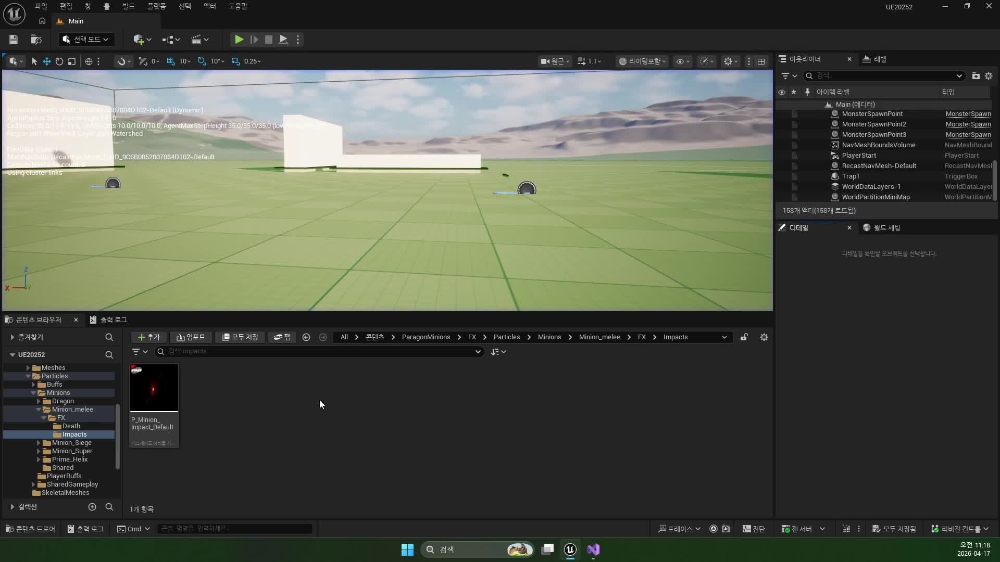
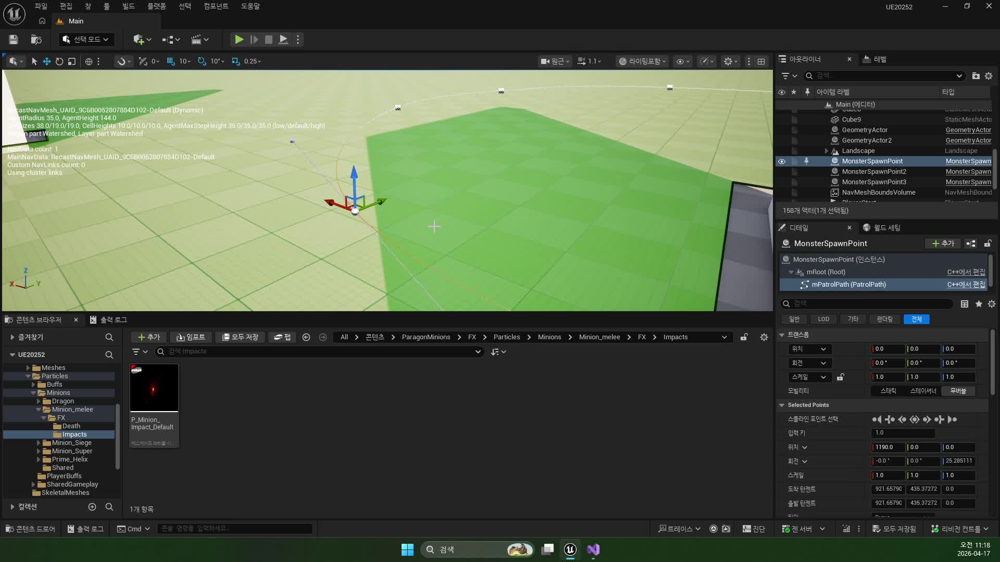
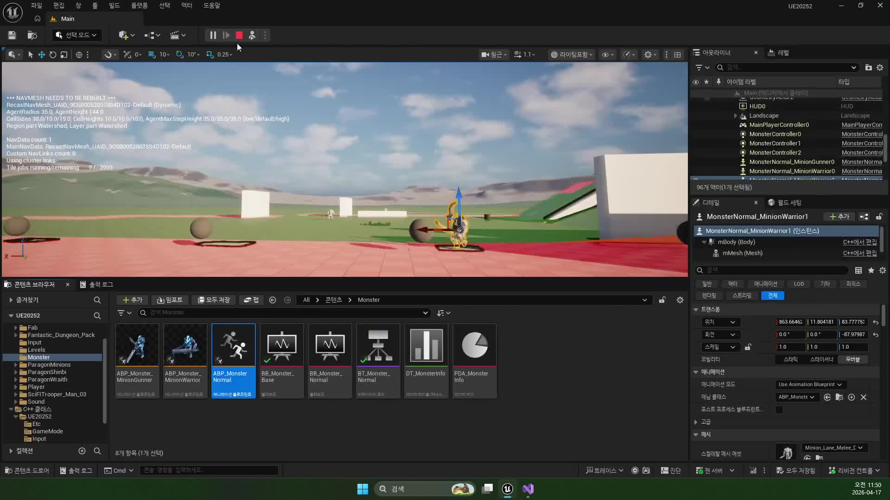

# 260417 01 Monster Wait Task와 비전투 대기

[260417 허브](../) | [다음: 02 Monster Patrol Task와 점 기반 루프](../02_intermediate_monster_patrol_task_and_point_loop/)

## 문서 개요

첫 강의의 목표는 몬스터가 전투 중이 아닐 때도 `완전히 멈춘 객체`가 아니라, 언제든 전투 브랜치로 넘어갈 준비가 된 비전투 상태로 보이게 만드는 데 있다.

## 1. 기본 `Wait` 노드만으로는 비전투 감각이 부족하다

가장 단순한 답은 엔진 기본 `Wait`를 쓰는 것이다.
하지만 강의는 이걸 일부러 피한다.
대기 중 플레이어가 감지돼도 즉시 반응해야 하기 때문이다.

즉 이번 장의 대기는 "정지"가 아니라 `반응 가능한 준비 상태`다.



## 2. 순찰하지 않는 몬스터도 같은 구조 안에서 처리할 수 있어야 한다

스플라인 점을 줄이면 대기형 몬스터처럼 보이게 만들 수 있다.
즉 비전투 패턴은 별도 몬스터 클래스로 나누지 않아도, SpawnPoint와 PatrolPoints 상태만으로 충분히 바뀔 수 있다.



이 설계 덕분에 같은 몬스터라도 레벨 배치만 바꿔 정지형, 왕복형, 루프형 패턴을 만들 수 있다.

## 3. `MonsterWait`는 대기 상태를 태스크 메모리에 저장한다

현재 `UBTTask_MonsterWait`의 핵심은 시간을 기다리는 것보다, `기다리는 상태를 어디에 둘 것인가`에 있다.
이 구현은 `FWaitTimer`를 `NodeMemory`에 올려 두고, 완료 여부를 태스크 전용 메모리에서 관리한다.

```cpp
uint16 UBTTask_MonsterWait::GetInstanceMemorySize() const
{
    return sizeof(FWaitTimer);
}
```

즉 여러 몬스터가 동시에 같은 태스크를 실행해도, 각자의 대기 타이머가 서로 섞이지 않는다.


## 4. `WaitTime`은 블랙보드 문맥으로 내려온다

`ExecuteTask()`는 아래 순서로 움직인다.

1. `Target`이 있으면 굳이 대기하지 않고 `Succeeded`
2. 몬스터 애니메이션을 `Idle`로 전환
3. 블랙보드 `WaitTime`을 읽음
4. 타이머를 걸고 `InProgress`

즉 대기 시간은 하드코딩 고정값이 아니라, 블랙보드가 공급하는 런타임 문맥이다.

## 5. 진짜 핵심은 `TickTask()`다

이번 장의 핵심은 타이머보다 `TickTask()`에 있다.
대기 중에도 `Target` 유무를 계속 봐야 하기 때문이다.

- `Target`이 생기면 `Succeeded`
- 시간이 다 되면 `Failed`

여기서 `Failed`는 오류가 아니라, 다음 비전투 행동인 Patrol을 열어 주는 제어 신호다.



## 정리

첫 강의의 결론은 "비전투 상태도 실시간 반응성을 가져야 한다"는 데 있다.
`MonsterWait`는 그냥 시간만 재는 노드가 아니라, 전투 감지를 계속 열어 둔 채 시간을 소비하는 상태 노드다.

[260417 허브](../) | [다음: 02 Monster Patrol Task와 점 기반 루프](../02_intermediate_monster_patrol_task_and_point_loop/)
