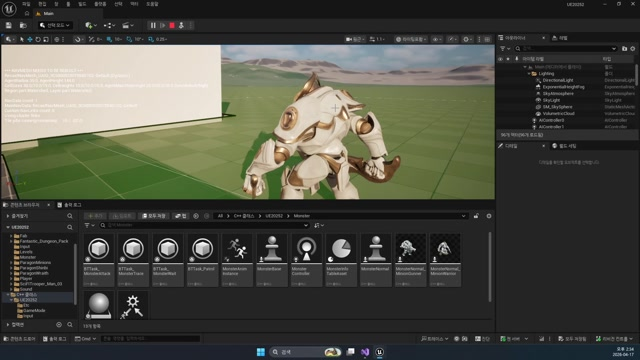

# 260417 02 Monster Patrol Task와 점 기반 루프

[260417 허브](../) | [이전: 01 Monster Wait Task와 비전투 대기](../01_intermediate_monster_wait_task_and_noncombat_state/) | [다음: 03 비전투 루프 디버깅](../03_intermediate_noncombat_loop_debugging/)

## 문서 개요

두 번째 강의는 스플라인 입력을 실제 순찰 루프로 번역하고, `대기 -> 이동 -> 다음 점 준비`가 반복되는 구조를 만드는 단계다.

## 1. 곡선을 그대로 따라가기보다 점 기반 이동이 더 단순하고 안정적이다

강의는 스플라인을 직접 추종하는 대신, 순찰 포인트 배열을 순차적으로 소비하는 방식을 택한다.
이렇게 하면 `MoveToLocation()`, 도착 판정, 다음 포인트 전환이 훨씬 단순해진다.


즉 스플라인은 편집용 입력이고, 실제 AI는 `PatrolPoints`라는 실행 데이터만 읽는 구조다.

## 2. 실제 이동은 `1번 인덱스`부터 시작하는 편이 자연스럽다

현재 구현의 중요한 디테일은 `mPatrolIndex = 1`이다.
0번 점은 대개 SpawnPoint의 시작 위치와 겹치기 때문에, 첫 이동 목표를 1번으로 두는 편이 자연스럽다.

```cpp
int32 mPatrolIndex = 1;

bool GetPatrolEnable() const
{
    return mPatrolPoints.Num() > 1;
}

FVector GetPatrolPoint() const
{
    return mPatrolPoints[mPatrolIndex];
}
```


즉 `GetPatrolEnable`, `GetPatrolPoint`, `NextPatrol` 세 함수만 이해해도 이번 날짜의 순찰 루프 절반은 읽힌다.

## 3. Patrol 태스크는 Trace 태스크의 단순 복사판이 아니다

`Patrol`은 `Target`이 없을 때만 의미가 있는 비전투 이동 태스크다.
그래서 `ExecuteTask()` 초반부는 아래 조건을 먼저 본다.

- `Target`이 있으면 전투 브랜치에 자리를 비켜 주기 위해 `Succeeded`
- `GetPatrolEnable()`이 거짓이면 `Failed`
- `MoveToLocation(GetPatrolPoint())`가 실패하면 `Failed`
- 정상 시작이면 애니메이션을 `Walk`로 바꾸고 `InProgress`

즉 Patrol은 전투와 경쟁하는 최상위 기능이 아니라, `비전투 상태에서만 의미가 있는 기본 이동`이다.

## 4. `TickTask()`는 도착 판정을 직접 본다

현재 구현은 `GetMoveStatus()`와 거리 판정을 같이 본다.
특히 Patrol 포인트는 액터가 아니라 `FVector`이므로, 몬스터 위치 쪽만 캡슐 높이를 보정해 바닥 기준 거리처럼 계산한다.




이 장면이 중요한 이유는, 순찰 버그가 보통 길찾기 자체보다 `종료 조건 조합`에서 더 자주 나오기 때문이다.

## 5. `OnTaskFinished()`가 루프를 완성한다

태스크가 끝나면 현재 이동을 정리하고, 다음 순찰 인덱스를 준비한다.
그래서 `MonsterWait -> MonsterPatrol -> MonsterWait -> MonsterPatrol`이 반복되면서도 매번 다른 점을 향해 걷는 루프가 된다.


현재 branch에서도 이 개념은 그대로 유효하다.
코드상 대응물은 `UBTTask_PatrolGAS`이고, 구조는 거의 동일하다.
즉 대상 본체만 `AMonsterGAS`로 바뀌었을 뿐, 비전투 순찰 루프의 모양은 유지된다.

## 정리

두 번째 강의의 결론은 Patrol의 핵심이 이동 함수보다 `루프 구조`에 있다는 점이다.
`GetPatrolEnable`, `GetPatrolPoint`, `NextPatrol`, 종료 조건이 맞물릴 때 비로소 몬스터는 필드에서 자연스럽게 시간을 보낸다.

[260417 허브](../) | [이전: 01 Monster Wait Task와 비전투 대기](../01_intermediate_monster_wait_task_and_noncombat_state/) | [다음: 03 비전투 루프 디버깅](../03_intermediate_noncombat_loop_debugging/)
