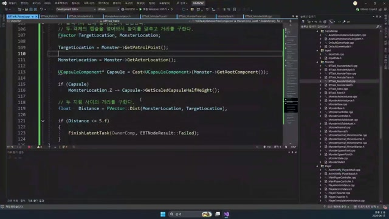

# 260417 03 비전투 루프 디버깅

[260417 허브](../) | [이전: 02 Monster Patrol Task와 점 기반 루프](../02_intermediate_monster_patrol_task_and_point_loop/) | [다음: 04 공식 문서 부록](../04_appendix_official_docs_reference/)

## 문서 개요

세 번째 강의는 새 기능보다 `왜 지금 이상하게 보이는가`를 해부하는 시간에 가깝다.
비전투 루프는 코드 한 줄보다도 `Blackboard`, 종료 조건, 순찰 배열, 브랜치 흐름`이 서로 엇갈리며 깨지는 경우가 많다.

## 1. 첫 점검은 Blackboard와 BT 브랜치부터 시작한다

비전투 루프가 이상하면 가장 먼저 볼 것은 `Target`과 `WaitTime`이다.

- `Target`이 이미 있으면 `Wait`와 `Patrol`은 둘 다 전투 브랜치에 자리를 비켜 준다
- `WaitTime`이 너무 작으면 대기 연출이 거의 보이지 않는다

즉 "대기가 안 돈다"는 현상도 실제로는 비전투 브랜치에 아예 들어가지 못한 문제일 수 있다.

## 2. Patrol 버그는 종료 조건의 조합에서 자주 생긴다

현재 코드 기준으로 아래 조합을 같이 봐야 한다.

- `PathStatus == Idle`이 너무 빨리 잡히는가
- 거리 판정 `Distance <= 5.f`가 너무 이른가
- `mPatrolIndex`가 0에서 잘못 시작되는가
- `GetPatrolEnable()`이 애초에 거짓인가

즉 많은 순찰 버그는 길찾기 자체보다 `지금 이 태스크가 왜 끝나도 된다고 판단되었는가`를 읽어야 풀린다.

## 3. 스폰 포인트와 순찰 배열도 같이 봐야 한다

`MonsterSpawnPoint::OnConstruction()`은 스플라인 점을 `mPatrolPoints` 배열로 바꾸고, `SpawnMonster()`는 그 배열을 스폰된 몬스터에게 넘긴다.
즉 순찰이 이상하면 BT만 볼 것이 아니라, SpawnPoint가 실제로 몇 개의 점을 넘겼는지도 확인해야 한다.

점이 하나뿐이면 의도적으로 대기형 몬스터가 된다.
이때는 Patrol이 안 도는 게 버그가 아니라 설계 결과다.

## 4. 레벨 블루프린트나 에디터 문맥도 함정이 될 수 있다

강의 후반부가 "엔진 버그 수정"처럼 보이는 이유는, 실제 문제가 C++ 태스크 한 줄보다도 에디터 문맥이나 레벨 쪽 설정과 얽혀 있을 수 있기 때문이다.

즉 `Blackboard -> 태스크 종료 이유 -> Patrol 배열 -> 에디터 문맥` 순으로 좁혀 가는 습관이 중요하다.

## 정리

세 번째 강의의 결론은 비전투 루프 버그를 `Blackboard`, `브랜치`, `거리 판정`, `순찰 배열` 순으로 분리해서 보는 데 있다.
이번 날짜의 핵심은 기능 추가보다 `AI를 필드에 안전하게 놓는 법`을 배우는 데 있다.

[260417 허브](../) | [이전: 02 Monster Patrol Task와 점 기반 루프](../02_intermediate_monster_patrol_task_and_point_loop/) | [다음: 04 공식 문서 부록](../04_appendix_official_docs_reference/)
